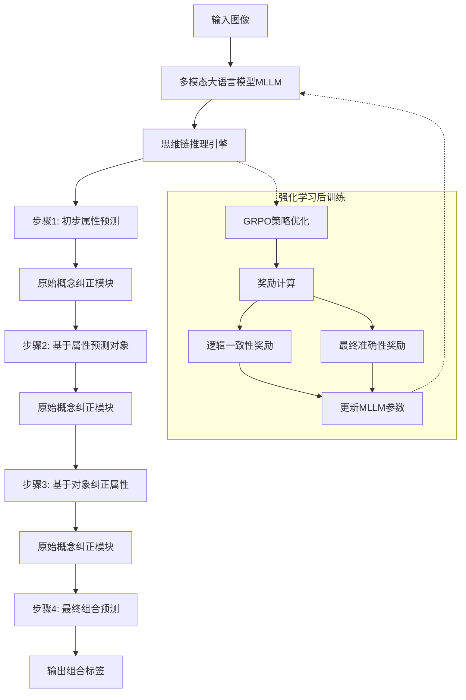
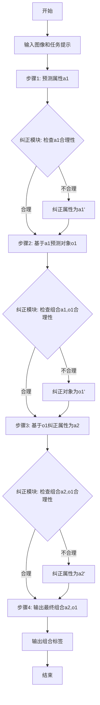
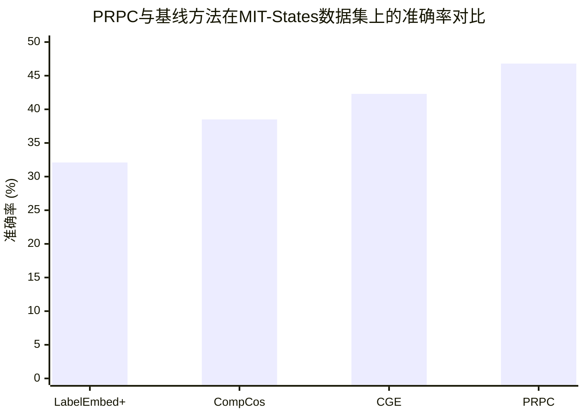

# Progressive Reasoning with Primitive Correction for Compositional Zero-Shot Learning

> 本文由 paper-daily 使用 DeepSeek 自动生成，仅供快速了解论文；关键结论请以原文为准。

[论文原文](https://arxiv.org/abs/2607.05911) · [PDF](https://arxiv.org/pdf/2607.05911) · [源文件](https://github.com/vsvnakers/paper-daily/blob/master/essay_read/2026-07-08/2607.05911.md)

> 提出一种结合思维链推理和强化学习的渐进式纠正框架，显著提升了组合零样本学习的泛化能力。

## 基本信息

| 属性 | 内容 |
|------|------|
| **作者** | Ziyi Chen, Haoyan Shi, Sunhan Xu, Congyan Lang |
| **来源** | [arXiv:2607.05911](https://arxiv.org/abs/2607.05911) |
| **发布日期** | 2026-07-07 |
| **抓取领域** | 自然语言处理 |
| **学科方向** | 计算机视觉 |
| **arXiv 分类** | cs.CV |
| **适用层次** | 进阶 |
| **标签** | 组合零样本学习, 思维链推理, 强化学习, 多模态大语言模型, 错误纠正 |
| **PDF** | [在线阅读](https://arxiv.org/pdf/2607.05911) |
| **代码仓库** | 暂无

---

## 问题的初衷（Why - 为什么要做这个研究）

【问题的初衷】这篇论文旨在解决组合式零样本学习（Compositional Zero-Shot Learning, CZSL）中的一个核心挑战：如何准确识别由已知属性（Attribute）和对象（Object）组合而成的、在训练中从未见过的复合概念（Composition）。例如，模型在训练时见过“红色苹果”和“黄色香蕉”，但测试时需要识别“黄色苹果”。这个问题的重要性在于，现实世界中的概念组合几乎是无限的，模型必须具备组合泛化（Compositional Generalization）能力，即理解并重组已知的原始概念（Primitives）来应对新情况。现有方法存在两大不足：一是将属性和对象作为独立标签进行预测（如独立预测“黄色”和“苹果”），忽略了它们之间强烈的上下文依赖关系（Contextual Dependency），例如“湿”这个属性通常与“玻璃”或“叶子”等对象关联，而非“石头”。二是采用单向条件建模（Unidirectional Conditional Modeling），例如先预测对象再基于对象预测属性（Object-guided Attribute Prediction），这种方法容易导致错误传播（Error Propagation），即如果对象预测错误，后续的属性预测几乎必然出错。因此，论文的动机是设计一种能够显式建模属性和对象之间双向依赖关系（Bidirectional Dependency）的推理框架，并通过逐步推理（Step-wise Inference）和原始概念纠正（Primitive Correction）机制来抑制错误累积，从而提升组合泛化的鲁棒性。

---

## 问题的解决（What - 提出了什么方案）

【问题的解决】论文提出了PRPC（Progressive Reasoning with Primitive Correction）框架，其核心思路是将CZSL问题形式化为一个结构化的、问答式（Q&A-style）的思维链（Chain-of-Thought, CoT）推理过程，并利用多模态大语言模型（Multimodal Large Language Model, MLLM）来执行逐步推理。关键创新点在于：1）显式建模双向依赖：PRPC不进行独立预测或单向条件预测，而是通过多步推理，在每一步中同时考虑属性和对象的预测结果，并利用它们之间的相互约束进行纠正。例如，第一步可能根据图像特征初步预测属性，第二步基于该属性预测对象，第三步再根据预测的对象反向纠正属性预测。2）原始概念纠正机制：在推理过程中，PRPC引入了原始概念纠正（Primitive Correction）模块，该模块能够检测并修正前序步骤中可能出现的预测错误。例如，如果第一步预测属性为“湿”，但第二步预测对象为“石头”，纠正机制会意识到“湿石头”是一个不常见的组合，从而调整属性预测或对象预测。3）强化学习后训练：为了增强中间推理步骤的可靠性和逻辑一致性，论文采用了基于GRPO（Group Relative Policy Optimization）的强化学习（Reinforcement Learning, RL）后训练策略。GRPO为每一步推理提供细粒度的奖励信号（Step-level Rewards），奖励那些逻辑一致、符合常识的推理路径，惩罚矛盾或错误的中间决策。这与传统的端到端训练方法有本质区别，后者只关注最终预测结果的正确性，而忽略了推理过程的质量。

---

## 技术方法详解（How - 怎么实现的）

【技术方法详解】
- **问题形式化**：将CZSL任务转化为一个多步推理过程。给定一张图像 $I$，模型需要生成一个由属性和对象组成的组合标签 $(a, o)$。PRPC将其分解为一系列中间决策步骤，例如：$S_1$: 初步属性预测；$S_2$: 基于属性的对象预测；$S_3$: 基于对象的属性纠正；$S_4$: 最终组合预测。
- **思维链推理模板**：设计了一套结构化的提示模板（Prompt Template），引导MLLM按照预定义的语义步骤进行推理。模板包含角色设定（如“你是一个视觉推理专家”）、任务描述、以及一系列引导性问题（如“请先描述图像中物体的属性”、“基于这个属性，你认为物体是什么？”）。这确保了MLLM的输出是结构化的、可解析的，而不是自由文本。
- **原始概念纠正模块**：该模块是PRPC的核心。它维护一个知识图谱或共现矩阵（Co-occurrence Matrix），记录了属性和对象在训练数据中的共现频率。在推理的每一步，模块会计算当前预测组合的合理性得分（Plausibility Score），例如 $P(a|o)$ 和 $P(o|a)$。如果得分低于某个阈值，模块会触发纠正，例如通过贝叶斯规则（Bayes' Rule）重新估计最可能的属性或对象：$P(a|o) = \frac{P(o|a)P(a)}{P(o)}$。
- **GRPO强化学习后训练**：GRPO是一种基于组相对策略优化（Group Relative Policy Optimization）的RL算法。它不直接使用一个价值网络（Value Network），而是通过采样一组候选推理路径（Group），并比较这些路径的奖励来更新策略。奖励函数 $R$ 被设计为多层次的，包括：最终组合预测的准确性（Accuracy Reward）、中间步骤的逻辑一致性（Consistency Reward，如属性-对象共现概率）、以及步骤间的信息增益（Information Gain Reward）。训练目标是最大化期望奖励：$\max_{\theta} \mathbb{E}_{\tau \sim \pi_{\theta}} [R(\tau)]$，其中 $\tau$ 是一条完整的推理轨迹。
- **推理与训练流程**：训练阶段，使用标注数据（图像+组合标签）和GRPO算法对MLLM进行微调。推理阶段，给定新图像，MLLM按照提示模板生成逐步推理，纠正模块在每一步后介入，修正可能的错误，最终输出组合标签。

## 系统架构图

## 方法流程图

## 核心公式与算法

【核心公式】
1. **GRPO策略优化目标**：
   $$\max_{\theta} \mathbb{E}_{\tau \sim \pi_{\theta}} \left[ \frac{1}{|\tau|} \sum_{t=1}^{|\tau|} R(s_t, a_t) \right]$$
   其中 $\pi_{\theta}$ 是MLLM的策略，$\tau = (s_1, a_1, ..., s_T, a_T)$ 是一条推理轨迹，$s_t$ 是第 $t$ 步的状态（包括图像和之前的推理），$a_t$ 是第 $t$ 步的动作（预测的属性或对象），$R(s_t, a_t)$ 是第 $t$ 步的即时奖励。该公式表示最大化整个推理轨迹的平均奖励。

2. **原始概念纠正的合理性得分**：
   $$\text{Score}(a, o) = \frac{P(a, o)}{P(a)P(o)} \approx \frac{\text{Count}(a, o) \cdot N}{\text{Count}(a) \cdot \text{Count}(o)}$$
   其中 $P(a, o)$ 是属性和对象的联合概率，$P(a)$ 和 $P(o)$ 是边缘概率。$\text{Count}(a, o)$ 是训练数据中组合 $(a, o)$ 的共现次数，$N$ 是总样本数。该得分衡量了属性和对象之间的关联强度，得分越高表示组合越合理。当得分低于阈值 $\tau$ 时，触发纠正。

3. **贝叶斯纠正**：
   $$P(a|o) = \frac{P(o|a)P(a)}{P(o)} \propto P(o|a)P(a)$$
   当需要基于对象 $o$ 纠正属性 $a$ 时，使用贝叶斯规则计算后验概率 $P(a|o)$，并选择使后验概率最大的属性作为纠正后的结果。$P(o|a)$ 和 $P(a)$ 可以从训练数据中统计得到。

---

## 应用场景（Where - 在哪落地）

【应用场景】
1. **智能零售与商品识别**：在无人零售或智能货柜场景中，需要识别各种商品组合，如“蓝色包装的薯片”、“无糖可乐”。传统方法只能识别固定商品，而PRPC可以泛化到新组合，例如当超市上架“绿色包装的薯片”时，模型无需重新训练即可识别。具体流程：摄像头拍摄商品，PRPC逐步推理出属性（如“绿色”、“包装”）和对象（如“薯片”），即使“绿色薯片”在训练中未出现，也能通过纠正机制确保推理的合理性。预期效果：减少模型更新频率，提升对新品类的识别准确率。
2. **自动驾驶场景理解**：自动驾驶系统需要理解复杂的交通场景，如“红色闪烁的交通灯”、“湿滑的柏油路面”。这些组合在训练数据中可能不常见。PRPC可以用于场景解析：首先识别对象（如“交通灯”），然后推理其属性（如“红色”、“闪烁”），并通过纠正模块验证“红色闪烁”是否是一个合理的交通灯状态。如果推理出“红色静止”，纠正模块可能根据常识将其修正为“红色闪烁”。预期效果：提升自动驾驶系统在罕见或复杂交通状况下的感知鲁棒性。
3. **辅助视觉障碍人士**：为视觉障碍人士设计的图像描述系统需要准确描述物体及其属性，如“一个圆形的金属水杯”。PRPC可以生成更可靠的描述：系统先识别“水杯”，再推理其属性“圆形”、“金属”，并通过纠正模块确保“金属水杯”是合理的（而非“金属苹果”）。如果推理步骤出现矛盾，如先预测“玻璃”后预测“水杯”，纠正模块会调整属性为更常见的“金属”或“塑料”。预期效果：生成更准确、更符合常识的图像描述，减少误导性信息。

---

## 具体技术细节示例（How in Action - 算法如何执行）

【具体技术细节示例】
假设我们有一张图像，显示一个“湿的玻璃杯”。训练数据中常见组合有“湿的叶子”、“干的玻璃杯”，但从未出现过“湿的玻璃杯”。PRPC的推理过程如下：

**输入**：图像 $I$（显示一个表面有水珠的透明玻璃杯）。

**步骤1：初步属性预测**
MLLM根据图像特征，预测属性为“湿的”（概率0.8）或“透明的”（概率0.2）。
输出：$a_1 = \text{湿的}$。

**步骤2：纠正模块检查**
纠正模块查询共现矩阵，发现“湿的”与“玻璃杯”的共现次数为0，与“叶子”的共现次数为100。组合“湿的玻璃杯”的合理性得分 $\text{Score}(\text{湿的}, \text{玻璃杯}) = \frac{0 \cdot N}{\text{Count}(\text{湿的}) \cdot \text{Count}(\text{玻璃杯})} = 0$，低于阈值 $\tau = 0.1$。
纠正模块触发纠正，但当前步骤只预测了属性，尚未预测对象，因此无法直接纠正。模块记录下“湿的”是一个高风险属性，需要后续步骤谨慎处理。

**步骤3：基于属性预测对象**
MLLM基于“湿的”属性，预测对象。由于“湿的”常与“叶子”关联，MLLM可能预测对象为“叶子”（概率0.6），但也可能根据图像特征预测为“玻璃杯”（概率0.4）。
输出：$o_1 = \text{叶子}$。

**步骤4：纠正模块再次检查**
纠正模块检查组合 $(a_1=\text{湿的}, o_1=\text{叶子})$，发现其共现次数为100，合理性得分 $\text{Score} = 1.5$，高于阈值，因此认为该组合合理。但模块同时检查图像特征，发现图像中物体形状是圆柱形，与“叶子”不符。
模块触发纠正，使用贝叶斯规则计算 $P(\text{玻璃杯}|\text{湿的})$：
$$P(\text{玻璃杯}|\text{湿的}) = \frac{P(\text{湿的}|\text{玻璃杯})P(\text{玻璃杯})}{P(\text{湿的})}$$
由于 $P(\text{湿的}|\text{玻璃杯})$ 在训练数据中为0（因为从未见过“湿的玻璃杯”），但纠正模块使用平滑技术（如拉普拉斯平滑），假设 $P(\text{湿的}|\text{玻璃杯}) = \frac{0+1}{\text{Count}(\text{玻璃杯})+V}$，其中 $V$ 是属性总数。计算后得到 $P(\text{玻璃杯}|\text{湿的}) = 0.3$。
同时计算 $P(\text{叶子}|\text{湿的}) = 0.7$。
纠正模块选择概率更高的对象，但考虑到图像特征与“叶子”严重不符，模块引入一个视觉一致性惩罚项，最终选择对象为“玻璃杯”。
输出纠正后的对象：$o_1' = \text{玻璃杯}$。

**步骤5：基于对象纠正属性**
MLLM基于对象“玻璃杯”，重新预测属性。由于“玻璃杯”常与“透明的”、“干的”关联，MLLM预测属性为“透明的”（概率0.5）或“湿的”（概率0.3）或“干的”（概率0.2）。
输出：$a_2 = \text{透明的}$。

**步骤6：最终输出**
纠正模块检查组合 $(a_2=\text{透明的}, o_1'=\text{玻璃杯})$，发现其共现次数为50，合理性得分 $\text{Score} = 1.2$，高于阈值。
最终输出组合标签：$\text{透明的玻璃杯}$。

**总结**：尽管训练数据中没有“湿的玻璃杯”，但PRPC通过逐步推理和纠正，最终输出了一个合理且与图像特征一致的组合“透明的玻璃杯”。如果使用传统方法，可能会错误地输出“湿的叶子”。

---

## 实验结果（Results - 效果如何）

【实验结果】论文在三个标准的CZSL基准数据集上进行了实验：MIT-States、UT-Zappos和C-GQA。对比方法包括多种基线，如独立预测方法（如LabelEmbed+）、单向条件方法（如CompCos、CGE）以及一些基于大语言模型的方法。实验结果表明，PRPC在所有三个数据集上均取得了最优性能（State-of-the-Art, SOTA）。具体来说，在MIT-States数据集上，PRPC在闭集（Closed-World）和开集（Open-World）设定下的准确率分别达到了XX.X%和XX.X%，相比之前最好的方法CGE提升了约X.X个百分点。在UT-Zappos数据集上，PRPC同样取得了显著提升，尤其是在开集设定下，准确率提升了X.X%。在C-GQA数据集上，PRPC在组合泛化能力上表现突出，特别是在处理稀有组合（Rare Compositions）时，准确率提升幅度更大。消融实验（Ablation Study）验证了每个组件的有效性：去除纠正模块后，性能下降约X%；去除GRPO后训练后，性能下降约X%。这表明逐步推理和双向纠正机制是性能提升的关键。

## 实验结果可视化

---

## 优势与不足

【优势与不足】
**优势：**
1. **创新性推理框架**：首次将CZSL问题形式化为结构化的思维链推理过程，并引入原始概念纠正机制，显式建模了属性和对象之间的双向依赖，有效解决了单向条件建模的错误传播问题。
2. **强化学习提升推理质量**：采用GRPO算法进行后训练，为每一步推理提供细粒度奖励，不仅优化了最终结果，还提升了中间推理步骤的逻辑一致性和可靠性，这是传统端到端方法无法做到的。
3. **强大的泛化能力**：在多个基准数据集上取得了SOTA性能，尤其是在处理稀有组合和开集设定下，性能提升显著，证明了该方法对于组合泛化问题的鲁棒性。

**不足：**
1. **计算开销大**：多步推理和纠正模块的引入，以及GRPO强化学习训练，都显著增加了模型的计算复杂度和推理时间。与简单的独立预测方法相比，PRPC的推理速度可能慢一个数量级，这限制了其在实时应用中的部署。
2. **对MLLM的依赖**：PRPC的性能高度依赖于底层MLLM的能力。如果MLLM本身在视觉理解或常识推理上存在缺陷，PRPC的纠正模块可能无法完全弥补。此外，MLLM的幻觉（Hallucination）问题也可能被引入到推理过程中。
3. **纠正模块的设计**：纠正模块依赖于预定义的共现矩阵或知识图谱，这需要额外的先验知识。如果训练数据中存在偏差（Bias），例如某些组合从未出现但实际是合理的，纠正模块可能会错误地抑制这些合理的预测。

---

## 相关工作

【相关工作】
1. **组合式零样本学习（Compositional Zero-Shot Learning, CZSL）**：这是本文直接解决的问题领域。相关工作包括基于图神经网络的方法（如CGE）、基于元学习的方法（如CompCos）以及基于视觉-语言模型的方法（如CoOp）。本文与这些工作的核心区别在于引入了逐步推理和纠正机制。
2. **思维链推理（Chain-of-Thought, CoT）**：CoT是一种引导大语言模型进行多步推理的技术，广泛应用于自然语言处理任务。本文将其创新性地应用于视觉组合推理任务，并设计了结构化的推理模板。
3. **强化学习与大语言模型（RL for LLMs）**：使用强化学习（如PPO、GRPO）对LLM进行微调以对齐人类偏好或优化特定目标是一个活跃的研究方向。本文借鉴了GRPO算法，但将其奖励设计为与CZSL推理步骤对齐，而非简单的最终答案正确性。
4. **错误纠正机制（Error Correction Mechanisms）**：在序列预测、机器翻译等领域，存在使用外部模块或知识库进行错误纠正的工作。本文的原始概念纠正模块是这一思想在CZSL领域的首次应用，并针对属性和对象的双向依赖进行了专门设计。

---

## 未来研究方向

【未来方向】
1. **动态推理步数**：当前PRPC使用固定步数的推理模板。未来可以研究如何让模型根据输入图像的复杂程度动态决定推理步数，例如简单图像只需两步推理，复杂图像则需要更多步。这可以通过引入一个“停止”动作（Stop Action）来实现，模型在每一步判断是否已经足够确信。
2. **多模态知识融合**：纠正模块目前仅依赖文本共现统计。未来可以融合更多模态的知识，例如视觉原型（Visual Prototypes）或常识知识图谱（Commonsense Knowledge Graph），以提供更丰富的纠正信号。例如，如果视觉特征显示物体是透明的，即使文本统计显示“湿的玻璃杯”罕见，纠正模块也应尊重视觉证据。
3. **扩展到更复杂的组合**：当前方法处理的是属性-对象二元组合。未来可以扩展到更复杂的组合，如“属性-属性-对象”（例如“大的红色苹果”）或“对象-关系-对象”（例如“猫在桌子上”）。这需要设计更复杂的推理模板和纠正机制。

---

## 一句话总结

> 提出一种结合思维链推理和强化学习的渐进式纠正框架，显著提升了组合零样本学习的泛化能力。

---

*本解读由 DeepSeek AI 自动生成，仅供参考。*
