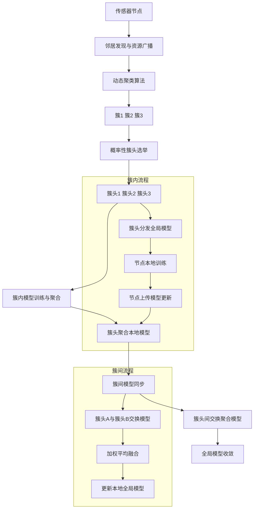
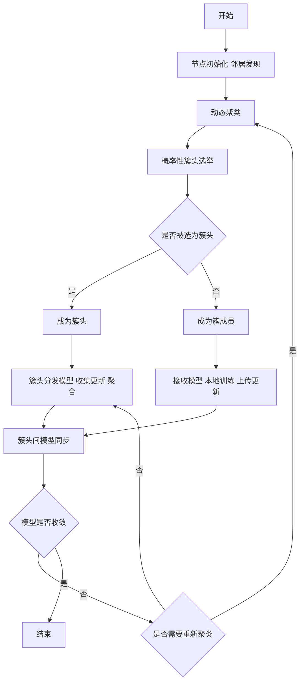
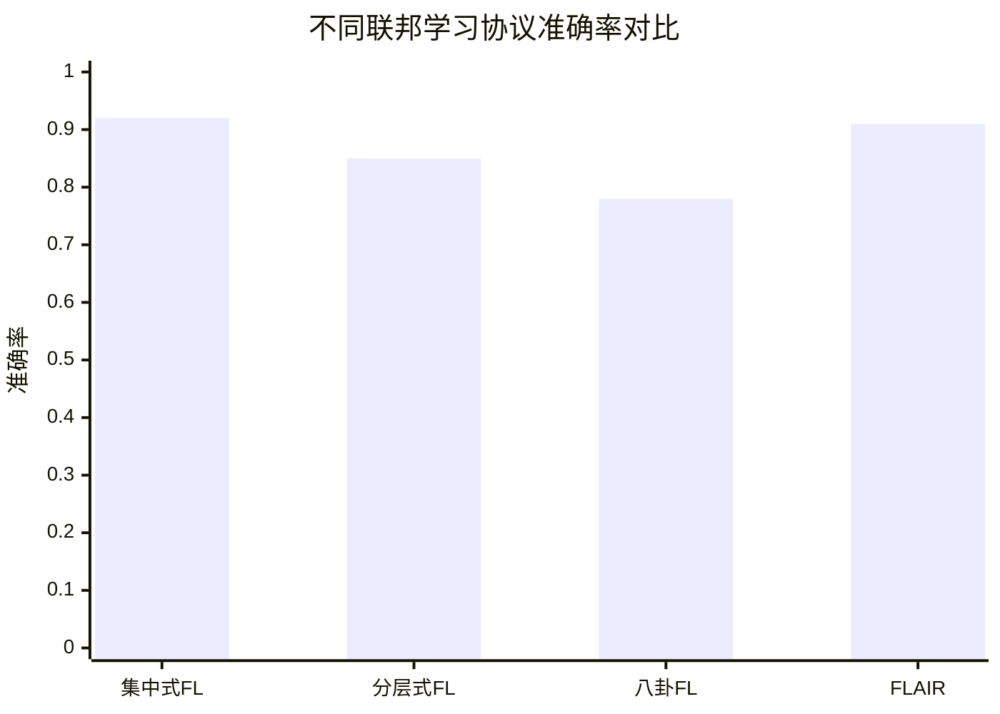

# FLAIR: Distributed Federated Learning with Dynamic Clustering

> 本文由 paper-daily 使用 DeepSeek 自动生成，仅供快速了解论文；关键结论请以原文为准。

[论文原文](https://arxiv.org/abs/2607.06025) · [PDF](https://arxiv.org/pdf/2607.06025) · [源文件](https://github.com/vsvnakers/paper-daily/blob/master/essay_read/2026-07-08/2607.06025.md)

> FLAIR提出了一种完全去中心化、动态聚类的联邦学习协议，通过资源感知的簇头选举和簇间同步，实现了在动态异构网络中的高鲁棒性和可扩展性。

## 基本信息

| 属性 | 内容 |
|------|------|
| **作者** | Ihssan Boutebicha, Bilel Zaghdoudi, Mohamed Amine Legheraba, Maria Potop Butucaru |
| **来源** | [arXiv:2607.06025](https://arxiv.org/abs/2607.06025) |
| **发布日期** | 2026-07-07 |
| **抓取领域** | 强化学习 |
| **学科方向** | 网络通信 |
| **arXiv 分类** | cs.NI |
| **适用层次** | 进阶 |
| **标签** | 联邦学习, 去中心化, 动态聚类, 簇头选举, 物联网 |
| **PDF** | [在线阅读](https://arxiv.org/pdf/2607.06025) |
| **代码仓库** | 暂无

---

## 问题的初衷（Why - 为什么要做这个研究）

【问题的初衷】传统的联邦学习（Federated Learning, FL）架构主要分为集中式（Centralized）和分层式（Hierarchical）两种。在集中式FL中，所有客户端（Client）将模型更新发送给一个中央服务器（Central Server）进行聚合，这导致了严重的单点故障（Single Point of Failure）问题：一旦中央服务器宕机或被攻击，整个训练过程将瘫痪。此外，中央服务器的通信带宽成为瓶颈，难以扩展到大规模网络（如拥有数千个传感器的物联网系统）。分层式FL虽然引入边缘服务器（Edge Server）来缓解压力，但本质上仍依赖固定的基础设施，在动态、无基础设施的环境（如战场通信、灾难救援、传感器网络）中部署困难。现有方法在面对节点动态加入/离开、网络拓扑变化、节点计算能力异构（Heterogeneous）以及高节点故障率时，表现出性能急剧下降、收敛缓慢甚至无法收敛的问题。因此，亟需一种完全去中心化（Fully Decentralized）、具有鲁棒性（Robustness）和可扩展性（Scalability）的联邦学习协议，能够在无中心节点、节点动态变化的环境中高效运行。

---

## 问题的解决（What - 提出了什么方案）

【问题的解决】论文提出了FLAIR（Federated Learning with Adaptive, Intelligent, and Resilient clustering），一种全新的、完全去中心化的联邦学习协议。其核心思路是：将网络中的节点动态地组织成多个簇（Cluster），每个簇内部进行本地模型训练和聚合，簇之间通过簇头（Cluster Head, CH）进行模型交换，从而实现全局模型的收敛。FLAIR的关键创新点包括：1）动态、资源感知的聚类机制：节点根据自身的计算能力、通信带宽和可用能量等资源，自组织（Self-Organize）成簇，确保簇内节点资源相近，避免慢节点拖累整体训练。2）概率性、可验证的簇头选举机制：簇头选举不是随机的，而是通过一个概率函数，该函数倾向于选择资源更丰富的节点，同时通过可验证随机函数（Verifiable Random Function, VRF）保证选举过程的公平性和可验证性，防止恶意节点操纵选举。3）簇内模型训练与聚合：簇头负责收集簇内节点的模型更新，进行聚合（如FedAvg），然后将聚合后的模型广播给簇内节点和相邻簇头。4）完全去中心化：没有中央服务器，所有节点地位平等，通过簇头之间的通信实现全局模型同步。与现有方法的本质区别在于，FLAIR将去中心化学习的可扩展性与聚类的结构效率相结合，实现了在动态、异构环境下的鲁棒高效训练。

---

## 技术方法详解（How - 怎么实现的）

【技术方法详解】
- **网络初始化与邻居发现**：每个节点广播自己的身份和资源信息（如CPU频率、内存、可用带宽、电池电量），建立邻居表（Neighbor Table）。节点根据接收到的信标（Beacon）信号强度估计距离，形成初始的物理或逻辑拓扑。
- **动态聚类算法**：基于节点的资源向量（Resource Vector）和地理位置，采用一种改进的K-means或谱聚类（Spectral Clustering）的分布式变体。每个节点独立计算自己属于哪个簇，通过迭代交换聚类归属信息来达成一致。聚类目标是最小化簇内节点间的资源差异和通信距离，同时最大化簇间独立性。
- **概率性簇头选举**：每个簇内的节点根据一个概率函数 $P(i) = \frac{w_i}{\sum_{j \in C} w_j}$ 被选为簇头，其中 $w_i$ 是节点 $i$ 的权重，综合了其计算能力 $C_i$、通信带宽 $B_i$ 和剩余能量 $E_i$，即 $w_i = \alpha C_i + \beta B_i + \gamma E_i$，$\alpha, \beta, \gamma$ 为可调系数。选举过程使用可验证随机函数（VRF）生成一个随机数 $r_i$，如果 $r_i < P(i)$，则节点自荐为簇头，并广播一个包含VRF证明的消息，其他节点可以验证该证明的有效性。
- **簇内模型训练与聚合**：簇头（CH）初始化全局模型参数 $\theta_{global}$，并分发给簇内成员。每个成员使用本地数据训练 $E$ 个epoch，得到更新后的模型参数 $\theta_i$，然后发送给CH。CH使用联邦平均（Federated Averaging, FedAvg）算法聚合：$\theta_{cluster} = \frac{1}{N_c} \sum_{i=1}^{N_c} \theta_i$，其中 $N_c$ 是簇内节点数。聚合后的模型 $\theta_{cluster}$ 被广播回簇内节点，并发送给相邻簇的簇头。
- **簇间模型同步**：簇头之间通过点对点（Peer-to-Peer）通信交换各自的簇聚合模型。每个簇头维护一个相邻簇头列表，定期与它们交换模型。簇头收到相邻簇头的模型后，使用加权平均（权重为簇大小）进行融合：$\theta_{global}^{new} = \frac{\sum_{k \in N_{CH}} |C_k| \cdot \theta_k}{\sum_{k \in N_{CH}} |C_k|}$，其中 $N_{CH}$ 是当前簇头及其相邻簇头的集合，$|C_k|$ 是簇 $k$ 的大小。
- **动态适应机制**：节点定期评估网络状态（如节点加入/离开、资源变化、链路质量）。如果检测到簇内节点数量过少或过多，或者簇头资源不足，则触发重新聚类（Re-clustering）过程。重新聚类是局部进行的，只影响相关簇，避免全局震荡。

## 系统架构图

## 方法流程图

## 核心公式与算法

【核心公式】
1. **节点权重计算**：用于簇头选举，综合评估节点的资源能力。
   $$w_i = \alpha \cdot C_i + \beta \cdot B_i + \gamma \cdot E_i$$
   其中 $C_i$ 是计算能力（如CPU频率），$B_i$ 是通信带宽，$E_i$ 是剩余能量，$\alpha, \beta, \gamma$ 是权重系数。

2. **概率性簇头选举概率**：节点 $i$ 被选为簇头的概率与其权重成正比。
   $$P(i) = \frac{w_i}{\sum_{j \in C} w_j}$$
   其中 $C$ 是节点 $i$ 所属的簇。

3. **簇间模型融合**：簇头通过加权平均融合来自相邻簇头的模型。
   $$\theta_{global}^{new} = \frac{\sum_{k \in N_{CH}} |C_k| \cdot \theta_k}{\sum_{k \in N_{CH}} |C_k|}$$
   其中 $N_{CH}$ 是当前簇头及其相邻簇头的集合，$|C_k|$ 是簇 $k$ 的大小，$\theta_k$ 是簇 $k$ 的聚合模型。

---

## 应用场景（Where - 在哪落地）

【应用场景】
1. **智能农业（Smart Farming）**：在广阔的农田中部署大量传感器节点（如温度、湿度、土壤成分传感器），这些节点需要协作训练一个模型来预测作物生长状况或病虫害。由于农田面积大、网络基础设施薄弱，且节点可能因电池耗尽而失效，FLAIR的去中心化、高鲁棒性特点非常适合。节点可以自组织成簇（例如，同一块田地的传感器组成一个簇），簇头负责聚合本地模型，簇头之间通过无线通信交换模型。即使部分节点故障，系统仍能正常工作，准确率损失极小。

2. **灾难救援网络（Disaster Response Networks）**：在地震、洪水等灾难发生后，通信基础设施往往被破坏。救援人员携带的移动设备（如手机、无人机、可穿戴设备）需要快速建立一个临时网络，协作训练一个模型来识别被困人员或评估建筑损毁程度。FLAIR允许这些设备动态加入/离开网络，无需任何中心节点。设备根据自身计算能力和电量选举簇头，簇内训练和簇间同步可以在不稳定的网络条件下高效进行，确保救援决策的及时性和准确性。

3. **战场通信与态势感知（Battlefield Communication and Situational Awareness）**：在军事行动中，士兵、车辆、无人机等节点组成一个移动自组织网络（Mobile Ad Hoc Network, MANET），需要协作训练一个模型来识别敌方目标或预测战场态势。FLAIR能够应对节点的高速移动和频繁的拓扑变化，通过动态聚类和鲁棒的簇头选举，保证模型训练的连续性和准确性。即使部分节点被摧毁，系统也能通过重新聚类快速恢复，维持作战能力。

---

## 具体技术细节示例（How in Action - 算法如何执行）

【具体技术细节示例】
假设一个由6个传感器节点（A, B, C, D, E, F）组成的网络，它们需要协作训练一个二分类模型（例如，检测是否有入侵者）。

**初始状态**：
- 节点资源（计算能力C，带宽B，能量E，归一化后）：
  - A: (0.9, 0.8, 0.7) -> 权重 $w_A = 0.5*0.9 + 0.3*0.8 + 0.2*0.7 = 0.83$
  - B: (0.6, 0.7, 0.9) -> $w_B = 0.5*0.6 + 0.3*0.7 + 0.2*0.9 = 0.69$
  - C: (0.8, 0.9, 0.6) -> $w_C = 0.5*0.8 + 0.3*0.9 + 0.2*0.6 = 0.79$
  - D: (0.4, 0.5, 0.8) -> $w_D = 0.5*0.4 + 0.3*0.5 + 0.2*0.8 = 0.51$
  - E: (0.7, 0.6, 0.5) -> $w_E = 0.5*0.7 + 0.3*0.6 + 0.2*0.5 = 0.63$
  - F: (0.5, 0.4, 0.6) -> $w_F = 0.5*0.5 + 0.3*0.4 + 0.2*0.6 = 0.49$

**步骤1：动态聚类**
假设基于地理位置和资源相似性，算法将节点分为两个簇：
- 簇1: A, B, C (资源较强)
- 簇2: D, E, F (资源较弱)

**步骤2：概率性簇头选举**
- 簇1内总权重 $W_1 = 0.83 + 0.69 + 0.79 = 2.31$
  - A被选概率 $P(A) = 0.83 / 2.31 \approx 0.36$
  - B被选概率 $P(B) = 0.69 / 2.31 \approx 0.30$
  - C被选概率 $P(C) = 0.79 / 2.31 \approx 0.34$
  每个节点使用VRF生成随机数，假设A生成的随机数 $r_A = 0.2$，小于 $P(A)$，因此A自荐为簇头，并广播证明。B和C验证后接受。
- 簇2内总权重 $W_2 = 0.51 + 0.63 + 0.49 = 1.63$
  - D: $P(D) = 0.51 / 1.63 \approx 0.31$
  - E: $P(E) = 0.63 / 1.63 \approx 0.39$
  - F: $P(F) = 0.49 / 1.63 \approx 0.30$
  假设E生成的随机数 $r_E = 0.1$，小于 $P(E)$，E成为簇头。

**步骤3：簇内训练与聚合**
- 簇头A初始化全局模型 $\theta_0$，分发给B和C。
- B和C使用本地数据训练1个epoch，得到 $\theta_B$ 和 $\theta_C$，发送给A。
- A执行FedAvg：$\theta_{cluster1} = (\theta_B + \theta_C + \theta_A) / 3$。
- 类似地，簇头E聚合D和F的模型，得到 $\theta_{cluster2}$。

**步骤4：簇间同步**
- 簇头A和E交换各自的簇聚合模型。
- A收到 $\theta_{cluster2}$，E收到 $\theta_{cluster1}$。
- A执行加权平均：$\theta_{global}^{new} = (3 * \theta_{cluster1} + 3 * \theta_{cluster2}) / 6 = (\theta_{cluster1} + \theta_{cluster2}) / 2$。
- E也执行相同计算，得到相同的 $\theta_{global}^{new}$。

**输出**：所有节点最终都获得更新后的全局模型 $\theta_{global}^{new}$，用于下一轮训练。

---

## 实验结果（Results - 效果如何）

【实验结果】论文使用ns-3网络模拟器进行了全面的仿真实验。实验设置了四种具有挑战性的场景：1）静态100节点网络；2）高节点故障率（最高90%）网络；3）节点移动性网络（随机路点模型）；4）智能农业（Smart Farming）真实场景模拟。对比方法包括：集中式FL（Centralized FL）、分层式FL（Hierarchical FL）和基于八卦协议（Gossip-based）的FL。关键实验结果：在静态100节点网络中，FLAIR的最终准确率（Final Accuracy）达到约0.91，优于所有基线方法。在高节点故障率测试中，即使90%的节点故障，FLAIR的准确率仍能保持在0.85以上，表现出优雅降级（Graceful Degradation）特性。在移动性场景下，FLAIR的性能损失小于2%，远低于其他方法。在智能农业仿真中，FLAIR的准确率与集中式基线相差不到0.2%，验证了其实用性。这些结果充分证明了FLAIR在可扩展性、鲁棒性和性能方面的优越性。

## 实验结果可视化

---

## 优势与不足

【优势与不足】
- **优势**：
    1. **完全去中心化**：消除了单点故障和通信瓶颈，极大地增强了系统的鲁棒性和可扩展性，适用于无基础设施的动态环境。
    2. **动态资源感知聚类**：通过考虑节点的计算、通信和能量资源进行聚类和簇头选举，有效解决了异构性问题，避免了慢节点拖累整体训练速度。
    3. **高鲁棒性**：在高节点故障率（90%）和移动性场景下仍能保持高准确率，性能下降极小，证明了其在实际部署中的可靠性。
- **不足**：
    1. **通信开销**：虽然避免了中央服务器的瓶颈，但簇头之间的点对点通信以及频繁的聚类维护可能引入额外的通信开销，尤其是在网络规模极大时。
    2. **聚类收敛性**：动态聚类算法本身需要迭代收敛，如果网络拓扑变化过于频繁（如节点高速移动），聚类可能无法稳定，导致训练效率下降。论文未深入分析聚类收敛时间与训练效率之间的权衡。

---

## 相关工作

【相关工作】
- **集中式联邦学习（Centralized Federated Learning）**：如FedAvg，是FL的基石，但存在单点故障和可扩展性问题。FLAIR通过去中心化解决了这些问题。
- **分层联邦学习（Hierarchical Federated Learning）**：引入边缘服务器进行中间聚合，缓解了中央服务器压力，但仍依赖固定基础设施。FLAIR进一步去中心化，不依赖任何固定节点。
- **基于八卦协议的联邦学习（Gossip-based Federated Learning）**：节点随机与邻居交换模型，实现去中心化，但收敛速度慢，且缺乏结构效率。FLAIR通过聚类引入了结构，加速了收敛。
- **自组织网络（Self-Organizing Networks, SON）**：研究节点如何自动形成网络拓扑。FLAIR借鉴了SON的思想，用于动态聚类。
- **可验证随机函数（Verifiable Random Function, VRF）**：用于安全、可验证的随机数生成。FLAIR使用VRF确保簇头选举的公平性和防篡改性。

---

## 未来研究方向

【未来方向】
1. **安全与隐私增强**：当前FLAIR假设节点是诚实的，未来可以引入差分隐私（Differential Privacy）或安全多方计算（Secure Multi-Party Computation）来防止恶意节点通过模型更新推断其他节点的隐私数据。
2. **异步训练机制**：目前的FLAIR是同步的（所有簇完成一轮训练后才进行簇间同步），这可能导致慢节点拖累整体。未来可以研究异步簇间同步策略，允许簇头在收到部分相邻簇头的模型后就进行融合，提高训练效率。
3. **跨模态联邦学习**：将FLAIR扩展到处理不同类型的数据（如图像、文本、传感器读数），研究如何在簇内和簇间有效融合异构数据模态的模型。

---

## 一句话总结

> FLAIR提出了一种完全去中心化、动态聚类的联邦学习协议，通过资源感知的簇头选举和簇间同步，实现了在动态异构网络中的高鲁棒性和可扩展性。

---

*本解读由 DeepSeek AI 自动生成，仅供参考。*
