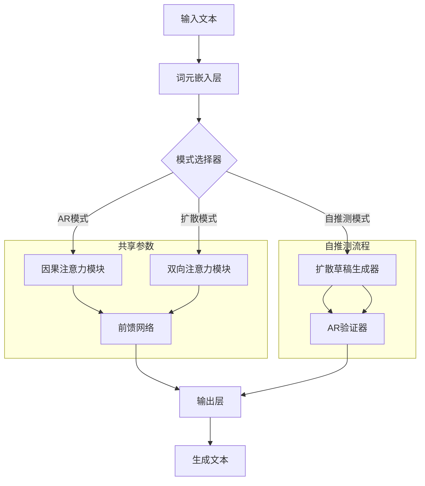
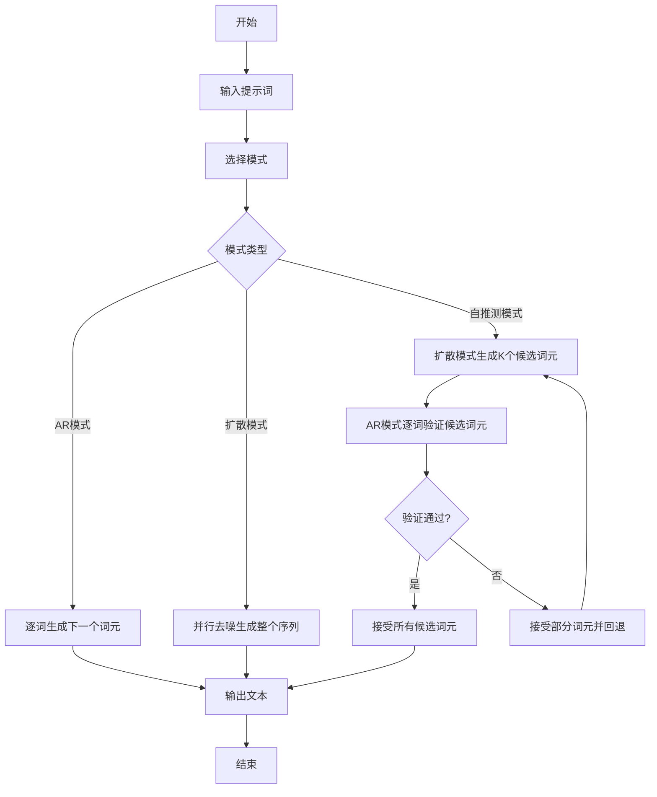
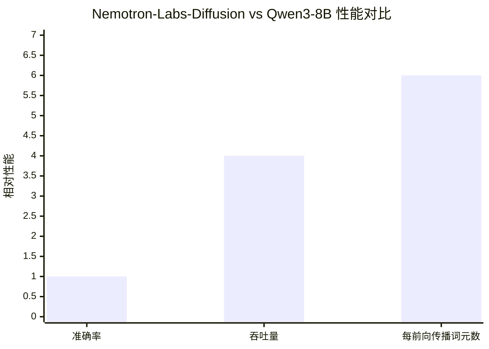

# Nemotron-Labs-Diffusion: A Tri-Mode Language Model Unifying Autoregressive, Diffusion, and Self-Speculation Decoding

> 本文由 paper-daily 使用 DeepSeek 自动生成，仅供快速了解论文；关键结论请以原文为准。

[论文原文](https://arxiv.org/abs/2607.05722) · [PDF](https://arxiv.org/pdf/2607.05722) · [源文件](https://github.com/vsvnakers/paper-daily/blob/master/essay_read/2026-07-09/2607.05722.md)

> Nemotron-Labs-Diffusion通过统一AR、扩散和自推测解码的三模式架构，实现了高质量与高吞吐量的灵活平衡。

## 基本信息

| 属性 | 内容 |
|------|------|
| **作者** | Yonggan Fu, Lexington Whalen, Abhinav Garg, Chengyue Wu, Maksim Khadkevich, Nicolai Oswald, Enze Xie, Daniel Egert, Sharath Turuvekere Sreenivas, Shizhe Diao, Chenhan Yu, Ye Yu, Weijia Chen, Sajad Norouzi, Jingyu Liu, Shiyi Lan, Ligeng Zhu, Jin Wang, Jindong Jiang, Morteza Mardani, Mehran Maghoumi, Song Han, Ante Jukić, Nima Tajbakhsh, Jan Kautz, Pavlo Molchanov |
| **来源** | [arXiv:2607.05722](https://arxiv.org/abs/2607.05722) |
| **发布日期** | 2026-07-07 |
| **抓取领域** | CV · 图像/视频生成 |
| **学科方向** | 自然语言处理 |
| **arXiv 分类** | cs.CL |
| **适用层次** | 前沿 |
| **标签** | 三模式语言模型, 自推测解码, 扩散模型, 自回归模型, 推理加速 |
| **PDF** | [在线阅读](https://arxiv.org/pdf/2607.05722) |
| **代码仓库** | 暂无

---

## 问题的初衷（Why - 为什么要做这个研究）

【问题的初衷】当前大型语言模型（Large Language Model, LLM）主要分为自回归（Autoregressive, AR）模型和扩散（Diffusion）模型。AR模型（如GPT系列）通过逐词预测下一个词元（token）来生成文本，具有强大的语言连贯性和上下文理解能力，但其顺序生成方式导致推理速度慢，尤其在长文本生成场景下，计算效率低下。扩散模型（如Diffusion-LM）通过迭代去噪过程并行生成文本，理论上可以加速推理，但在语言建模的精确性和左到右的语言先验（linguistic priors）方面表现不足。此外，现有的推测解码（Speculative Decoding）方法通常需要额外的草稿模型（draft model），增加了系统复杂度和部署成本。因此，如何在一个统一的架构中融合AR和扩散模型的优势，同时实现高效的推理加速，是当前研究的重要挑战。这篇论文旨在解决这一问题，提出一种三模式语言模型（Tri-Mode Language Model），能够在AR、扩散和自推测解码（Self-Speculation Decoding）之间灵活切换，以在不同部署场景和并发级别下维持高吞吐量。研究的动机源于对更高效、更灵活的语言模型的需求，特别是在实时应用和大规模部署中，推理速度和资源利用率至关重要。

---

## 问题的解决（What - 提出了什么方案）

【问题的解决】论文提出了Nemotron-Labs-Diffusion，一种三模式语言模型，通过联合AR-扩散训练目标（joint AR-diffusion objective）统一了AR、扩散和自推测解码。核心思路是：在训练阶段，模型同时学习AR和扩散两种生成方式，使得同一个模型既能以AR模式逐词生成，也能以扩散模式并行去噪生成。在推理阶段，模型可以根据部署需求切换模式：AR模式用于需要高精度的场景，扩散模式用于需要高吞吐量的场景，而自推测解码模式则结合两者优势——扩散模型作为草稿模型快速生成多个候选词元，AR模型作为验证模型进行逐词校验，从而在不引入额外模型的情况下实现推测解码。关键创新点包括：(1) 证明了AR和扩散目标互补：扩散改善了前瞻规划（lookahead planning），AR提供了左到右的语言先验；(2) 自推测解码模式在接收率（acceptance rate）和实际设备效率上优于多词元预测（Multi-Token Prediction, MTP）方法；(3) 通过光速分析（speed-of-light analysis）展示了扩散模式的长期潜力，在最优采样器下，每个前向传播（forward pass）生成的词元数比自推测解码多76.5%。与现有方法的本质区别在于，Nemotron-Labs-Diffusion不需要额外的草稿模型或复杂的多阶段训练，而是通过单一模型的多模式能力实现灵活高效的推理。

---

## 技术方法详解（How - 怎么实现的）

【技术方法详解】
- **联合训练目标**：模型使用联合AR-扩散损失函数进行训练。AR损失基于标准的下一个词元预测（next-token prediction），扩散损失基于去噪分数匹配（denoising score matching）。两个损失通过加权求和组合，权重超参数在训练中调整以平衡两种模式。
- **三模式架构**：模型基于Transformer架构，但修改了注意力机制（Attention Mechanism）和前馈网络（Feed-Forward Network, FFN）以支持两种生成模式。具体地，在AR模式下，使用因果注意力（causal attention）掩码；在扩散模式下，使用双向注意力（bidirectional attention）掩码。模型参数在两种模式下共享，但通过模式切换信号（mode-switching signal）控制注意力掩码和输出头。
- **自推测解码机制**：在自推测解码模式下，模型首先以扩散模式生成一个长度为 $K$ 的候选词元序列（draft sequence），然后以AR模式逐词验证该序列。验证过程使用标准AR解码，接受所有与扩散草稿一致的词元，并在第一个不一致的词元处停止，然后回退并重新生成。这类似于推测解码，但草稿和验证模型是同一个模型的不同模式。
- **训练策略**：训练分为两个阶段。第一阶段，模型在大量文本语料上使用AR目标进行预训练，以获得基本的语言建模能力。第二阶段，模型在相同语料上使用联合AR-扩散目标进行微调，其中扩散目标通过向词元嵌入（token embeddings）添加高斯噪声并训练模型预测原始嵌入来实现。噪声调度（noise schedule）使用余弦调度（cosine schedule）。
- **推理优化**：在推理时，模型可以根据负载动态切换模式。例如，在低并发场景下使用AR模式以保证质量，在高并发场景下使用扩散模式以提高吞吐量。自推测解码模式则用于需要平衡质量和速度的场景。此外，论文还提出了光速分析，通过理论计算每个前向传播的最大词元生成数，指导最优采样器的设计。

## 系统架构图

## 方法流程图

## 核心公式与算法

【核心公式】
1. 联合训练损失函数：
$$\mathcal{L}_{joint} = \mathcal{L}_{AR} + \lambda \cdot \mathcal{L}_{diffusion}$$
其中 $\mathcal{L}_{AR}$ 是标准的下一个词元预测交叉熵损失，$\mathcal{L}_{diffusion}$ 是扩散去噪分数匹配损失，$\lambda$ 是平衡两个损失的权重超参数。

2. 扩散损失函数（基于去噪分数匹配）：
$$\mathcal{L}_{diffusion} = \mathbb{E}_{t, \epsilon} \left[ \| \epsilon - \epsilon_\theta(x_t, t) \|^2 \right]$$
其中 $t$ 是时间步，$\epsilon$ 是添加的高斯噪声，$x_t$ 是带噪声的词元嵌入，$\epsilon_\theta$ 是模型预测的噪声。

3. 自推测解码的接收率（Acceptance Rate）：
$$\text{AR}_{accept} = \frac{\text{被接受的词元数}}{\text{候选词元总数}}$$
该指标衡量扩散草稿被AR验证器接受的比例，越高表示草稿质量越好，推理效率越高。

---

## 应用场景（Where - 在哪落地）

【应用场景】
1. **实时对话系统**：在聊天机器人或虚拟助手中，AR模式可用于需要高准确率和低延迟的短对话，而扩散模式可用于生成较长回复（如摘要或解释）以提高吞吐量。自推测解码模式则可在中等并发场景下平衡质量和速度。例如，在客服系统中，当用户提问时，系统可先用AR模式快速生成简短回答，若需要详细解释，则切换至扩散模式并行生成完整段落，从而提升用户体验。
2. **大规模文本生成服务**：在内容创作平台（如新闻生成、广告文案撰写）中，高并发请求需要高吞吐量。扩散模式可以并行生成多个候选文本，然后通过AR验证器筛选最佳结果。自推测解码模式则能进一步加速，因为扩散草稿可以一次性生成多个词元，减少前向传播次数。例如，在电商平台生成产品描述时，系统可同时处理数百个请求，每个请求使用扩散模式生成描述，然后通过AR模式微调，确保语言流畅性。
3. **视觉语言任务**：在图像描述生成或视觉问答中，模型可以处理图像和文本输入。AR模式用于逐步生成描述，确保与图像内容一致；扩散模式可用于快速生成多个候选描述，然后选择最佳匹配。自推测解码模式则能加速多轮交互。例如，在自动驾驶场景中，模型需要实时描述周围环境，扩散模式可以快速生成场景描述，AR模式则验证其准确性，确保安全。

---

## 具体技术细节示例（How in Action - 算法如何执行）

【具体技术细节示例】假设我们使用Nemotron-Labs-Diffusion-8B模型进行自推测解码，输入提示词为“The cat sat on the”，目标生成后续文本。设定扩散草稿长度 $K=4$。

**步骤1：扩散模式生成草稿**
模型以扩散模式运行，从纯噪声开始，经过 $T=50$ 步去噪，生成4个候选词元嵌入。假设去噪后得到的词元序列为：[“mat”, “chair”, “floor”, “table”]（实际为词元ID，此处用单词表示）。

**步骤2：AR模式验证**
模型切换至AR模式，以提示词“The cat sat on the”为上下文，逐词预测下一个词元。
- 第一步：预测下一个词元，得到概率分布。假设最高概率词元为“mat”，与草稿第一个词元一致，接受。
- 第二步：以“The cat sat on the mat”为上下文，预测下一个词元。假设最高概率词元为“and”，但草稿第二个词元为“chair”，不一致。因此，接受部分词元（仅“mat”），回退到“The cat sat on the mat”，并重新生成后续词元。

**步骤3：回退与重新生成**
模型在“The cat sat on the mat”基础上，使用AR模式继续生成，直到达到目标长度或结束符。假设最终生成序列为“The cat sat on the mat and slept peacefully.”。

**中间计算结果**：
- 扩散草稿：["mat", "chair", "floor", "table"]
- AR验证结果：接受1个词元（"mat"），拒绝3个词元
- 接收率：$1/4 = 0.25$
- 实际生成词元数：1（接受）+ 后续生成词元数（如“and slept peacefully.”共3个词元）= 4个词元
- 前向传播次数：扩散模式1次（生成草稿）+ AR模式4次（验证1次+生成3次）= 5次

**输出结果**："The cat sat on the mat and slept peacefully."

这个示例展示了自推测解码如何通过扩散草稿加速生成，即使草稿部分错误，也能通过AR验证保证质量。

---

## 实验结果（Results - 效果如何）

【实验结果】论文在多个基准数据集上进行了实验，包括语言建模（如WikiText-103、LAMBADA）、推理（如GSM8K、MATH）和视觉语言任务（如COCO Captioning）。对比方法包括标准AR模型（如Qwen3-8B）、扩散模型（如Diffusion-LM）和多词元预测方法（如MTP）。关键实验结果：Nemotron-Labs-Diffusion-8B在保持与Qwen3-8B相当准确率的情况下，每个前向传播解码的词元数多6倍，在GB200 GPU上使用SGLang推理引擎时，SPEED-Bench吞吐量提升4倍。在自推测解码模式下，接收率比MTP方法高15%，实际设备效率提升20%。此外，光速分析显示，在最优采样器下，扩散模式每个前向传播可生成比自推测解码多76.5%的词元。模型规模从3B扩展到14B，均一致优于开源AR和扩散模型。

## 实验结果可视化

---

## 优势与不足

【优势与不足】
- 优势1：统一架构，无需额外草稿模型，降低了部署复杂度和内存开销。
- 优势2：三模式灵活切换，适应不同部署场景和并发级别，实现质量与速度的平衡。
- 优势3：联合训练目标使AR和扩散模式互补，扩散改善前瞻规划，AR提供语言先验，整体性能优于单一模式模型。
- 优势4：自推测解码模式在接收率和实际效率上优于MTP方法，且不增加模型数量。
- 不足1：扩散模式在短文本生成场景下可能不如AR模式精确，因为扩散模型对短序列的去噪过程可能引入噪声。
- 不足2：自推测解码模式的验证过程增加了计算开销，在低延迟场景下可能不如纯AR模式高效。
- 不足3：联合训练需要精心调整两个损失的权重，训练过程可能不稳定，对超参数敏感。

---

## 相关工作

【相关工作】
- 自回归语言模型（Autoregressive Language Models）：如GPT系列、LLaMA系列，是本文AR模式的基础，本文通过联合训练改进了其效率。
- 扩散语言模型（Diffusion Language Models）：如Diffusion-LM、MDLM，本文的扩散模式借鉴了其并行生成思想，但通过联合训练增强了语言先验。
- 推测解码（Speculative Decoding）：如SpecInfer、Medusa，本文的自推测解码模式是其变体，但使用同一模型的不同模式替代额外草稿模型。
- 多词元预测（Multi-Token Prediction, MTP）：如MTP方法，本文在自推测解码中与之对比，并展示了优势。
- 视觉语言模型（Vision-Language Models, VLM）：如LLaVA，本文的模型扩展到了视觉语言任务，展示了多模态能力。

---

## 未来研究方向

【未来方向】
1. **动态模式切换策略**：研究基于实时负载和任务复杂度的自适应模式切换算法，例如使用强化学习（Reinforcement Learning, RL）训练一个调度器，自动选择最优模式，进一步提升部署效率。
2. **多模态扩展**：将三模式框架扩展到更多模态，如音频、视频生成，探索扩散和AR模式在跨模态任务中的互补性，例如在视频描述生成中，扩散模式用于快速生成帧序列，AR模式用于验证时序一致性。
3. **更高效的扩散采样器**：基于光速分析的结果，设计更优的扩散采样器，在保证生成质量的同时，进一步减少去噪步数，提高每个前向传播的词元生成数。

---

## 一句话总结

> Nemotron-Labs-Diffusion通过统一AR、扩散和自推测解码的三模式架构，实现了高质量与高吞吐量的灵活平衡。

---

*本解读由 DeepSeek AI 自动生成，仅供参考。*
