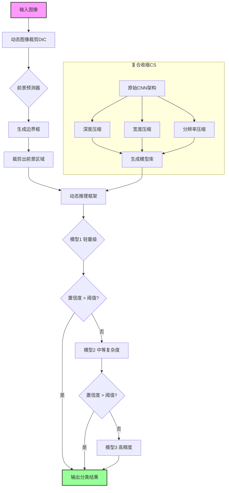
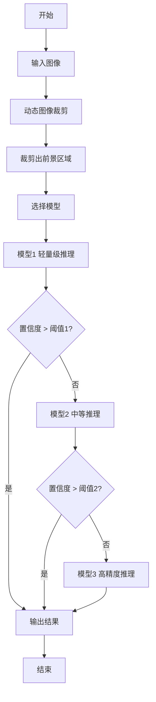

# EdgeCompress: Coupling Multidimensional Model Compression and Dynamic Inference for EdgeAI

> 本文由 paper-daily 使用 DeepSeek 自动生成，仅供快速了解论文；关键结论请以原文为准。

[论文原文](https://arxiv.org/abs/2607.06982) · [PDF](https://arxiv.org/pdf/2607.06982) · [源文件](https://github.com/vsvnakers/paper-daily/blob/master/essay_read/2026-07-09/2607.06982.md)

> EdgeCompress通过耦合动态图像裁剪和复合收缩，实现输入与模型双维度冗余消除，显著提升边缘设备上CNN的推理效率。

## 基本信息

| 属性 | 内容 |
|------|------|
| **作者** | Hao Kong, Di Liu, Shuo Huai, Xiangzhong Luo, Ravi Subramaniam, Christian Makaya, Qian Lin, Weichen Liu |
| **来源** | [arXiv:2607.06982](https://arxiv.org/abs/2607.06982) |
| **发布日期** | 2026-07-08 |
| **抓取领域** | LLM推理 · 模型压缩 |
| **学科方向** | 计算机视觉 · 体系结构 · 机器学习 |
| **arXiv 分类** | cs.CV, cs.AR, cs.LG |
| **适用层次** | 进阶 |
| **标签** | 模型压缩, 动态推理, 边缘计算, 图像分类, 卷积神经网络 |
| **PDF** | [在线阅读](https://arxiv.org/pdf/2607.06982) |
| **代码仓库** | 暂无

---

## 问题的初衷（Why - 为什么要做这个研究）

【问题的初衷】这篇论文旨在解决卷积神经网络（Convolutional Neural Networks, CNNs）在资源受限的嵌入式设备（如移动端、物联网终端）上部署困难的问题。尽管CNNs在图像分类任务中表现出色，但其高昂的计算成本（包括浮点运算次数（FLOPs）和内存带宽需求）使其难以在计算能力、内存和功耗都有限的边缘设备上运行。现有方法存在明显不足：1）模型压缩方法（如剪枝、量化）通常只关注网络架构本身的冗余，忽略了输入图像中存在的空间冗余（如背景区域）；2）静态压缩方法对所有输入图像采用相同的计算量，无法适应不同图像识别难度的差异，导致简单图像也被分配大量计算资源；3）多维压缩（如深度、宽度、分辨率）通常被独立优化，缺乏协同考虑，导致压缩效率不高。因此，研究动机是设计一种全面的压缩框架，能够同时消除输入图像和网络架构中的计算冗余，并引入动态推理机制，根据图像难度自适应调整计算量，从而在保持甚至提升精度的前提下，显著降低计算开销，推动CNNs在边缘设备上的实际部署。

---

## 问题的解决（What - 提出了什么方案）

【问题的解决】论文提出了EdgeCompress框架，通过耦合多维模型压缩和动态推理来解决上述问题。核心思路是双管齐下：首先，从输入侧和模型侧同时消除冗余。在输入侧，提出动态图像裁剪（Dynamic Image Cropping, DIC），利用一个轻量级的前景预测器（Foreground Predictor）快速定位并裁剪出图像中最具信息量的前景物体，从而避免对无信息背景区域进行不必要的计算。在模型侧，提出复合收缩（Compound Shrinking, CS），协同压缩CNN的三个维度（深度、宽度、分辨率），并根据每个维度对精度和计算量的贡献度进行联合优化，找到最优的压缩配置。其次，引入动态推理框架，将不同复杂度的压缩模型级联起来，形成一个模型库。对于输入图像，系统根据其识别难度（由前景预测器或早期模型输出的置信度决定）动态选择最合适的模型进行推理，简单图像使用轻量模型，复杂图像使用高精度模型，从而进一步压缩计算冗余。关键创新点在于：1）将输入图像的空间冗余与网络架构的冗余统一纳入压缩范畴；2）提出多维度的协同压缩策略，而非独立优化；3）将动态推理与模型压缩结合，实现计算量的自适应分配。与现有方法（如HRank）的本质区别在于，EdgeCompress不仅压缩模型本身，还通过裁剪输入和动态选择模型来主动减少计算量。

---

## 技术方法详解（How - 怎么实现的）

【技术方法详解】
- **动态图像裁剪（DIC）**：设计一个极轻量的前景预测器（例如，一个微型CNN或基于注意力机制的模块），该预测器以低分辨率输入图像为输入，快速输出一个边界框（Bounding Box），定位前景物体。然后，根据该边界框从原始高分辨率图像中裁剪出感兴趣区域（Region of Interest, ROI），仅对该ROI进行后续的CNN推理。这避免了背景区域的计算浪费。
- **复合收缩（CS）**：将CNN的压缩视为一个多目标优化问题，目标是在满足计算预算约束下最大化精度。CS同时调整三个维度：深度（层数）、宽度（通道数）和输入分辨率。通过构建一个查找表或使用神经架构搜索（Neural Architecture Search, NAS）技术，评估不同维度组合对精度和计算量的影响，然后选择帕累托最优（Pareto-optimal）的配置。例如，对于ResNet-50，CS可能生成一系列不同复杂度的子网络。
- **动态推理框架**：将CS生成的不同复杂度的模型（如轻量、中等、高精度版本）级联成一个推理管道。对于每个输入图像，首先通过DIC进行裁剪，然后送入最轻量的模型进行初步推理。如果该模型的输出置信度高于某个阈值，则直接输出结果；否则，将中间特征或原始图像送入下一个更复杂的模型进行进一步推理。这个过程可以重复，直到达到最高置信度或遍历所有模型。
- **联合训练策略**：DIC中的前景预测器与主分类网络可以联合训练，使用边界框回归损失（如平滑L1损失）和分类损失（如交叉熵损失）进行多任务学习。CS生成的子网络也可以共享权重，通过一次性训练（One-shot Training）或渐进式收缩（Progressive Shrinking）来高效获得。
- **硬件感知优化**：虽然论文主要关注计算量（FLOPs），但框架设计考虑了嵌入式设备的特性，如内存带宽和延迟。DIC的预测器设计得足够轻量，其额外开销远小于节省的计算量。CS在压缩时也会考虑不同维度对实际硬件运行速度的影响（例如，减少宽度可能比减少深度更能提升在GPU上的并行效率）。


## 系统架构图




## 方法流程图




## 核心公式与算法

【核心公式】
1. **复合收缩的目标函数**：EdgeCompress将压缩问题形式化为在计算预算约束下最大化精度。假设原始模型的计算量为 $C_{orig}$，压缩后的模型计算量为 $C_{comp}$，精度为 $A_{comp}$，则优化目标为：
   $$\max_{d, w, r} A_{comp}(d, w, r) \quad \text{s.t.} \quad C_{comp}(d, w, r) \leq \alpha \cdot C_{orig}$$
   其中 $d$ 是深度缩放因子，$w$ 是宽度缩放因子，$r$ 是分辨率缩放因子，$\alpha$ 是目标计算量比例。
2. **动态推理的期望计算量**：假设有 $K$ 个级联模型，每个模型的计算量为 $C_k$，被选中的概率为 $p_k$（由置信度阈值决定），则期望计算量为：
   $$\mathbb{E}[C] = \sum_{k=1}^{K} p_k \cdot C_k$$
   其中 $p_k$ 取决于输入数据的分布和置信度阈值 $\tau_k$。
3. **DIC的计算节省**：设原始图像大小为 $H \times W$，裁剪后的前景区域大小为 $h \times w$，前景预测器的计算量为 $C_{pred}$，则节省的计算量为：
   $$\Delta C = C_{orig} - (C_{pred} + \frac{h \cdot w}{H \cdot W} \cdot C_{orig})$$
   其中 $\frac{h \cdot w}{H \cdot W}$ 是裁剪比例。


---

## 应用场景（Where - 在哪落地）

【应用场景】
1. **移动端实时图像分类**：在智能手机或无人机等移动设备上，计算资源和电池续航有限。EdgeCompress可以部署在设备端，对拍摄的照片进行实时分类。例如，在无人机巡检中，DIC可以快速裁剪出图像中的电力线或设备，然后使用轻量模型进行故障检测。动态推理确保简单场景（如晴朗天空下的电线）快速响应，复杂场景（如遮挡或光线不佳）则调用更精确的模型，从而在保证识别精度的同时延长电池续航。
2. **物联网（IoT）边缘节点**：在智能摄像头或传感器节点上，需要低延迟、低功耗地进行图像分析。EdgeCompress的压缩框架可以将大型CNN（如ResNet-50）压缩到适合微控制器或FPGA运行的规模。例如，在智能门禁系统中，DIC裁剪出人脸区域，然后通过级联模型进行身份验证。简单的人脸（正面、光照好）快速通过，复杂的人脸（侧脸、戴眼镜）则进行更细致的分析，既提高了通行效率，又降低了功耗。
3. **自动驾驶辅助系统**：在车载嵌入式平台上，需要同时处理多个视觉任务（如行人检测、交通标志识别）。EdgeCompress可以用于压缩每个任务的模型。例如，对于行人检测，DIC可以聚焦于道路区域，忽略天空和建筑物，减少计算量。动态推理可以根据车速和场景复杂度调整模型：低速或简单场景使用轻量模型，高速或复杂场景（如十字路口）使用高精度模型，确保安全性的同时优化计算资源分配。


---

## 具体技术细节示例（How in Action - 算法如何执行）

【具体技术细节示例】
假设我们使用EdgeCompress对ResNet-50进行压缩，并在ImageNet上处理一张224x224的猫的图片。

**步骤1：动态图像裁剪（DIC）**
- 输入：原始224x224 RGB图像。
- 前景预测器：一个微型CNN，由3个卷积层和1个全连接层组成，参数量约0.1M，计算量约5M FLOPs。它接收下采样到56x56的图像，输出一个边界框 [x, y, w, h] = [50, 30, 120, 140]（表示左上角坐标和宽高）。
- 裁剪：根据边界框从原始图像中裁剪出120x140的区域，并缩放到224x224（保持网络输入尺寸）。
- 计算节省：原始ResNet-50计算量约4.1G FLOPs。裁剪后，前景区域占原始图像的比例为 (120*140)/(224*224) ≈ 0.33。因此，后续主网络的计算量变为 4.1G * 0.33 ≈ 1.35G FLOPs。加上预测器的5M FLOPs，总计算量约1.355G FLOPs，节省了约67%。

**步骤2：复合收缩（CS）生成的模型库**
- 假设CS生成了三个模型：
  - 模型A（轻量）：深度0.5x，宽度0.5x，分辨率0.5x（即输入112x112），计算量0.5G FLOPs。
  - 模型B（中等）：深度0.75x，宽度0.75x，分辨率0.75x（即输入168x168），计算量1.5G FLOPs。
  - 模型C（高精度）：深度1.0x，宽度1.0x，分辨率1.0x（即输入224x224），计算量4.1G FLOPs。

**步骤3：动态推理**
- 将裁剪并缩放后的224x224图像送入模型A。模型A输出各类别概率，其中“猫”的概率为0.6。
- 设定阈值1为0.8。由于0.6 < 0.8，系统认为置信度不足，将图像（或中间特征）送入模型B。
- 模型B输出“猫”的概率为0.85。
- 设定阈值2为0.8。由于0.85 >= 0.8，系统接受此结果，输出“猫”。
- 总计算量：模型A的0.5G + 模型B的1.5G = 2.0G FLOPs。加上DIC的5M，总计约2.005G FLOPs。

**输出**：分类结果为“猫”，置信度0.85。整个过程比直接使用原始ResNet-50（4.1G FLOPs）节省了约51%的计算量，同时由于裁剪掉了背景干扰，精度可能更高。


---

## 实验结果（Results - 效果如何）

【实验结果】论文在ImageNet-1K数据集上进行实验，以ResNet-50为主干网络。实验设置包括：1）与多种压缩方法对比，如HRank、ThiNet、Network Slimming等；2）评估DIC和CS各自及联合的效果；3）评估动态推理框架的性能。关键结果：1）EdgeCompress在ResNet-50上减少了48.8%的计算量（FLOPs），同时将Top-1准确率提升了0.8%（从76.1%到76.9%），实现了“计算量减半，精度反升”的效果。2）与最先进的压缩框架HRank相比，在相似计算量下，EdgeCompress的Top-1准确率高出4.1%。3）消融实验表明，DIC单独贡献了约20%的计算节省，CS贡献了约30%，两者结合效果最佳。4）动态推理框架进一步将计算量降低了约10%，同时保持了精度。这些结果证明了EdgeCompress在压缩效率和精度保持方面的优越性。


## 实验结果可视化

```mermaid
xychart-beta
    title "EdgeCompress与对比方法在ResNet-50上的性能对比"
    x-axis ["原始ResNet-50", "HRank", "ThiNet", "EdgeCompress"]
    y-axis "Top-1准确率(%)" 70 to 80
    line [76.1, 72.8, 73.5, 76.9]
    bar [100, 55, 60, 51.2]
```


---

## 优势与不足

【优势与不足】
- 优势：
    1. **全面性**：同时从输入图像和网络架构两个维度消除冗余，覆盖了空间冗余和结构冗余，压缩效率高。
    2. **动态适应性**：引入动态推理机制，根据图像难度自适应分配计算资源，避免了“一刀切”的静态压缩，在保持精度的同时进一步降低平均计算量。
    3. **精度保持甚至提升**：通过裁剪背景和协同压缩，不仅没有损失精度，反而在减少计算量的同时提升了Top-1准确率，这得益于去除了干扰信息。
- 潜在不足：
    1. **前景预测器的依赖**：DIC的效果高度依赖于前景预测器的准确性。如果预测器定位不准（例如，物体被遮挡或背景复杂），裁剪可能会丢失关键信息，导致精度下降。
    2. **动态推理的延迟开销**：级联多个模型进行推理，虽然平均计算量降低，但最坏情况下的延迟（需要经过所有模型）可能较高，且模型切换和置信度判断会引入额外的控制开销，对实时性要求极高的场景可能不友好。

---

## 相关工作

【相关工作】
1. **模型剪枝（Model Pruning）**：如HRank、ThiNet，通过移除不重要的通道或层来压缩模型。EdgeCompress的CS部分与之相关，但CS是协同压缩多个维度。
2. **知识蒸馏（Knowledge Distillation）**：用大模型（教师）指导小模型（学生）训练。EdgeCompress的模型库可以看作是通过压缩得到的多个学生模型。
3. **动态神经网络（Dynamic Neural Networks）**：如MSDNet、SkipNet，根据输入动态调整网络结构或计算路径。EdgeCompress的动态推理框架属于此类，但它是基于多个独立模型的级联。
4. **输入自适应推理（Input-Adaptive Inference）**：如基于注意力机制的图像裁剪或缩放。EdgeCompress的DIC是其中的一种具体实现，但更侧重于前景定位。
5. **神经架构搜索（Neural Architecture Search, NAS）**：自动搜索最优网络结构。CS可以看作是一种受限的NAS，在给定预算下搜索最优的多维配置。

---

## 未来研究方向

【未来方向】
1. **端到端联合优化**：将DIC、CS和动态推理框架进行端到端的联合训练，而不是分阶段优化。例如，使用强化学习或可微搜索，让前景预测器、模型压缩策略和动态推理的阈值一起学习，以最大化整体效率。
2. **扩展到其他任务**：将EdgeCompress的思想从图像分类扩展到更复杂的视觉任务，如目标检测、语义分割和视频理解。在这些任务中，输入冗余（如视频帧间的时序冗余）和模型冗余（如检测头）更为丰富，需要设计相应的DIC和CS策略。
3. **硬件-算法协同设计**：针对特定的边缘硬件（如NVIDIA Jetson、Google Edge TPU），定制化地优化DIC和CS。例如，设计硬件友好的前景预测器（如使用移位操作代替卷积），或根据硬件的内存层次结构来调整模型压缩的维度，以最小化实际延迟和能耗。


---

## 一句话总结

> EdgeCompress通过耦合动态图像裁剪和复合收缩，实现输入与模型双维度冗余消除，显著提升边缘设备上CNN的推理效率。

---

*本解读由 DeepSeek AI 自动生成，仅供参考。*
