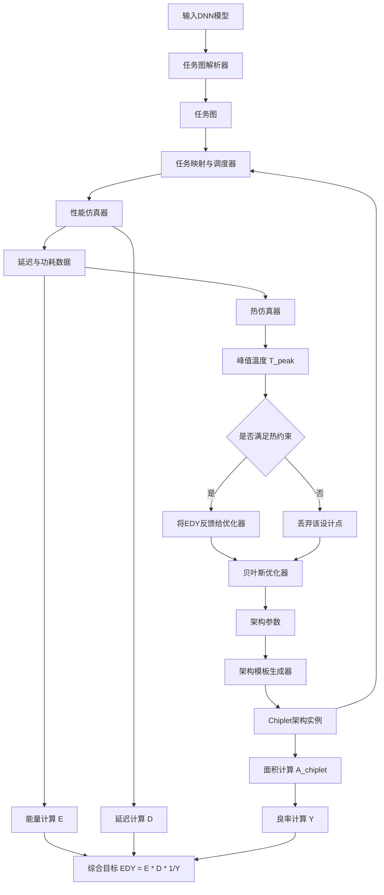
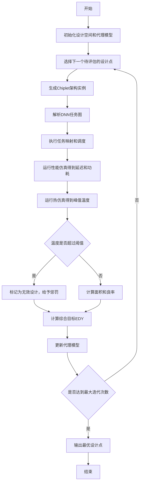
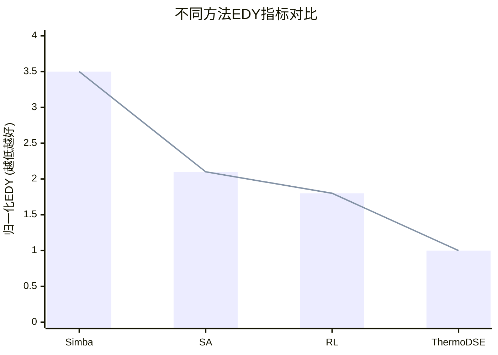

# ThermoDSE: A Thermal-Aware and Comprehensive Design Space Exploration for Chiplet-Based DNN Accelerators

> 本文由 paper-daily 使用 DeepSeek 自动生成，仅供快速了解论文；关键结论请以原文为准。

[论文原文](https://arxiv.org/abs/2607.07096) · [PDF](https://arxiv.org/pdf/2607.07096) · [源文件](https://github.com/vsvnakers/paper-daily/blob/master/essay_read/2026-07-09/2607.07096.md)

> ThermoDSE首次提出一个统一的热感知设计空间探索框架，联合优化Chiplet DNN加速器的架构、任务、通信、热和良率。

## 基本信息

| 属性 | 内容 |
|------|------|
| **作者** | Jian Peng, Hanwei Fan, Jingbo Jiang, Lin Jiang, Wei Zhang |
| **来源** | [arXiv:2607.07096](https://arxiv.org/abs/2607.07096) |
| **发布日期** | 2026-07-08 |
| **抓取领域** | 体系结构/硬件加速 |
| **学科方向** | 体系结构 |
| **arXiv 分类** | cs.AR |
| **适用层次** | 进阶 |
| **标签** | Chiplet, 设计空间探索, 热感知, DNN加速器, 贝叶斯优化 |
| **PDF** | [在线阅读](https://arxiv.org/pdf/2607.07096) |
| **代码仓库** | 暂无

---

## 问题的初衷（Why - 为什么要做这个研究）

【问题的初衷】随着深度学习模型规模的爆炸式增长，传统的单片式（Monolithic）深度学习加速器（DNN Accelerator）在制造良率（Yield）、成本（Cost）和可扩展性（Scalability）方面遇到了瓶颈。Chiplet技术通过将大型芯片拆分为多个较小的芯粒（Chiplet），并使用先进封装技术（如2.5D/3D封装）进行集成，提供了一种平衡性能、功耗和良率的可扩展路径。然而，Chiplet架构的引入带来了全新的设计挑战。首先，芯粒间的通信（Inter-Chiplet Communication）引入了显著的延迟和功耗开销，其设计空间（Design Space）呈爆炸式增长，包括芯粒数量、芯粒内核心（Core）数量、核心架构（如脉动阵列Systolic Array大小）、片上网络（Network-on-Chip, NoC）拓扑、内存层次结构（Memory Hierarchy）等。其次，高密度集成导致的热密度（Power Density）急剧上升，热约束（Thermal Constraint）成为限制性能提升的关键瓶颈。现有的设计空间探索（Design Space Exploration, DSE）方法要么只关注架构参数，忽略了任务映射（Task Mapping）和芯粒间通信的细粒度建模；要么只考虑性能或功耗，未能将热约束、面积约束（Area Constraint）和良率（Yield）等关键物理因素纳入统一的优化目标。因此，迫切需要一种能够综合考虑架构、任务、通信、热和面积约束的、全面的设计空间探索框架，以找到最优的Chiplet加速器设计方案。

---

## 问题的解决（What - 提出了什么方案）

【问题的解决】ThermoDSE提出了一个热感知（Thermal-Aware）且全面的设计空间探索框架，用于Chiplet基的DNN加速器。其核心思路是将现有的细粒度建模技术（如DNN任务的计算、通信和内存访问模型）与物理约束（热、面积）统一到一个联合仿真与优化框架中。关键创新点在于：1）**统一建模**：首次将架构设计（Architecture Design）、任务编排（Task Orchestration）和芯粒间通信（Inter-Chiplet Communication）在严格的物理约束下进行联合优化。2）**热感知优化**：将热模型（Thermal Model）直接集成到探索循环中，使得优化器能够主动规避可能导致热点（Hotspot）或违反热预算（Thermal Budget）的设计点。3）**综合目标函数**：提出了一个名为能量-延迟-逆良率积（Energy-Delay-Inverse-Yield, EDY）的新指标，作为优化目标。该指标同时考虑了性能（延迟D）、能效（能量E）和制造成本（逆良率1/Y），引导搜索找到在性能、功耗和成本之间取得最佳平衡的设计。与现有方法（如Simba、模拟退火Simulated Annealing、强化学习Reinforcement Learning）相比，ThermoDSE的本质区别在于其**全面性**和**物理感知性**，它不是在简化模型上搜索，而是在一个高保真度（High-Fidelity）的仿真环境中进行，从而找到更优且实际可行的设计方案。

---

## 技术方法详解（How - 怎么实现的）

【技术方法详解】
- **统一仿真与优化框架**：ThermoDSE构建了一个模块化框架，集成了任务图（Task Graph）解析器、架构模板（Architecture Template）生成器、性能/功耗/热仿真器（Simulator）以及一个基于贝叶斯优化（Bayesian Optimization, BO）的搜索引擎。框架能够自动将DNN模型（如ResNet-50）映射到Chiplet架构上，并评估其性能、功耗、温度和良率。
- **细粒度任务建模**：将DNN模型分解为算子（Operator）级别的任务图。每个算子（如卷积Convolution、全连接Fully Connected）的计算时间、内存访问量和通信量都被精确建模。任务映射（Task Mapping）决定每个算子被分配到哪个芯粒的哪个核心上执行，这是影响芯粒间通信量的关键。
- **Chiplet架构模板**：定义了一个可参数化的Chiplet架构模板。关键参数包括：芯粒数量（$N_{chiplet}$）、每个芯粒内的核心数量（$N_{core}$）、核心类型（如脉动阵列大小 $M \times N$）、片上缓存大小（$S_{buffer}$）、芯粒间互连拓扑（如Mesh、Ring）和带宽（$BW_{inter}$）。
- **热模型集成**：采用紧凑型热模型（Compact Thermal Model, CTM），基于热阻网络（Thermal Resistance Network）快速估算芯片的稳态温度分布。输入是每个核心的功耗（由性能仿真器提供），输出是每个芯粒的峰值温度（$T_{peak}$）。该模型被用作优化过程中的硬约束（Hard Constraint），即任何导致 $T_{peak} > T_{limit}$ 的设计点都会被直接丢弃。
- **综合优化目标**：优化目标是最小化能量-延迟-逆良率积（EDY），定义为 $\text{EDY} = E \cdot D \cdot \frac{1}{Y}$。其中，$E$ 是总能量消耗，$D$ 是总执行延迟，$Y$ 是良率。良率 $Y$ 与芯粒面积 $A_{chiplet}$ 相关，通常采用负指数模型 $Y = e^{-\alpha \cdot A_{chiplet}}$，其中 $\alpha$ 是缺陷密度（Defect Density）。这个目标函数迫使优化器寻找面积小（良率高）、速度快且功耗低的设计。
- **基于贝叶斯优化的搜索**：由于设计空间巨大且评估成本高（需要运行完整仿真），ThermoDSE采用贝叶斯优化作为搜索策略。BO通过构建一个代理模型（Surrogate Model，如高斯过程Gaussian Process）来预测未知设计点的性能，并使用采集函数（Acquisition Function，如期望改进Expected Improvement）来指导搜索，从而在较少的评估次数内找到最优解。

## 系统架构图

## 方法流程图

## 核心公式与算法

【核心公式】
1. **综合优化目标（EDY）**：
   $$\text{EDY} = E \cdot D \cdot \frac{1}{Y}$$
   - $E$: 执行整个DNN工作负载的总能量消耗。
   - $D$: 执行整个DNN工作负载的总延迟。
   - $Y$: 整个Chiplet系统的良率。该指标越低越好，因为它同时惩罚了高能耗、高延迟和低良率（高成本）的设计。

2. **良率模型**：
   $$Y = e^{-\alpha \cdot A_{chiplet}}$$
   - $\alpha$: 制造工艺相关的缺陷密度（Defect Density）。
   - $A_{chiplet}$: 单个芯粒的面积。该模型反映了芯粒面积越大，包含缺陷的概率越高，良率越低。

3. **热约束**：
   $$T_{peak} \leq T_{limit}$$
   - $T_{peak}$: 仿真得到的芯片峰值温度。
   - $T_{limit}$: 设计允许的最高温度阈值。任何违反此约束的设计点都会被优化器丢弃。

---

## 应用场景（Where - 在哪落地）

【应用场景】
1. **云端AI推理/训练加速器设计**：在大型数据中心，需要部署高性能、高能效的AI加速器来处理大规模模型（如GPT-4、LLaMA）。Chiplet技术允许云服务提供商（如Google、Amazon）通过组合不同数量的计算芯粒和内存芯粒来构建不同规格的加速器，以满足不同客户的需求。ThermoDSE框架可以帮助设计者在设计初期就综合考虑性能、功耗、散热成本和制造成本。例如，对于一个需要处理高并发推理请求的服务器，ThermoDSE可以搜索出最优的芯粒数量和核心架构，使得在满足热设计功耗（Thermal Design Power, TDP）和面积约束的前提下，最大化吞吐量（Throughput）并最小化每请求成本。
2. **边缘计算设备中的异构集成**：在自动驾驶汽车或高端无人机等边缘设备中，对计算性能、功耗和物理尺寸有严格限制。Chiplet技术可以将不同工艺节点（如7nm计算芯粒和28nm模拟芯粒）的芯粒集成在一起，实现异构计算。ThermoDSE可以用于探索如何将DNN模型的不同层（如计算密集的卷积层和带宽密集的全连接层）映射到不同类型的芯粒上，同时确保整个系统的散热方案（如风冷或被动散热）能够有效工作。例如，通过ThermoDSE，设计者可以找到一个设计点，其中计算芯粒负责大部分卷积运算，而一个带有大缓存的芯粒负责处理全连接层，从而在严格的功耗和温度预算下实现实时目标检测。
3. **高良率、低成本AI芯片设计**：对于消费电子产品（如智能手机、智能音箱），成本是首要考虑因素。单片式大型AI芯片的良率很低，导致成本高昂。采用Chiplet方法，可以使用成熟工艺制造多个小尺寸、高良率的芯粒，然后封装在一起。ThermoDSE的EDY目标函数直接优化了良率。例如，设计者可以使用ThermoDSE来探索是使用4个小芯粒（高良率，但通信开销大）还是2个大芯粒（低良率，但通信开销小）更优。框架会综合考虑通信延迟、功耗和良率成本，最终给出一个总成本最低的设计方案，使得AI功能可以以可承受的价格集成到大众市场产品中。

---

## 具体技术细节示例（How in Action - 算法如何执行）

【具体技术细节示例】
假设我们要使用ThermoDSE为一个简单的DNN模型（由3个卷积层Conv1, Conv2, Conv3组成）设计一个2-Chiplet加速器。

**输入设定：**
- DNN模型：Conv1 (输入: 14x14x64, 输出: 14x14x64, 卷积核: 3x3) -> Conv2 (输入: 14x14x64, 输出: 7x7x128, 步长2) -> Conv3 (输入: 7x7x128, 输出: 7x7x128, 卷积核: 3x3)。
- 架构参数：芯粒数量 $N_{chiplet}=2$。每个芯粒包含一个核心，核心类型为脉动阵列，大小可配置为 $8 \times 8$ 或 $16 \times 16$。芯粒间互连带宽 $BW_{inter}=128$ GB/s。热约束 $T_{limit}=85^\circ C$。
- 优化目标：最小化 EDY。

**算法执行步骤：**
1. **初始化**：贝叶斯优化器随机选择第一个设计点。假设选择了设计点A：Chiplet0核心为 $8 \times 8$，Chiplet1核心为 $16 \times 16$。
2. **任务映射**：任务映射器决定如何分配三个卷积层。一个可能的映射是：将Conv1和Conv2映射到Chiplet0，Conv3映射到Chiplet1。
3. **性能仿真**：
   - 仿真器计算Chiplet0执行Conv1和Conv2的延迟。Conv1计算量：$14 \times 14 \times 64 \times 64 \times 3 \times 3 = 7,225,344$ MACs。$8 \times 8$ 核心每周期执行64 MACs，所以Conv1需要约112,896周期。类似地，Conv2需要约50,176周期。总延迟 $D_{chiplet0} = 163,072$ 周期。
   - 仿真器计算Chiplet1执行Conv3的延迟。$16 \times 16$ 核心每周期执行256 MACs，Conv3计算量：$7 \times 7 \times 128 \times 128 \times 3 \times 3 = 7,258,112$ MACs。延迟 $D_{chiplet1} = 28,352$ 周期。
   - 芯粒间通信：Conv2的输出（尺寸 $7 \times 7 \times 128 = 6,272$ 个元素）需要从Chiplet0传输到Chiplet1。传输延迟 $D_{comm} = 6,272 \times 4 \text{ bytes} / 128 \text{ GB/s} \approx 0.2$ 纳秒，相对于计算延迟可忽略。总延迟 $D = \max(D_{chiplet0}, D_{chiplet1}) + D_{comm} \approx 163,072$ 周期。
4. **功耗与热仿真**：
   - 根据核心活动率，仿真器估算Chiplet0功耗为5W，Chiplet1功耗为8W。
   - 热仿真器根据功耗和封装热阻，计算Chiplet0温度为 $70^\circ C$，Chiplet1温度为 $90^\circ C$。
5. **约束检查**：Chiplet1温度 $90^\circ C > 85^\circ C$，违反热约束。该设计点被标记为无效。
6. **更新代理模型**：贝叶斯优化器记录下设计点A及其无效状态，并更新其代理模型。
7. **下一轮迭代**：基于代理模型，BO选择下一个可能更优的设计点。例如，它可能选择设计点B：两个芯粒都使用 $8 \times 8$ 核心，并将Conv1和Conv3映射到Chiplet0，Conv2映射到Chiplet1。
8. **重复**：重复步骤2-7，直到达到最大迭代次数。
9. **输出**：最终，BO输出所有有效设计点中EDY最小的那个。例如，可能是一个两个芯粒都使用 $8 \times 8$ 核心，并且任务映射使得每个芯粒的功耗和温度都低于 $85^\circ C$ 的设计点。

**输出结果：** 最优设计点参数（如核心大小、任务映射方案）及其对应的EDY值。

---

## 实验结果（Results - 效果如何）

【实验结果】论文在多个主流DNN模型（如ResNet-50, VGG-16, BERT）上进行了实验。对比的基线方法包括：Simba（一种经典的Chiplet加速器架构）、基于模拟退火（Simulated Annealing, SA）的DSE方法、以及基于强化学习（Reinforcement Learning, RL）的DSE方法。主要实验设置考虑了不同的芯粒数量（2, 4, 8）和核心架构。关键实验结果如下：1）**EDY指标提升**：与Simba相比，ThermoDSE在EDY指标上实现了高达3.5倍的提升。这意味着在综合考虑能量、延迟和良率后，ThermoDSE找到的设计点显著优于Simba的默认配置。2）**搜索效率**：与SA和RL方法相比，ThermoDSE不仅找到了更优的设计点，而且收敛速度更快。具体来说，ThermoDSE的搜索速度比SA快3.7倍，比RL快29.4倍。这证明了贝叶斯优化在高维、昂贵评估问题上的有效性。3）**热约束有效性**：实验表明，不考虑热约束的DSE方法找到的设计点在实际运行中会频繁违反热预算，而ThermoDSE找到的设计点始终满足热约束，确保了设计的物理可行性。

## 实验结果可视化

---

## 优势与不足

【优势与不足】
**优势：**
- **全面性**：首次将架构、任务、通信、热和面积约束统一到一个框架中，避免了传统方法因忽略关键因素而导致的次优设计。
- **物理感知**：通过集成热模型，确保了设计在物理上的可行性，避免了设计出理论上性能好但实际无法运行（过热）的方案。
- **高效搜索**：采用贝叶斯优化，相比SA和RL等传统方法，能以更少的仿真次数找到更优解，显著提升了设计空间探索的效率。
- **综合优化目标**：提出的EDY指标很好地平衡了性能、功耗和成本，为Chiplet加速器的设计提供了一个有意义的指导方向。

**不足与局限性：**
- **热模型精度**：论文使用的是紧凑型热模型，虽然速度快，但精度可能不如有限元分析（Finite Element Analysis, FEA）等详细热仿真。对于非常复杂的热现象（如局部热点、3D堆叠中的热耦合），其准确性可能受限。
- **任务映射的简化**：任务映射和调度策略可能相对简单，没有考虑更复杂的动态调度或数据流优化（如层融合Layer Fusion），这可能限制了性能潜力的进一步挖掘。
- **对特定架构的依赖**：框架的架构模板可能偏向于特定的核心类型（如脉动阵列），对于新兴的、更灵活的架构（如近存计算Near-Memory Computing、可重构架构Reconfigurable Architecture）的适配性有待验证。

---

## 相关工作

【相关工作】
1. **Chiplet架构设计**：Simba (Shi et al., MICRO 2020) 是Chiplet加速器的代表性工作，但未考虑热约束和细粒度任务映射。ThermoDSE在其基础上进行了扩展。
2. **DNN加速器设计空间探索**：如HAO (Hao et al., DAC 2020) 等，这些工作通常针对单片式加速器，未涉及Chiplet特有的芯粒间通信和良率问题。
3. **热感知芯片设计**：如HotSpot (Skadron et al., IEEE Micro 2003) 等热仿真工具，ThermoDSE借鉴了其热模型，但将其集成到了DSE流程中。
4. **贝叶斯优化在架构搜索中的应用**：如Bayesian Optimization for Chip Design (Kumar et al., DAC 2021)，ThermoDSE将其应用于Chiplet加速器的DSE，证明了其高效性。
5. **良率驱动的设计**：关于芯片良率建模和优化的研究，ThermoDSE将其作为优化目标的一部分，体现了对制造成本的考量。

---

## 未来研究方向

【未来方向】
1. **动态热管理与自适应调度**：当前框架是静态的，即在设计阶段就固定了任务映射。未来可以研究运行时（Runtime）的动态热管理（Dynamic Thermal Management, DTM）策略，与ThermoDSE结合。例如，在运行时根据实时温度传感器数据，动态调整任务映射或电压/频率（DVFS），以在满足热约束的同时最大化性能。
2. **3D Chiplet集成探索**：论文主要关注2.5D封装。未来可以将框架扩展到3D Chiplet集成，其中芯粒垂直堆叠。这需要更复杂的热模型（考虑垂直热耦合）和更丰富的互连选项（如硅通孔Through-Silicon Via, TSV）。探索3D集成带来的更高带宽和更小面积，同时解决更严峻的散热挑战。
3. **多目标优化与不确定性量化**：EDY是一个单一目标。未来可以扩展为多目标优化（Multi-Objective Optimization），直接生成帕累托前沿（Pareto Frontier），让设计者在性能、功耗、成本和温度之间进行权衡。同时，可以引入不确定性量化（Uncertainty Quantification），考虑制造工艺偏差对性能和良率的影响，从而设计出更鲁棒的加速器。

---

## 一句话总结

> ThermoDSE首次提出一个统一的热感知设计空间探索框架，联合优化Chiplet DNN加速器的架构、任务、通信、热和良率。

---

*本解读由 DeepSeek AI 自动生成，仅供参考。*
