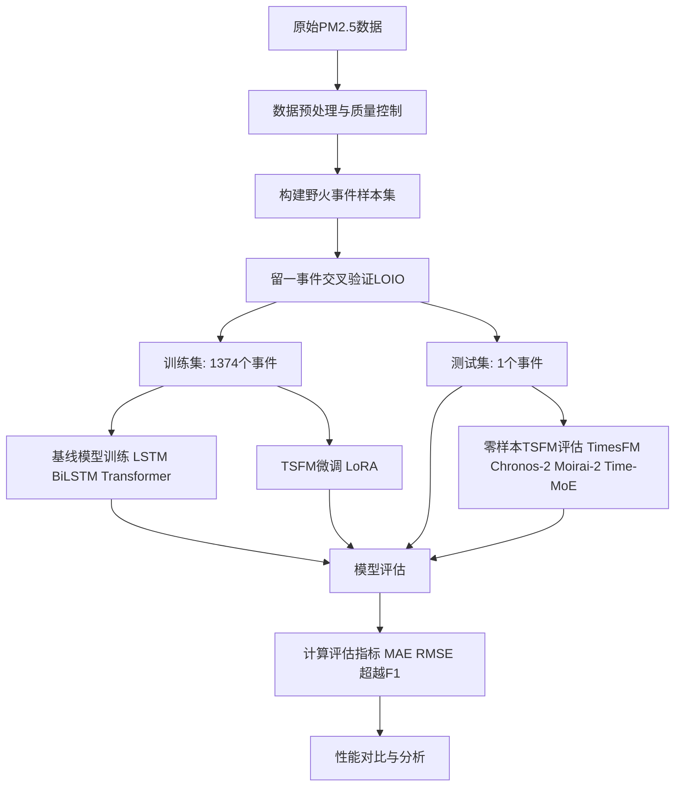
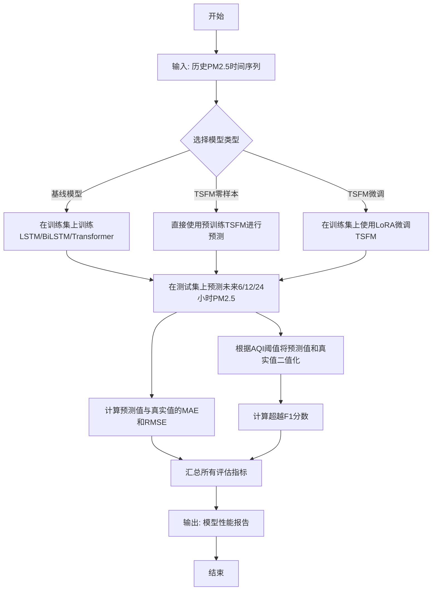
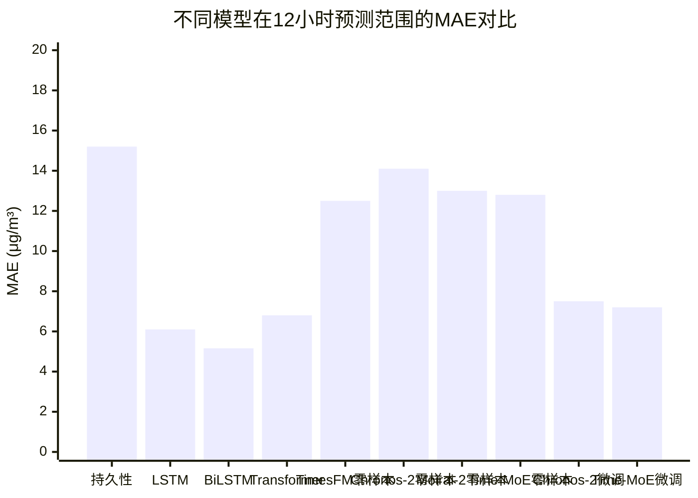

# Evaluating the Generalizability of Foundation Models for Extreme Environmental Events: Case Study of California Wildfire PM2.5

> 本文由 paper-daily 使用 DeepSeek 自动生成，仅供快速了解论文；关键结论请以原文为准。

[论文原文](https://arxiv.org/abs/2607.07951) · [PDF](https://arxiv.org/pdf/2607.07951) · [源文件](https://github.com/vsvnakers/paper-daily/blob/master/essay_read/2026-07-10/2607.07951.md)

> 通过系统基准测试，揭示通用时间序列基础模型在野火PM2.5极端事件预测中泛化能力不足，挑战了“越大越好”的假设。

## 基本信息

| 属性 | 内容 |
|------|------|
| **作者** | Yongcan Huang, Li Jiang, Ze Yu Liu |
| **来源** | [arXiv:2607.07951](https://arxiv.org/abs/2607.07951) |
| **发布日期** | 2026-07-08 |
| **抓取领域** | 分布式/并行训练系统 |
| **学科方向** | 机器学习 · physics.ao-ph |
| **arXiv 分类** | cs.LG, physics.ao-ph |
| **适用层次** | 基础 |
| **标签** | 时间序列基础模型, 极端事件预测, 野火PM2.5, 泛化性评估, 留一事件交叉验证 |
| **PDF** | [在线阅读](https://arxiv.org/pdf/2607.07951) |
| **代码仓库** | 暂无

---

## 问题的初衷（Why - 为什么要做这个研究）

【问题的初衷】这篇论文聚焦于一个极具挑战性的环境预测问题：野火产生的PM2.5极端浓度预测。野火事件（Wildfire Events）会释放大量细颗粒物（PM2.5），导致空气质量急剧恶化，对公众健康构成严重威胁。然而，预测这些罕见且危害巨大的极端峰值（Extreme Spikes）是传统时间序列预测（Time Series Forecasting）的根本性难题。主要原因在于：1）极端事件在数据集中属于长尾分布（Long-tail Distribution），样本稀少，导致模型难以学习其模式；2）野火事件具有高度动态性和空间异质性，其烟羽扩散受气象、地形等多种因素影响，使得模型在未见过的野火事件上泛化能力极差。近年来，时间序列基础模型（Time Series Foundation Models, TSFMs）如TimesFM、Chronos等，凭借其在大规模数据上的预训练能力，在通用基准测试中表现优异，并展现出零样本推理（Zero-shot Inference）和高效微调（Efficient Adaptation）的潜力。然而，这些模型在极端分布外（Out-of-distribution, OOD）条件下的行为尚不明确。现有研究大多关注通用预测任务，缺乏对TSFMs在极端环境事件中泛化能力的系统性评估。因此，本文的动机是填补这一空白，通过严格的基准测试，揭示TSFMs在野火PM2.5极端浓度预测中的真实表现，挑战其“越大越好”的普遍假设，并为实际部署提供指导。

---

## 问题的解决（What - 提出了什么方案）

【问题的解决】论文通过构建一个系统性的基准测试框架来解决上述问题。核心思路是：设计一个严格的“留一事件交叉验证”（Leave-One-Incident-Out, LOIO）协议，来评估模型对未见野火事件的泛化能力。具体来说，论文收集了覆盖加州79个监测站点、长达12年（2013-2025）的每小时PM2.5数据，包含了1375次野火事件。在这个框架下，论文对比了六种TSFM配置（包括零样本的TimesFM、Chronos-2、Moirai-2、Time-MoE，以及经过LoRA微调的Chronos-2和Time-MoE）与三种完全训练的基线模型（LSTM、BiLSTM、Transformer）以及一个朴素持久性模型（Persistence）。关键创新点在于：1）首次对TSFMs在极端环境事件预测中的泛化性进行了系统评估；2）采用了LOIO协议，这比传统的随机划分更能模拟真实世界中模型面对全新野火事件的场景；3）不仅关注平均误差（MAE, RMSE），还特别引入了基于EPA空气质量指数（AQI）阈值的超越F1分数（Exceedance F1），专门评估模型预测极端高值事件的能力。与现有方法的本质区别在于，现有工作多侧重于通用预测或特定领域的模型训练，而本文则聚焦于评估预训练基础模型在极端OOD场景下的零样本和微调性能，并揭示了其与专用小模型（如BiLSTM）之间的性能差距。

---

## 技术方法详解（How - 怎么实现的）

【技术方法详解】
- **数据集构建与预处理**：从美国环境保护署（EPA）的AirNow平台收集了2013年至2025年加州79个监测站点的逐小时PM2.5数据。每个数据点包含时间戳、站点ID和PM2.5浓度值（单位：$\mu g/m^3$）。数据经过质量控制，剔除了异常值。对于每个野火事件，提取事件发生前后一段时间窗口内的数据作为样本。
- **留一事件交叉验证（LOIO）协议**：这是评估泛化能力的关键。将1375次野火事件视为独立的样本。在每一轮验证中，选择一个事件作为测试集，其余1374个事件作为训练集（对于需要训练的模型）或用于微调。这确保了模型在测试时面对的是一个完全未见过的野火事件，从而严格评估其泛化性。
- **基线模型**：
    - **持久性模型（Persistence）**：最简单的基线，直接使用当前时刻的PM2.5值作为未来所有时刻的预测值。
    - **LSTM与BiLSTM**：长短期记忆网络（Long Short-Term Memory）和双向LSTM。BiLSTM通过从过去和未来两个方向处理序列，能更好地捕捉上下文信息。它们被作为完全训练的循环神经网络（RNN）基线。
    - **Transformer**：基于自注意力机制（Self-Attention Mechanism）的模型，作为完全训练的Transformer基线。
- **时间序列基础模型（TSFMs）**：
    - **TimesFM**：Google提出的基于Decoder-only架构的预训练时间序列模型。
    - **Chronos-2**：Amazon提出的基于T5编码器-解码器架构的模型。
    - **Moirai-2**：统一时间序列预训练模型。
    - **Time-MoE**：基于混合专家模型（Mixture of Experts, MoE）的时间序列模型。
    - 所有TSFM均以零样本（Zero-shot）方式评估。此外，Chronos-2和Time-MoE还通过低秩适应（Low-Rank Adaptation, LoRA）进行微调。LoRA是一种参数高效的微调方法，通过向模型权重矩阵添加低秩分解矩阵来更新模型，而冻结原始预训练权重。
- **评估指标**：
    - **平均绝对误差（MAE）**：$MAE = \frac{1}{n}\sum_{i=1}^{n}|y_i - \hat{y}_i|$
    - **均方根误差（RMSE）**：$RMSE = \sqrt{\frac{1}{n}\sum_{i=1}^{n}(y_i - \hat{y}_i)^2}$
    - **超越F1分数（Exceedance F1）**：这是一个专门用于评估极端事件预测能力的指标。首先，根据EPA的AQI阈值（如“对敏感人群不健康”>55.5 $\mu g/m^3$，“不健康”>150.5 $\mu g/m^3$，“非常不健康”>250.5 $\mu g/m^3$，“危险”>350.5 $\mu g/m^3$），将真实值和预测值二值化为“是否超过该阈值”。然后，计算这些二值标签的F1分数。该指标直接衡量模型预测极端高值事件的能力。
- **预测时间范围（Horizons）**：评估模型在6小时、12小时和24小时三个预测时间范围上的性能。

## 系统架构图

## 方法流程图

## 核心公式与算法

【核心公式】
1. **平均绝对误差（MAE）**：
$$MAE = \frac{1}{n} \sum_{i=1}^{n} |y_i - \hat{y}_i|$$
其中，$y_i$ 是第 $i$ 个样本的真实PM2.5浓度值，$\hat{y}_i$ 是模型预测值，$n$ 是样本总数。MAE衡量预测误差的平均大小，对异常值不敏感。

2. **超越F1分数（Exceedance F1）**：
首先，定义一个阈值 $\tau$（如EPA AQI阈值），将真实值和预测值转换为二值标签：
$$z_i = \mathbb{1}(y_i > \tau), \quad \hat{z}_i = \mathbb{1}(\hat{y}_i > \tau)$$
然后，计算精确率（Precision）和召回率（Recall）：
$$P = \frac{TP}{TP+FP}, \quad R = \frac{TP}{TP+FN}$$
其中，TP、FP、FN分别代表真正例、假正例和假负例。最后，F1分数为：
$$F1 = 2 \cdot \frac{P \cdot R}{P + R}$$
该指标专门用于评估模型预测极端高值事件的能力。

3. **低秩适应（LoRA）**：
LoRA的核心思想是，对于预训练权重矩阵 $W_0 \in \mathbb{R}^{d \times k}$，其更新量可以表示为两个低秩矩阵的乘积：
$$W_0 + \Delta W = W_0 + BA$$
其中，$B \in \mathbb{R}^{d \times r}$，$A \in \mathbb{R}^{r \times k}$，且秩 $r \ll \min(d, k)$。在微调过程中，$W_0$ 被冻结，只更新 $A$ 和 $B$。这大大减少了需要训练的参数数量。

---

## 应用场景（Where - 在哪落地）

【应用场景】
1. **野火应急响应与公共健康预警**：
   - **应用领域**：应急管理、公共卫生、气象服务。
   - **如何使用**：当野火发生时，应急管理部门可以利用本文评估的模型（特别是表现最好的BiLSTM）来预测未来6-24小时内不同区域的PM2.5浓度。结合EPA的AQI阈值，系统可以自动生成分级预警信息。例如，当预测到某区域PM2.5浓度将超过“不健康”阈值（150.5 $\mu g/m^3$）时，立即向该区域居民发布“减少外出、佩戴N95口罩”的建议。对于预测将超过“危险”阈值（350.5 $\mu g/m^3$）的区域，则启动强制疏散预案。
   - **预期效果**：显著提升预警的准确性和时效性，特别是对极端高值事件的预测能力，从而为公众争取更多的准备和疏散时间，减少野火烟雾对健康的危害。

2. **长期空气质量规划与政策制定**：
   - **应用领域**：环境规划、气候变化研究。
   - **如何使用**：环境规划部门可以利用该模型，结合未来气候变化情景下的野火风险预测数据，模拟未来几十年内不同区域的PM2.5极端事件发生频率和强度。这有助于评估现有空气质量标准的有效性，并为制定更严格的野火管理政策（如计划烧除、防火带建设）提供数据支持。例如，模型可以预测在某种气候情景下，加州某地区未来十年内PM2.5浓度超过“非常不健康”阈值的天数将增加多少，从而为医疗资源分配和基础设施建设提供依据。
   - **预期效果**：使政策制定从被动响应转向主动预防，基于数据驱动的预测结果进行长期规划，提高社会对气候变化和极端环境事件的适应能力。

3. **个人健康管理与智能穿戴设备**：
   - **应用领域**：个人健康、物联网。
   - **如何使用**：将轻量级的预测模型（如经过量化的LSTM）部署到智能手表、手机等个人设备上。设备通过GPS获取用户位置，并结合本地气象数据和公共野火信息，为用户提供个性化的空气质量预测和健康建议。例如，当模型预测用户未来一小时内所在区域的PM2.5浓度将急剧上升时，设备会主动推送通知，建议用户改变跑步路线或关闭窗户。
   - **预期效果**：将宏观的空气质量预测转化为个性化的、可操作的健康建议，提升个人对空气污染风险的感知和应对能力，尤其对哮喘、心脏病等敏感人群具有重要价值。

---

## 具体技术细节示例（How in Action - 算法如何执行）

【具体技术细节示例】
假设我们使用一个简单的LSTM模型来预测未来1小时的PM2.5浓度。

**输入设定**：
- 历史时间窗口长度（Lookback Window）：3小时。
- 输入数据：过去3小时某监测站的PM2.5浓度值，单位为 $\mu g/m^3$。
  - $t-3$ 时刻：$10$ $\mu g/m^3$
  - $t-2$ 时刻：$15$ $\mu g/m^3$
  - $t-1$ 时刻：$25$ $\mu g/m^3$
- 真实值（$t$ 时刻）：$50$ $\mu g/m^3$（由于野火烟雾影响，浓度急剧上升）。

**模型参数（简化）**：
- LSTM隐藏层大小（Hidden Size）：4。
- 输入维度：1（单变量时间序列）。
- 激活函数：tanh 和 sigmoid。

**逐步执行过程**：
1. **数据归一化**：将输入数据归一化到 [0, 1] 区间。假设使用Min-Max归一化，已知历史数据最大值为100，最小值为0。则归一化后的输入为：
   - $x_{t-3} = 10/100 = 0.1$
   - $x_{t-2} = 15/100 = 0.15$
   - $x_{t-1} = 25/100 = 0.25$

2. **LSTM前向传播**：LSTM在每个时间步 $t$ 维护一个隐藏状态 $h_t$ 和一个细胞状态 $c_t$。初始状态 $h_0$ 和 $c_0$ 通常设为0。
   - **时间步1（输入 $x_{t-3}=0.1$）**：
     - 遗忘门：$f_1 = \sigma(W_f \cdot [h_0, x_{t-3}] + b_f)$，假设计算结果为0.9，表示保留大部分旧信息。
     - 输入门：$i_1 = \sigma(W_i \cdot [h_0, x_{t-3}] + b_i)$，假设为0.2。
     - 候选细胞状态：$\tilde{c}_1 = \tanh(W_c \cdot [h_0, x_{t-3}] + b_c)$，假设为0.3。
     - 更新细胞状态：$c_1 = f_1 * c_0 + i_1 * \tilde{c}_1 = 0.9*0 + 0.2*0.3 = 0.06$。
     - 输出门：$o_1 = \sigma(W_o \cdot [h_0, x_{t-3}] + b_o)$，假设为0.1。
     - 隐藏状态：$h_1 = o_1 * \tanh(c_1) = 0.1 * \tanh(0.06) \approx 0.006$。
   - **时间步2（输入 $x_{t-2}=0.15$）**：重复上述过程，输入变为 $[h_1, x_{t-2}]$。假设计算得到 $h_2 \approx 0.02$。
   - **时间步3（输入 $x_{t-1}=0.25$）**：重复上述过程，输入变为 $[h_2, x_{t-1}]$。假设计算得到 $h_3 \approx 0.05$。

3. **输出层**：LSTM的最终隐藏状态 $h_3$ 被送入一个全连接层，生成预测值。
   - 假设全连接层权重 $W_{out}=2.0$，偏置 $b_{out}=0.1$。
   - 预测的归一化值：$\hat{y}_{norm} = W_{out} * h_3 + b_{out} = 2.0 * 0.05 + 0.1 = 0.2$。

4. **反归一化**：将预测值映射回原始尺度。
   - $\hat{y} = \hat{y}_{norm} * 100 = 0.2 * 100 = 20$ $\mu g/m^3$。

**输出结果**：
- 模型预测 $t$ 时刻的PM2.5浓度为 $20$ $\mu g/m^3$。
- 真实值为 $50$ $\mu g/m^3$。
- 绝对误差为 $|50 - 20| = 30$ $\mu g/m^3$。

**分析**：在这个例子中，模型未能捕捉到PM2.5浓度的急剧上升趋势，预测值远低于真实值。这体现了在极端事件预测中，模型可能因为历史数据中缺乏类似模式而失效。这正是论文所关注的核心问题。通过LOIO协议，可以系统性地评估模型在面对这种全新模式时的泛化能力。

---

## 实验结果（Results - 效果如何）

【实验结果】论文在加州野火PM2.5数据集上进行了详尽的实验。主要发现如下：1）在所有指标和预测时间范围上，完全训练的BiLSTM模型表现最佳，取得了最低的MAE（5.16 $\mu g/m^3$）和最高的超越F1分数。特别是在“危险”等级（>225.5 $\mu g/m^3$）上，BiLSTM的超越F1达到0.63，而所有基础模型最高仅为0.54。2）零样本TSFMs的表现仅略优于持久性模型，远不如训练过的基线模型。3）零样本Chronos-2表现出严重的RMSE尾部不稳定性（23.4 $\mu g/m^3$，负的$R^2$），表明其偶尔会产生巨大的预测误差。4）通过LoRA微调，Chronos-2和Time-MoE的性能得到显著提升，并基本修复了Chronos-2的尾部不稳定性问题。然而，即使经过微调，没有任何一个基础模型能在任何指标上超越训练过的循环基线模型（LSTM和BiLSTM）。这些结果挑战了“更大的预训练模型在环境预测领域必然占优”的普遍假设。

## 实验结果可视化

---

## 优势与不足

【优势与不足】
**优势：**
1. **问题聚焦且具有现实意义**：论文精准地抓住了环境预测中的一个关键痛点——极端事件预测，并选择了野火PM2.5这一具有重大公共健康影响的具体案例，研究动机明确且重要。
2. **严谨的实验设计**：采用LOIO协议进行泛化性评估，比传统随机划分更严格、更贴近实际应用场景。同时，引入超越F1分数作为评估极端事件的专用指标，避免了平均误差指标对极端值的掩盖。
3. **全面的模型对比**：涵盖了多种主流TSFM（包括零样本和微调版本）以及多种经典基线模型，对比全面，结论具有说服力。
4. **挑战主流假设**：实验结果有力地挑战了“基础模型越大越好”的普遍观点，为环境科学和AI交叉领域的研究者提供了重要的实证参考。

**不足：**
1. **数据局限性**：研究仅基于加州一个地区的野火数据，模型和结论的泛化性可能受限于该地区的气候、地理和野火类型。其他地区或不同类型的极端事件（如洪水、热浪）可能得出不同结论。
2. **TSFM微调方法单一**：论文仅尝试了LoRA这一种参数高效微调方法。其他微调策略（如全参数微调、适配器（Adapter）等）可能带来不同的性能提升，论文未进行探索。
3. **缺乏对模型可解释性的分析**：论文主要关注预测性能的数值对比，但未深入分析为什么BiLSTM表现更好，或者TSFMs在哪些具体情况下失败。缺乏对模型决策过程的可解释性分析。

---

## 相关工作

【相关工作】
1. **时间序列基础模型（TSFMs）**：如TimesFM、Chronos、Moirai等。本文直接评估了这些模型在极端环境事件上的泛化能力，是对现有TSFM评估工作的补充和挑战。
2. **极端事件预测**：传统方法包括统计模型（如极值理论）和机器学习模型（如随机森林、梯度提升树）。本文将其与深度学习模型和TSFMs进行了对比。
3. **野火烟雾与空气质量预测**：相关工作包括使用物理化学模型（如CMAQ、WRF-Chem）和数据驱动模型进行野火PM2.5预测。本文提供了一个新的深度学习基准。
4. **迁移学习与领域自适应**：TSFMs的零样本和微调能力本质上是迁移学习的一种形式。本文的研究揭示了在极端OOD场景下，简单的迁移学习（零样本）效果不佳，而参数高效的微调（LoRA）能带来改善但仍不及领域内训练。

---

## 未来研究方向

【未来方向】
1. **多模态数据融合**：当前模型仅使用PM2.5时间序列数据。未来可以融合气象数据（如风速、风向、温度、湿度）、卫星遥感数据（如火点位置、烟雾扩散范围）、地形数据等，构建多模态预测模型。这有望提升模型对野火烟雾扩散的物理过程的理解，从而改善极端事件的预测能力。
2. **不确定性量化（Uncertainty Quantification）**：论文发现零样本Chronos-2存在严重的RMSE尾部不稳定性。未来研究可以探索为TSFMs增加不确定性量化模块，例如通过贝叶斯神经网络（Bayesian Neural Network）或蒙特卡洛dropout（Monte Carlo Dropout），使模型不仅能给出点预测，还能输出预测的置信区间。这对于高风险决策（如疏散命令）至关重要。
3. **针对极端事件的预训练策略**：论文结果表明，通用预训练的TSFMs在极端OOD场景下表现不佳。未来可以探索专门针对极端事件（如野火、洪水、热浪）设计预训练任务和数据集。例如，在预训练阶段，通过数据增强技术（如合成极端事件样本）或设计专门针对尾部风险的损失函数，来提升模型对极端模式的敏感性。

---

## 一句话总结

> 通过系统基准测试，揭示通用时间序列基础模型在野火PM2.5极端事件预测中泛化能力不足，挑战了“越大越好”的假设。

---

*本解读由 DeepSeek AI 自动生成，仅供参考。*
