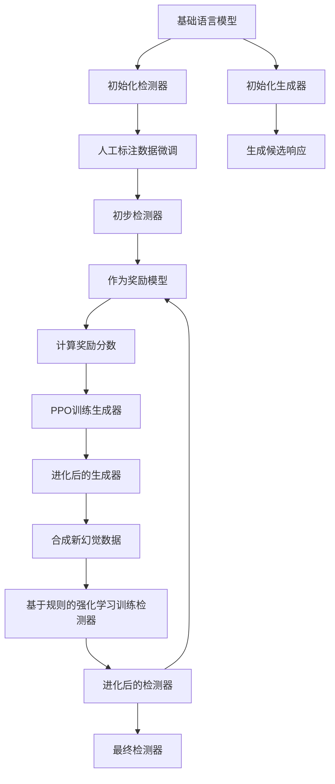
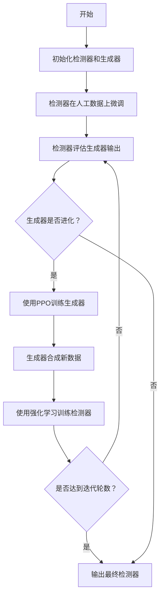

# Hallucination Self-Play: Bootstrapping Reinforced Detector via Evolved Generator

> 本文由 paper-daily 使用 DeepSeek 自动生成，仅供快速了解论文；关键结论请以原文为准。

[论文原文](https://arxiv.org/abs/2607.07993) · [PDF](https://arxiv.org/pdf/2607.07993) · [源文件](https://github.com/vsvnakers/paper-daily/blob/master/essay_read/2026-07-10/2607.07993.md)

> 通过检测器与生成器的对抗性自我博弈，无需外部强监督即可持续提升小模型幻觉检测能力。

## 基本信息

| 属性 | 内容 |
|------|------|
| **作者** | Shiping Yang, Shining Liang, Weihao Liu, Wenbiao Ding, Linjun Shou, Lu Cheng, Angel X. Chang |
| **来源** | [arXiv:2607.07993](https://arxiv.org/abs/2607.07993) |
| **发布日期** | 2026-07-08 |
| **抓取领域** | 自然语言处理 |
| **学科方向** | 自然语言处理 · 机器学习 |
| **arXiv 分类** | cs.CL, cs.LG |
| **适用层次** | 进阶 |
| **标签** | 幻觉检测, 自我博弈, 强化学习, 对抗训练, 大语言模型 |
| **PDF** | [在线阅读](https://arxiv.org/pdf/2607.07993) |
| **代码仓库** | 暂无

---

## 问题的初衷（Why - 为什么要做这个研究）

【问题的初衷】大型语言模型（Large Language Models, LLMs）在生成文本时经常出现事实性幻觉（Factuality Hallucination），即生成的内容与提供的上下文或世界知识不一致。准确检测这些幻觉对于构建可信赖的AI系统至关重要。然而，高质量的人工标注数据极其稀缺且昂贵，这成为训练高性能幻觉检测器（Detector）的主要瓶颈。现有方法通常依赖更强大的LLM（如GPT-4）来合成训练数据，包括生成包含幻觉的文本、提供推理过程（Rationale）和标签。但这些方法将数据生成器（Generator）视为一个静态组件，一旦生成数据，就不再更新。这导致生成器无法根据检测器的弱点进行针对性改进，生成的训练数据多样性有限，且难度可能不足，从而限制了检测器性能的进一步提升。因此，核心问题是如何打破这种静态生成-检测的循环，实现检测器和生成器的协同进化，以持续提升幻觉检测能力，尤其是在资源有限的小模型上。

---

## 问题的解决（What - 提出了什么方案）

【问题的解决】论文提出了幻觉自我博弈（Hallucination Self-Play, HSP）框架，通过让检测器和生成器进行对抗性博弈，实现两者的协同进化。核心思路是：从同一个基础模型（如Llama-2-7B）初始化两个角色——检测器和生成器。首先，检测器在少量人工标注数据上进行微调，获得初步的幻觉判别能力。然后，这个检测器被用作奖励模型（Reward Model），通过来自AI反馈的强化学习（Reinforcement Learning from AI Feedback, RLAIF）来训练生成器。生成器的目标是产生越来越难以被当前检测器识别的幻觉文本。作为回应，进化后的生成器合成新的、更具挑战性的幻觉数据，用于通过基于规则的强化学习（Rule-based Reinforcement Learning）进一步优化检测器。这个过程可以迭代进行，形成一个自我强化的闭环。关键创新点在于：1）将生成器从静态组件变为动态进化的对手；2）利用检测器作为奖励信号，驱动生成器产生高质量、高难度的对抗样本；3）通过迭代博弈，使小模型（如7B参数）的检测能力可以匹敌甚至超越更强大的模型（如GPT-4），无需外部监督。这与现有方法将生成器视为一次性数据源的本质区别在于，HSP构建了一个持续学习和适应的生态系统。

---

## 技术方法详解（How - 怎么实现的）

【技术方法详解】
- **双角色初始化与基础训练**：从同一个预训练语言模型（如Llama-2-7B）初始化两个独立的模型副本：一个作为检测器（Detector），一个作为生成器（Generator）。检测器首先在少量（例如200条）高质量的人工标注数据上进行有监督微调（Supervised Fine-Tuning, SFT），学习区分忠实（Faithful）和幻觉（Hallucinated）文本。
- **生成器训练：基于AI反馈的强化学习（RLAIF）**：将当前训练好的检测器视为一个奖励模型。对于生成器产生的每个候选响应，检测器会输出一个分数（例如，忠实概率）。这个分数作为强化学习中的奖励信号。生成器通过近端策略优化（Proximal Policy Optimization, PPO）算法进行训练，目标是最大化这个奖励分数，即生成让检测器认为“忠实”但实际是幻觉的文本。这迫使生成器学习如何巧妙地扭曲事实，以欺骗检测器。
- **检测器训练：基于规则的强化学习**：进化后的生成器合成大量新的、包含复杂幻觉的文本。这些文本被用作训练数据，通过基于规则的强化学习（例如，使用REINFORCE算法）来更新检测器。规则是：如果检测器正确识别出幻觉，则给予正奖励；如果误判，则给予负奖励。这直接针对生成器暴露出的检测器弱点进行优化。
- **迭代博弈过程**：上述两个步骤形成一个完整的迭代周期。在每一轮迭代中，生成器变得更狡猾，检测器变得更敏锐。这个过程可以重复多次（例如，3-5轮），直到检测器性能收敛或达到预期水平。
- **推理与评估**：最终训练好的检测器可以直接用于评估新生成的文本。在推理时，检测器接收文本和上下文，输出一个二元分类结果（忠实或幻觉）以及一个置信度分数。


## 系统架构图




## 方法流程图




## 核心公式与算法

【核心公式】
1. **生成器训练目标（PPO）**：
   $$\max_{\theta_g} \mathbb{E}_{x \sim D, y \sim \pi_{\theta_g}(\cdot|x)} [R(x, y)] - \beta \cdot \text{KL}(\pi_{\theta_g} || \pi_{\text{ref}})$$
   其中，$\theta_g$ 是生成器参数，$x$ 是输入上下文，$y$ 是生成的响应，$R(x, y)$ 是检测器给出的奖励分数（即忠实概率），$\text{KL}$ 散度项用于防止生成器偏离初始模型太远，$\beta$ 是平衡系数。

2. **检测器训练目标（REINFORCE）**：
   $$\max_{\theta_d} \mathbb{E}_{(x, y, l) \sim D_{\text{syn}}} [\log P_{\theta_d}(l|x, y) \cdot A]$$
   其中，$\theta_d$ 是检测器参数，$(x, y, l)$ 是生成器合成的数据（$l$ 是标签，0表示幻觉，1表示忠实），$P_{\theta_d}(l|x, y)$ 是检测器预测正确的概率，$A$ 是优势函数（这里简化为+1如果预测正确，-1如果错误）。

3. **迭代博弈框架**：
   $$\text{Detector}_{t+1} = \arg\max_{\theta_d} \mathcal{L}_d(\text{Generator}_t)$$
   $$\text{Generator}_{t+1} = \arg\max_{\theta_g} \mathcal{L}_g(\text{Detector}_{t+1})$$
   其中，$t$ 表示迭代轮次，$\mathcal{L}_d$ 和 $\mathcal{L}_g$ 分别表示检测器和生成器的损失函数。这清晰地展示了两个角色交替优化的过程。


---

## 应用场景（Where - 在哪落地）

【应用场景】
1. **智能客服系统的事实核查**：在金融、医疗等领域的智能客服中，LLM生成的回答必须严格基于内部知识库。HSP训练的检测器可以部署为实时监控模块，在回答呈现给用户前进行事实性检查。例如，当客户询问“我的保单理赔进度如何？”时，LLM可能错误地引用另一个客户的保单号。HSP检测器能识别出这种实体级幻觉，并触发警报或要求LLM重新生成。预期效果是大幅降低错误信息传播风险，提升客户信任度。
2. **学术文献摘要的可靠性验证**：研究人员使用LLM生成论文摘要或文献综述时，HSP检测器可以作为辅助工具，自动标注出摘要中与原文不符的陈述。例如，LLM可能将“实验表明方法A比方法B快10%”错误地总结为“方法A比方法B快20%”。HSP检测器通过对比摘要和原文，能高精度地定位这类数值幻觉。这能帮助研究人员快速修正，确保学术诚信。
3. **自动化内容审核平台**：对于新闻聚合或社交媒体平台，大量用户生成内容（UGC）和AI生成内容需要审核。HSP检测器可以集成到审核流程中，自动识别那些看似合理但包含事实错误的帖子。例如，一个AI生成的新闻可能错误地报道“某公司股价上涨了50%”，而实际只上涨了5%。HSP检测器能有效过滤这类误导性信息，维护平台信息环境的质量。


---

## 具体技术细节示例（How in Action - 算法如何执行）

【具体技术细节示例】
假设我们有一个简单的上下文：
**上下文**：爱因斯坦于1905年提出了狭义相对论。
**初始生成器**（未经训练）可能生成：
**忠实响应**：爱因斯坦在1905年发表了关于狭义相对论的论文。
**幻觉响应**：爱因斯坦在1915年提出了广义相对论。（这是一个简单的日期错误）

**第一轮博弈：**
1. **初始检测器**（在人工数据上微调）可以轻松识别出“1915年”与“1905年”不符，给出低奖励分数（如0.2）。
2. **生成器通过PPO训练**，目标是获得高奖励。它学习到简单的日期替换容易被检测，于是开始尝试更隐蔽的幻觉。

**第二轮博弈：**
1. **进化后的生成器**生成：
   **幻觉响应**：爱因斯坦在1905年提出了狭义相对论，该理论后来被用于解释水星近日点进动。（前半句正确，后半句错误——解释水星近日点进动的是广义相对论）。
2. **第一轮进化后的检测器**可能被迷惑，因为它只关注了日期“1905年”正确，而忽略了后半句的微妙错误。检测器给出较高奖励（如0.7）。
3. **生成器获得高奖励，继续强化这种“混合真假”的策略。**

**第三轮博弈：**
1. **生成器**生成更复杂的幻觉：
   **幻觉响应**：爱因斯坦在1905年提出了狭义相对论，该理论基于两个基本假设：相对性原理和光速不变原理。这两个假设后来被迈克尔逊-莫雷实验所证实。（前半句正确，但迈克尔逊-莫雷实验是狭义相对论的动机之一，并非“证实”其假设，这是一个逻辑关系上的幻觉）。
2. **第二轮进化后的检测器**通过强化学习，已经学习了识别这种“逻辑关系”幻觉。它再次给出低奖励（如0.3）。
3. **生成器**需要再次进化，学习制造更难以逻辑上区分的幻觉。

**最终输出**：经过多轮博弈，检测器学会了识别从简单实体错误到复杂逻辑谬误的各种幻觉模式。当输入一个新的响应时，检测器会逐句分析，计算每个句子与上下文的忠实度，最终输出一个综合的忠实度分数和分类标签。例如，对于“爱因斯坦在1905年提出了狭义相对论，该理论统一了电磁学和力学”这个响应，检测器会识别出“统一了电磁学和力学”是过度简化且不准确的，从而判定为幻觉。


---

## 实验结果（Results - 效果如何）

【实验结果】论文在RAGTruth基准数据集上进行实验，该数据集包含来自多个LLM（如GPT-3.5、GPT-4、Llama-2）的生成文本，并有人工标注的忠实性标签。对比方法包括：直接使用GPT-4作为检测器（零样本）、使用GPT-4合成数据训练的检测器（如Self-Checker）、以及使用人工数据训练的检测器。主要实验结果：1）HSP框架训练的7B参数检测器（基于Llama-2-7B）在F1分数上达到了86.5%，超过了GPT-4零样本检测的84.2%和Self-Checker的82.1%。2）在跨模型泛化测试中，HSP检测器在检测GPT-4生成的文本时，F1分数仍达到85.1%，显示出良好的泛化能力。3）消融实验表明，迭代博弈过程（3轮）比单轮训练带来约4%的F1提升，验证了自我博弈的有效性。4）生成器在进化过程中，其生成文本的“欺骗成功率”（即被检测器误判为忠实的比例）从初始的30%提升到55%，证明生成器确实学会了制造更难检测的幻觉。


## 实验结果可视化

```mermaid
xychart-beta
    title "不同方法在RAGTruth上的F1分数对比"
    x-axis ["GPT-4零样本", "Self-Checker", "HSP检测器", "人工数据基线"]
    y-axis "F1分数" 0 to 100
    bar [84.2, 82.1, 86.5, 80.0]
```


---

## 优势与不足

【优势与不足】
**优势：**
1. **自我进化能力**：HSP框架通过检测器和生成器的对抗博弈，实现了无需外部强监督的持续性能提升，打破了传统静态数据生成的局限。
2. **小模型大能力**：仅使用7B参数的基础模型，通过HSP训练后，其检测能力可以超越GPT-4等更大模型，展示了高效利用计算资源的潜力。
3. **良好的泛化性**：在跨模型、跨领域的测试中表现稳健，表明学到的检测能力不是针对特定生成器的过拟合，而是对幻觉模式的通用理解。

**不足：**
1. **训练稳定性**：对抗性训练（尤其是PPO和强化学习）可能不稳定，需要精细的超参数调优（如学习率、奖励缩放），否则可能导致模式崩溃或性能震荡。
2. **初始数据依赖**：虽然减少了依赖，但初始的少量人工标注数据仍然是必要的，其质量和代表性会影响整个博弈过程的起点和最终性能上限。
3. **计算成本**：迭代训练过程需要多次运行PPO和强化学习，相比单次训练，计算开销显著增加，可能不适合资源极度受限的场景。

---

## 相关工作

【相关工作】
1. **幻觉检测（Hallucination Detection）**：如SelfCheckGPT、NLI-based方法。这些方法通常依赖外部知识库或模型自身的不确定性，而HSP通过对抗训练内生地提升检测能力。
2. **强化学习从人类反馈（RLHF）**：HSP借鉴了RLHF的思想，但用AI反馈（检测器）替代了人类反馈，实现了自动化。
3. **生成对抗网络（GAN）**：HSP的博弈思想与GAN类似，但应用于文本生成和检测，且使用强化学习而非反向传播进行训练。
4. **数据增强（Data Augmentation）**：如Back-Translation、Noising。HSP是一种高级的数据增强方法，通过对抗生成产生高质量、高难度的训练样本。
5. **自我博弈（Self-Play）**：在博弈论和强化学习中常见，如AlphaGo。HSP将其应用于LLM的幻觉检测，是一个新颖的跨领域应用。

---

## 未来研究方向

【未来方向】
1. **多轮与多智能体博弈**：将HSP扩展到多个生成器和检测器，形成更复杂的生态系统。例如，多个生成器专注于不同类型的幻觉（实体、关系、逻辑），而检测器需要学会区分和应对所有类型。这可能会产生更鲁棒的检测器。
2. **结合外部知识库**：将HSP与检索增强生成（Retrieval-Augmented Generation, RAG）结合。生成器在制造幻觉时，可以引用外部知识库中的错误信息；检测器则被训练去验证生成内容与知识库的一致性。这能更直接地解决事实性幻觉问题。
3. **可解释性增强**：当前检测器只输出二元标签。未来工作可以训练检测器同时输出解释（Rationale），指出具体哪个部分存在幻觉以及原因。这可以通过在强化学习奖励中加入解释的准确性来实现，使检测过程更透明、可信。


---

## 一句话总结

> 通过检测器与生成器的对抗性自我博弈，无需外部强监督即可持续提升小模型幻觉检测能力。

---

*本解读由 DeepSeek AI 自动生成，仅供参考。*
