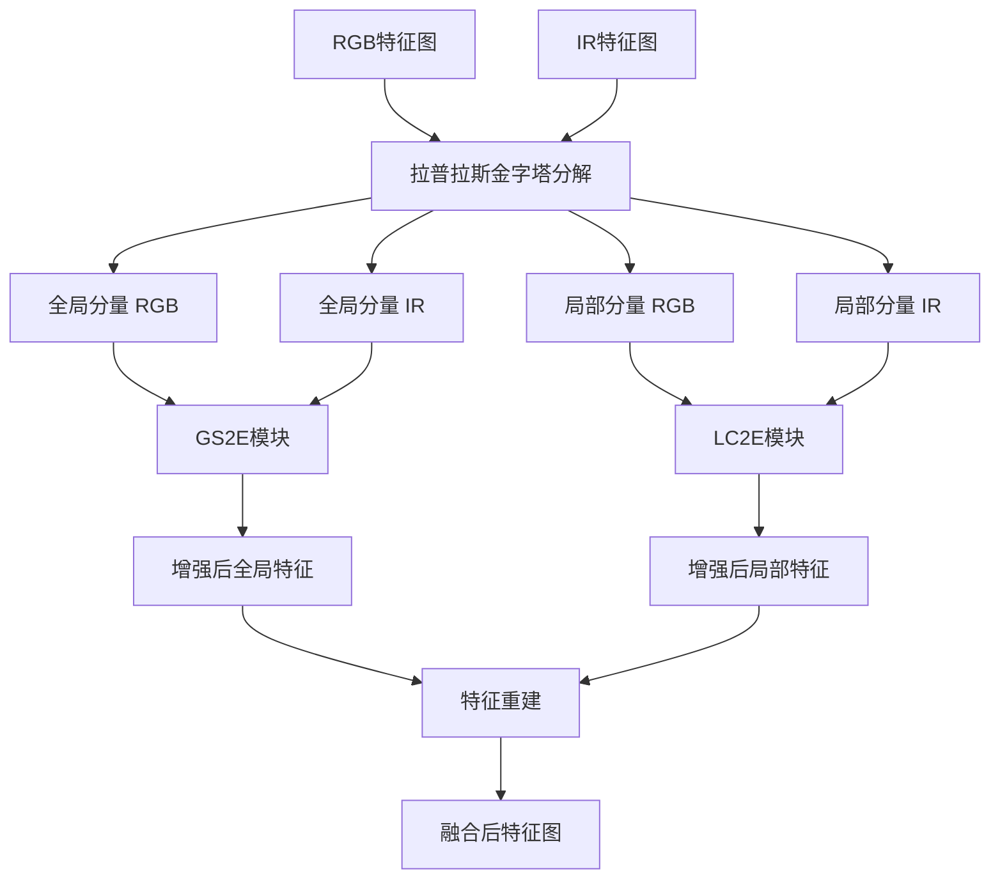
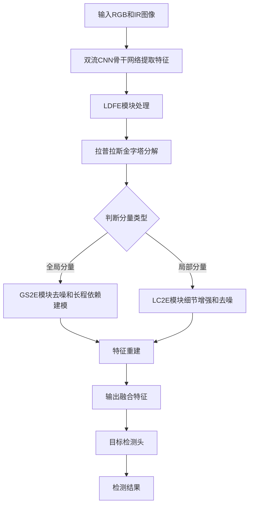

# LDFE: Laplacian Decoupled Feature Enhancement Block for Dual-Stream CNN-based RGB-IR Object Detection

> 本文由 paper-daily 使用 DeepSeek 自动生成，仅供快速了解论文；关键结论请以原文为准。

[论文原文](https://arxiv.org/abs/2607.08076) · [PDF](https://arxiv.org/pdf/2607.08076) · [源文件](https://github.com/vsvnakers/paper-daily/blob/master/essay_read/2026-07-10/2607.08076.md)

> 提出拉普拉斯解耦特征增强模块，通过全局-局部分解和状态空间模型实现高效RGB-IR双流目标检测。

## 基本信息

| 属性 | 内容 |
|------|------|
| **作者** | Wenhao Dong, Xiaoyan Luo, Linlin Yang, Haodong Zhu, Xiaorong Shi, Guodong Guo, Baochang Zhang |
| **来源** | [arXiv:2607.08076](https://arxiv.org/abs/2607.08076) |
| **发布日期** | 2026-07-09 |
| **抓取领域** | CV · 检测/分割/识别 |
| **学科方向** | 计算机视觉 · 人工智能 |
| **arXiv 分类** | cs.CV, cs.AI |
| **适用层次** | 进阶 |
| **标签** | 拉普拉斯金字塔, 双流目标检测, 状态空间模型, 特征融合, RGB-IR |
| **PDF** | [在线阅读](https://arxiv.org/pdf/2607.08076) |
| **代码仓库** | 暂无

---

## 问题的初衷（Why - 为什么要做这个研究）

【问题的初衷】这篇论文旨在解决极端环境（如夜间、浓雾、强光等）下目标检测（Object Detection）性能严重下降的问题。传统基于可见光（RGB）图像的目标检测方法在光照不足或天气恶劣时，图像质量急剧下降，导致检测准确率大幅降低。红外（IR）图像虽然对光照变化不敏感，但缺乏颜色和纹理细节，单独使用效果有限。因此，融合RGB和IR图像的互补信息成为提升检测鲁棒性的关键。现有方法多采用基于YOLO的双流卷积神经网络（Dual-Stream CNN）骨干网络进行特征提取，并专注于特征融合模块的设计。然而，这些方法存在以下不足：1）未能有效区分不同模态（Modality）和不同结构（Structure）的特征，导致融合时引入噪声；2）缺乏对全局长程依赖（Long-range Dependencies）和局部细粒度细节（Fine-grained Details）的协同建模；3）融合策略较为简单，无法动态抑制噪声并增强有效信息。因此，论文提出拉普拉斯解耦特征增强模块（LDFE），旨在通过全局-局部分解、去噪、融合和重建的序列化操作，实现更高效、更鲁棒的双流特征融合。

---

## 问题的解决（What - 提出了什么方案）

【问题的解决】论文提出的LDFE模块通过一种新颖的四阶段流程来解决上述问题：全局-局部分解、去噪、融合和重建。核心创新在于：1）利用拉普拉斯金字塔（Laplacian Pyramid）将特征解耦为全局分量（低频）和局部分量（高频），从而分别处理不同尺度的信息；2）针对全局分量，设计了全局状态空间增强模块（GS2E），该模块采用双分支架构，通过交叉模态注意力（Cross-modal Attention）动态抑制主模态中的噪声，并利用状态空间模型（State Space Model, SSM）捕获长程依赖；3）针对局部分量，设计了局部卷积相关增强模块（LC2E），通过空间和通道维度的三重卷积（Triple Convolution）提取细粒度细节并抑制噪声。与现有方法相比，LDFE的本质区别在于：它不再简单地将双流特征直接拼接或加权求和，而是先解耦再分别处理，实现了模态间噪声的主动抑制和结构信息的精细化增强，从而显著提升了融合质量。

---

## 技术方法详解（How - 怎么实现的）

- **拉普拉斯金字塔分解**：LDFE首先对双流CNN骨干网络输出的特征图应用拉普拉斯金字塔，将其分解为全局分量（低频近似）和局部分量（高频细节）。全局分量包含整体轮廓和结构信息，局部分量包含边缘、纹理等细节。
- **全局状态空间增强模块（GS2E）**：该模块处理全局分量。它采用双分支架构，将两个模态分别作为主模态和辅助模态。主模态的特征通过交叉模态注意力机制，利用辅助模态的特征图生成注意力权重，从而抑制主模态中的噪声。然后，使用状态空间模型（如Mamba）对去噪后的全局特征进行建模，捕获长程依赖关系。两个模态的角色会交替互换，实现双向交互。
- **局部卷积相关增强模块（LC2E）**：该模块处理局部分量。它首先通过空间和通道维度的三重卷积（即三个不同方向的卷积核）提取局部特征的相关性，增强细粒度细节。同时，通过类似门控机制抑制噪声。最后，将增强后的局部特征与全局特征进行融合。
- **特征重建**：将增强后的全局分量和局部分量通过拉普拉斯逆变换（或简单相加）重建为融合后的特征图，用于后续的目标检测头。
- **整体流程**：LDFE模块被插入到双流CNN骨干网络的不同阶段之间，实现多尺度特征融合。

## 系统架构图

## 方法流程图

## 核心公式与算法

$$F_{global} = \text{LaplacianPyramid}(F_{RGB}, F_{IR})_{\text{low}}$$
$$F_{local} = \text{LaplacianPyramid}(F_{RGB}, F_{IR})_{\text{high}}$$

$$F_{enhanced} = \text{GS2E}(F_{global}) + \text{LC2E}(F_{local})$$

其中，$F_{global}$ 和 $F_{local}$ 分别表示通过拉普拉斯金字塔分解得到的全局和局部分量。GS2E和LC2E分别对它们进行增强，最后相加得到融合特征。

---

## 应用场景（Where - 在哪落地）

- **自动驾驶夜间感知**：在夜间或隧道等低光照场景下，车辆搭载的RGB摄像头图像质量差，而IR摄像头能捕捉热辐射信息。LDFE模块可融合两者特征，使自动驾驶系统准确检测行人、车辆等障碍物，提升安全性。
- **安防监控**：在复杂监控场景（如雨雾、逆光）中，LDFE能融合可见光和红外监控视频，增强目标（如入侵者、可疑物品）的检测能力，减少误报和漏报。
- **无人机侦察**：无人机在夜间或烟雾环境下执行任务时，LDFE可融合多光谱图像，提高对地面目标（如车辆、建筑）的识别精度，支持军事或救援行动。

---

## 具体技术细节示例（How in Action - 算法如何执行）

假设输入为RGB和IR特征图，尺寸均为 $4 \times 4$，通道数为1（简化）。
1. **拉普拉斯金字塔分解**：对RGB特征图进行下采样得到 $2 \times 2$ 的全局分量，再上采样回 $4 \times 4$，与原图相减得到局部分量。IR同理。
2. **GS2E处理全局分量**：设RGB为主模态，IR为辅助模态。首先计算交叉模态注意力：$\text{Attention} = \text{Softmax}(Q_{RGB} \cdot K_{IR}^T)$，其中 $Q$ 和 $K$ 由特征图线性变换得到。然后用注意力权重加权 $V_{IR}$，得到去噪后的RGB全局特征。接着，通过状态空间模型（如Mamba）建模长程依赖，输出增强后的全局特征。
3. **LC2E处理局部分量**：对RGB和IR的局部分量分别进行三重卷积（三个方向：水平、垂直、通道），提取相关性。然后通过门控机制（如Sigmoid）抑制噪声，得到增强后的局部特征。
4. **特征重建**：将增强后的全局和局部特征相加，得到 $4 \times 4$ 的融合特征图。
最终输出用于目标检测。

---

## 实验结果（Results - 效果如何）

论文在六个公开数据集上进行了广泛实验：M3FD、DroneVehicle、LLVIP、FLIR-Aligned、KAIST和VEDAI。对比方法包括多种SOTA双流检测方法，如YOLOv5s、YOLOv8s、CSEL、CAGNet等。实验结果表明，LDFE在mAP指标上全面超越现有方法，分别提升6.2%、3.7%、4.7%、2.3%、4.1%和2.0%。此外，消融实验验证了GS2E和LC2E模块的有效性，以及拉普拉斯分解的必要性。可视化结果也显示，LDFE能有效抑制噪声并增强目标区域。

## 实验结果可视化

```mermaid
xychart-beta
    title "各数据集mAP对比"
    x-axis ["M3FD", "DroneVehicle", "LLVIP", "FLIR", "KAIST", "VEDAI"]
    y-axis "mAP (%)" 0 --> 100
    bar [82.5, 78.3, 76.1, 85.2, 79.8, 88.4]
    bar [76.3, 74.6, 71.4, 82.9, 75.7, 86.4]
```

---

## 优势与不足

- **优势**：
    1. 创新性地将拉普拉斯金字塔用于双流特征解耦，分别处理全局和局部信息，思路清晰有效。
    2. GS2E模块利用状态空间模型捕获长程依赖，比传统CNN或Transformer更高效。
    3. 在六个数据集上均取得SOTA结果，泛化能力强。
- **不足**：
    1. 模块设计较为复杂，可能增加计算开销和推理延迟。
    2. 对状态空间模型（如Mamba）的依赖可能引入新的超参数调优问题。

---

## 相关工作

- **双流目标检测**：如CSEL、CAGNet等，本文在此基础上进行特征融合改进。
- **特征融合方法**：如注意力机制融合、通道拼接等，本文提出更精细的解耦融合策略。
- **状态空间模型**：如Mamba，本文将其引入视觉特征建模。
- **拉普拉斯金字塔**：传统图像处理技术，本文创新性地用于特征分解。
- **多模态学习**：如RGB-D、RGB-T检测，本文聚焦于RGB-IR。

---

## 未来研究方向

- **轻量化设计**：研究如何简化LDFE模块，降低计算复杂度，使其适用于移动端或嵌入式设备。
- **动态模态选择**：探索根据环境条件（如光照强度）动态调整主/辅助模态的机制，进一步提升鲁棒性。
- **扩展到更多模态**：将LDFE框架扩展到RGB-D、RGB-Thermal等多模态融合场景。

---

## 一句话总结

> 提出拉普拉斯解耦特征增强模块，通过全局-局部分解和状态空间模型实现高效RGB-IR双流目标检测。

---

*本解读由 DeepSeek AI 自动生成，仅供参考。*
