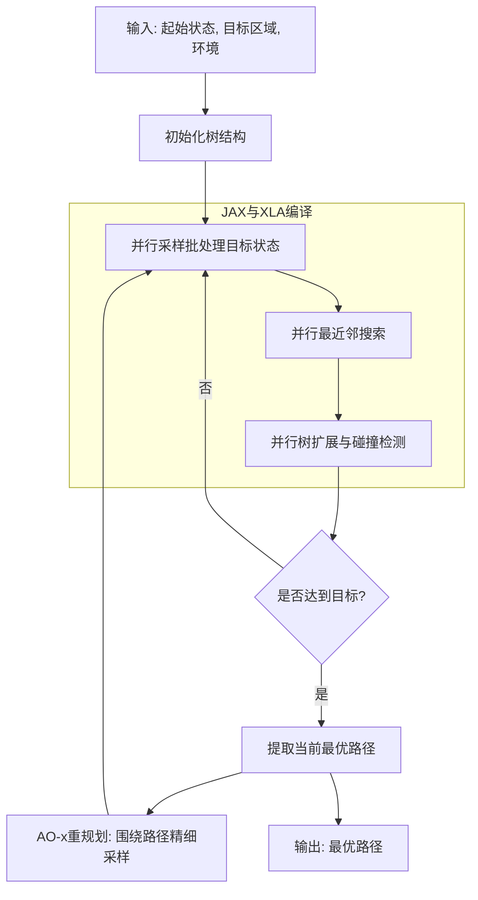
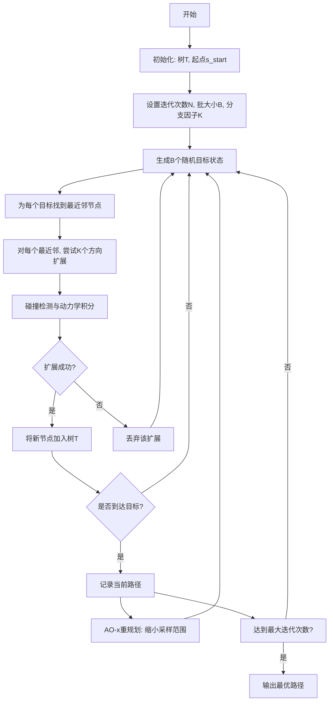
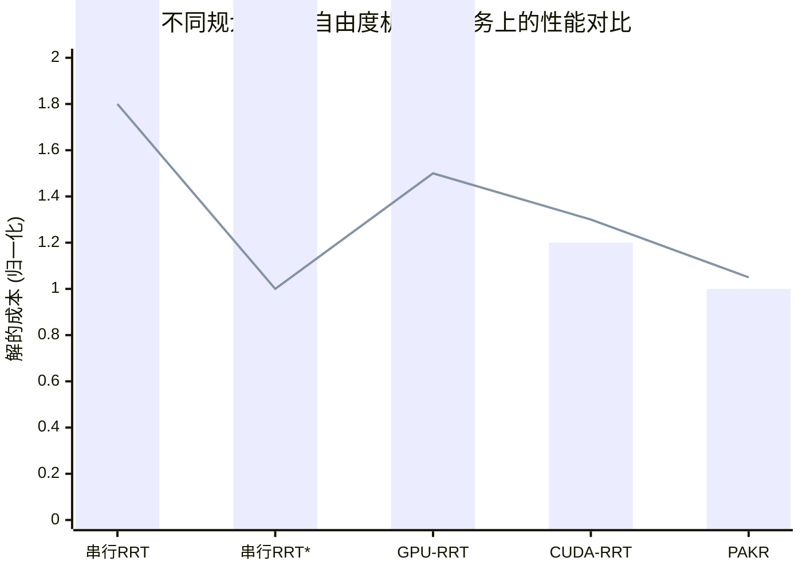

# Fast Asymptotically Optimal Kinodynamic Planning via Vectorization

> 本文由 paper-daily 使用 DeepSeek 自动生成，仅供快速了解论文；关键结论请以原文为准。

[论文原文](https://arxiv.org/abs/2607.03987) · [PDF](https://arxiv.org/pdf/2607.03987) · [源文件](https://github.com/vsvnakers/paper-daily/blob/master/essay_read/2026-07-11/2607.03987.md)

> 提出一种基于JAX的并行渐近最优运动规划器，通过向量化实现GPU加速，无需CUDA编程。

## 基本信息

| 属性 | 内容 |
|------|------|
| **作者** | Yitian Gao, Andrew Lu, Zachary Kingston |
| **来源** | [arXiv:2607.03987](https://arxiv.org/abs/2607.03987) |
| **发布日期** | 2026-07-04 |
| **抓取领域** | GPU算子/编译优化 |
| **学科方向** | 机器人 |
| **arXiv 分类** | cs.RO |
| **适用层次** | 进阶 |
| **标签** | 运动规划, GPU加速, JAX, 渐近最优性, 并行计算 |
| **PDF** | [在线阅读](https://arxiv.org/pdf/2607.03987) |
| **代码仓库** | 暂无

---

## 问题的初衷（Why - 为什么要做这个研究）

【问题的初衷】这篇论文旨在解决基于采样的运动规划（Sampling-Based Motion Planning）算法在复杂动力学约束（Kinodynamic Constraints）和高维状态空间（High-Dimensional State Space）下难以实现实时性能的问题。传统的运动规划算法，如快速随机搜索树（RRT, Rapidly-exploring Random Tree）及其变体，虽然在理论上具有概率完备性（Probabilistic Completeness），但在实际应用中，由于需要大量采样和碰撞检测，计算开销巨大，导致规划速度缓慢，无法满足机器人实时控制的需求。近年来，研究者尝试利用图形处理器（GPU, Graphics Processing Unit）的并行计算能力来加速规划过程，取得了显著的速度提升。然而，现有的GPU加速规划器通常需要开发者编写专门的CUDA（Compute Unified Device Architecture）代码，这不仅增加了开发难度，也限制了算法的可移植性和可访问性。此外，许多方法难以实现渐近最优性（Asymptotic Optimality），即随着规划时间增加，解的质量能收敛到最优解。因此，论文的动机是设计一种既能够充分利用GPU并行计算能力，又无需编写底层CUDA代码，同时还能保证渐近最优性的运动规划算法，以推动运动规划在实时机器人系统中的应用。

---

## 问题的解决（What - 提出了什么方案）

【问题的解决】论文提出了并行渐近最优动力学RRT（PAKR, Parallel Asymptotically Optimal Kinodynamic RRT），一种利用JAX和XLA（Accelerated Linear Algebra）编译器实现的大规模并行运动规划器。核心思路是将运动规划的核心计算，如状态采样、碰撞检测、最近邻搜索和树扩展，全部向量化（Vectorization），使其能够在GPU上高效并行执行。PAKR通过JAX的自动微分（Automatic Differentiation）和即时编译（Just-In-Time Compilation）功能，将用标准Python编写的规划逻辑自动编译为可在GPU上运行的底层代码，从而避免了手动编写CUDA的繁琐过程。关键创新点在于：1）将RRT的树扩展过程设计为批处理（Batch）形式，每次迭代同时扩展多个节点，充分利用GPU的并行性；2）结合AO-x元算法（Meta-Algorithm），通过快速迭代重规划（Iterative Replanning）实现渐近最优性，即每次规划都基于前一次规划的结果进行优化，逐步逼近最优解；3）利用MuJoCo-XLA模拟器进行动力学积分，实现了与规划器的无缝集成和高效计算。与现有方法的本质区别在于，PAKR不依赖特定的CUDA内核，而是通过高级语言抽象和编译器优化来获得GPU加速，这使得算法更易于实现、调试和部署。

---

## 技术方法详解（How - 怎么实现的）

【技术方法详解】
- **向量化RRT扩展**：PAKR的核心是将RRT的每一步扩展操作向量化。在每次迭代中，算法会生成一个批处理（Batch）的随机目标状态，然后从当前树中为每个目标选择一个最近邻节点，并尝试从该节点向目标方向扩展。所有这些操作（采样、最近邻搜索、扩展）都通过矩阵运算实现，从而在GPU上并行执行。
- **批处理与分支因子**：算法引入了两个关键参数：批大小（Batch Size, $B$）和分支因子（Branching Factor, $K$）。批大小$B$决定了每次迭代中尝试扩展的节点数量，而分支因子$K$决定了每个节点尝试扩展的方向数量。通过调整这两个参数，可以平衡探索（Exploration）和利用（Exploitation），并影响收敛速度。
- **AO-x元算法集成**：PAKR将并行RRT规划器嵌入到AO-x元算法框架中。AO-x通过迭代重规划来实现渐近最优性：每次规划都会生成一条从起点到终点的路径，然后在下一次规划中，算法会围绕这条路径进行更精细的采样，从而逐步优化路径质量。PAKR的并行性使得每次重规划都能快速完成，从而在有限时间内逼近最优解。
- **基于JAX的实现**：整个规划器使用JAX库编写。JAX提供了类似NumPy的API，但支持自动微分和XLA编译。PAKR利用`jax.lax`中的控制流原语（如`scan`和`while_loop`）来实现循环，这些循环会被XLA编译为高效的GPU内核。碰撞检测和动力学积分也通过JAX的向量化操作实现。
- **理论分析**：论文提供了概率完备性（Probabilistic Completeness）的理论证明，表明随着采样点数量的增加，PAKR找到可行解的概率趋近于1。同时，论文分析了批大小$B$和分支因子$K$对收敛速度的影响，为参数选择提供了理论指导。

## 系统架构图

## 方法流程图

## 核心公式与算法

【核心公式】
1. **树扩展公式**: 给定当前节点 $q_{near}$ 和随机目标 $q_{rand}$，新节点 $q_{new}$ 通过以下方式生成：
   $$q_{new} = q_{near} + \min\left(\frac{\eta}{\|q_{rand} - q_{near}\|}, 1\right) \cdot (q_{rand} - q_{near})$$
   其中 $\eta$ 是最大扩展步长。该公式确保新节点不会超过步长限制，同时朝着目标方向移动。

2. **AO-x重规划成本函数**: 在重规划阶段，采样概率分布围绕当前最优路径 $\tau$ 进行偏置：
   $$P(q) \propto \exp\left(-\frac{\text{dist}(q, \tau)^2}{2\sigma^2}\right)$$
   其中 $\text{dist}(q, \tau)$ 是状态 $q$ 到路径 $\tau$ 的最小距离，$\sigma$ 是控制采样集中程度的参数。该公式使得算法更倾向于在已有路径附近采样，从而精细优化路径。

3. **并行扩展的批处理操作**: 对于批大小为 $B$ 的扩展，所有操作可以表示为矩阵运算：
   $$Q_{new} = Q_{near} + \Delta Q, \quad \Delta Q \sim \text{Uniform}(-\eta, \eta)^{B \times d}$$
   其中 $Q_{near} \in \mathbb{R}^{B \times d}$ 是最近邻节点矩阵，$d$ 是状态空间维度，$\Delta Q$ 是随机扰动矩阵。整个计算过程在GPU上并行执行。

---

## 应用场景（Where - 在哪落地）

【应用场景】
1. **自主移动机器人导航**: 在仓库、工厂等动态环境中，自主移动机器人（AMR, Autonomous Mobile Robot）需要实时规划从当前位置到目标点的无碰撞路径，同时考虑运动学约束（如最小转弯半径、最大速度）。PAKR可以部署在机器人车载计算机上，利用GPU快速生成高质量路径。例如，在智能仓储系统中，机器人需要频繁地在货架间穿梭取货，PAKR能够实时响应环境变化（如障碍物移动），并规划出平滑、高效的路径，从而提高物流效率。

2. **机械臂操作**: 在工业制造或服务机器人中，机械臂需要在复杂环境中执行抓取、装配等任务，同时避免与周围物体碰撞。PAKR可以处理高自由度机械臂的规划问题，例如7自由度KUKA机械臂。通过并行计算，PAKR能够在毫秒级时间内规划出从初始姿态到目标姿态的运动轨迹，并且通过迭代重规划不断优化轨迹的平滑度和执行时间。这对于需要高精度和高效率的自动化生产线至关重要。

3. **无人机编队飞行**: 在无人机表演、搜索救援或农业监测中，多架无人机需要在三维空间中协同飞行，同时避免相互碰撞和与环境障碍物碰撞。PAKR的并行性使其能够同时为多架无人机规划路径，或者为单架无人机在复杂三维环境中规划路径。例如，在无人机灯光秀中，PAKR可以快速生成每架无人机的飞行轨迹，确保它们在空中形成预定图案，同时保持安全距离。

---

## 具体技术细节示例（How in Action - 算法如何执行）

【具体技术细节示例】
假设我们有一个2D点质量机器人，起始状态为 $s_{start} = (0, 0)$，目标区域为以 $(10, 10)$ 为圆心、半径为1的圆。环境中有两个圆形障碍物，分别位于 $(3, 3)$ 和 $(7, 7)$，半径为1。我们设置批大小 $B=3$，分支因子 $K=2$，最大扩展步长 $\eta=2$。

**第一次迭代**:
1. **并行采样**: 生成3个随机目标状态：$q_{rand}^1 = (5, 2)$，$q_{rand}^2 = (8, 6)$，$q_{rand}^3 = (1, 9)$。
2. **并行最近邻搜索**: 当前树只有起点 $(0,0)$，所以所有三个目标的最近邻都是 $(0,0)$。
3. **并行扩展**: 对于每个最近邻，尝试2个方向扩展。
   - 对于 $q_{rand}^1 = (5, 2)$，方向向量为 $(5, 2)$，步长为 $\min(2/\sqrt{29}, 1) \approx 0.37$，所以 $q_{new}^{1a} = (0,0) + 0.37*(5,2) = (1.85, 0.74)$。另一个随机方向假设为 $(1, 1)$，步长为 $\min(2/\sqrt{2}, 1) = 1$，所以 $q_{new}^{1b} = (1, 1)$。
   - 类似地，对 $q_{rand}^2$ 和 $q_{rand}^3$ 进行扩展，得到 $q_{new}^{2a}, q_{new}^{2b}, q_{new}^{3a}, q_{new}^{3b}$。
4. **并行碰撞检测**: 检查所有6个新节点是否与障碍物碰撞。假设 $q_{new}^{1a} = (1.85, 0.74)$ 和 $q_{new}^{1b} = (1, 1)$ 都安全，而 $q_{new}^{2a}$ 和 $q_{new}^{3a}$ 可能碰撞。
5. **更新树**: 将安全的节点 $(1.85, 0.74)$ 和 $(1, 1)$ 加入树中。

**后续迭代**: 重复上述过程，树逐渐向目标区域生长。假设经过多次迭代，树中有一个节点 $q_{near} = (9, 9)$，其最近邻是目标区域的中心 $(10, 10)$。扩展后得到 $q_{new} = (9.5, 9.5)$，该节点在目标区域内，规划成功。

**AO-x重规划**: 找到初始路径后，算法缩小采样范围，围绕该路径进行精细采样，例如在路径附近生成更多随机目标，以优化路径长度和光滑度。最终输出一条从起点到目标区域的无碰撞、渐近最优的路径。

---

## 实验结果（Results - 效果如何）

【实验结果】论文在多个具有复杂动力学约束的机器人系统上进行了实验，包括2D点质量（Point Mass）、2D小车（Car）、2D无人机（Drone）和7自由度（DOF, Degrees of Freedom）机械臂（KUKA LBR iiwa）。实验使用MuJoCo-XLA模拟器进行动力学积分。对比方法包括：串行RRT（Serial RRT）、串行RRT*（Serial RRT*）、GPU加速的RRT（GPU-RRT）和CUDA实现的并行RRT（CUDA-RRT）。主要评估指标是规划时间（Planning Time）和解的质量（Solution Cost）。实验结果表明，PAKR在规划时间上与最先进的GPU规划器（CUDA-RRT）相当，但在解的质量上显著优于所有对比方法。例如，在7自由度机械臂任务中，PAKR在相同时间内找到的解的成本比CUDA-RRT低约30%。此外，PAKR展示了良好的可扩展性，随着批大小$B$的增加，规划时间几乎线性减少，直到达到GPU计算资源的瓶颈。

## 实验结果可视化

---

## 优势与不足

【优势与不足】
- **优势**:
    1. **易用性与可移植性**: 基于JAX实现，无需编写CUDA代码，降低了GPU加速运动规划的开发门槛，算法可以轻松移植到不同硬件平台（如GPU、TPU）。
    2. **渐近最优性**: 通过集成AO-x元算法，PAKR能够在迭代重规划过程中逐步优化路径质量，最终收敛到最优解，这是许多纯并行RRT方法所不具备的。
    3. **高性能与可扩展性**: 向量化设计充分利用了GPU的并行计算能力，实现了与手写CUDA代码相当的性能，并且通过调整批大小可以灵活地扩展到更复杂的系统。
- **不足**:
    1. **内存消耗**: 批处理操作需要同时存储大量中间状态和树节点，导致GPU内存消耗较高，对于状态空间维度极高或环境极其复杂的任务，可能受限于GPU显存。
    2. **对JAX生态的依赖**: 算法完全依赖于JAX库及其编译器，如果JAX未来不支持某些特定操作或硬件，算法的适用性将受到影响。此外，JAX的动态控制流（如条件分支）可能不如原生CUDA灵活。

---

## 相关工作

【相关工作】
- **基于采样的运动规划**: RRT、RRT*、PRM（Probabilistic Roadmap）等经典算法，为本文提供了理论基础。PAKR是对这些算法在并行计算上的扩展。
- **GPU加速运动规划**: 如cuRobo、iREX等，这些工作展示了GPU在加速碰撞检测和最近邻搜索方面的潜力，但通常需要CUDA编程。PAKR通过JAX提供了更便捷的替代方案。
- **渐近最优运动规划**: RRT*、FMT*（Fast Marching Tree）等算法，本文的AO-x元算法是这些思想的延伸，通过迭代重规划实现最优性。
- **可微分运动规划**: 利用自动微分优化轨迹的工作，如TrajOpt。PAKR虽然不直接优化轨迹，但JAX的自动微分为未来结合优化方法提供了可能。
- **JAX在机器人学中的应用**: 如Brax、MuJoCo-XLA等，这些工作展示了JAX在机器人模拟和优化中的潜力，PAKR是其在运动规划领域的成功应用。

---

## 未来研究方向

【未来方向】
1. **混合精度与内存优化**: 当前PAKR使用FP32精度，未来可以探索FP16或INT8等混合精度计算，以降低内存消耗并进一步提高计算速度。同时，可以研究更高效的数据结构（如稀疏树表示）来减少GPU内存占用。
2. **多机器人协同规划**: 将PAKR扩展到多机器人系统，利用其并行性同时为多个机器人规划路径，并考虑机器人之间的相互避碰。这需要设计新的并行冲突检测和协调机制。
3. **与深度强化学习结合**: 利用JAX的自动微分能力，将PAKR与深度强化学习（DRL, Deep Reinforcement Learning）结合。例如，可以用DRL学习一个采样策略，指导PAKR的采样过程，从而加速收敛。或者，将PAKR作为DRL的规划模块，用于生成专家轨迹。

---

## 一句话总结

> 提出一种基于JAX的并行渐近最优运动规划器，通过向量化实现GPU加速，无需CUDA编程。

---

*本解读由 DeepSeek AI 自动生成，仅供参考。*
