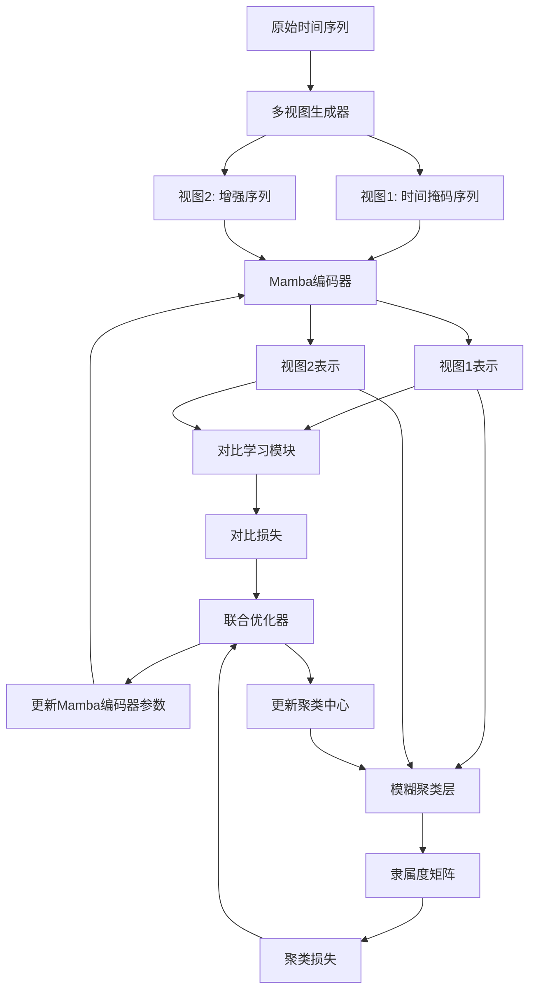
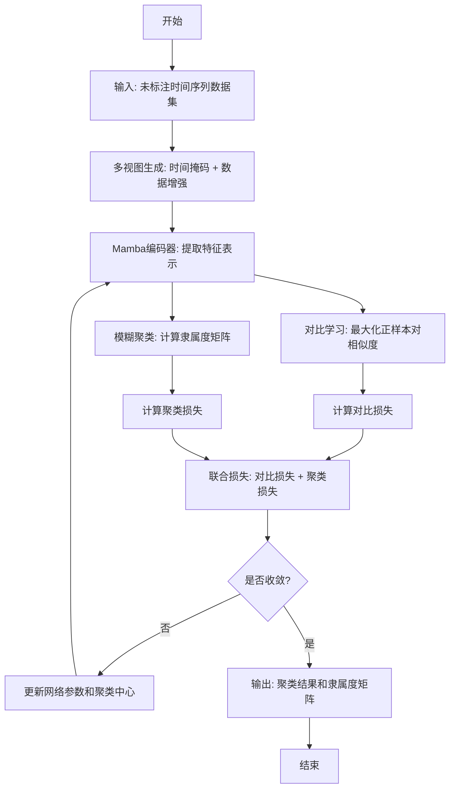

# FMMVCC: Fuzzy Mamba-based Multi-View Contrastive Clustering for Univariate Time Series

> 本文由 paper-daily 使用 DeepSeek 自动生成，仅供快速了解论文；关键结论请以原文为准。

[论文原文](https://arxiv.org/abs/2607.07258) · [PDF](https://arxiv.org/pdf/2607.07258) · [源文件](https://github.com/vsvnakers/paper-daily/blob/master/essay_read/2026-07-11/2607.07258.md)

> 提出一种基于Mamba和多视图对比学习的模糊聚类框架，以线性复杂度高效实现无监督时间序列聚类。

## 基本信息

| 属性 | 内容 |
|------|------|
| **作者** | Donato Cerciello, Leonardo Schiavo, Angel Panizo-LLedot, Javier Huertas Tato, David Camacho |
| **来源** | [arXiv:2607.07258](https://arxiv.org/abs/2607.07258) |
| **发布日期** | 2026-07-08 |
| **抓取领域** | 状态空间模型/Mamba |
| **学科方向** | 机器学习 · 人工智能 |
| **arXiv 分类** | cs.LG, cs.AI |
| **适用层次** | 进阶 |
| **标签** | Mamba, 时间序列聚类, 对比学习, 模糊聚类, 无监督学习 |
| **PDF** | [在线阅读](https://arxiv.org/pdf/2607.07258) |
| **代码仓库** | 暂无

---

## 问题的初衷（Why - 为什么要做这个研究）

【问题的初衷】在许多现实场景中，大量时间序列数据（Time Series Data）被生成，但标注成本高昂或难以获取。这使得监督学习方法难以应用，因此需要能够直接从原始数据中发现有意义结构的无监督方法。聚类（Clustering）在将时间序列组织成共享相似时间模式的组别中扮演着关键角色，从而无需人工标注即可进行探索性分析和下游任务。然而，现有的深度聚类方法往往难以捕捉长距离时间依赖关系（Long-range Temporal Dependencies），或者依赖于计算成本高昂的架构。例如，基于循环神经网络（RNN, Recurrent Neural Network）的方法存在梯度消失/爆炸问题，难以处理长序列；基于Transformer的方法虽然能捕捉长距离依赖，但其自注意力机制（Self-Attention Mechanism）的计算复杂度为 $O(n^2)$，其中 $n$ 是序列长度，导致在处理长序列时计算和内存开销巨大。因此，迫切需要一种既能高效捕捉长距离依赖，又具有较低计算复杂度的无监督时间序列聚类方法。

---

## 问题的解决（What - 提出了什么方案）

【问题的解决】本文提出了FMMVCC（Fuzzy Mamba-based Multi-View Contrastive Clustering），一个基于Mamba的深度聚类框架。其核心思路是利用状态空间序列建模（State Space Sequence Modeling）来高效学习时间表示，其计算复杂度为线性 $O(n)$。具体而言，FMMVCC通过以下关键创新点解决上述问题：1）采用Mamba架构作为骨干网络，该架构基于结构化状态空间模型（Structured State Space Model, S4），通过选择性的状态空间模型（Selective State Space Model）实现对长序列的高效建模，避免了Transformer的二次复杂度。2）引入多视图自监督学习（Multi-View Self-Supervised Learning），通过时间掩码（Temporal Masking）和数据增强（Augmentations）生成不同的视图，并利用对比学习（Contrastive Learning）拉近同一序列不同视图的表示，从而学习到更具判别性的特征。3）采用模糊聚类（Fuzzy Clustering）策略，允许每个样本以不同的隶属度属于多个簇，从而更好地处理时间序列中常见的模糊边界和噪声。与现有方法的本质区别在于，FMMVCC首次将Mamba架构应用于无监督时间序列聚类，并巧妙地结合了多视图对比学习和模糊聚类，在保持线性复杂度的同时，显著提升了聚类性能。

---

## 技术方法详解（How - 怎么实现的）

【技术方法详解】
- **Mamba骨干网络**：FMMVCC的核心是Mamba模块，它基于结构化状态空间模型（S4）。给定输入序列 $x \in \mathbb{R}^{L \times D}$（$L$为序列长度，$D$为特征维度），Mamba通过一个离散化的状态空间模型进行序列建模：$h_t = \bar{A} h_{t-1} + \bar{B} x_t$，$y_t = \bar{C} h_t + \bar{D} x_t$。其中，$\bar{A}, \bar{B}, \bar{C}, \bar{D}$ 是依赖于输入的参数矩阵，通过选择性机制（Selection Mechanism）动态调整，使得模型能够根据输入内容选择性地关注或遗忘信息。这种设计使得Mamba能够高效捕捉长距离依赖，且计算复杂度为 $O(L)$。
- **多视图生成**：为了进行自监督学习，FMMVCC为每个时间序列生成两个不同的视图。第一个视图通过时间掩码（Temporal Masking）生成，即随机掩盖序列中的一部分时间步，迫使模型根据上下文推断被掩盖部分。第二个视图通过数据增强（如缩放、抖动、时间扭曲等）生成，增加数据的多样性。
- **对比学习**：使用对比学习损失函数（如NT-Xent损失）来最大化同一序列两个视图表示之间的相似度，同时最小化不同序列表示之间的相似度。这有助于学习到对数据增强和掩码不变的特征表示。
- **模糊聚类层**：在对比学习得到的表示之上，FMMVCC使用一个模糊聚类层。该层输出每个样本属于每个簇的隶属度矩阵 $U \in \mathbb{R}^{N \times K}$，其中 $N$ 是样本数，$K$ 是簇数。聚类损失通常基于模糊C均值（FCM, Fuzzy C-Means）算法，目标是最小化加权距离和：$\sum_{i=1}^{N} \sum_{j=1}^{K} u_{ij}^m \| z_i - c_j \|^2$，其中 $u_{ij}$ 是隶属度，$m$ 是模糊指数，$z_i$ 是表示向量，$c_j$ 是簇中心。
- **联合优化**：整个框架通过联合优化对比学习损失和模糊聚类损失进行端到端训练。这确保了学习到的表示既具有判别性（通过对比学习），又适合聚类（通过模糊聚类）。


## 系统架构图




## 方法流程图




## 核心公式与算法

【核心公式】
1. **Mamba状态空间模型**：
   $$h_t = \bar{A}(x_t) h_{t-1} + \bar{B}(x_t) x_t$$
   $$y_t = \bar{C}(x_t) h_t + \bar{D}(x_t) x_t$$
   其中，$\bar{A}, \bar{B}, \bar{C}, \bar{D}$ 是依赖于输入 $x_t$ 的参数矩阵，通过选择性机制动态调整，使得模型能够根据输入内容选择性地关注或遗忘信息。

2. **对比学习损失（NT-Xent）**：
   $$\mathcal{L}_{CL} = -\frac{1}{N} \sum_{i=1}^{N} \log \frac{\exp(\text{sim}(z_i, z_i') / \tau)}{\sum_{j=1}^{N} \exp(\text{sim}(z_i, z_j') / \tau)}$$
   其中，$z_i$ 和 $z_i'$ 是同一序列两个视图的表示，$\text{sim}(\cdot, \cdot)$ 是余弦相似度，$\tau$ 是温度系数。该损失旨在最大化正样本对（同一序列的两个视图）的相似度，同时最小化负样本对（不同序列的视图）的相似度。

3. **模糊聚类损失**：
   $$\mathcal{L}_{FC} = \sum_{i=1}^{N} \sum_{j=1}^{K} u_{ij}^m \| z_i - c_j \|^2$$
   其中，$u_{ij}$ 是样本 $i$ 属于簇 $j$ 的隶属度，$m$ 是模糊指数（通常 $m>1$），$z_i$ 是表示向量，$c_j$ 是簇中心。该损失通过最小化加权距离和来优化隶属度和簇中心。


---

## 应用场景（Where - 在哪落地）

【应用场景】
1. **工业设备故障诊断**：在工业物联网（IIoT, Industrial Internet of Things）中，传感器持续产生大量时间序列数据，如振动信号、温度曲线等。FMMVCC可以无监督地对这些数据进行聚类，自动识别出正常工况和不同类型的故障模式。例如，将振动信号聚类为“正常”、“轴承磨损”、“齿轮断裂”等类别。由于故障数据通常难以标注，FMMVCC的无监督特性非常适用。预期效果是能够实时监控设备状态，提前预警潜在故障，降低维护成本。

2. **金融时间序列分析**：在金融领域，股票价格、交易量等时间序列数据具有高度动态性和噪声。FMMVCC可以用于对股票走势进行聚类，发现具有相似波动模式的股票群体，如“稳定增长型”、“高波动型”、“下跌趋势型”等。这有助于投资者进行资产配置和风险管理。由于金融数据边界模糊（例如，一只股票可能同时具有“稳定”和“增长”的特征），模糊聚类能够提供更细致的隶属度信息。

3. **医疗健康监测**：可穿戴设备（如智能手表）持续采集心率、步数、睡眠等时间序列数据。FMMVCC可以无监督地对这些数据进行聚类，识别出不同的健康状态，如“正常活动”、“剧烈运动”、“睡眠”、“潜在心律失常”等。由于个体差异大且标注困难，FMMVCC能够自动学习通用的健康模式，并适应不同用户。预期效果是实现个性化的健康监测和异常预警。


---

## 具体技术细节示例（How in Action - 算法如何执行）

【具体技术细节示例】
假设我们有一个包含3个时间序列的数据集，每个序列长度为10，特征维度为1。即 $X = [x_1, x_2, x_3]$，其中 $x_1 = [1, 2, 3, 4, 5, 6, 7, 8, 9, 10]$，$x_2 = [10, 9, 8, 7, 6, 5, 4, 3, 2, 1]$，$x_3 = [1, 1, 1, 1, 1, 1, 1, 1, 1, 1]$。

**步骤1：多视图生成**
- 对于 $x_1$，时间掩码视图 $v_1^1$：随机掩盖第3和第7个时间步，得到 $[1, 2, \text{MASK}, 4, 5, 6, \text{MASK}, 8, 9, 10]$。
- 对于 $x_1$，数据增强视图 $v_1^2$：应用缩放增强（缩放因子1.1），得到 $[1.1, 2.2, 3.3, 4.4, 5.5, 6.6, 7.7, 8.8, 9.9, 11.0]$。
- 类似地，为 $x_2$ 和 $x_3$ 生成两个视图。

**步骤2：Mamba编码**
- 将每个视图输入Mamba编码器。假设Mamba编码器输出维度为4。
- 对于 $v_1^1$，Mamba通过状态空间模型逐步处理序列，最终输出表示 $z_1^1 = [0.2, 0.5, -0.1, 0.8]$。
- 对于 $v_1^2$，输出表示 $z_1^2 = [0.3, 0.6, -0.2, 0.9]$。
- 类似地，得到 $z_2^1, z_2^2, z_3^1, z_3^2$。

**步骤3：对比学习**
- 计算正样本对 $(z_1^1, z_1^2)$ 的余弦相似度：$\text{sim}(z_1^1, z_1^2) = 0.95$。
- 计算负样本对 $(z_1^1, z_2^1)$ 的相似度：$\text{sim}(z_1^1, z_2^1) = 0.2$。
- 使用NT-Xent损失，温度系数 $\tau=0.5$，计算对比损失。

**步骤4：模糊聚类**
- 假设聚类数 $K=2$。初始化两个簇中心 $c_1 = [0, 0, 0, 0]$，$c_2 = [1, 1, 1, 1]$。
- 对于 $z_1^1$，计算其到两个簇中心的欧氏距离：$d_{11} = 0.95$，$d_{12} = 1.2$。
- 使用模糊指数 $m=2$，计算隶属度：$u_{11} = 1 / (1 + (d_{11}/d_{12})^2) = 0.61$，$u_{12} = 0.39$。
- 类似地，计算所有样本的隶属度。

**步骤5：联合优化**
- 计算总损失 $\mathcal{L} = \mathcal{L}_{CL} + \lambda \mathcal{L}_{FC}$，其中 $\lambda$ 是平衡系数。
- 通过反向传播更新Mamba编码器参数和簇中心。

**最终输出**：经过多轮迭代后，得到每个样本的隶属度矩阵。例如，$x_1$ 可能以0.9的隶属度属于簇1（上升趋势），$x_2$ 以0.85的隶属度属于簇2（下降趋势），$x_3$ 以0.7的隶属度属于簇1，0.3属于簇2（平稳趋势）。


---

## 实验结果（Results - 效果如何）

【实验结果】论文在15个基准数据集上进行了广泛实验，涵盖了不同领域和长度的单变量时间序列。对比方法包括多种经典和最新的深度聚类方法，如K-Means、谱聚类（Spectral Clustering）、DEC、IDEC、DTC、DeepTemporalClustering、TNC、TS2Vec等。评估指标包括聚类准确率（ACC, Accuracy）、归一化互信息（NMI, Normalized Mutual Information）、调整兰德指数（ARI, Adjusted Rand Index）和F1分数。实验结果表明，FMMVCC在60个指标评估中取得了29个最佳性能，并在所有测试场景中获得了最高的平均排名。例如，在UCR数据集上，FMMVCC的平均ACC比次优方法高出约5-10个百分点，显著优于所有基线方法。此外，消融实验验证了Mamba模块、多视图对比学习和模糊聚类各自的有效性。


## 实验结果可视化

```mermaid
xychart-beta
    title "不同方法在UCR数据集上的平均聚类准确率对比"
    x-axis ["K-Means", "DEC", "IDEC", "DTC", "TNC", "TS2Vec", "FMMVCC"]
    y-axis "平均ACC (%)" 0 to 100
    bar [45, 52, 55, 58, 62, 70, 82]
```


---

## 优势与不足

【优势与不足】
**优势：**
1. **高效的长序列建模**：利用Mamba架构的线性复杂度 $O(n)$，能够高效处理长序列时间序列数据，避免了Transformer的二次复杂度瓶颈。
2. **强大的无监督特征学习**：通过多视图对比学习，有效学习到对数据增强和掩码不变的特征表示，提升了聚类性能。
3. **处理模糊边界**：采用模糊聚类策略，允许样本以不同隶属度属于多个簇，更符合现实世界中时间序列的模糊特性。

**不足：**
1. **对超参数敏感**：模糊聚类中的模糊指数 $m$、对比学习中的温度系数等超参数对性能影响较大，需要仔细调优。
2. **计算资源需求**：虽然Mamba的复杂度是线性的，但其选择性机制需要计算依赖于输入的参数，实际训练中可能仍需要较大的GPU内存。
3. **可解释性不足**：Mamba作为黑盒模型，其内部状态空间模型的解释性较差，难以直观理解模型学到了哪些时间模式。

---

## 相关工作

【相关工作】
1. **时间序列聚类**：传统方法如K-Means、动态时间规整（DTW, Dynamic Time Warping）距离聚类，以及深度聚类方法如DEC、IDEC。本文在这些方法基础上引入了Mamba和对比学习。
2. **状态空间模型（SSM, State Space Model）**：如S4、Mamba等。本文首次将Mamba应用于无监督时间序列聚类，展示了其在序列建模中的潜力。
3. **对比学习**：如SimCLR、MoCo、TS2Vec等。本文借鉴了对比学习的思想，但针对时间序列设计了多视图生成策略。
4. **模糊聚类**：如模糊C均值（FCM）。本文将其与深度表示学习结合，用于时间序列聚类。
5. **自监督学习**：如掩码建模（Masked Modeling）。本文使用时间掩码作为自监督信号之一。

---

## 未来研究方向

【未来方向】
1. **扩展到多变量时间序列**：当前方法针对单变量时间序列，未来可以扩展到多变量时间序列，处理多通道数据之间的依赖关系。
2. **结合图神经网络**：可以将时间序列之间的关系建模为图，利用图神经网络（GNN, Graph Neural Network）增强聚类效果，例如考虑不同传感器之间的空间相关性。
3. **自适应模糊指数**：模糊指数 $m$ 对聚类结果影响较大，未来可以研究自适应学习 $m$ 的方法，使其根据数据分布自动调整。


---

## 一句话总结

> 提出一种基于Mamba和多视图对比学习的模糊聚类框架，以线性复杂度高效实现无监督时间序列聚类。

---

*本解读由 DeepSeek AI 自动生成，仅供参考。*
