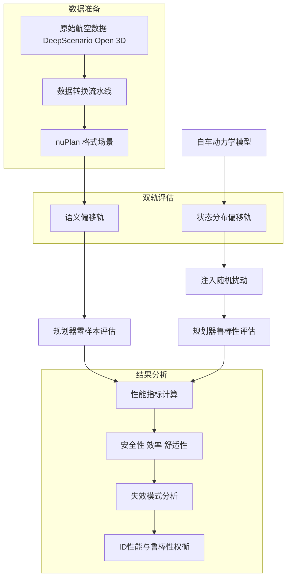
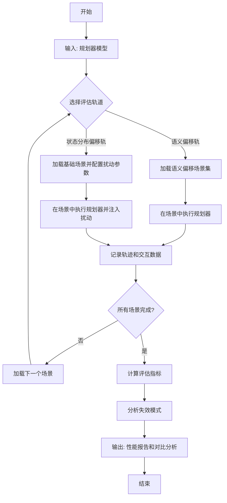

# Shift & Drift: A Zero-Shot Benchmark for Generalizable and Robust Autonomous Driving Motion Planning

> 本文由 paper-daily 使用 DeepSeek 自动生成，仅供快速了解论文；关键结论请以原文为准。

[论文原文](https://arxiv.org/abs/2607.07844) · [PDF](https://arxiv.org/pdf/2607.07844) · [源文件](https://github.com/vsvnakers/paper-daily/blob/master/essay_read/2026-07-11/2607.07844.md)

> 提出双轨基准 Shift & Drift，系统评估自动驾驶规划器在语义和状态分布偏移下的泛化与鲁棒性，揭示 ID 性能与闭环鲁棒性的权衡。

## 基本信息

| 属性 | 内容 |
|------|------|
| **作者** | Alessandro Canevaro, Hang Yu, Julian Schmidt, Peizheng Li, Silvan Lindner, Wilhelm Stork, Georg Martius, Julian Jordan |
| **来源** | [arXiv:2607.07844](https://arxiv.org/abs/2607.07844) |
| **发布日期** | 2026-07-08 |
| **抓取领域** | 分布式/并行训练系统 |
| **学科方向** | 机器人 · 人工智能 · 机器学习 |
| **arXiv 分类** | cs.RO, cs.AI, cs.LG |
| **适用层次** | 进阶 |
| **标签** | 自动驾驶, 运动规划, 分布偏移, 鲁棒性, 基准测试 |
| **PDF** | [在线阅读](https://arxiv.org/pdf/2607.07844) |
| **代码仓库** | 暂无

---

## 问题的初衷（Why - 为什么要做这个研究）

【问题的初衷】当前自动驾驶运动规划（Motion Planning）领域，主流方法依赖于在大规模、目标级（object-level）数据集（如 nuPlan）上进行闭环训练，并取得了优异的分布内（In-Distribution, ID）性能。然而，这些规划器在实际部署中面临两大关键挑战：一是对新颖城市拓扑（Novel Urban Topologies）的泛化能力不足，即当遇到训练数据中未见过的新城市、新道路结构或新交通模式时，性能会急剧下降；二是对执行扰动（Execution Perturbations）的恢复机制（Recovery Mechanism）研究匮乏，即当车辆动力学模型存在误差、控制指令执行不精确或遭遇突发物理扰动时，规划器能否鲁棒地恢复稳定状态。现有基准测试（Benchmark）如 nuPlan 主要评估 ID 场景，缺乏对这两种分布偏移（Distribution Shift）的系统性压力测试。因此，论文旨在填补这一空白，提出一个双轨基准测试，以严格评估运动规划器在语义偏移（Semantic Shift）和状态分布偏移（State-Distribution Drift）下的泛化能力和鲁棒性，推动自动驾驶技术向更可靠、更通用的方向发展。

---

## 问题的解决（What - 提出了什么方案）

【问题的解决】论文提出了 Shift & Drift，一个新颖的双轨基准测试框架，用于系统性地压力测试运动规划器。其核心创新在于：1）语义偏移轨（Semantic Shift Track）：通过一个新颖的转换流水线（Conversion Pipeline），将航空视角的 DeepScenario Open 3D 数据集转换为 nuPlan 仿真框架可用的格式。这实现了对在北美和新加坡数据上训练的规划器进行零样本（Zero-Shot）评估，测试场景涵盖德国四个城市和美国旧金山，包含密集的行人-自行车交互。2）状态分布偏移轨（State-Distribution Drift Track）：通过向自车（Ego Vehicle）动力学注入随机扰动（Stochastic Perturbations），如执行噪声（Actuation Noise），来量化规划器对累积执行误差的鲁棒性。该基准测试系统性地评估了不同规划范式（如模仿学习（Imitation Learning, IL）和强化学习（Reinforcement Learning, RL））在两种偏移下的失效模式。与现有方法仅关注 ID 性能不同，Shift & Drift 揭示了 ID 性能与闭环鲁棒性之间的权衡，为社区提供了一个更全面的评估平台。

---

## 技术方法详解（How - 怎么实现的）

【技术方法详解】
- **双轨基准框架设计**：框架包含两个独立但互补的评估轨道。语义偏移轨专注于场景内容（如城市、道路拓扑、交通参与者类型）的分布变化；状态分布偏移轨专注于自车动力学状态的分布变化。
- **语义偏移轨的数据转换流水线**：核心是将 DeepScenario Open 3D 数据集（航空点云和图像）转换为 nuPlan 格式。流程包括：1）从航空数据中提取道路网络（Road Network）和静态元素；2）使用基于规则的算法生成交通参与者（如车辆、行人、自行车）的初始状态和轨迹；3）将这些信息封装成 nuPlan 的仿真场景（Scenario）格式。该流水线确保了场景的多样性和真实性。
- **状态分布偏移轨的扰动注入机制**：在仿真过程中，向自车的控制指令（如油门、刹车、转向）注入随机噪声。噪声模型可以是高斯噪声（Gaussian Noise）或时间相关噪声（Temporally Correlated Noise），以模拟不同类型的执行误差。例如，注入 $\epsilon_t \sim \mathcal{N}(0, \sigma^2)$ 的独立噪声，或 $\epsilon_t = \rho \epsilon_{t-1} + \sqrt{1-\rho^2} \eta_t$ 的 AR(1) 过程噪声，其中 $\rho$ 控制时间相关性。
- **评估指标**：采用多种指标全面评估性能，包括：1）安全性指标：碰撞率（Collision Rate）、侵入性（Drivable Area Compliance）；2）效率指标：平均速度（Average Speed）、任务完成率（Goal Achievement Rate）；3）舒适性指标：加速度变化率（Jerk）。这些指标分别在 ID 场景和偏移场景下计算。
- **规划范式对比**：基准测试评估了多种规划范式，包括：1）基于模仿学习的规划器（如 UrbanDriver），通过行为克隆（Behavioral Cloning）学习专家轨迹；2）基于强化学习的规划器（如 PDM），通过与环境交互学习策略。通过对比，揭示了不同范式对偏移的敏感性。


## 系统架构图




## 方法流程图




## 核心公式与算法

【核心公式】
1. **状态分布偏移的噪声注入模型**：
   $$a_t^{actual} = a_t^{command} + \epsilon_t, \quad \epsilon_t \sim \mathcal{N}(0, \sigma^2)$$
   其中 $a_t^{command}$ 是规划器发出的控制指令，$a_t^{actual}$ 是实际执行的动作，$\epsilon_t$ 是高斯噪声，$\sigma$ 控制噪声强度。该公式模拟了执行误差。

2. **时间相关噪声模型**：
   $$\epsilon_t = \rho \epsilon_{t-1} + \sqrt{1-\rho^2} \eta_t, \quad \eta_t \sim \mathcal{N}(0, \sigma^2)$$
   其中 $\rho$ 是自相关系数，控制噪声的时间相关性。当 $\rho=0$ 时退化为独立噪声；$\rho$ 接近 1 时，噪声呈现持久漂移，对规划器更具挑战性。

3. **评估指标示例：碰撞率**：
   $$\text{Collision Rate} = \frac{1}{N} \sum_{i=1}^{N} \mathbb{I}(\text{ego collides in scenario } i)$$
   其中 $N$ 是总场景数，$\mathbb{I}(\cdot)$ 是指示函数。该指标衡量规划器的安全性。


---

## 应用场景（Where - 在哪落地）

【应用场景】
1. **自动驾驶系统开发与测试**：汽车制造商和自动驾驶公司可以使用 Shift & Drift 基准来测试其规划算法在极端情况下的表现。例如，在开发新车型时，工程师可以将规划器在语义偏移轨上运行，评估其在从未见过的欧洲城市（如慕尼黑）中的表现，从而发现算法对特定道路拓扑或交通文化的敏感性。通过状态分布偏移轨，可以测试车辆在传感器或执行器故障（如转向系统延迟）下的恢复能力。预期效果是显著减少实际道路测试中的意外情况，提高系统的安全性和可靠性。

2. **规划算法研究与对比**：学术界和工业界的研究人员可以使用该基准来公平、系统地比较不同规划范式（如 IL、RL、MPC）的优劣。例如，一个研究团队提出了一种新的鲁棒模仿学习方法，他们可以在 Shift & Drift 上运行，不仅报告 ID 性能，还展示其在语义和状态偏移下的表现。这有助于社区更全面地理解新方法的实际价值，并推动算法向更鲁棒、更通用的方向发展。预期效果是加速鲁棒规划算法的创新和迭代。

3. **自动驾驶仿真平台升级**：仿真平台提供商（如 NVIDIA、CARLA）可以将 Shift & Drift 的评估框架集成到其平台中，作为标准测试套件的一部分。用户可以在统一的框架下进行压力测试，无需自行构建复杂的偏移场景。例如，平台可以自动生成语义偏移场景（通过转换航空数据）或注入状态扰动，并提供标准化的评估报告。预期效果是提升仿真平台的实用性和吸引力，使其成为自动驾驶开发不可或缺的工具。


---

## 具体技术细节示例（How in Action - 算法如何执行）

【具体技术细节示例】
假设我们评估一个基于模仿学习的规划器（IL-Planner）在语义偏移轨上的表现。

**输入**：
- 规划器：IL-Planner，在 nuPlan 的北美和新加坡数据上训练。
- 场景：一个来自语义偏移轨的场景，位于德国柏林，包含一个复杂的十字路口，有密集的行人和自行车。场景数据包括：自车初始位置 $(x_0, y_0, \theta_0) = (100, 200, 0.5)$ 米和弧度，目标位置 $(x_g, y_g) = (150, 250)$，以及 10 个行人（Pedestrian）和 5 辆自行车（Cyclist）的初始状态和轨迹。

**执行步骤**：
1. **场景加载**：仿真器加载该柏林场景，初始化所有交通参与者的状态。
2. **规划循环**：在每个时间步 $t$（步长 0.1 秒）：
   - **感知输入**：IL-Planner 接收自车状态 $s_t$ 和周围障碍物的观测 $o_t$（如行人位置、速度）。
   - **轨迹预测**：IL-Planner 输出一个未来 3 秒的轨迹 $\tau_t = \{(x_{t+1}, y_{t+1}), \dots, (x_{t+30}, y_{t+30})\}$。
   - **控制执行**：仿真器根据轨迹计算控制指令（如加速度 $a_t$ 和转向角 $\delta_t$），并更新自车状态。
3. **关键决策点**：在第 2 秒时，一个行人突然从右侧停放的车辆后冲出，横穿马路。IL-Planner 的轨迹预测需要快速调整以避免碰撞。由于 IL-Planner 在训练数据中很少见到这种“行人鬼探头”场景（语义偏移），其预测的轨迹可能无法及时避让。
4. **结果记录**：仿真器记录整个过程的轨迹和交互数据。

**输出**：
- 碰撞发生：在第 2.3 秒，自车与行人发生碰撞。
- 评估指标：该场景的碰撞率为 1（发生碰撞），平均速度为 8.5 m/s（低于 ID 场景的 12 m/s）。
- 失效模式分析：IL-Planner 在行人密集、非典型交互场景下，由于缺乏相关训练数据，无法生成安全的避让轨迹，导致碰撞。这直观展示了语义偏移对 IL 方法的严重影响。


---

## 实验结果（Results - 效果如何）

【实验结果】论文在 Shift & Drift 基准上评估了多种规划器。实验设置包括：语义偏移轨使用 1182 个场景，涵盖德国四个城市（如柏林、慕尼黑）和美国旧金山；状态分布偏移轨在 nuPlan 的 ID 场景上注入不同强度和类型的噪声。对比方法包括 UrbanDriver（IL）、PDM（RL）等。关键结果：1）在语义偏移下，IL 方法（如 UrbanDriver）在行人密集场景中碰撞率显著上升，从 ID 的约 5% 升至 30% 以上，而 RL 方法（如 PDM）仅从 3% 升至 8%，表现出更优雅的退化（Graceful Degradation）。2）在状态分布偏移下，IL 方法对时间相关噪声（Temporally Correlated Noise）极为敏感，平均速度下降 40%，而 RL 方法仅下降 15%。3）实验揭示了 ID 性能与闭环鲁棒性之间的权衡：IL 方法在 ID 场景中得分高，但泛化差；RL 方法 ID 性能略低，但鲁棒性更强。


## 实验结果可视化

```mermaid
xychart-beta
    title "语义偏移下不同规划器的碰撞率对比"
    x-axis ["ID场景", "语义偏移场景"]
    y-axis "碰撞率 百分比" 0 --> 40
    bar [5, 32]
    bar [3, 8]
    legend "IL规划器" "RL规划器"
```


---

## 优势与不足

【优势与不足】
- **优势**：
    1. **创新性基准设计**：首次提出双轨基准，系统性地分离和评估语义偏移和状态分布偏移，为社区提供了更全面的测试平台。
    2. **数据转换流水线**：通过将航空数据转换为仿真场景，解决了真实世界数据稀缺和多样性不足的问题，实现了零样本评估。
    3. **揭示关键权衡**：实验清晰地揭示了 ID 性能与闭环鲁棒性之间的权衡，为未来规划器设计提供了重要指导。
- **不足**：
    1. **仿真与现实差距**：基准基于仿真环境，其扰动模型和场景生成可能无法完全模拟真实世界的复杂性和不确定性。
    2. **计算成本**：数据转换流水线和大量场景的仿真评估需要较高的计算资源，可能限制其广泛应用。

---

## 相关工作

【相关工作】
- **nuPlan 基准**：本文的基础，提供了大规模自动驾驶规划数据集和仿真环境，但主要关注 ID 性能。
- **分布外泛化研究**：如 Domain Randomization 和 Robust Imitation Learning，本文的语义偏移轨是对该方向的具体应用和扩展。
- **鲁棒控制**：如 Model Predictive Control (MPC) 和 Robust Control，本文的状态分布偏移轨借鉴了其扰动建模思想。
- **模仿学习与强化学习对比**：如 Behavioral Cloning vs. RL，本文通过实验深化了对这两种范式在鲁棒性方面差异的理解。

---

## 未来研究方向

【未来方向】
1. **多模态偏移融合**：当前基准分别测试语义和状态偏移，未来可以研究两者同时发生时的耦合效应，例如在陌生城市中同时遭遇执行器故障。
2. **自适应规划器设计**：基于基准揭示的权衡，可以设计能够动态调整策略的规划器，例如在检测到语义偏移时切换到更保守的 RL 策略，在 ID 场景下使用高效的 IL 策略。
3. **数据增强与域适应**：利用基准的转换流水线生成更多样化的训练数据，或开发域适应（Domain Adaptation）技术，以提升规划器对语义偏移的泛化能力。


---

## 一句话总结

> 提出双轨基准 Shift & Drift，系统评估自动驾驶规划器在语义和状态分布偏移下的泛化与鲁棒性，揭示 ID 性能与闭环鲁棒性的权衡。

---

*本解读由 DeepSeek AI 自动生成，仅供参考。*
