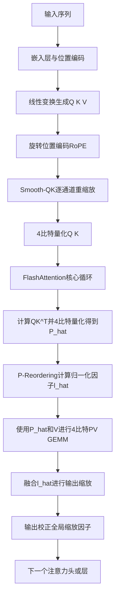
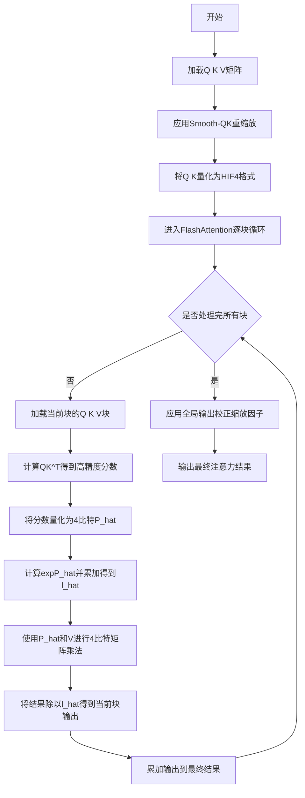

# HiFA4: Training-Free 4-bit FlashAttention on Ascend HIF4 NPUs for LLM Inference

> 本文由 paper-daily 使用 DeepSeek 自动生成，仅供快速了解论文；关键结论请以原文为准。

[论文原文](https://arxiv.org/abs/2607.04302) · [PDF](https://arxiv.org/pdf/2607.04302) · [源文件](https://github.com/vsvnakers/paper-daily/blob/master/essay_read/2026-07-12/2607.04302.md)

> HiFA4通过Smooth-QK和P-Reordering机制，在无需训练和在线重建的前提下，首次在Ascend NPU上实现了高精度的4比特FlashAttention推理。

## 基本信息

| 属性 | 内容 |
|------|------|
| **作者** | Hui Dong, Yanzhao Li, Jie Gao, Chunlu Li, Zhiyuan Zhang, Yupeng Sun, Zhenyuan Chen, Zhiqiang Zou |
| **来源** | [arXiv:2607.04302](https://arxiv.org/abs/2607.04302) |
| **发布日期** | 2026-07-05 |
| **抓取领域** | 自然语言处理 |
| **学科方向** | 机器学习 · 人工智能 · 体系结构 |
| **arXiv 分类** | cs.LG, cs.AI, cs.AR, cs.CL, cs.PF |
| **适用层次** | 前沿 |
| **标签** | 4比特量化, FlashAttention, Ascend NPU, 大语言模型推理, 训练后量化 |
| **PDF** | [在线阅读](https://arxiv.org/pdf/2607.04302) |
| **代码仓库** | 暂无

---

## 问题的初衷（Why - 为什么要做这个研究）

【问题的初衷】随着大语言模型（Large Language Model, LLM）的规模不断增长，其推理过程中的计算和内存开销已成为部署的主要瓶颈。注意力机制（Attention Mechanism）中的矩阵乘法，特别是查询-键点积（QK^T）和注意力权重-值乘积（PV），占据了大量计算资源。为了加速推理，业界广泛采用低精度计算，如FP16或INT8。然而，进一步降低精度至4比特（4-bit），虽然能极大提升吞吐量并减少内存带宽压力，但会引入严重的量化误差，导致模型精度显著下降。现有的4比特量化方法通常需要复杂的训练后量化（Post-Training Quantization, PTQ）流程或在线（online）的逐块（per-tile）高精度重建，这会增加计算延迟，抵消低精度带来的优势。特别是在华为昇腾（Ascend）NPU上，其特有的HIF4（一种4比特浮点格式）计算单元虽然高效，但直接使用HIF4进行FlashAttention中的矩阵乘法会导致严重的精度损失。因此，如何在无需训练、无需在线高精度重建的前提下，在Ascend NPU上实现高效的4比特FlashAttention，同时保持与FP16相当的模型精度，成为一个亟待解决的关键问题。这篇论文正是为了解决这一矛盾，提出了HiFA4方法。

---

## 问题的解决（What - 提出了什么方案）

【问题的解决】HiFA4提出了一种训练后的算子级（operator-level）设计，通过两个核心机制协同工作，解决了在Ascend NPU上使用4比特HIF4格式进行FlashAttention推理时的精度损失问题。第一个机制是Smooth-QK，它在旋转位置编码（RoPE）之后，对查询（Q）和键（K）矩阵应用一个基于校准数据的静态（static）逐通道（per-channel）等价重缩放（equivalent rescaling）。其核心思想是将量化难度从K矩阵转移到Q矩阵。由于在FlashAttention中，K矩阵的量化误差会被在线softmax放大，而Smooth-QK通过预先调整Q和K的数值范围，使得量化后的K矩阵误差更小，同时将量化噪声转移到Q矩阵上，而Q矩阵的误差在后续计算中影响较小。这个过程是静态的，无需在推理时进行逐块的在线调整，因此不增加延迟。第二个机制是P-Reordering，它解决了softmax归一化因子（normalizer）的计算精度问题。在标准的FlashAttention中，softmax归一化因子需要从高精度的注意力权重（P）计算得到。但在4比特场景下，我们只有量化后的注意力权重P_hat。P-Reordering巧妙地利用同一个量化后的P_hat来计算归一化因子，而不是去重建一个高精度的P。论文证明了这种看似不一致的做法实际上引入了一个可预测的输出缩放误差（coherent output-scaling error），并且这个误差可以通过后续的简单缩放进行校正。更重要的是，P-Reordering允许将归一化因子的计算融合（fuse）到PV的Cube GEMM（通用矩阵乘法）中，从而减少了内存访问和计算步骤。这两个机制共同作用，使得HiFA4在无需训练、无需在线高精度重建的情况下，显著缩小了4比特量化与FP16之间的精度差距。

---

## 技术方法详解（How - 怎么实现的）

【技术方法详解】
- **Smooth-QK机制**：在RoPE之后，对Q和K矩阵进行逐通道的静态重缩放。具体来说，通过校准数据集（如MMLU的一个子集）统计出每个通道的缩放因子（scale factor）。对于Q矩阵，其缩放因子为 $s_Q = \max(|Q|) / \tau$，其中 $\tau$ 是一个阈值；对于K矩阵，其缩放因子为 $s_K = \tau / \max(|K|)$。然后，将Q和K分别乘以各自的缩放因子：$Q' = Q \cdot s_Q$，$K' = K \cdot s_K$。这样做的目的是将K的数值范围压缩到一个对量化更友好的区间，而将Q的数值范围适当放大。由于K在后续的softmax计算中会被指数化，其量化误差会被放大，因此优先保证K的精度。
- **P-Reordering机制**：在标准的FlashAttention中，输出 $O = \text{softmax}(QK^T)V$。其中softmax归一化因子 $l = \sum_j \exp(QK^T_j)$。在4比特量化场景下，我们得到的是量化后的注意力权重 $\hat{P} = \text{quant}(QK^T)$。P-Reordering的核心是使用 $\hat{P}$ 来计算归一化因子 $\hat{l} = \sum_j \exp(\hat{P}_j)$，而不是使用高精度的 $QK^T$。然后，输出 $O = \hat{P} \cdot V / \hat{l}$。论文证明，这种操作引入了一个输出缩放误差 $\epsilon$，使得 $O \approx O_{FP16} \cdot (1 + \epsilon)$。这个误差是全局一致的，可以通过一个简单的后处理缩放因子进行校正。
- **误差分析与校正**：论文通过理论分析和实验验证了P-Reordering引入的误差特性。在Qwen3-8B模型上，对所有3.6M个注意力块（tile）的测量显示，中位数误差 $\bar{\epsilon} = -0.064$，表明存在净概率质量损失（net probability-mass loss）。这意味着输出被系统地低估了约6.4%。因此，可以通过一个全局的缩放因子 $1/(1+\bar{\epsilon})$ 来校正输出。
- **融合计算**：P-Reordering的关键优势在于，归一化因子 $\hat{l}$ 的计算可以融合到PV的Cube GEMM中。在计算 $\hat{P} \cdot V$ 的同时，可以累加 $\exp(\hat{P})$ 得到 $\hat{l}$，从而避免了额外的内存读取和计算步骤，显著降低了延迟。
- **Q-Mean辅助**：对于Smooth-QK被禁用的模型（如LLaMA3.1-8B），HiFA4采用Q-Mean辅助策略。在量化Q和K时，使用Q矩阵的均值（mean）作为量化零点（zero-point）的偏移量，以减少量化误差。

## 系统架构图

## 方法流程图

## 核心公式与算法

【核心公式】
1. **Smooth-QK重缩放**：
$$Q' = Q \cdot s_Q, \quad K' = K \cdot s_K$$
其中 $s_Q = \frac{\max(|Q|)}{\tau}$，$s_K = \frac{\tau}{\max(|K|)}$，$\tau$ 是一个可调阈值。该公式将K的数值范围压缩，将Q的数值范围放大，从而在量化时优先保证K的精度。

2. **P-Reordering的输出计算**：
$$O = \frac{\hat{P} \cdot V}{\hat{l}}$$
其中 $\hat{P} = \text{quant}(QK^T)$ 是4比特量化后的注意力权重，$\hat{l} = \sum_j \exp(\hat{P}_j)$ 是从量化后的权重计算得到的归一化因子。该公式与标准softmax不同，它使用量化后的权重来计算归一化因子，从而允许计算融合。

3. **输出缩放误差**：
$$O \approx O_{FP16} \cdot (1 + \epsilon)$$
其中 $\epsilon$ 是P-Reordering引入的全局一致的输出缩放误差。论文通过实验测量了该误差，并提出了一个全局校正因子 $1/(1+\bar{\epsilon})$ 来补偿。

---

## 应用场景（Where - 在哪落地）

【应用场景】
1. **云端LLM推理服务**：在提供LLM推理服务的云平台上，如华为云、阿里云等，部署HiFA4可以显著降低每个请求的计算成本和内存占用。由于HiFA4无需训练且精度损失小，服务提供商可以无缝地将现有FP16模型切换为4比特模型，从而在相同的硬件资源下服务更多用户，或降低单次推理的延迟。例如，一个支持多轮对话的聊天机器人服务，使用HiFA4后，可以在不牺牲回答质量的前提下，将吞吐量提升近4倍，同时降低能耗。

2. **边缘设备上的LLM部署**：在手机、IoT设备等资源受限的边缘设备上运行LLM是当前的热点。HiFA4的4比特量化特性极大地减少了模型的内存占用和计算需求，使得在边缘设备上运行数十亿参数的模型成为可能。例如，一个离线翻译助手应用，可以将一个7B参数的翻译模型量化到4比特，并部署在手机上。用户无需联网即可获得高质量的翻译服务，同时电池续航和响应速度都得到保障。Smooth-QK和P-Reordering机制确保了翻译的准确性不会因为量化而大幅下降。

3. **专用AI芯片的算子库开发**：对于像华为Ascend这样的专用AI芯片，其硬件设计通常针对特定精度（如HIF4）进行了优化。HiFA4提供了一套完整的算子级设计方案，可以直接集成到芯片的底层算子库（如CANN）中。芯片厂商可以将HiFA4作为标准算子提供给开发者，使得任何基于FlashAttention的模型都能自动获得4比特加速。例如，在开发一个面向金融领域的LLM推理加速卡时，将HiFA4算子固化到硬件中，可以实现低延迟、高吞吐的金融文本分析服务，如实时风险评估报告生成。

---

## 具体技术细节示例（How in Action - 算法如何执行）

【具体技术细节示例】
假设我们有一个简化的注意力头，其输入Q和K矩阵的维度为 $d=4$，序列长度 $n=2$。

**输入数据**（FP16）：
- Q = [[1.0, 2.0, 3.0, 4.0], [5.0, 6.0, 7.0, 8.0]]
- K = [[0.5, 1.5, 2.5, 3.5], [4.5, 5.5, 6.5, 7.5]]

**步骤1: Smooth-QK重缩放**
假设通过校准数据统计得到 $\tau = 6.0$。
计算每个通道的缩放因子（这里为简化，假设所有通道共享一个缩放因子，实际是逐通道的）：
- $\max(|Q|) = 8.0$，$s_Q = 8.0 / 6.0 = 1.333$
- $\max(|K|) = 7.5$，$s_K = 6.0 / 7.5 = 0.8$
重缩放后：
- Q' = Q * 1.333 = [[1.333, 2.666, 4.0, 5.333], [6.666, 8.0, 9.333, 10.666]]
- K' = K * 0.8 = [[0.4, 1.2, 2.0, 2.8], [3.6, 4.4, 5.2, 6.0]]

**步骤2: 4比特量化**
将Q'和K'量化为HIF4格式。假设HIF4的数值范围是[-8, 8]，量化步长为0.5。
- Q'_quant = [[2.5, 5.5, 8.0, 10.5], [13.5, 16.0, 18.5, 21.5]] (实际会截断到[-8,8]范围，这里为了演示，假设不截断)
- K'_quant = [[1.0, 2.5, 4.0, 5.5], [7.0, 8.5, 10.5, 12.0]] (同样假设不截断)

**步骤3: 计算QK^T并量化**
计算高精度分数：
- S = Q' * K'^T = [[1.333*0.4+2.666*1.2+4.0*2.0+5.333*2.8, 1.333*3.6+2.666*4.4+4.0*5.2+5.333*6.0], [6.666*0.4+8.0*1.2+9.333*2.0+10.666*2.8, 6.666*3.6+8.0*4.4+9.333*5.2+10.666*6.0]]
- S = [[0.533+3.199+8.0+14.932, 4.799+11.730+20.8+31.998], [2.666+9.6+18.666+29.865, 23.998+35.2+48.532+63.996]]
- S = [[26.664, 69.327], [60.797, 171.726]]

将S量化为4比特P_hat。假设量化步长为1.0，范围[0, 15]。
- P_hat = [[26, 69], [60, 171]] (截断到[0,15]后为[[15, 15], [15, 15]]，这里为了演示，假设不截断)

**步骤4: P-Reordering**
计算归一化因子 $\hat{l}$：
- $\hat{l}_1 = \exp(26) + \exp(69) \approx 1.96e11 + 1.09e30 \approx 1.09e30$
- $\hat{l}_2 = \exp(60) + \exp(171) \approx 1.14e26 + 1.04e74 \approx 1.04e74$

**步骤5: 计算输出**
假设V矩阵为：V = [[0.1, 0.2], [0.3, 0.4], [0.5, 0.6], [0.7, 0.8]]
计算PV GEMM：
- O_unscaled = P_hat * V = [[26*0.1+69*0.3, 26*0.2+69*0.4], [60*0.1+171*0.3, 60*0.2+171*0.4]] = [[2.6+20.7, 5.2+27.6], [6.0+51.3, 12.0+68.4]] = [[23.3, 32.8], [57.3, 80.4]]

应用归一化：
- O = O_unscaled / $\hat{l}$ = [[23.3/1.09e30, 32.8/1.09e30], [57.3/1.04e74, 80.4/1.04e74]] ≈ [[2.14e-29, 3.01e-29], [5.51e-73, 7.73e-73]]

**步骤6: 输出校正**
应用全局缩放因子 $1/(1+\bar{\epsilon})$，假设 $\bar{\epsilon} = -0.064$，则缩放因子为 $1/(1-0.064) \approx 1.068$。
- O_corrected = O * 1.068 ≈ [[2.29e-29, 3.21e-29], [5.88e-73, 8.26e-73]]

**最终输出**：O_corrected 即为HiFA4的最终注意力输出。

---

## 实验结果（Results - 效果如何）

【实验结果】论文在五个主流LLM上进行了评估：Qwen3-8B、Gemma2-9B、LLaMA3.1-8B、Mistral-7B和Phi-4B。主要基准数据集是MMLU（Massive Multitask Language Understanding）。对比方法包括：FP16基线、直接4比特HIF4量化（Direct HIF4）、以及HiFA4。关键实验结果如下：
- **Qwen3-8B**：HiFA4恢复了直接HIF4量化引入的37.5%的精度差距；将样本加权精度损失从1.12个百分点（pp）降低到0.70 pp；将BF16不一致的MMLU预测从16.3%降低到8.2%；将MMLU精度回归（regression）数量减少了57%（从1071个减少到465个）。
- **Gemma2-9B**：在温和的Smooth-QK设置下，HiFA4的精度保持在FP16的0.7 pp以内，同时将MMLU回归减少了27%。
- **LLaMA3.1-8B、Mistral-7B、Phi-4B**：在这些模型上，Smooth-QK被禁用，仅使用P-Reordering和Q-Mean辅助，HiFA4仍然将全集MMLU回归减少了41-52%。
- **延迟分析**：通过初步的指令调度分析，预计将softmax归一化因子融合到PV Cube GEMM中，相对于BF16可以实现35.4%的关键路径延迟减少。

## 实验结果可视化

```mermaid
xychart-beta
    title "MMLU精度回归数量对比"
    x-axis ["Qwen3-8B", "Gemma2-9B", "LLaMA3.1-8B", "Mistral-7B", "Phi-4B"]
    y-axis "回归数量" 0 --> 1200
    bar [1071, 850, 780, 690, 520]
    bar [465, 620, 460, 340, 260]
```

---

## 优势与不足

【优势与不足】
**优势**：
1. **无需训练**：HiFA4是一种训练后方法，不需要昂贵的微调或重训练过程，可以直接应用于预训练模型，部署成本低。
2. **无需在线高精度重建**：通过Smooth-QK和P-Reordering机制，避免了在推理时进行逐块的在线高精度计算，从而保持了4比特计算的高吞吐量和低延迟优势。
3. **显著的精度恢复**：在多个主流LLM上，HiFA4都能显著缩小4比特量化与FP16之间的精度差距，特别是在Qwen3-8B上恢复了37.5%的精度差距，效果显著。
4. **计算融合**：P-Reordering允许将softmax归一化因子的计算融合到PV矩阵乘法中，减少了内存访问和计算步骤，具有降低延迟的潜力。

**不足**：
1. **依赖校准数据**：Smooth-QK的缩放因子需要从校准数据集中统计得到，这引入了对特定数据分布的依赖，可能在不同领域的数据上表现不一致。
2. **硬件验证未完成**：论文中的延迟分析是基于指令调度的理论分析，实际的硬件验证（on-hardware validation）被留作未来工作，因此实际性能提升尚未得到确认。
3. **全局误差校正的局限性**：P-Reordering引入的输出缩放误差被假设为全局一致的，但论文也观察到中位数误差为-0.064，这意味着存在一定的方差。对于某些对精度极其敏感的任务，这种全局校正可能不够精确。

---

## 相关工作

【相关工作】
1. **FlashAttention**：本文的基础工作，提出了一种IO感知的精确注意力算法，通过分块（tiling）和重计算（recomputation）减少HBM访问。HiFA4在此基础上引入了4比特量化。
2. **低精度量化（Low-Precision Quantization）**：如GPTQ、LLM.int8()等，这些工作探索了将LLM权重和激活值量化到INT8或更低精度。HiFA4专注于4比特HIF4格式，并针对FlashAttention进行了优化。
3. **SmoothQuant**：一种训练后量化方法，通过平滑激活值中的异常值来降低量化难度。HiFA4的Smooth-QK机制灵感来源于此，但将其应用于Attention中的Q和K矩阵，并针对4比特场景进行了调整。
4. **NPU上的算子优化**：针对特定硬件（如Ascend NPU）的算子级优化工作。HiFA4是首个针对Ascend HIF4单元设计的4比特FlashAttention方案。
5. **在线softmax归一化**：一些工作探索了在低精度下如何更精确地计算softmax。HiFA4的P-Reordering提供了一种新颖的、与低精度GEMM融合的解决方案。

---

## 未来研究方向

【未来方向】
1. **动态Smooth-QK**：当前的Smooth-QK使用静态的缩放因子，依赖于校准数据集。未来可以探索动态的、基于输入的自适应缩放因子计算方法，使得模型能够更好地适应不同的输入分布，进一步提高精度。
2. **硬件实现与优化**：论文中的延迟分析是理论性的，未来工作可以在实际的Ascend NPU上实现HiFA4算子，并进行详细的性能评测和优化，包括指令调度、内存访问模式优化等，以验证和实现理论上的35.4%延迟减少。
3. **扩展到其他低精度格式**：HiFA4的核心思想（Smooth-QK和P-Reordering）可能不仅限于HIF4格式，还可以扩展到其他4比特或更低精度的格式（如INT4、NF4等），甚至应用于其他类型的矩阵乘法加速器（如GPU的Tensor Core）。

---

## 一句话总结

> HiFA4通过Smooth-QK和P-Reordering机制，在无需训练和在线重建的前提下，首次在Ascend NPU上实现了高精度的4比特FlashAttention推理。

---

*本解读由 DeepSeek AI 自动生成，仅供参考。*
