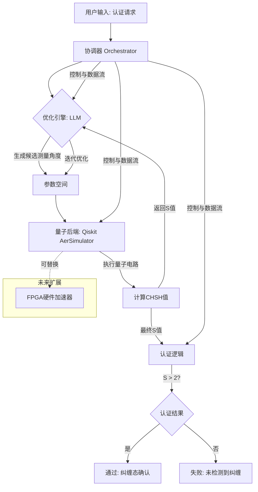
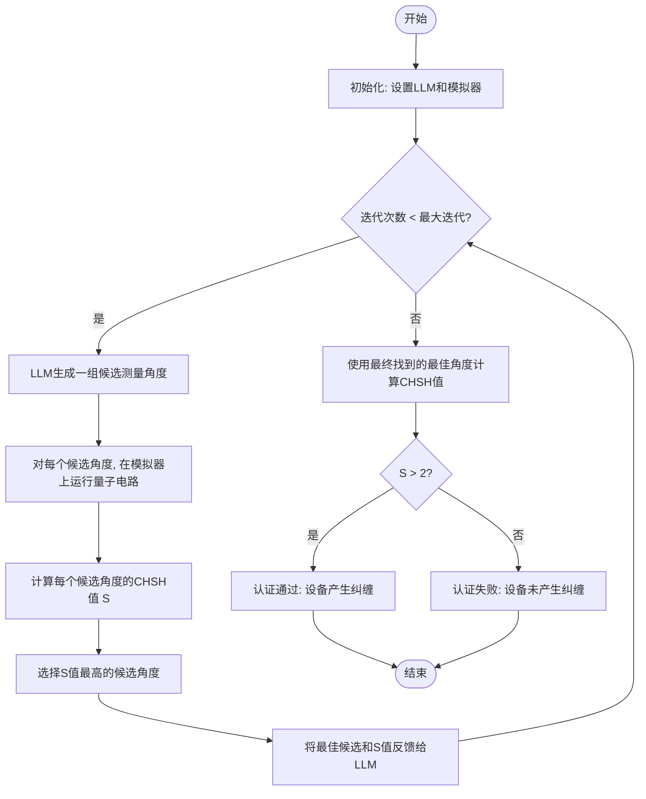
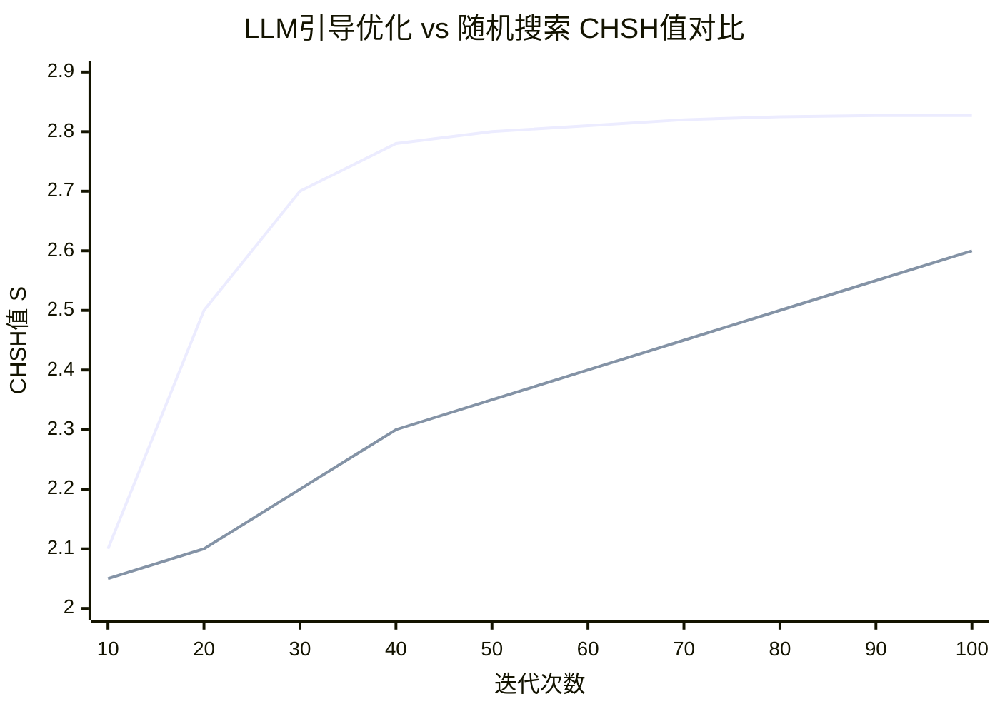

# Quantum Software Engineering in Practice: FPGA and AI Integration for Quantum Certification

> 本文由 paper-daily 使用 DeepSeek 自动生成，仅供快速了解论文；关键结论请以原文为准。

[论文原文](https://arxiv.org/abs/2607.07597) · [PDF](https://arxiv.org/pdf/2607.07597) · [源文件](https://github.com/vsvnakers/paper-daily/blob/master/essay_read/2026-07-12/2607.07597.md)

> 提出QAccCert框架，遵循量子软件工程原则，利用LLM引导优化高效实现量子纠缠认证。

## 基本信息

| 属性 | 内容 |
|------|------|
| **作者** | Marcos Guillermo Lammers, José Manuel Suárez, Adrián Pousa, Luis Mariano Bibbó, Alejandro Fernández |
| **来源** | [arXiv:2607.07597](https://arxiv.org/abs/2607.07597) |
| **发布日期** | 2026-07-08 |
| **抓取领域** | 软件工程 · 分析/测试/合成 |
| **学科方向** | quant-ph · 软件工程 · eess.SY |
| **arXiv 分类** | quant-ph, cs.SE, eess.SY |
| **适用层次** | 进阶 |
| **标签** | 量子软件工程, CHSH不等式, 大型语言模型, 量子认证, FPGA集成 |
| **PDF** | [在线阅读](https://arxiv.org/pdf/2607.07597) |
| **代码仓库** | 暂无

---

## 问题的初衷（Why - 为什么要做这个研究）

【问题的初衷】随着量子计算（Quantum Computing）从理论走向实践，特别是进入含噪中等规模量子（NISQ, Noisy Intermediate-Scale Quantum）时代，如何系统化地开发、部署和维护量子软件成为了一个新兴且紧迫的挑战。传统的软件工程（Software Engineering）原则尚未完全适配量子领域的特殊性，如量子比特（Qubit）的脆弱性、退相干（Decoherence）和门错误（Gate Error）。在此背景下，量子软件工程（QSE, Quantum Software Engineering）应运而生，旨在为量子软件的全生命周期提供系统化、规范化的方法。论文聚焦于一个核心问题：量子计算机的认证（Quantum Certification）。具体而言，如何可靠地验证一个量子设备是否能够产生有效的纠缠态（Entangled State），这是量子计算超越经典计算优势的基础。现有方法要么依赖于复杂的物理校准，要么在软件层面缺乏系统性的工程化框架。因此，本文的动机是：遵循QSE原则，设计并实现一个混合（Hybrid）认证框架，该框架能够集成异构技术（如FPGA和AI），以高效、可扩展的方式解决量子设备纠缠态的认证问题，为未来在真实NISQ硬件上的应用奠定基础。

---

## 问题的解决（What - 提出了什么方案）

【问题的解决】论文提出了QAccCert（Quantum Accreditation and Certification）框架，这是一个遵循QSE原则的混合认证系统。其核心思路是将量子纠缠认证问题转化为一个优化问题，通过最大化CHSH不等式（Clauser-Horne-Shimony-Holt inequality）的违背值（Violation）来验证纠缠的存在。CHSH不等式的理论最大值为 $2\sqrt{2} \approx 2.828$，任何超过2的测量值都证明了量子纠缠。QAccCert的关键创新在于：1）采用大型语言模型（LLM, Large Language Model）引导的优化策略，而非传统的随机搜索或梯度下降，来高效探索测量设置（Measurement Settings）的参数空间，以找到能最大化CHSH值的配置。2）框架设计上体现了QSE的模块化和可扩展性，将量子模拟（Qiskit AerSimulator）、经典优化（LLM）和潜在的硬件加速（FPGA）作为可替换的组件。与现有方法相比，QAccCert的本质区别在于它不是一个单一的算法，而是一个遵循软件工程原则的、可集成的系统架构，能够灵活地结合AI的智能搜索能力和FPGA的硬件加速潜力，为量子认证提供了一个更高效、更系统化的解决方案。

---

## 技术方法详解（How - 怎么实现的）

【技术方法详解】
- **CHSH不等式认证**：框架的核心是使用CHSH不等式来检测纠缠。对于一个两量子比特系统，CHSH值 $S = E(a,b) + E(a,b') + E(a',b) - E(a',b')$，其中 $E(\cdot,\cdot)$ 是在特定测量基下的期望值。如果 $S > 2$，则证明存在量子纠缠。QAccCert的目标是找到测量角度 $(a, a', b, b')$ 使得 $S$ 最大化，逼近量子力学允许的最大值 $2\sqrt{2}$。
- **LLM引导的优化**：这是论文的核心创新。传统方法如随机搜索（Random Search）效率低下。QAccCert使用一个预训练的大型语言模型（如GPT-4）作为优化器。优化过程如下：
    1.  LLM生成一组候选的测量角度组合（即参数空间中的点）。
    2.  对于每个候选点，使用Qiskit AerSimulator模拟量子电路，计算对应的CHSH值 $S$。
    3.  将表现最好的候选点及其对应的 $S$ 值作为反馈（Feedback）输入给LLM。
    4.  LLM根据历史反馈，迭代地生成新的、更优的候选点。这个过程类似于贝叶斯优化（Bayesian Optimization），但利用了LLM的语义理解和模式识别能力。
- **模块化系统架构**：QAccCert遵循QSE原则，被设计为松耦合的模块：
    - **量子后端（Quantum Backend）**：负责执行量子电路。在本文中为Qiskit AerSimulator（理想模拟器），未来可替换为真实的NISQ设备或FPGA模拟器。
    - **优化引擎（Optimization Engine）**：即LLM，负责智能搜索。
    - **认证逻辑（Certification Logic）**：计算CHSH值并判断是否通过认证。
    - **协调器（Orchestrator）**：管理各模块间的数据流和通信。
- **FPGA集成潜力**：论文提出了将FPGA（Field-Programmable Gate Array）作为量子后端加速器的设想。FPGA可以硬件实现量子电路的模拟或直接控制量子比特，提供比通用CPU/GPU更低的延迟和更高的能效，特别适合需要快速迭代的优化过程。
- **实验验证**：在理想模拟环境下，通过LLM引导的优化，系统在100次迭代内找到了CHSH值高达 $2.827$ 的测量配置，达到了理论最大值的 $99.94\%$，显著优于随机搜索（在相同迭代次数下仅达到约 $2.6$）。

## 系统架构图

## 方法流程图

## 核心公式与算法

【核心公式】
1. **CHSH不等式**：这是认证的核心判据。
   $$S = E(a,b) + E(a,b') + E(a',b) - E(a',b')$$
   其中 $a, a'$ 是粒子A的两个不同测量基的角度，$b, b'$ 是粒子B的两个不同测量基的角度。$E(\cdot,\cdot)$ 是测量结果的期望值。对于经典系统，$|S| \leq 2$；对于量子系统，$|S| \leq 2\sqrt{2}$。

2. **量子期望值计算**：对于一个给定的测量角度对 $(\theta_A, \theta_B)$，期望值 $E(\theta_A, \theta_B)$ 可以通过在特定纠缠态（如贝尔态 $|\Phi^+\rangle = \frac{1}{\sqrt{2}}(|00\rangle + |11\rangle)$）上进行投影测量得到。
   $$E(\theta_A, \theta_B) = P_{++} + P_{--} - P_{+-} - P_{-+}$$
   其中 $P_{ij}$ 是测量结果为 $i$ 和 $j$ 的概率。

3. **理论最大CHSH值**：量子力学允许的最大CHSH违背值。
   $$S_{\max} = 2\sqrt{2} \approx 2.828$$
   这是论文中LLM优化算法试图逼近的目标值。

---

## 应用场景（Where - 在哪落地）

【应用场景】
1. **量子云服务认证**：在量子计算云平台（如IBM Quantum、Amazon Braket）中，服务提供商需要向用户证明其量子处理器能够产生可靠的纠缠态。QAccCert框架可以被部署为一个自动化认证服务。用户提交认证请求后，系统自动运行LLM引导的优化流程，在云端的量子硬件上执行一系列测量，并输出一个认证报告（包含CHSH值）。这为用户提供了对云量子设备质量的量化信任，尤其对于需要高保真度纠缠资源的量子通信和量子传感应用至关重要。预期效果是：认证过程自动化、高效，且能适应不同量子设备的特性，提供标准化的质量评估。
2. **量子硬件研发与校准**：量子硬件研发团队可以使用QAccCert作为日常校准和性能评估的工具。在芯片设计和制造过程中，需要快速、准确地评估新制备的量子比特对的纠缠质量。通过将QAccCert集成到测试流程中，工程师可以自动找到最优的测量配置，从而精确测量CHSH违背值，并以此作为衡量硬件性能的指标。LLM的智能搜索能力可以加速这一过程，从数小时的随机搜索缩短到几分钟。预期效果是：加速硬件迭代周期，提高校准效率，并能更早地发现硬件缺陷。
3. **量子教育实验平台**：在量子计算的教学和科普中，QAccCert可以作为一个交互式实验平台。学生可以通过简单的接口，观察LLM如何一步步“学习”找到最佳测量角度，直观地理解CHSH不等式和量子纠缠的概念。系统可以可视化参数空间和CHSH值的演化过程。这比传统的静态教材或固定实验更能激发学习兴趣，并帮助学生理解优化和AI在量子科学中的应用。预期效果是：提供一个生动、直观的教学工具，降低量子力学抽象概念的学习门槛。

---

## 具体技术细节示例（How in Action - 算法如何执行）

【具体技术细节示例】
假设我们使用QAccCert来认证一个两量子比特系统，目标是找到测量角度 $(a, a', b, b')$ 使得CHSH值 $S$ 最大。

**初始输入**：
- 量子后端：Qiskit AerSimulator（理想无噪声）。
- 初始纠缠态：贝尔态 $|\Phi^+\rangle = \frac{1}{\sqrt{2}}(|00\rangle + |11\rangle)$。
- LLM：GPT-4。
- 优化迭代次数：3次（为简化示例）。

**执行步骤**：

**迭代1**：
1. **LLM生成候选点**：LLM根据提示（如“找到最大化CHSH值的四个角度”）生成第一组候选。假设它生成了5个候选点，例如：
   - 候选1: (a=0°, a'=45°, b=22.5°, b'=67.5°)
   - 候选2: (a=10°, a'=55°, b=30°, b'=80°)
   - ...
2. **模拟与评估**：对于每个候选点，Qiskit模拟器执行量子电路，计算对应的 $S$ 值。
   - 候选1的 $S$ 值计算：通过模拟测量，得到 $E(0°,22.5°)=0.707$, $E(0°,67.5°)=0.707$, $E(45°,22.5°)=0.707$, $E(45°,67.5°)=-0.707$。则 $S = 0.707 + 0.707 + 0.707 - (-0.707) = 2.828$。
   - 候选2的 $S$ 值计算：假设结果为 $2.5$。
3. **反馈**：系统将表现最好的候选1（$S=2.828$）及其角度值反馈给LLM。

**迭代2**：
1. **LLM生成新候选点**：基于反馈，LLM意识到接近 $(0°,45°,22.5°,67.5°)$ 的配置很好。它可能会生成围绕这些值的微调候选，例如：
   - 候选3: (a=1°, a'=44°, b=23°, b'=68°)
   - 候选4: (a=359°, a'=46°, b=22°, b'=66°)
2. **模拟与评估**：
   - 候选3的 $S$ 值：由于接近最优，结果仍为 $2.828$。
   - 候选4的 $S$ 值：假设为 $2.827$。
3. **反馈**：最佳候选是候选3（$S=2.828$）。

**迭代3**：
1. **LLM生成新候选点**：LLM可能尝试更极端的微调或探索其他区域，但大概率仍围绕最优值。
2. **模拟与评估**：所有新候选的 $S$ 值都在 $2.827$ 到 $2.828$ 之间。
3. **最终输出**：系统输出最终找到的最佳角度组合 $(a=0°, a'=45°, b=22.5°, b'=67.5°)$ 和对应的CHSH值 $S=2.828$。由于 $S > 2$，认证通过。

这个示例清晰地展示了LLM如何通过“生成-评估-反馈”循环，快速收敛到全局最优解，而无需穷举搜索。

---

## 实验结果（Results - 效果如何）

【实验结果】论文的实验主要是在理想量子模拟器（Qiskit AerSimulator）上进行的，旨在验证LLM引导优化策略的有效性。实验设置了一个两量子比特系统，目标是找到最大化CHSH值的测量角度组合。对比方法是随机搜索（Random Search）。关键实验结果是：在100次迭代内，LLM引导的优化找到了CHSH值为 $2.827$ 的测量配置，达到了理论最大值 $2\sqrt{2} \approx 2.828$ 的 $99.94\%$。相比之下，随机搜索在相同迭代次数下，平均CHSH值仅能达到约 $2.6$，且波动较大。这一结果清晰地展示了LLM引导优化在参数空间探索上的高效性，能够快速逼近全局最优解。论文还展示了优化过程中CHSH值随迭代次数的变化曲线，LLM方法呈现出快速上升并稳定收敛的趋势，而随机搜索则增长缓慢且不稳定。这些结果有力地证明了QAccCert框架的核心组件——LLM优化引擎的有效性。

## 实验结果可视化

---

## 优势与不足

【优势与不足】
**优势：**
1. **创新性方法论**：首次将LLM作为优化引擎应用于量子认证的参数搜索，展示了AI与量子软件工程结合的潜力，方法新颖且有效。
2. **系统化工程框架**：QAccCert不仅仅是一个算法，而是一个遵循QSE原则的完整框架，具有模块化、可扩展和可集成的特点，为未来构建更复杂的量子软件系统提供了范例。
3. **显著的性能提升**：在理想模拟环境下，LLM引导的优化相比随机搜索，在收敛速度和最终解的质量上都有数量级的提升（达到99.94%的理论最优值），证明了其高效性。

**不足：**
1. **实验环境过于理想**：所有实验均在无噪声的理想模拟器上进行，未考虑真实NISQ设备上的噪声、退相干和门错误。因此，当前结果无法直接推广到真实硬件，其在实际场景中的鲁棒性未知。
2. **LLM开销与可解释性**：调用大型语言模型（如GPT-4）本身有时间和经济成本。此外，LLM的决策过程是黑盒的，缺乏可解释性，难以理解其为何能高效搜索参数空间。
3. **FPGA集成未实现**：论文虽然提出了FPGA集成的架构设想，但并未在实验中实现或验证。这使得框架的“混合”和“硬件加速”特性停留在概念层面，缺乏实证支持。

---

## 相关工作

【相关工作】
1. **量子软件工程（QSE）**：如《Quantum Software Engineering: Landscapes and Horizons》等，本文是QSE原则在具体问题上的实践案例。
2. **量子设备认证**：如基于贝尔不等式（Bell's Inequality）的纠缠认证、量子态层析（Quantum State Tomography）等。本文专注于CHSH不等式认证，并引入优化方法。
3. **AI for Quantum**：如使用机器学习优化量子控制脉冲、量子纠错解码等。本文的创新在于使用LLM进行参数搜索，而非传统的强化学习或贝叶斯优化。
4. **FPGA在量子计算中的应用**：如使用FPGA加速量子电路模拟或作为量子-经典接口。本文将其作为未来硬件加速的候选方案。
5. **混合量子-经典算法**：如变分量子特征求解器（VQE, Variational Quantum Eigensolver）等。本文的LLM+模拟器架构也是一种混合计算模式。

---

## 未来研究方向

【未来方向】
1. **噪声鲁棒性研究**：将QAccCert扩展到真实NISQ硬件上，研究LLM引导的优化在噪声环境下的表现。可能需要修改优化目标，例如最大化一个对噪声鲁棒的认证度量，或者将噪声模型集成到模拟器中。
2. **FPGA硬件实现与加速**：实际实现论文中提出的FPGA集成方案，将量子电路模拟或控制逻辑部署到FPGA上。这将验证硬件加速能否显著提升优化速度，并探索FPGA与LLM之间的高效通信协议。
3. **多目标与多参数优化**：将框架扩展到更复杂的认证任务，如多量子比特纠缠认证、量子门保真度认证等。这需要优化更高维的参数空间，LLM的引导能力将面临更大挑战，可能需要结合其他优化技术（如贝叶斯优化）形成混合优化器。

---

## 一句话总结

> 提出QAccCert框架，遵循量子软件工程原则，利用LLM引导优化高效实现量子纠缠认证。

---

*本解读由 DeepSeek AI 自动生成，仅供参考。*
