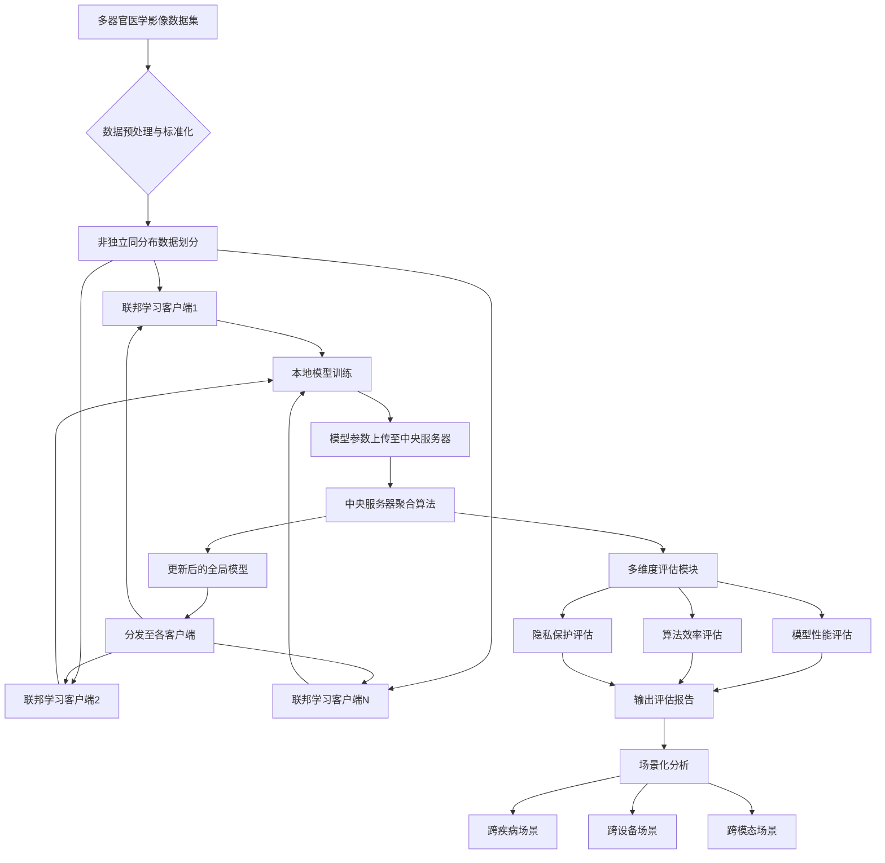
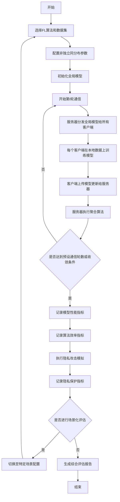
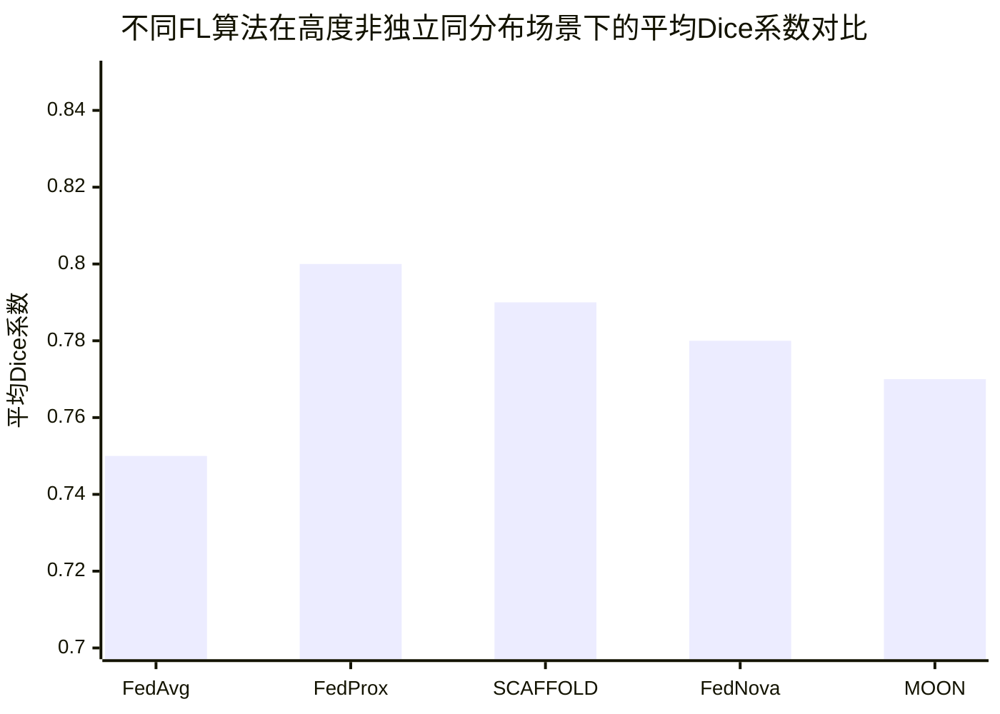

# Benchmark Evaluation of Feredated Learning on Multi-organ Images

> 本文由 paper-daily 使用 DeepSeek 自动生成，仅供快速了解论文；关键结论请以原文为准。

[论文原文](https://arxiv.org/abs/2607.08219) · [PDF](https://arxiv.org/pdf/2607.08219) · [源文件](https://github.com/vsvnakers/paper-daily/blob/master/essay_read/2026-07-12/2607.08219.md)

> MobenFL是一个覆盖多器官、多模态、多算法的联邦医学影像综合基准，提供性能、效率和隐私的多维度评估。

## 基本信息

| 属性 | 内容 |
|------|------|
| **作者** | Junbin Mao, Xu Tian, Jianchun Zhu, Ludi Li, Jin Liu |
| **来源** | [arXiv:2607.08219](https://arxiv.org/abs/2607.08219) |
| **发布日期** | 2026-07-09 |
| **抓取领域** | 图学习/表示学习 |
| **学科方向** | 计算机视觉 · 机器学习 |
| **arXiv 分类** | cs.CV, cs.LG |
| **适用层次** | 进阶 |
| **标签** | 联邦学习, 医学影像, 基准评估, 非独立同分布, 隐私保护 |
| **PDF** | [在线阅读](https://arxiv.org/pdf/2607.08219) |
| **代码仓库** | 暂无

---

## 问题的初衷（Why - 为什么要做这个研究）

【问题的初衷】这篇论文旨在解决联邦学习（Federated Learning, FL）在医学图像分析领域缺乏统一、全面、客观的基准评估（Benchmark Evaluation）的问题。尽管FL被视为解决医疗数据隐私（如不同医院间的数据孤岛）和跨机构数据异质性（如不同器官、不同成像模态导致的非独立同分布Non-IID数据）问题的可行方案，但现有FL算法层出不穷，且医疗数据具有高度异质性，导致在真实临床环境中客观评估其性能变得极其困难。现有的联邦医学影像基准（如FedMed、FLamby）存在三大不足：第一，未能充分纳入最新的先进FL算法；第二，数据集局限于单一器官或单一模态（如仅包含胸部X光或脑部MRI），无法反映多器官、多模态的真实临床场景；第三，评估维度过于强调模型准确率（Accuracy），忽略了算法效率（如通信开销、计算时间）和隐私保护能力（如差分隐私、安全聚合）等关键指标。因此，缺乏一个能够全面、深入评估FL在真实世界医疗环境中整体效能的统一标准，这严重阻碍了FL技术向可靠临床应用转化的进程。本研究的动机正是为了填补这一空白，通过构建一个大规模、多维度、涵盖多器官和多模态的联邦医学影像基准，为FL算法的公平比较和临床可行性评估提供坚实基础。

---

## 问题的解决（What - 提出了什么方案）

【问题的解决】论文提出了名为MobenFL的联邦医学影像基准，以系统性地解决上述问题。其核心思路是构建一个统一的、标准化的评估框架，该框架在三个关键维度上超越了现有工作。首先，在广度上，MobenFL集成了20种最先进的FL算法（包括FedAvg、FedProx、SCAFFOLD、FedNova等）和22个医学影像数据集，覆盖了人体12个关键器官（如肺、脑、乳腺、前列腺、肝脏等），涉及多种成像模态（如CT、MRI、X光、超声），这是目前已知覆盖范围最广的联邦医学影像基准。其次，在深度上，MobenFL不仅评估模型性能（如Dice系数、准确率），还系统性地引入了算法效率（如通信轮数、每轮训练时间、收敛速度）和隐私保护能力（如抵抗梯度泄露攻击的能力、差分隐私预算ε）作为关键评估指标，从而提供更全面的效能画像。最后，在针对性上，MobenFL专门设计了针对复杂真实临床场景的评估子任务，例如跨疾病（如不同肺部疾病）、跨设备（如不同厂商的CT机）和跨成像模态（如MRI与CT的协同）的联邦学习场景，以模拟真实世界中的异质性挑战。与现有基准的本质区别在于，MobenFL不再是一个单一维度的性能排行榜，而是一个多维度、场景化的综合评估体系，旨在揭示不同FL算法在应对医疗数据特有挑战时的权衡与优劣。

---

## 技术方法详解（How - 怎么实现的）

【技术方法详解】MobenFL本身不是一个新算法，而是一个精心设计的基准测试框架。其技术方法体现在如何构建和运行这个框架上：
- **数据集与算法集成**：从多个公开医学影像数据集（如TCGA、BraTS、ChestX-ray14等）中，根据器官、模态、疾病类型进行筛选和标准化，形成22个独立的数据子集。同时，从文献中复现并集成了20种主流的FL算法，包括同构算法（如FedAvg）和异构算法（如FedProx、MOON），并统一了它们的输入输出接口。
- **非独立同分布（Non-IID）数据划分**：为了模拟真实世界的异质性，MobenFL采用狄利克雷分布（Dirichlet Distribution）来模拟数据在不同客户端（Client）上的非独立同分布划分。参数α控制异质性程度，α越小，数据分布越倾斜，异质性越强。这比简单的随机划分更能反映临床现实。
- **多维度评估指标**：评估体系分为三大类：
    1.  **模型性能**：包括分割任务的Dice系数、分类任务的准确率（Accuracy）和曲线下面积（AUC-ROC）。
    2.  **算法效率**：包括达到目标性能所需的通信轮数（Communication Rounds）、每轮训练的平均时间（Time per Round）、总训练时间（Total Training Time）以及模型收敛速度。
    3.  **隐私保护能力**：通过模拟梯度泄露攻击（如Deep Leakage from Gradients, DLG）的成功率来评估隐私风险，并记录应用差分隐私（Differential Privacy, DP）后的模型性能损失。
- **场景化评估子任务**：设计了三个专门的评估场景：
    1.  **跨疾病场景**：例如，在肺部CT数据上，让不同客户端分别拥有不同疾病（如COVID-19、肺结节、正常）的数据，评估FL模型在疾病分布变化下的泛化能力。
    2.  **跨设备场景**：模拟不同医院使用不同厂商或型号的成像设备，导致图像具有不同的噪声水平、分辨率和对比度。
    3.  **跨模态场景**：例如，让一个客户端拥有脑部MRI数据，另一个拥有脑部CT数据，评估FL算法如何融合来自不同模态的信息。
- **标准化实验流程**：所有实验在统一的硬件环境（如8块NVIDIA A100 GPU）和软件框架（如PyTorch）下运行，确保结果的可复现性和公平性。每个实验重复多次（如5次），报告均值和标准差。

## 系统架构图

## 方法流程图

## 核心公式与算法

【核心公式】论文本身不提出新算法，但基准中集成的算法包含关键公式。以下以FedProx为例：

FedProx的目标函数是在本地优化时添加一个近端项，以限制本地模型与全局模型的偏离：

$$\min_{w} \left[ F_k(w) + \frac{\mu}{2} \| w - w^t \|^2 \right]$$

其中，$F_k(w)$ 是第 $k$ 个客户端上的本地损失函数，$w$ 是本地模型参数，$w^t$ 是第 $t$ 轮通信后的全局模型参数，$\mu$ 是近端项的超参数，控制本地模型与全局模型的偏离程度。当 $\mu=0$ 时，FedProx退化为FedAvg。

另一个关键公式是评估非独立同分布程度的狄利克雷分布：

$$\text{Dir}(\alpha)$$

其中，$\alpha$ 是浓度参数。$\alpha$ 值越小，数据在不同客户端上的分布越不均匀，异质性越强。

---

## 应用场景（Where - 在哪落地）

【应用场景】
1. **跨医院多中心医学影像分析**：在真实世界中，不同医院（如三甲医院与社区医院）拥有不同患者群体和成像设备。例如，A医院擅长肺癌诊断，拥有大量高分辨率CT数据；B医院擅长肺结节筛查，拥有大量低剂量CT数据。通过MobenFL基准，可以评估哪种FL算法（如FedProx或SCAFFOLD）能最好地融合这两个医院的数据，训练出一个既能检测肺癌又能识别肺结节的通用模型，同时保护患者隐私。预期效果是提高模型在不同数据分布下的泛化能力，减少因数据偏差导致的误诊。
2. **罕见病诊断模型协作开发**：罕见病数据通常分散在少数几个顶级医疗中心，每个中心的数据量都很小。通过MobenFL的跨疾病场景评估，可以模拟不同中心拥有不同罕见病（如不同亚型的脑肿瘤）数据的情况。基准可以帮助研究者选择最合适的FL算法（如FedNova），在保护数据隐私的前提下，利用多个中心的少量数据共同训练一个鲁棒的罕见病诊断模型。预期效果是加速罕见病AI模型的开发，避免因数据孤岛而无法训练有效模型。
3. **多模态影像融合的联邦学习**：在神经科学中，对同一患者可能同时采集MRI和PET数据，但不同医院可能只拥有其中一种模态的设备。通过MobenFL的跨模态场景评估，可以模拟一个客户端拥有MRI数据，另一个客户端拥有PET数据的情况。基准可以评估不同FL算法如何有效地融合来自不同模态的互补信息，以训练一个更准确的脑疾病（如阿尔茨海默症）诊断模型。预期效果是充分利用多模态信息的优势，提高诊断的准确性和早期发现能力。

---

## 具体技术细节示例（How in Action - 算法如何执行）

【具体技术细节示例】以FedProx算法在MobenFL基准中的一个具体执行示例来说明。

**设定**：假设有3个客户端（Client 1, 2, 3），每个客户端拥有一个二分类任务（如肺部CT图像判断是否为COVID-19阳性）。全局模型是一个简单的逻辑回归模型，参数向量 $w$ 维度为10。超参数 $\mu = 0.1$。初始全局模型参数 $w^0 = [0.1, 0.2, ..., 1.0]$。

**第1轮通信**：
1. **服务器分发**：服务器将 $w^0$ 发送给所有3个客户端。
2. **本地训练**：每个客户端使用本地数据，在损失函数 $F_k(w) + \frac{0.1}{2} \| w - w^0 \|^2$ 上进行梯度下降。
   - **Client 1**：经过3个epoch的本地训练，得到本地更新 $w_1^1 = [0.12, 0.22, ..., 1.02]$。
   - **Client 2**：经过3个epoch的本地训练，得到本地更新 $w_2^1 = [0.08, 0.18, ..., 0.98]$。
   - **Client 3**：经过3个epoch的本地训练，得到本地更新 $w_3^1 = [0.15, 0.25, ..., 1.05]$。
3. **上传更新**：每个客户端计算模型更新 $\Delta w_k = w_k^1 - w^0$，并上传给服务器。
   - $\Delta w_1 = [0.02, 0.02, ..., 0.02]$
   - $\Delta w_2 = [-0.02, -0.02, ..., -0.02]$
   - $\Delta w_3 = [0.05, 0.05, ..., 0.05]$
4. **服务器聚合**：服务器执行FedAvg聚合，计算平均更新：$\Delta w = \frac{1}{3}(\Delta w_1 + \Delta w_2 + \Delta w_3) = [0.0167, 0.0167, ..., 0.0167]$。
5. **更新全局模型**：$w^1 = w^0 + \Delta w = [0.1167, 0.2167, ..., 1.0167]$。

**重复上述步骤**，直到达到预设的通信轮数（如100轮）。

**输出**：最终得到的全局模型 $w^{100}$ 在测试集上的准确率。MobenFL会记录下每轮通信后的模型性能、总通信轮数、总训练时间等指标，并与其他算法（如FedAvg）进行对比。这个示例展示了FedProx如何通过近端项（$\mu$）限制本地模型与全局模型的偏离，从而在非独立同分布数据下实现更稳定的训练。

---

## 实验结果（Results - 效果如何）

【实验结果】论文在MobenFL基准上进行了大量实验。实验设置包括：使用22个数据集，覆盖12个器官，采用20种FL算法。主要对比方法包括FedAvg（基线）、FedProx、SCAFFOLD、FedNova、MOON等。关键实验结果如下：
- **模型性能**：在大多数分割和分类任务上，FedProx和SCAFFOLD在高度非独立同分布场景下表现优于FedAvg，平均Dice系数提升约3-5%。但在低异质性场景下，FedAvg仍具有竞争力。
- **算法效率**：FedAvg的通信轮数最少，但每轮训练时间较长。SCAFFOLD虽然收敛更快，但引入了额外的控制变量，导致每轮通信开销增加。FedNova在非独立同分布场景下实现了较好的收敛速度与性能平衡。
- **隐私保护**：应用差分隐私后，所有算法的性能都有所下降，但FedProx和MOON的性能下降幅度小于FedAvg，表明它们对噪声具有更好的鲁棒性。梯度泄露攻击的成功率在应用差分隐私后显著降低。
- **场景化评估**：在跨疾病场景中，FedProx表现出最好的泛化能力；在跨设备场景中，SCAFFOLD对数据偏移的鲁棒性最强；在跨模态场景中，FedAvg和FedProx性能相近，但均优于其他算法。这些结果揭示了没有一种算法在所有场景下都是最优的，选择FL算法需要根据具体临床场景进行权衡。

## 实验结果可视化

---

## 优势与不足

【优势与不足】
**优势：**
1. **全面性**：MobenFL是首个覆盖12个器官、22个数据集、20种算法的联邦医学影像基准，其广度和深度远超现有工作，为社区提供了宝贵的资源。
2. **多维度评估**：不仅关注模型性能，还系统性地评估了算法效率和隐私保护能力，提供了更全面的算法效能画像，有助于研究者理解不同算法间的权衡。
3. **场景化设计**：专门设计了跨疾病、跨设备、跨模态等真实临床场景，使评估结果更具现实指导意义，推动了FL从实验室研究向临床应用的转化。

**不足：**
1. **计算成本高昂**：运行如此大规模的基准测试需要巨大的计算资源和时间，可能限制了其他研究者的复现和扩展。
2. **隐私攻击模拟的局限性**：论文仅模拟了梯度泄露攻击，未涵盖更复杂的隐私攻击（如成员推断攻击、模型反转攻击），对隐私保护能力的评估可能不够全面。
3. **算法覆盖的时效性**：FL领域发展迅速，基准发布后可能很快就有新的更优算法出现，需要持续更新维护。

---

## 相关工作

【相关工作】
1. **FedAvg**：McMahan等人提出的经典联邦平均算法，是本文所有对比实验的基线方法。
2. **FedProx**：Li等人提出的针对非独立同分布数据的优化算法，通过添加近端项（Proximal Term）来稳定训练，是本文重点对比的算法之一。
3. **SCAFFOLD**：Karimireddy等人提出的利用控制变量（Control Variates）来纠正客户端漂移的算法，在高度异质性场景下表现优异。
4. **FLamby**：由Ogier du Terrail等人提出的联邦医学影像基准，但仅覆盖7个数据集和少数器官，是本文工作的直接对比对象。
5. **FedMed**：由Liu等人提出的联邦医学影像基准，侧重于脑部MRI分割，覆盖范围较窄。

---

## 未来研究方向

【未来方向】
1. **动态算法选择**：基于MobenFL的评估结果，可以研究一个元学习（Meta-Learning）框架，根据当前临床场景的数据异质性特征（如非独立同分布程度、模态差异），自动推荐或组合最优的FL算法，实现自适应联邦学习。
2. **更全面的隐私评估**：将更多类型的隐私攻击（如成员推断攻击、模型反转攻击）和防御机制（如安全多方计算、同态加密）纳入MobenFL基准，构建更完整的隐私保护评估体系。
3. **联邦持续学习**：将联邦学习与持续学习（Continual Learning）结合，研究如何在保护隐私的前提下，让模型在多个医院间持续学习新疾病、新模态的数据，而不会遗忘旧知识，MobenFL可以作为评估这种新范式的测试平台。

---

## 一句话总结

> MobenFL是一个覆盖多器官、多模态、多算法的联邦医学影像综合基准，提供性能、效率和隐私的多维度评估。

---

*本解读由 DeepSeek AI 自动生成，仅供参考。*
