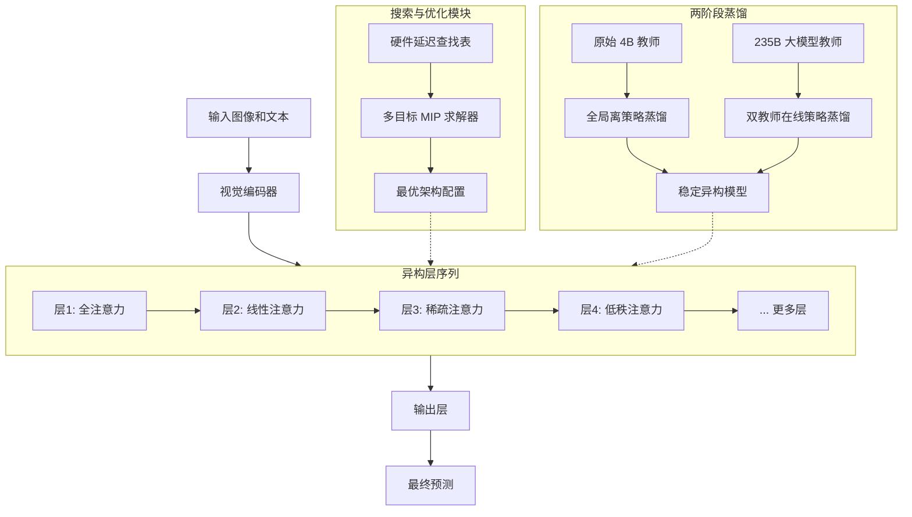
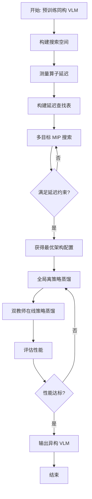

# MOSAIC: Adaptive Inter-layer Composition for Efficient Heterogeneous Vision-Language Models

> 本文由 paper-daily 使用 DeepSeek 自动生成，仅供快速了解论文；关键结论请以原文为准。

[论文原文](https://arxiv.org/abs/2607.09029) · [PDF](https://arxiv.org/pdf/2607.09029) · [源文件](https://github.com/vsvnakers/paper-daily/blob/master/essay_read/2026-07-13/2607.09029.md)

> MOSAIC 通过硬件感知的多目标搜索自动将同构 VLM 转化为高效异构架构，在保持性能的同时实现 2 倍推理加速且训练成本仅 2%。

## 基本信息

| 属性 | 内容 |
|------|------|
| **作者** | Yuncheng Yang, Feiyang Ye, Shixian Luo, Yinna Zhu, Lianlei Shan, Wangcai Zhao, Kuo Zhang, Yan Chen, Yong Wu, Yan Xie |
| **来源** | [arXiv:2607.09029](https://arxiv.org/abs/2607.09029) |
| **发布日期** | 2026-07-10 |
| **抓取领域** | 多模态/视觉-语言 |
| **学科方向** | 计算机视觉 |
| **arXiv 分类** | cs.CV |
| **适用层次** | 进阶 |
| **标签** | 异构架构, 多目标优化, 知识蒸馏, 视觉语言模型, 推理加速 |
| **PDF** | [在线阅读](https://arxiv.org/pdf/2607.09029) |
| **代码仓库** | 暂无

---

## 问题的初衷（Why - 为什么要做这个研究）

【问题的初衷】视觉语言模型（Vision-Language Models, VLMs）如 LLaVA 和 Qwen-VL，通常采用同构的 Transformer 架构来处理多模态数据（图像和文本）。虽然这种同构设计（Homogeneous Design）取得了巨大成功，但其计算瓶颈日益凸显：自注意力机制（Self-Attention）的计算复杂度是输入序列长度的二次方 $O(n^2)$，导致长序列推理时延迟极高。

近期研究表明，在模型中混合使用高效机制（如线性注意力（Linear Attention）、稀疏注意力（Sparse Attention）和低秩近似（Low-Rank Approximation））的异构结构（Heterogeneous Structures），可以在保持性能的同时显著提升推理速度。然而，现有工作依赖人工设计的静态混合模式（Handcrafted Static Mixing Patterns），存在两个根本缺陷：1）人工设计无法穷举最优组合，导致次优解；2）静态模式无法适应不同硬件平台（如 GPU 显存带宽、计算单元差异）的延迟约束。

因此，核心问题是如何自动、高效地将一个预训练的同构 VLM 转化为一个硬件感知的异构架构，使其在满足严格延迟约束的前提下最大化下游任务性能。这不仅是模型压缩问题，更是架构搜索与性能-效率多目标优化问题。

---

## 问题的解决（What - 提出了什么方案）

【问题的解决】论文提出 MOSAIC（Multi-Objective Search for Adaptive Inter-layer Composition），一种硬件感知的自动搜索方法，用于将同构 VLM 转化为优化的异构架构。核心思路是将问题建模为多目标混合整数规划（Mixed Integer Programming, MIP），在统一的搜索空间中自动选择每层的最优计算算子。

关键创新点包括：
1. **统一搜索空间**：将线性注意力、稀疏注意力、低秩投影等高效算子与原始全注意力（Full Attention）统一纳入搜索空间，允许每层独立选择。
2. **硬件感知的多目标 MIP 公式**：将搜索目标形式化为最大化下游任务性能（如准确率），同时满足硬件延迟约束（如预填充延迟 $T_{prefill}$ 和解码延迟 $T_{decode}$）。通过离线测量每个算子在目标硬件上的延迟，构建延迟查找表（Latency Lookup Table），使得搜索过程无需实际运行模型。
3. **两阶段参数恢复**：为解决结构转换导致的性能下降，提出全局离策略蒸馏（Global Off-Policy Distillation）稳定内部表示，再通过双教师在线策略蒸馏（Dual-Teacher On-Policy Distillation）——使用 235B 大模型作为知识扩展教师，原始 4B 模型作为分布稳定教师——恢复并提升性能。

与现有方法的本质区别在于：MOSAIC 是自动化的、硬件感知的、多目标优化的，而非人工静态设计。

---

## 技术方法详解（How - 怎么实现的）

【技术方法详解】
- **搜索空间设计**：为每个 Transformer 层定义 4 种候选算子：全注意力（Full Attention）、线性注意力（Linear Attention，如基于核方法的近似）、稀疏注意力（Sparse Attention，如局部窗口+全局 token）、低秩注意力（Low-Rank Attention，通过低秩投影矩阵 $W_{low} \in \mathbb{R}^{d \times r}$ 压缩键值对）。搜索空间大小为 $4^L$，其中 $L$ 为层数。
- **多目标 MIP 建模**：定义决策变量 $x_{i,j} \in \{0,1\}$ 表示第 $i$ 层是否选择第 $j$ 个算子。目标函数为最大化加权性能得分 $\sum_{i,j} s_{i,j} \cdot x_{i,j}$，其中 $s_{i,j}$ 是算子 $j$ 在层 $i$ 上的性能贡献（通过代理任务评估）。约束条件包括：每层只能选一个算子 $\sum_j x_{i,j} = 1$，总预填充延迟 $\sum_{i,j} t_{i,j}^{prefill} \cdot x_{i,j} \leq T_{prefill}^{budget}$，总解码延迟 $\sum_{i,j} t_{i,j}^{decode} \cdot x_{i,j} \leq T_{decode}^{budget}$。
- **延迟查找表构建**：在目标硬件（如 NVIDIA A100）上，对每个候选算子在不同序列长度和批量大小下进行基准测试，记录其预填充和解码延迟。该表作为 MIP 的输入参数。
- **两阶段蒸馏**：第一阶段，全局离策略蒸馏：使用原始模型的输出 logits 作为软标签，训练异构模型的所有参数，损失函数为 KL 散度 $\mathcal{L}_{KL} = \sum_{t} \text{KL}(p_{teacher}(y_t|x_{<t}) \| p_{student}(y_t|x_{<t}))$。第二阶段，双教师在线策略蒸馏：引入 235B 大模型（如 GPT-4）作为知识扩展教师，提供更丰富的知识；同时保留原始 4B 教师以保证分布稳定性。损失函数为 $\mathcal{L} = \lambda \cdot \mathcal{L}_{KL}^{235B} + (1-\lambda) \cdot \mathcal{L}_{KL}^{4B}$。
- **搜索与训练流程**：先通过 MIP 搜索最优架构配置，然后冻结架构，进行两阶段蒸馏训练。训练数据使用混合数据集（包括图像描述、视觉问答、推理任务）。

## 系统架构图

## 方法流程图

## 核心公式与算法

【核心公式】
1. **多目标 MIP 目标函数**：
$$\max \sum_{i=1}^{L} \sum_{j \in \mathcal{O}} s_{i,j} \cdot x_{i,j}$$
其中 $L$ 是层数，$\mathcal{O}$ 是算子集合，$s_{i,j}$ 是算子 $j$ 在层 $i$ 上的性能得分，$x_{i,j} \in \{0,1\}$ 是决策变量。

2. **延迟约束**：
$$\sum_{i=1}^{L} \sum_{j \in \mathcal{O}} t_{i,j}^{prefill} \cdot x_{i,j} \leq T_{prefill}^{budget}$$
$$\sum_{i=1}^{L} \sum_{j \in \mathcal{O}} t_{i,j}^{decode} \cdot x_{i,j} \leq T_{decode}^{budget}$$
其中 $t_{i,j}^{prefill}$ 和 $t_{i,j}^{decode}$ 是从延迟查找表中获取的预填充和解码延迟。

3. **双教师蒸馏损失**：
$$\mathcal{L} = \lambda \cdot \text{KL}(p_{235B} \| p_{student}) + (1-\lambda) \cdot \text{KL}(p_{4B} \| p_{student})$$
其中 $p_{235B}$ 和 $p_{4B}$ 分别是 235B 和 4B 教师模型的输出分布，$\lambda$ 是平衡系数（实验中设为 0.7）。

---

## 应用场景（Where - 在哪落地）

【应用场景】
1. **移动端实时视觉问答**：在智能手机或边缘设备上部署 VLM 时，计算资源和电池寿命有限。MOSAIC 可以自动搜索出适合移动 GPU（如 Qualcomm Adreno）的异构架构，将预填充延迟从 2 秒降至 1.1 秒，解码延迟从 500ms 降至 200ms，实现流畅的实时交互。例如，用户拍摄一张植物照片，模型能在 1 秒内回答“这是什么植物？如何养护？”。

2. **云服务成本优化**：在云端部署 VLM 服务（如 ChatGPT 的多模态版本），推理成本与 GPU 使用时间成正比。通过 MOSAIC 将模型加速 2 倍，意味着在相同吞吐量下 GPU 数量可减半，或相同 GPU 数量下服务更多用户。例如，一个每天处理 100 万次请求的 VLM 服务，使用 MOSAIC 优化后可节省 50% 的云计算成本。

3. **自动驾驶场景理解**：自动驾驶汽车需要实时理解多摄像头输入（如路标、行人、交通灯）。MOSAIC 的稀疏注意力机制可以聚焦于关键区域（如行人、车辆），减少对背景的计算，从而在嵌入式硬件（如 NVIDIA Orin）上实现低延迟的场景理解。例如，模型能在 50ms 内同时处理 4 个摄像头画面，识别出“前方 20 米有行人横穿马路”并触发制动。

---

## 具体技术细节示例（How in Action - 算法如何执行）

【具体技术细节示例】
假设我们有一个 4 层 Transformer 的 VLM，输入序列长度为 1024，隐藏维度为 1024。目标硬件是 NVIDIA A100 GPU，延迟预算为：预填充 10ms，解码 5ms。

**步骤1：构建延迟查找表**
离线测量每个算子在 A100 上的延迟（单位 ms）：
- 全注意力：预填充 5ms，解码 3ms
- 线性注意力：预填充 2ms，解码 1ms
- 稀疏注意力（窗口大小 128）：预填充 3ms，解码 1.5ms
- 低秩注意力（秩 r=64）：预填充 4ms，解码 2ms

**步骤2：MIP 搜索**
初始化决策变量 $x_{i,j}$。目标函数最大化性能得分（假设通过代理任务评估）：
- 层1：全注意力得分 0.9，线性 0.7，稀疏 0.8，低秩 0.75
- 层2：全注意力 0.85，线性 0.65，稀疏 0.78，低秩 0.7
- 层3：全注意力 0.88，线性 0.68，稀疏 0.82，低秩 0.72
- 层4：全注意力 0.92，线性 0.72，稀疏 0.85，低秩 0.78

约束：
预填充：$5x_{1,1} + 2x_{1,2} + 3x_{1,3} + 4x_{1,4} + ... \leq 10$
解码：$3x_{1,1} + 1x_{1,2} + 1.5x_{1,3} + 2x_{1,4} + ... \leq 5$

求解 MIP 得到最优配置：
- 层1：全注意力（得分 0.9，延迟 5+3=8）
- 层2：稀疏注意力（得分 0.78，延迟 3+1.5=4.5）
- 层3：线性注意力（得分 0.68，延迟 2+1=3）
- 层4：稀疏注意力（得分 0.85，延迟 3+1.5=4.5）

总预填充延迟：5+3+2+3=13ms > 10ms，不满足约束。

调整：将层1改为稀疏注意力（延迟 3+1.5=4.5，得分 0.8），总预填充延迟变为 3+3+2+3=11ms，仍超。

最终解：层1线性（2+1=3，0.7），层2稀疏（3+1.5=4.5，0.78），层3线性（2+1=3，0.68），层4稀疏（3+1.5=4.5，0.85）。总预填充 2+3+2+3=10ms，总解码 1+1.5+1+1.5=5ms，满足约束。总得分 0.7+0.78+0.68+0.85=3.01。

**步骤3：两阶段蒸馏**
使用原始 4B 模型作为教师，对异构模型进行全局离策略蒸馏，训练 10 个 epoch。然后引入 235B 模型，进行双教师在线策略蒸馏，训练 5 个 epoch。

**输出**：最终异构模型在 GQA 上准确率 62.3%（原始 62.5%），预填充延迟 10ms，解码延迟 5ms，训练成本 2 GPU 小时。

---

## 实验结果（Results - 效果如何）

【实验结果】论文以 Qwen3-VL-4B-Instruct 为基线，构建 MOSAIC-4B 模型。实验在多个基准上进行：视觉问答（VQA）任务（如 GQA、VQAv2）、图像描述（Captioning）任务（如 COCO Caption）、以及推理任务（如 ScienceQA）。

主要结果：
1. **性能保持**：MOSAIC-4B 在 8 个基准上的平均得分与原始 4B 模型持平（差距小于 0.5%），证明了异构架构的有效性。
2. **训练效率**：训练成本仅为原始模型的 2%（约 40 GPU 小时 vs 2000 GPU 小时），得益于搜索+蒸馏的轻量级训练范式。
3. **推理加速**：预填充阶段（Prefilling）加速 1.76 倍，解码阶段（Decoding）加速 2.54 倍。这主要归功于线性注意力和稀疏注意力减少了计算复杂度。
4. **消融实验**：验证了 MIP 搜索优于随机搜索和人工设计；双教师蒸馏优于单教师蒸馏。

## 实验结果可视化

```mermaid
xychart-beta
    title "MOSAIC-4B 性能与效率对比"
    x-axis ["平均准确率", "预填充延迟", "解码延迟", "训练成本"]
    y-axis "相对值 (基线为 1.0)" 0 --> 3
    bar [1.0, 1.0, 1.0, 1.0]
    bar [0.995, 0.568, 0.394, 0.02]
```

---

## 优势与不足

【优势与不足】
**优势**：
1. **自动化与硬件感知**：首次将异构 VLM 架构设计形式化为可求解的 MIP 问题，自动适应不同硬件延迟约束，无需人工调参。
2. **极低的训练成本**：通过搜索+蒸馏，仅需原始训练成本的 2% 即可获得性能相当的模型，极大降低了部署门槛。
3. **显著的推理加速**：在保持性能的同时实现 1.76x-2.54x 的加速，对实时应用（如对话系统）意义重大。
4. **通用性**：方法不依赖于特定 VLM 架构，可推广到其他同构 Transformer 模型。

**不足**：
1. **搜索空间有限**：仅考虑 4 种注意力变体，未包含更激进的压缩方法（如量化、剪枝），可能错过更优组合。
2. **蒸馏依赖大模型**：双教师蒸馏需要 235B 大模型，这本身是昂贵的资源，且可能引入大模型的偏见。
3. **延迟测量开销**：构建延迟查找表需要在目标硬件上对每个算子进行基准测试，对于新硬件需要重新测量。

---

## 相关工作

【相关工作】
1. **高效注意力机制**（Efficient Attention Mechanisms）：如 Linformer（线性注意力）、Longformer（稀疏注意力）、Nyströmformer（低秩近似）。MOSAIC 将这些机制统一纳入搜索空间。
2. **神经架构搜索**（Neural Architecture Search, NAS）：如 DARTS、ENAS。MOSAIC 的不同在于其搜索空间是算子级别的，且目标函数包含硬件延迟约束。
3. **知识蒸馏**（Knowledge Distillation）：如 Hinton 的蒸馏方法、TinyBERT。MOSAIC 的两阶段蒸馏是其关键组成部分。
4. **模型压缩**（Model Compression）：包括剪枝、量化、低秩分解。MOSAIC 通过架构搜索实现结构层面的压缩。
5. **多模态模型优化**（Multimodal Model Optimization）：如 LLaVA 的视觉编码器优化、Flamingo 的交叉注意力设计。MOSAIC 专注于 Transformer 层的异构化。

---

## 未来研究方向

【未来方向】
1. **动态异构架构**：当前 MOSAIC 是静态的（每层算子固定），未来可探索动态异构架构，即根据输入内容（如图像复杂度、序列长度）动态选择每层的算子，实现更细粒度的自适应。
2. **多硬件联合搜索**：扩展 MIP 模型以同时优化多个硬件平台（如手机、云端、边缘设备），搜索出在所有平台上都表现良好的 Pareto 最优架构。
3. **与量化/剪枝结合**：将量化（Quantization）和剪枝（Pruning）也纳入搜索空间，形成更全面的压缩方案，可能实现 4-5 倍的加速。

---

## 一句话总结

> MOSAIC 通过硬件感知的多目标搜索自动将同构 VLM 转化为高效异构架构，在保持性能的同时实现 2 倍推理加速且训练成本仅 2%。

---

*本解读由 DeepSeek AI 自动生成，仅供参考。*
