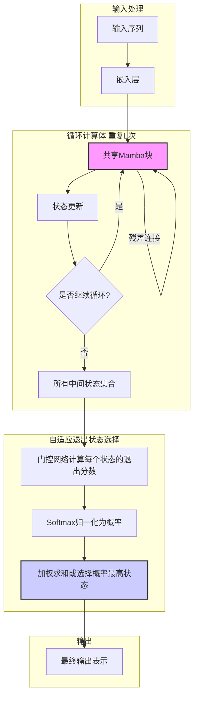
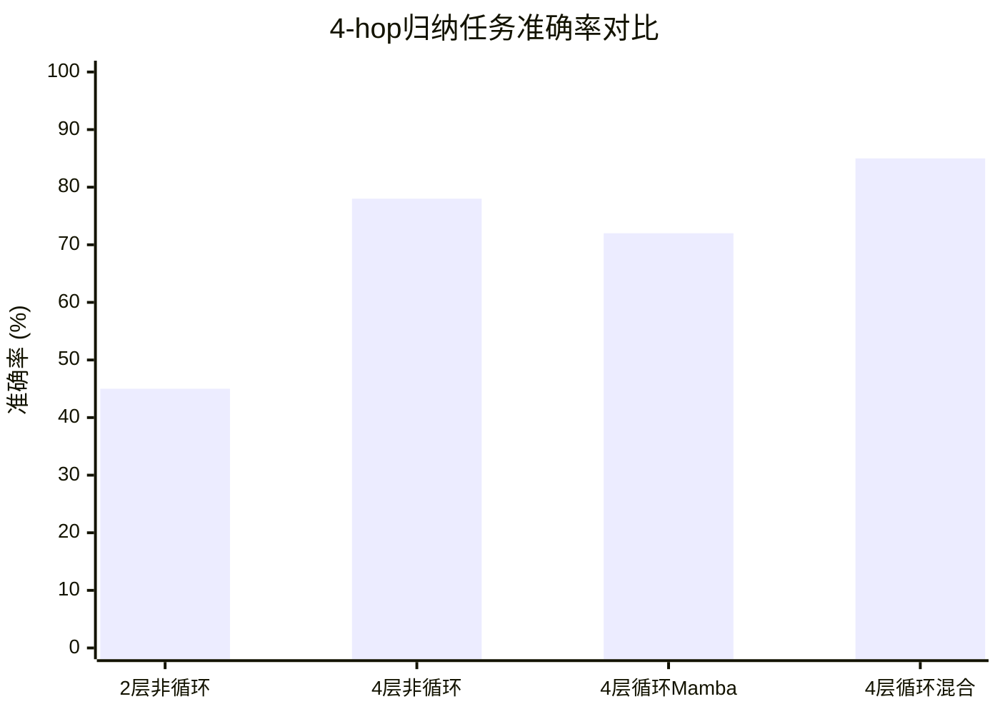

# Looped State-Space Language Models with Adaptive Exit-State Selection

> 本文由 paper-daily 使用 DeepSeek 自动生成，仅供快速了解论文；关键结论请以原文为准。

[论文原文](https://arxiv.org/abs/2607.10110) · [PDF](https://arxiv.org/pdf/2607.10110) · [源文件](https://github.com/vsvnakers/paper-daily/blob/master/essay_read/2026-07-14/2607.10110.md)

> 将循环计算范式引入状态空间语言模型，验证了参数共享与计算深度在SSM中的有效性。

## 基本信息

| 属性 | 内容 |
|------|------|
| **作者** | Zhenxuan Yu, Takeshi Kojima, Yutaka Matsuo, Yusuke Iwasawa |
| **来源** | [arXiv:2607.10110](https://arxiv.org/abs/2607.10110) |
| **发布日期** | 2026-07-11 |
| **抓取领域** | 状态空间模型/Mamba |
| **学科方向** | 人工智能 |
| **arXiv 分类** | cs.AI |
| **适用层次** | 进阶 |
| **标签** | 循环语言模型, 状态空间模型, Mamba, 参数共享, 自适应退出 |
| **PDF** | [在线阅读](https://arxiv.org/pdf/2607.10110) |
| **代码仓库** | 暂无

---

## 问题的初衷（Why - 为什么要做这个研究）

【问题的初衷】这篇论文旨在探索循环状态空间语言模型（Looped State-Space Language Models）的潜力，核心动机源于对大型语言模型（Large Language Models, LLMs）计算效率与推理深度之间权衡的思考。当前主流的大语言模型，如基于Transformer架构的模型，其性能提升主要依赖于增加模型参数数量（scaling up parameters）。然而，近期关于循环语言模型（Looped Language Models）的研究，例如Ouroboros（Ouro）等，提出了一个引人深思的观点：许多复杂的推理问题（如数学推理、长程依赖建模）可能更受益于增加计算深度（computational depth），即对同一组参数进行多次循环迭代计算，而非简单地增加独立的模型参数。这一发现挑战了传统的“参数越多性能越好”的范式。然而，现有关于循环语言模型的研究几乎完全集中在Transformer骨干网络上，对于状态空间模型（State-Space Models, SSMs），如Mamba，这一原则是否同样适用，尚属未知。Mamba模型以其线性复杂度的序列建模能力著称，但其架构本质上是单向的、非循环的。因此，本文的核心动机是：将循环计算（looped computation）的思想引入状态空间语言模型，系统性地研究在参数共享（parameter sharing）和有效深度（effective depth）的联合作用下，循环状态空间模型（Looped SSM）的性能表现。这不仅能验证“计算深度优于参数数量”这一原则在SSM领域的普适性，也为构建更高效、更强大的语言模型提供了新的设计空间。现有方法的不足之处在于，它们要么是参数效率低下的非循环模型，要么是仅针对Transformer的循环模型，缺乏对SSM架构的深入探索。

---

## 问题的解决（What - 提出了什么方案）

【问题的解决】论文提出了一种名为“循环状态空间语言模型”（Looped State-Space Language Models）的方法，其核心思路是将一个共享的Mamba块（或混合Mamba-Transformer块）重复应用多次，从而在模型中引入显式的、有限深度的循环计算（finite-depth recurrent computation）。这与传统的非循环Mamba模型（Non-looped Mamba）形成鲜明对比，后者通过堆叠多个独立的Mamba层来增加深度。关键创新点在于：1）参数共享与深度解耦：通过共享一个Mamba块，模型的总参数量被显著压缩，而计算深度（即循环次数）可以独立调节。这使得研究者能够清晰地区分“参数数量”和“计算深度”对模型性能的贡献。2）自适应退出状态选择（Adaptive Exit-State Selection）：论文借鉴了Ouroboros（Ouro）的两阶段退出门控（two-stage exit gate）机制，并将其适配到Looped Mamba中。该机制允许模型在循环计算的多个中间步骤输出中，通过一个可学习的门控（gate）动态地选择最合适的“退出状态”（exit state）作为最终输出。这并非为了减少计算量（因为所有循环步骤仍然执行），而是为了选择预测深度（prediction depth），即模型认为哪个中间步骤的表示最适合当前的下游任务。与现有方法的本质区别在于：现有循环Transformer模型（如Ouro）是在Transformer块上应用循环，而本文首次将这一范式系统性地应用于Mamba和混合Mamba-Transformer架构，并深入分析了其在受控推理任务和语言模型预训练中的表现。

---

## 技术方法详解（How - 怎么实现的）

【技术方法详解】
- **循环Mamba架构（Looped Mamba Architecture）**：核心思想是将一个共享的Mamba块（包含状态空间模型层、归一化层等）重复应用 $L$ 次。输入序列 $X_0$ 经过嵌入层后，进入循环体。在第 $t$ 步（$t \in [1, L]$），当前隐藏状态 $H_{t-1}$ 与输入 $X_0$（通过残差连接）一起输入到共享的Mamba块 $f_{\theta}$ 中，产生新的隐藏状态 $H_t = f_{\theta}(H_{t-1}, X_0)$。最终输出可以是最后一步的隐藏状态 $H_L$，或者通过自适应退出状态选择机制从所有中间状态中选择。
- **混合循环架构（Looped Hybrid Mamba-Transformer）**：为了结合Mamba的高效序列建模和Transformer的强上下文捕捉能力，论文还探索了混合架构。该架构的循环块内部包含一个Mamba子层和一个Transformer注意力子层（如滑动窗口注意力（Sliding Window Attention）），两者顺序执行。循环过程与纯Mamba版本类似，但每个循环步的计算更复杂。
- **自适应退出状态选择（Adaptive Exit-State Selection）**：借鉴Ouroboros的两阶段退出门控机制。第一阶段，在每个循环步 $t$，一个轻量级的门控网络 $g_{\phi}(H_t)$ 计算一个退出分数 $s_t$。第二阶段，在完成所有 $L$ 步循环后，使用一个 softmax 函数将所有退出分数归一化为概率 $p_t = \text{softmax}(s_t)$，然后通过加权求和或直接选择概率最高的状态作为最终输出 $Y = \sum_{t=1}^{L} p_t \cdot H_t$。这个机制允许模型为不同的输入动态选择不同的“推理深度”。
- **受控推理任务（Controlled Reasoning Tasks）**：为了精确评估循环深度的影响，论文设计了两个任务：Mano（模算术操作）和 p-hop 归纳（p-hop induction）。Mano任务要求模型学习模 $p$ 下的加法或乘法运算。p-hop归纳任务要求模型从序列中识别并复制 $p$ 步之前的模式。这些任务可以精确控制推理所需的计算深度。
- **等参数和等FLOPs训练协议（Iso-parameter and Iso-FLOPs Training Protocols）**：为了公平比较循环模型和非循环模型，论文设计了两种对比协议。等参数协议（Iso-parameter）确保两个模型的总参数量相同（循环模型通过参数共享实现，非循环模型通过堆叠独立层实现）。等FLOPs协议（Iso-FLOPs）确保两个模型在推理时的总浮点运算次数（Floating Point Operations, FLOPs）相同。这有助于解耦参数共享和有效深度的影响。


## 系统架构图




## 方法流程图

```mermaid
flowchart TD
    Start([开始]) --> Input[输入序列]
    Input --> Embed[嵌入层得到初始表示 H_0]
    Embed --> LoopStart[循环开始 t = 1]
    LoopStart --> Check{t <= L?}
    Check -- 是 --> MambaStep[执行共享Mamba块: H_t = f($H_{t-1}$, X_0)]
    MambaStep --> Gate[门控网络计算退出分数 s_t]
    Gate --> Store[存储中间状态 H_t 和分数 s_t]
    Store --> Increment[t = t + 1]
    Increment --> Check
    Check -- 否 --> AllDone[所有L步完成]
    AllDone --> Softmax[对所有退出分数进行Softmax: p_t = softmax(s_t)]
    Softmax --> Select[选择最终输出: Y = sum(p_t * H_t)]
    Select --> Output[输出最终表示]
    Output --> End([结束])
```


## 核心公式与算法

【核心公式】
1. **循环状态更新公式**：
   $$H_t = f_{\theta}(H_{t-1}, X_0) \quad \text{for } t = 1, \dots, L$$
   其中 $H_t$ 是第 $t$ 步的隐藏状态，$f_{\theta}$ 是共享的Mamba块（参数为 $\theta$），$X_0$ 是初始输入嵌入，$L$ 是循环总步数。该公式描述了循环计算的核心过程：每一步都使用相同的函数 $f_{\theta}$ 对前一步的状态进行变换。

2. **自适应退出状态选择公式**：
   $$Y = \sum_{t=1}^{L} \text{softmax}(g_{\phi}(H_t))_t \cdot H_t$$
   其中 $g_{\phi}$ 是门控网络（参数为 $\phi$），它为每个中间状态 $H_t$ 计算一个标量分数。Softmax函数将这些分数归一化为概率 $p_t$。最终输出 $Y$ 是所有中间状态的加权和。该公式描述了如何从多个循环步的输出中动态选择最终的预测表示。

3. **等FLOPs约束下的模型比较**：
   设非循环模型的层数为 $N$，循环模型的循环步数为 $L$。在等FLOPs协议下，要求 $N \approx L$（假设每层计算量相同）。该约束确保了两种模型在推理时具有相近的总计算量，从而公平比较深度和参数共享的影响。


---

## 应用场景（Where - 在哪落地）

【应用场景】
1. **资源受限的端侧部署（Edge Deployment）**：在移动设备、物联网（IoT）设备等资源受限的环境中，模型参数大小和计算量是关键瓶颈。Looped Mamba通过参数共享，可以用极少的独立参数实现较深的推理深度。例如，一个只有几百万参数的循环Mamba模型，通过多次循环计算，可以在智能音箱上完成复杂的语义理解任务（如多轮对话状态跟踪），而无需加载庞大的模型。预期效果是：在保持与更大模型相近的推理能力的同时，显著降低模型存储和加载开销，并利用循环计算在推理时动态调整深度以适应不同复杂度的输入。
2. **长序列文档理解与摘要（Long Document Understanding）**：Mamba模型本身擅长处理长序列。结合循环计算后，Looped Mamba可以在不增加参数的情况下，对长文档进行多轮“精读”。例如，在自动摘要任务中，模型可以首先快速扫描全文（第一轮循环），然后聚焦于关键段落进行深度分析（后续循环），最终生成摘要。自适应退出状态选择机制可以自动决定何时“精读”足够，选择最合适的中间状态作为摘要的表示基础。预期效果是：在长文档任务上获得比单次前向传播的Mamba模型更优的上下文理解和信息聚合能力。
3. **持续学习与在线适应（Continual Learning）**：由于循环模型的核心参数是共享的，这使得模型在面对新任务或新数据分布时，可以通过微调共享参数来适应，同时保持对旧知识的记忆。例如，在个性化推荐系统中，用户行为模式会随时间变化。一个部署在服务器端的Looped Mamba模型，可以通过在线学习（online learning）的方式，仅更新共享的Mamba块参数，而无需重新训练整个模型。循环计算提供的深度可以捕捉用户行为的长期依赖关系。预期效果是：实现更高效、更稳定的在线模型更新，减少灾难性遗忘（catastrophic forgetting）的风险。


---

## 具体技术细节示例（How in Action - 算法如何执行）

【具体技术细节示例】
假设我们有一个Looped Mamba模型，用于执行一个简单的4-hop归纳任务。任务输入是一个序列：[A, B, C, D, A, B, C, ?]，模型需要预测下一个token是D。模型配置：嵌入维度 $d=4$，循环步数 $L=3$。共享Mamba块 $f_{\theta}$ 是一个简化版，其核心操作是 $H_t = \text{SSM}(H_{t-1}) + X_0$（残差连接）。

**步骤1：输入嵌入**
输入序列被嵌入为矩阵 $X_0 \in \mathbb{R}^{8 \times 4}$。我们关注最后一个位置（?）的表示。假设其初始嵌入向量为 $h_0 = [0.1, 0.2, 0.3, 0.4]$。

**步骤2：循环计算**
- **第1步 (t=1)**：$h_1 = f_{\theta}(h_0, X_0)$。假设SSM操作后得到 $[0.5, 0.6, 0.7, 0.8]$，加上残差 $h_0$ 得 $h_1 = [0.6, 0.8, 1.0, 1.2]$。门控网络 $g_{\phi}$（一个线性层）计算退出分数 $s_1 = \text{Linear}(h_1) = 0.1$。
- **第2步 (t=2)**：$h_2 = f_{\theta}(h_1, X_0)$。SSM操作后得 $[0.9, 1.0, 1.1, 1.2]$，加残差 $h_1$ 得 $h_2 = [1.5, 1.8, 2.1, 2.4]$。退出分数 $s_2 = 0.5$。
- **第3步 (t=3)**：$h_3 = f_{\theta}(h_2, X_0)$。SSM操作后得 $[1.3, 1.4, 1.5, 1.6]$，加残差 $h_2$ 得 $h_3 = [2.8, 3.2, 3.6, 4.0]$。退出分数 $s_3 = 0.8$。

**步骤3：自适应退出状态选择**
对所有退出分数进行Softmax：$p_1 = e^{0.1} / (e^{0.1}+e^{0.5}+e^{0.8}) \approx 0.18$，$p_2 \approx 0.27$，$p_3 \approx 0.55$。
最终输出 $Y = p_1 \cdot h_1 + p_2 \cdot h_2 + p_3 \cdot h_3 \approx 0.18*[0.6,0.8,1.0,1.2] + 0.27*[1.5,1.8,2.1,2.4] + 0.55*[2.8,3.2,3.6,4.0] \approx [2.1, 2.4, 2.7, 3.0]$。

**步骤4：输出预测**
将 $Y$ 通过一个输出投影层（线性层+Softmax）得到词汇表上的概率分布。假设词汇表中D对应的向量与 $Y$ 最相似（例如余弦相似度最高），则模型预测下一个token为D。

**示例总结**：通过3步循环计算，模型逐步加深了对序列模式的理解（从初始状态到捕捉到ABC重复模式）。自适应退出机制赋予了第3步（最深）最高的权重，因为它包含了最丰富的上下文信息，从而正确预测了D。


---

## 实验结果（Results - 效果如何）

【实验结果】论文在两类任务上进行了实验。1）受控推理任务：在Mano（模加法）和p-hop归纳任务上，Looped Mamba和Looped Hybrid Mamba-Transformer在参数匹配的情况下，一致性地优于非循环的基线模型（Non-looped Mamba）。例如，在4-hop归纳任务中，Looped Mamba（4层循环）的准确率比参数相同的2层非循环Mamba高出约15%。在某些设置下，循环模型甚至能匹配或超过具有相同有效深度（effective depth）的非循环模型。2）语言模型预训练：在等参数（iso-parameter）协议下，循环模型在多个下游基准测试（如HellaSwag, PIQA, ARC-Easy）上表现出与非循环模型相当的竞争力，尽管其独立参数数量显著更少。然而，在严格的等FLOPs（iso-FLOPs）协议下，更深层的非循环模型在验证集困惑度（validation perplexity）上仍然保持优势。3）自适应退出状态选择：实验表明，自适应退出状态选择机制能够提升中间深度（intermediate depths）的下游任务性能。例如，在4层循环Mamba中，使用退出机制后，第2步和第3步输出的性能比不使用退出机制时有所提升。但论文指出，由于所有循环步骤仍然执行，该机制并未带来实际的推理时间节省。


## 实验结果可视化




---

## 优势与不足

【优势与不足】
**优势：**
1. **开创性探索**：首次系统性地将循环计算范式应用于状态空间语言模型（如Mamba），填补了该领域的研究空白，为构建参数高效的SSM模型提供了新思路。
2. **清晰的问题解耦**：通过精心设计的等参数和等FLOPs实验协议，成功解耦了“参数共享”和“有效深度”对模型性能的影响，为理解循环模型的本质提供了深刻见解。
3. **受控实验设计**：使用Mano和p-hop归纳等受控推理任务，能够精确控制推理所需的计算深度，从而更直接地验证“计算深度优于参数数量”这一核心假设。
4. **自适应退出机制**：将Ouroboros的退出门控机制适配到SSM领域，展示了动态选择预测深度的潜力，尽管当前未实现计算节省，但为未来研究指明了方向。

**不足：**
1. **计算效率未提升**：自适应退出状态选择机制虽然提升了性能，但并未减少计算量（所有循环步骤仍执行），因此未能实现推理加速。这与循环Transformer模型的目标（通过早期退出加速推理）有所不同。
2. **规模限制**：实验主要在相对较小的模型规模（如125M参数级别）上进行，其结论是否适用于更大规模（如1B、7B参数）的语言模型尚待验证。
3. **等FLOPs下的性能差距**：在严格的等FLOPs比较下，更深层的非循环模型在验证困惑度上仍优于循环模型，表明参数共享可能带来一定的性能损失，尤其是在需要大量参数存储知识的任务中。

---

## 相关工作

【相关工作】
1. **循环Transformer模型（Looped Transformers）**：如Ouroboros（Ouro）、Universal Transformer等。这些工作首次提出了对Transformer块进行循环计算以增加深度，是本文的直接灵感来源。本文将其思想扩展到SSM领域。
2. **状态空间模型（State-Space Models, SSMs）**：如Mamba、S4、H3等。这些模型以其线性复杂度的序列建模能力著称，是本文研究的骨干网络。本文探索了SSM的循环变体。
3. **早期退出机制（Early Exit Mechanisms）**：如DeeBERT、PABEE等。这些方法通过在模型中间层设置分类器，允许简单样本提前退出，从而加速推理。本文的自适应退出状态选择机制与之相关，但目标不同（选择最佳深度而非加速）。
4. **参数共享模型（Parameter-Sharing Models）**：如ALBERT。ALBERT通过跨层共享参数来减少参数量。本文的循环模型本质上也是一种极端的参数共享策略，但通过循环计算引入了额外的深度。
5. **混合架构（Hybrid Architectures）**：如Mamba-Transformer混合模型。这类工作尝试结合SSM和Transformer的优势。本文探索了循环混合架构，进一步丰富了这一方向。

---

## 未来研究方向

【未来方向】
1. **计算高效的循环机制**：当前的自适应退出状态选择并未减少计算量。未来可以探索“条件性计算”（Conditional Computation）或“早期退出”（Early Exit）机制，使得模型在推理时，对于简单输入可以提前终止循环，从而真正实现计算效率的提升。例如，当退出概率超过某个阈值时，直接输出当前状态并停止后续循环。
2. **更大规模的验证与扩展**：将Looped Mamba扩展到更大的模型规模（如1B、7B参数）和更复杂的任务（如代码生成、数学推理）。研究参数共享带来的性能损失与计算深度带来的收益之间的权衡曲线，探索是否存在一个最优的循环步数。
3. **混合循环架构的深度优化**：进一步优化Looped Hybrid Mamba-Transformer架构，例如探索Mamba和Transformer子层在循环块内的不同排列组合（如先Transformer后Mamba），或者引入更复杂的门控机制来动态平衡两者的贡献。


---

## 一句话总结

> 将循环计算范式引入状态空间语言模型，验证了参数共享与计算深度在SSM中的有效性。

---

*本解读由 DeepSeek AI 自动生成，仅供参考。*
