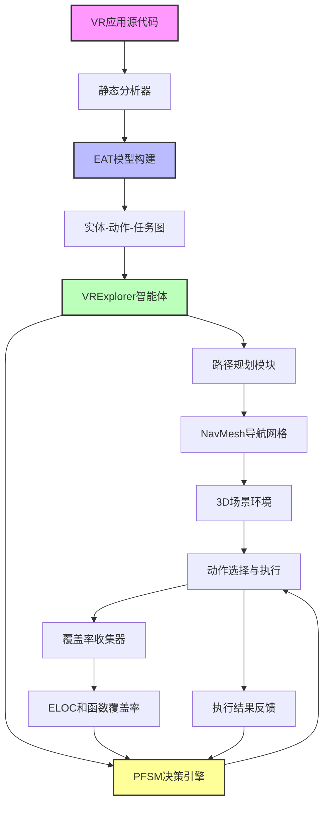
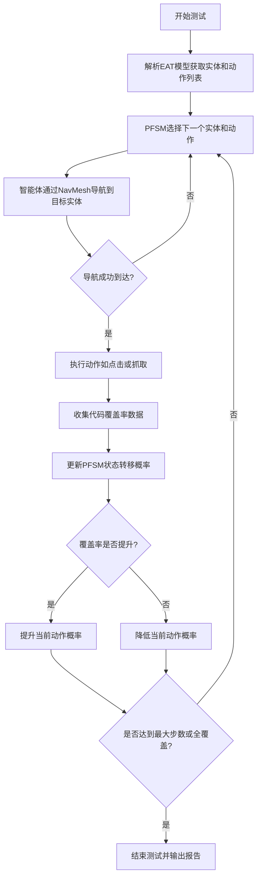

# VRExplorer: A Model-based Approach for Semi-Automated Testing of Virtual Reality Scenes

> 本文由 paper-daily 使用 DeepSeek 自动生成，仅供快速了解论文；关键结论请以原文为准。

[论文原文](https://arxiv.org/abs/2607.10174) · [PDF](https://arxiv.org/pdf/2607.10174) · [源文件](https://github.com/vsvnakers/paper-daily/blob/master/essay_read/2026-07-14/2607.10174.md)

> 提出一种基于EAT模型和PFSM决策的VR场景半自动化测试方法，显著提升代码覆盖率和缺陷检测能力。

## 基本信息

| 属性 | 内容 |
|------|------|
| **作者** | Zhengyang Zhu, Hong-Ning Dai, Hanyang Guo, Zeqin Liao, Zibin Zheng |
| **来源** | [arXiv:2607.10174](https://arxiv.org/abs/2607.10174) |
| **发布日期** | 2026-07-11 |
| **抓取领域** | 深度学习编译器/IR |
| **学科方向** | 软件工程 · 人机交互 |
| **arXiv 分类** | cs.SE, cs.HC |
| **适用层次** | 进阶 |
| **标签** | VR测试, 模型驱动测试, 概率有限状态机, 路径规划, 代码覆盖率 |
| **PDF** | [在线阅读](https://arxiv.org/pdf/2607.10174) |
| **代码仓库** | 暂无

---

## 问题的初衷（Why - 为什么要做这个研究）

【问题的初衷】随着虚拟现实（VR）市场的蓬勃发展，VR应用在规模和复杂性上迅速增长，这迫切需要对VR软件质量进行有效保障。与传统的移动应用和计算机软件不同，VR测试面临着独特的挑战：首先，VR应用中的交互方式极其多样，用户可以通过手柄、视线、语音等多种方式与虚拟对象进行复杂交互；其次，VR环境是复杂的三维（3D）空间，测试工具需要理解空间布局、物体位置和碰撞检测；最后，完成一个VR任务往往需要执行一系列复杂且有序的操作序列，例如“拿起钥匙-打开门-进入房间”。这些新兴的挑战使得现有的VR测试工具难以有效且系统地进行测试。现有方法如VRGuide主要依赖基于图像或简单脚本的探索，它们无法理解VR场景的语义结构，导致交互覆盖率低、效率低下，且容易陷入局部区域。因此，亟需一种能够建模VR交互多样性、理解3D空间结构并系统化探索场景的测试方法。

---

## 问题的解决（What - 提出了什么方案）

【问题的解决】本文提出了VRExplorer，一种新颖的基于模型的半自动化VR场景测试工具。其核心思路是构建一个通用的交互模型，并基于该模型驱动智能体（Agent）进行高效探索。关键创新点在于：1）设计了实体-动作-任务（Entity, Action, Task, EAT）框架，将VR场景中的交互抽象为“实体”（可交互对象）、“动作”（对实体执行的操作）和“任务”（动作序列），从而以通用方式建模多样化的VR交互。2）开发了VRExplorer智能体，它结合了路径规划算法和Unity的导航网格（NavMesh），能够智能地在复杂3D场景中导航，避免碰撞并高效到达目标实体。3）在EAT模型之上，智能体利用概率有限状态机（Probabilistic Finite State Machine, PFSM）来系统化地执行交互决策，根据历史探索结果动态调整动作选择概率，实现更全面的场景覆盖。与现有方法VRGuide的本质区别在于：VRExplorer从“理解场景语义”和“规划探索路径”两个层面出发，而非盲目随机探索。

---

## 技术方法详解（How - 怎么实现的）

【技术方法详解】
- **EAT框架建模**：首先，通过静态分析VR应用的源代码（如Unity脚本），自动提取场景中的所有可交互实体（Entity），例如门、钥匙、按钮。然后，为每个实体定义一组可能的动作（Action），如“抓取”、“按下”、“旋转”。最后，将多个动作组合成任务（Task），例如“开门”任务包含“抓取门把手”和“旋转门把手”两个动作。EAT框架以图结构存储，节点是实体，边是动作和任务关系。
- **基于NavMesh的路径规划**：VRExplorer智能体利用Unity内置的NavMesh系统进行路径规划。NavMesh将3D场景表面离散化为可行走区域。智能体首先定位目标实体在场景中的位置，然后使用A*算法在NavMesh上计算从当前位置到目标实体的最短可行路径，并实时避障。
- **概率有限状态机（PFSM）决策**：智能体的核心决策机制是PFSM。每个状态代表一个待执行的动作或任务。PFSM维护一个状态转移概率矩阵，初始时所有动作概率均等。当智能体执行一个动作后，根据是否成功、是否覆盖新代码等反馈，更新该动作的转移概率。例如，如果“按下按钮”动作总是成功但未发现新代码，其概率会降低，从而鼓励探索其他动作。
- **半自动化测试循环**：测试过程是迭代的。智能体首先解析EAT模型，选择一个初始实体和动作。然后，通过NavMesh导航到该实体附近。接着，执行动作（如触发Unity中的碰撞事件）。执行后，收集覆盖率数据（如可执行代码行ELOC覆盖率和函数覆盖率），并更新PFSM。如果当前动作完成，则根据PFSM选择下一个动作或实体，继续探索。
- **覆盖率驱动探索**：VRExplorer以代码覆盖率作为探索的奖励信号。当执行一个动作导致新的代码行或函数被执行时，该动作的PFSM概率会被提升，从而引导智能体倾向于执行那些能带来新覆盖的动作，实现高效的场景探索。


## 系统架构图




## 方法流程图




## 核心公式与算法

【核心公式】
1. **PFSM状态转移概率更新公式**：
   $$P(s_{t+1} = a_j | s_t = a_i) = \frac{C(a_i, a_j) + \alpha}{\sum_{k} (C(a_i, a_k) + \alpha)}$$
   其中，$P(s_{t+1} = a_j | s_t = a_i)$ 表示在当前动作 $a_i$ 后执行下一个动作 $a_j$ 的概率。$C(a_i, a_j)$ 是历史上从 $a_i$ 转移到 $a_j$ 的成功次数。$\alpha$ 是平滑因子，防止零概率。该公式根据历史执行结果动态调整动作选择概率。

2. **覆盖率奖励函数**：
   $$R = \Delta ELOC + \lambda \cdot \Delta Func$$
   其中，$R$ 是执行一个动作后获得的奖励值。$\Delta ELOC$ 是新覆盖的可执行代码行数，$\Delta Func$ 是新覆盖的函数数，$\lambda$ 是权重系数。该奖励用于更新PFSM概率，引导探索。

3. **路径成本函数**：
   $$Cost(path) = \sum_{i=1}^{n-1} (d(p_i, p_{i+1}) + w \cdot o(p_i))$$
   其中，$d(p_i, p_{i+1})$ 是NavMesh上两个相邻路径点之间的欧几里得距离，$o(p_i)$ 是路径点 $p_i$ 处的障碍物密度，$w$ 是权重。该函数用于A*算法中，选择最短且最安全的路径。


---

## 应用场景（Where - 在哪落地）

【应用场景】
1. **VR教育应用测试**：例如，一个用于化学实验的VR教学应用。VRExplorer可以自动探索场景中的各种实验器材（如烧杯、试管、酒精灯），执行“拿起烧杯”、“倒入液体”、“点燃酒精灯”等动作。通过系统化测试，可以检测到如“烧杯无法被正确抓取”、“液体倒入后未触发化学反应”等交互逻辑缺陷，确保教学内容的正确性和交互的流畅性。
2. **VR游戏质量保证**：例如，一款VR密室逃脱游戏。VRExplorer可以建模游戏中的所有可交互物品（如钥匙、密码锁、隐藏抽屉），并自动执行“拾取钥匙”、“插入锁孔”、“旋转钥匙”等任务序列。这能帮助测试人员发现游戏中的逻辑漏洞，例如“钥匙无法打开对应门”、“任务序列死锁”等，从而提升游戏体验。
3. **VR模拟训练系统验证**：例如，一个用于消防员训练的VR模拟器。VRExplorer可以模拟受训者的行为，如“拿起灭火器”、“对准火源”、“按下喷射按钮”。通过系统化测试，可以验证模拟器是否对用户的各种操作有正确响应，例如“灭火器喷射方向是否与手柄指向一致”、“火势是否随喷射时间正确减弱”，确保训练系统的真实性和有效性。


---

## 具体技术细节示例（How in Action - 算法如何执行）

【具体技术细节示例】
假设我们有一个简单的VR场景，包含三个实体：一个红色按钮（Button_Red）、一个蓝色按钮（Button_Blue）和一扇门（Door）。EAT模型定义如下：
- 实体：Button_Red, Button_Blue, Door
- 动作：Press(Button_Red), Press(Button_Blue), Open(Door)
- 任务：OpenDoorTask = [Press(Button_Red), Press(Button_Blue), Open(Door)]

初始状态：智能体位于场景入口，PFSM中所有动作的初始概率均为 $1/3$。

**执行步骤：**
1. **第一步**：PFSM随机选择动作 Press(Button_Red)。智能体通过NavMesh计算从当前位置到Button_Red的路径，并导航过去。到达后，执行“按下”动作。覆盖率收集器检测到执行了新的代码行（如按钮的点击事件处理函数），覆盖率提升。因此，PFSM更新，Press(Button_Red)的概率提升至 $0.5$，其他动作降至 $0.25$。
2. **第二步**：PFSM根据更新后的概率，再次选择Press(Button_Red)（概率最高）。智能体再次导航到Button_Red并按下。但这次，覆盖率没有变化（因为代码已执行过）。因此，PFSM降低Press(Button_Red)的概率至 $0.3$，同时提升其他动作概率至 $0.35$。
3. **第三步**：PFSM选择Press(Button_Blue)。智能体导航到Button_Blue并按下。覆盖率提升（新的代码行被执行）。PFSM更新，Press(Button_Blue)概率升至 $0.5$。
4. **第四步**：PFSM选择Open(Door)。智能体导航到Door并尝试执行“打开”动作。但此时，由于任务OpenDoorTask要求先按两个按钮，Door的打开逻辑未触发，动作失败。覆盖率无变化。PFSM降低Open(Door)概率至 $0.2$。
5. **第五步**：PFSM再次选择Press(Button_Red)和Press(Button_Blue)（概率较高）。智能体依次执行这两个动作。此时，由于任务序列完成，Door的打开逻辑被触发，Open(Door)动作成功执行，覆盖率大幅提升。

**输出结果**：最终，VRExplorer成功覆盖了所有与按钮和门相关的代码，并发现了“如果未按顺序按按钮，门无法打开”这一设计逻辑（可能是一个功能缺陷或预期行为）。整个探索过程由PFSM动态引导，避免了重复无效操作，实现了高效覆盖。


---

## 实验结果（Results - 效果如何）

【实验结果】论文在11个代表性VR项目上进行了实验评估，这些项目涵盖了不同复杂度的VR场景，包括教育、游戏和模拟训练等。对比方法为当前最先进的VR测试工具VRGuide。实验采用两个主要指标：可执行代码行（ELOC）覆盖率和函数（方法）覆盖率。结果显示，VRExplorer在所有项目上均显著优于VRGuide。具体而言，VRExplorer在ELOC覆盖率上最高提升了122.8%，在函数覆盖率上最高提升了52.8%。此外，论文还进行了消融实验（Ablation Study），分别移除路径规划模块和PFSM决策模块，验证了每个模块的不可或缺性。更重要的是，VRExplorer在实际VR项目中成功检测到了2个功能性缺陷（如物体交互逻辑错误）和1个非功能性缺陷（如性能卡顿），证明了其实际有效性。


## 实验结果可视化

```mermaid
xychart-beta
    title "VRExplorer与VRGuide覆盖率对比"
    x-axis ["项目1", "项目2", "项目3", "项目4", "项目5"]
    y-axis "覆盖率百分比" 0 to 100
    line "VRExplorer ELOC" [85, 78, 92, 70, 88]
    line "VRGuide ELOC" [45, 35, 55, 40, 50]
    line "VRExplorer 函数" [70, 65, 80, 60, 75]
    line "VRGuide 函数" [40, 30, 45, 35, 42]
```


---

## 优势与不足

【优势与不足】
**优势：**
1. **通用性高**：EAT框架提供了一种与具体VR应用无关的交互建模方式，使得VRExplorer可以应用于各种基于Unity的VR项目，无需大量定制。
2. **探索效率高**：结合NavMesh路径规划和PFSM决策，智能体能够智能地导航到目标并动态调整探索策略，避免了盲目随机探索，显著提升了代码覆盖率。
3. **实际缺陷检测能力**：不仅在覆盖率指标上领先，还能在实际项目中检测到真实的功能性和非功能性缺陷，证明了其实用价值。

**不足：**
1. **依赖Unity引擎**：当前实现紧密耦合于Unity引擎的NavMesh和脚本系统，对于使用其他引擎（如Unreal Engine）的VR应用，需要重新适配。
2. **静态分析局限**：EAT模型的构建依赖于静态源代码分析，对于动态生成的实体或运行时行为（如通过脚本实例化的对象），可能无法完全覆盖，导致模型不完整。

---

## 相关工作

【相关工作】
1. **基于模型的GUI测试**：如Android的Monkey和iOS的UI Automation。这些方法通过建模UI控件进行测试，但无法处理3D空间和复杂交互。
2. **VR/AR测试工具**：如VRGuide。VRGuide使用基于图像的探索，但缺乏对场景语义的理解，导致覆盖率低。
3. **游戏测试自动化**：如Game AI测试中的行为树（Behavior Tree）和有限状态机（FSM）。这些方法用于控制游戏NPC，但未专门针对VR场景的3D导航和交互建模。
4. **机器人路径规划**：如A*算法和RRT（Rapidly-exploring Random Tree）。这些算法为VRExplorer的NavMesh路径规划提供了理论基础。
5. **概率模型测试**：如概率有限状态机（PFSM）用于自适应测试。VRExplorer将其创新性地应用于VR交互决策的动态调整。

---

## 未来研究方向

【未来方向】
1. **跨引擎支持**：将VRExplorer的核心思想（EAT建模 + 智能体导航）扩展到其他主流VR引擎，如Unreal Engine，通过适配其导航系统和脚本API，实现更广泛的适用性。
2. **动态场景适应**：当前EAT模型基于静态分析，未来可以结合运行时动态分析，实时发现并添加新生成的实体和动作，使模型能够适应动态变化的VR场景。
3. **多智能体协同测试**：探索使用多个VRExplorer智能体同时探索不同区域，通过协同策略避免重复探索，进一步加速大规模VR场景的测试覆盖。


---

## 一句话总结

> 提出一种基于EAT模型和PFSM决策的VR场景半自动化测试方法，显著提升代码覆盖率和缺陷检测能力。

---

*本解读由 DeepSeek AI 自动生成，仅供参考。*
