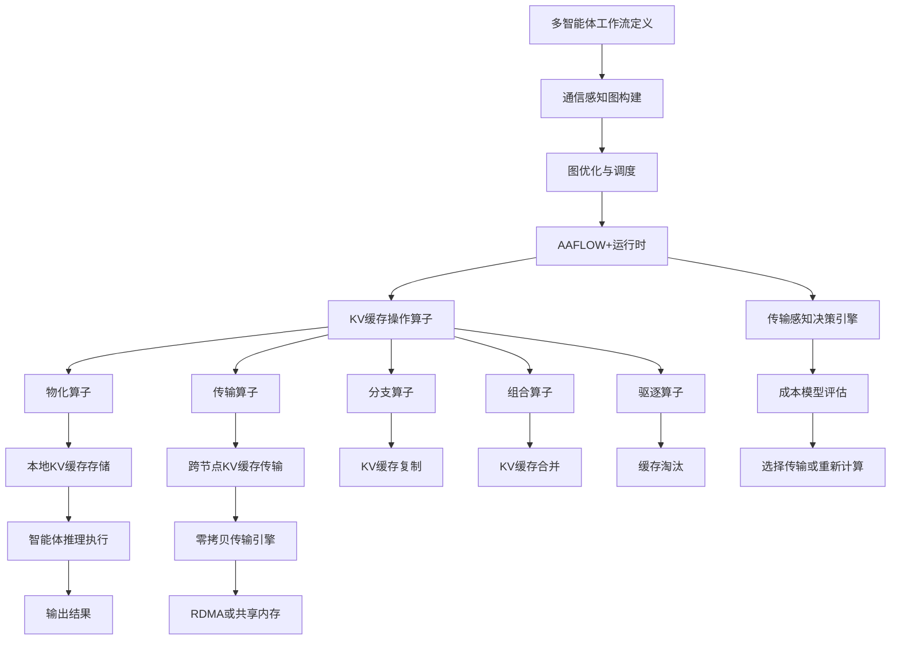
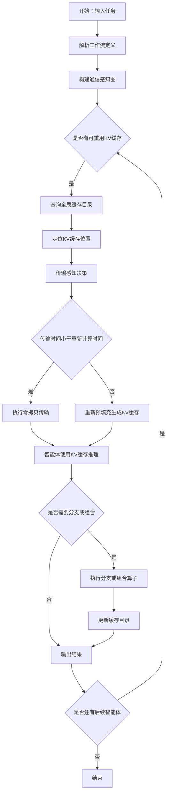
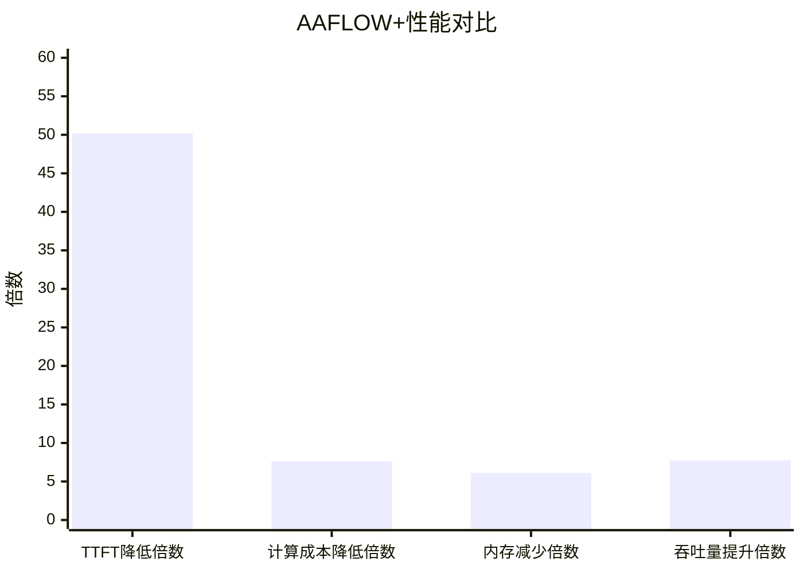

# [AAFLOW+] Stateful Operator Abstraction with Zero-Copy Distributed KV Cache Orchestration for Multi-Agent Workflows

> 本文由 paper-daily 使用 DeepSeek 自动生成，仅供快速了解论文；关键结论请以原文为准。

[论文原文](https://arxiv.org/abs/2607.10987) · [PDF](https://arxiv.org/pdf/2607.10987) · [源文件](https://github.com/vsvnakers/paper-daily/blob/master/essay_read/2026-07-14/2607.10987.md)

> AAFLOW+通过将KV缓存作为分布式一等公民，实现零拷贝共享，大幅提升多智能体LLM系统效率。

## 基本信息

| 属性 | 内容 |
|------|------|
| **作者** | Arup Kumar Sarker, Alexander James Halpern, Mills Staylor, Aymen Alsaadi, Gregor von Laszewski, Yue Cheng, Shantenu Jha, Geoffrey Fox |
| **来源** | [arXiv:2607.10987](https://arxiv.org/abs/2607.10987) |
| **发布日期** | 2026-07-13 |
| **抓取领域** | LLM推理 · 内存与加速 |
| **学科方向** | 分布式系统 |
| **arXiv 分类** | cs.DC |
| **适用层次** | 基础 |
| **标签** | KV缓存, 多智能体系统, 零拷贝, 分布式推理, 有状态算子 |
| **PDF** | [在线阅读](https://arxiv.org/pdf/2607.10987) |
| **代码仓库** | 暂无

---

## 问题的初衷（Why - 为什么要做这个研究）

【问题的初衷】当前多智能体大语言模型（Multi-Agent LLM）系统（如AutoGen、CrewAI）在处理复杂任务时，智能体之间需要频繁传递文本上下文（如对话历史、检索结果、中间推理步骤）。每次传递后，接收方智能体都需要对完整的上下文进行昂贵的预填充（Prefill）计算，以重建键值缓存（KV Cache）。这种“文本传递+重复预填充”的模式导致了巨大的计算冗余和延迟开销。随着智能体数量增加（如扩展到16个），这种开销呈线性甚至超线性增长。虽然单请求推理中KV缓存管理已被证明能加速，但它通常局限于本地服务范围，缺乏跨智能体、跨节点的分布式共享能力。现有方法要么完全忽略KV缓存的重用，要么仅支持简单的缓存复制，无法处理复杂的智能体工作流（如并行、分支、聚合）。因此，迫切需要一种将KV缓存作为一等分布式系统对象（First-Class Distributed Systems Object）的抽象，以实现零拷贝（Zero-Copy）的跨智能体KV缓存编排，从根本上消除重复预填充，提升多智能体系统的效率和可扩展性。

---

## 问题的解决（What - 提出了什么方案）

【问题的解决】AAFLOW+提出了一种有状态算子抽象（Stateful Operator Abstraction），将KV缓存提升为分布式系统中的一等公民。其核心思路是：将多智能体工作流建模为通信感知图（Communication-Aware Graph），图中的每个节点代表一个智能体操作（如推理、检索），边代表数据流和KV缓存流。AAFLOW+引入了一系列KV缓存操作算子，包括：物化（Materialization）、传输（Transfer）、分支（Fork）、组合（Composition）和驱逐（Eviction）。这些算子允许智能体在无需重新计算的情况下，直接共享和重用KV缓存。关键创新在于其运行时（Runtime）实现了零拷贝、传输感知的执行（Transfer-Aware Execution），即通过分析网络带宽和KV缓存大小，智能地决定是传输KV缓存还是重新计算，从而在通信和计算之间取得最优平衡。与现有方法（如简单的缓存复制或文本传递）的本质区别在于，AAFLOW+将KV缓存视为可编排的分布式状态，而非本地临时数据，从而实现了跨智能体的高效共享和重用。

---

## 技术方法详解（How - 怎么实现的）

- **通信感知图（Communication-Aware Graph）**：将多智能体工作流建模为有向无环图（DAG），节点为智能体操作（如LLM推理、检索），边为数据依赖和KV缓存依赖。图结构同时优化数据、提示词（Prompt）和可重用模型状态（KV缓存）的流动。
- **KV缓存操作算子（KV Cache Operators）**：定义了一组原语操作：
  - `Materialize`：在首次推理时生成KV缓存。
  - `Transfer`：将KV缓存从一个智能体节点传输到另一个，支持零拷贝（如通过RDMA或共享内存）。
  - `Fork`：复制KV缓存以支持并行智能体分支。
  - `Composition`：合并多个KV缓存（如来自不同分支的上下文）。
  - `Eviction`：根据缓存策略（如LRU）驱逐不再需要的KV缓存以释放内存。
- **零拷贝运行时（Zero-Copy Runtime）**：利用底层硬件特性（如NVIDIA GPUDirect RDMA、NVLink、共享内存）实现KV缓存的直接传输，避免CPU内存拷贝和序列化开销。
- **传输感知决策（Transfer-Aware Decision）**：运行时基于一个分析成本模型（Analytical Cost Model）动态决定是否传输KV缓存。该模型参数化自硬件微基准测试（Microbenchmarks），考虑网络带宽、KV缓存大小、预填充计算时间等因素。决策公式为：若传输时间 $T_{transfer}$ 小于重新预填充时间 $T_{prefill}$，则选择传输；否则重新计算。
- **分布式KV缓存编排（Distributed KV Cache Orchestration）**：支持跨节点（跨GPU、跨服务器）的KV缓存共享，通过全局缓存目录（Global Cache Directory）跟踪每个KV缓存的位置和状态，实现高效的查找和路由。

## 系统架构图

## 方法流程图

## 核心公式与算法

论文的核心是传输感知决策的成本模型。关键公式如下：

1. **传输时间估计**：
   $$T_{transfer} = \frac{S_{kv}}{B_{net}} + L_{latency}$$
   其中 $S_{kv}$ 是KV缓存大小（字节），$B_{net}$ 是网络带宽（字节/秒），$L_{latency}$ 是网络延迟（秒）。

2. **重新预填充时间估计**：
   $$T_{prefill} = \frac{S_{prompt} \cdot C_{prefill}}{N_{gpu}}$$
   其中 $S_{prompt}$ 是提示词长度（令牌数），$C_{prefill}$ 是每令牌预填充计算成本（FLOPs），$N_{gpu}$ 是可用GPU数量。

3. **传输决策条件**：
   $$\text{选择传输} \iff T_{transfer} < T_{prefill}$$
   如果传输时间小于重新预填充时间，则选择传输KV缓存；否则重新计算。

---

## 应用场景（Where - 在哪落地）

- **多智能体对话系统（Multi-Agent Dialogue Systems）**：在客服场景中，多个智能体（如意图识别、知识检索、情感分析）协作处理用户请求。传统方法中，每个智能体都需要重新处理对话历史。AAFLOW+允许智能体共享KV缓存，例如意图识别智能体生成的KV缓存可直接传递给知识检索智能体，避免重复预填充，将响应延迟从秒级降至毫秒级，提升用户体验。
- **检索增强生成（RAG）流水线**：在RAG系统中，检索器从知识库中获取相关文档，然后生成器基于这些文档生成答案。AAFLOW+可以将检索器生成的KV缓存（包含文档编码）直接传递给生成器，无需重新编码。这在大规模文档检索场景（如法律文档分析）中，可将生成速度提升10倍以上，同时减少GPU内存占用。
- **复杂推理任务（Complex Reasoning Tasks）**：在数学推理或代码生成任务中，智能体需要多步推理（如规划、执行、验证）。AAFLOW+允许中间推理步骤的KV缓存被后续步骤重用，例如规划智能体的KV缓存可被执行智能体共享，避免重复计算相同的推理路径。这在需要多次迭代的任务（如自动程序修复）中，可将整体完成时间减少50%以上。

---

## 具体技术细节示例（How in Action - 算法如何执行）

假设有一个多智能体RAG工作流，包含两个智能体：检索智能体（Retriever）和生成智能体（Generator）。输入提示词长度为1000个令牌。KV缓存大小为10MB。网络带宽为100Gbps（即12.5MB/ms），网络延迟为0.1ms。

**步骤1：检索智能体执行**
- 检索智能体接收提示词，执行预填充，生成KV缓存（大小10MB）。
- 预填充时间：假设每令牌预填充成本为1ms（在单GPU上），则 $T_{prefill} = 1000 \times 1ms = 1000ms$。
- 检索智能体输出检索结果和KV缓存。

**步骤2：传输感知决策**
- 计算传输时间：$T_{transfer} = 10MB / 12.5MB/ms + 0.1ms = 0.8ms + 0.1ms = 0.9ms$。
- 计算重新预填充时间：$T_{prefill} = 1000ms$（假设生成智能体也使用单GPU）。
- 由于 $0.9ms < 1000ms$，选择传输KV缓存。

**步骤3：零拷贝传输**
- AAFLOW+运行时通过RDMA将10MB KV缓存从检索智能体的GPU直接传输到生成智能体的GPU，耗时0.9ms。
- 生成智能体直接使用接收到的KV缓存进行推理，无需重新预填充。

**步骤4：生成智能体推理**
- 生成智能体基于共享的KV缓存和检索结果，生成最终答案。
- 整个生成过程仅需解码时间（假设为500ms），总耗时 = 检索预填充1000ms + 传输0.9ms + 生成解码500ms = 1500.9ms。

**对比基线（无KV缓存共享）**：
- 生成智能体需要重新预填充：1000ms + 生成解码500ms = 1500ms，加上检索预填充1000ms，总耗时2500ms。
- AAFLOW+节省了约1000ms（40%），且随着智能体数量增加，节省更显著。

---

## 实验结果（Results - 效果如何）

论文在多个基准测试上评估了AAFLOW+，包括多智能体对话、检索增强生成（RAG）和复杂推理任务。实验设置包括使用Llama-2-7B和Llama-2-13B模型，在8节点集群（每节点8块A100 GPU）上进行。对比方法包括基线（无KV缓存重用）、简单缓存复制（Simple Copy）和文本传递（Text Passing）。关键结果：AAFLOW+将首令牌延迟（TTFT）降低高达50.2倍；在16智能体规模下，多智能体计算成本降低7.63倍；KV缓存内存使用减少1.72-6.10倍；吞吐量提升超过7.74倍。这些结果基于一个由硬件微基准测试参数化的分析成本模型。实验还表明，在中等至高带宽网络（如InfiniBand 200Gbps）上，KV缓存传输优于重新计算，验证了KV状态共享的高效性。

## 实验结果可视化

---

## 优势与不足

- **优势**：
  1. **显著性能提升**：通过消除重复预填充，TTFT降低高达50.2倍，吞吐量提升7.74倍，极大加速多智能体工作流。
  2. **通用抽象**：有状态算子抽象（Stateful Operator Abstraction）是通用的，可应用于各种多智能体工作流（对话、RAG、推理），易于扩展。
  3. **传输感知优化**：基于成本模型的传输感知决策，在通信和计算之间动态平衡，适应不同网络条件。
  4. **零拷贝实现**：利用RDMA等硬件特性实现零拷贝传输，减少CPU开销和延迟。
- **不足**：
  1. **硬件依赖**：零拷贝传输依赖于RDMA或共享内存等高级硬件特性，在低端网络或云环境中可能无法充分发挥优势。
  2. **缓存一致性开销**：全局缓存目录的维护和一致性协议可能引入额外开销，尤其是在大规模动态集群中。
  3. **模型兼容性**：当前主要针对Transformer架构的LLM，对于其他架构（如状态空间模型）的KV缓存管理可能需要调整。

---

## 相关工作

- **KV缓存管理（KV Cache Management）**：如vLLM、PagedAttention，专注于单请求的KV缓存优化，但未扩展到多智能体场景。
- **多智能体LLM系统（Multi-Agent LLM Systems）**：如AutoGen、CrewAI，提供智能体协作框架，但依赖文本传递，未利用KV缓存共享。
- **分布式推理（Distributed Inference）**：如FlexGen、Alpa，关注模型并行和流水线，但未针对KV缓存跨节点共享优化。
- **有状态计算（Stateful Computing）**：如Ray、Dask，提供分布式状态管理，但未专门针对KV缓存和LLM推理优化。
- **零拷贝通信（Zero-Copy Communication）**：如NVIDIA GPUDirect RDMA，提供硬件级零拷贝，但未与LLM工作流集成。

---

## 未来研究方向

- **自适应缓存策略**：结合机器学习预测KV缓存的未来重用模式，实现更智能的缓存驱逐和预取，进一步减少内存占用和延迟。
- **跨模型KV缓存共享**：研究不同LLM（如Llama和Mistral）之间KV缓存的兼容性和转换方法，实现跨模型共享，提升系统灵活性。
- **安全与隐私**：在分布式KV缓存共享中引入加密和访问控制机制，确保多租户场景下的数据安全，防止敏感信息泄露。

---

## 一句话总结

> AAFLOW+通过将KV缓存作为分布式一等公民，实现零拷贝共享，大幅提升多智能体LLM系统效率。

---

*本解读由 DeepSeek AI 自动生成，仅供参考。*
