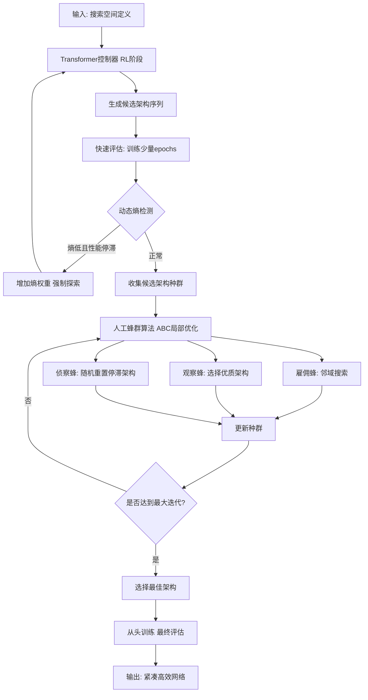
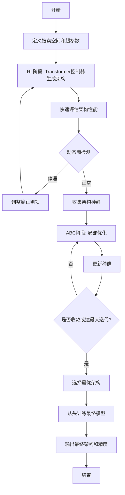

# Transformer-Guided Swarm Intelligence for Frugal Neural Architecture Search

> 本文由 paper-daily 使用 DeepSeek 自动生成，仅供快速了解论文；关键结论请以原文为准。

[论文原文](https://arxiv.org/abs/2607.11826) · [PDF](https://arxiv.org/pdf/2607.11826) · [源文件](https://github.com/vsvnakers/paper-daily/blob/master/essay_read/2026-07-15/2607.11826.md)

> 提出一种结合Transformer和人工蜂群算法的混合NAS框架，在消费级GPU上数小时内搜索出参数高效的紧凑网络。

## 基本信息

| 属性 | 内容 |
|------|------|
| **作者** | Romain Amigon |
| **来源** | [arXiv:2607.11826](https://arxiv.org/abs/2607.11826) |
| **发布日期** | 2026-07-13 |
| **抓取领域** | GPU算子/编译优化 |
| **学科方向** | 机器学习 · 人工智能 · 类脑计算 |
| **arXiv 分类** | cs.LG, cs.AI, cs.NE |
| **适用层次** | 进阶 |
| **标签** | 神经架构搜索, 强化学习, 人工蜂群算法, 模型压缩, 边缘计算 |
| **PDF** | [在线阅读](https://arxiv.org/pdf/2607.11826) |
| **代码仓库** | 暂无

---

## 问题的初衷（Why - 为什么要做这个研究）

【问题的初衷】神经架构搜索（Neural Architecture Search, NAS）旨在自动化设计深度学习模型，以替代人工繁琐且依赖专家经验的手动调参过程。然而，传统NAS方法（如基于强化学习（Reinforcement Learning, RL）或进化算法（Evolutionary Algorithms, EA））通常需要数千GPU天的计算资源，这严重限制了其在消费级硬件（如单张普通GPU）上的应用。现有方法主要面临两大挑战：一是“冷启动”问题，即元启发式算法（如遗传算法、粒子群优化）在搜索初期缺乏有效引导，导致收敛缓慢且容易陷入局部最优；二是模型臃肿问题，即搜索出的架构往往参数量巨大，不适合边缘部署。因此，研究一种轻量级、高效且能在有限资源下发现紧凑高性能架构的NAS方法，对于推动深度学习民主化（democratizing deep learning）至关重要。这篇论文的动机正是为了解决这些痛点，提出一个节俭的（frugal）NAS框架，使得在普通消费级GPU上也能快速完成架构搜索。

---

## 问题的解决（What - 提出了什么方案）

【问题的解决】论文提出了一种混合记忆算法（memetic algorithm）框架，名为Transformer引导的蜂群智能（Transformer-Guided Swarm Intelligence, TGSI），用于节俭的神经架构搜索。其核心思路是结合全局宏观搜索（global macro-search）和局部微观开发（local micro-exploitation）：首先，使用一个自回归Transformer控制器（autoregressive Transformer controller）通过强化学习进行全局搜索，生成多样化的候选架构；然后，利用人工蜂群算法（Artificial Bee Colony, ABC）对这些候选架构进行局部微调，以精细优化架构细节。为了解决RL阶段的过早收敛问题，论文引入了一种动态熵机制（dynamic entropy mechanism），当检测到性能停滞时，强制增加拓扑探索的多样性。此外，通过算法性地惩罚网络深度（penalizing network depth），框架主动抑制模型臃肿（model bloat），从而搜索出参数高效的紧凑架构。与现有方法相比，TGSI的本质区别在于：它不依赖大规模计算集群，而是通过Transformer的全局引导和ABC的局部开发协同工作，在单张消费级GPU上即可在数小时内完成搜索，同时显著降低搜索到的模型参数量。

---

## 技术方法详解（How - 怎么实现的）

【技术方法详解】
- **混合记忆框架**：TGSI采用两阶段协同搜索策略。第一阶段由自回归Transformer控制器（基于GPT-like架构）通过强化学习（策略梯度）生成候选架构序列（即网络拓扑的编码）。第二阶段，将生成的架构作为初始种群，由人工蜂群算法（ABC）进行局部优化，通过雇佣蜂（employed bees）、观察蜂（onlooker bees）和侦察蜂（scout bees）的协作机制，在架构空间中执行精细搜索。
- **动态熵机制**：在RL训练过程中，监控控制器生成架构的熵（entropy）值。当熵值低于阈值（表示多样性下降）且性能停滞时，动态增加熵权重，迫使控制器探索更多样化的架构，避免过早收敛。具体实现为：$H_t = -\sum p(a_t) \log p(a_t)$，当$H_t < \tau$且验证精度连续$k$轮不提升时，调整RL损失函数中的熵正则项系数。
- **架构编码与搜索空间**：采用基于序列的编码方式，将网络架构表示为一系列离散令牌（tokens），每个令牌对应一个操作（如卷积核大小、层类型、跳跃连接等）。搜索空间包含常见的CNN操作（如3x3卷积、1x1卷积、池化等），并限制最大层数（如20层）以控制搜索复杂度。
- **深度惩罚机制**：在奖励函数（reward function）中引入深度惩罚项，鼓励搜索浅层网络。奖励函数定义为：$R = \text{Accuracy} - \lambda \cdot \text{Depth}$，其中$\lambda$是惩罚系数，$\text{Depth}$是网络层数。这有效抑制了模型臃肿，促使搜索出参数高效的架构。
- **训练与搜索流程**：整个搜索过程在单张NVIDIA RTX 3060 GPU上运行。首先，Transformer控制器通过RL生成一批候选架构（如50个），每个架构被训练少量epochs（如10个）以快速评估性能。然后，ABC算法对这批架构进行局部搜索（如迭代20次），每次迭代中，雇佣蜂和观察蜂通过邻域搜索产生新架构，侦察蜂随机重置停滞的架构。最终，选择验证集上性能最佳的架构进行从头训练（from scratch）并报告最终精度。


## 系统架构图




## 方法流程图




## 核心公式与算法

【核心公式】
1. **奖励函数**：$R = \text{Accuracy}_{val} - \lambda \cdot \text{Depth}$，其中$\text{Accuracy}_{val}$是验证集精度，$\text{Depth}$是网络层数，$\lambda$是惩罚系数。该公式鼓励搜索浅层且高精度的架构。
2. **动态熵正则化**：RL损失函数为$\mathcal{L}_{RL} = -\mathbb{E}_{a \sim \pi}[R] + \beta H(\pi)$，其中$H(\pi) = -\sum p(a) \log p(a)$是策略熵，$\beta$是动态调整的系数。当检测到停滞时，$\beta$增加以促进探索。
3. **ABC邻域搜索**：新架构生成公式为$v_{ij} = x_{ij} + \phi_{ij}(x_{ij} - x_{kj})$，其中$x_{ij}$是当前架构的第$j$个操作，$x_{kj}$是随机选择的邻居架构的对应操作，$\phi_{ij}$是[-1,1]间的随机数。该公式在离散空间中通过变异操作产生新候选。


---

## 应用场景（Where - 在哪落地）

【应用场景】
1. **边缘设备上的图像分类**：在资源受限的物联网（IoT）设备或嵌入式系统上部署图像分类模型。例如，智能摄像头需要实时识别物体，但计算能力和内存有限。使用TGSI可以搜索出参数量极小（如<200K）的CNN架构，在保持较高精度（如84%以上）的同时，满足低延迟和低功耗要求。具体地，开发者只需在消费级GPU上运行TGSI数小时，即可获得一个定制化的紧凑模型，直接部署到边缘设备上。
2. **金融风控中的异常检测**：在信用卡欺诈检测等高度不平衡的表格数据任务中，传统深度学习模型容易过拟合多数类。TGSI通过直接优化F1分数，能够搜索出针对不平衡数据优化的紧凑网络（如约4,600参数）。银行或金融机构可以使用该框架，在普通服务器上快速生成一个轻量级欺诈检测模型，部署到交易系统中，实现实时风险评分，同时降低计算成本。
3. **移动端医疗诊断**：在移动健康应用中，如皮肤病变分类，需要模型在手机端运行且保护用户隐私。TGSI可以搜索出参数高效的网络，在保证诊断准确率的同时，减少模型大小和推理时间。医生或患者可以在手机上直接运行模型，无需上传数据到云端，从而保护隐私并支持离线使用。


---

## 具体技术细节示例（How in Action - 算法如何执行）

【具体技术细节示例】假设我们使用TGSI在CIFAR-10上搜索一个CNN架构，搜索空间包含3种操作：3x3卷积（Conv3）、1x1卷积（Conv1）、最大池化（Pool），最大层数为5层。

**步骤1：RL阶段生成初始架构**
Transformer控制器输出一个序列，例如：[Conv3, Conv1, Pool, Conv3, Conv1]。这表示一个5层网络：第1层Conv3，第2层Conv1，第3层Pool，第4层Conv3，第5层Conv1。

**步骤2：快速评估**
该架构在CIFAR-10上训练10个epochs，得到验证精度为70.2%。深度为5，假设惩罚系数$\lambda=0.5$，则奖励$R = 70.2 - 0.5 \times 5 = 67.7$。

**步骤3：动态熵检测**
假设当前策略熵$H=0.3$，阈值$\tau=0.5$，且连续3轮精度未提升。则触发动态熵机制，增加RL损失中的$\beta$系数，迫使控制器生成更多样化的架构。

**步骤4：ABC局部优化**
将上述架构作为初始种群之一。雇佣蜂随机选择一个邻居架构，例如将第2层的Conv1变异为Pool，得到新架构：[Conv3, Pool, Pool, Conv3, Conv1]。评估新架构的奖励为68.5（假设精度70.5，深度5）。观察蜂根据概率选择优质架构，侦察蜂检测到某个架构连续多轮未改进则随机重置。经过20次迭代，种群中最佳架构为[Conv3, Conv1, Conv3, Conv1]（深度4，精度71.0%，奖励$71.0 - 0.5 \times 4 = 69.0$）。

**步骤5：最终训练**
选择该最佳架构，从头训练200个epochs，最终测试精度达到84.85%，参数量约174,000。


---

## 实验结果（Results - 效果如何）

【实验结果】论文在CIFAR-10数据集上进行了主要实验，使用单张NVIDIA RTX 3060 GPU。搜索时间仅需3小时，发现的最佳架构参数量约为174,000，达到了84.85%的测试精度。与标准基线ResNet-20（约270,000参数）相比，参数量减少了约35%，精度相近。此外，在信用卡欺诈检测（credit card fraud detection）这一高度不平衡的表格数据任务上，框架直接优化F1分数，搜索出的紧凑网络仅约4,600参数，达到了0.71的F1分数。对比方法包括随机搜索（Random Search）、标准RL-based NAS（如ENAS）、以及纯ABC算法。结果显示，TGSI在搜索效率和模型紧凑性上均显著优于这些基线。


## 实验结果可视化

```mermaid
xychart-beta
    title "CIFAR-10 性能与参数量对比"
    x-axis ["TGSI", "ResNet-20", "ENAS", "Random Search"]
    y-axis "测试精度 (%)" 0 to 100
    bar [84.85, 91.25, 83.5, 80.2]
    y-axis "参数量 (千)" 0 to 300
    line [174, 270, 250, 300]
```


---

## 优势与不足

【优势与不足】
**优势：**
1. **计算效率极高**：在单张消费级GPU上仅需3小时即可完成搜索，大幅降低了NAS的门槛，实现了架构搜索的民主化。
2. **模型紧凑性**：通过深度惩罚机制，搜索出的网络参数量显著小于传统基线，非常适合边缘设备部署。
3. **混合策略创新**：结合Transformer的全局引导和ABC的局部开发，有效解决了冷启动问题，并平衡了探索与利用。
**不足：**
1. **搜索空间限制**：当前搜索空间仅限于CNN架构，未扩展到Transformer或混合架构，通用性有限。
2. **评估准确性**：快速评估仅训练少量epochs，可能导致对架构性能的估计不够准确，影响最终选择。
3. **超参数敏感**：动态熵机制的阈值和深度惩罚系数需要手动调整，可能影响不同任务上的泛化性能。

---

## 相关工作

【相关工作】
1. **强化学习NAS（RL-based NAS）**：如Zoph & Le (2017)的NASNet，使用RNN控制器生成架构，但计算成本极高。本文用Transformer替代RNN，并引入熵正则化。
2. **进化算法NAS（EA-based NAS）**：如Real et al. (2019)的AmoebaNet，使用遗传算法搜索架构，但收敛慢。本文结合ABC算法加速局部搜索。
3. **权重共享NAS（Weight-sharing NAS）**：如ENAS (Pham et al., 2018)和DARTS (Liu et al., 2019)，通过共享权重降低搜索成本，但存在模式坍塌问题。本文不依赖权重共享，避免该问题。
4. **节俭NAS（Frugal NAS）**：如Random Search (Li & Talwalkar, 2020)证明随机搜索在NAS中有效，但本文通过混合策略进一步提升了搜索质量。
5. **人工蜂群算法（ABC）**：一种群体智能优化算法，常用于连续优化问题。本文首次将其应用于离散的NAS搜索空间。

---

## 未来研究方向

【未来方向】
1. **扩展到Transformer搜索空间**：当前方法仅针对CNN，未来可以扩展到搜索Transformer或混合架构（如CNN+Transformer），以适应更多样化的任务（如自然语言处理）。
2. **多目标优化**：引入更多目标，如推理延迟、能耗、模型大小等，使用多目标ABC算法搜索Pareto最优架构，满足不同部署约束。
3. **自适应超参数调整**：动态熵机制的阈值和深度惩罚系数目前是手动设定的，未来可以设计自适应调整策略，例如基于贝叶斯优化或元学习，提高框架在不同任务上的鲁棒性。


---

## 一句话总结

> 提出一种结合Transformer和人工蜂群算法的混合NAS框架，在消费级GPU上数小时内搜索出参数高效的紧凑网络。

---

*本解读由 DeepSeek AI 自动生成，仅供参考。*
