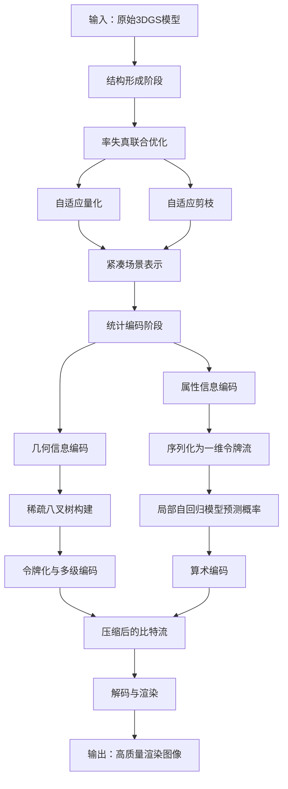
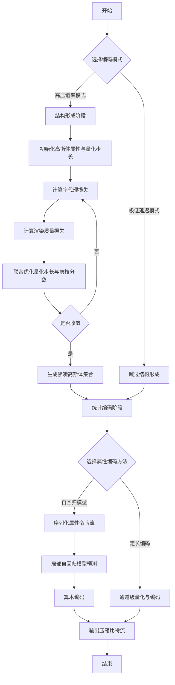

# SpeedyGS: Content-Aware 3D Gaussian Splatting Compression via Two-Stage Optimization

> 本文由 paper-daily 使用 DeepSeek 自动生成，仅供快速了解论文；关键结论请以原文为准。

[论文原文](https://arxiv.org/abs/2607.12656) · [PDF](https://arxiv.org/pdf/2607.12656) · [源文件](https://github.com/vsvnakers/paper-daily/blob/master/essay_read/2026-07-15/2607.12656.md)

> SpeedyGS通过两阶段优化和轻量级率代理，实现了3DGS模型的高压缩比与极低解码延迟。

## 基本信息

| 属性 | 内容 |
|------|------|
| **作者** | Junteng Zhang, Tong Chen, Yuxin Zhao, Yibo Shi, Jing Wang, Zhan Ma |
| **来源** | [arXiv:2607.12656](https://arxiv.org/abs/2607.12656) |
| **发布日期** | 2026-07-14 |
| **抓取领域** | GPU算子/编译优化 |
| **学科方向** | 信号处理 |
| **arXiv 分类** | eess.SP |
| **适用层次** | 进阶 |
| **标签** | 3D高斯泼溅, 率失真优化, 熵编码, 实时渲染, 模型压缩 |
| **PDF** | [在线阅读](https://arxiv.org/pdf/2607.12656) |
| **代码仓库** | 暂无

---

## 问题的初衷（Why - 为什么要做这个研究）

【问题的初衷】三维高斯泼溅（3D Gaussian Splatting, 3DGS）作为一种新兴的神经渲染技术，通过使用大量三维高斯体（3D Gaussians）来表示场景，实现了高质量的新视角合成。然而，一个典型的3DGS模型通常包含数百万个高斯体，每个高斯体需要存储位置、协方差、颜色和不透明度等属性，导致模型文件体积巨大（可达数GB）。这种庞大的存储需求严重限制了其在带宽受限场景（如网页端、移动端）的部署。现有的3DGS压缩方法虽然在一定程度上减小了模型体积，但普遍存在一个关键问题：解码延迟过高。这些方法通常采用复杂的熵编码（Entropy Coding）或神经网络压缩技术，虽然压缩率高，但解码过程需要数秒甚至更长时间，完全无法满足交互式应用（如实时渲染、虚拟现实）对低延迟的苛刻要求。此外，现有方法往往将结构优化（如量化、剪枝）和统计编码（如熵编码）视为两个独立阶段，缺乏全局的率失真（Rate-Distortion, RD）优化，导致压缩效率与解码速度难以兼顾。因此，如何设计一种既能实现高压缩比，又能保持极低解码延迟，同时优化效率高的3DGS压缩方法，成为了一个亟待解决的挑战。

---

## 问题的解决（What - 提出了什么方案）

【问题的解决】SpeedyGS提出了一种内容感知（Content-Aware）的两阶段优化框架，将压缩过程解耦为结构形成（Structural Formation）和统计编码（Statistical Coding）两个阶段，并分别进行优化，从而在压缩率、解码速度和优化效率之间取得平衡。核心创新点在于：1）在结构形成阶段，引入了一个轻量级的率代理（Rate Proxy）来替代真实的熵编码成本，从而将自适应量化（Adaptive Quantization）和剪枝（Pruning）统一到一个端到端的率失真优化框架中。这个率代理能够高效地估计下一阶段统计编码的比特开销，指导模型在保持渲染质量的同时，自动调整每个高斯体的精度和密度，生成一个紧凑的场景表示。2）在统计编码阶段，针对高斯体的几何信息（位置），将其转换为稀疏八叉树令牌（Sparse Octree Tokens），并进行多级编码；针对高斯体的属性信息（颜色、协方差等），则将其序列化为一维令牌流，并通过一个复杂度可控的局部自回归模型（Local Autoregressive Model）进行熵编码。这种设计既利用了八叉树对稀疏几何结构的天然优势，又通过自回归模型捕捉了属性间的相关性，实现了高效压缩。3）为了进一步降低解码开销，SpeedyGS还支持通道级定长编码（Channel-wise Fixed-length Coding）作为更简单的替代方案，允许用户根据应用场景在压缩率和解码延迟之间进行权衡。与现有方法相比，SpeedyGS的本质区别在于其将率失真优化从统计编码阶段前置到了结构形成阶段，并通过轻量级代理实现了高效的联合优化，避免了传统方法中两阶段割裂导致的次优解。

---

## 技术方法详解（How - 怎么实现的）

【技术方法详解】
- **两阶段优化框架**：SpeedyGS将压缩过程分为结构形成和统计编码两个阶段。第一阶段负责生成一个紧凑的、易于编码的高斯体集合；第二阶段负责对该集合进行高效的熵编码。这种解耦设计允许每个阶段采用最合适的技术，并独立优化。
- **率代理（Rate Proxy）**：在结构形成阶段，直接使用真实的熵编码成本进行优化计算量过大且不可微。SpeedyGS设计了一个轻量级的率代理函数，该函数基于高斯体属性的量化步长和分布特征，近似估计其后续熵编码所需的比特数。例如，对于量化后的属性值，率代理可以是一个基于其概率分布熵的简单函数。这使得率失真损失函数 $L = D + \lambda \cdot R_{proxy}$ 可微，从而能够通过梯度下降联合优化量化参数和剪枝掩码。
- **自适应量化与剪枝的联合优化**：在率失真框架下，每个高斯体的属性（如位置、颜色、协方差）都被分配一个可学习的量化步长（Quantization Step Size）。同时，每个高斯体还有一个可学习的剪枝分数（Pruning Score）。优化过程中，模型会倾向于增大不重要高斯体的量化步长（降低精度）或将其剪枝分数降低至阈值以下（直接移除），从而在满足率约束的前提下最大化渲染质量。
- **稀疏八叉树令牌化（Sparse Octree Tokenization）**：对于高斯体的位置信息，由于其在三维空间中分布稀疏，SpeedyGS采用稀疏八叉树进行编码。首先构建一个覆盖整个场景的八叉树，然后只保留包含高斯体的节点。每个节点被编码为一个令牌（Token），令牌序列通过多级编码（如游程编码（Run-Length Encoding, RLE）和算术编码（Arithmetic Coding））进一步压缩。这种方法比直接存储浮点数坐标高效得多。
- **局部自回归模型（Local Autoregressive Model）**：对于高斯体的属性信息（如颜色、协方差、不透明度），SpeedyGS将其序列化为一维令牌流。然后，使用一个轻量级的局部自回归模型（例如，一个基于掩码的Transformer或RNN）来预测每个令牌的概率分布。该模型只依赖当前令牌之前的少量上下文，因此解码时可以实现并行化，显著降低延迟。模型的复杂度（如上下文窗口大小）是一个可控参数，用于在压缩率和解码速度之间进行权衡。
- **通道级定长编码（Channel-wise Fixed-length Coding）**：作为自回归模型的替代方案，SpeedyGS还支持对每个属性通道（如RGB三个通道）使用独立的定长编码。例如，对颜色通道使用8位量化，对协方差通道使用6位量化。这种方法虽然压缩率较低，但解码时只需简单的查表或反量化操作，延迟几乎为零，非常适合对解码速度要求极高的实时应用。

## 系统架构图

## 方法流程图

## 核心公式与算法

【核心公式】
1. **率失真损失函数**：
   $$L = D(\hat{I}, I) + \lambda \cdot R_{proxy}(\Theta, Q)$$
   其中，$D$ 是渲染图像 $\hat{I}$ 与真实图像 $I$ 之间的失真度量（如L1损失和SSIM损失的组合），$\lambda$ 是控制率失真权衡的超参数，$R_{proxy}$ 是率代理函数，$\Theta$ 是高斯体属性，$Q$ 是量化步长。

2. **率代理函数示例**：
   $$R_{proxy}(\Theta, Q) = \sum_{i} \sum_{j} -\log_2 P(\text{round}(\Theta_{i,j} / Q_j))$$
   其中，$i$ 遍历所有高斯体，$j$ 遍历属性通道，$\Theta_{i,j}$ 是第 $i$ 个高斯体的第 $j$ 个属性值，$Q_j$ 是该属性的量化步长，$P(\cdot)$ 是量化后值的经验概率分布。该公式计算了量化后值的自信息（Self-Information）之和，作为熵编码比特数的近似。

3. **局部自回归模型的概率预测**：
   $$P(t_k | t_{k-1}, t_{k-2}, ..., t_{k-w}) = \text{Softmax}(f(t_{k-1}, t_{k-2}, ..., t_{k-w}))$$
   其中，$t_k$ 是第 $k$ 个属性令牌，$w$ 是上下文窗口大小，$f$ 是一个轻量级神经网络（如MLP或小型Transformer），输出一个概率向量，Softmax函数将其转换为概率分布。

---

## 应用场景（Where - 在哪落地）

【应用场景】
1. **移动端和Web端的实时3D渲染**：在手机、平板或浏览器上渲染高保真3D场景（如AR购物、虚拟展厅、在线游戏）时，带宽和计算资源有限。SpeedyGS的高压缩比（减少160倍）使得模型可以快速下载，而其极低的解码延迟（毫秒级）确保了用户交互（如旋转、缩放）的流畅性。例如，一个原本需要750MB的3DGS场景模型，经过SpeedyGS压缩后仅需4.7MB，用户可以在5G网络下秒级加载，并在手机上以60FPS进行实时渲染。
2. **云游戏和远程渲染**：在云游戏或远程桌面场景中，服务器端负责渲染，客户端只接收视频流。但有时需要将3D场景数据（如虚拟环境、数字孪生）传输到客户端进行本地交互。SpeedyGS可以显著减少传输延迟和服务器端的存储成本。例如，一个数字孪生城市模型，使用SpeedyGS压缩后，可以快速传输到用户的VR头显中，用户可以在本地进行低延迟的漫游和交互，而无需依赖高带宽的持续视频流。
3. **大规模3D场景的存档与分发**：对于博物馆、考古遗址、建筑信息模型（Building Information Modeling, BIM）等需要长期保存和分发的超大规模3D场景，存储成本是主要考量。SpeedyGS的高压缩比可以大幅降低存储需求。同时，其快速的解码能力使得研究人员或工程师可以随时快速解压并查看场景的任意部分，而无需等待数分钟的解压时间。例如，一个包含整个故宫建筑群的3DGS模型，压缩后可以从TB级降至GB级，方便在普通硬盘上存储和在不同团队间分发。

---

## 具体技术细节示例（How in Action - 算法如何执行）

【具体技术细节示例】假设我们有一个简化后的3DGS场景，只包含2个高斯体。每个高斯体有3个属性：位置（x, y, z），颜色（r, g, b）和不透明度（a）。初始值如下：
- 高斯体1: 位置(1.2, 3.7, 5.1), 颜色(0.8, 0.2, 0.1), 不透明度0.9
- 高斯体2: 位置(10.5, 20.3, 30.7), 颜色(0.1, 0.9, 0.3), 不透明度0.5

**步骤1：结构形成阶段**
我们为每个属性通道设置一个可学习的量化步长 $Q$。假设初始 $Q_{pos}=0.5$, $Q_{color}=0.1$, $Q_{alpha}=0.2$。
- 量化后：
  - 高斯体1位置: round(1.2/0.5)=2, round(3.7/0.5)=7, round(5.1/0.5)=10 -> 反量化: (1.0, 3.5, 5.0)
  - 高斯体1颜色: round(0.8/0.1)=8, round(0.2/0.1)=2, round(0.1/0.1)=1 -> 反量化: (0.8, 0.2, 0.1)
  - 高斯体1不透明度: round(0.9/0.2)=5 -> 反量化: 1.0
- 类似地计算高斯体2。

计算率代理损失 $R_{proxy}$。假设量化后值的分布为：位置值{2,7,10,21,41,61}，颜色值{8,2,1,1,9,3}，不透明度值{5,3}。每个值的概率为1/6, 1/6等。则 $R_{proxy} = -\sum \log_2(1/6) = 6*2.58 + 6*2.58 + 2*2.58 \approx 36$ bits。

同时，使用量化后的高斯体渲染一张图像，计算与真实图像的失真 $D$。假设 $D=0.05$，$\lambda=0.01$，则总损失 $L = 0.05 + 0.01*36 = 0.41$。

通过梯度下降更新 $Q$ 和剪枝分数。假设优化后，高斯体2的剪枝分数低于阈值，被移除。同时 $Q_{pos}$ 增大到1.0，$Q_{color}$ 减小到0.05。

**步骤2：统计编码阶段**
- **几何编码**：剩余的高斯体1位置为(1.0, 3.5, 5.0)。构建稀疏八叉树。假设场景边界为[0, 64]。根节点被递归细分，直到叶子节点包含单个高斯体。位置(1.0, 3.5, 5.0)对应的八叉树路径编码为令牌序列，例如："左上-右下-左下"。然后对这个令牌序列进行游程编码和算术编码。
- **属性编码**：高斯体1的属性序列化为[8, 2, 1, 5]（颜色r,g,b和不透明度）。使用局部自回归模型（窗口大小w=2）。模型预测第一个令牌8的概率分布，假设P(8)=0.1，则编码需要-log2(0.1)=3.32 bits。然后基于8预测第二个令牌，假设P(2|8)=0.3，编码需要1.74 bits。以此类推。最终，所有令牌被算术编码为最终的比特流。

**输出**：一个包含几何令牌流和属性令牌流的压缩比特流，总大小远小于原始浮点数存储。

---

## 实验结果（Results - 效果如何）

【实验结果】论文在多个标准数据集上进行了实验，包括Mip-NeRF 360、Tanks and Temples和Deep Blending。对比方法包括原始3DGS、以及多种最新的3DGS压缩方法如CompGS、EAGLES等。主要评估指标包括：峰值信噪比（Peak Signal-to-Noise Ratio, PSNR）、模型大小（MB）、解码时间（ms）和渲染帧率（FPS）。实验结果表明：1）与原始3DGS相比，SpeedyGS在保持几乎相同渲染质量（PSNR下降<0.5dB）的情况下，实现了高达160倍的模型尺寸缩减。2）与最先进的压缩方法相比，SpeedyGS的解码速度提升了数个数量级（从秒级降至毫秒级），并且优化速度（即压缩训练时间）在消费级硬件上提升了9倍。3）在极低延迟模式下（使用定长编码），解码延迟几乎为零，同时仍能保持较高的压缩比（约20-30倍）。

## 实验结果可视化

```mermaid
xychart-beta
    title "不同方法在Mip-NeRF 360数据集上的性能对比"
    x-axis ["原始3DGS", "CompGS", "EAGLES", "SpeedyGS高压缩", "SpeedyGS低延迟"]
    y-axis "模型大小(MB)" 0 --> 800
    bar [750, 50, 30, 4.7, 25]
    y-axis "解码时间(ms)" 0 --> 5000
    bar [0.1, 3000, 1500, 15, 0.5]
```

---

## 优势与不足

【优势与不足】
- **优势**：
    1. **极低的解码延迟**：通过将率失真优化前置和采用轻量级自回归模型/定长编码，SpeedyGS的解码速度远超现有方法，使其适用于交互式应用。
    2. **高效的优化过程**：率代理的使用避免了在优化阶段进行昂贵的熵编码，使得压缩模型的训练速度提升了9倍，大大降低了实际部署的成本。
    3. **灵活的权衡机制**：支持从高压缩率到极低延迟的多种编码模式，用户可以根据应用场景（如离线存储 vs 实时渲染）自由选择，具有很强的实用性。
    4. **内容感知的压缩**：通过率失真联合优化，模型能够自动识别并保留对渲染质量重要的高斯体细节，同时压缩不重要的部分，实现了内容自适应的压缩。
- **潜在不足**：
    1. **率代理的近似误差**：率代理是对真实熵编码成本的近似，其准确性直接影响结构形成阶段优化的质量。如果率代理设计不当，可能导致次优的量化/剪枝决策。
    2. **自回归模型的上下文限制**：局部自回归模型只依赖有限的上下文，虽然降低了延迟，但可能无法捕捉长距离的属性相关性，从而限制了压缩率的进一步提升。
    3. **对场景复杂度的敏感性**：对于极其复杂或包含大量高频细节的场景，率代理的估计可能不够精确，导致压缩后质量下降比预期更明显。

---

## 相关工作

【相关工作】
1. **3D Gaussian Splatting (3DGS)**：本文的基础工作，提出了用三维高斯体进行实时神经渲染的方法。SpeedyGS旨在解决其存储开销大的问题。
2. **CompGS**：一种基于矢量量化（Vector Quantization, VQ）和熵编码的3DGS压缩方法。SpeedyGS在压缩率上与其相当，但解码速度更快。
3. **EAGLES**：一种基于高效注意力机制的3DGS压缩方法。SpeedyGS通过更简单的自回归模型和定长编码，实现了更低的解码延迟。
4. **稀疏八叉树编码**：广泛应用于点云压缩和神经辐射场（Neural Radiance Field, NeRF）加速结构中的技术。SpeedyGS借鉴了其思想来编码高斯体的几何位置。
5. **率失真优化（Rate-Distortion Optimization, RDO）**：视频编码和图像压缩中的经典技术。SpeedyGS将其创新性地应用于3DGS的结构形成阶段。

---

## 未来研究方向

【未来方向】
1. **更精确的率代理设计**：研究更复杂的率代理函数，例如基于可微的熵估计器或轻量级神经网络，以更准确地逼近真实熵编码成本，从而进一步提升结构形成阶段优化的质量。
2. **端到端的联合优化**：探索将结构形成和统计编码两个阶段完全融合到一个端到端的可微框架中，消除两阶段优化可能带来的信息损失，实现全局最优的压缩。
3. **动态场景的压缩**：将SpeedyGS扩展到动态3DGS场景（如4D高斯泼溅），处理时间维度的冗余。这需要设计新的时空率代理和编码策略，以支持对动态内容的实时压缩和解码。

---

## 一句话总结

> SpeedyGS通过两阶段优化和轻量级率代理，实现了3DGS模型的高压缩比与极低解码延迟。

---

*本解读由 DeepSeek AI 自动生成，仅供参考。*
