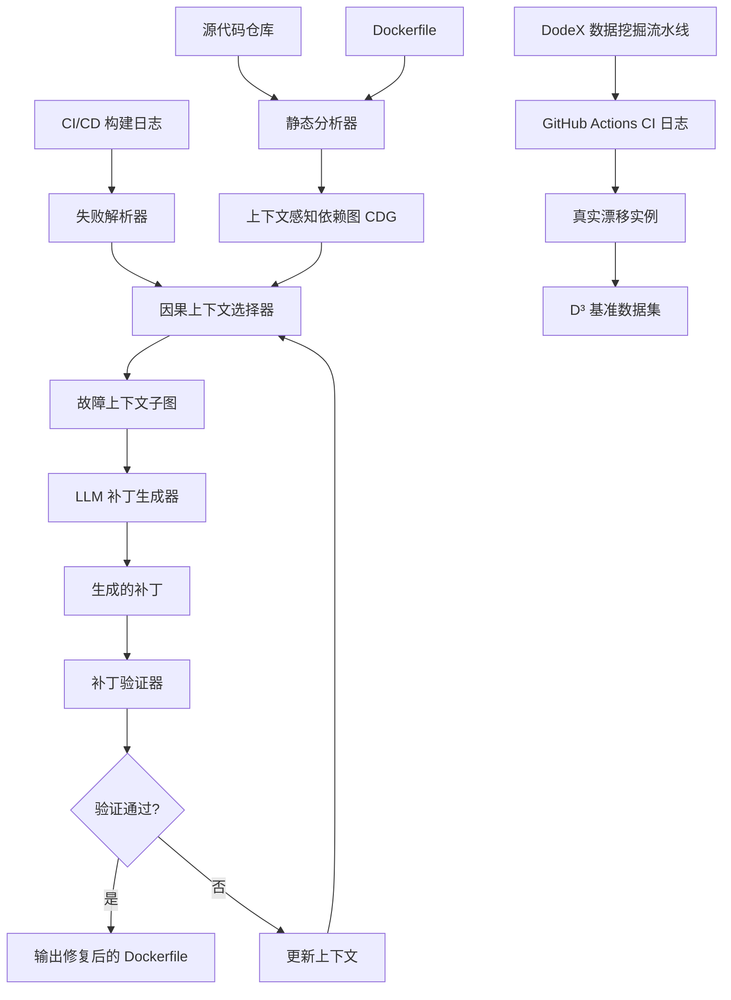
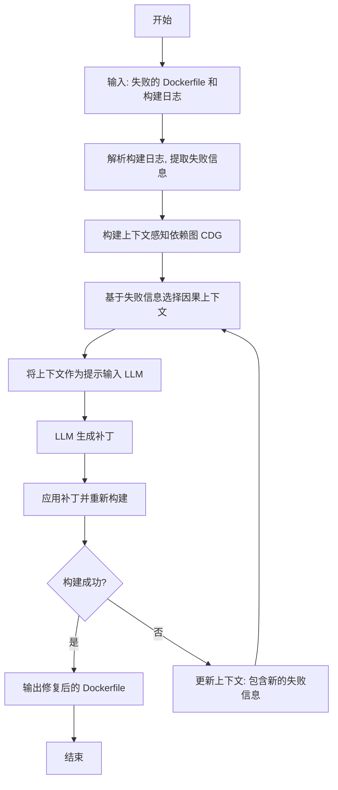
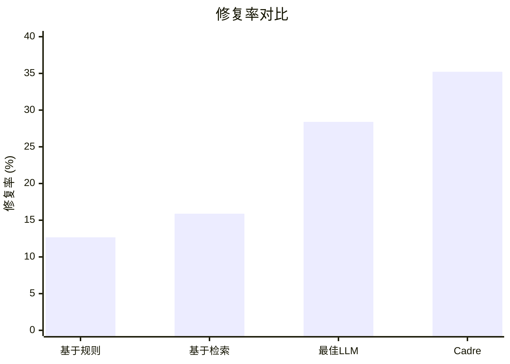

# Taming the Drift: Context-aware Repair of Dockerfile Drift during Software Evolution

> 本文由 paper-daily 使用 DeepSeek 自动生成，仅供快速了解论文；关键结论请以原文为准。

[论文原文](https://arxiv.org/abs/2607.12541) · [PDF](https://arxiv.org/pdf/2607.12541) · [源文件](https://github.com/vsvnakers/paper-daily/blob/master/essay_read/2026-07-16/2607.12541.md)

> 提出上下文感知依赖图与两阶段工作流，实现 Dockerfile 漂移的高效自动修复。

## 基本信息

| 属性 | 内容 |
|------|------|
| **作者** | Chengjie Wang, Jingzheng Wu, Xiang Ling, Tianyue Luo, Chen Zhao |
| **来源** | [arXiv:2607.12541](https://arxiv.org/abs/2607.12541) |
| **发布日期** | 2026-07-14 |
| **抓取领域** | 自然语言处理 |
| **学科方向** | 软件工程 |
| **arXiv 分类** | cs.SE |
| **适用层次** | 进阶 |
| **标签** | Dockerfile, 漂移修复, 上下文感知, 依赖图, 大语言模型 |
| **PDF** | [在线阅读](https://arxiv.org/pdf/2607.12541) |
| **代码仓库** | 暂无

---

## 问题的初衷（Why - 为什么要做这个研究）

【问题的初衷】在现代软件开发中，Docker 已成为创建可重现构建环境（reproducible build environments）的事实标准。开发者通过编写 Dockerfile 来定义应用的构建环境，包括基础镜像、依赖安装、文件复制等指令。然而，随着软件持续演进（software evolution），源代码会不断修改，但对应的 Dockerfile 却常常未能同步更新，导致两者之间出现偏差，即 Dockerfile 漂移（Dockerfile drift）。这种漂移会直接导致持续集成/持续部署（CI/CD）流水线构建失败，严重影响开发效率和交付速度。现有方法主要分为两类：基于规则的方法（rule-based）和基于检索的方法（retrieval-based）。基于规则的方法依赖预定义的修复模板，只能处理模式固定的简单错误；基于检索的方法则从历史修复案例中寻找相似问题，但难以应对上下文相关的复杂故障。这些方法的共同缺陷是孤立地分析 Dockerfile，忽略了 Dockerfile 指令与源代码之间复杂的依赖关系。例如，一个 COPY 指令可能依赖于某个源文件的存在，而该文件可能在代码演进中被重命名或删除。这种上下文缺失导致现有方法在面对需要理解代码变更语义的漂移修复时表现不佳。因此，论文提出需要一种上下文感知（context-aware）的自动化修复方法，能够理解 Dockerfile 指令与源代码之间的依赖关系，从而精准定位并修复漂移问题。

---

## 问题的解决（What - 提出了什么方案）

【问题的解决】论文提出了 Cadre，一个上下文感知的 Dockerfile 漂移自动修复框架。其核心创新在于：首先，通过静态分析构建上下文感知依赖图（Context-aware Dependency Graph, CDG），该图精确映射了 Dockerfile 中每条指令与源代码文件级依赖以及指令间依赖的关系。CDG 不仅记录了指令本身，还追踪了指令所引用的文件、环境变量、构建参数等上下文信息。其次，Cadre 采用两阶段工作流：第一阶段，基于 CDG 选择与故障因果相关的上下文（context selection），即从 CDG 中提取出导致构建失败的最小相关子图；第二阶段，利用选中的上下文生成针对性的补丁（patch generation）。这种设计的关键优势在于：它避免了将整个 Dockerfile 或整个代码仓库作为输入，从而大幅减少了需要处理的 token 数量，使得基于大语言模型（LLM）的补丁生成更加高效和可靠。与现有方法的本质区别在于，Cadre 不是孤立地看待 Dockerfile，而是将其视为与源代码紧密耦合的构建规范，通过显式建模依赖关系来实现上下文感知的修复。

---

## 技术方法详解（How - 怎么实现的）

【技术方法详解】
- **上下文感知依赖图构建**：Cadre 对 Dockerfile 进行静态分析，解析每条指令（如 FROM、RUN、COPY、ADD、ENV、ARG 等）。对于每条指令，它提取其操作的文件路径、环境变量、构建参数等。然后，通过分析源代码仓库的文件系统结构，建立指令与文件之间的依赖关系（如 COPY 指令依赖于源文件的存在）。同时，分析指令间的依赖（如 RUN 指令可能依赖于之前 ENV 指令设置的环境变量）。最终构建出一个有向无环图（DAG），即 CDG。
- **因果上下文选择**：当 CI/CD 构建失败时，Cadre 首先解析构建日志，提取失败信息（如错误类型、失败命令、缺失文件路径等）。然后，以失败点为中心，在 CDG 中进行反向遍历，选择所有与失败因果相关的节点和边，形成故障上下文子图。这个过程类似于程序切片（program slicing），但针对的是构建规范而非源代码。
- **两阶段补丁生成**：第一阶段，将选中的因果上下文（包括相关指令、文件依赖、环境变量等）作为提示（prompt）输入给 LLM，要求其生成修复方案。第二阶段，将生成的补丁应用到 Dockerfile 上，并重新验证。如果验证失败，则根据新的失败信息更新上下文，进入下一轮迭代。这种两阶段设计将复杂问题分解为“理解上下文”和“生成补丁”两个子任务，降低了 LLM 的推理负担。
- **DodeX 数据挖掘流水线**：为了获取真实的漂移实例，论文提出了 DodeX 流水线。它从 GitHub Actions CI 日志中挖掘构建失败案例，并通过重放 CI 工作流来重现失败环境，同时保留完整的构建配置（如操作系统版本、依赖版本、环境变量等）。这解决了现有静态快照数据集（static-snapshot datasets）丢失构建配置信息的问题。
- **D³ 基准数据集**：利用 DodeX，论文构建了包含 1,040 个可本地重现的漂移实例的基准数据集 D³。每个实例都包含原始 CI 参数，确保了实验的可重复性和真实性。


## 系统架构图




## 方法流程图




## 核心公式与算法

【核心公式】
论文的核心贡献在于方法框架，而非数学公式。但可以抽象出关键算法步骤：

1. **上下文选择算法**：给定失败点 $f$ 和 CDG $G = (V, E)$，其中 $V$ 是节点集（指令或文件），$E$ 是依赖边集。因果上下文 $C$ 定义为从 $f$ 出发，沿反向依赖边可达的所有节点和边的集合：
   $$C = \{ v \in V \mid \exists \text{ 路径 } v \leadsto f \text{ 在 } G \text{ 中} \} \cup \{ e \in E \mid e \text{ 连接 } C \text{ 中的节点} \}$$

2. **补丁生成概率**：给定上下文 $C$ 和 LLM $M$，生成正确补丁 $p$ 的概率为：
   $$P(p \mid C, M) = \prod_{t=1}^{|p|} P(\text{token}_t \mid \text{context}, \text{prefix}_{<t}, M)$$
   其中 $\text{prefix}_{<t}$ 是已生成的前 $t-1$ 个 token。

3. **修复率**：在基准数据集 $D$ 上，修复率 $R$ 定义为成功修复的实例数 $N_{\text{success}}$ 与总实例数 $N_{\text{total}}$ 之比：
   $$R = \frac{N_{\text{success}}}{N_{\text{total}}}$$


---

## 应用场景（Where - 在哪落地）

【应用场景】
1. **大型软件项目的 CI/CD 维护**：在大型开源项目（如 Kubernetes、TensorFlow）中，Dockerfile 可能包含数百行指令，涉及复杂的依赖关系。当项目快速迭代时，Dockerfile 漂移频繁发生。Cadre 可以集成到 CI/CD 流水线中，在构建失败时自动分析失败原因，定位漂移点，并生成修复补丁。例如，当开发者重命名了一个头文件但忘记更新 COPY 指令时，Cadre 的 CDG 能检测到文件依赖缺失，并自动将 COPY 指令中的文件名更新为新的名称。预期效果是大幅减少人工排查和修复的时间，将构建修复时间从小时级缩短到分钟级。

2. **微服务架构的部署维护**：在微服务架构中，每个服务可能有独立的 Dockerfile。当服务间的 API 接口发生变化时，依赖该服务的其他服务的 Dockerfile 可能需要更新（如安装新的客户端库）。Cadre 可以通过分析跨仓库的依赖关系（如果配置了多仓库分析），检测到这种间接漂移。例如，服务 A 更新了其 gRPC 接口，服务 B 的 Dockerfile 需要安装新的 protobuf 版本。Cadre 能根据构建日志中的编译错误，结合 CDG 中的依赖关系，自动生成安装新依赖的 RUN 指令。

3. **安全补丁的自动同步**：当基础镜像（如 Ubuntu 22.04）发布安全更新时，所有基于该镜像的 Dockerfile 都需要更新基础镜像标签（如从 ubuntu:22.04 更新到 ubuntu:22.04-20240101）。Cadre 可以检测到这种因基础镜像版本漂移导致的构建失败（如某个安全补丁引入了新的依赖冲突），并通过分析 CDG 中 FROM 指令的依赖关系，自动生成更新基础镜像标签的补丁，确保所有服务都能及时应用安全更新。


---

## 具体技术细节示例（How in Action - 算法如何执行）

【具体技术细节示例】
假设有一个简单的 Python Web 应用，其 Dockerfile 如下：
```
FROM python:3.9-slim
WORKDIR /app
COPY requirements.txt .
RUN pip install -r requirements.txt
COPY src/ ./src/
CMD ["python", "./src/app.py"]
```
源代码仓库中，`src/app.py` 导入了 `flask` 和 `requests` 库，这些库在 `requirements.txt` 中列出。

**漂移场景**：在一次代码提交中，开发者将 `src/app.py` 重命名为 `src/main.py`，并修改了导入语句，添加了 `numpy` 依赖，但忘记更新 Dockerfile 中的 `COPY src/ ./src/` 指令（实际上该指令仍然正确，因为复制了整个目录）和 `CMD` 指令（错误地仍指向 `app.py`），同时忘记在 `requirements.txt` 中添加 `numpy`。

**Cadre 执行过程**：
1. **构建 CDG**：Cadre 静态分析 Dockerfile 和源代码，构建 CDG。关键节点和边包括：
   - `CMD` 节点，依赖文件 `./src/app.py`。
   - `COPY src/ ./src/` 节点，依赖源目录 `src/`。
   - `RUN pip install -r requirements.txt` 节点，依赖文件 `requirements.txt`。
   - `COPY requirements.txt .` 节点，依赖源文件 `requirements.txt`。
   - 文件节点：`src/app.py`（存在）、`src/main.py`（存在）、`requirements.txt`（存在，但内容未更新）。

2. **构建失败**：CI/CD 运行 `docker build`，执行到 `CMD` 时失败，因为 `./src/app.py` 不存在。构建日志显示：`ERROR: failed to solve: process "/bin/sh -c python ./src/app.py" did not complete successfully: file not found`。

3. **上下文选择**：Cadre 解析失败信息，定位到 `CMD` 节点。从该节点反向遍历 CDG，选择因果上下文：包括 `CMD` 节点本身、`COPY src/ ./src/` 节点（因为 `CMD` 依赖的文件在 `src/` 目录下）、以及文件节点 `src/app.py` 和 `src/main.py`。注意，`RUN pip install` 和 `COPY requirements.txt` 节点未被选中，因为当前失败与它们无关。

4. **补丁生成**：Cadre 将选中的上下文（包括 `CMD` 指令、`COPY` 指令、以及 `src/` 目录下的文件列表）作为提示输入给 LLM。LLM 分析上下文后，发现 `src/app.py` 不存在，但 `src/main.py` 存在且是 Python 文件，推断出文件被重命名。LLM 生成补丁：将 `CMD ["python", "./src/app.py"]` 修改为 `CMD ["python", "./src/main.py"]`。

5. **验证**：Cadre 应用补丁并重新构建。这次构建成功，因为 `src/main.py` 存在。但运行时可能因缺少 `numpy` 而失败。不过，Cadre 的当前版本主要关注构建阶段失败。如果构建成功但运行时失败，则不在当前修复范围内。

**输出**：修复后的 Dockerfile 中 `CMD` 指令被正确更新。


---

## 实验结果（Results - 效果如何）

【实验结果】论文在自建的 D³ 基准数据集上进行了实验，该数据集包含 1,040 个真实的 Dockerfile 漂移实例。对比方法包括：基于规则的基线（Rule-based）、基于检索的基线（Retrieval-based）、以及多种基于 LLM 的基线（如 GPT-4、Claude 等）。主要实验结果：Cadre 实现了 35.22% 的修复率（repair rate），是基于规则基线的 2.78 倍，是表现最好的 LLM 基线的 1.24 倍。在 token 效率方面，Cadre 的两阶段工作流使得 95.25% 的提示（prompt）保持在 30k tokens 以下，而其他 LLM 方法在 41 到 58 个案例中出现了提示溢出（prompt overflow）导致无法生成补丁。消融实验（ablation study）证实，CDG 和两阶段工作流都对修复性能有显著贡献。此外，随着漂移在多个提交中持续存在（drift age），Cadre 相对于仅基于 diff 的方法的优势更加明显，证明了显式依赖建模对于上下文感知的基础设施即代码（Infrastructure-as-Code）维护的重要性。


## 实验结果可视化




---

## 优势与不足

【优势与不足】
**优势：**
1. **上下文感知**：通过 CDG 显式建模 Dockerfile 指令与源代码的依赖关系，能够处理需要理解代码变更语义的复杂漂移问题，这是现有方法无法做到的。
2. **高效且可靠**：两阶段工作流通过选择最小因果上下文，大幅减少了 LLM 的输入 token 数量，避免了提示溢出问题，同时提高了修复的准确性和效率。
3. **真实数据驱动**：DodeX 流水线从真实 CI 日志中挖掘漂移实例，并保留了完整的构建配置，使得 D³ 基准数据集比现有的静态快照数据集更真实、更具挑战性。

**不足：**
1. **依赖静态分析精度**：CDG 的构建依赖于静态分析，对于动态生成的文件路径、运行时环境变量等无法完全覆盖，可能导致依赖图不完整，从而影响上下文选择的准确性。
2. **LLM 生成质量瓶颈**：补丁生成最终依赖 LLM 的能力，如果 LLM 对特定领域（如特定基础镜像的包管理工具）理解不足，可能生成无效补丁。此外，LLM 的推理成本仍然较高。

---

## 相关工作

【相关工作】
1. **Dockerfile 修复**：如 Push-If-Not-Exists (PINE) 等基于规则的方法，以及基于检索的修复方法。这些工作与 Cadre 直接相关，但 Cadre 通过上下文感知超越了它们。
2. **程序修复（Automated Program Repair, APR）**：如 GenProg、TBar 等。Cadre 将 APR 的思想应用于构建规范修复，但针对 Dockerfile 的特点设计了专门的依赖图。
3. **基础设施即代码（Infrastructure-as-Code, IaC）**：如 Terraform、Ansible 等。Dockerfile 是 IaC 的一种形式，Cadre 的工作可推广到其他 IaC 工具的漂移检测与修复。
4. **大语言模型在软件工程中的应用**：如 Codex、GPT-4 用于代码生成和修复。Cadre 展示了如何通过精心设计的提示工程（prompt engineering）来提升 LLM 在特定任务上的表现。
5. **构建系统分析**：如 Make、Bazel 的依赖分析。Cadre 的 CDG 借鉴了构建系统的依赖图思想，但针对 Dockerfile 的语义进行了定制。

---

## 未来研究方向

【未来方向】
1. **多阶段漂移修复**：当前 Cadre 主要处理单次构建失败。未来可以扩展到处理多阶段构建（multi-stage builds）中的漂移，以及跨多个 Dockerfile 的协同漂移修复。例如，一个基础镜像的 Dockerfile 更新后，所有依赖它的子镜像的 Dockerfile 都需要相应调整。
2. **运行时漂移检测**：当前工作聚焦于构建时漂移（build-time drift）。未来可以扩展到运行时漂移（run-time drift），即容器运行时的配置与预期不符（如环境变量、挂载卷等）。这需要结合容器运行时监控和动态分析技术。
3. **主动漂移预防**：从被动修复转向主动预防。通过在代码提交时自动分析 Dockerfile 与源代码的依赖关系，在漂移发生前就向开发者发出警告或自动同步更新。这类似于类型检查器在编译时捕获错误，而非等到运行时。


---

## 一句话总结

> 提出上下文感知依赖图与两阶段工作流，实现 Dockerfile 漂移的高效自动修复。

---

*本解读由 DeepSeek AI 自动生成，仅供参考。*
