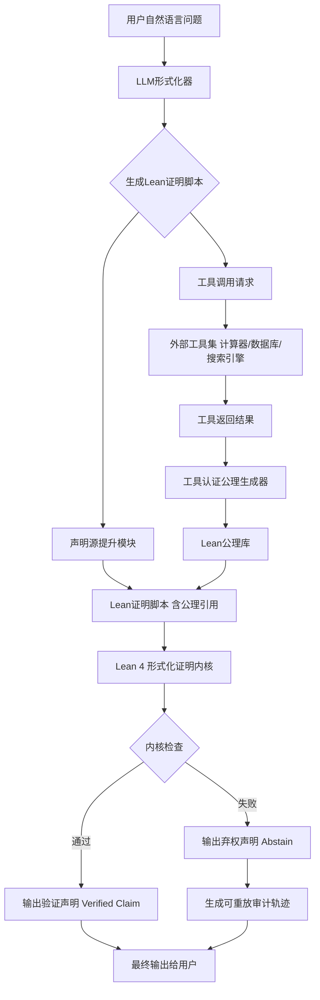
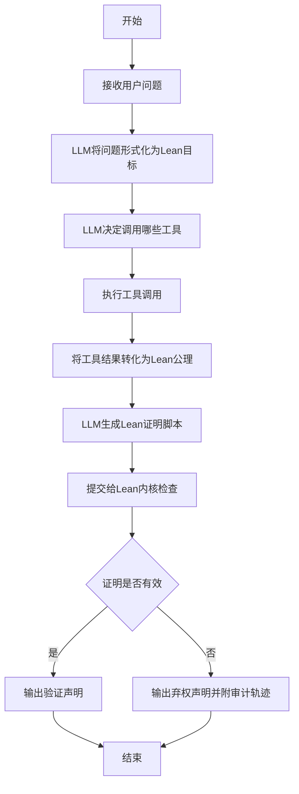
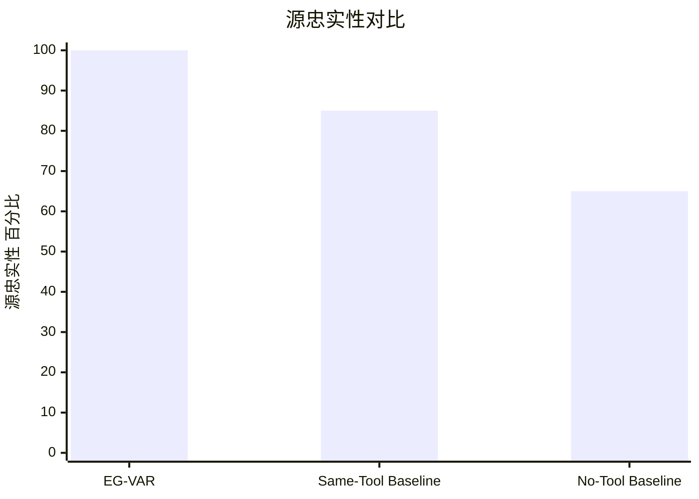

# Evidence-Grounded Verified Agentic Reasoning: A Path Toward Eliminating LLM Hallucination in Empirical Inference via Tool-Attested Kernel Proofs

> 本文由 paper-daily 使用 DeepSeek 自动生成，仅供快速了解论文；关键结论请以原文为准。

[论文原文](https://arxiv.org/abs/2607.12650) · [PDF](https://arxiv.org/pdf/2607.12650) · [源文件](https://github.com/vsvnakers/paper-daily/blob/master/essay_read/2026-07-16/2607.12650.md)

> EG-VAR通过将LLM推理置于形式化证明内核监督下，从数学上保证了经验推理的零幻觉和完全可审计性。

## 基本信息

| 属性 | 内容 |
|------|------|
| **作者** | Junyu Ren |
| **来源** | [arXiv:2607.12650](https://arxiv.org/abs/2607.12650) |
| **发布日期** | 2026-07-14 |
| **抓取领域** | 自然语言处理 |
| **学科方向** | 机器学习 · 人工智能 · cs.CY |
| **arXiv 分类** | cs.LG, cs.AI, cs.CY, cs.SE |
| **适用层次** | 前沿 |
| **标签** | 形式化验证, 大型语言模型, 幻觉消除, 工具增强, 可审计AI |
| **PDF** | [在线阅读](https://arxiv.org/pdf/2607.12650) |
| **代码仓库** | 暂无

---

## 问题的初衷（Why - 为什么要做这个研究）

【问题的初衷】大型语言模型（Large Language Model, LLM）在生成看似合理的文本方面表现出色，但其在经验推理（Empirical Inference）中普遍存在幻觉（Hallucination）问题，即生成的内容与事实或提供的证据不符。当前，让LLM调用外部工具（如计算器、搜索引擎、数据库）是一种常见的缓解策略，但这并不能从根本上保证推理的可靠性。问题在于：即使LLM调用了工具，其最终输出的结论可能并非直接源于工具返回的证据，而是经过了LLM自身不可控的、可能错误的推理过程。此外，LLM的推理步骤缺乏形式化验证，无法保证每一步演绎推理（Deduction）在逻辑上是有效的。因此，在高风险领域（如金融、医疗、法律），我们无法信任LLM生成的任何经验性声明。现有方法要么完全依赖LLM的生成能力，要么仅对工具调用结果进行简单后处理，缺乏一个可审计、可验证的框架来确保每个输出声明都严格基于证据和形式化逻辑。这篇论文正是为了解决这一根本性信任问题，提出一种将LLM的推理过程置于形式化证明内核（Formal Proof Kernel）监督下的架构，从而消除经验推理中的幻觉。

---

## 问题的解决（What - 提出了什么方案）

【问题的解决】论文提出了EG-VAR（Evidence-Grounded Verified Agentic Reasoning）架构，其核心思想是引入一个形式化证明系统（Lean 4）作为可信的推理裁判。EG-VAR并非让LLM直接生成最终答案，而是让LLM充当一个“形式化器”（Formalizer），负责将自然语言问题、工具调用结果和推理步骤翻译成形式化证明语言（Lean 4）。关键创新在于：1）工具认证公理（Tool-Attestation Axioms）：将外部工具（如计算器）的每次调用结果声明为一个形式化公理，作为不可辩驳的证据起点。2）声明源提升（Declared Source Lifts）：将证据的来源（如哪个工具、哪个时间点）显式地编码到形式化证明中。3）内核证明（Kernel Proofs）：所有推理步骤必须通过Lean 4内核的检查，确保每一步演绎推理都是逻辑有效的。最终，只有经过内核验证的声明（Verified Claim）才会被输出；任何无法被证明的推理都会导致系统诚实地“弃权”（Abstain），并附带可重放的审计轨迹。这与现有方法的本质区别在于，EG-VAR将信任从LLM的生成能力转移到了形式化证明内核的可靠性上，从而提供了一个可审计、可验证、零幻觉的推理框架。

---

## 技术方法详解（How - 怎么实现的）

【技术方法详解】
- **形式化证明内核（Formal Proof Kernel）**：采用Lean 4作为核心验证引擎。Lean 4是一个交互式定理证明器，其内核（Kernel）负责检查所有证明步骤的正确性。EG-VAR利用Lean内核作为唯一的“可信声明铸造者”（Sole Minter of Verified Claims），任何输出声明都必须经过内核的检查。
- **工具认证公理（Tool-Attestation Axioms）**：当LLM调用一个外部工具（如计算器）时，工具返回的结果（例如，`2+3=5`）会被自动转换为一个Lean公理（Axiom）。这个公理的形式是 `axiom tool_result : source_identifier -> result_value`，其中 `source_identifier` 唯一标识了这次工具调用。这确保了所有证据都来自可追溯的外部源。
- **声明源提升（Declared Source Lifts）**：在形式化证明中，每个推理步骤都必须显式声明其依赖的证据来源。例如，一个结论 `C` 如果是由公理 `A1` 和 `A2` 推导出来的，那么在证明中必须明确写出 `C` 的来源是 `A1` 和 `A2`。这使得证据链完全透明。
- **LLM作为形式化器（LLM as Formalizer）**：LLM的角色是接收自然语言问题、工具调用结果，并生成相应的Lean证明脚本。这包括定义目标命题（Target Proposition）、声明证据来源、编写推理步骤。LLM的生成结果并不直接作为答案，而是作为待验证的证明候选。
- **弃权机制（Abstention Mechanism）**：如果LLM生成的证明脚本无法通过Lean内核的检查（例如，推理步骤有误，或证据不足），系统不会输出一个错误的答案，而是输出一个“弃权”（Abstain）声明。这个弃权声明会附带一个可重放的审计轨迹（Audit Trail），记录下LLM尝试了什么、为什么失败，从而为后续调试和改进提供依据。
- **定理保证（Theorem Guarantees）**：论文证明了两个核心定理：
    - **定理3.1（源忠实性）**：每个验证过的输出声明在结构上都必须源自一个或多个被认证的工具调用。
    - **定理3.2（推理有效性）**：每个验证过的输出声明都必须通过一个内核检查过的有效推理链。
    这两个定理共同保证了EG-VAR输出的零幻觉特性。


## 系统架构图




## 方法流程图




## 核心公式与算法

【核心公式】
论文的核心贡献在于其架构和定理，而非具体公式。但可以形式化其核心保证：

**定理3.1（源忠实性）**：
$$\forall v \in \text{Verified}, \exists \{a_1, a_2, ..., a_n\} \subseteq \text{Axioms} \text{ such that } v \text{ structurally descends from } \{a_1, ..., a_n\}$$
解释：对于每一个验证过的声明 $v$，都存在一组公理 $\{a_1, ..., a_n\}$，使得 $v$ 在结构上源自这些公理。这意味着 $v$ 的证明树中，所有叶子节点都是工具认证公理。

**定理3.2（推理有效性）**：
$$\forall v \in \text{Verified}, \text{Kernel}(\text{Proof}(v)) = \text{True}$$
解释：对于每一个验证过的声明 $v$，其对应的证明 $\text{Proof}(v)$ 都能通过Lean内核的检查。这意味着 $v$ 的推理链在形式逻辑上是有效的。

**残余形式化误差率**：
$$\text{Error}_{\text{formalization}} = \frac{|\text{Incorrect Formalizations}|}{|\text{Total Attempts}|}$$
解释：衡量LLM在将自然语言问题转化为形式化证明时出错的概率。论文中报告了Sonnet和Opus模型上的具体数值。


---

## 应用场景（Where - 在哪落地）

【应用场景】
1. **金融报告生成与审计**：在金融领域，生成包含具体数字（如营收、增长率）的报告时，EG-VAR可以确保每个数字都来自经过验证的数据库或计算器。例如，LLM需要计算“公司A的营收增长率”，它会调用数据库获取去年和今年的营收数据，然后调用计算器计算增长率。EG-VAR会将这些工具调用结果作为公理，并形式化证明“增长率 = (今年营收 - 去年营收) / 去年营收”这一推理过程。最终输出的数字是100%可追溯和可验证的，审计人员可以直接检查证明链。
2. **医疗诊断辅助系统**：在医疗领域，EG-VAR可以用于辅助诊断，确保诊断结论基于可靠的检验结果和医学知识库。例如，LLM根据患者的血液检测报告（来自实验室系统）和已知的医学规则（来自知识库），推理出“患者可能患有贫血”。EG-VAR会将检测结果和医学规则作为公理，并形式化证明推理过程。如果推理无法通过验证（例如，规则应用错误），系统会弃权并给出审计轨迹，提示医生需要人工复核。
3. **法律文书的事实核查**：在法律领域，EG-VAR可以用于生成或核查法律文书中的事实陈述。例如，LLM需要根据案件数据库中的证据（如合同条款、交易记录）和法律法规，生成一份事实摘要。EG-VAR会确保每个事实陈述都直接源于数据库中的证据，并且推理过程符合法律逻辑。任何无法被证据支持的陈述都会被系统弃权，从而避免法律文书中出现虚假或误导性信息。


---

## 具体技术细节示例（How in Action - 算法如何执行）

【具体技术细节示例】
假设用户提问：“如果A公司2023年营收为100万，2024年营收为150万，那么2024年的营收比2023年增长了多少百分比？”

**步骤1：LLM形式化器生成Lean目标**
LLM首先将问题形式化为一个Lean目标：
```lean
theorem revenue_growth : Float :=
  let revenue_2023 := 100.0 in
  let revenue_2024 := 150.0 in
  (revenue_2024 - revenue_2023) / revenue_2023 * 100.0
```

**步骤2：工具调用与公理生成**
LLM决定调用计算器工具来计算 `(150.0 - 100.0) / 100.0 * 100.0`。工具返回结果 `50.0`。系统自动生成一个公理：
```lean
axiom calc_result : (150.0 - 100.0) / 100.0 * 100.0 = 50.0
```

**步骤3：LLM生成完整证明脚本**
LLM现在需要生成一个完整的Lean证明，证明 `revenue_growth` 等于 `50.0`。它可能会生成如下脚本：
```lean
theorem revenue_growth_correct : revenue_growth = 50.0 :=
  calc
    revenue_growth = (150.0 - 100.0) / 100.0 * 100.0 := by rfl
    _ = 50.0 := by
      -- 引用工具认证公理
      exact calc_result
```
这里 `by rfl` 表示根据定义重写，`exact calc_result` 直接引用工具返回的公理。

**步骤4：Lean内核检查**
Lean内核检查这个证明。它验证了 `revenue_growth` 的定义，并确认了 `calc_result` 公理的使用是有效的。检查通过。

**步骤5：输出验证声明**
系统输出一个验证声明：
```
Verified Claim: revenue_growth = 50.0%
Source: Calculator tool call at [timestamp]
Proof: [Lean proof script]
```

如果LLM生成的证明有误，例如它错误地使用了加法而不是减法，那么Lean内核会检查失败，系统会输出一个弃权声明，并附上审计轨迹，指出证明失败的位置和原因。


---

## 实验结果（Results - 效果如何）

【实验结果】论文在TableBench数值推理子集（n=120）上进行了实验。EG-VAR达到了120/120的完美准确率，而一个95%相同工具调用的基线方法（Same-Tool Baseline）则无法达到。在反事实压力测试（Counterfactual Stress Tests）中，涵盖了5个领域和2种模型，EG-VAR保持了100%的源忠实性（Source-Faithful），即所有输出都严格基于工具返回的证据。相比之下，相同工具基线方法的源忠实性下降到80-90%，而无工具基线（No-Tool）则下降到50-80%。此外，论文还评估了LLM作为形式化器时的残余语义形式化错误（Residual Semantic-Formalization Error），在Sonnet模型上为3.3%，在Opus模型上为1.7%。这些结果表明，EG-VAR在消除幻觉方面效果显著，尽管形式化过程本身会引入少量错误，但这些错误是可审计和可改进的。


## 实验结果可视化




---

## 优势与不足

【优势与不足】
- **优势**：
    1. **零幻觉保证**：通过形式化证明内核，从数学上保证了所有输出都基于证据和有效推理，从根本上消除了幻觉。
    2. **完全可审计**：每个输出（无论是验证声明还是弃权声明）都附带完整的审计轨迹，包括证据来源、推理步骤和失败原因，使得系统行为完全透明。
    3. **模块化与可扩展**：架构将LLM、工具和形式化证明器解耦，可以方便地替换或升级各个组件，例如使用更强大的LLM或更高效的工具。
- **不足**：
    1. **形式化开销**：将自然语言问题转化为形式化证明需要LLM具备较强的形式化能力，且生成证明脚本本身会消耗额外的计算资源和时间。
    2. **形式化错误**：LLM在形式化过程中可能引入语义错误（Semantic-Formalization Error），虽然比例较低（1.7-3.3%），但仍是错误来源，且需要人工或自动化工具来修正。
    3. **覆盖范围有限**：目前主要针对数值推理等结构化问题，对于更开放、更依赖常识推理的任务，形式化难度会急剧增加。

---

## 相关工作

【相关工作】
- **工具增强型LLM（Tool-Augmented LLMs）**：如Toolformer、Gorilla等，研究如何让LLM调用外部工具。EG-VAR在此基础上增加了形式化验证层。
- **形式化验证与LLM（Formal Verification and LLMs）**：如使用LLM生成形式化证明（如Coq、Isabelle）的代码。EG-VAR将这一思路应用于经验推理的验证。
- **可解释AI（Explainable AI, XAI）**：研究如何让AI模型的决策过程更透明。EG-VAR的审计轨迹本身就是一种强可解释性方案。
- **幻觉检测与缓解（Hallucination Detection and Mitigation）**：如SelfCheckGPT、RAG（Retrieval-Augmented Generation）等。EG-VAR提供了一种更根本的预防性方案。
- **神经符号系统（Neuro-Symbolic Systems）**：结合神经网络和符号推理。EG-VAR是神经符号系统的一个具体实例，用LLM做符号化，用Lean做推理。

---

## 未来研究方向

【未来方向】
1. **自动化形式化**：研究如何减少LLM在形式化过程中的错误，例如通过微调一个专门用于形式化的LLM，或开发一个交互式形式化助手，帮助LLM生成正确的证明脚本。
2. **扩展到更广泛的推理类型**：目前EG-VAR主要针对数值推理，未来可以扩展到常识推理、因果推理等更复杂的领域，这需要构建更丰富的公理库和推理规则库。
3. **分布式与并行化验证**：对于大规模应用，单个Lean内核可能成为瓶颈。未来可以研究如何将验证任务分布到多个内核上并行执行，或者使用更高效的形式化证明系统。


---

## 一句话总结

> EG-VAR通过将LLM推理置于形式化证明内核监督下，从数学上保证了经验推理的零幻觉和完全可审计性。

---

*本解读由 DeepSeek AI 自动生成，仅供参考。*
