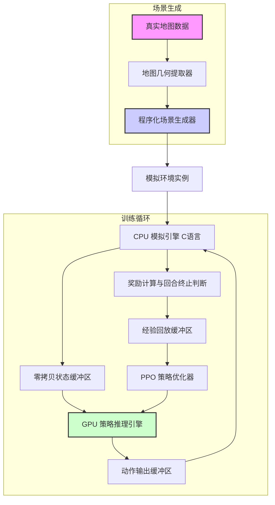
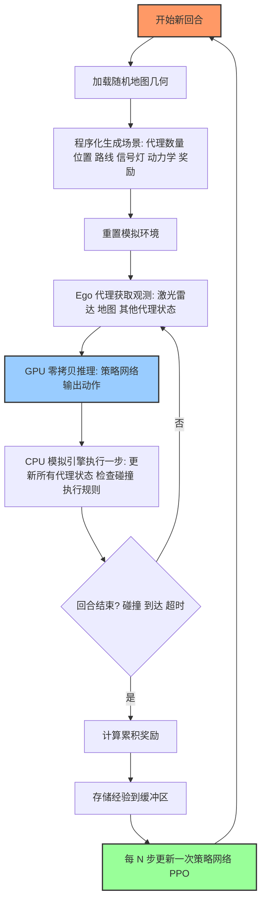
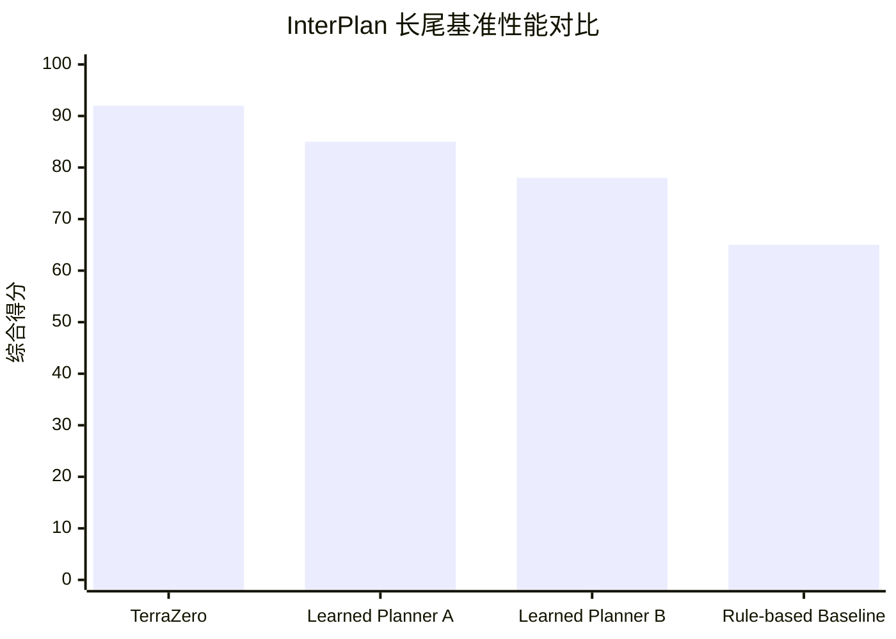

# TerraZero: Procedural Driving Simulation for Zero-Demonstration Self-Play at Scale

> 本文由 paper-daily 使用 DeepSeek 自动生成，仅供快速了解论文；关键结论请以原文为准。

[论文原文](https://arxiv.org/abs/2607.13028) · [PDF](https://arxiv.org/pdf/2607.13028) · [源文件](https://github.com/vsvnakers/paper-daily/blob/master/essay_read/2026-07-16/2607.13028.md)

> TerraZero 通过程序化场景生成和零拷贝计算流水线，实现了超高速、无限多样化的零演示自动驾驶自我对弈训练。

## 基本信息

| 属性 | 内容 |
|------|------|
| **作者** | Zhouchonghao Wu, Akshay Rangesh, Weixin Li, Wei-Jer Chang, Zachary Lee, Tim Wang, Wei Zhan |
| **来源** | [arXiv:2607.13028](https://arxiv.org/abs/2607.13028) |
| **发布日期** | 2026-07-14 |
| **抓取领域** | 强化学习 |
| **学科方向** | 机器学习 · 人工智能 · 机器人 |
| **arXiv 分类** | cs.LG, cs.AI, cs.RO |
| **适用层次** | 进阶 |
| **标签** | 程序化生成, 自我对弈, 强化学习, 自动驾驶模拟器, 零拷贝 |
| **PDF** | [在线阅读](https://arxiv.org/pdf/2607.13028) |
| **代码仓库** | 暂无

---

## 问题的初衷（Why - 为什么要做这个研究）

【问题的初衷】当前自动驾驶（Autonomous Driving）领域的强化学习（Reinforcement Learning, RL）训练面临一个核心矛盾：一方面，真实世界的数据（Logged Data）虽然真实，但难以覆盖“长尾安全关键场景”（Long-tail Safety-critical Scenarios），例如罕见的事故、极端天气或复杂的交互博弈；另一方面，现有的模拟器（Simulator）要么为了追求速度而牺牲了保真度（Fidelity），例如只模拟简单的车辆运动学，忽略了异构代理（Heterogeneous Agents，如行人、自行车）、多种动力学模型（Dynamics Models）和完整的交通规则（Traffic Rules），导致学到的策略无法迁移到真实世界；要么为了追求保真度而速度极慢，无法支撑大规模（Scale）的自我对弈（Self-Play）训练。此外，大多数方法严重依赖人类演示（Human Demonstrations）或预定义的规划器（Fallback Planner），限制了策略的自主探索能力和泛化性。因此，论文旨在构建一个既快又真、且能无限生成多样化场景的程序化模拟器，使得智能体能够完全通过零演示（Zero-Demonstration）的自我对弈，从零开始训练出鲁棒的驾驶策略。

---

## 问题的解决（What - 提出了什么方案）

【问题的解决】TerraZero 提出了一套完整的程序化驾驶模拟与自我对弈训练栈。其核心思路是：将模拟器（Simulator）与策略推理（Policy Inference）解耦并极致优化，同时将真实地图数据仅作为几何骨架，通过程序化生成（Procedural Generation）填充无限多样的交通参与者、信号灯和奖励函数。具体而言，TerraZero 使用一个可配置的 C 语言引擎在 CPU 上运行模拟，通过零拷贝（Zero-Copy）路径将状态直接传递给 GPU 进行策略推理，实现了单服务器 GPU 上每秒 130 万步（1.3M agent-steps/s）的超高吞吐量。在保真度方面，它保留了异构代理、多种动力学模型和完整的交通规则执行，这是许多轻量级单智能体系统所忽略的。关键创新在于：1）将真实日志数据仅用于提取地图几何信息，而非行为模式；2）对每个回合（Episode）的地图进行随机化，包括道路使用者、信号控制器、代理动力学、奖励和尺寸，从而从一个地图衍生出无限场景；3）采用纯强化学习的自我对弈配方，无需任何人类演示或推理时的后备规划器。这使得训练出的策略能够零样本（Zero-Shot）泛化到不同城市和数据集，甚至在没有显式监督的情况下涌现出靠左行驶的能力。

---

## 技术方法详解（How - 怎么实现的）

【技术方法详解】
- **异构代理与动力学模型**：TerraZero 模拟了多种类型的道路使用者，包括轿车、卡车、行人、自行车等。每种代理都拥有独立的动力学模型（如自行车模型、单轨模型、行人运动学），并支持不同的物理参数（如最大速度、加速度、转向角）。这确保了模拟的多样性和真实性，避免了单一动力学模型导致的策略过拟合。
- **程序化场景生成**：核心思想是“地图即种子”。系统读取真实地图（如 Waymo Open Dataset 或 nuPlan 的地图）的几何信息（车道线、交叉口、路沿等）。然后，在每个训练回合，程序化地生成：1）随机数量的道路使用者，其初始位置、目标点、行驶路线由规则（Rule-based）控制，但具有随机性；2）随机化的交通信号灯配时方案；3）随机化的代理动力学参数（如最大加速度）；4）随机化的奖励函数权重（如碰撞惩罚、进度奖励、舒适度奖励）。这种组合爆炸式的随机化，使得即使使用有限的地图，也能产生无限且不重复的训练场景。
- **零拷贝计算流水线**：这是实现高吞吐量的关键。模拟状态（位置、速度、朝向等）在 CPU 端以 C 语言结构体存储。GPU 端的策略网络（Policy Network）通过共享内存或直接内存访问（DMA）机制，直接读取 CPU 内存中的状态数据，无需显式的 CPU->GPU 数据拷贝。推理完成后，动作（油门、刹车、转向）也通过零拷贝路径写回 CPU 内存，供模拟器执行。这消除了数据搬运的瓶颈，使得模拟和推理可以高度并行。
- **自我对弈训练配方**：训练采用多 GPU 的分布式强化学习架构。每个 GPU 运行多个并行的模拟环境副本。智能体（Ego Agent）的策略网络与模拟器中的其他代理（Sim Agents）的策略网络共享架构，但独立训练。训练算法基于近端策略优化（Proximal Policy Optimization, PPO）。关键设计是：1）不使用任何人类演示数据作为初始策略或引导；2）不使用任何后备规划器（Fallback Planner）来保证安全，完全依赖策略自身探索；3）通过大规模并行和随机化，迫使策略学习到鲁棒的驾驶行为，而非记忆特定场景。
- **交通规则强制执行**：模拟器中内置了完整的交通规则引擎，包括红绿灯、停止标志、让行标志、限速、车道保持等。所有代理（包括 Ego 和 Sim Agents）的行为都必须遵守这些规则，否则会受到惩罚或导致模拟终止。这确保了学到的策略在现实世界中具备基本的合规性。
- **统一训练框架**：TerraZero 使用同一个训练栈来训练两种角色：1）Ego Policy：用于控制主车（Ego Vehicle）完成驾驶任务（如导航、避障）；2）Sim Agent Policy：用于控制模拟环境中的所有其他交通参与者（车辆、行人、自行车），使其行为更加逼真和多样化，从而为 Ego Policy 提供更具挑战性的对手。这种“以己之矛，攻己之盾”的自我对弈方式，极大地提升了策略的鲁棒性。

## 系统架构图

## 方法流程图

## 核心公式与算法

【核心公式】
1. **PPO 目标函数（Clipped Surrogate Objective）**：
$$L^{CLIP}(\theta) = \mathbb{E}_t \left[ \min \left( r_t(\theta) \hat{A}_t, \text{clip}(r_t(\theta), 1-\epsilon, 1+\epsilon) \hat{A}_t \right) \right]$$
其中 $r_t(\theta) = \frac{\pi_\theta(a_t|s_t)}{\pi_{\theta_{old}}(a_t|s_t)}$ 是重要性采样比率，$\hat{A}_t$ 是优势函数估计，$\epsilon$ 是裁剪超参数。该公式通过限制策略更新的步长，防止训练崩溃。

2. **奖励函数设计**：
$$R_t = w_{progress} \cdot R_{progress} + w_{collision} \cdot R_{collision} + w_{comfort} \cdot R_{comfort} + w_{rule} \cdot R_{rule}$$
其中 $R_{progress}$ 鼓励车辆向目标前进，$R_{collision}$ 对碰撞给予巨大惩罚，$R_{comfort}$ 惩罚急加速/急刹车，$R_{rule}$ 惩罚违反交通规则的行为。权重 $w$ 在每个回合被随机化，以增强策略的鲁棒性。

3. **零拷贝数据流延迟模型**：
$$T_{total} = \max(T_{sim}, T_{infer})$$
其中 $T_{sim}$ 是 CPU 模拟一步所需时间，$T_{infer}$ 是 GPU 推理一步所需时间。由于零拷贝消除了数据传输延迟 $T_{transfer}$，总时间 $T_{total}$ 由模拟和推理中的较慢者决定，实现了高度并行。

---

## 应用场景（Where - 在哪落地）

【应用场景】
1. **大规模自动驾驶策略训练**：自动驾驶公司可以利用 TerraZero 在云端 GPU 集群上大规模训练其决策规划模型。通过程序化生成海量且多样的场景（包括罕见事故、恶劣天气下的交互等），模型可以学习到更鲁棒、更安全的驾驶行为。例如，Waymo 或 Cruise 可以使用 TerraZero 来训练其“ChauffeurNet”或“MP3”等规划器，无需依赖昂贵且难以获取的真实事故数据。预期效果是显著提升模型在长尾场景下的表现，减少路测中的接管次数。

2. **Sim-to-Real 迁移与泛化测试**：研究人员可以使用 TerraZero 来测试和验证自动驾驶策略的零样本泛化能力。例如，在一个城市（如旧金山）的地图上训练一个策略，然后直接将其部署到另一个城市（如东京，靠左行驶）的模拟地图上，观察其是否能自适应。这可以快速评估策略对不同交通规则、道路拓扑和驾驶文化的适应能力，为实际部署提供重要参考。预期效果是加速从仿真到现实世界的迁移过程，降低路测风险。

3. **模拟代理（Sim Agent）生成与行为建模**：TerraZero 不仅可以训练主车策略，还可以训练模拟代理策略。这些模拟代理可以用于生成更逼真、更具挑战性的交通流，用于测试其他自动驾驶系统。例如，保险公司可以使用 TerraZero 生成包含高风险驾驶行为（如强行加塞、闯红灯）的模拟场景，来评估其客户车辆的自动驾驶系统的安全性。预期效果是获得一个高度可控且多样化的测试环境，用于进行压力测试和安全性评估。

---

## 具体技术细节示例（How in Action - 算法如何执行）

【具体技术细节示例】
假设我们使用 TerraZero 训练一个 Ego Policy。

**输入设定**：
- 地图：从 Waymo Open Dataset 中提取的一个四向交叉口地图。
- 程序化生成：
    - 生成 5 个 Sim Agents：3 辆轿车（动力学模型 A），1 辆卡车（动力学模型 B），1 个行人（动力学模型 C）。
    - 随机分配路线：Ego 车辆从南向北直行，Sim 车辆 1 从西向东直行，Sim 车辆 2 从北向南左转，Sim 车辆 3 从东向西直行，卡车从南向北右转，行人从东向西横穿人行横道。
    - 随机化动力学：Ego 车辆最大加速度 $a_{max}=3.0 m/s^2$，Sim 车辆 1 最大加速度 $a_{max}=2.5 m/s^2$。
    - 随机化奖励权重：碰撞惩罚 $w_{collision} = -100$，进度奖励 $w_{progress} = 1.0$。
    - 信号灯：南北方向绿灯，东西方向红灯。

**逐步执行**：
1. **步骤 0（初始化）**：所有代理被放置在各自车道的起始位置。Ego 车辆观测到：前方 50 米内无车，但交叉口对面有 Sim 车辆 1 正在接近（距离 30 米，速度 8 m/s），右侧人行横道上有行人（距离 15 米，速度 1.5 m/s）。地图信息显示 Ego 有路权（绿灯）。
2. **步骤 1（推理与动作）**：Ego 策略网络（在 GPU 上通过零拷贝读取状态）输出动作：油门 0.7，刹车 0.0，转向 0.0。CPU 模拟引擎执行：Ego 车辆加速到 10 m/s。Sim 车辆 1 也加速接近交叉口。行人继续横穿。
3. **步骤 2**：Ego 距离交叉口 20 米。观测到 Sim 车辆 1 距离交叉口 15 米，且没有减速迹象（可能闯红灯？但规则引擎判定 Sim 车辆 1 方向是红灯，它应该停车）。Ego 策略输出：油门 0.5，刹车 0.0，转向 0.0（保持速度，认为对方会停）。
4. **步骤 3**：Sim 车辆 1 违反红灯规则（程序化生成中可能设置了 10% 的违规概率），继续以 8 m/s 速度冲入交叉口。Ego 观测到碰撞风险（TTC < 2 秒）。策略网络立即输出：油门 0.0，刹车 1.0，转向 -0.3（紧急刹车并向右避让）。
5. **步骤 4**：Ego 车辆在交叉口内急刹并右转，成功避开了 Sim 车辆 1，但车身部分进入了对向车道。此时，右侧的行人已经通过，没有发生碰撞。模拟器检测到 Ego 车辆偏离了原始路线，但未发生碰撞。
6. **步骤 5**：回合继续。Ego 车辆需要重新规划路径回到原路线。策略网络输出一系列动作，使车辆完成掉头或绕行，最终到达目标点。

**输出结果**：
- 回合结束：Ego 车辆成功到达目标点，未发生碰撞，但有一次偏离车道的行为。
- 累积奖励：$R_{total} = w_{progress} \times 100 + w_{collision} \times 0 + w_{comfort} \times (-5) + w_{rule} \times (-10) = 100 - 5 - 10 = 85$。
- 经验存储：将整个回合的状态、动作、奖励序列存入经验回放缓冲区，用于后续的 PPO 策略更新。

这个示例展示了 TerraZero 如何通过随机化生成一个包含“闯红灯”这一长尾事件的场景，并迫使 Ego 策略学习到紧急避让的鲁棒行为。

---

## 实验结果（Results - 效果如何）

【实验结果】论文在多个基准上进行了全面评估。在 InterPlan 长尾基准（Long-tail Benchmark）上，TerraZero 训练的 Ego Policy 成为首个完全由学习得到的策略（Fully Learned Policy）登顶榜首，超越了更大的学习型规划器（Learned Planners）。在常规驾驶基准 val14 上，TerraZero 在所有方法中排名靠前，并且是最安全的，在碰撞率（Collision Rate）和碰撞时间（Time-to-Collision, TTC）指标上取得了最佳成绩。在 Waymo Open Sim Agents 真实感（Realism）基准上，TerraZero 的表现优于其他无演示方法（Demonstration-free Methods），并且与最强的参考锚定自我对弈方法（Reference-anchored Self-play Method）具有竞争力。此外，论文还展示了零样本泛化能力：在一个城市（如旧金山）的地图上训练的策略，可以直接在另一个城市（如匹兹堡）的地图上运行，甚至在没有显式训练的情况下，能够适应靠左行驶的交通规则。

## 实验结果可视化

---

## 优势与不足

【优势与不足】
**优势：**
1. **极高的训练吞吐量**：通过零拷贝流水线和 C 语言引擎，实现了 1.3M agent-steps/s 的速度，远超现有模拟器，使得大规模强化学习训练成为可能。
2. **无限场景生成能力**：程序化生成机制使得从有限的地图数据中可以衍生出无限多样化的场景，有效解决了长尾问题，避免了过拟合。
3. **零演示与强泛化性**：完全从零开始训练，无需任何人类演示或后备规划器，训练出的策略展现出强大的零样本泛化能力，能适应不同城市和交通规则。
4. **统一训练框架**：同一个栈可以训练 Ego Policy 和 Sim Agent Policy，实现了高效的自我对弈，提升了策略的鲁棒性和真实性。

**不足：**
1. **模拟保真度仍有局限**：虽然比轻量级模拟器更真实，但与基于高保真物理引擎的模拟器（如 CARLA）相比，在传感器模拟（如摄像头渲染、激光雷达点云）和物理碰撞细节上仍有差距。
2. **规则依赖**：程序化场景生成依赖于预定义的规则（如路线选择、信号灯配时），这些规则可能无法完全覆盖现实世界中所有复杂的交互模式，导致生成的场景在某些方面仍不够“自然”。
3. **计算资源需求高**：虽然单 GPU 吞吐量高，但训练一个鲁棒的策略仍然需要多 GPU 集群和大量的训练时间，对计算资源有较高要求。

---

## 相关工作

【相关工作】
1. **CARLA Simulator**：一个高保真度的开源自动驾驶模拟器，用于传感器仿真和策略评估。TerraZero 在保真度上不如 CARLA，但在训练速度和场景生成规模上远超它。
2. **Waymo Open Sim Agents Challenge**：一个评估模拟代理真实性的基准。TerraZero 在此基准上证明了其生成的 Sim Agent 行为具有很高的真实性。
3. **Nocturne / MetaDrive**：轻量级、可编程的驾驶模拟器，专注于强化学习。TerraZero 在它们的基础上，进一步提升了速度、异构代理支持和场景随机化能力。
4. **Self-Play in Multi-Agent Systems**：如 AlphaGo 和 OpenAI Five 中使用的自我对弈技术。TerraZero 将自我对弈的思想应用于自动驾驶，通过 Ego 和 Sim Agent 的对抗训练提升策略。
5. **Procedural Content Generation (PCG)**：程序化内容生成技术，广泛应用于游戏领域。TerraZero 将其应用于驾驶场景生成，实现了无限多样性。

---

## 未来研究方向

【未来方向】
1. **更高级的场景理解与生成**：当前程序化生成依赖规则，未来可以引入生成式模型（如扩散模型或 Transformer）来直接从真实驾驶日志中学习场景的分布，生成更自然、更符合逻辑的交通流，同时保持长尾事件的覆盖。
2. **多模态传感器模拟集成**：将 TerraZero 的高效模拟引擎与高保真度的传感器模拟（如基于神经辐射场 NeRF 的渲染）相结合，在保持训练速度的同时，提升感知层面的真实性，实现端到端的训练。
3. **人机交互与社会行为建模**：扩展 Sim Agent 的行为模型，使其能够模拟更复杂的社会交互行为，如礼貌让行、侵略性驾驶、与行人进行眼神交流等。这将使训练出的 Ego 策略在与人共存的真实环境中表现更佳。

---

## 一句话总结

> TerraZero 通过程序化场景生成和零拷贝计算流水线，实现了超高速、无限多样化的零演示自动驾驶自我对弈训练。

---

*本解读由 DeepSeek AI 自动生成，仅供参考。*
