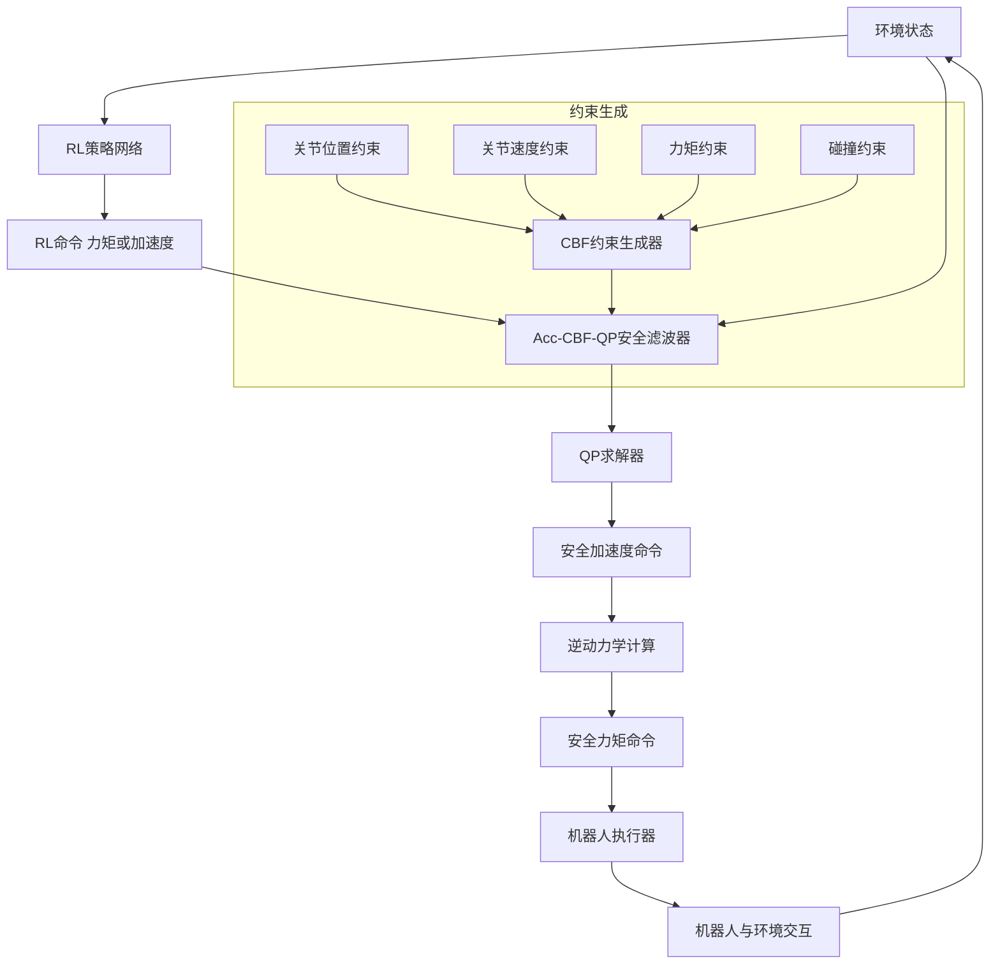
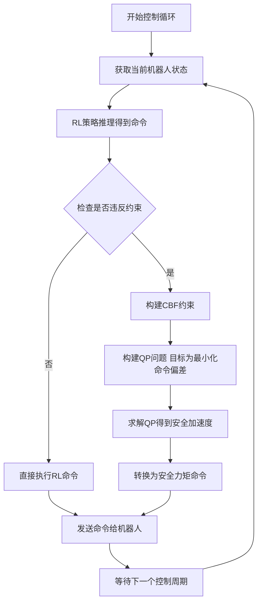
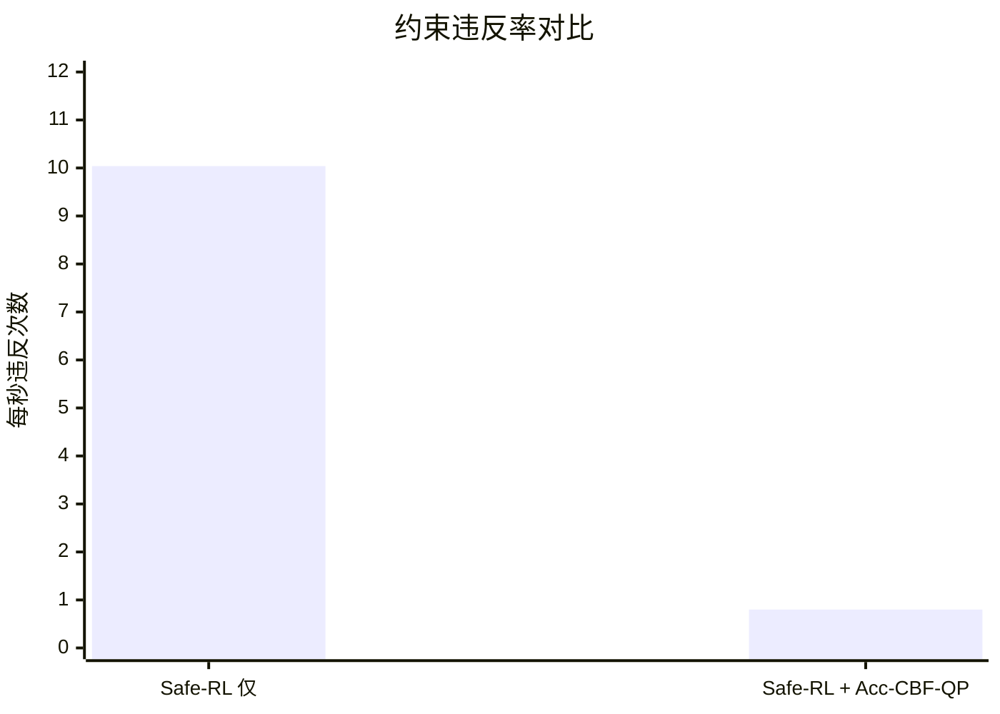

# Safe Execution of RL Policies Via Acceleration-Based CBF-QP Constraint Enforcement for Real-World Robotic Deployments

> 本文由 paper-daily 使用 DeepSeek 自动生成，仅供快速了解论文；关键结论请以原文为准。

[论文原文](https://arxiv.org/abs/2607.14488) · [PDF](https://arxiv.org/pdf/2607.14488) · [源文件](https://github.com/vsvnakers/paper-daily/blob/master/essay_read/2026-07-17/2607.14488.md)

> 提出一种基于加速率CBF的QP安全滤波器，在不修改RL训练的前提下，运行时强制执行安全约束，显著降低真实机器人部署中的违规率。

## 基本信息

| 属性 | 内容 |
|------|------|
| **作者** | Bastien Muraccioli, Alice Cariou, Pierre-Alexandre Leziart, Mathieu Celerier, Arnaud Demont, Gentiane Venture, Mehdi Benallegue |
| **来源** | [arXiv:2607.14488](https://arxiv.org/abs/2607.14488) |
| **发布日期** | 2026-07-16 |
| **抓取领域** | 强化学习 |
| **学科方向** | 机器人 |
| **arXiv 分类** | cs.RO |
| **适用层次** | 进阶 |
| **标签** | 控制障碍函数, 二次规划, 安全强化学习, 机器人控制, 安全滤波器 |
| **PDF** | [在线阅读](https://arxiv.org/pdf/2607.14488) |
| **代码仓库** | 暂无

---

## 问题的初衷（Why - 为什么要做这个研究）

【问题的初衷】强化学习（Reinforcement Learning, RL）在解决复杂机器人控制问题（如四足机器人奔跑、机械臂精细操作）方面展现了卓越的能力。然而，RL 策略本质上是通过与环境的试错交互学习得到的，其行为在训练分布之外的状态下（out-of-distribution states）缺乏形式化的安全保障。在现实世界的机器人部署中，尤其是在腿足机器人（legged robots）和机械臂（manipulators）等常工作在安全关键边界（safety-critical boundaries）的系统上，这种安全性的缺失是致命的。例如，一个学习行走的机器人可能会因为遇到未预见的障碍物或地面打滑而摔倒，导致硬件损坏。现有的安全增强方法，如基于模型预测控制（Model Predictive Control, MPC）的安全滤波器，虽然能提供安全保障，但计算开销大，难以满足高动态任务的实时性要求。而一些 Safe-RL 方法，如约束马尔可夫决策过程（Constrained MDP, CMDP），虽然能在训练过程中引入安全约束，但往往需要修改训练过程，且无法保证在部署时对所有未预见情况的安全性。因此，迫切需要一种轻量级、可即插即用（plug-and-play）、且能在运行时（runtime）强制执行安全约束的方法，以弥合 RL 策略在仿真与真实世界部署之间的安全鸿沟。

---

## 问题的解决（What - 提出了什么方案）

【问题的解决】本文提出了一种名为 Acc-CBF-QP 的加速率基二次规划安全滤波器（acceleration-based Quadratic Program safety filter）。其核心思路是利用控制障碍函数（Control Barrier Functions, CBFs）将安全约束转化为一个二次规划（Quadratic Program, QP）问题，在运行时对任意 RL 策略的输出进行修正，确保机器人状态始终保持在安全集（safe set）内。关键创新点在于：1）将安全约束统一建模为关节加速度（joint acceleration）的线性不等式，从而构建了一个加速率基的 QP 问题，能够同时处理关节位置、速度、力矩和碰撞约束；2）提出了两种新的 QP 任务（Task）——力矩任务（TorqueTask）和前向动力学任务（Forward Dynamics Task），用于在约束冲突时，以最小化对原始 RL 命令的偏离为优化目标，从而在安全性与任务性能之间进行原则性的权衡（principled trade-off）。与现有方法（如直接修改 RL 奖励函数或使用 MPC 滤波器）的本质区别在于：Acc-CBF-QP 是一个后处理（post-processing）模块，无需修改 RL 训练过程，计算效率高（QP 求解速度快），且能提供形式化的安全保证（通过 CBF 理论保证状态不离开安全集）。

---

## 技术方法详解（How - 怎么实现的）

【技术方法详解】
- **核心框架：CBF-QP 安全滤波器**：该方法基于控制障碍函数（CBF）理论。CBF 是一个标量函数 $h(x)$，其定义的安全集为 $C = \{x \in \mathbb{R}^n : h(x) \geq 0\}$。通过强制 $\dot{h}(x) + \alpha h(x) \geq 0$（其中 $\alpha > 0$ 是增益），可以保证系统状态始终停留在安全集内。对于机器人系统，将 CBF 约束转化为关于控制输入（这里是关节加速度 $\ddot{q}$）的线性不等式。
- **统一约束建模**：论文将多种安全约束（关节位置、速度、力矩、碰撞）统一表示为关于关节加速度 $\ddot{q}$ 的线性不等式形式：$A_{\text{cbf}} \ddot{q} \leq b_{\text{cbf}}$。例如，关节位置约束 $q_{\text{min}} \leq q \leq q_{\text{max}}$ 可以通过 CBF 转化为 $\ddot{q}$ 的约束。碰撞约束通过构建机器人与障碍物之间的 CBF 来实现。
- **QP 问题构建**：安全滤波器的核心是求解一个 QP 问题，其目标是最小化与原始 RL 命令的偏差，同时满足 CBF 约束。
    - **TorqueTask**：最小化与 RL 策略输出的关节力矩命令 $\tau_{\text{RL}}$ 的偏差。目标函数为 $\min_{\ddot{q}} || \tau(\ddot{q}) - \tau_{\text{RL}} ||^2$，其中 $\tau(\ddot{q})$ 是通过逆动力学（Inverse Dynamics）从 $\ddot{q}$ 计算得到的实际力矩。
    - **Forward Dynamics Task**：最小化与 RL 策略输出的加速度命令 $\ddot{q}_{\text{RL}}$ 的偏差。目标函数为 $\min_{\ddot{q}} || \ddot{q} - \ddot{q}_{\text{RL}} ||^2$。
- **QP 求解与执行**：在每个控制周期，求解器接收当前状态 $x$ 和 RL 命令，构建 QP 问题并求解出最优的关节加速度 $\ddot{q}^*$。然后，通过逆动力学或前向动力学将其转换为关节力矩命令 $\tau^*$ 发送给机器人执行器。
- **与 Safe-RL 策略的兼容性**：该方法不仅适用于标准 RL 策略，也适用于 Safe-RL 策略（如 CMDP 训练的策略）。对于 Safe-RL 策略，Acc-CBF-QP 可以进一步减少其违反约束的次数，提供额外的安全层。

## 系统架构图

## 方法流程图

## 核心公式与算法

【核心公式】
1.  **CBF 约束条件**：为了保证状态 $x$ 始终在安全集 $C = \{x : h(x) \geq 0\}$ 内，需要满足：
    $$\dot{h}(x, u) + \alpha h(x) \geq 0$$
    其中 $\alpha > 0$ 是增益，$u$ 是控制输入。对于机器人系统，该约束可以转化为关于关节加速度 $\ddot{q}$ 的线性不等式。
2.  **TorqueTask 的 QP 问题**：
    $$\min_{\ddot{q}} || \tau(\ddot{q}) - \tau_{\text{RL}} ||^2$$
    $$\text{s.t.} \quad A_{\text{cbf}} \ddot{q} \leq b_{\text{cbf}}$$
    其中 $\tau(\ddot{q})$ 是通过逆动力学模型从 $\ddot{q}$ 计算出的力矩，$\tau_{\text{RL}}$ 是 RL 策略输出的力矩命令。
3.  **Forward Dynamics Task 的 QP 问题**：
    $$\min_{\ddot{q}} || \ddot{q} - \ddot{q}_{\text{RL}} ||^2$$
    $$\text{s.t.} \quad A_{\text{cbf}} \ddot{q} \leq b_{\text{cbf}}$$
    其中 $\ddot{q}_{\text{RL}}$ 是 RL 策略输出的加速度命令。

---

## 应用场景（Where - 在哪落地）

【应用场景】
1.  **人形机器人安全行走与避障**：在人形机器人（如 Unitree H1）上部署 RL 行走策略时，Acc-CBF-QP 可以作为安全守护程序。例如，当机器人遇到湿滑地面或突然出现的障碍物时，RL 策略可能会输出一个导致摔倒的步态。Acc-CBF-QP 会实时监测机器人的质心位置、关节角度和与障碍物的距离，通过 CBF 约束强制机器人调整步幅或改变落脚点，避免摔倒或碰撞。预期效果是显著提高人形机器人在非结构化环境中的鲁棒性和生存时间，使其能够安全地执行巡逻、搬运等任务。
2.  **协作机械臂安全操作**：在工业场景中，机械臂（如 Kinova Gen3）需要与人近距离协作。RL 策略可以优化抓取和放置效率，但可能忽略人的安全。Acc-CBF-QP 可以实时计算机械臂各关节与操作员身体之间的最小距离，并将其作为碰撞约束。当 RL 策略命令机械臂快速靠近操作员时，安全滤波器会介入，平滑地减速或改变轨迹，确保在任何情况下都不会发生碰撞。预期效果是实现安全的人机协作，无需降低机械臂的整体工作效率。
3.  **四足机器人高速奔跑中的安全控制**：四足机器人在高速奔跑时，其关节极易达到物理极限（如关节速度上限、力矩上限）。Acc-CBF-QP 可以将这些物理极限作为 CBF 约束。当 RL 策略输出一个过于激进的奔跑指令时，安全滤波器会实时调整关节加速度，确保关节速度和力矩始终在安全范围内，从而防止电机过热或机械结构损坏。预期效果是让四足机器人能够以更接近物理极限的速度安全奔跑，同时避免因违反约束而导致的突然停机或硬件损坏。

---

## 具体技术细节示例（How in Action - 算法如何执行）

【具体技术细节示例】
假设我们有一个 1 自由度（DoF）的简单旋转关节机器人。其状态为 $x = [q, \dot{q}]^T$，其中 $q$ 是关节角度，$\dot{q}$ 是关节速度。
**设定输入**：
- 当前状态：$q = 1.5$ 弧度，$\dot{q} = 2.0$ 弧度/秒。
- 安全约束：关节角度上限 $q_{\text{max}} = 2.0$ 弧度。
- RL 策略命令：期望的关节加速度 $\ddot{q}_{\text{RL}} = 5.0$ 弧度/秒²。
- 控制周期 $\Delta t = 0.01$ 秒，CBF 增益 $\alpha = 10.0$。
**算法执行步骤**：
1.  **定义 CBF**：选择 $h(x) = q_{\text{max}} - q = 2.0 - q$。安全集为 $h(x) \geq 0$，即 $q \leq 2.0$。
2.  **计算 CBF 约束**：CBF 条件为 $\dot{h}(x) + \alpha h(x) \geq 0$。
    - $\dot{h}(x) = -\dot{q} = -2.0$。
    - $h(x) = 2.0 - 1.5 = 0.5$。
    - 约束变为：$-2.0 + 10.0 \times 0.5 \geq 0 \Rightarrow 3.0 \geq 0$。当前状态是安全的，但我们需要确保未来也安全。
    - 将约束转化为关于 $\ddot{q}$ 的形式。使用一阶欧拉近似预测下一时刻的状态：$q_{k+1} \approx q_k + \dot{q}_k \Delta t$，$\dot{q}_{k+1} \approx \dot{q}_k + \ddot{q} \Delta t$。
    - 对下一时刻应用 CBF 条件：$h(x_{k+1}) \geq 0 \Rightarrow q_{\text{max}} - (q_k + \dot{q}_k \Delta t) \geq 0$。但这不包含 $\ddot{q}$。更精确的做法是使用 $\dot{h}(x, \ddot{q})$ 的表达式。对于二阶系统，CBF 条件通常涉及 $\ddot{q}$。简化起见，我们直接对 $\dot{h}$ 进行约束：$\dot{h}(x_{k+1}) + \alpha h(x_{k+1}) \geq 0$。
    - 经过推导（论文中有详细公式），最终得到关于 $\ddot{q}$ 的线性不等式：$\ddot{q} \leq 3.0 / \Delta t - \alpha \dot{q} / \Delta t \approx 300 - 2000 = -1700$。这个约束非常严格，意味着需要很大的负加速度来减速。
3.  **构建 QP 问题**：使用 Forward Dynamics Task，目标函数为 $\min_{\ddot{q}} (\ddot{q} - 5.0)^2$，约束为 $\ddot{q} \leq -1700$。
4.  **求解 QP**：由于约束非常严格，最优解 $\ddot{q}^* = -1700$ 弧度/秒²。
5.  **输出**：安全滤波器输出的加速度命令为 $-1700$ 弧度/秒²，而不是 RL 命令的 $5.0$ 弧度/秒²。这个巨大的负加速度会迅速让关节减速，防止其超过 $q_{\text{max}}$。
**结果**：机器人关节不会超过 2.0 弧度的上限，从而保证了安全。

---

## 实验结果（Results - 效果如何）

【实验结果】论文在两个机器人平台上进行了实验：一个 7 自由度（DoF）的 Kinova Gen3 机械臂和一个 19 自由度的 Unitree H1 人形机器人。实验包括仿真和真实硬件部署。对比方法包括：无安全滤波器的原始 RL 策略（RL-Only）、Safe-RL 策略（如 CMDP 训练的策略）以及 Acc-CBF-QP 增强的策略。关键结果：1）在真实 H1 人形机器人上，Safe-RL 策略单独运行时每秒违反约束 10.04 次，而结合 Acc-CBF-QP 后，违反次数降至 0.80 次/秒，减少了 92%。2）在 Kinova Gen3 机械臂上，Acc-CBF-QP 完全消除了所有约束违反。3）在无约束违反的区域内，Acc-CBF-QP 几乎不改变原始 RL 策略的行为，保持了任务性能。4）在 H1 上施加激进的速度命令时，Acc-CBF-QP 通过防止因违反约束导致的系统停机，延长了机器人的生存时间（survival time）。

## 实验结果可视化

---

## 优势与不足

【优势与不足】
- **优势**：
    1.  **即插即用**：无需修改 RL 训练过程，可应用于任何现有策略，降低了部署门槛。
    2.  **形式化安全保证**：基于 CBF 理论，提供了数学上的安全保证，确保系统状态不离开安全集。
    3.  **计算高效**：QP 求解速度快，适用于高频率的实时控制循环（如 1kHz）。
    4.  **统一框架**：能够在一个优化问题中同时处理多种异构约束（位置、速度、力矩、碰撞）。
    5.  **原则性权衡**：通过 TorqueTask 和 Forward Dynamics Task 提供了在安全性和任务性能之间进行权衡的机制。
- **不足**：
    1.  **模型依赖**：方法依赖于精确的机器人动力学模型（逆动力学/前向动力学）和障碍物模型，模型误差会影响安全滤波器的效果。
    2.  **CBF 设计挑战**：对于复杂约束（如全身碰撞避免），设计有效的 CBF 函数可能比较困难，且 CBF 的增益参数 $\alpha$ 需要手动调节。
    3.  **局部最优**：QP 求解器找到的是局部最优解，在极端情况下，可能无法找到可行解（即 QP 无解），导致系统进入不安全状态。

---

## 相关工作

【相关工作】
1.  **控制障碍函数（Control Barrier Functions, CBFs）**：CBF 是本文的理论基石，相关工作包括 Ames 等人关于 CBF 在安全关键控制中的应用。
2.  **安全强化学习（Safe Reinforcement Learning）**：如约束马尔可夫决策过程（CMDP）和拉格朗日方法，本文的方法可以作为这些方法的补充，提供运行时安全保证。
3.  **模型预测控制（Model Predictive Control, MPC）**：MPC 也可作为安全滤波器，但计算开销更大。本文的 QP 方法更轻量。
4.  **二次规划（Quadratic Programming, QP）在机器人控制中的应用**：如基于 QP 的全身控制（Whole-Body Control, WBC），本文借鉴了其将任务和约束统一为 QP 问题的思想。
5.  **人形机器人控制**：本文在 Unitree H1 人形机器人上进行了验证，相关工作包括基于 RL 和基于模型的人形机器人行走和平衡控制。

---

## 未来研究方向

【未来方向】
1.  **学习型 CBF**：当前 CBF 需要手动设计，对于复杂约束（如全身避障）非常困难。未来可以研究使用神经网络学习 CBF，使其能够自动适应复杂环境。
2.  **与模型预测控制（MPC）的融合**：将 Acc-CBF-QP 的快速修正能力与 MPC 的预见性规划能力相结合。例如，使用 MPC 生成一个长期的参考轨迹，然后使用 CBF-QP 在短时间尺度上进行安全修正。
3.  **处理 QP 无解的情况**：当 QP 问题无解时，系统会陷入危险。未来可以研究一种“降级”策略，例如切换到更保守的控制器（如阻抗控制）或执行紧急停止程序，以确保在极端情况下的安全。

---

## 一句话总结

> 提出一种基于加速率CBF的QP安全滤波器，在不修改RL训练的前提下，运行时强制执行安全约束，显著降低真实机器人部署中的违规率。

---

*本解读由 DeepSeek AI 自动生成，仅供参考。*
