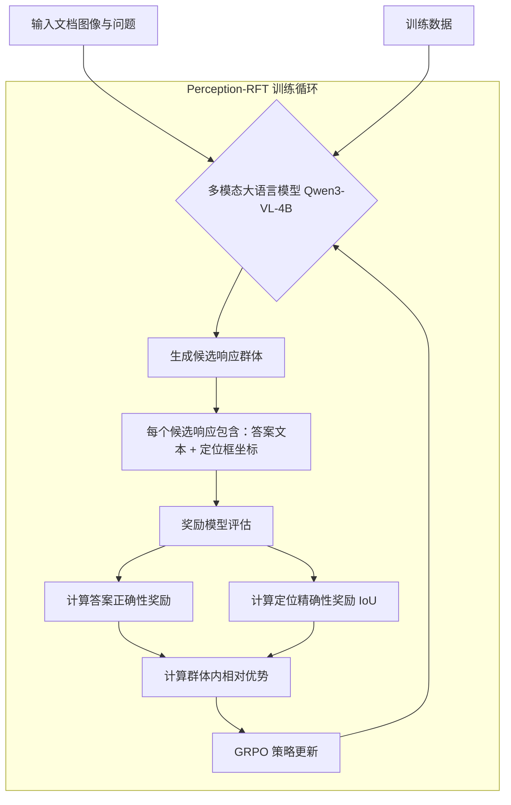
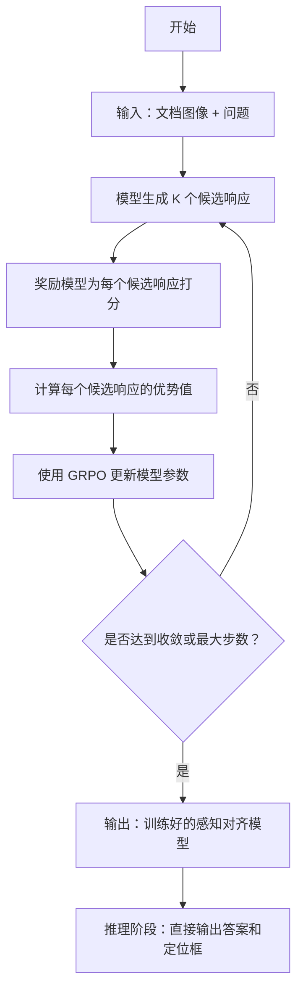
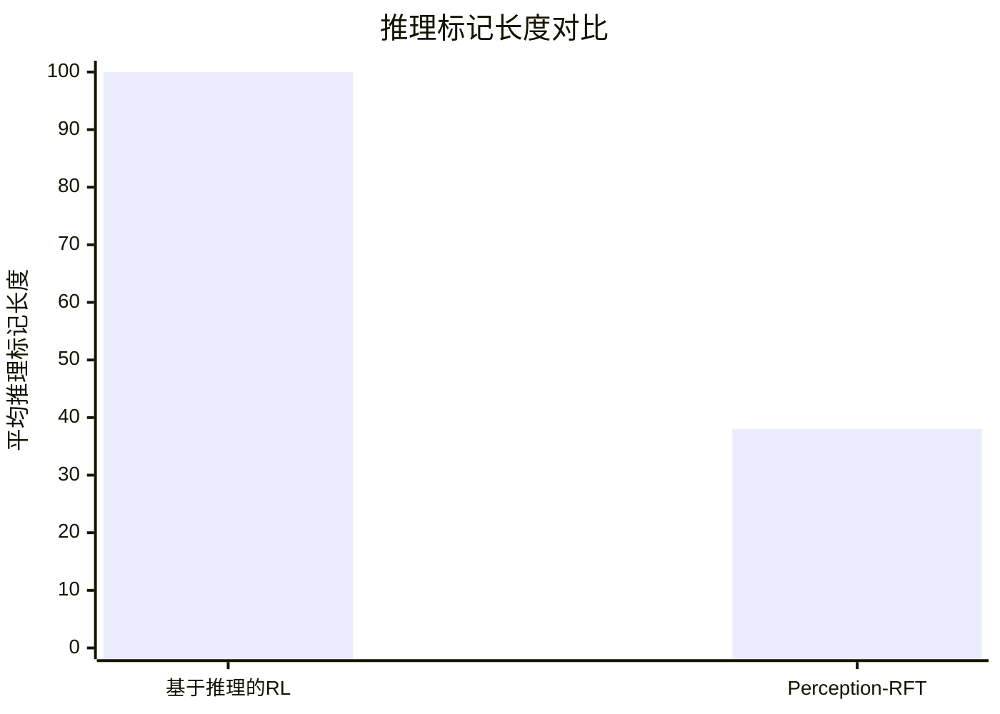

# Stop Thinking, Start Looking: Efficient Post-Training for Multimodal Document Question Answering via Reasoning-Free Alignment

> 本文由 paper-daily 使用 DeepSeek 自动生成，仅供快速了解论文；关键结论请以原文为准。

[论文原文](https://arxiv.org/abs/2607.14682) · [PDF](https://arxiv.org/pdf/2607.14682) · [源文件](https://github.com/vsvnakers/paper-daily/blob/master/essay_read/2026-07-17/2607.14682.md)

> 提出 Perception-RFT，通过无推理的 GRPO 训练，高效实现多模态文档问答中的显式视觉定位，大幅降低推理成本。

## 基本信息

| 属性 | 内容 |
|------|------|
| **作者** | Harikrishnan P M, Goutham Vignesh, Ganesh Parab, Saisubramaniam Gopalakrishnan, Vishal Vaddina, Varun V, Rohit Agrawal |
| **来源** | [arXiv:2607.14682](https://arxiv.org/abs/2607.14682) |
| **发布日期** | 2026-07-16 |
| **抓取领域** | 多模态/视觉-语言 |
| **学科方向** | 人工智能 · 自然语言处理 · 机器学习 |
| **arXiv 分类** | cs.AI, cs.CL, cs.LG |
| **适用层次** | 进阶 |
| **标签** | 多模态文档问答, 视觉定位, 群体相对策略优化, 无推理对齐, 高效训练 |
| **PDF** | [在线阅读](https://arxiv.org/pdf/2607.14682) |
| **代码仓库** | 暂无

---

## 问题的初衷（Why - 为什么要做这个研究）

【问题的初衷】这篇论文旨在解决多模态文档问答（Multimodal Document Question Answering）中的一个核心挑战：如何高效地实现显式视觉定位（Explicit Visual Grounding），即找到文档中支持每个答案的精确区域。当前主流方法分为两类：监督微调（Supervised Fine-Tuning, SFT）和基于推理的强化学习（Reasoning-centric Reinforcement Learning, RL）。SFT 方法需要大量人工标注的数据集，且容易陷入优化平台期（Optimization Plateau），即模型性能在达到一定水平后难以继续提升。而基于推理的 RL 方法，如使用思维链（Chain-of-Thought, CoT）或内部独白（Inner Monologue），虽然能提升推理能力，但会产生冗长的中间推理标记（Intermediate Reasoning Tokens），导致推理成本（Inference Token Cost）显著增加，且其带来的性能提升并不明确。因此，论文的核心动机是探索一种无需中间推理步骤、直接对齐视觉特征与结构化定位输出的高效训练方法，以解决现有方法在数据效率、训练成本和推理效率上的不足。

---

## 问题的解决（What - 提出了什么方案）

【问题的解决】论文提出了一个名为 Perception-RFT 的训练框架。其核心思路是应用群体相对策略优化（Group Relative Policy Optimization, GRPO）到多模态文档问答任务中，但关键创新在于**绕过了中间推理标记**，直接对齐视觉特征与结构化的定位输出。与现有方法不同，Perception-RFT 不要求模型先生成推理过程再给出答案，而是直接学习从视觉输入到答案和定位坐标的映射。为了严格评估推理的必要性，论文在完全相同的奖励设置下构建了一个推理变体（Reasoning Variant）。实验发现，启用推理的模型在训练过程中会主动抑制其推理痕迹，最终收敛到与直接感知策略（Perception-based Policy）几乎相同的策略，同时将每次查询的推理标记长度减少了超过 60%。更关键的是，基于推理的 RL 性能甚至不如纯感知训练。这有力地证明了在多模态文档定位任务中，复杂的推理过程并非必要，直接进行感知对齐更为高效。

---

## 技术方法详解（How - 怎么实现的）

【技术方法详解】
- **核心框架：群体相对策略优化（GRPO）**：Perception-RFT 基于 GRPO 算法。对于每个问题，模型生成一组候选答案（一个群体），每个答案包含文本回答和定位坐标。奖励模型（Reward Model）根据答案的正确性和定位的精确性为每个候选打分。GRPO 通过最大化群体内相对优势（Relative Advantage）来更新模型，鼓励生成高奖励的答案，抑制低奖励的答案。
- **无推理标记设计（Reasoning-Free Design）**：这是论文的核心创新。模型直接输出格式为“答案 [定位框]”的响应，其中定位框是四个坐标值（如 $x_1, y_1, x_2, y_2$），表示文档图像中的矩形区域。整个训练过程不引入任何“思考”、“分析”等中间推理标记。
- **推理变体构建（Reasoning Variant）**：为了对比，论文构建了推理变体。该变体在输出答案前，强制模型先生成一段“思考”过程（如“首先，我需要找到...然后...”），之后再输出答案和定位。两个变体使用完全相同的奖励函数和训练超参数，以确保对比的公平性。
- **奖励函数设计（Reward Function Design）**：奖励函数由两部分组成：1) **答案正确性奖励**：基于答案文本与标准答案的精确匹配或语义相似度；2) **定位精确性奖励**：基于预测定位框与真实定位框的交并比（Intersection over Union, IoU）。总奖励是这两部分的加权和。
- **冷启动策略（Cold-Start Strategy）**：论文发现直接从随机初始化的策略开始进行 RL 训练会导致不稳定。因此，他们采用了一个两阶段训练策略：首先使用少量 SFT 数据（约 35% 的标准数据量）进行预热，然后再切换到 RL 训练。这种 SFT→RL 的早期过渡策略在达到同等定位精度的同时，减少了 65% 的训练数据需求。

## 系统架构图

## 方法流程图

## 核心公式与算法

【核心公式】
论文的核心是 GRPO 的优化目标。对于一个给定的问题 $q$，模型 $\pi_{\theta}$ 生成一个包含 $G$ 个候选响应的群体 $\{o_1, o_2, ..., o_G\}$。每个响应 $o_i$ 的奖励由奖励模型 $R$ 给出。GRPO 的目标是最大化以下目标函数：

$$J_{GRPO}(\theta) = \mathbb{E}_{q \sim P(Q), \{o_i\}_{i=1}^G \sim \pi_{\theta_{old}}(O|q)} \left[ \frac{1}{G} \sum_{i=1}^G \min\left( \frac{\pi_{\theta}(o_i|q)}{\pi_{\theta_{old}}(o_i|q)} A_i, \text{clip}\left( \frac{\pi_{\theta}(o_i|q)}{\pi_{\theta_{old}}(o_i|q)}, 1-\epsilon, 1+\epsilon \right) A_i \right) - \beta \cdot \text{KL}(\pi_{\theta} || \pi_{\text{ref}}) \right]$$

其中：
- $\pi_{\theta}$ 是当前策略，$\pi_{\theta_{old}}$ 是旧策略，用于采样。
- $A_i$ 是第 $i$ 个候选响应的优势值，通常通过群体内奖励的标准化计算：$A_i = \frac{R(o_i) - \text{mean}(\{R(o_j)\})}{\text{std}(\{R(o_j)\})}$。
- $\epsilon$ 是裁剪超参数，用于限制策略更新的幅度，防止训练不稳定。
- $\beta$ 是 KL 散度惩罚项的系数，用于约束当前策略 $\pi_{\theta}$ 与参考策略 $\pi_{\text{ref}}$（通常是初始策略）的差异，防止策略退化。

奖励函数 $R(o_i)$ 的具体形式为：
$$R(o_i) = R_{\text{ans}}(o_i) + \lambda \cdot R_{\text{loc}}(o_i)$$
其中 $R_{\text{ans}}$ 是答案正确性奖励，$R_{\text{loc}}$ 是定位精确性奖励（如预测框与真实框的 IoU），$\lambda$ 是平衡系数。

---

## 应用场景（Where - 在哪落地）

【应用场景】
1. **智能文档处理与分析**：在企业级应用中，如合同审查、发票处理、财务报表分析等，需要从大量文档中提取关键信息并定位其来源。Perception-RFT 技术可以训练一个高效的模型，直接输出“金额：$1000 [坐标框]”这样的结果，无需冗长的推理过程。这能大幅提升文档自动化处理的速度和准确性，降低人工审核成本。例如，在保险理赔处理中，系统可以快速定位到保单中的关键条款和数字，并给出精确的引用位置。

2. **交互式教育辅助系统**：在数字教育领域，学生可以针对教材、习题册或课件中的内容提问。使用 Perception-RFT 训练的模型能够快速理解问题，并在文档图像中精确圈出答案所在区域（如一个公式、一段定义或一个图表）。由于推理延迟极低，系统可以提供近乎实时的反馈，提升学习体验。例如，学生问“勾股定理的公式是什么？”，模型能立即在教材页面上高亮显示 $a^2 + b^2 = c^2$ 及其所在位置。

3. **自动化客户服务与知识库检索**：在客服场景中，用户的问题往往需要从产品手册、FAQ 文档或政策文件中查找答案。Perception-RFT 可以构建一个高效的文档问答机器人，它不仅能给出答案，还能在原文中标注出答案的出处，增加回答的可信度和可追溯性。例如，用户询问“退货政策是什么？”，机器人回答“您可以在购买后 30 天内退货”，并同时在政策文档的相应段落上画一个框。这种“答案+定位”的模式能显著减少用户后续的确认成本。

---

## 具体技术细节示例（How in Action - 算法如何执行）

【具体技术细节示例】
假设我们有一个文档图像，上面显示一张表格，其中一行是“产品A，价格：$100”。用户的问题是：“产品A的价格是多少？”

**设定：**
- 输入：文档图像 + 问题“产品A的价格是多少？”
- 真实答案：$100
- 真实定位框：[x1=0.2, y1=0.5, x2=0.35, y2=0.55]（假设图像坐标归一化到 0-1）
- 模型：Qwen3-VL-4B，使用 Perception-RFT 训练
- 群体大小 G=4

**算法执行步骤：**
1. **生成候选响应群体**：模型为问题生成 4 个候选响应。
   - 候选1: “$100 [0.21, 0.51, 0.34, 0.54]”
   - 候选2: “$100 [0.19, 0.49, 0.36, 0.56]”
   - 候选3: “$99 [0.22, 0.52, 0.33, 0.53]”
   - 候选4: “$100 [0.5, 0.2, 0.6, 0.3]”

2. **奖励模型评估**：
   - **答案正确性奖励**：候选1、2、4的答案“$100”正确，得1分；候选3的答案“$99”错误，得0分。
   - **定位精确性奖励**：计算每个候选框与真实框的 IoU。
     - 候选1 IoU = 0.85 → 奖励 0.85
     - 候选2 IoU = 0.70 → 奖励 0.70
     - 候选3 IoU = 0.80 → 奖励 0.80
     - 候选4 IoU = 0.00 → 奖励 0.00
   - **总奖励**（假设 $\lambda=1$）：
     - 候选1: 1 + 0.85 = 1.85
     - 候选2: 1 + 0.70 = 1.70
     - 候选3: 0 + 0.80 = 0.80
     - 候选4: 1 + 0.00 = 1.00

3. **计算优势值**：
   - 平均奖励 = (1.85 + 1.70 + 0.80 + 1.00) / 4 = 1.3375
   - 标准差 ≈ 0.44
   - 候选1优势 = (1.85 - 1.3375) / 0.44 ≈ 1.16
   - 候选2优势 = (1.70 - 1.3375) / 0.44 ≈ 0.82
   - 候选3优势 = (0.80 - 1.3375) / 0.44 ≈ -1.22
   - 候选4优势 = (1.00 - 1.3375) / 0.44 ≈ -0.77

4. **GRPO 策略更新**：
   - 模型参数 $\theta$ 会朝着增加高优势候选（如候选1）生成概率的方向更新，同时降低低优势候选（如候选3）的生成概率。
   - 裁剪机制和 KL 散度惩罚会确保更新幅度稳定，不会偏离参考策略太远。

5. **输出**：经过多轮这样的训练迭代后，模型学会了生成类似候选1的响应，即直接输出正确的答案和精确的定位框，而无需任何中间推理步骤。在推理时，模型会直接输出“$100 [0.21, 0.51, 0.34, 0.54]”，高效且准确地回答了问题。

---

## 实验结果（Results - 效果如何）

【实验结果】论文在多个多模态文档问答基准数据集上进行了实验，包括 DocVQA、InfographicsVQA 和 ChartQA 等。主要对比方法包括：1) 标准 SFT；2) 基于推理的 RL（如使用 CoT 的 GRPO）；3) 论文提出的 Perception-RFT。关键实验结果如下：1) **推理标记减少**：与基于推理的 RL 相比，Perception-RFT 将每次查询的推理标记长度减少了超过 60%，显著降低了推理成本。2) **性能对比**：在 4B 参数规模的模型上，Perception-RFT 在多个指标上（如 ANLS、IoU）与基于推理的 RL 性能相当，甚至更优。3) **SFT 饱和与冷启动不稳定**：论文验证了 SFT 在达到一定性能后会饱和，而直接从零开始 RL 训练不稳定。4) **定位发散现象**：论文发现了一个新现象——定位发散（Grounding Divergence），即在联合 RL 优化下，模型在语义鲁棒性和几何精度之间出现选择性权衡，这在两个分布外（OOD）基准测试（共 4,828 个样本）上表现明显。5) **数据效率**：早期 SFT→RL 过渡策略在仅使用 65% 训练数据的情况下，达到了与完整训练相当的定位精度。

## 实验结果可视化

---

## 优势与不足

【优势与不足】
**优势：**
1. **高效推理**：通过消除中间推理标记，显著降低了推理时的计算成本和延迟，提升了实际部署的可行性。
2. **数据高效**：提出的早期 SFT→RL 过渡策略大幅减少了所需训练数据量，降低了对昂贵标注数据的依赖。
3. **性能优越**：在同等或更少数据下，达到了与复杂推理方法相当甚至更优的定位性能，证明了“感知优先”策略的有效性。
4. **深入分析**：论文不仅提出了方法，还通过严谨的消融实验和对比分析，揭示了 SFT 饱和、冷启动不稳定和定位发散等关键现象，为后续研究提供了重要洞察。

**潜在不足：**
1. **任务局限性**：该方法主要针对显式视觉定位任务，对于需要复杂多步推理的问答（如数学推理、常识推理）可能不适用，其“无推理”设计在这些场景下可能成为短板。
2. **奖励函数设计依赖**：方法的成功高度依赖于精心设计的奖励函数，特别是定位精确性奖励（IoU）。对于更复杂的定位任务（如不规则形状区域），如何设计有效的奖励函数仍是一个挑战。

---

## 相关工作

【相关工作】
1. **多模态大语言模型（MLLMs）**：如 Qwen-VL、LLaVA 等，为本研究提供了基础模型架构。本文在其基础上探索了高效的定位训练方法。
2. **强化学习在 NLP 中的应用**：特别是群体相对策略优化（GRPO），最初用于文本领域的推理任务。本文将其创新性地应用于多模态定位任务，并去除了推理组件。
3. **监督微调（SFT）**：传统方法，需要大量标注数据。本文指出了其优化平台期问题，并提出了更高效的 RL 替代方案。
4. **视觉定位（Visual Grounding）**：旨在将文本描述与图像中的特定区域关联起来。本文专注于文档场景下的定位，并提出了新的训练范式。
5. **思维链（Chain-of-Thought）推理**：一种提升模型推理能力的技术。本文通过实验质疑了其在多模态定位任务中的必要性，并展示了其带来的成本问题。

---

## 未来研究方向

【未来方向】
1. **扩展到更复杂的定位任务**：当前方法主要处理矩形框定位。未来可以探索如何将其扩展到不规则形状（如多边形）或像素级分割掩码的定位，这需要设计新的奖励函数和输出格式。
2. **动态推理路径选择**：虽然本文证明了无推理的有效性，但某些任务可能确实需要推理。未来可以研究一个元控制器，根据任务难度动态决定是否启用推理路径，从而在效率和性能之间取得最佳平衡。
3. **跨模态对齐的泛化性研究**：论文发现了“定位发散”现象。未来可以深入研究这一现象的成因，并探索更鲁棒的联合优化策略，以提升模型在不同分布数据上的泛化能力。

---

## 一句话总结

> 提出 Perception-RFT，通过无推理的 GRPO 训练，高效实现多模态文档问答中的显式视觉定位，大幅降低推理成本。

---

*本解读由 DeepSeek AI 自动生成，仅供参考。*
