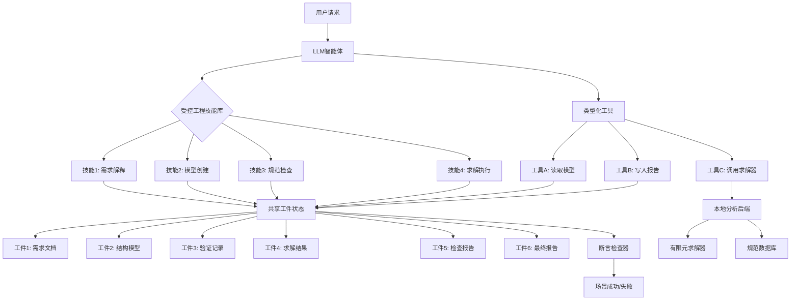
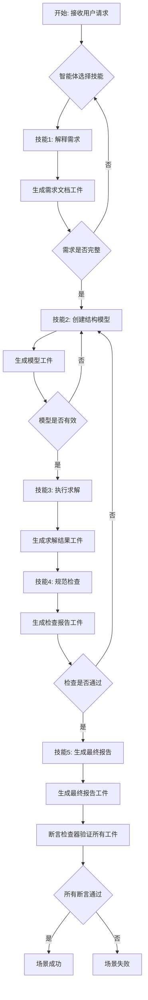

# StructureClaw: Traceable LLM Agents and an Executable Benchmark for Structural Engineering Workflows

> 本文由 paper-daily 使用 DeepSeek 自动生成，仅供快速了解论文；关键结论请以原文为准。

[论文原文](https://arxiv.org/abs/2607.14896) · [PDF](https://arxiv.org/pdf/2607.14896) · [源文件](https://github.com/vsvnakers/paper-daily/blob/master/essay_read/2026-07-17/2607.14896.md)

> StructureClaw通过工件中心化评估和可执行基准，严格验证LLM智能体在结构工程工作流中的完整性和可执行性。

## 基本信息

| 属性 | 内容 |
|------|------|
| **作者** | Sizhong Qin, Yi Gu, Yao Jiang, Ao Cai, Changjian Zhou, Shaoxuan Shuai, Jiachang Wang, Tianhao Shen, Yueqiang Li, Xinhao Li, Li Zeng, Yueshi Chen, Dachen Gao, Genrong Xu, Wenjie Liao, Xinzheng Lu |
| **来源** | [arXiv:2607.14896](https://arxiv.org/abs/2607.14896) |
| **发布日期** | 2026-07-16 |
| **抓取领域** | 体系结构/硬件加速 |
| **学科方向** | 软件工程 · 人工智能 · cs.MA |
| **arXiv 分类** | cs.SE, cs.AI, cs.MA |
| **适用层次** | 前沿 |
| **标签** | LLM智能体, 结构工程, 工件中心化评估, 可执行基准, 工作流验证 |
| **PDF** | [在线阅读](https://arxiv.org/pdf/2607.14896) |
| **代码仓库** | 暂无

---

## 问题的初衷（Why - 为什么要做这个研究）

【问题的初衷】这篇论文旨在解决大型语言模型（LLM）在结构工程（Structural Engineering）领域应用中的一个核心问题：现有评估方法过于关注最终答案的正确性（如问答或脚本生成），而忽视了结构工程工作流（Workflow）的完整性和可执行性。结构工程请求（如设计一个桥梁或建筑结构）不仅仅是得到一个单一答案，而是需要生成一系列相互依赖的工件（Artifacts），包括：解释后的需求、可计算模型、验证记录、求解器输出、规范检查记录和最终报告。现有的基于问答或脚本生成的基准（Benchmark）无法验证这个完整的证据链（Evidence Chain），因此可能奖励那些输出流畅但底层工作流不完整、内部不一致或不可执行的LLM智能体（Agent）。这导致LLM在真实的结构工程场景中难以可靠地应用，因为一个看似合理的最终答案可能基于错误的中间步骤或缺失的关键工件。研究的动机是建立一个更严格、更全面的评估框架，确保LLM智能体不仅能生成文本，还能执行完整、一致且可验证的工程工作流。

---

## 问题的解决（What - 提出了什么方案）

【问题的解决】论文提出了StructureClaw，一个以工件为中心（Artifact-Centered）的工作台（Workbench），用于评估和改进结构工程领域的LLM智能体。其核心思路是：将结构工程工作流分解为一系列受控的工程技能（Governed Engineering Skills）、类型化工具（Typed Tools）、共享工件状态（Shared Artifact State）和本地分析后端（Local Analysis Backends）。智能体必须通过调用这些工具和技能，逐步生成和操作工件，最终形成一个完整的、可执行的证据链。关键创新点包括：1）工件中心化评估：成功标准不是单个答案，而是所有必需工件和执行级断言（Assertions）在一次运行中全部通过。2）可执行基准（StructureClaw-Bench）：包含150个受控场景，涵盖标准工作流执行、交互式鲁棒性和多模态结构模型重建。3）受控工程技能：将工程知识编码为可调用的技能，确保智能体行为符合工程规范。与现有方法的本质区别在于，它从“答案正确性”转向“工作流完整性和可执行性”，从而暴露了仅从最终响应难以发现的流程级失败。

---

## 技术方法详解（How - 怎么实现的）

【技术方法详解】
- **工件中心化状态管理**：系统维护一个共享的工件状态（Shared Artifact State），存储所有中间和最终工件（如需求文档、模型文件、验证报告）。智能体通过类型化工具（Typed Tools）读写这个状态，确保数据的一致性和可追溯性。
- **受控工程技能库**：将结构工程知识（如规范检查、模型求解）封装为可调用的技能（Skills）。每个技能有明确的输入输出类型和前置条件，智能体不能随意执行，必须遵循预定义的工程流程。
- **类型化工具系统**：工具（Tools）被严格类型化，例如“创建模型”工具只能接受特定格式的输入，并生成特定类型的模型工件。这防止了智能体产生格式错误或不兼容的数据。
- **本地分析后端**：集成真实的结构分析引擎（如有限元分析求解器）作为后端，用于执行计算和验证。智能体不能伪造结果，必须通过调用后端获取真实输出。
- **多模态输入处理**：支持从文本、图像（如结构图纸）等多模态输入中重建结构模型，扩展了智能体的应用范围。
- **断言驱动的评估**：每个场景定义了一组断言（Assertions），包括工件存在性断言（如“必须有模型文件”）和执行结果断言（如“模型求解收敛”）。只有所有断言通过，场景才算成功。


## 系统架构图




## 方法流程图




## 核心公式与算法

【核心公式】论文没有显式的数学公式，但核心评估逻辑可以形式化为：

$$\text{Success}(S) = \bigwedge_{a \in A_S} \text{Pass}(a)$$

其中，$S$ 是一个场景，$A_S$ 是该场景的所有断言集合，$\text{Pass}(a)$ 表示断言 $a$ 是否通过。场景成功当且仅当所有断言都通过。

另一个关键概念是工作流完整性：

$$\text{Complete}(W) = \forall t \in T_W, \exists a_t \in A_W$$

其中，$W$ 是一个工作流，$T_W$ 是工作流中所有必需的任务类型，$a_t$ 是对应于任务 $t$ 的工件。工作流完整当且仅当每个必需任务都产生了对应的工件。


---

## 应用场景（Where - 在哪落地）

【应用场景】
1. **自动化结构设计审查**：在建筑公司中，工程师可以使用StructureClaw智能体自动处理结构设计请求。例如，输入一个建筑草图，智能体可以：解释需求、创建有限元模型、运行分析、检查是否符合建筑规范（如中国《建筑结构荷载规范》GB 50009），并生成审查报告。这大大减少了人工审查时间，提高了准确性，并确保所有步骤都有记录可查。
2. **结构健康监测报告生成**：对于桥梁或大坝等基础设施，传感器数据需要被解释为结构状态报告。StructureClaw智能体可以接收传感器数据（多模态输入），重建结构模型，运行损伤识别算法，生成包含验证记录和修复建议的报告。这确保了从数据到决策的完整证据链，提高了决策的可靠性。
3. **教育培训中的结构工程作业评估**：在土木工程课程中，学生提交的结构设计作业（包括模型、计算书等）可以由StructureClaw智能体自动评估。智能体不仅检查最终答案，还验证工作流是否完整（如是否进行了规范检查），从而提供更全面的反馈，帮助学生理解工程流程的重要性。


---

## 具体技术细节示例（How in Action - 算法如何执行）

【具体技术细节示例】假设有一个标准工作流场景：用户请求“设计一个简支梁，跨度6米，均布荷载10 kN/m，使用Q235钢，按中国规范GB 50017-2017进行设计”。

**步骤1：需求解释**
智能体调用“解释需求”技能，生成需求文档工件：
- 结构类型：简支梁
- 跨度：6米
- 荷载：均布荷载10 kN/m
- 材料：Q235钢
- 规范：GB 50017-2017

**步骤2：模型创建**
智能体调用“创建模型”工具，输入需求文档，生成结构模型工件（如JSON格式）：
```json
{
  "type": "beam",
  "span": 6.0,
  "loads": [{"type": "uniform", "value": 10.0}],
  "material": "Q235",
  "section": null
}
```
注意：截面尺寸尚未指定，需要后续步骤确定。

**步骤3：执行求解**
智能体调用“执行求解”工具，将模型发送到本地有限元求解器。求解器返回最大弯矩和剪力：
- 最大弯矩：$M_{max} = \frac{10 \times 6^2}{8} = 45 \text{ kN·m}$
- 最大剪力：$V_{max} = \frac{10 \times 6}{2} = 30 \text{ kN}$

**步骤4：规范检查**
智能体调用“规范检查”技能，根据GB 50017-2017，计算所需截面模量：
- 所需截面模量：$W_{req} = \frac{M_{max}}{f} = \frac{45 \times 10^6}{215} \approx 209,302 \text{ mm}^3$
智能体选择工字钢I20a（截面模量$W_x = 237,000 \text{ mm}^3$），检查通过。

**步骤5：生成最终报告**
智能体生成包含所有工件（需求文档、模型、求解结果、检查记录）的最终报告。

**断言检查**：断言检查器验证所有工件存在且内容正确（如模型中的截面已更新为I20a），场景成功。


---

## 实验结果（Results - 效果如何）

【实验结果】论文在StructureClaw-Bench上评估了10种不同的智能体-模型配置。基准数据集包含150个受控场景，分为三组：50个标准工作流执行场景、50个交互式鲁棒性场景和50个多模态结构模型重建场景。对比方法包括一个通用技能基线（Generic-Skill Baseline）和完整的自动工作流（Full Automatic Workflow）。关键实验结果：在50个标准案例上，平均成功率（Success Rate）从通用技能基线的56.8%提升到完整自动工作流的88.6%，提升了31.8个百分点。交互式和多模态评估揭示了两个主要挑战：安全处理无效数值输入和保持结构模型重建的固定一致性（Fixture-Consistent Reconstruction）。这些结果表明，以工件为中心的评估能够暴露仅从最终响应难以识别的流程级失败。


## 实验结果可视化

```mermaid
xychart-beta
    title "标准工作流执行成功率对比"
    x-axis ["通用技能基线", "完整自动工作流"]
    y-axis "成功率 (%)" 0 to 100
    bar [56.8, 88.6]
```


---

## 优势与不足

【优势与不足】
**优势：**
1. **工件中心化评估**：提供了比传统问答更严格的评估标准，确保工作流完整性和可执行性，避免了“流畅但错误”的输出。
2. **可执行基准**：150个受控场景覆盖了标准、交互和多模态场景，为结构工程LLM智能体提供了全面的测试平台。
3. **受控工程技能**：将工程知识编码为可调用的技能，提高了智能体行为的可预测性和符合性，减少了幻觉（Hallucination）风险。

**不足：**
1. **场景覆盖有限**：150个场景虽然多样，但可能无法覆盖所有真实世界的结构工程复杂性，如极端荷载组合或非常规材料。
2. **依赖本地后端**：需要集成真实的分析引擎，增加了部署复杂性和计算成本，可能不适合轻量级应用。
3. **交互式鲁棒性不足**：实验表明智能体在处理无效数值输入时仍存在困难，需要进一步改进错误处理机制。

---

## 相关工作

【相关工作】
1. **LLM智能体框架（如AutoGPT、LangChain）**：这些框架提供了通用智能体能力，但缺乏领域特定的工件管理和验证机制。StructureClaw在此基础上增加了结构工程领域的约束。
2. **代码生成与验证（如Codex、AlphaCode）**：关注生成可执行代码，但结构工程工作流涉及多种工件类型（模型、报告），不仅仅是代码。
3. **工程领域专用LLM（如StructGPT）**：针对结构工程进行微调，但评估仍基于问答，未验证完整工作流。StructureClaw提供了更严格的评估。
4. **多模态LLM（如GPT-4V）**：支持图像输入，但StructureClaw将其应用于结构模型重建，并增加了固定一致性约束。
5. **工作流管理系统（如Apache Airflow）**：用于编排任务，但缺乏LLM智能体的灵活性和领域知识。StructureClaw结合了LLM的灵活性和工作流的严谨性。

---

## 未来研究方向

【未来方向】
1. **扩展到多学科工程**：将StructureClaw框架扩展到其他工程领域（如机械工程、电气工程），每个领域定义自己的工件类型和技能库，形成通用的工程智能体评估平台。
2. **增强交互式鲁棒性**：研究如何让智能体更好地处理无效输入，例如通过引入错误恢复机制（如回滚到上一个有效状态）或主动请求用户澄清，而不是直接失败。
3. **集成更复杂的多模态输入**：除了图像，还可以集成点云数据（如3D扫描）或手绘草图，实现更灵活的结构模型重建，并研究如何保持几何和拓扑一致性。


---

## 一句话总结

> StructureClaw通过工件中心化评估和可执行基准，严格验证LLM智能体在结构工程工作流中的完整性和可执行性。

---

*本解读由 DeepSeek AI 自动生成，仅供参考。*
