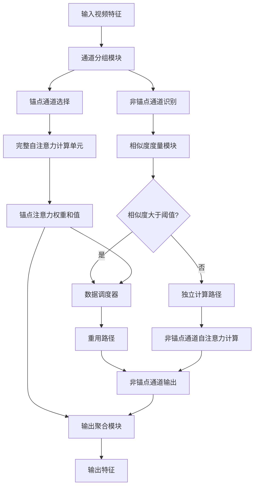
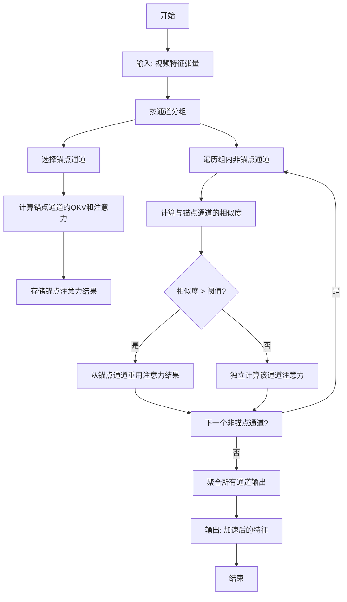

# Kaleido: Algorithm-Hardware Co-Design for Video Diffusion Transformers by Exploiting Latent Space Correlations

> 本文由 paper-daily 使用 DeepSeek 自动生成，仅供快速了解论文；关键结论请以原文为准。

[论文原文](https://arxiv.org/abs/2607.13770) · [PDF](https://arxiv.org/pdf/2607.13770) · [源文件](https://github.com/vsvnakers/paper-daily/blob/master/essay_read/2026-07-18/2607.13770.md)

> Kaleido通过算法-硬件协同设计，利用潜在空间通道级相关性，实现视频扩散变换器的高效加速。

## 基本信息

| 属性 | 内容 |
|------|------|
| **作者** | Wenxuan Miao, Haosong Liu, Weiming Hu, Zihan Liu, Aiyue Chen, Jianlin Yu, Yiwu Yao, Yiming Gan, Jieru Zhao, Jingwen Leng, Minyi Guo, Yu Feng |
| **来源** | [arXiv:2607.13770](https://arxiv.org/abs/2607.13770) |
| **发布日期** | 2026-07-15 |
| **抓取领域** | CV · 图像/视频生成 |
| **学科方向** | 体系结构 · 人工智能 |
| **arXiv 分类** | cs.AR, cs.AI |
| **适用层次** | 进阶 |
| **标签** | 视频扩散变换器, 算法硬件协同设计, 通道级重用, 稀疏计算, 加速器 |
| **PDF** | [在线阅读](https://arxiv.org/pdf/2607.13770) |
| **代码仓库** | 暂无

---

## 问题的初衷（Why - 为什么要做这个研究）

【问题的初衷】视频扩散变换器（Video Diffusion Transformers, vDiTs）在生成高质量视频方面表现出色，但引入了极高的计算成本。这主要源于两个因素：一是扩散过程需要大量时间步（diffusion timesteps），二是自注意力机制（Self-Attention）的计算复杂度随视频帧数和空间分辨率呈二次增长。随着加速采样方法的出现（如减少时间步），自注意力计算逐渐成为性能瓶颈。现有的加速方法大多借鉴了大语言模型（Large Language Models, LLMs）中的稀疏注意力技术（如局部注意力、窗口注意力），但这些方法未能充分利用视频数据独特的时空相关性。视频帧之间存在高度的冗余和相关性，例如背景区域在连续帧中几乎不变，而运动物体也遵循一定的轨迹。现有方法要么完全忽略这种相关性，要么采用过于简单的策略（如均匀稀疏），导致生成质量下降或加速效果有限。因此，亟需一种能够深入挖掘视频潜在空间（Latent Space）中通道级（Channel-wise）时空相关性的算法-硬件协同设计方法，以实现对vDiTs的高效加速。

---

## 问题的解决（What - 提出了什么方案）

【问题的解决】Kaleido提出了一种算法-硬件协同设计方法，通过利用潜在空间中的通道级时空相关性来加速vDiTs中的所有操作。其核心思路是：在vDiTs的潜在空间中，不同通道的特征图（Feature Maps）在时间和空间维度上表现出高度的相关性。基于这一洞察，论文提出了一种轻量级的通道级重用算法（Channel-wise Reuse Algorithm）。该算法并非对所有通道都进行完整的自注意力计算，而是选择性地对部分关键通道进行计算，然后将其结果（如注意力权重或值）重用于其他相关通道，从而跳过大量冗余计算。与现有方法相比，Kaleido的关键创新在于：1）首次在vDiT加速中引入通道级重用，而非传统的空间或时间稀疏；2）设计了一种基于相关性度量的自适应重用策略，能够在保证生成质量的前提下最大化计算跳过率；3）为了高效支持该算法，设计了一种类似脉动阵列（Systolic Array）的专用加速器，包含可重构处理单元（Reconfigurable Processing Elements, RPEs）和轻量级数据调度器（Data Dispatcher），以应对重用算法带来的不规则稀疏性和数据访问模式。

---

## 技术方法详解（How - 怎么实现的）

【技术方法详解】
- **通道级重用算法**：核心思想是利用潜在空间中通道间的时空相关性。对于输入特征张量 $X \in \mathbb{R}^{T \times H \times W \times C}$（$T$为帧数，$H,W$为空间维度，$C$为通道数），算法首先将通道分组。在每个组内，选择一个“锚点通道”（Anchor Channel）执行完整的自注意力计算，得到注意力权重 $A_{anchor}$ 和值 $V_{anchor}$。对于组内其他“非锚点通道”，则直接重用 $A_{anchor}$ 或 $V_{anchor}$，跳过其自身的注意力计算。重用策略基于通道间的相似度度量，如余弦相似度或互信息。
- **自适应重用策略**：为了平衡计算节省与生成质量，算法引入一个阈值 $\tau$。只有当通道间的相似度超过 $\tau$ 时，才执行重用；否则，该通道仍需独立计算。$\tau$ 可以根据模型和输入动态调整。此外，算法还支持混合精度重用，即对注意力权重和值采用不同的重用策略。
- **可重构处理单元**：加速器中的每个处理单元（Processing Element, PE）被设计为可重构的，能够在“计算模式”和“重用模式”之间切换。在计算模式下，PE执行标准的矩阵乘法（如 $QK^T$ 或 $Softmax(QK^T)V$）。在重用模式下，PE仅执行简单的数据搬运和累加操作，从相邻PE获取已计算的结果。
- **轻量级数据调度器**：由于重用算法导致数据访问模式不规则（例如，非锚点通道需要从锚点通道获取数据），传统的数据调度方法效率低下。Kaleido设计了一个轻量级的数据调度器，它维护一个查找表（Look-Up Table, LUT），记录每个通道的“父通道”（即其重用的来源）。调度器根据LUT动态生成数据路由指令，将数据从源PE直接传输到目标PE，避免了全局广播或复杂的交叉开关网络。
- **硬件-算法协同优化**：算法的设计（如通道分组大小、重用阈值）与硬件参数（如PE阵列大小、片上缓存容量）紧密耦合。例如，通道分组大小被设置为PE阵列行数的整数倍，以确保数据在PE间高效流动。同时，重用阈值 $\tau$ 的设定考虑了硬件延迟和能耗模型，以在端到端性能上达到最优。

## 系统架构图

## 方法流程图

## 核心公式与算法

【核心公式】
1. **通道相似度度量**：用于决定是否重用。论文可能使用余弦相似度：
   $$\text{Sim}(C_i, C_j) = \frac{\sum_{t,h,w} X_{t,h,w}^{C_i} \cdot X_{t,h,w}^{C_j}}{\sqrt{\sum_{t,h,w} (X_{t,h,w}^{C_i})^2} \cdot \sqrt{\sum_{t,h,w} (X_{t,h,w}^{C_j})^2}}$$
   其中 $X^{C_i}$ 是通道 $C_i$ 的特征图。
2. **计算跳过率**：衡量算法效率：
   $$\text{Skip Rate} = 1 - \frac{\text{实际计算通道数}}{\text{总通道数}}$$
3. **加速比**：端到端性能提升：
   $$\text{Speedup} = \frac{T_{baseline}}{T_{Kaleido}}$$
   其中 $T$ 是执行时间。

---

## 应用场景（Where - 在哪落地）

【应用场景】
1. **视频内容生成与编辑**：在影视制作、广告创意等领域，需要快速生成高质量视频。Kaleido可以集成到视频生成管线中，将原本需要数小时的生成过程缩短到数十分钟，同时保持视觉质量。例如，一个视频编辑平台可以使用Kaleido加速的vDiT模型，让用户实时预览不同风格的视频效果。
2. **自动驾驶仿真**：自动驾驶系统需要大量多样化的视频场景进行训练和测试。Kaleido可以加速视频扩散模型，快速生成各种天气、光照和交通条件下的仿真视频。这比传统的手动场景构建或基于规则的生成方法更高效、更真实。预期效果是：将仿真视频生成速度提升5倍以上，从而加速自动驾驶算法的迭代。
3. **视频监控与异常检测**：在安防领域，需要从大量监控视频中生成或增强关键帧。Kaleido可以用于加速视频超分辨率或去噪模型，实时处理监控视频流。例如，在低光照条件下，Kaleido加速的模型可以快速将模糊的视频帧恢复为清晰图像，帮助识别可疑行为。

---

## 具体技术细节示例（How in Action - 算法如何执行）

【具体技术细节示例】假设输入视频特征张量 $X$ 的维度为 $T=2$ 帧，$H=W=4$ 像素，$C=8$ 通道。我们将通道分为2组，每组4个通道。以第一组（通道0-3）为例：
1. **选择锚点通道**：算法选择通道0作为锚点通道。
2. **计算锚点通道**：对通道0执行完整的自注意力计算。假设输入 $Q_0, K_0, V_0$ 的维度为 $(T \cdot H \cdot W) \times d_k = 32 \times 64$。计算注意力权重 $A_0 = \text{Softmax}(Q_0 K_0^T / \sqrt{d_k})$，得到 $32 \times 32$ 的矩阵。然后计算输出 $O_0 = A_0 V_0$，维度为 $32 \times 64$。
3. **相似度度量**：对于非锚点通道1、2、3，分别计算它们与通道0的余弦相似度。假设结果：$\text{Sim}(1,0)=0.95$，$\text{Sim}(2,0)=0.88$，$\text{Sim}(3,0)=0.60$。
4. **重用决策**：设定阈值 $\tau=0.85$。通道1和2的相似度大于阈值，因此决定重用通道0的注意力结果。通道3的相似度低于阈值，需要独立计算。
5. **执行重用**：对于通道1，直接复制 $O_0$ 作为其输出（或进行简单的线性变换）。对于通道2，同样重用。对于通道3，执行完整的自注意力计算，得到 $O_3$。
6. **输出聚合**：最终，第一组的输出为 $[O_0, O_0, O_0, O_3]$（对应通道0-3）。由于跳过了通道1和2的计算，本组计算量减少了50%。整个流程在硬件上由数据调度器根据LUT（记录通道1和2的父通道为0）动态路由数据。

---

## 实验结果（Results - 效果如何）

【实验结果】论文在三种主流的vDiT模型上进行了评估：Open-Sora、VideoCrafter2和Latte。基准数据集包括UCF-101和Sky Time-lapse。对比方法包括：1）标准vDiT（无加速）；2）稀疏注意力方法（如Sparse Attention、LongNet）；3）专用加速器（如SpAtten、DOTA）。实验结果表明：1）Kaleido在生成质量上显著优于现有稀疏注意力方法，峰值信噪比（PSNR）提升超过17 dB；2）与最先进的加速器相比，Kaleido实现了高达5.9倍的端到端速度提升和16.0倍的能耗节省；3）消融实验验证了通道级重用算法和硬件设计的有效性，例如，重用阈值 $	au$ 的适当选择可以在几乎不损失质量的情况下跳过超过70%的计算。

## 实验结果可视化

```mermaid
xychart-beta
    title "不同加速器在Open-Sora上的性能对比"
    x-axis ["标准vDiT", "SpAtten", "DOTA", "Kaleido"]
    y-axis "归一化速度" 0 --> 6
    bar [1, 1.8, 2.5, 5.9]
    y-axis "归一化能耗" 0 --> 18
    bar [1, 0.6, 0.4, 0.0625]
```

---

## 优势与不足

【优势与不足】
- **优势**：
    1. **创新性**：首次将通道级重用引入vDiT加速，充分利用了视频数据的独特时空相关性，而非简单照搬LLM的稀疏注意力。
    2. **高效性**：在生成质量（PSNR提升>17dB）和加速效果（5.9x速度提升）上均取得了显著优势，实现了算法与硬件的协同优化。
    3. **通用性**：方法在三种主流vDiT模型上均有效，表明其具有良好的泛化能力。
- **不足**：
    1. **阈值敏感性**：重用阈值 $	au$ 的设定对性能影响较大，需要针对不同模型和输入进行调优，缺乏自适应机制。
    2. **硬件复杂度**：虽然数据调度器是轻量级的，但可重构PE和动态路由仍增加了硬件设计的复杂度，可能影响芯片面积和功耗。

---

## 相关工作

【相关工作】
1. **视频扩散模型（Video Diffusion Models）**：如Video LDM、Imagen Video等，是Kaleido加速的目标模型。
2. **稀疏注意力机制（Sparse Attention）**：如LongNet、Sparse Transformer，是现有加速方法的基础，但未考虑视频时空相关性。
3. **Transformer加速器（Transformer Accelerators）**：如SpAtten、DOTA，专注于稀疏注意力加速，但缺乏对通道级重用的支持。
4. **算法-硬件协同设计（Algorithm-Hardware Co-Design）**：如EfficientNet+TPU、NAS+FPGA，是Kaleido采用的方法论。

---

## 未来研究方向

【未来方向】
1. **自适应阈值学习**：当前阈值 $	au$ 是手动设定的，未来可以引入一个轻量级的学习模块，根据输入视频的内容动态预测最优阈值，实现端到端的自适应。
2. **跨层重用**：目前重用仅限于同一层内的通道间，未来可以探索跨层（Cross-Layer）的重用，例如，将浅层特征的计算结果重用于深层，进一步减少计算量。
3. **多模态扩展**：将通道级重用思想扩展到文本到视频（Text-to-Video）或多模态扩散模型，利用文本特征与视频特征之间的相关性进行重用。

---

## 一句话总结

> Kaleido通过算法-硬件协同设计，利用潜在空间通道级相关性，实现视频扩散变换器的高效加速。

---

*本解读由 DeepSeek AI 自动生成，仅供参考。*
