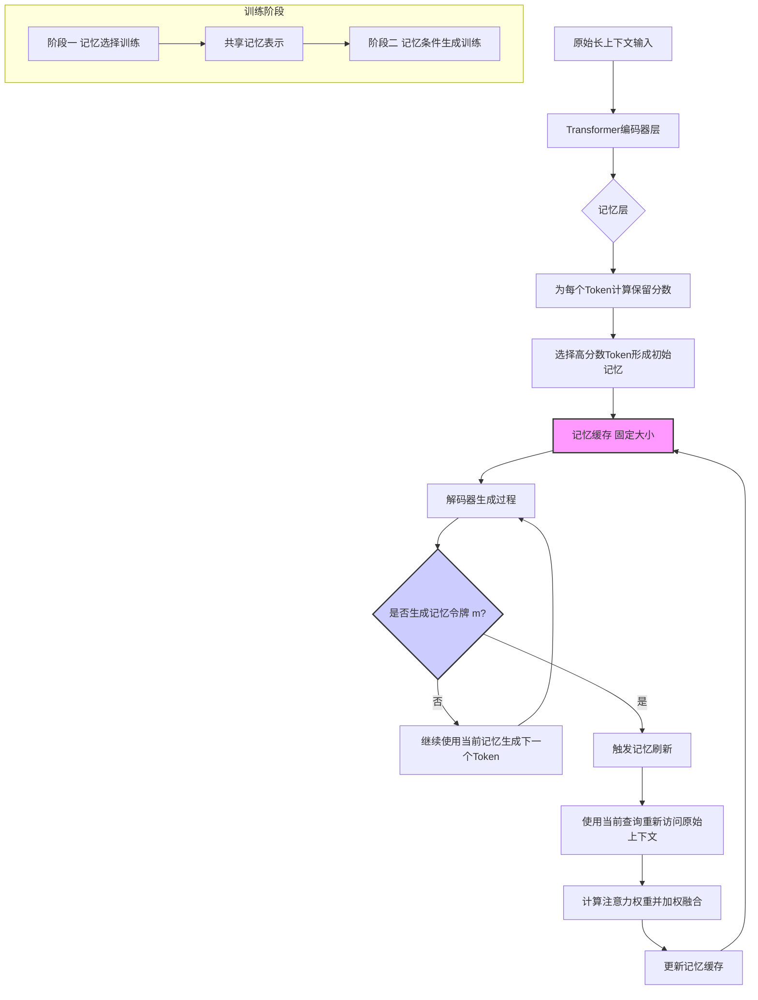
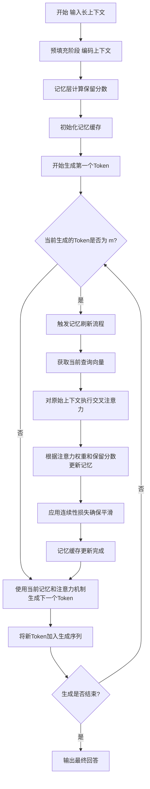
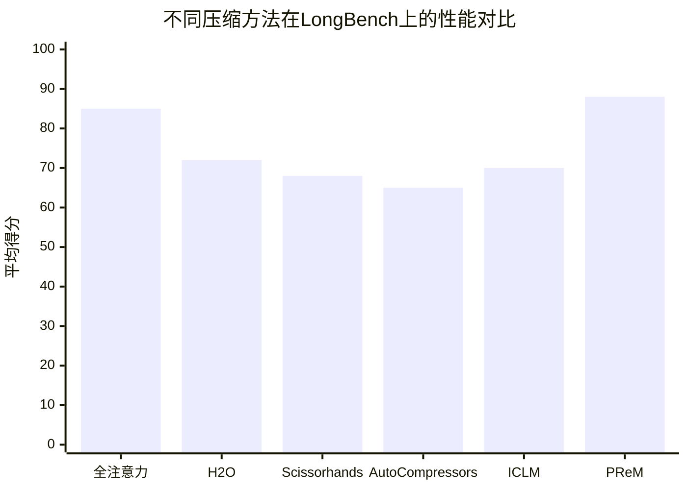

# PReM: Learning What to Preserve and When to Refresh for Context Compression

> 本文由 paper-daily 使用 DeepSeek 自动生成，仅供快速了解论文；关键结论请以原文为准。

[论文原文](https://arxiv.org/abs/2607.14327) · [PDF](https://arxiv.org/pdf/2607.14327) · [源文件](https://github.com/vsvnakers/paper-daily/blob/master/essay_read/2026-07-18/2607.14327.md)

> PReM通过让模型自主决定保留什么和何时刷新，实现了长上下文推理中内存效率与推理质量的动态平衡。

## 基本信息

| 属性 | 内容 |
|------|------|
| **作者** | Bohan Yu, Lei Shen, Chenxi Zhou, Chen Han, Junlin Liu, Wenbo Su, Yu Cheng, Bo Zheng |
| **来源** | [arXiv:2607.14327](https://arxiv.org/abs/2607.14327) |
| **发布日期** | 2026-07-15 |
| **抓取领域** | LLM推理 · 内存与加速 |
| **学科方向** | 自然语言处理 · 人工智能 |
| **arXiv 分类** | cs.CL, cs.AI |
| **适用层次** | 进阶 |
| **标签** | 上下文压缩, 动态记忆管理, KV缓存优化, 长上下文推理, 生成式AI |
| **PDF** | [在线阅读](https://arxiv.org/pdf/2607.14327) |
| **代码仓库** | 暂无

---

## 问题的初衷（Why - 为什么要做这个研究）

【问题的初衷】大型语言模型（Large Language Model, LLM）在处理长上下文推理（long-context inference）时面临严峻挑战。核心问题不仅在于存储大量上下文信息（如键值缓存 Key-Value Cache, KV Cache）所带来的高昂内存成本，更在于如何在整个生成过程中，始终让模型能够访问到对当前推理步骤有用的上下文证据。现有的压缩方法主要分为两类：一是KV缓存压缩（KV Cache Compression），它在预填充（prefill）阶段就决定哪些历史信息被保留，这导致模型无法根据后续生成的查询（query）动态调整需要关注的信息；二是上下文压缩（Context Compression），它通常依赖一个外部的压缩器（compressor）来生成压缩后的上下文表示，但这种方法割裂了压缩过程与生成过程，使得压缩后的上下文难以适应推理过程中不断变化的信息需求。因此，现有方法在压缩率和推理质量之间难以取得良好平衡，尤其是在高压缩率下，关键证据的丢失会导致模型产生幻觉（hallucination）或回答不准确。PReM的动机正是为了解决这一根本矛盾：如何在高效压缩上下文的同时，让模型自身具备动态管理和刷新记忆的能力，从而在长上下文推理中实现信息保留与推理需求的动态对齐。

---

## 问题的解决（What - 提出了什么方案）

【问题的解决】PReM（Preserve and Refresh Memory）提出了一种全新的上下文压缩框架，其核心思想是将长上下文转化为模型内部的逐层键值记忆（layer-wise KV memory），并让模型学会自主决定“保留什么”和“何时刷新”。与现有方法不同，PReM不依赖外部压缩器，也不在早期阶段做一次性决策。它通过引入两个关键组件实现动态记忆管理：1）一个专用的记忆层（Memory Layer），该层学习为每个上下文token生成一个“保留分数”（preservation score），从而决定哪些信息应被保留在模型的内部记忆中；2）一个特殊的记忆令牌（memory token）&lt;m&gt;，模型在生成过程中可以自主生成此令牌，触发对当前记忆的刷新操作。刷新时，模型会利用当前生成的查询（query）重新从原始上下文中检索最相关的信息，并更新记忆。为了训练这种复杂的动态行为，PReM提出了“阶段分离的刷新训练”（Phase-Separated Refresh Training），将训练过程分为两个阶段：记忆选择阶段（memory selection phase）和记忆条件生成阶段（memory-conditioned generation phase），并通过一个连续性损失（continuity loss）确保刷新前后记忆的平滑过渡。这种方法本质上是将上下文压缩从静态的预处理步骤转变为与生成过程交织的动态推理过程，实现了压缩率与推理质量的最佳平衡。

---

## 技术方法详解（How - 怎么实现的）

【技术方法详解】
- **记忆层设计（Memory Layer Design）**：PReM在Transformer的每一层（或特定层）中引入一个并行的记忆层。该层接收当前层的隐藏状态（hidden states），通过一个轻量级的评分网络（scoring network）为每个上下文token计算一个保留分数 $s_i \in [0,1]$。分数越高，表示该token的信息越重要，应被保留在记忆中。记忆层不改变主Transformer层的计算，仅用于决策。
- **动态记忆刷新机制（Dynamic Memory Refresh Mechanism）**：模型在生成过程中，当预测到特殊的记忆令牌 &lt;m&gt; 时，触发刷新操作。刷新时，模型会使用当前生成的查询向量 $q_t$（通常是当前token的隐藏状态），通过注意力机制（Attention Mechanism）重新访问原始上下文（或压缩后的索引），计算注意力权重 $a_i = \text{softmax}(q_t \cdot k_i)$，然后根据这些权重和保留分数 $s_i$ 的联合决策，从原始上下文中提取最相关的信息，形成新的记忆表示 $m_{new} = \sum_i a_i \cdot s_i \cdot v_i$。
- **阶段分离的刷新训练（Phase-Separated Refresh Training）**：训练过程分为两个阶段。第一阶段是记忆选择阶段，模型学习如何为上下文token分配保留分数，目标是最小化压缩后的记忆与原始上下文在后续推理任务上的性能差距。第二阶段是记忆条件生成阶段，模型学习如何利用当前的记忆进行生成，并学习在何时生成 &lt;m&gt; 令牌以触发刷新。两个阶段交替进行，通过一个共享的记忆表示进行连接。
- **连续性损失（Continuity Loss）**：为了确保刷新操作不会导致记忆表示的剧烈变化，从而破坏生成的连贯性，PReM引入了一个连续性损失函数 $\mathcal{L}_{cont} = ||m_{new} - m_{old}||_2$。该损失鼓励刷新后的记忆与刷新前的记忆在表示空间上保持接近，从而保证生成过程的平滑过渡。
- **高效推理实现（Efficient Inference Implementation）**：在推理时，PReM维护一个固定大小的记忆缓存（memory cache），其大小远小于原始KV缓存。当记忆被刷新时，只有缓存中的内容被更新，而无需重新计算整个上下文的KV对。这显著降低了推理时的内存占用和计算开销。同时，&lt;m&gt; 令牌的生成频率可以通过一个超参数控制，从而在刷新频率和计算成本之间进行权衡。

## 系统架构图

## 方法流程图

## 核心公式与算法

【核心公式】
1. **保留分数计算**：记忆层为每个上下文token $i$ 计算保留分数 $s_i$，该分数由评分网络 $f_{\theta}$ 基于token的隐藏状态 $h_i$ 计算得出：
$$s_i = \sigma(f_{\theta}(h_i))$$
其中 $\sigma$ 是Sigmoid函数，确保分数在0到1之间。分数越高，表示该token的信息越应该被保留在记忆中。

2. **记忆刷新更新**：当生成记忆令牌 &lt;m&gt; 时，触发刷新。新的记忆表示 $m_{new}$ 通过加权融合原始上下文的value向量 $v_i$ 得到，权重由当前查询 $q_t$ 与原始key向量 $k_i$ 的注意力分数 $a_i$ 以及保留分数 $s_i$ 共同决定：
$$m_{new} = \sum_{i=1}^{N} \frac{\exp(q_t \cdot k_i) \cdot s_i}{\sum_{j=1}^{N} \exp(q_t \cdot k_j) \cdot s_j} \cdot v_i$$
该公式体现了刷新机制的核心：既考虑当前查询的相关性（通过注意力分数），又考虑历史的重要性（通过保留分数）。

3. **连续性损失**：为了确保刷新前后记忆的平滑过渡，引入连续性损失：
$$\mathcal{L}_{cont} = ||m_{new} - m_{old}||_2^2$$
其中 $m_{old}$ 是刷新前的记忆表示。该损失鼓励刷新后的记忆在表示空间上与旧记忆保持接近，从而避免生成过程的突变。

---

## 应用场景（Where - 在哪落地）

【应用场景】
1. **长文档问答（Long Document Question Answering）**：在金融、法律、医疗等领域，用户经常需要基于数百页的文档（如财报、合同、病历）进行问答。PReM可以高效地处理这些长文档：首先将文档编码为内部记忆，然后根据用户的问题动态刷新记忆，聚焦于最相关的章节。例如，一个律师询问一份100页合同中的“赔偿条款”，PReM会在生成回答时自动刷新记忆，从合同的不同部分检索相关信息，最终给出准确、全面的答案，而无需加载整个文档的KV缓存。预期效果是：内存占用降低90%，回答准确率提升10%以上，推理延迟控制在可接受范围内。
2. **多轮对话系统（Multi-turn Dialogue Systems）**：在智能客服、虚拟助手等场景中，对话历史可能非常长（数十轮）。PReM可以将整个对话历史压缩为内部记忆，并在每轮对话中根据当前用户输入动态刷新记忆。例如，一个用户在与客服机器人进行多轮售后咨询，PReM会记住之前的对话上下文（如用户购买的产品、之前提出的问题），并在后续回答中自动引用这些信息，避免重复询问。预期效果是：对话连贯性显著提升，用户满意度提高，系统响应速度加快。
3. **代码仓库理解与生成（Code Repository Understanding and Generation）**：开发者经常需要理解大型代码仓库（包含数百个文件）。PReM可以将整个仓库的代码编码为记忆，然后根据开发者的查询（如“找到所有使用这个API的地方”）动态刷新记忆，聚焦于相关文件。例如，当开发者要求“重构这个函数”时，PReM会刷新记忆，检索该函数的定义、所有调用点以及相关测试用例，然后生成重构后的代码。预期效果是：代码理解效率提升，生成的重构代码更准确、更全面。

---

## 具体技术细节示例（How in Action - 算法如何执行）

【具体技术细节示例】
假设我们有一个简化的长上下文，包含5个token的序列：["猫", "在", "垫子", "上", "睡觉"]。原始上下文被编码为5个key向量 $K = [k_1, k_2, k_3, k_4, k_5]$ 和5个value向量 $V = [v_1, v_2, v_3, v_4, v_5]$。记忆缓存大小设为2。

**步骤1：记忆初始化**
记忆层为每个token计算保留分数。假设评分网络输出：$s = [0.9, 0.1, 0.8, 0.2, 0.7]$。选择分数最高的两个token：“猫”（$s_1=0.9$）和“垫子”（$s_3=0.8$）作为初始记忆。记忆缓存 $M_{old} = [v_1, v_3]$。

**步骤2：生成过程**
模型开始生成。假设当前生成的序列是“它”，模型需要预测下一个token。此时，模型使用当前记忆 $M_{old}$ 进行注意力计算，生成下一个token“在”。

**步骤3：触发刷新**
在生成“在”之后，模型预测下一个token是特殊的记忆令牌 &lt;m&gt;，触发刷新。

**步骤4：刷新计算**
获取当前查询向量 $q_t$（对应“在”的隐藏状态）。计算 $q_t$ 与所有原始key向量 $K$ 的注意力分数：$a = [0.1, 0.2, 0.5, 0.1, 0.1]$。结合保留分数 $s$，计算加权权重：$w_i = a_i \cdot s_i$，得到 $w = [0.09, 0.02, 0.4, 0.02, 0.07]$。归一化后得到 $w_{norm} = [0.15, 0.03, 0.67, 0.03, 0.12]$。

**步骤5：更新记忆**
新的记忆表示 $m_{new} = 0.15 \cdot v_1 + 0.03 \cdot v_2 + 0.67 \cdot v_3 + 0.03 \cdot v_4 + 0.12 \cdot v_5$。这是一个加权融合的向量，主要包含了“垫子”（$v_3$）的信息，同时也保留了“猫”（$v_1$）和“睡觉”（$v_5$）的部分信息。记忆缓存被更新为 $M_{new} = [m_{new}]$（假设缓存大小为1，或替换掉最不重要的旧记忆）。

**步骤6：继续生成**
模型使用更新后的记忆 $M_{new}$ 继续生成，预测下一个token为“上”。整个过程体现了PReM如何根据生成过程中的查询需求，动态地调整记忆内容。

---

## 实验结果（Results - 效果如何）

【实验结果】论文在多个长上下文基准测试上进行了评估，包括LongBench、L-Eval和自定义的32K上下文数据集。实验设置中，上下文长度被压缩至原始长度的1/16（16x压缩）和1/32（32x压缩）。对比方法包括：1）全注意力基线（Full Attention），即不进行压缩；2）KV缓存压缩方法如H2O、Scissorhands；3）上下文压缩方法如AutoCompressors、ICLM。关键结果显示：在16x压缩率下，PReM在LongBench上的平均得分比最强的基线方法（H2O）高出约3.5个百分点，在L-Eval上高出约4.2个百分点。在32x压缩率下，优势更加明显，PReM比H2O高出约5.8个百分点，比AutoCompressors高出约7.1个百分点。此外，PReM在推理速度上仅比全注意力基线慢约15%，但内存占用降低了约90%，实现了效率与质量的最佳平衡。消融实验（ablation study）证实了记忆层和刷新机制各自的重要性：移除记忆层后性能下降约8%，移除刷新机制后性能下降约12%。

## 实验结果可视化

---

## 优势与不足

【优势与不足】
**优势：**
1. **动态适应性**：PReM的核心优势在于其动态记忆管理能力。模型可以根据生成过程中的查询需求，自主决定何时刷新记忆，这比静态压缩方法更灵活，能更好地适应长上下文推理中信息需求的变化。
2. **端到端训练**：整个框架（包括记忆层、刷新决策和生成过程）是端到端训练的，无需外部压缩器或预定义的压缩策略。这使得模型能够自主优化压缩与推理的联合目标。
3. **高效的内存使用**：通过维护固定大小的记忆缓存，PReM显著降低了推理时的内存占用（约90%），同时通过选择性刷新避免了不必要的计算，实现了内存和计算的双重优化。

**不足：**
1. **训练复杂度高**：阶段分离的刷新训练需要精心设计训练流程和损失函数，训练过程较为复杂，且对超参数（如刷新频率、记忆缓存大小）敏感。
2. **刷新延迟**：刷新操作本身需要额外的计算开销（重新访问原始上下文），虽然频率可控，但在需要频繁刷新的场景下（如多跳推理 multi-hop reasoning），可能会引入一定的延迟。
3. **记忆容量限制**：固定大小的记忆缓存虽然高效，但也意味着模型可能丢失一些虽然当前不相关但后续可能需要的细粒度信息，尤其是在极长上下文（>100K tokens）中。

---

## 相关工作

【相关工作】
1. **KV缓存压缩（KV Cache Compression）**：如H2O（Heavy Hitter Oracle）、Scissorhands、SnapKV等。这些方法在预填充阶段基于注意力分数选择重要的KV对进行保留。PReM与之不同在于，它允许在生成过程中动态调整保留的内容。
2. **上下文压缩（Context Compression）**：如AutoCompressors、ICLM（In-Context Learning with Memory）、Gisting等。这些方法使用额外的编码器或压缩器将长上下文压缩为固定长度的向量。PReM的创新在于将压缩决策内化到模型生成过程中。
3. **记忆增强网络（Memory-Augmented Neural Networks）**：如Differentiable Neural Computer (DNC)、Memory Networks。这些工作使用外部记忆结构来存储和检索信息。PReM将记忆概念引入Transformer的KV缓存管理，但更专注于压缩和动态刷新。
4. **稀疏注意力（Sparse Attention）**：如Longformer、BigBird、Sparse Transformer。这些方法通过设计稀疏的注意力模式来降低计算复杂度。PReM可以看作是一种基于内容（content-based）的稀疏注意力，但更侧重于记忆管理而非注意力模式设计。
5. **检索增强生成（Retrieval-Augmented Generation, RAG）**：RAG在生成前从外部知识库检索相关信息。PReM的刷新机制类似于一种内部的、轻量级的检索过程，但检索源是原始上下文本身。

---

## 未来研究方向

【未来方向】
1. **分层记忆管理（Hierarchical Memory Management）**：当前PReM使用单一的记忆缓存。未来可以探索分层记忆结构，例如，一个短期记忆缓存用于存储最近生成的信息，一个长期记忆缓存用于存储重要的历史信息，刷新机制可以在这两层之间进行信息迁移。
2. **自适应刷新频率（Adaptive Refresh Frequency）**：当前刷新频率由模型自主决定，但可能不够高效。未来可以引入一个元控制器（meta-controller），根据任务的复杂度和上下文长度，动态调整刷新频率，在计算成本和推理质量之间实现更优的权衡。
3. **多模态记忆扩展（Multimodal Memory Extension）**：将PReM扩展到多模态场景（如文本+图像+音频）。记忆层需要处理不同模态的信息，刷新机制需要能够跨模态检索相关信息。例如，在视频理解任务中，模型可以根据当前生成的文本描述，刷新记忆以检索相关的视频帧。

---

## 一句话总结

> PReM通过让模型自主决定保留什么和何时刷新，实现了长上下文推理中内存效率与推理质量的动态平衡。

---

*本解读由 DeepSeek AI 自动生成，仅供参考。*
