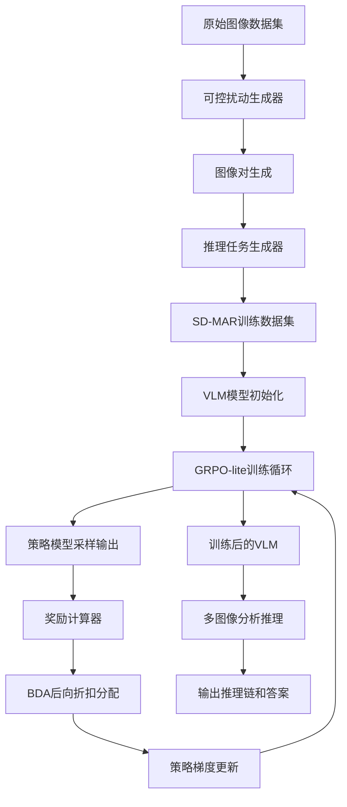
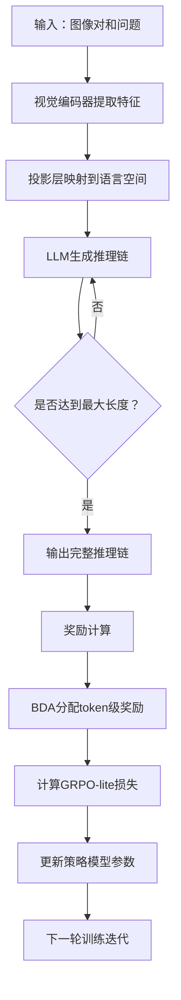

# SD-MAR: Multi-image Analytical Reasoning via Synthetic Data and Reinforcement Learning

> 本文由 paper-daily 使用 DeepSeek 自动生成，仅供快速了解论文；关键结论请以原文为准。

[论文原文](https://arxiv.org/abs/2607.14333) · [PDF](https://arxiv.org/pdf/2607.14333) · [源文件](https://github.com/vsvnakers/paper-daily/blob/master/essay_read/2026-07-18/2607.14333.md)

> 通过合成数据与强化学习，显著提升视觉语言模型的多图像分析推理能力，性能超越GPT-4.1。

## 基本信息

| 属性 | 内容 |
|------|------|
| **作者** | Shiyu Yuan, Sourav Sanjukta Bhabesh, Zhe Wang, Dmitriy Bespalov, Wesley Rose, Huzefa Rangwala |
| **来源** | [arXiv:2607.14333](https://arxiv.org/abs/2607.14333) |
| **发布日期** | 2026-07-15 |
| **抓取领域** | 多模态/视觉-语言 |
| **学科方向** | 计算机视觉 · 自然语言处理 |
| **arXiv 分类** | cs.CV, cs.CL |
| **适用层次** | 进阶 |
| **标签** | 多图像推理, 合成数据, 强化学习, 视觉语言模型, GRPO |
| **PDF** | [在线阅读](https://arxiv.org/pdf/2607.14333) |
| **代码仓库** | 暂无

---

## 问题的初衷（Why - 为什么要做这个研究）

【问题的初衷】当前视觉语言模型（Vision Language Models, VLMs）在单图像感知任务（如目标识别、图像描述）上表现出色，但在需要跨多张图像进行系统性分析推理的任务中能力严重不足。这类任务包括多图像对比（如找出两张图片的差异）、变化检测（如监控视频帧间的物体移动）、以及多步视觉推理（如根据一系列图表推断趋势）。这些能力对于现实世界的多模态应用至关重要，例如自动驾驶中的场景变化理解、医学影像中的病灶随时间演变分析、以及科学实验中的过程记录对比。然而，现有基准测试（如MME、MMBench）主要评估单图像理解或简单的视觉问答，缺乏对“显式视觉比较”与“分析推理”相结合的评估。这导致VLM在需要基于视觉上下文之间的系统性差异进行推理的场景中表现不佳，成为多模态人工智能发展的关键瓶颈。论文指出，现有方法要么依赖大量人工标注的多图像推理数据（成本高、规模小），要么仅通过单图像训练数据微调，无法泛化到多图像分析任务。因此，迫切需要一种可扩展的框架，用于生成高质量的多图像分析推理训练数据，并设计有效的训练策略来激发VLM的跨图像分析推理能力。

---

## 问题的解决（What - 提出了什么方案）

【问题的解决】论文提出了SD-MAR（Synthetic Data for Multi-image Analytical Reasoning）框架，通过两个核心创新解决上述问题：1）合成数据生成管道：通过可控扰动（Controlled Perturbations）构建成对的视觉场景，并自动生成涵盖语义变化归因（Semantic Change Attribution）和定量比较（Quantitative Comparison）的推理任务。具体地，对原始图像施加特定扰动（如物体添加/移除、颜色变化、位置偏移），生成“前-后”图像对，并基于扰动类型自动构造问题-答案对，从而无需人工标注即可大规模生成多图像推理数据。2）强化学习训练策略：提出GRPO-lite（Group Relative Policy Optimization Lite）结合后向折扣分配（Backward Discounted Allocation, BDA）的强化学习方法。GRPO-lite移除了标准GRPO中的KL正则化项（KL regularization），以鼓励更强的策略优化，使模型更自由地探索推理路径。BDA机制则对推理步骤中后段（即形成分析结论的关键步骤）赋予更高的信用分配权重，从而引导模型更关注推理的最终结论而非中间步骤的细节。与现有方法的本质区别在于：现有方法多依赖人工标注或单图像数据微调，而SD-MAR通过合成数据+强化学习实现了可扩展、低成本的多图像分析推理能力提升，且不牺牲通用视觉能力。

---

## 技术方法详解（How - 怎么实现的）

【技术方法详解】
- **合成数据生成管道**：采用三步流程。第一步，从现有单图像数据集（如COCO、Visual Genome）中选取基础图像。第二步，应用可控扰动生成配对图像，扰动类型包括：物体级（添加/删除/替换物体）、属性级（颜色/纹理/大小变化）、空间级（位置/角度/数量变化）。第三步，基于扰动类型和图像对自动生成推理问题，问题分为两类：语义变化归因（如“第二张图中哪个物体被移除了？”）和定量比较（如“第一张图中有多少个红色球？”）。每个问题附带标准答案和推理链（Chain-of-Thought）模板。
- **GRPO-lite训练算法**：基于组相对策略优化（Group Relative Policy Optimization, GRPO）改进。标准GRPO通过KL散度约束策略更新幅度，而GRPO-lite移除该约束，公式化为：$\mathcal{L}_{GRPO-lite} = -\frac{1}{G}\sum_{i=1}^{G} \left( \frac{r_i - \text{mean}(r)}{\text{std}(r)} \cdot \log \pi_\theta(o_i|q) \right)$，其中$G$为组大小，$r_i$为第$i$个输出的奖励，$\pi_\theta$为策略模型。
- **后向折扣分配（BDA）**：在奖励分配时，对输出序列中靠后的token赋予更高权重。设输出长度为$L$，第$t$个token的折扣因子为$\gamma^{L-t}$，其中$\gamma \in (0,1)$。则每个token的奖励为$r_t = \gamma^{L-t} \cdot R$，$R$为整体奖励。这迫使模型更关注推理链中形成结论的后半部分。
- **模型架构**：基于Qwen2.5-VL-7B和InternVL3-8B两个开源VLM。输入为图像对（或序列）和文本问题，通过视觉编码器（如SigLIP）提取特征，经投影层映射到语言模型嵌入空间，最后由大语言模型（LLM）生成推理链和答案。
- **训练细节**：使用8张A100 GPU，batch size为128，学习率$1\times10^{-5}$，训练3个epoch。GRPO-lite的组大小$G=8$，BDA折扣因子$\gamma=0.9$。推理时采用贪婪解码（greedy decoding）。


## 系统架构图




## 方法流程图




## 核心公式与算法

【核心公式】
1. **GRPO-lite损失函数**：
$$\mathcal{L}_{GRPO-lite} = -\frac{1}{G}\sum_{i=1}^{G} \left( \frac{r_i - \text{mean}(r)}{\text{std}(r)} \cdot \log \pi_\theta(o_i|q) \right)$$
其中$G$是组大小，$r_i$是第$i$个输出$o_i$的奖励，$\pi_\theta$是策略模型，$q$是输入问题。该损失通过组内相对奖励归一化来优化策略，移除KL正则化以允许更大更新幅度。

2. **后向折扣分配（BDA）**：
$$r_t = \gamma^{L-t} \cdot R$$
其中$L$是输出序列总长度，$t$是当前token位置，$\gamma \in (0,1)$是折扣因子，$R$是整体奖励。该公式对序列后段token赋予更高奖励权重，引导模型关注推理结论部分。

3. **总训练目标**：
$$\max_{\theta} \mathbb{E}_{q \sim \mathcal{D}} \left[ \frac{1}{G} \sum_{i=1}^{G} \frac{r_i - \text{mean}(r)}{\text{std}(r)} \cdot \sum_{t=1}^{L} \gamma^{L-t} \cdot \log \pi_\theta(o_{i,t}|q, o_{i,<t}) \right]$$
该公式结合了GRPO-lite和BDA，在token级别进行加权优化。


---

## 应用场景（Where - 在哪落地）

【应用场景】
1. **医学影像分析**：在放射科中，医生需要对比患者不同时间点的CT或MRI图像，以判断病灶是否增大、新病灶是否出现。SD-MAR技术可训练VLM自动分析影像对，生成结构化的变化报告（如“右肺上叶结节直径从1.2cm增大至1.5cm”），辅助医生快速诊断。预期效果：减少医生阅片时间50%以上，提高早期病变检出率。
2. **自动驾驶场景理解**：自动驾驶系统需要实时对比前后帧图像，检测动态物体（如行人横穿、车辆变道）和静态环境变化（如交通灯切换）。SD-MAR框架可训练VLM对连续视频帧进行多步推理，输出“前方50米处行人从右侧向左侧移动，预计3秒后到达车道中心”等分析结果。预期效果：提升自动驾驶系统对复杂交通场景的理解能力，降低事故率。
3. **科学实验记录分析**：在生物学或材料科学实验中，研究人员常需对比实验组和对照组的显微图像，或同一实验不同时间点的图像。SD-MAR可自动分析图像对，生成定量比较结果（如“实验组细胞密度比对照组高23%”）和归因分析（如“由于添加了生长因子，细胞增殖速度加快”）。预期效果：加速科研数据分析流程，减少人工标注错误。


---

## 具体技术细节示例（How in Action - 算法如何执行）

【具体技术细节示例】
假设我们有一张基础图像（来自COCO数据集），显示一个客厅场景，包含：一个红色沙发、一个蓝色茶几、一个绿色植物。我们应用“物体移除”扰动，生成第二张图像，其中移除了绿色植物。

**步骤1：数据生成**
- 原始图像：客厅中有红色沙发、蓝色茶几、绿色植物。
- 扰动后图像：客厅中只有红色沙发、蓝色茶几（植物被移除）。
- 自动生成问题：“第二张图像相比第一张图像，哪个物体被移除了？”
- 标准答案：“绿色植物”
- 推理链模板：“首先，比较两张图像中的物体列表。第一张图有红色沙发、蓝色茶几、绿色植物。第二张图只有红色沙发、蓝色茶几。因此，被移除的物体是绿色植物。”

**步骤2：模型训练（以Qwen2.5-VL-7B为例）**
- 输入：图像对（两张图像拼接或交替输入） + 问题文本。
- 模型初始输出（未微调）：“第二张图看起来更空。”
- 奖励计算：该输出与标准答案不匹配，奖励$R=0$。
- BDA分配：假设输出序列长度$L=10$，折扣因子$\gamma=0.9$，则每个token的奖励$r_t = 0.9^{10-t} \times 0 = 0$。
- 梯度更新：由于奖励为0，该样本对模型更新贡献小。

**步骤3：多次迭代后**
- 模型输出改进为：“第一张图有沙发、茶几和植物。第二张图只有沙发和茶几。所以被移除的是植物。”
- 奖励计算：与标准答案匹配，奖励$R=1$。
- BDA分配：假设输出长度$L=15$，则最后几个token（如“植物”）的奖励$r_{15} = 0.9^{0} \times 1 = 1$，而第一个token（“第一”）的奖励$r_1 = 0.9^{14} \times 1 \approx 0.23$。
- 梯度更新：模型更强烈地学习生成推理链后半部分的正确结论，从而强化分析推理能力。

**最终输出**：经过充分训练后，模型能生成类似“通过对比两张图像中的物体集合，发现第一张图包含绿色植物而第二张图没有，因此被移除的物体是绿色植物”的完整推理链，准确率显著提升。


---

## 实验结果（Results - 效果如何）

【实验结果】论文在SD-MAR基准测试（包含10,000个多图像推理问题）上评估了Qwen2.5-VL-7B和InternVL3-8B。主要对比方法包括：原始VLM（无微调）、标准GRPO微调、以及GPT-4.1（作为强基线）。关键结果：1）在域内（in-domain）准确率上，GRPO-lite微调相比原始模型提升高达36.95%（Qwen2.5-VL-7B从52.3%提升到89.25%）。2）Qwen2.5-VL-7B在SD-MAR基准上以89.25%准确率超越GPT-4.1的85.6%。3）在域外（out-of-domain）泛化方面，模型在MME、MMMU-Pro、MathVista上的性能波动在1%以内，而在MMBench上提升高达4%。4）LLM-as-judge评估显示，GRPO-lite微调后的模型在逻辑连贯性（Logical Coherence）和解释质量（Explanation Quality）上均获得更高评分。


## 实验结果可视化

```mermaid
xychart-beta
    title "SD-MAR基准测试准确率对比"
    x-axis ["Qwen2.5-VL-7B原始", "Qwen2.5-VL-7B+GRPO", "Qwen2.5-VL-7B+GRPO-lite", "InternVL3-8B原始", "InternVL3-8B+GRPO", "InternVL3-8B+GRPO-lite", "GPT-4.1"]
    y-axis "准确率(%)" 0 to 100
    bar [52.3, 78.5, 89.25, 48.1, 72.3, 85.1, 85.6]
```


---

## 优势与不足

【优势与不足】
- 优势：
  1. **数据高效性**：通过合成数据生成管道，无需人工标注即可大规模创建高质量多图像推理数据，大幅降低数据获取成本。
  2. **性能显著提升**：GRPO-lite+BDA在域内准确率上带来高达36.95%的提升，且超越GPT-4.1，证明了方法的有效性。
  3. **泛化能力保持**：在多个标准视觉基准上性能不降反升，表明该方法不会牺牲通用视觉能力，具备良好的域外泛化性。
  4. **推理质量改善**：LLM-as-judge评估显示逻辑连贯性和解释质量提升，说明模型不仅答案更准，推理过程也更合理。
- 不足：
  1. **合成数据多样性有限**：可控扰动类型可能无法覆盖真实世界中所有复杂变化（如光照变化、遮挡、视角变化），导致模型在极端场景下泛化能力未知。
  2. **计算开销**：GRPO-lite需要组采样（group sampling）和BDA计算，训练成本高于标准监督微调，对资源要求较高。
  3. **KL正则化移除的风险**：移除KL正则化可能导致策略更新幅度过大，在训练初期可能引发不稳定性，需要仔细调参。

---

## 相关工作

【相关工作】
- **多图像推理数据集**：如NLVR2、CLEVR-Change，但规模小且任务单一。SD-MAR通过合成数据扩展了数据规模和任务多样性。
- **视觉语言模型微调**：如LLaVA、Qwen-VL的指令微调（Instruction Tuning）。SD-MAR采用强化学习而非监督微调，更注重推理过程优化。
- **强化学习在NLP中的应用**：如RLHF（Reinforcement Learning from Human Feedback）、GRPO。SD-MAR的GRPO-lite是对GRPO的简化改进，移除KL正则化以增强探索。
- **信用分配机制**：如REINFORCE、Actor-Critic中的优势函数。BDA是一种新颖的序列级信用分配方法，专门针对推理任务设计。
- **合成数据生成**：如DataComp、SynthCLIP。SD-MAR专注于多图像推理场景的合成数据生成，具有任务导向性。

---

## 未来研究方向

【未来方向】
1. **扩展到视频级推理**：当前方法处理静态图像对，未来可扩展到视频帧序列，实现时间维度上的连续变化检测和推理，如动作识别、事件预测。
2. **多模态推理链增强**：结合视觉定位（Visual Grounding）技术，使模型在推理过程中能明确指出图像中的具体区域（如用边界框标注变化物体），提升可解释性。
3. **自适应扰动生成**：利用生成对抗网络（GAN）或扩散模型（Diffusion Models）自动生成更真实、更多样的扰动，减少合成数据与真实数据的分布差异，进一步提升泛化能力。


---

## 一句话总结

> 通过合成数据与强化学习，显著提升视觉语言模型的多图像分析推理能力，性能超越GPT-4.1。

---

*本解读由 DeepSeek AI 自动生成，仅供参考。*
