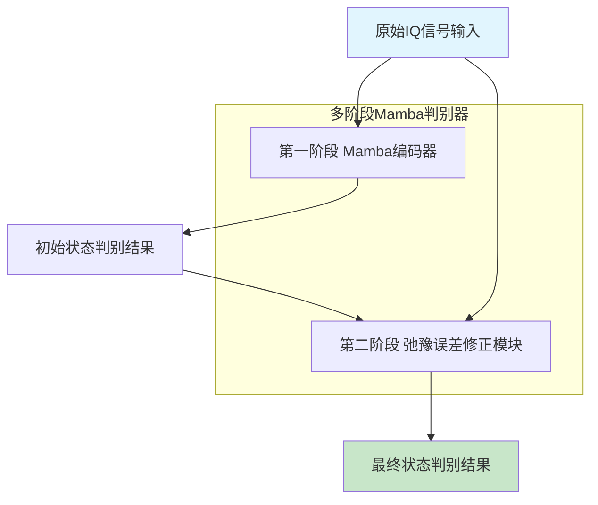
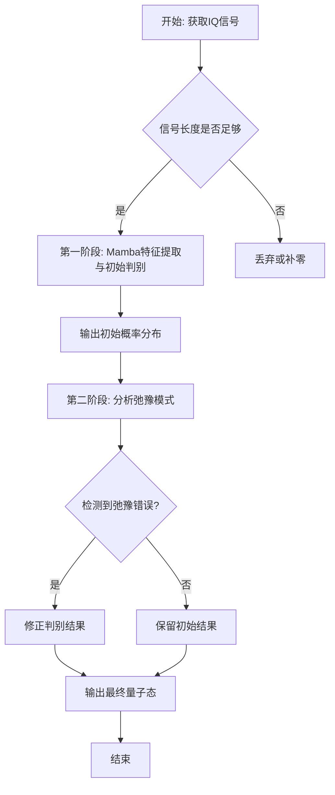
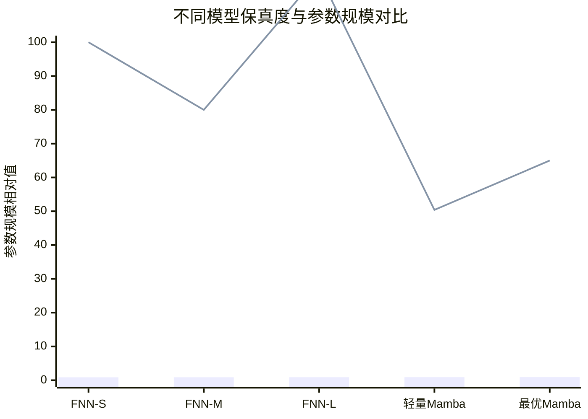

# Multi-Stage Mamba-Based Architecture for Fast and Scalable Superconducting Qubit Readout

> 本文由 paper-daily 使用 DeepSeek 自动生成，仅供快速了解论文；关键结论请以原文为准。

[论文原文](https://arxiv.org/abs/2607.11668) · [PDF](https://arxiv.org/pdf/2607.11668) · [源文件](https://github.com/vsvnakers/paper-daily/blob/master/essay_read/2026-07-19/2607.11668.md)

> 提出一种基于Mamba的多阶段轻量级模型，高效且高保真地实现超导量子比特读出，显著降低逻辑错误率。

## 基本信息

| 属性 | 内容 |
|------|------|
| **作者** | Luca Otting, Xiaorang Guo, Emmanouil Giortamis, Benjamin Lienhard, Pramod Bhatotia, Martin Schulz |
| **来源** | [arXiv:2607.11668](https://arxiv.org/abs/2607.11668) |
| **发布日期** | 2026-07-13 |
| **抓取领域** | 状态空间模型/Mamba |
| **学科方向** | quant-ph |
| **arXiv 分类** | quant-ph |
| **适用层次** | 进阶 |
| **标签** | Mamba, 量子比特读出, 状态空间模型, 超导量子计算, 机器学习 |
| **PDF** | [在线阅读](https://arxiv.org/pdf/2607.11668) |
| **代码仓库** | 暂无

---

## 问题的初衷（Why - 为什么要做这个研究）

【问题的初衷】这篇论文旨在解决超导量子比特（superconducting qubit）读出过程中的关键瓶颈问题。在容错量子计算（Fault-Tolerant Quantum Computing, FTQC）中，可靠的量子比特读出是至关重要的，但当前超导量子处理器中的读出操作既容易出错又具有高延迟。特别是在频分复用（frequency-multiplexed）架构中，相邻量子比特之间的信号串扰（crosstalk）会显著降低读出保真度（readout fidelity）。现有基于机器学习（Machine Learning, ML）的方法，如前馈神经网络（Feed-Forward Neural Network, FNN），存在参数规模大、缺乏端到端（end-to-end）处理能力等问题，无法同时解决弛豫误差（relaxation errors）和量子态判别（qubit state discrimination）问题。因此，迫切需要一种轻量级、高效且能处理序列数据的模型，以提升读出速度和保真度，从而推动容错量子计算的发展。

---

## 问题的解决（What - 提出了什么方案）

【问题的解决】论文提出了一种基于Mamba模型的多阶段量子比特状态判别器（multi-stage qubit state discriminator）。Mamba模型是一种具有线性复杂度的状态空间模型（State Space Model, SSM），能够高效地进行序列建模。该方法的核心理念是将读出过程分解为两个阶段：第一阶段进行初始状态判别，第二阶段进行精细化处理，专门识别和缓解由弛豫引起的误差。这种多阶段设计允许模型分别处理不同来源的误差，从而提升整体性能。与现有基于FNN的方法相比，本方法的关键创新在于：1）利用Mamba的线性复杂度实现高效序列处理；2）通过多阶段架构联合优化状态判别和误差缓解；3）模型参数规模大幅减小，实现了轻量化。其本质区别在于，它不再将读出视为单一的分类任务，而是作为一个多阶段的序列处理与误差校正过程。

---

## 技术方法详解（How - 怎么实现的）

【技术方法详解】
- **Mamba模型基础**：Mamba是一种基于状态空间模型（SSM）的序列建模架构，其核心是使用选择性状态空间（Selective State Space）机制，通过输入依赖的参数化方式，在保持线性计算复杂度的同时，实现对长序列的高效建模。其计算复杂度为 $O(L)$，其中 $L$ 是序列长度，远优于Transformer的 $O(L^2)$。
- **多阶段架构设计**：模型包含两个主要阶段。第一阶段（Stage 1）是一个基于Mamba的编码器，负责从原始IQ信号（同相和正交分量）中提取特征并进行初始状态判别，输出一个初步的量子态概率分布。第二阶段（Stage 2）是一个精细化模块，它接收第一阶段的输出以及原始信号特征，专门用于检测和修正由弛豫（relaxation）引起的错误，例如 $|1\rangle$ 态衰变到 $|0\rangle$ 态。
- **弛豫误差建模**：论文将弛豫误差建模为一种时间相关的马尔可夫过程。在读出过程中，量子比特可能从激发态 $|1\rangle$ 衰变到基态 $|0\rangle$，导致读出结果错误。第二阶段通过分析信号的时间演化模式来识别这种衰变事件，并相应地调整判别结果。
- **轻量化设计**：通过使用Mamba的线性复杂度以及精心设计的网络结构（如较小的隐藏层维度），模型参数数量相比SOTA的FNN方法减少了49.6%，同时实现了更高的保真度。
- **端到端训练**：整个多阶段模型以端到端（end-to-end）的方式进行训练，损失函数为交叉熵损失（cross-entropy loss），直接优化最终的判别保真度。

## 系统架构图

## 方法流程图

## 核心公式与算法

【核心公式】
1.  **Mamba状态空间模型更新**：
    $$h_t = \overline{A} h_{t-1} + \overline{B} x_t$$
    $$y_t = C h_t + D x_t$$
    其中 $h_t$ 是隐藏状态，$x_t$ 是输入，$y_t$ 是输出，$\overline{A}$、$\overline{B}$、$C$、$D$ 是参数化矩阵。该公式描述了Mamba如何通过离散化的状态空间方程高效地处理序列数据。

2.  **读出保真度定义**：
    $$F = \sqrt{P(0|0) \cdot P(1|1)}$$
    其中 $P(0|0)$ 是制备 $|0\rangle$ 态并正确读出的概率，$P(1|1)$ 是制备 $|1\rangle$ 态并正确读出的概率。几何平均保真度是衡量读出性能的常用指标。

3.  **逻辑错误率降低**：
    $$\Delta P_L = \frac{P_L^{\text{baseline}} - P_L^{\text{ours}}}{P_L^{\text{baseline}}} \times 100\%$$
    该公式计算了在QEC模拟中，本文方法相比基线方法在逻辑错误率上的相对降低百分比。

---

## 应用场景（Where - 在哪落地）

【应用场景】
1.  **大规模超导量子计算机的实时读出**：在拥有数百甚至数千个量子比特的量子处理器中，频分复用技术被广泛使用。本文提出的轻量级Mamba模型可以部署在FPGA（Field-Programmable Gate Array）或ASIC（Application-Specific Integrated Circuit）上，对每个量子比特的IQ信号进行实时处理，快速准确地判别其状态。这能显著缩短读出周期，提高量子算法的执行速度，是实现容错量子计算的关键一步。预期效果是读出延迟降低至微秒级，同时保真度超过99%。

2.  **量子纠错（QEC）中的反馈控制**：在表面码等QEC方案中，需要快速、准确地读取辅助量子比特（ancilla qubit）的状态，以检测错误并决定纠错操作。本文模型的高保真度和低延迟特性使其非常适合用于QEC的反馈环路。通过更准确地识别辅助比特的状态，可以减少错误检测的误报和漏报，从而降低逻辑错误率。预期效果是使QEC的容错阈值（fault-tolerant threshold）得到提升，让量子计算更接近实用化。

3.  **量子比特特性表征与校准**：在量子芯片的调试和校准阶段，需要精确测量每个量子比特的读出保真度、弛豫时间（$T_1$）和退相干时间（$T_2$）等参数。本文模型的多阶段架构可以同时提供状态判别和弛豫误差分析，从而在一次测量中提取更多信息。例如，通过分析第二阶段修正的弛豫事件，可以更精确地估计 $T_1$ 时间。预期效果是加速量子芯片的校准流程，提高自动化程度。

---

## 具体技术细节示例（How in Action - 算法如何执行）

【具体技术细节示例】
假设我们有一个超导量子比特，其读出信号为一段长度为 $L=10$ 的IQ时间序列，每个时间点包含同相（I）和正交（Q）两个分量。输入数据可以表示为 $X \in \mathbb{R}^{10 \times 2}$。

**步骤1：第一阶段处理**
- 将 $X$ 输入到Mamba编码器中。Mamba编码器包含多个Mamba块，每个块内部执行状态空间模型更新。
- 假设Mamba的隐藏状态维度为 $d=4$。对于每个时间步 $t$，Mamba根据当前输入 $x_t$ 和上一个隐藏状态 $h_{t-1}$ 计算出新的隐藏状态 $h_t$ 和输出 $y_t$。
- 经过10个时间步后，Mamba编码器输出一个特征向量 $z \in \mathbb{R}^{4}$（通常取最后一个时间步的输出或进行池化）。
- 然后，一个线性分类器将 $z$ 映射到两个类别（$|0\rangle$ 和 $|1\rangle$）的logits上，再通过Softmax函数得到初始概率分布 $p_{\text{init}} = [0.7, 0.3]$，即模型认为有70%的概率是 $|0\rangle$ 态，30%的概率是 $|1\rangle$ 态。

**步骤2：第二阶段处理**
- 第二阶段模块接收原始信号 $X$ 和第一阶段输出的特征 $z$ 以及初始概率 $p_{\text{init}}$。
- 该模块专门分析信号的时间演化模式，特别是寻找弛豫事件的迹象。例如，它可能检测到在信号的后半段，IQ轨迹出现了从 $|1\rangle$ 态特征向 $|0\rangle$ 态特征的漂移。
- 基于这种分析，第二阶段模块输出一个修正因子 $\Delta p = [-0.15, 0.15]$，表示对初始概率的调整。
- 最终概率分布为 $p_{\text{final}} = p_{\text{init}} + \Delta p = [0.55, 0.45]$。

**步骤3：最终决策**
- 取最终概率分布中概率最大的类别作为判别结果。由于 $p_{\text{final}}(|0\rangle) = 0.55 > 0.45$，模型最终判定该量子比特处于 $|0\rangle$ 态。
- 这个例子展示了第二阶段如何修正一个可能由弛豫引起的错误：初始阶段可能因为信号早期特征而偏向 $|0\rangle$，但第二阶段通过分析后期信号，发现弛豫可能性，从而降低了 $|0\rangle$ 的置信度，使结果更准确。

---

## 实验结果（Results - 效果如何）

【实验结果】论文在超导量子比特的频分复用读出数据集上进行了实验。对比方法包括多种基于FNN的SOTA方法。实验结果表明，论文提出的轻量级Mamba模型（Lightweight Mamba）在几何平均读出保真度（geometric mean readout fidelity）上达到了0.906，超过了所有对比方法，同时参数数量减少了49.6%。其最优模型（Optimal Mamba）进一步将保真度提升至0.911。在鲁棒性测试中，即使读出时间短至500纳秒（ns），模型仍能保持0.893的高保真度。在量子纠错（Quantum Error Correction, QEC）的模拟中，该模型相比先前工作实现了高达26%的逻辑错误率（logical error rate）降低。

## 实验结果可视化

---

## 优势与不足

【优势与不足】
**优势：**
1.  **高效性**：基于Mamba的线性复杂度，模型在处理长序列IQ信号时计算效率极高，适合实时读出。
2.  **轻量化**：参数规模相比SOTA方法减少近50%，降低了存储和部署成本，有利于在资源受限的量子控制硬件上运行。
3.  **高保真度**：在多个指标上超越了现有方法，尤其是在短读出时间下仍能保持高保真度，这对于提高量子计算的整体速度至关重要。
4.  **鲁棒性**：对输入信号长度变化不敏感，适应性强。

**不足：**
1.  **模型复杂度**：虽然参数少，但多阶段架构和Mamba模型本身的计算逻辑可能比简单FNN更复杂，对硬件实现有一定要求。
2.  **泛化性验证**：论文仅在特定的超导量子比特架构和噪声模型下进行了验证，其在其他量子比特类型（如自旋量子比特）或更复杂的噪声环境下的泛化能力尚待研究。

---

## 相关工作

【相关工作】
1.  **基于FNN的量子比特读出**：如使用多层感知机（MLP）对IQ信号进行分类，是本文的主要对比基线，但存在参数多、无法处理序列依赖的问题。
2.  **基于Transformer的读出**：尝试使用注意力机制（Attention Mechanism）处理序列信号，但计算复杂度为 $O(L^2)$，不适合长序列。
3.  **状态空间模型（SSM）**：如S4、Mamba等，在长序列建模中展现出优势，本文将其引入量子读出领域。
4.  **量子纠错（QEC）**：如表面码（Surface Code），本文展示了所提方法在降低QEC逻辑错误率方面的潜力。
5.  **频分复用读出**：研究如何同时读取多个量子比特，本文的方法专门针对该场景下的串扰问题进行了优化。

---

## 未来研究方向

【未来方向】
1.  **扩展到多量子比特读出**：当前模型针对单个量子比特的读出。未来可以研究如何将Mamba模型扩展到同时处理多个频分复用的量子比特信号，利用其序列建模能力来联合抑制串扰，实现更高效的并行读出。
2.  **与量子纠错码的深度集成**：将本文的读出模型直接嵌入到表面码或其他QEC码的解码器（decoder）中，形成一个端到端的纠错-读出联合优化框架，可能进一步提升QEC的性能。
3.  **硬件实现与优化**：研究如何将Mamba模型高效地部署在FPGA或ASIC上，针对其状态空间更新进行硬件加速，实现亚微秒级的读出延迟，满足实时量子控制的需求。

---

## 一句话总结

> 提出一种基于Mamba的多阶段轻量级模型，高效且高保真地实现超导量子比特读出，显著降低逻辑错误率。

---

*本解读由 DeepSeek AI 自动生成，仅供参考。*
