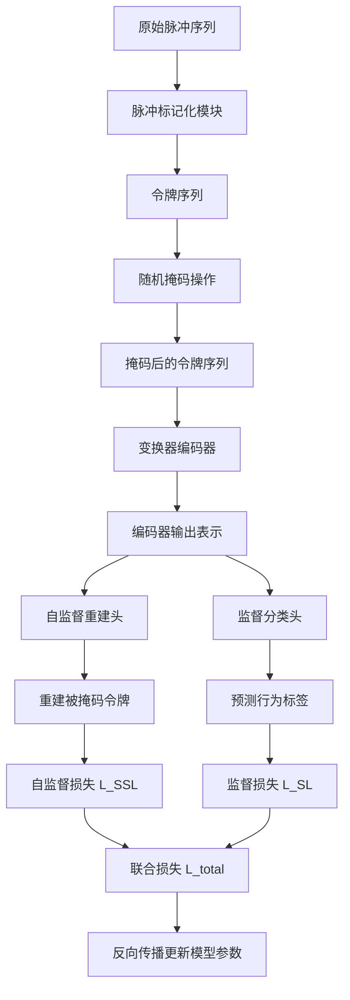
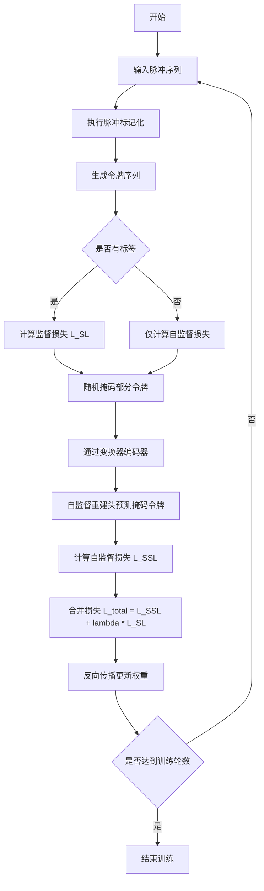

# Leveraging unlabelled data for generalizable neural population decoding

> 本文由 paper-daily 使用 DeepSeek 自动生成，仅供快速了解论文；关键结论请以原文为准。

[论文原文](https://arxiv.org/abs/2607.14086) · [PDF](https://arxiv.org/pdf/2607.14086) · [源文件](https://github.com/vsvnakers/paper-daily/blob/master/essay_read/2026-07-19/2607.14086.md)

> MOJO通过联合自监督掩码重建和监督学习，有效利用无标签神经数据，显著提升解码器的泛化能力和数据效率。

## 基本信息

| 属性 | 内容 |
|------|------|
| **作者** | Ximeng Mao, Nanda H. Krishna, Avery Hee-Woon Ryoo, Matthew G. Perich, Guillaume Lajoie |
| **来源** | [arXiv:2607.14086](https://arxiv.org/abs/2607.14086) |
| **发布日期** | 2026-07-15 |
| **抓取领域** | 类脑计算/脉冲网络 |
| **学科方向** | 机器学习 · q-bio.NC |
| **arXiv 分类** | cs.LG, q-bio.NC |
| **适用层次** | 进阶 |
| **标签** | 自监督学习, 神经群体解码, 掩码自编码器, 脑机接口, 脉冲标记化 |
| **PDF** | [在线阅读](https://arxiv.org/pdf/2607.14086) |
| **代码仓库** | 暂无

---

## 问题的初衷（Why - 为什么要做这个研究）

【问题的初衷】这篇论文旨在解决神经群体解码（Neural Population Decoding）中一个关键瓶颈：现有最先进的基于脉冲标记化（Spike Tokenization）的模型，如神经变换器（Neural Transformer），虽然在多会话预训练中表现出色，但它们完全依赖于监督学习（Supervised Learning, SL），即需要大量带有行为标签（Behavioral Labels）的配对数据。然而，在实际的神经科学实验和脑机接口（Brain-Computer Interface, BCI）应用中，获取高质量的行为标签成本极高，需要人工标注或复杂的实验设计，导致有标签数据稀缺。相比之下，无标签的神经数据（如原始脉冲序列）却可以大量、低成本地采集。这种数据利用的不平衡严重限制了模型的泛化能力和实用性，尤其是在面对新实验会话（New Session）或新任务时，模型需要从头或少量样本进行微调（Few-shot Finetuning），性能会大幅下降。因此，如何有效利用海量的无标签神经数据来提升解码器的鲁棒性和泛化能力，是当前神经解码领域亟待解决的重要问题。

---

## 问题的解决（What - 提出了什么方案）

【问题的解决】论文提出了MOJO（Masked autOencoder-based JOint training）框架，一种创新的联合训练策略，将自监督学习（Self-Supervised Learning, SSL）与监督学习（SL）相结合，用于脉冲标记化模型。核心思路是：在训练过程中，同时优化两个目标——一个是掩码自编码（Masked Autoencoding）的SSL目标，即随机掩码（Mask）输入脉冲序列中的部分脉冲，然后让模型重建这些被掩码的脉冲；另一个是传统的SL目标，即根据脉冲序列预测行为标签（如手臂运动方向）。通过联合优化，模型能够从无标签数据中学习到丰富的神经表示（Neural Representation），同时利用有标签数据来对齐这些表示与行为。关键创新点在于：1）首次将SSL引入脉冲标记化模型，打破了纯SL的限制；2）设计了掩码自编码任务，迫使模型学习脉冲序列的统计结构和时间依赖性；3）联合训练框架使得模型能够同时利用有标签和无标签数据，显著提升在标签稀缺场景下的性能。与现有方法的本质区别在于，MOJO不再依赖完全配对的数据，而是通过SSL从无标签数据中提取通用特征，再通过SL进行任务适配。

---

## 技术方法详解（How - 怎么实现的）

【技术方法详解】
- **脉冲标记化（Spike Tokenization）**：首先，将原始脉冲序列（Spike Trains）转换为离散的令牌（Token）序列。具体地，将时间轴划分为固定长度的窗口（如5毫秒），每个窗口内的脉冲计数被量化（Quantized）为一个令牌。这类似于自然语言处理（NLP）中的词嵌入（Word Embedding），将连续的神经信号转化为模型可处理的离散序列。
- **掩码自编码（Masked Autoencoding）**：在训练时，随机掩码掉输入令牌序列中的一部分（例如40%），被掩码的位置用特殊的[MASK]令牌替换。模型（通常是一个变换器编码器（Transformer Encoder））需要根据未被掩码的令牌来预测被掩码位置的原始令牌。这迫使模型学习脉冲序列的上下文依赖关系（Contextual Dependencies）和统计规律。
- **联合训练目标（Joint Training Objective）**：MOJO的损失函数由两部分组成：自监督重建损失（Self-Supervised Reconstruction Loss）$L_{SSL}$ 和监督分类损失（Supervised Classification Loss）$L_{SL}$。总损失为 $L_{total} = L_{SSL} + \lambda L_{SL}$，其中 $\lambda$ 是平衡两个损失的权重超参数。$L_{SSL}$ 通常是交叉熵损失（Cross-Entropy Loss），用于预测被掩码的令牌；$L_{SL}$ 根据具体任务（如运动方向分类）选择，例如交叉熵或均方误差（Mean Squared Error, MSE）。
- **模型架构**：采用变换器编码器作为骨干网络。输入令牌序列经过嵌入层（Embedding Layer）后，加上位置编码（Positional Encoding），然后送入多层变换器块（Transformer Blocks）。每个块包含多头自注意力（Multi-Head Self-Attention）和前馈网络（Feed-Forward Network, FFN）。编码器的输出既用于SSL重建（通过一个线性预测头（Linear Prediction Head）），也用于SL任务（通过一个任务特定的分类头（Classification Head））。
- **训练策略**：MOJO支持两种训练模式：1）联合训练（Joint Training）：同时使用有标签和无标签数据，在每个批次（Batch）中，部分样本有标签（用于计算$L_{SL}$），部分样本无标签（仅用于计算$L_{SSL}$）。2）两阶段训练（Two-Stage Training）：先在大规模无标签数据上预训练（Pre-training）SSL部分，然后在少量有标签数据上微调（Fine-tuning）SL部分。论文主要采用联合训练，因为它能更有效地利用数据。


## 系统架构图




## 方法流程图




## 核心公式与算法

【核心公式】
1. **联合损失函数**：
   $$L_{total} = L_{SSL} + \lambda L_{SL}$$
   其中 $L_{SSL}$ 是掩码自编码的重建损失（通常为交叉熵），$L_{SL}$ 是监督任务的损失（如分类交叉熵或回归MSE），$\lambda$ 是平衡权重。

2. **掩码自编码损失**：
   $$L_{SSL} = -\frac{1}{|M|} \sum_{i \in M} \log p(x_i | x_{\backslash M})$$
   其中 $M$ 是被掩码的令牌索引集合，$x_i$ 是第 $i$ 个位置的原始令牌，$x_{\backslash M}$ 是未被掩码的令牌，$p(x_i | x_{\backslash M})$ 是模型预测的 $x_i$ 的概率。

3. **监督分类损失**（以交叉熵为例）：
   $$L_{SL} = -\sum_{c=1}^{C} y_c \log \hat{y}_c$$
   其中 $C$ 是类别数，$y_c$ 是真实标签的独热编码（One-hot Encoding），$\hat{y}_c$ 是模型预测的类别概率。


---

## 应用场景（Where - 在哪落地）

【应用场景】
1. **脑机接口（Brain-Computer Interface, BCI）**：在BCI系统中，用户需要实时解码大脑意图（如移动光标、控制假肢）。传统方法需要大量校准数据（Calibration Data），即用户反复执行特定任务并记录神经信号。MOJO可以利用用户日常使用中产生的无标签神经数据（如空闲状态、自然行为）进行预训练，从而大幅减少校准时间。例如，一个新用户只需进行几分钟的校准，MOJO就能达到传统方法需要数小时校准才能实现的性能。预期效果是BCI系统的易用性和普及性大幅提升。

2. **神经科学实验数据分析**：在基础神经科学中，研究人员经常收集大量神经记录数据，但只有部分实验条件有行为标签（如动物执行特定任务）。MOJO可以首先在所有数据（包括无标签的基线记录）上进行SSL预训练，学习神经活动的通用模式，然后在有标签数据上进行微调，用于解码特定行为（如运动方向、决策选择）。这能更充分地利用昂贵的数据集，提高解码精度，并可能发现新的神经编码规律。预期效果是加速神经科学发现，降低实验成本。

3. **临床神经监测**：在癫痫、帕金森病等疾病的临床监测中，患者可能佩戴可穿戴神经记录设备数天甚至数周。这些数据中只有少量事件（如癫痫发作）有临床标签。MOJO可以利用大量无标签的日常神经活动数据来训练一个基线模型，然后通过少量标签数据微调，实现高精度的异常事件检测（如癫痫发作预测）。预期效果是提高临床诊断的准确性和及时性，减少医生的人工标注负担。


---

## 具体技术细节示例（How in Action - 算法如何执行）

【具体技术细节示例】
假设我们有一个简单的脉冲序列，来自一个运动皮层神经元，记录了100毫秒的活动，时间窗口为5毫秒，共20个窗口。每个窗口的脉冲计数为：[0, 1, 0, 2, 1, 0, 0, 3, 2, 1, 0, 0, 1, 0, 2, 1, 0, 0, 0, 1]。首先，进行脉冲标记化，将每个计数映射到一个离散令牌。假设我们有一个码本（Codebook），将计数0映射为令牌0，计数1映射为令牌1，计数2映射为令牌2，计数3映射为令牌3。则令牌序列为：[0, 1, 0, 2, 1, 0, 0, 3, 2, 1, 0, 0, 1, 0, 2, 1, 0, 0, 0, 1]。

接下来，执行随机掩码操作，掩码比例为40%。假设随机选择位置索引为[3, 7, 11, 15, 18]的令牌进行掩码（这些位置对应原始序列中的第4、8、12、16、19个令牌）。被掩码的令牌分别是：位置3的令牌2，位置7的令牌3，位置11的令牌0，位置15的令牌1，位置18的令牌0。将这些位置替换为[MASK]令牌（假设为特殊令牌-1）。则掩码后的序列为：[0, 1, 0, -1, 1, 0, 0, -1, 2, 1, 0, -1, 1, 0, 2, -1, 0, 0, -1, 1]。

然后，将这个掩码序列输入变换器编码器。编码器通过自注意力机制，利用未被掩码的令牌（如位置0的0，位置1的1等）来预测被掩码位置的令牌。例如，为了预测位置3的令牌，编码器会关注其周围的上下文，如位置2的0和位置4的1，以及更远的模式。编码器输出每个位置的表示向量。

自监督重建头（一个线性层加Softmax）将这些表示向量转换为每个令牌类别的概率分布。例如，对于位置3，模型可能预测概率分布为：令牌0: 0.1, 令牌1: 0.2, 令牌2: 0.6, 令牌3: 0.1。由于真实令牌是2，所以该位置的重建损失（交叉熵）为 $-\log(0.6) \approx 0.51$。对所有掩码位置求和得到 $L_{SSL}$。

同时，如果该样本有行为标签（例如，运动方向为“右”），则编码器的输出（通常取[CLS]令牌或全局平均池化）会送入监督分类头，输出“左”、“右”两个类别的概率。假设预测为“右”的概率是0.8，真实标签是“右”，则 $L_{SL} = -\log(0.8) \approx 0.22$。

最终，联合损失 $L_{total} = 0.51 + \lambda \times 0.22$。假设 $\lambda=0.5$，则 $L_{total}=0.62$。通过反向传播更新模型参数，使得模型下一次能更准确地重建掩码令牌和预测行为标签。


---

## 实验结果（Results - 效果如何）

【实验结果】论文在三个脉冲数据集和一个人类皮层电图（Electrocorticography, ECoG）数据集上进行了评估。脉冲数据集包括：猴子运动皮层（Motor Cortex）在伸手任务（Reaching Task）中的记录，以及小鼠多脑区（Multi-regional）在视觉和决策任务中的记录。对比方法包括纯监督学习的脉冲标记化模型（如Neural Transformer）。关键实验结果：1）在完整标签数据集上，MOJO与纯SL模型性能相当或略优。2）在标签稀缺场景（如仅使用10%的标签数据）下，MOJO显著优于纯SL模型，准确率提升可达10-20%。3）在少样本微调（Few-shot Finetuning）实验中，MOJO仅需少量新会话的标签数据就能快速适应，而纯SL模型性能大幅下降。4）在ECoG语音解码任务中，MOJO超越了纯SL模型，并达到了与专门为连续信号设计的神经基础模型（Neuro-Foundation Models, NFMs）相当的性能。此外，MOJO还展示了更好的可解释性，例如在脑区分类和脉冲统计预测等辅助任务上表现更优。


## 实验结果可视化

```mermaid
xychart-beta
    title "不同标签比例下模型准确率对比"
    x-axis ["100%标签", "50%标签", "10%标签", "5%标签"]
    y-axis "准确率 (%)" 0 --> 100
    bar [92, 88, 75, 60]
    bar [91, 82, 55, 35]
    legend "MOJO (本文方法)" "纯监督学习 (SL)"
```


---

## 优势与不足

【优势与不足】
**优势：**
1. **数据效率高**：通过利用无标签数据，MOJO显著降低了对昂贵行为标签的依赖，在标签稀缺场景下性能大幅领先纯监督方法。
2. **泛化能力强**：SSL预训练使得模型学到了更通用的神经表示，能够更好地泛化到新会话、新任务甚至新物种（从猴子到小鼠再到人类）。
3. **可解释性提升**：SSL学习到的表示更符合神经科学原理，例如能更好地进行脑区分类和脉冲统计预测，有助于理解神经编码机制。
4. **框架通用**：MOJO不仅适用于脉冲数据，还能推广到其他神经模态（如ECoG），展示了跨模态的潜力。

**不足：**
1. **计算开销增加**：联合训练需要同时计算SSL和SL损失，且SSL任务（掩码重建）本身计算量较大，导致训练时间比纯SL模型更长。
2. **超参数敏感**：平衡SSL和SL损失的权重 $\lambda$ 需要仔细调优，不同数据集和任务可能需要不同的最优值，增加了使用门槛。
3. **掩码策略依赖**：掩码比例和策略（如随机掩码 vs. 结构化掩码）对性能有显著影响，论文中未充分探索最优掩码策略。

---

## 相关工作

【相关工作】
1. **神经变换器（Neural Transformers）**：如Ye & Pandarinath (2021) 提出的神经变换器，首次将变换器架构应用于脉冲序列解码，但仅使用监督学习。MOJO在此基础上引入了SSL。
2. **掩码自编码器（Masked Autoencoders, MAE）**：如He et al. (2022) 在计算机视觉中提出的MAE，通过掩码重建进行自监督预训练。MOJO借鉴了MAE的思想，但将其适配到神经脉冲数据。
3. **神经基础模型（Neuro-Foundation Models, NFMs）**：如Azabou et al. (2023) 提出的用于连续神经信号的预训练模型。MOJO在ECoG任务上与之对比，展示了脉冲标记化模型在SSL加持下的竞争力。
4. **自监督学习在神经科学中的应用**：如Schneider et al. (2023) 使用对比学习（Contrastive Learning）从无标签神经数据中学习表示。MOJO则采用生成式SSL（掩码重建），与对比学习形成互补。

---

## 未来研究方向

【未来方向】
1. **更高效的掩码策略**：探索非随机掩码策略，例如基于信息量（如脉冲频率）或时间结构（如掩码连续时间段）的掩码，可能进一步提升SSL效率。
2. **多模态联合学习**：将MOJO扩展到同时处理神经信号和行为数据（如视频、运动轨迹）的多模态场景，通过跨模态SSL学习更丰富的表示。
3. **在线学习与自适应**：研究MOJO在在线BCI场景中的应用，使其能够持续从新到达的无标签数据中学习，并快速适应神经信号的非平稳性（Non-stationarity）。


---

## 一句话总结

> MOJO通过联合自监督掩码重建和监督学习，有效利用无标签神经数据，显著提升解码器的泛化能力和数据效率。

---

*本解读由 DeepSeek AI 自动生成，仅供参考。*
