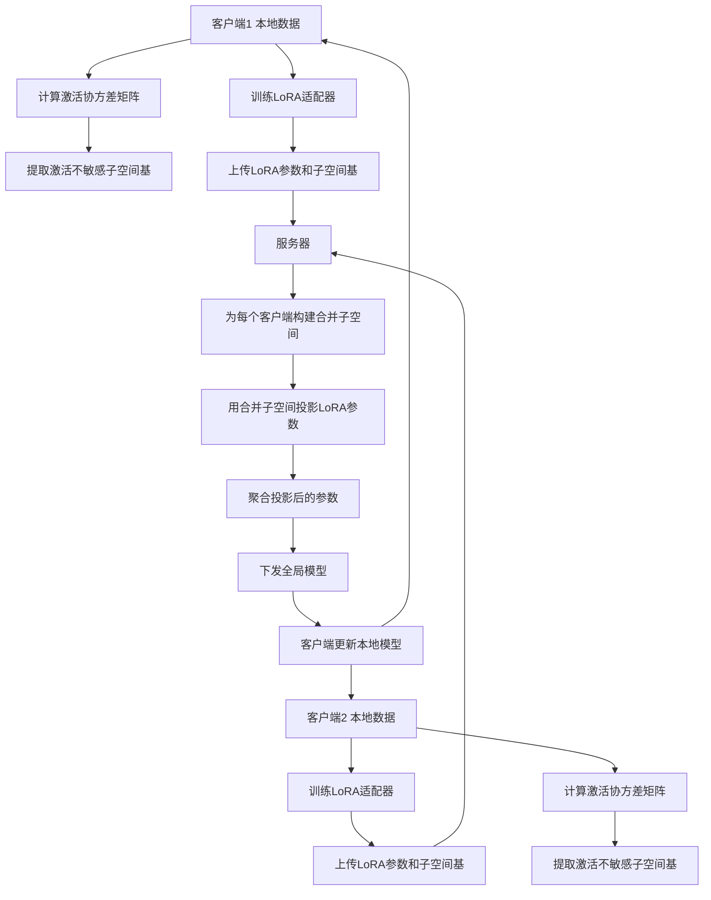
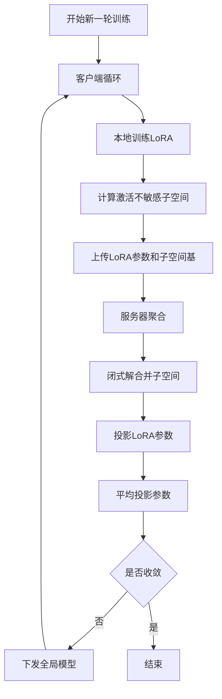

# Dysco: Dynamic Subspace Boosting to Mitigate LoRA Interference in Federated Learning

> 本文由 paper-daily 使用 DeepSeek 自动生成，仅供快速了解论文；关键结论请以原文为准。

[论文原文](https://arxiv.org/abs/2607.14367) · [PDF](https://arxiv.org/pdf/2607.14367) · [源文件](https://github.com/vsvnakers/paper-daily/blob/master/essay_read/2026-07-19/2607.14367.md)

> Dysco 通过动态子空间分配将联邦 LoRA 聚合从参数平均转变为干扰最小化的子空间合并，显著提升异构数据下的微调性能。

## 基本信息

| 属性 | 内容 |
|------|------|
| **作者** | Haobo Zhang, Jiankun Wang, Suraj Rajendran, Weishen Pan, Lam Tsoi, Yong Chen, Fei Wang, Jiayu Zhou |
| **来源** | [arXiv:2607.14367](https://arxiv.org/abs/2607.14367) |
| **发布日期** | 2026-07-15 |
| **抓取领域** | LLM推理 · 模型压缩 |
| **学科方向** | 机器学习 |
| **arXiv 分类** | cs.LG |
| **适用层次** | 进阶 |
| **标签** | 联邦学习, 低秩适应, 子空间学习, 参数干扰, 大模型微调 |
| **PDF** | [在线阅读](https://arxiv.org/pdf/2607.14367) |
| **代码仓库** | 暂无

---

## 问题的初衷（Why - 为什么要做这个研究）

【问题的初衷】随着大型预训练模型（如 Llama-3.2-1B）在自然语言处理等领域的广泛应用，联邦学习（Federated Learning, FL）作为一种保护数据隐私的分布式训练范式，正越来越多地被用于对这些大模型进行微调。然而，直接微调整个模型在通信和计算上代价高昂。低秩适应（Low-Rank Adaptation, LoRA）通过冻结原始权重并仅训练低秩矩阵来显著降低开销，成为联邦微调的主流方法。然而，联邦学习场景中客户端数据的异构性（Non-IID）导致了一个关键问题：不同客户端训练出的 LoRA 适配器在服务器端进行聚合时，会产生严重的参数干扰（Interference）。这种干扰使得聚合后的全局模型性能不稳定，甚至下降。现有方法通常将 LoRA 聚合视为简单的参数平均，忽略了数据与参数之间复杂的几何关系。本文的核心动机是深入理解这种干扰的几何根源，并提出一种动态子空间分配机制来缓解干扰，从而提升联邦 LoRA 微调的稳定性和性能。

---

## 问题的解决（What - 提出了什么方案）

【问题的解决】论文提出了动态子空间增强（Dynamic Subspace Boosting, Dysco）方法，从根本上重新审视了联邦 LoRA 聚合问题。核心创新在于将 LoRA 聚合从参数平均（Parameter Averaging）转变为子空间分配（Subspace Allocation）。Dysco 的核心思路是：每个客户端在本地训练时，不仅更新 LoRA 参数，还计算一个与本地数据激活（Activation）不敏感的子空间（Activation-Insensitive Subspace）。这个子空间代表了该客户端数据中那些对参数更新影响较小的方向。客户端只将这个子空间的基（Bases）上传到服务器。服务器收到所有客户端的子空间基后，通过一个闭式解（Closed-Form Solution）为每个客户端构建一个合并后的子空间，该子空间最大化与其他客户端不敏感方向的兼容性，从而在聚合时减少干扰。为了应对模型表示漂移（Representation Drift），Dysco 还引入了多轮子空间增强（Multi-Round Subspace Boosting），在保留历史更新方向的同时适应新的数据表示。与现有方法（如简单平均、FedAvg）的本质区别在于，Dysco 不是被动地平均参数，而是主动地、动态地为每个客户端分配一个干扰最小的子空间进行聚合。

---

## 技术方法详解（How - 怎么实现的）

【技术方法详解】
- **数据-参数干扰的几何分析**：论文首先从几何角度分析了 LoRA 聚合中的干扰。定义客户端 $k$ 的 LoRA 更新为 $\Delta W_k$，其与全局聚合的干扰程度取决于 $\Delta W_k$ 与客户端 $k$ 的数据激活 $X_k$ 的分布对齐程度。干扰被形式化为 $\|X_k \Delta W_k\|_F^2$，即激活通过更新后的输出范数。
- **激活不敏感子空间计算**：每个客户端 $k$ 在本地训练后，从其数据激活 $X_k$ 的协方差矩阵 $X_k^T X_k$ 中，通过奇异值分解（SVD）提取出对应最小奇异值的右奇异向量，构成激活不敏感子空间 $U_k^{\perp}$。这些方向上的参数变化对模型输出的影响最小。
- **闭式子空间合并**：服务器收到所有客户端的 $U_k^{\perp}$ 后，为每个客户端 $k$ 构建一个合并子空间 $\tilde{U}_k$。目标是最大化 $\tilde{U}_k$ 与其他所有客户端 $j \neq k$ 的不敏感方向 $U_j^{\perp}$ 的兼容性。这通过求解一个优化问题得到闭式解：$\tilde{U}_k$ 是矩阵 $\sum_{j \neq k} U_j^{\perp} (U_j^{\perp})^T$ 的前 $r$ 个最大特征值对应的特征向量。
- **多轮子空间增强**：为了处理模型表示漂移，Dysco 维护一个历史子空间 $H_k^{(t)}$。在每一轮 $t$，客户端计算当前轮的不敏感子空间 $U_k^{\perp (t)}$，然后通过一个增强因子 $\beta$ 将其与历史子空间合并：$H_k^{(t+1)} = \beta H_k^{(t)} + (1-\beta) U_k^{\perp (t)}$。服务器使用 $H_k^{(t+1)}$ 进行子空间合并。
- **聚合过程**：服务器使用合并后的子空间 $\tilde{U}_k$ 对客户端上传的 LoRA 参数 $\Delta W_k$ 进行投影，得到 $\Delta W_k' = \tilde{U}_k \tilde{U}_k^T \Delta W_k$。然后对所有投影后的参数进行平均得到全局更新。这个过程确保了每个客户端的更新被限制在与其他客户端干扰最小的子空间内。


## 系统架构图




## 方法流程图




## 核心公式与算法

【核心公式】
1. **数据-参数干扰度量**：
   $$\mathcal{I}_k = \|X_k \Delta W_k\|_F^2$$
   该公式量化了客户端 $k$ 的数据激活 $X_k$ 通过其 LoRA 更新 $\Delta W_k$ 后的输出范数。干扰越大，表示参数更新与数据激活的交互越强，聚合时越容易产生冲突。

2. **闭式子空间合并**：
   $$\tilde{U}_k = \text{Top-}r \left( \sum_{j \neq k} U_j^{\perp} (U_j^{\perp})^T \right)$$
   该公式描述了服务器如何为客户端 $k$ 构建合并子空间 $\tilde{U}_k$。它取其他所有客户端 $j$ 的激活不敏感子空间基 $U_j^{\perp}$ 的外积之和的前 $r$ 个最大特征值对应的特征向量。这确保了 $\tilde{U}_k$ 与其他客户端的“安全”方向高度对齐。

3. **多轮子空间增强**：
   $$H_k^{(t+1)} = \beta H_k^{(t)} + (1-\beta) U_k^{\perp (t)}$$
   该公式用于更新客户端 $k$ 的历史子空间 $H_k$。$\beta$ 是增强因子，控制历史信息与当前轮次信息的融合比例，从而在保留过去更新方向的同时适应模型表示的漂移。


---

## 应用场景（Where - 在哪落地）

【应用场景】
1. **医疗健康领域的跨机构模型微调**：不同医院（客户端）拥有各自的电子健康记录（EHR）和临床笔记数据，由于隐私法规（如 HIPAA）无法直接共享。可以使用联邦学习对大型语言模型（如 Llama）进行微调，用于疾病诊断、病历摘要等任务。Dysco 可以应用于此场景，通过为每个医院分配一个干扰最小的 LoRA 子空间，有效缓解因不同医院数据分布差异（如不同科室、不同地区患者群体）导致的模型性能下降，从而训练出更鲁棒、更准确的全局模型。
2. **金融行业的个性化服务模型**：银行或金融机构的各个分行（客户端）拥有不同的客户交易数据和风险偏好。联邦学习可用于训练一个共享的信用评分或欺诈检测模型。Dysco 能够处理不同分行客户行为模式的异构性，通过动态子空间分配，确保每个分行的本地更新在聚合时不会相互干扰，最终得到一个既能捕捉全局模式又能适应局部特性的高性能模型。
3. **移动设备上的键盘输入预测**：智能手机用户（客户端）的输入习惯千差万别。联邦学习可以用于训练一个全局的输入法预测模型。Dysco 可以在此场景中发挥作用，通过分析每个用户输入激活的不敏感子空间，在服务器端合并时减少不同用户习惯（如常用词汇、打字风格）带来的干扰，从而提升预测准确率和用户体验。


---

## 具体技术细节示例（How in Action - 算法如何执行）

【具体技术细节示例】
假设有两个客户端（Client A 和 Client B），每个客户端使用 LoRA 微调一个简单的线性层。LoRA 的秩 $r=1$。

**步骤 1：本地训练与激活收集**
- Client A 有数据 $X_A = [1, 0]$，训练后得到 LoRA 更新 $\Delta W_A = [2, 0]^T$。
- Client B 有数据 $X_B = [0, 1]$，训练后得到 LoRA 更新 $\Delta W_B = [0, 3]^T$。

**步骤 2：计算激活不敏感子空间**
- Client A 的激活协方差矩阵 $X_A^T X_A = [[1, 0], [0, 0]]$。其最小特征值对应的特征向量（即不敏感方向）是 $U_A^{\perp} = [0, 1]^T$（因为在这个方向上，激活 $X_A$ 的投影为 0）。
- Client B 的激活协方差矩阵 $X_B^T X_B = [[0, 0], [0, 1]]$。其不敏感方向是 $U_B^{\perp} = [1, 0]^T$。

**步骤 3：服务器闭式合并**
- 服务器收到 $U_A^{\perp}$ 和 $U_B^{\perp}$。
- 为 Client A 构建合并子空间：计算 $\sum_{j \neq A} U_j^{\perp} (U_j^{\perp})^T = U_B^{\perp} (U_B^{\perp})^T = [[1, 0], [0, 0]]$。取前 1 个最大特征向量，得到 $\tilde{U}_A = [1, 0]^T$。
- 为 Client B 构建合并子空间：计算 $\sum_{j \neq B} U_j^{\perp} (U_j^{\perp})^T = U_A^{\perp} (U_A^{\perp})^T = [[0, 0], [0, 1]]$。得到 $\tilde{U}_B = [0, 1]^T$。

**步骤 4：投影与聚合**
- 投影 Client A 的参数：$\Delta W_A' = \tilde{U}_A \tilde{U}_A^T \Delta W_A = [1, 0]^T [1, 0] [2, 0]^T = [2, 0]^T$。
- 投影 Client B 的参数：$\Delta W_B' = \tilde{U}_B \tilde{U}_B^T \Delta W_B = [0, 1]^T [0, 1] [0, 3]^T = [0, 3]^T$。
- 最终全局更新：$\Delta W = (\Delta W_A' + \Delta W_B') / 2 = [1, 1.5]^T$。

**结果分析**：
- 如果不使用 Dysco，直接平均得到 $[1, 1.5]^T$，这会导致 Client A 的参数在 $[0,1]$ 方向上有分量（1.5），而这个方向正是 Client A 的激活不敏感方向，但也是 Client B 的敏感方向，从而产生干扰。
- 使用 Dysco 后，Client A 的更新被限制在 $[1,0]$ 方向（其自身的敏感方向，也是 Client B 的不敏感方向），Client B 的更新被限制在 $[0,1]$ 方向。聚合后的参数 $[1, 1.5]^T$ 中，Client A 的贡献完全在其敏感方向，Client B 的贡献完全在其敏感方向，两者互不干扰，实现了最优的兼容性。


---

## 实验结果（Results - 效果如何）

【实验结果】论文在两种设置下进行了实验：1）受控的合成联邦任务，用于验证理论分析；2）基于 MIMIC-IV 临床笔记分类的真实任务，使用 Llama-3.2-1B 模型。在合成任务中，Dysco 在理论识别的正交子空间划分下，最终轮次的合成训练损失比基线方法降低了高达 9 倍。在 MIMIC-IV 任务中，Dysco 作为插件方法，改进了所有五种测试的 FL 算法（如 FedAvg、FedProx、SCAFFOLD 等），性能提升高达 4.3%。与最新的联邦 LoRA 方法（如 FedIT、FlexLoRA）相比，Dysco 也取得了更优的结果。此外，Dysco 仅增加了 0.9% 的墙钟时间开销，证明了其高效性。


## 实验结果可视化

```mermaid
xychart-beta
    title "MIMIC-IV 分类准确率对比"
    x-axis ["FedAvg", "FedAvg+Dysco", "FedProx", "FedProx+Dysco", "SCAFFOLD", "SCAFFOLD+Dysco"]
    y-axis "准确率 (%)" 0 to 80
    bar [72.1, 75.2, 73.0, 76.3, 74.5, 77.8]
```


---

## 优势与不足

【优势与不足】
**优势：**
- **理论创新**：首次从几何角度分析了联邦 LoRA 聚合中的数据-参数干扰，并提供了收敛性分析，证明了 Dysco 能收紧干扰误差的上界。
- **即插即用**：Dysco 是一种插件方法，可以无缝集成到现有的任何联邦学习算法中，无需修改算法核心。
- **高效性**：仅增加极小的计算和通信开销（0.9% 墙钟时间），具有很高的实用性。
- **显著性能提升**：在合成任务和真实医疗数据任务上均取得了大幅度的性能提升，验证了其有效性。

**不足：**
- **子空间维度选择**：Dysco 的性能依赖于激活不敏感子空间维度 $r$ 的选择，论文未提供自动选择该超参数的自适应方法，可能需要针对不同任务进行调优。
- **对非正交子空间的假设**：理论分析中的最优情况建立在客户端子空间正交的假设上，虽然实验证明了其在非正交情况下的鲁棒性，但理论保证可能不完全适用于所有高度相关的数据分布。

---

## 相关工作

【相关工作】
- **联邦学习中的 LoRA**：如 FedIT、FlexLoRA 等工作，它们也尝试改进联邦 LoRA 的聚合，但多侧重于参数平均或模型结构自适应，未从子空间几何角度切入。
- **子空间学习**：如正交权重修改（Orthogonal Weight Modification）等方法，关注于在模型更新中利用子空间信息，但未应用于联邦学习的异构性缓解。
- **联邦学习中的干扰缓解**：如 FedProx、SCAFFOLD 等方法，通过添加正则项或控制变量来减少客户端漂移，但未专门针对 LoRA 的几何特性设计。
- **低秩适应**：LoRA 及其变体（如 AdaLoRA、DoRA）是本文的基础技术，Dysco 在其上增加了联邦场景下的子空间分配机制。

---

## 未来研究方向

【未来方向】
1. **自适应子空间维度选择**：当前 Dysco 需要手动设定子空间维度 $r$。未来工作可以探索一种自适应方法，根据客户端数据的异构程度或模型收敛状态，自动调整 $r$ 的值，以在减少干扰和保留信息之间取得最佳平衡。
2. **扩展到更复杂的模型结构**：本文主要验证了在 Transformer 架构上的有效性。未来可以将 Dysco 应用于其他类型的模型（如卷积神经网络 CNN、图神经网络 GNN），并研究不同模型结构中激活不敏感子空间的计算和合并策略。
3. **与差分隐私结合**：联邦学习常与差分隐私（Differential Privacy, DP）结合以提供更强的隐私保证。未来可以研究如何将 Dysco 的子空间基上传与 DP 机制结合，例如对子空间基添加噪声，同时分析其对子空间质量和模型性能的影响。


---

## 一句话总结

> Dysco 通过动态子空间分配将联邦 LoRA 聚合从参数平均转变为干扰最小化的子空间合并，显著提升异构数据下的微调性能。

---

*本解读由 DeepSeek AI 自动生成，仅供参考。*
