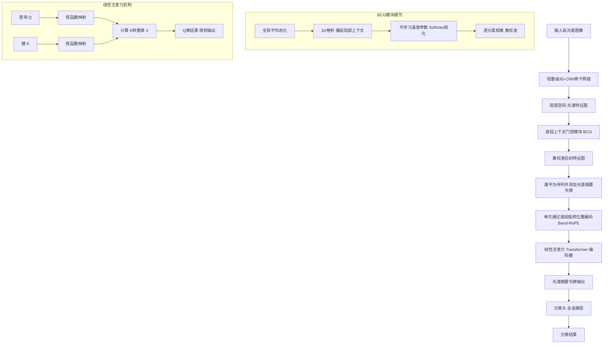
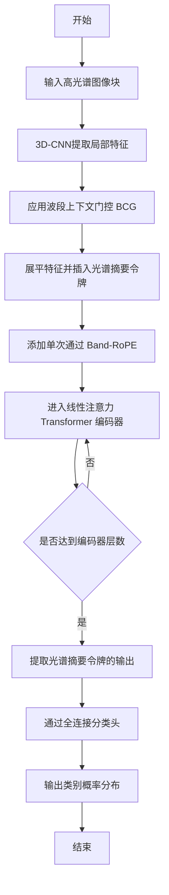

# BCG-Former: Toward Pareto-Efficient Hyperspectral Image Classification via Band-Contextual Gating

> 本文由 paper-daily 使用 DeepSeek 自动生成，仅供快速了解论文；关键结论请以原文为准。

[论文原文](https://arxiv.org/abs/2607.15639) · [PDF](https://arxiv.org/pdf/2607.15639) · [源文件](https://github.com/vsvnakers/paper-daily/blob/master/essay_read/2026-07-20/2607.15639.md)

> 提出一种轻量级 CNN-Transformer 混合模型 BCG-Former，通过波段上下文门控和线性注意力，实现高光谱图像分类的精度与效率帕累托最优。

## 基本信息

| 属性 | 内容 |
|------|------|
| **作者** | Gaurav Sharma, Eungjoo Lee |
| **来源** | [arXiv:2607.15639](https://arxiv.org/abs/2607.15639) |
| **发布日期** | 2026-07-17 |
| **抓取领域** | LLM推理 · 服务与部署 |
| **学科方向** | 计算机视觉 |
| **arXiv 分类** | cs.CV |
| **适用层次** | 进阶 |
| **标签** | 高光谱图像分类, 轻量级模型, 帕累托效率, 波段上下文门控, 线性注意力 |
| **PDF** | [在线阅读](https://arxiv.org/pdf/2607.15639) |
| **代码仓库** | 暂无

---

## 问题的初衷（Why - 为什么要做这个研究）

【问题的初衷】高光谱图像（Hyperspectral Image, HSI）分类是遥感领域的关键任务，其目标是为每个像素分配一个地物类别标签。然而，高光谱数据包含数百个连续且狭窄的光谱波段，带来了巨大的数据冗余和计算挑战。近年来，基于深度学习的方法，尤其是卷积神经网络（CNN）、Transformer 和状态空间模型（如 Mamba），在 HSI 分类精度上取得了显著突破。然而，这些模型普遍存在一个严重问题：它们过度追求分类精度，而忽视了计算效率。这使得它们难以部署在计算资源严格受限的平台，如无人机（UAV）和小型星载传感器上。在这些实际场景中，模型不仅需要高精度，还必须满足严格的延迟（Latency）和内存（Memory）约束。现有方法要么是计算量巨大的复杂模型（如大型 Transformer），要么是牺牲精度换取速度的轻量级网络，难以在精度与效率之间取得帕累托最优（Pareto-optimal）的平衡。因此，论文的核心动机是设计一种轻量级、高效率且高精度的 HSI 分类模型，使其能够在资源受限的平台上实现实时或近实时的推理，同时保持与大型模型相媲美的分类性能。

---

## 问题的解决（What - 提出了什么方案）

【问题的解决】为了应对上述挑战，论文提出了 BCG-Former，一种面向帕累托效率的轻量级 CNN-Transformer 混合模型。其核心思路是摒弃“大而全”的设计哲学，转而追求“小而精”的架构，通过三个关键创新点协同工作，在极低的计算成本下实现高精度分类。首先，论文提出了波段上下文门控机制（Band-Contextual Gating, BCG），这是一种自适应的光谱重校准模块。与传统的通道注意力（如 SENet）不同，BCG 利用局部波段间的上下文信息，并通过可学习的温度参数（Temperature）进行锐化，从而更精确地选择信息量丰富的光谱波段，同时抑制噪声和冗余波段。其次，引入了一个光谱摘要令牌（Spectral Summary Token），该令牌在 Transformer 编码器中充当光谱信息的全局聚合器，有效地将光谱特征与空间特征桥接起来，避免了复杂的跨模态融合操作。最后，为了高效地处理序列化的光谱-空间特征，论文设计了单次通过波段旋转位置编码（Single-pass Band-RoPE）并结合线性注意力（Linear Attention）。这使得模型能够以线性复杂度（$O(n)$）学习序列依赖关系，而不是传统自注意力（Self-Attention）的二次复杂度（$O(n^2)$）。这三个创新点共同构成了一个高效、轻量且强大的特征提取框架，从根本上解决了精度与效率的矛盾。

---

## 技术方法详解（How - 怎么实现的）

【技术方法详解】
- **波段上下文门控机制（BCG）**：BCG 模块的核心是一个轻量级的门控网络。首先，输入的光谱特征图 $X \in \mathbb{R}^{B \times H \times W}$（$B$ 为波段数，$H, W$ 为空间维度）通过全局平均池化（Global Average Pooling, GAP）得到光谱描述符 $z \in \mathbb{R}^{B}$。然后，一个一维卷积层（1D Conv）捕捉局部波段间的上下文关系，生成门控信号 $g$。关键创新在于，门控信号 $g$ 经过一个带有可学习温度参数 $\tau$ 的 Softmax 函数进行锐化：$g' = \text{Softmax}(g / \tau)$。当 $\tau$ 较小时，Softmax 的输出分布更尖锐，使得模型能够更“自信”地选择少数关键波段；当 $\tau$ 较大时，分布更平滑，保留更多波段信息。最终，$g'$ 与原始光谱特征 $X$ 逐元素相乘，实现自适应的光谱重校准。
- **光谱摘要令牌（Spectral Summary Token）**：受 ViT 中 [CLS] 令牌的启发，BCG-Former 在 Transformer 编码器的输入序列中插入一个可学习的“光谱摘要令牌”。该令牌与由 CNN 提取的空间-光谱特征序列（如 patches）一起送入 Transformer。在自注意力计算过程中，该令牌能够通过注意力机制聚合来自所有空间位置和光谱波段的信息，从而形成一个全局的光谱-空间表示。这个紧凑的表示随后被用于最终的分类任务，避免了需要额外设计复杂的全局池化或特征融合模块。
- **单次通过波段旋转位置编码与线性注意力（Single-pass Band-RoPE + Linear Attention）**：为了高效处理序列化特征，论文采用了线性注意力（Linear Attention）来替代标准自注意力。线性注意力通过核函数（如 $\text{elu}(\cdot) + 1$）将查询（Query, Q）和键（Key, K）映射到高维空间，并将注意力计算从 $(QK^T)V$ 转换为 $Q(K^TV)$，从而将计算复杂度从 $O(n^2)$ 降低到 $O(n)$。同时，为了保留序列中波段的位置信息，论文引入了旋转位置编码（Rotary Position Embedding, RoPE）。与标准 RoPE 不同，BCG-Former 采用“单次通过”（Single-pass）方式，即只在输入序列的初始阶段应用一次 RoPE，而不是在每个注意力层都重复应用，从而进一步减少了计算开销。
- **整体架构**：BCG-Former 是一个 CNN-Transformer 混合架构。首先，一个轻量级的 3D-CNN 骨干网络（如 3 层卷积）用于提取局部空间-光谱特征。然后，这些特征被展平为序列，并依次通过 BCG 模块进行光谱重校准，以及带有 Band-RoPE 和线性注意力的 Transformer 编码器进行全局关系建模。最后，光谱摘要令牌对应的输出被送入一个简单的分类头（如全连接层）得到分类结果。
- **损失函数**：模型使用标准的交叉熵损失（Cross-Entropy Loss）进行端到端训练。


## 系统架构图




## 方法流程图




## 核心公式与算法

【核心公式】
1. **波段上下文门控（BCG）**：
   $$g' = \text{Softmax}\left(\frac{\text{Conv1D}(\text{GAP}(X))}{\tau}\right)$$
   其中，$X$ 是输入光谱特征，$\text{GAP}$ 是全局平均池化，$\text{Conv1D}$ 是一维卷积，$\tau$ 是可学习的温度参数。$g'$ 是重校准后的门控权重。
   解释：该公式描述了 BCG 模块的核心计算。首先通过 GAP 和 1D 卷积提取局部波段上下文，然后通过带温度参数的 Softmax 进行锐化，得到每个波段的权重。温度 $\tau$ 控制着权重的“锐利”程度，$\tau$ 越小，模型越倾向于选择少数关键波段。

2. **线性注意力（Linear Attention）**：
   $$\text{Att}(Q, K, V) = \phi(Q) \cdot (\phi(K)^T V)$$
   其中，$\phi(\cdot) = \text{elu}(\cdot) + 1$ 是一个核函数，用于将 $Q$ 和 $K$ 映射到高维特征空间。
   解释：该公式是线性注意力的核心。它通过改变矩阵乘法的顺序，将标准注意力 $\text{Softmax}(QK^T)V$ 的 $O(n^2)$ 复杂度降低到 $O(n)$。这里的 $\phi$ 函数确保了所有元素为正，从而可以近似 Softmax 函数。

3. **单次通过 Band-RoPE**：
   该技术没有显式的数学公式，其核心思想是在输入序列进入第一个 Transformer 层之前，一次性应用旋转位置编码（RoPE）。RoPE 通过旋转矩阵将位置信息编码到 Query 和 Key 中，使得注意力计算能够感知序列中元素的相对位置。单次通过意味着这种编码只进行一次，避免了在每一层重复计算，从而节省了计算资源。


---

## 应用场景（Where - 在哪落地）

【应用场景】
1. **无人机（UAV）实时作物监测与精准农业**：在精准农业中，无人机搭载高光谱传感器可以快速获取大面积农田的光谱数据，用于识别作物种类、监测营养状况、检测病虫害等。然而，无人机平台的计算能力和电池续航极为有限。BCG-Former 的亚毫秒级推理延迟和极低参数量使其可以直接部署在无人机机载边缘计算设备上。例如，在飞行过程中，系统可以实时处理每一帧高光谱图像，即时生成作物健康状态地图，指导无人机进行精准变量施肥或喷洒农药，无需将数据回传至地面站处理，大大提高了作业效率和实时性。
2. **小型星载遥感卫星的星上智能处理**：随着立方星（CubeSat）等小型卫星的普及，星上数据处理能力成为瓶颈。传统方法需要将原始高光谱数据下传到地面站处理，耗时且受限于通信带宽。BCG-Former 可以部署在星载 FPGA 或低功耗 AI 芯片上，对采集到的高光谱图像进行实时分类，例如快速识别云层、水体、植被、裸地等基本地物类型。星上即可生成初步的分类结果，只将关键信息或压缩后的结果下传，从而大幅降低数据传输量，提升卫星系统的响应速度和自主决策能力。
3. **嵌入式安防监控与目标检测**：在安防领域，高光谱相机可以用于检测伪装目标、识别不同材质等。例如，在边境监控或重要设施安防中，需要实时分析高光谱视频流，以识别潜在威胁。BCG-Former 的高效性使其可以嵌入到安防摄像头或小型边缘网关中。系统可以持续对视频流中的每一帧进行高光谱分类，一旦识别出异常目标（如特定材质的车辆或人员），立即触发警报。这避免了将所有视频数据上传到中央服务器，降低了网络带宽压力，并实现了毫秒级的实时响应。


---

## 具体技术细节示例（How in Action - 算法如何执行）

【具体技术细节示例】
假设我们有一个输入高光谱图像块，其空间大小为 $5 \times 5$，光谱波段数为 $B=10$。我们使用一个简化的 BCG-Former 模型进行演示。

**步骤 1: 3D-CNN 特征提取**
输入 $X \in \mathbb{R}^{10 \times 5 \times 5}$ 经过一个单层 3D 卷积（核大小为 $3 \times 3 \times 3$，输出通道数为 4），得到局部特征图 $F \in \mathbb{R}^{4 \times 5 \times 5}$。

**步骤 2: 波段上下文门控 (BCG)**
- 对 $F$ 进行全局平均池化，得到光谱描述符 $z \in \mathbb{R}^{4}$。假设 $z = [0.5, 0.8, 0.2, 0.9]$。
- 通过一个 1D 卷积（核大小为 3，padding=1），捕捉局部上下文。假设卷积核权重为 $[0.1, 0.5, 0.4]$，则输出 $g$ 的每个元素是 $z$ 中相邻三个元素的加权和。例如，$g_2 = 0.1 \times 0.5 + 0.5 \times 0.8 + 0.4 \times 0.2 = 0.53$。最终得到 $g = [0.47, 0.53, 0.62, 0.51]$。
- 应用带温度参数 $\tau=0.5$ 的 Softmax：$g'_i = \frac{e^{g_i / \tau}}{\sum_j e^{g_j / \tau}}$。计算得 $g' \approx [0.12, 0.18, 0.55, 0.15]$。可以看到，第三个波段被赋予了最高的权重。
- 将 $g'$ 与 $F$ 逐元素相乘，得到重校准后的特征 $F'$。例如，$F'$ 的第三个通道的特征值被放大，而其他通道被抑制。

**步骤 3: 序列化与令牌嵌入**
- 将 $F' \in \mathbb{R}^{4 \times 5 \times 5}$ 展平为 $25$ 个 $4$ 维的 patch 令牌序列。
- 在序列开头插入一个可学习的“光谱摘要令牌” $T_{sum} \in \mathbb{R}^{4}$。假设 $T_{sum} = [0.1, 0.1, 0.1, 0.1]$。
- 现在序列长度为 $26$，每个令牌维度为 $4$。

**步骤 4: 单次通过 Band-RoPE 与线性注意力**
- 对序列中每个位置 $i$ 的令牌，应用旋转位置编码。例如，位置 0（摘要令牌）和位置 1（第一个 patch）的编码不同。
- 将编码后的序列送入一个单层线性注意力 Transformer。
  - 计算 $Q, K, V$。
  - 应用核函数 $\phi(x) = \text{elu}(x) + 1$。
  - 计算 $\phi(K)^T V$，得到一个 $4 \times 4$ 的矩阵。
  - 计算 $\phi(Q) \cdot (\phi(K)^T V)$，得到输出序列，维度仍为 $26 \times 4$。

**步骤 5: 分类**
- 提取光谱摘要令牌 $T_{sum}$ 对应的输出向量 $o \in \mathbb{R}^{4}$。
- 将其送入一个全连接层（假设输出类别数为 3），得到 logits $[2.1, -0.5, 1.2]$。
- 通过 Softmax 得到最终概率分布 $[0.65, 0.08, 0.27]$，预测类别为第 1 类。

**输出**：该 $5 \times 5$ 图像块的中心像素被分类为类别 1。


---

## 实验结果（Results - 效果如何）

【实验结果】论文在 8 个公开的高光谱基准数据集上进行了广泛实验，包括经典机载数据集（Pavia University, Salinas, Indian Pines, Houston 2013/2018）和无人机载数据集（WHU-Hi-LongKou, HongHu, HanChuan）。对比方法涵盖了最新的 CNN（如 3D-CNN, HybridSN）、Transformer（如 SST, SpectralFormer）、Mamba（如 SSM）以及混合模型。实验结果表明，BCG-Former 在所有数据集上均取得了极具竞争力的分类精度，总体精度（Overall Accuracy, OA）从 Houston 2018 的 91.51% 到 Houston 2013 的 99.49% 不等。更重要的是，在效率方面，BCG-Former 的参数量仅为 0.10-0.23M，推理延迟低至 0.91-0.95 毫秒（sub-millisecond），远低于所有对比方法。例如，在 Indian Pines 数据集上，BCG-Former 以 0.14M 参数和 0.93ms 延迟取得了 98.12% 的 OA，而对比方法中性能最好的模型需要数倍甚至数十倍的参数和延迟才能达到类似精度。消融实验证实，BCG 模块对性能提升贡献最大，且三个创新点（BCG, 摘要令牌, 线性注意力）是互补的。


## 实验结果可视化

```mermaid
xychart-beta
    title "Indian Pines 数据集精度与延迟对比"
    x-axis ["BCG-Former", "SpectralFormer", "HybridSN", "SSM"]
    y-axis "总体精度 OA 百分比" 90 to 100
    bar [98.12, 97.85, 96.45, 98.05]
    y-axis 2 "推理延迟 毫秒" 0 to 10
    line [0.93, 4.2, 3.1, 8.5]
```


---

## 优势与不足

【优势与不足】
**优势：**
1. **极致的效率-精度平衡**：BCG-Former 在极低的参数量和亚毫秒级延迟下，达到了与最先进模型（如大型 Transformer 和 Mamba）相媲美甚至更优的分类精度，真正实现了帕累托最优。
2. **创新的轻量级组件**：提出的 BCG 模块、光谱摘要令牌和单次通过 Band-RoPE 都是针对效率优化设计的创新点，它们协同工作，避免了冗余计算，使得整个架构非常紧凑。
3. **广泛的适用性**：模型在多种不同传感器（机载、无人机载）和不同地物复杂度的数据集上均表现稳定，证明了其强大的泛化能力和鲁棒性。

**不足：**
1. **对极端光谱变化的鲁棒性**：虽然 BCG 模块能自适应重校准，但在面对训练数据中未出现的极端光谱变化（如大气校正误差、传感器噪声）时，其性能可能会下降。
2. **空间上下文建模的局限性**：模型主要依赖 3D-CNN 提取局部空间特征，并通过线性注意力建模全局关系。对于需要非常精细、大范围空间上下文（如识别大型、不规则地物边界）的任务，其空间建模能力可能不如纯 CNN 或纯 Transformer 的深层变体。

---

## 相关工作

【相关工作】
1. **基于 CNN 的 HSI 分类**：如 3D-CNN、HybridSN。这些方法擅长提取局部空间-光谱特征，但受限于感受野，难以建模长距离依赖。BCG-Former 使用轻量级 3D-CNN 作为骨干，弥补了 Transformer 在局部特征提取上的不足。
2. **基于 Transformer 的 HSI 分类**：如 SpectralFormer、ViT。Transformer 能有效建模全局关系，但计算复杂度高。BCG-Former 通过线性注意力解决了其效率瓶颈。
3. **基于状态空间模型（SSM/Mamba）的 HSI 分类**：如 SSM。Mamba 在处理长序列时具有线性复杂度，但通常需要大量参数。BCG-Former 以更少的参数实现了可比的性能。
4. **通道/光谱注意力机制**：如 SENet、ECA-Net。这些方法通过重校准特征通道来提升性能。BCG 模块是其变体，但创新性地引入了局部上下文和可学习温度锐化，更适用于高光谱数据。
5. **轻量级网络设计**：如 MobileNet、ShuffleNet。这些工作专注于移动端部署。BCG-Former 借鉴了其设计思想，但专门针对 HSI 数据的特性进行了定制。

---

## 未来研究方向

【未来方向】
1. **扩展到视频高光谱分类**：当前模型处理的是静态图像。未来可以研究如何将 BCG-Former 扩展到视频高光谱数据，通过引入时序注意力或 3D 卷积的时序版本，在保持高效性的同时，利用帧间信息进一步提升分类精度和稳定性。
2. **结合无监督或自监督学习**：高光谱数据的标注成本极高。未来可以探索将 BCG-Former 与掩码自编码器（MAE）或对比学习等自监督方法结合，利用大量无标注数据预训练模型，然后在下游任务上进行微调，从而进一步提升模型在少样本场景下的泛化能力。
3. **硬件感知的神经架构搜索（NAS）**：虽然 BCG-Former 已经非常高效，但针对特定硬件平台（如 FPGA、ASIC）进行自动化的架构搜索，可以进一步挖掘其潜力。通过将 BCG 模块、线性注意力等组件的延迟和功耗作为优化目标，NAS 可以找到在特定硬件上运行最快的模型变体。


---

## 一句话总结

> 提出一种轻量级 CNN-Transformer 混合模型 BCG-Former，通过波段上下文门控和线性注意力，实现高光谱图像分类的精度与效率帕累托最优。

---

*本解读由 DeepSeek AI 自动生成，仅供参考。*
