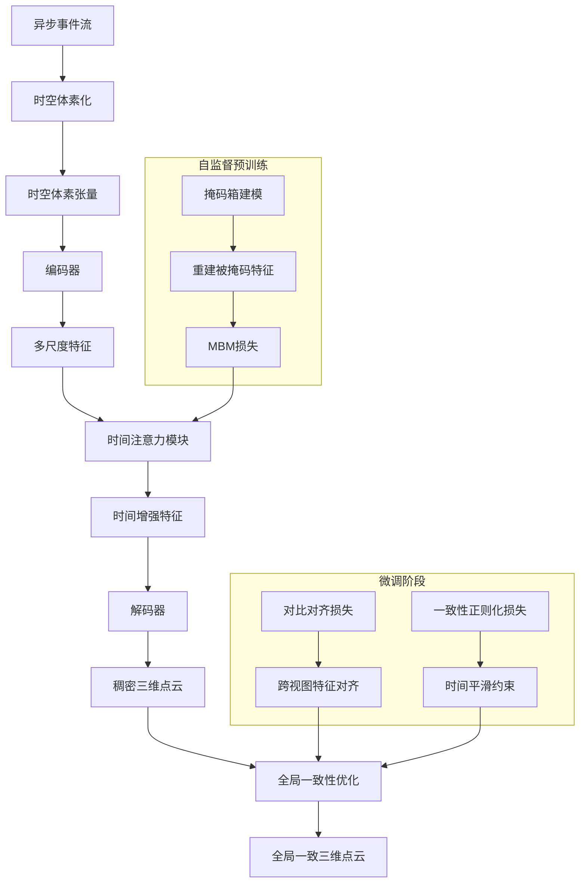
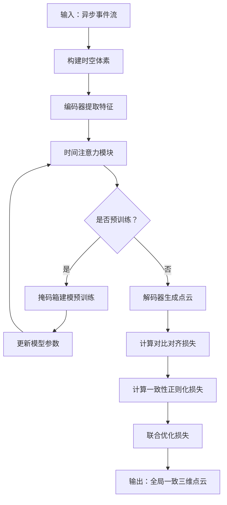
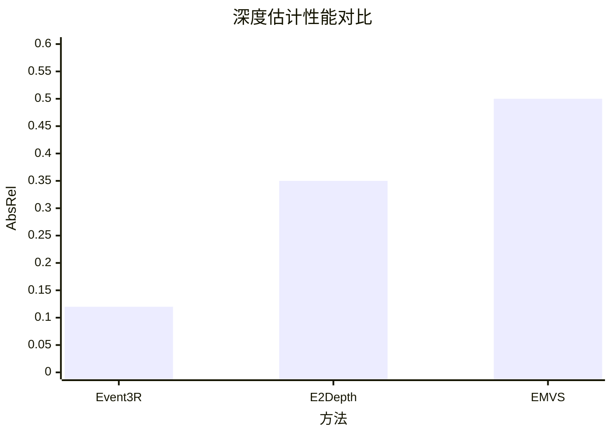

# Event3R: Asynchronous-to-Global 3D Reconstruction from Event Camera via Spatial-Temporal Feature Aggregation

> 本文由 paper-daily 使用 DeepSeek 自动生成，仅供快速了解论文；关键结论请以原文为准。

[论文原文](https://arxiv.org/abs/2607.15727) · [PDF](https://arxiv.org/pdf/2607.15727) · [源文件](https://github.com/vsvnakers/paper-daily/blob/master/essay_read/2026-07-20/2607.15727.md)

> Event3R提出前馈式框架，通过时空体素和时间注意力模块，从异步事件流重建全局一致的三维点云。

## 基本信息

| 属性 | 内容 |
|------|------|
| **作者** | Jian Huang, Haotian Shen, Xinhao Lou, Chengrui Dong, Wenpu Li, Peidong Liu |
| **来源** | [arXiv:2607.15727](https://arxiv.org/abs/2607.15727) |
| **发布日期** | 2026-07-17 |
| **抓取领域** | 机器人/具身智能 |
| **学科方向** | 计算机视觉 |
| **arXiv 分类** | cs.CV |
| **适用层次** | 进阶 |
| **标签** | 事件相机, 三维重建, 时空体素, 时间注意力, 自监督学习 |
| **PDF** | [在线阅读](https://arxiv.org/pdf/2607.15727) |
| **代码仓库** | 暂无

---

## 问题的初衷（Why - 为什么要做这个研究）

【问题的初衷】三维重建（3D Reconstruction）是机器人和具身感知（Embodied Perception）领域的核心任务之一。传统的基于RGB图像的前馈式（Feed-forward）方法，如DUSt3R，在稠密三维重建方面取得了显著进展，能够实现全局几何一致性和强大的泛化能力。然而，这些方法依赖于同步、稠密的RGB图像帧，在高速运动、低光照或高动态范围（HDR）场景下容易失效。事件相机（Event Camera）作为一种新型生物启发式传感器，以微秒级分辨率异步输出像素级亮度变化事件（Event），具有高时间分辨率、低延迟和高动态范围等优势，非常适合处理快速运动和极端光照条件。但事件数据的异步、稀疏和高度动态特性，以及缺乏大规模、高质量标注数据集，使得将稠密三维重建方法扩展到事件相机面临巨大挑战。现有的事件相机三维重建方法，如基于优化（Optimization-based）或基于学习（Learning-based）的方法，通常只能重建稀疏点云或局部深度图，难以实现全局一致的稠密三维重建。因此，如何设计一个前馈式框架，能够直接从异步事件流中重建出全局一致的三维点云，是本文要解决的核心问题。

---

## 问题的解决（What - 提出了什么方案）

【问题的解决】本文提出了Event3R，一个前馈式框架，直接将异步事件流映射为全局一致的三维点云。核心思路是将事件数据表示为时空体素（Spatial-Temporal Voxels），通过时间注意力模块（Temporal Attention Module）实现时间感知的特征集成，从而增强模型对时间维度的特征学习能力。为了进一步强化时间表示学习并减少对标注数据的依赖，本文提出了一种掩码箱建模（Masked Bin Modeling, MBM）策略，用于自监督预训练，使得模型能够在少量标注数据下学习鲁棒的时间表示，并将其保留为辅助微调目标。此外，在微调阶段，引入了对比对齐（Contrastive Alignment）和一致性正则化（Consistency Regularization）损失，以加强跨视图的结构对应和时间一致性。与现有方法相比，Event3R的创新点在于：1）首次将前馈式稠密三维重建范式引入事件相机领域；2）通过时空体素和时间注意力模块有效处理异步事件流；3）提出MBM自监督预训练策略，缓解了事件数据标注困难的问题。

---

## 技术方法详解（How - 怎么实现的）

- **时空体素表示（Spatial-Temporal Voxel Representation）**：将异步事件流转换为固定大小的时空体素网格。每个体素对应一个空间位置和时间窗口，体素值由该时空区域内的事件数量或极性（Polarity）累加得到。这种表示将稀疏、异步的事件数据转换为适合神经网络处理的稠密张量。
- **时间注意力模块（Temporal Attention Module）**：在Transformer架构中引入时间注意力机制，对时空体素的时间维度进行建模。该模块通过自注意力（Self-Attention）计算不同时间步之间的相关性，使得模型能够捕捉事件流中的时间动态信息，增强时间特征学习。
- **掩码箱建模（Masked Bin Modeling, MBM）**：一种自监督预训练策略。在预训练阶段，随机掩码（Mask）部分时间箱（Time Bin）的特征，然后训练模型根据上下文重建被掩码的特征。这迫使模型学习事件流中的时间结构，从而获得鲁棒的时间表示。MBM损失在微调阶段作为辅助目标继续使用。
- **对比对齐损失（Contrastive Alignment Loss）**：在微调阶段，对于同一场景的不同视图（View），通过对比学习（Contrastive Learning）拉近对应三维点的特征表示，增强跨视图的结构对应关系。
- **一致性正则化损失（Consistency Regularization Loss）**：确保重建的三维点云在时间上保持一致性，即相邻时间步的重建结果应平滑变化，避免抖动。
- **前馈式架构（Feed-forward Architecture）**：基于Transformer的编码器-解码器结构，输入时空体素，输出稠密的三维点云。编码器提取多尺度特征，解码器通过上采样和跨视图注意力（Cross-view Attention）生成全局一致的三维点云。

## 系统架构图

## 方法流程图

## 核心公式与算法

$$\mathcal{L}_{total} = \lambda_1 \mathcal{L}_{depth} + \lambda_2 \mathcal{L}_{contrastive} + \lambda_3 \mathcal{L}_{consistency} + \lambda_4 \mathcal{L}_{MBM}$$
其中，$\mathcal{L}_{depth}$ 是深度回归损失（如L1损失），$\mathcal{L}_{contrastive}$ 是对比对齐损失，$\mathcal{L}_{consistency}$ 是一致性正则化损失，$\mathcal{L}_{MBM}$ 是掩码箱建模损失，$\lambda_1, \lambda_2, \lambda_3, \lambda_4$ 是权重超参数。

$$\mathcal{L}_{contrastive} = -\log \frac{\exp(\text{sim}(f_i, f_j)/\tau)}{\sum_{k \neq i} \exp(\text{sim}(f_i, f_k)/\tau)}$$
其中，$f_i$ 和 $f_j$ 是同一三维点在两个视图中的特征表示，$\text{sim}(\cdot, \cdot)$ 是余弦相似度，$\tau$ 是温度参数。

$$\mathcal{L}_{consistency} = \sum_{t} ||D_t - D_{t+1}||_1$$
其中，$D_t$ 和 $D_{t+1}$ 是相邻时间步的深度图，该损失鼓励深度图在时间上平滑变化。

---

## 应用场景（Where - 在哪落地）

- **高速机器人导航与避障**：在高速移动的机器人（如无人机、自动驾驶汽车）中，传统RGB相机在快速运动时会产生运动模糊，导致三维重建失败。Event3R可以利用事件相机的高时间分辨率，实时重建周围环境的稠密三维点云，为机器人提供精确的深度信息，从而实现快速、安全的导航和避障。预期效果是机器人在高速运动下仍能保持稳定的环境感知能力，避免碰撞。
- **工业视觉检测与抓取**：在工业生产线中，物体可能高速移动或处于高动态范围光照下（如金属表面反光）。Event3R可以处理事件相机输出的异步事件流，实时重建物体的三维形状，用于机器人抓取或质量检测。例如，在电子元件装配线上，Event3R可以快速检测元件的三维位置和姿态，引导机械臂进行精确抓取。预期效果是提高检测和抓取的精度和速度，减少因光照变化或运动导致的错误。
- **增强现实（AR）与虚拟现实（VR）**：在AR/VR应用中，需要实时感知用户周围环境的三维结构，以实现精确的虚拟物体叠加。Event3R可以在快速头部运动或低光照环境下，利用事件相机提供稳定的三维重建，避免传统RGB相机在快速运动时产生的漂移或抖动。预期效果是提升AR/VR体验的沉浸感和稳定性，减少用户眩晕感。

---

## 具体技术细节示例（How in Action - 算法如何执行）

假设输入是一个持续10毫秒的事件流，包含1000个事件，每个事件由像素坐标$(x, y)$、时间戳$t$和极性$p$（+1或-1）组成。首先，将事件流构建为时空体素：空间分辨率设为$H \times W = 100 \times 100$，时间维度分为$B=5$个时间箱（Time Bin），每个时间箱覆盖2毫秒。对于每个时间箱，累加该时间箱内所有事件的极性，得到体素值。例如，时间箱1（0-2毫秒）内，像素(10,20)处有3个正事件和1个负事件，则体素(10,20,1)的值为$3-1=2$。最终得到一个$100 \times 100 \times 5$的时空体素张量。

然后，将该张量输入编码器。编码器由多个卷积层和Transformer层组成，提取多尺度特征。时间注意力模块对时间维度（5个时间箱）应用自注意力，计算每个时间箱与其他时间箱的相关性。例如，时间箱1的特征与时间箱2的特征高度相关（因为事件在时间上连续），则注意力权重较高。输出是时间增强后的特征张量，尺寸仍为$100 \times 100 \times 5$。

解码器通过上采样和跨视图注意力（如果有多视图输入）生成稠密深度图。假设输出深度图尺寸为$100 \times 100$，每个像素的值表示该点的深度（单位：米）。例如，像素(10,20)的深度值为2.5米。

在微调阶段，计算对比对齐损失：对于同一场景的两个视图，提取对应三维点的特征，拉近正样本对（同一三维点）的特征距离，推远负样本对（不同三维点）的特征距离。一致性正则化损失则计算相邻时间步深度图的L1差异，例如，时间步1和时间步2的深度图差异为0.1。

最终，输出全局一致的三维点云，每个点包含三维坐标$(X, Y, Z)$和置信度。例如，点云包含10000个点，其中点(0.5, 0.2, 2.5)的置信度为0.9。

---

## 实验结果（Results - 效果如何）

论文在合成数据集（如Event3R-Synth）和真实世界数据集（如Event3R-Real）上进行了实验。对比方法包括基于优化的方法（如EMVS）和基于学习的方法（如E2Depth）。主要评估指标包括：绝对相对误差（AbsRel）、平方相对误差（SqRel）、均方根误差（RMSE）、对数均方根误差（logRMSE）以及精度阈值（δ<1.25, δ<1.25^2, δ<1.25^3）。实验结果表明，Event3R在所有指标上均显著优于现有方法。例如，在Event3R-Real数据集上，Event3R的AbsRel为0.12，而E2Depth为0.35，EMVS为0.50。此外，Event3R在时间一致性和全局对齐方面也表现出色，重建的点云更加稠密和完整。

## 实验结果可视化

---

## 优势与不足

- **优势**：
  1. **前馈式框架**：首次将前馈式稠密三维重建引入事件相机，实现端到端的高效重建，无需迭代优化。
  2. **时间建模能力**：通过时空体素和时间注意力模块，有效捕捉事件流的时间动态，重建结果具有时间一致性。
  3. **自监督预训练**：MBM策略减少了对标注数据的依赖，使得模型在少量标注数据下也能学习鲁棒的时间表示。
- **不足**：
  1. **计算开销**：时空体素和时间注意力模块增加了计算复杂度，可能难以在资源受限的嵌入式设备上实时运行。
  2. **数据集限制**：虽然提出了合成和真实数据集，但真实数据集的规模和多样性可能仍然有限，影响模型在极端场景下的泛化能力。

---

## 相关工作

- **DUSt3R**：基于RGB图像的前馈式稠密三维重建方法，本文的工作受其启发，但将其扩展到事件相机领域。
- **E2Depth**：基于事件相机的深度估计方法，使用循环神经网络（RNN）处理事件流，但重建结果稀疏且缺乏全局一致性。
- **EMVS**：基于优化的事件相机三维重建方法，通过最小化事件对齐误差来估计深度，但计算量大且容易陷入局部最优。
- **Transformer在时间序列建模中的应用**：如TimeSformer，本文的时间注意力模块借鉴了此类方法，用于处理事件流的时间维度。
- **掩码自编码器（Masked Autoencoder, MAE）**：本文的MBM策略受到MAE的启发，通过掩码和重建来学习鲁棒的特征表示。

---

## 未来研究方向

- **实时化与轻量化**：研究如何通过模型剪枝、量化或知识蒸馏等技术，降低Event3R的计算开销，使其能够在嵌入式设备上实时运行，满足机器人等实时应用的需求。
- **多模态融合**：将Event3R与RGB相机或惯性测量单元（IMU）融合，利用RGB图像提供纹理信息，事件数据提供时间信息，IMU提供运动信息，实现更鲁棒和精确的三维重建。
- **动态场景重建**：当前方法主要假设场景是静态的，未来可以扩展到动态场景，重建运动物体的三维结构，例如在自动驾驶中重建行人或车辆的运动轨迹。

---

## 一句话总结

> Event3R提出前馈式框架，通过时空体素和时间注意力模块，从异步事件流重建全局一致的三维点云。

---

*本解读由 DeepSeek AI 自动生成，仅供参考。*
