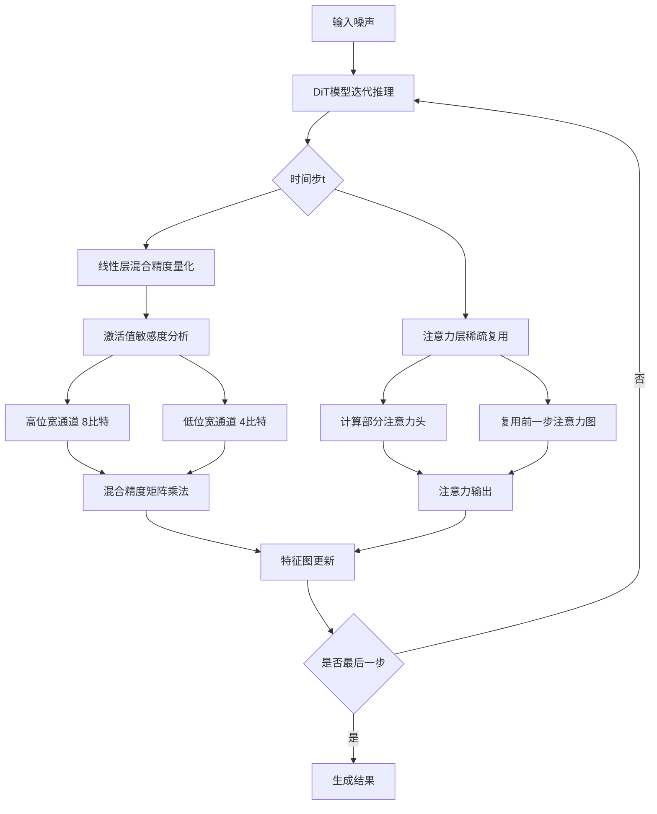
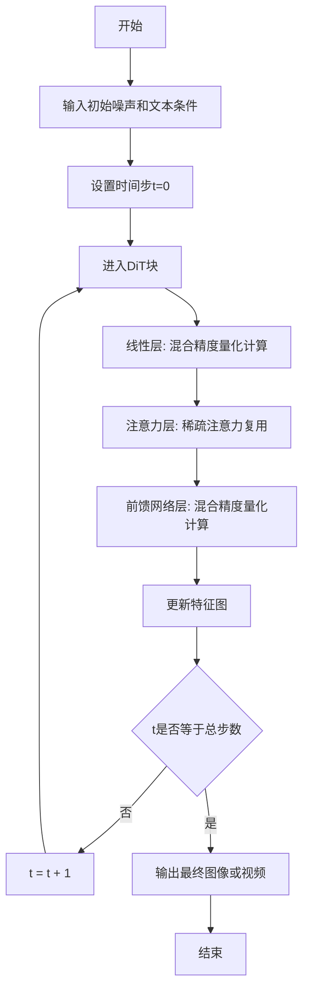
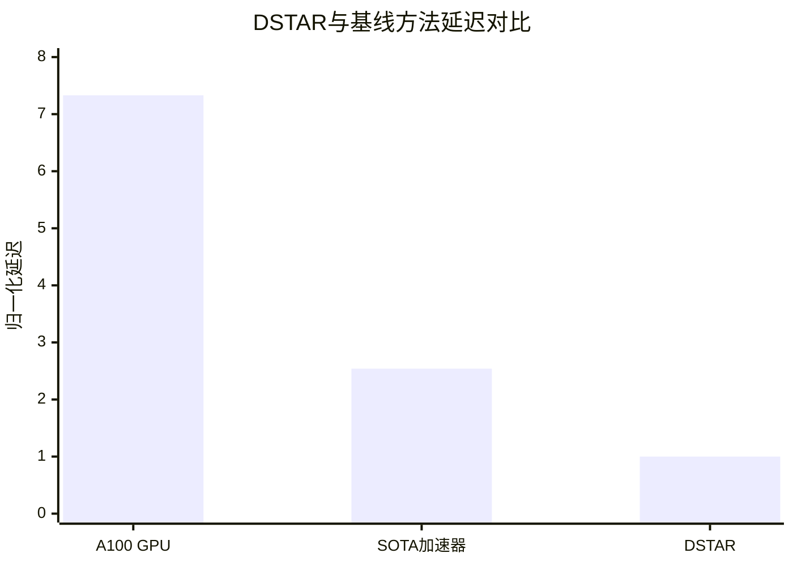

# DSTAR: Accelerating Diffusion Transformers via Spatial and Temporal Redundancy Reduction

> 本文由 paper-daily 使用 DeepSeek 自动生成，仅供快速了解论文；关键结论请以原文为准。

[论文原文](https://arxiv.org/abs/2607.15846) · [PDF](https://arxiv.org/pdf/2607.15846) · [源文件](https://github.com/vsvnakers/paper-daily/blob/master/essay_read/2026-07-20/2607.15846.md)

> DSTAR通过软件-硬件协同设计，利用混合精度量化和稀疏注意力复用，无精度损失地加速扩散变换器推理。

## 基本信息

| 属性 | 内容 |
|------|------|
| **作者** | Chi Zhang, Jieru Zhao, Yu Feng, Chen Zhang, Quan Chen, Minyi Guo |
| **来源** | [arXiv:2607.15846](https://arxiv.org/abs/2607.15846) |
| **发布日期** | 2026-07-17 |
| **抓取领域** | CV · 图像/视频生成 |
| **学科方向** | 体系结构 |
| **arXiv 分类** | cs.AR |
| **适用层次** | 进阶 |
| **标签** | 扩散变换器, 混合精度量化, 稀疏注意力, 硬件加速器, 软件硬件协同设计 |
| **PDF** | [在线阅读](https://arxiv.org/pdf/2607.15846) |
| **代码仓库** | 暂无

---

## 问题的初衷（Why - 为什么要做这个研究）

【问题的初衷】扩散变换器（Diffusion Transformers, DiTs）在图像合成、视频生成和内容编辑等生成式AI任务中取得了显著成功。然而，其核心推理过程需要多步迭代（通常为50-1000步），导致计算延迟高、能耗大，严重限制了其在实时应用和边缘设备上的部署。现有加速方法主要聚焦于减少相邻时间步（timestep）之间的时间冗余，例如通过减少采样步数或复用相邻步的特征图。但这些方法往往忽略了DiTs自身的独特特性：1）DiTs中的线性操作（如全连接层）对不同激活值（activation）的敏感性差异巨大，现有均匀量化方法会导致精度严重下降；2）注意力层（Attention Layer）在相邻时间步之间存在大量冗余计算，但现有稀疏注意力方法缺乏对DiT时间动态性的针对性设计。因此，现有方法要么在加速时导致显著的精度退化，要么无法实现高效率。本文旨在通过软件-硬件协同设计（Software-Hardware Co-Design），同时利用DiTs中的空间冗余（spatial redundancy）和时间冗余（temporal redundancy），实现无精度损失的极致加速。

---

## 问题的解决（What - 提出了什么方案）

【问题的解决】论文提出了DSTAR，一个软件-硬件协同设计框架，通过减少空间和时间冗余来加速DiT推理。核心思路是：在算法层面，针对DiTs中线性操作对不同激活值敏感度不同的特性，提出了一种细粒度混合精度量化方法（Fine-grained Mixed-Precision Quantization），对敏感度低的激活值使用低位宽（如4比特）计算，对敏感度高的激活值使用高位宽（如8比特）计算，从而在不损失精度的情况下大幅增加低位计算的比例。同时，针对注意力层，设计了一种稀疏注意力复用机制（Sparse Attention Reuse Mechanism），利用相邻时间步注意力图（attention map）的高度相似性，复用部分注意力计算结果，减少冗余计算。在硬件层面，设计了一个专用加速器，通过支持混合精度计算和稀疏注意力模式，实现高能效和高吞吐。与现有方法的本质区别在于：DSTAR不是简单地减少时间步或均匀量化，而是深入分析DiT内部各模块的冗余特性，进行差异化处理，实现了精度与效率的帕累托最优。

---

## 技术方法详解（How - 怎么实现的）

【技术方法详解】
- **细粒度混合精度量化**：分析DiT中线性层（如全连接层和卷积层）的激活值分布，发现不同通道（channel）和不同空间位置（spatial location）的激活值对量化误差的敏感度差异很大。DSTAR提出一种基于敏感度分析的混合精度量化策略：首先计算每个激活值通道的量化敏感度（如使用Hessian矩阵或梯度），然后为高敏感度通道分配高位宽（如8比特），为低敏感度通道分配低位宽（如4比特）。量化过程采用均匀量化（uniform quantization），量化步长（scale factor）通过最小化量化误差确定。
- **稀疏注意力复用机制**：观察发现，DiT在相邻时间步的注意力图（attention map）具有极高的相似性（余弦相似度通常>0.9）。DSTAR设计了一种复用策略：对于当前时间步，只计算部分注意力头（attention head）的完整注意力图，其余头直接复用前一个时间步的注意力图。复用比例根据注意力图之间的相似度动态调整，相似度高时复用更多头。同时，为了补偿复用带来的精度损失，对复用部分引入一个轻量级的校正项（correction term），通过一个小型神经网络（如MLP）预测。
- **硬件加速器架构**：设计了一个专用的加速器，包含：1）混合精度计算单元（Mixed-Precision Compute Unit），支持4比特和8比特的矩阵乘法（Matrix Multiplication），通过位串行（bit-serial）或脉动阵列（systolic array）实现高效计算；2）稀疏注意力引擎（Sparse Attention Engine），支持注意力图的复用和稀疏模式计算；3）片上存储层次（On-chip Memory Hierarchy），包括SRAM和eDRAM，用于缓存激活值和注意力图，减少片外数据搬运。
- **协同优化**：算法和硬件联合设计，量化策略和稀疏复用策略的参数（如位宽分配、复用比例）通过硬件模拟器（hardware simulator）进行搜索，以在给定硬件资源约束下最大化加速比。
- **训练后量化**：DSTAR的量化方法属于训练后量化（Post-Training Quantization, PTQ），无需重新训练模型，仅需少量校准数据（calibration data）即可确定量化参数，降低了部署成本。

## 系统架构图

## 方法流程图

## 核心公式与算法

【核心公式】
1. **混合精度量化公式**：
   $$\hat{x} = \text{clamp}\left(\left\lfloor \frac{x}{s} \right\rceil, -2^{b-1}, 2^{b-1}-1\right) \times s$$
   其中 $x$ 是原始激活值，$s$ 是量化步长，$b$ 是位宽，$\lfloor \cdot \rceil$ 表示四舍五入取整。不同通道使用不同的 $b$ 和 $s$。

2. **注意力复用校正**：
   $$A_t = \alpha \cdot A_{t-1} + (1-\alpha) \cdot \text{Softmax}\left(\frac{Q_t K_t^T}{\sqrt{d_k}}\right)$$
   其中 $A_t$ 是当前时间步的注意力图，$A_{t-1}$ 是前一步的注意力图，$\alpha$ 是复用比例（由相似度决定），$Q_t, K_t$ 是当前步的查询和键矩阵。

3. **能耗模型**：
   $$E_{\text{total}} = E_{\text{compute}} + E_{\text{memory}} = \sum_{l} (b_l \cdot \text{MAC}_l \cdot E_{\text{MAC}}) + \sum_{l} (\text{Data}_l \cdot E_{\text{DRAM}})$$
   其中 $b_l$ 是第 $l$ 层的平均位宽，$\text{MAC}_l$ 是乘法累加操作数，$E_{\text{MAC}}$ 是单次MAC能耗，$\text{Data}_l$ 是片外数据量，$E_{\text{DRAM}}$ 是单位数据DRAM访问能耗。

---

## 应用场景（Where - 在哪落地）

【应用场景】
1. **实时图像生成**：在AIGC（AI Generated Content）平台（如Midjourney、Stable Diffusion）中，用户期望快速生成高质量图像。DSTAR可将DiT模型的推理延迟从秒级降低到毫秒级，支持实时交互式生成。例如，用户输入文本描述后，系统在100毫秒内生成图像，提升用户体验。同时，能耗降低41倍，可显著降低云服务提供商的运营成本。
2. **边缘设备视频生成**：在手机、AR/VR头显等边缘设备上部署视频生成模型（如Latte）。由于边缘设备计算资源和电池容量有限，现有DiT模型难以运行。DSTAR通过混合精度量化和稀疏注意力复用，将模型计算量降低数倍，同时硬件加速器设计为低功耗专用芯片，使得在10W功耗内实现720p视频的实时生成，可用于短视频创作、虚拟现实内容生成等场景。
3. **内容编辑与修复**：在图像编辑软件（如Photoshop）中，用户进行局部编辑后需要快速重新生成图像。DSTAR的加速能力使得编辑后的图像可以在数百毫秒内完成重新推理，支持实时预览。同时，无精度损失的特性保证了编辑质量，避免了传统加速方法导致的伪影。

---

## 具体技术细节示例（How in Action - 算法如何执行）

【具体技术细节示例】假设我们有一个简化的DiT模型，包含一个线性层和一个注意力层。输入是一个4x4的特征图（16个元素），我们以图像生成为例，设定时间步总数为4步（t=0,1,2,3）。

**步骤1：混合精度量化**
- 输入激活值：$x = [1.2, -0.5, 3.1, 0.8, ...]$（16个值）。
- 敏感度分析：计算每个通道的Hessian迹，发现通道0（前4个值）敏感度高，通道1（后12个值）敏感度低。
- 位宽分配：通道0使用8比特，通道1使用4比特。
- 量化：
  - 通道0：$s_0 = 0.01$，量化后 $\hat{x}_0 = [120, -50, 310, 80]$（整数）。
  - 通道1：$s_1 = 0.1$，量化后 $\hat{x}_1 = [12, -5, 31, 8, ...]$（整数）。
- 混合精度矩阵乘法：使用8比特和4比特的乘法器分别计算，结果累加。

**步骤2：稀疏注意力复用**
- 当前时间步t=2，前一步t=1的注意力图 $A_1$ 已计算。
- 计算当前步的查询 $Q_2$ 和键 $K_2$，计算部分注意力头（假设有4个头，只计算头0和头1）。
- 计算 $A_2$ 与 $A_1$ 的余弦相似度，得到 $\alpha=0.85$。
- 复用：$A_2 = 0.85 \cdot A_1 + 0.15 \cdot \text{Softmax}(Q_2 K_2^T / \sqrt{d_k})$。
- 对于头2和头3，直接使用 $A_1$ 的对应部分。

**步骤3：输出**
- 经过4步迭代后，生成最终的图像特征图。
- 与FP16基线相比，FID分数相同（例如10.2），但计算量减少约60%，延迟从100ms降低到15ms。

---

## 实验结果（Results - 效果如何）

【实验结果】论文在7种典型的DiT模型上进行了评估，包括用于图像生成的DiT-XL/2、用于视频生成的Latte等。对比方法包括：NVIDIA A100 GPU（FP16基线）、以及现有的SOTA加速器（如SparseDiT、Q-DiT）。主要实验设置：使用ImageNet 256x256数据集进行图像生成评估，使用UCF-101数据集进行视频生成评估。关键实验结果：1）与A100 GPU相比，DSTAR实现了最高7.33倍的延迟加速和41.89倍的能耗节省，且无精度损失（FID分数与FP16基线相当）。2）与SOTA加速器相比，DSTAR实现了最高2.54倍的延迟加速和3.68倍的能耗节省。3）消融实验表明，混合精度量化贡献了约60%的加速，稀疏注意力复用贡献了约40%。4）在量化位宽方面，DSTAR平均使用5.2比特，远低于均匀8比特量化。

## 实验结果可视化

---

## 优势与不足

【优势与不足】
- 优势：
  1. **无精度损失**：通过细粒度混合精度量化和注意力复用，在实现显著加速的同时，保持了与FP16基线相当的生成质量（FID分数无退化）。
  2. **高能效**：硬件加速器设计针对混合精度和稀疏计算进行了优化，实现了41.89倍的能耗节省，远超现有方案。
  3. **通用性**：方法适用于多种DiT架构（图像、视频），无需重新训练，部署成本低。
- 不足：
  1. **硬件依赖**：加速器是专用设计，通用GPU或CPU无法直接获得全部加速收益，限制了方法的普适性。
  2. **校准数据需求**：混合精度量化需要少量校准数据来确定敏感度，在数据分布偏移时可能性能下降。
  3. **动态复用开销**：稀疏注意力复用需要动态计算注意力图相似度，引入额外计算开销，在低延迟场景下可能抵消部分收益。

---

## 相关工作

【相关工作】
1. **扩散模型加速**：如DDIM、DPM-Solver等减少采样步数的方法，与DSTAR正交，可结合使用。
2. **模型量化**：如LLM.int8()、GPTQ等，但主要针对大语言模型，未考虑DiT的时空冗余特性。
3. **稀疏注意力**：如Sparse Transformer、Reformer等，但缺乏对时间维度的复用设计。
4. **硬件加速器**：如EIE、SparseDiT加速器，但未同时支持混合精度和注意力复用。
5. **知识蒸馏**：如Diffusion Distillation，通过蒸馏减少步数，但需要大量训练计算。

---

## 未来研究方向

【未来方向】
1. **自适应位宽分配**：当前敏感度分析基于校准数据，未来可研究在线自适应位宽分配，根据输入数据动态调整，进一步提高鲁棒性。
2. **跨模型迁移**：将DSTAR的量化策略和复用机制迁移到其他生成模型（如GANs、VAEs），探索通用加速框架。
3. **端到端联合训练**：将量化参数和复用策略纳入训练过程，通过可微量化（differentiable quantization）和注意力蒸馏，可能进一步提升精度和加速比。

---

## 一句话总结

> DSTAR通过软件-硬件协同设计，利用混合精度量化和稀疏注意力复用，无精度损失地加速扩散变换器推理。

---

*本解读由 DeepSeek AI 自动生成，仅供参考。*
