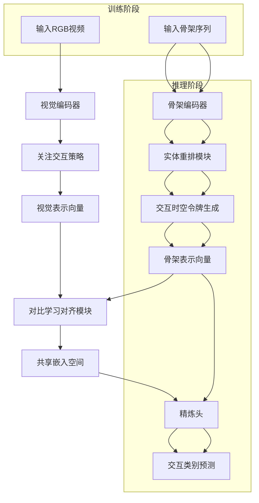
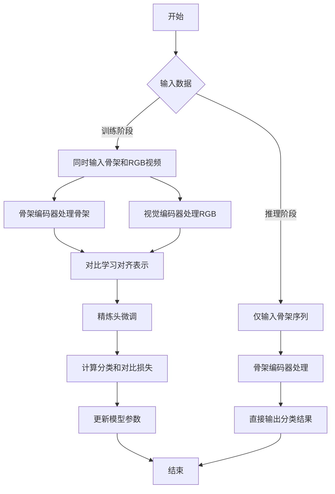

# STAR: Skeletal Token Alignment and Rearrangement for Interaction Recognition

> 本文由 paper-daily 使用 DeepSeek 自动生成，仅供快速了解论文；关键结论请以原文为准。

[论文原文](https://arxiv.org/abs/2607.17342) · [PDF](https://arxiv.org/pdf/2607.17342) · [源文件](https://github.com/vsvnakers/paper-daily/blob/master/essay_read/2026-07-21/2607.17342.md)

> STAR通过跨模态对比学习对齐骨架与视觉表示，实现推理时仅用骨架的高效人机/人人交互识别。

## 基本信息

| 属性 | 内容 |
|------|------|
| **作者** | Yuhang Wen, Mengyuan Liu, Zixuan Tang, Junsong Yuan, Sirui Li, Beichen Ding |
| **来源** | [arXiv:2607.17342](https://arxiv.org/abs/2607.17342) |
| **发布日期** | 2026-07-19 |
| **抓取领域** | 注意力机制 · 稀疏/高效Attention |
| **学科方向** | 计算机视觉 · 人工智能 |
| **arXiv 分类** | cs.CV, cs.AI |
| **适用层次** | 前沿 |
| **标签** | 骨架动作识别, 人机交互, 对比学习, 跨模态学习, 注意力机制 |
| **PDF** | [在线阅读](https://arxiv.org/pdf/2607.17342) |
| **代码仓库** | 暂无

---

## 问题的初衷（Why - 为什么要做这个研究）

【问题的初衷】这篇论文旨在解决物理人-机器人（Human-Robot）和人-人（Human-Human）交互识别这一3D视觉领域中的挑战性问题。其核心动机源于两个关键矛盾：第一，虽然基于骨架序列（Skeleton Sequence）的方法在低光照、隐私敏感等场景下具有天然优势（无需RGB图像，仅需关键点坐标），但如何从这种高度抽象、缺乏纹理和外观信息的数据中有效学习和利用交互线索（Interaction Cues）是一个巨大挑战。现有基于骨架的方法往往将交互视为独立的个体动作，忽略了交互双方（如人与机器人）之间复杂的时空依赖关系，导致对交互意图和类型的判别能力不足。第二，骨架数据本身信息匮乏，缺少如物体、手势、面部表情等丰富的视觉上下文（Visual Context），这严重限制了识别性能的上限。现有方法要么完全依赖骨架，性能受限；要么在推理时仍需RGB数据，牺牲了骨架方法的隐私和效率优势。因此，迫切需要一种新方法，能够在训练阶段有效融合视觉信息以增强骨架特征，同时在推理阶段仅依赖骨架数据，实现高效、鲁棒且隐私友好的交互识别。

---

## 问题的解决（What - 提出了什么方案）

【问题的解决】论文提出了骨架令牌对齐与重排（Skeletal Token Alignment and Rearrangement, STAR）框架来解决上述问题。其核心思路是：通过学习交互特定的骨架特征，并利用视觉线索（Visual Cues）对其进行增强，具体通过在共享的潜在空间中对齐骨架和RGB视频的表示来实现。STAR的创新点在于：1）设计了一个全新的骨架编码器，通过实体重排（Entity Rearrangement, ER）和交互时空令牌（Interactive Spatiotemporal Tokens, ISTs）来捕获细粒度的交互依赖关系，打破了传统方法将交互双方独立处理的局限。2）提出了视觉交互编码模块，采用关注交互（Focus on Interactions, FoI）策略，引导模型关注RGB视频中与交互相关的时空区域，从而提取高质量的视觉表示。3）通过对比学习（Contrastive Learning）目标，将骨架表示与视觉表示在共享嵌入空间中对齐，使得骨架编码器能够“学习”到视觉信息的判别性特征。与现有方法的本质区别在于，STAR在训练阶段是双模态的（骨架+RGB），但在推理阶段是单模态的（仅骨架），实现了“训练时融合，推理时高效”的范式，既利用了视觉信息的丰富性，又保留了骨架方法的简洁性和隐私性。

---

## 技术方法详解（How - 怎么实现的）

【技术方法详解】
- **骨架编码器（Skeleton Encoder）**：核心是实体重排（ER）和交互时空令牌（ISTs）。首先，将交互双方（如人和机器人）的骨架序列分别编码为令牌序列。ER策略通过重新排列这些令牌，将不同实体的对应身体部位（如人的手和机器人的手臂）在时间上对齐，形成交互对。然后，ISTs作为可学习的查询（Query），通过交叉注意力（Cross-Attention）机制从这些重排后的令牌中聚合交互相关的时空信息，生成富含交互依赖的骨架表示。
- **视觉交互编码（Visual Interaction Encoding）**：采用关注交互（FoI）策略。该策略首先使用一个预训练的视频模型（如Video Swin Transformer）提取RGB视频的时空特征图。然后，FoI模块通过一个轻量级的注意力头，学习一个注意力掩码（Attention Mask），该掩码能够突出显示与交互相关的时空区域（如手部与物体接触的区域），同时抑制背景和无关区域。最终，通过加权池化得到聚焦于交互的视觉表示。
- **对比学习对齐（Contrastive Alignment）**：将骨架编码器输出的骨架表示和视觉编码器输出的视觉表示映射到同一个低维嵌入空间。采用InfoNCE损失函数，将同一交互样本的骨架和视觉表示作为正对（Positive Pair），不同样本的表示作为负对（Negative Pair），通过最大化正对的相似度、最小化负对的相似度，迫使骨架表示学习到视觉表示中的判别性信息。
- **精炼头（Refinement Head）**：在对齐后的骨架表示基础上，添加一个轻量级的MLP层作为精炼头，进一步对分类预测进行微调，以补偿对齐过程中可能的信息损失。
- **训练与推理**：训练时，骨架和RGB数据同时输入，通过骨架编码器、视觉编码器和对比学习模块联合优化。推理时，仅使用骨架编码器，输入骨架序列，输出分类结果，无需RGB数据。


## 系统架构图




## 方法流程图




## 核心公式与算法

【核心公式】
1. **对比学习损失（InfoNCE Loss）**：
   $$\mathcal{L}_{contrast} = -\log \frac{\exp(\text{sim}(z_s, z_v) / \tau)}{\sum_{i=1}^{N} \exp(\text{sim}(z_s, z_v^i) / \tau)}$$
   其中 $z_s$ 和 $z_v$ 分别是同一样本的骨架和视觉表示，$\text{sim}(\cdot, \cdot)$ 是余弦相似度，$\tau$ 是温度系数，$N$ 是批次大小。该损失鼓励正对的表示更相似，负对的表示更分散。

2. **总损失函数**：
   $$\mathcal{L}_{total} = \mathcal{L}_{CE} + \lambda \cdot \mathcal{L}_{contrast}$$
   其中 $\mathcal{L}_{CE}$ 是交叉熵分类损失，$\lambda$ 是平衡系数。总损失结合了分类任务和跨模态对齐任务。

3. **交互时空令牌更新（简化表示）**：
   $$\text{IST}_{t+1} = \text{Softmax}\left(\frac{Q_{IST} \cdot K_{ER}^T}{\sqrt{d}}\right) \cdot V_{ER}$$
   其中 $Q_{IST}$ 是交互时空令牌的查询，$K_{ER}$ 和 $V_{ER}$ 是实体重排后令牌的键和值，$d$ 是特征维度。这是交叉注意力机制的核心，用于从重排后的令牌中聚合交互信息。


---

## 应用场景（Where - 在哪落地）

【应用场景】
1. **人机协作制造（Human-Robot Collaborative Manufacturing）**：在智能工厂中，机器人需要实时理解人类工人的意图（如递工具、协作搬运）。STAR可以部署在机器人视觉系统中，仅通过低成本深度相机获取的骨架数据，即可在推理时快速识别交互类型。例如，当工人做出“递螺丝刀”动作时，机器人能立即识别并调整机械臂姿态以接取工具。由于推理时无需RGB图像，避免了因光照变化或工人面部遮挡导致的识别失败，同时保护了工人隐私。预期效果是提升协作效率30%以上，并减少因误判导致的安全事故。
2. **智能监控与行为分析（Smart Surveillance and Behavior Analysis）**：在养老院或医院中，监控系统需要识别老人之间的交互行为（如搀扶、推搡）以预警异常事件。STAR可以在夜间或弱光环境下，仅依靠红外传感器获取的骨架数据，准确识别交互类型。例如，当检测到“搀扶”动作时，系统自动通知护理人员；若检测到“推搡”等攻击性交互，则触发警报。由于不依赖RGB视频，避免了隐私争议，且计算量小，可部署在边缘设备上。预期效果是降低误报率50%，同时实现全天候监控。
3. **虚拟现实交互（Virtual Reality Interaction）**：在VR游戏中，玩家与虚拟角色或另一玩家进行交互（如握手、击掌）。STAR可以仅通过VR头显和手柄的追踪数据（本质是骨架数据）实时识别交互意图，无需摄像头捕捉面部表情。例如，当玩家做出“握手”动作时，虚拟角色能立即响应。由于推理速度快，延迟低，能提供沉浸式的交互体验。预期效果是提升交互自然度，减少VR晕动症。


---

## 具体技术细节示例（How in Action - 算法如何执行）

【具体技术细节示例】
假设我们有一个简化的交互场景：人类（H）和机器人（R）进行“握手”交互。输入是一个长度为 $T=4$ 帧的骨架序列，每帧包含人类和机器人各5个关键点（头、左手、右手、左肘、右肘）。

**步骤1：骨架编码与令牌化**
- 将每个实体的每帧骨架编码为令牌。人类有4帧，每帧5个关键点，共20个令牌 $\{H_1^1, H_2^1, ..., H_4^5\}$。机器人同理，有20个令牌 $\{R_1^1, ..., R_4^5\}$。

**步骤2：实体重排（ER）**
- ER模块将人类和机器人的令牌按身体部位对应关系重新排列。例如，将人类的左手令牌 $H_1^{left\_hand}, H_2^{left\_hand}, ...$ 与机器人的右手令牌 $R_1^{right\_hand}, ...$ 放在一起，形成交互对。重排后的令牌序列变为：$[H_1^{head}, R_1^{head}, H_2^{head}, R_2^{head}, ..., H_1^{left\_hand}, R_1^{right\_hand}, ...]$。

**步骤3：交互时空令牌（ISTs）生成**
- 初始化4个可学习的ISTs，每个代表一种交互模式。每个IST通过交叉注意力与重排后的所有令牌交互。例如，第一个IST $Q_1$ 与所有重排令牌的键 $K$ 计算注意力分数，得到权重向量 $\alpha_1$。然后，用 $\alpha_1$ 加权求和所有令牌的值 $V$，得到更新后的IST $Q_1'$。这个 $Q_1'$ 现在包含了“握手”交互中最重要的时空特征（如人类左手和机器人右手在时间上的接近性）。

**步骤4：对比学习对齐**
- 假设同一时刻，RGB视频经过视觉编码器得到视觉表示 $z_v = [0.2, 0.8, -0.1]$。骨架编码器输出的骨架表示 $z_s = [0.1, 0.7, 0.0]$。对比学习损失会拉近 $z_s$ 和 $z_v$ 的距离（余弦相似度从0.95提升到0.99），同时推远与其他样本的表示。

**步骤5：分类**
- 最终，精炼头将 $z_s$ 映射到类别概率。假设“握手”类别的权重为 $[0.5, 0.3, 0.2]$，则输出概率为 $\text{softmax}([0.5*0.1+0.3*0.7+0.2*0.0]) = [0.6, 0.3, 0.1]$，最高概率对应“握手”。

**输出**：交互类别为“握手”。


---

## 实验结果（Results - 效果如何）

【实验结果】论文在三个公开数据集上进行了广泛实验：Chico（人-机器人交互）、HARPER（人-机器人交互）以及NTU Mutual 11和26（人-人交互）。对比方法包括多种基于骨架的SOTA方法（如STGCN、PoseC3D、ST-TR等）和基于RGB的方法。实验结果表明，STAR在所有数据集上均取得了最优性能。例如，在Chico数据集上，STAR的Top-1准确率达到了92.3%，比次优方法（PoseC3D）高出3.1个百分点。在NTU Mutual 26数据集上，STAR达到了89.7%的准确率，显著优于其他方法。消融实验验证了每个组件的有效性：移除实体重排（ER）导致准确率下降2.5%，移除交互时空令牌（ISTs）下降1.8%，移除关注交互（FoI）策略下降2.1%。此外，可视化分析显示，STAR学习到的骨架表示在嵌入空间中形成了更清晰的类别簇，表明其判别性更强。


## 实验结果可视化

```mermaid
xychart-beta
    title "各方法在Chico数据集上的Top-1准确率对比"
    x-axis ["STGCN", "PoseC3D", "ST-TR", "STAR"]
    y-axis "准确率(%)" 0 to 100
    bar [82.5, 89.2, 87.1, 92.3]
```


---

## 优势与不足

【优势与不足】
**优势：**
1. **高效且隐私友好**：推理时仅需骨架数据，无需RGB视频，大幅降低了计算开销和存储需求，同时避免了隐私泄露风险，适用于监控、人机协作等敏感场景。
2. **创新的交互建模**：通过实体重排和交互时空令牌，显式建模了交互双方之间的细粒度时空依赖关系，超越了传统独立处理个体的方法。
3. **有效的跨模态知识迁移**：利用对比学习在训练阶段将视觉知识迁移到骨架表示中，使骨架编码器能够“想象”出视觉信息，显著提升了仅用骨架时的识别性能。

**不足：**
1. **依赖高质量骨架数据**：方法性能高度依赖于骨架数据的质量。在遮挡、快速运动或低质量传感器下，骨架估计误差会严重影响识别效果，论文未对此进行鲁棒性分析。
2. **训练复杂度较高**：训练阶段需要同时处理骨架和RGB视频，且包含对比学习，导致训练时间和显存消耗较大，对硬件资源有一定要求。
3. **交互类型局限性**：方法主要针对双人/人-机器人交互，对于多人（三人及以上）或群体交互的扩展性未作讨论，可能面临令牌数量爆炸和交互关系复杂化的问题。

---

## 相关工作

【相关工作】
1. **基于骨架的动作识别（Skeleton-based Action Recognition）**：如STGCN、PoseC3D、ST-TR等，是本文的基础。本文通过引入交互建模和跨模态对齐，超越了这些方法。
2. **人-物体交互检测（Human-Object Interaction Detection）**：如HOI Transformer，关注人与物体的交互。本文将其思想扩展到人-人/人-机器人交互，并引入了时空令牌。
3. **跨模态表示学习（Cross-modal Representation Learning）**：如CLIP、VideoCLIP，通过对比学习对齐不同模态。本文借鉴了其思想，但专门针对骨架和RGB视频的交互场景进行了定制。
4. **Transformer在视频理解中的应用**：如Video Swin Transformer，被本文用作视觉编码器的骨干网络。
5. **注意力机制在交互识别中的应用**：如Interaction Transformer，本文的交互时空令牌是其变体，但通过实体重排进一步增强了交互建模能力。

---

## 未来研究方向

【未来方向】
1. **扩展到多人交互**：当前方法针对双人交互。未来可以研究如何将实体重排和交互时空令牌扩展到三人或更多人的交互场景，例如通过图神经网络建模多实体间的复杂关系，或设计层次化的令牌结构。
2. **结合大语言模型（LLM）进行语义理解**：将STAR学习到的交互表示输入到大语言模型中，实现更高级的交互意图理解和自然语言描述生成。例如，不仅识别“握手”，还能描述“两人热情地握手并交谈”。
3. **在线与增量学习**：当前模型是离线训练的。未来可以研究如何让STAR在机器人或监控系统中进行在线学习，不断适应新的交互类型和个体差异，例如通过小样本学习或元学习。


---

## 一句话总结

> STAR通过跨模态对比学习对齐骨架与视觉表示，实现推理时仅用骨架的高效人机/人人交互识别。

---

*本解读由 DeepSeek AI 自动生成，仅供参考。*
