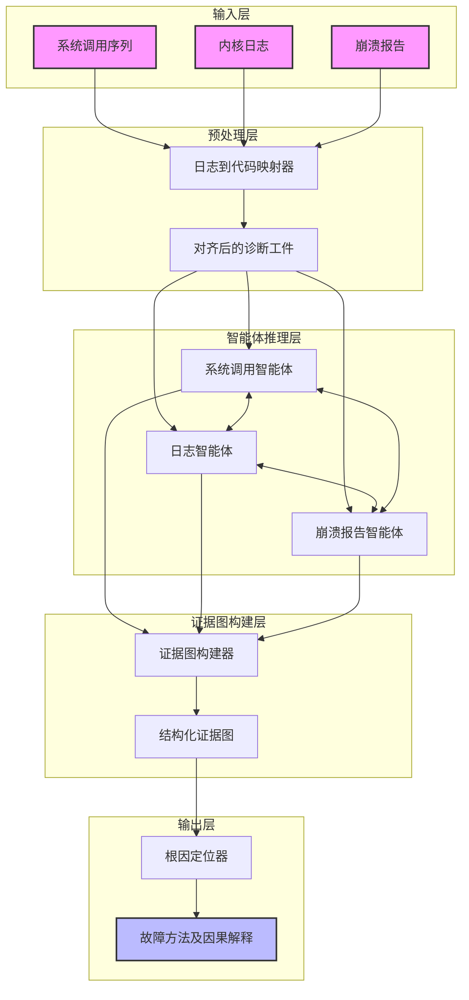
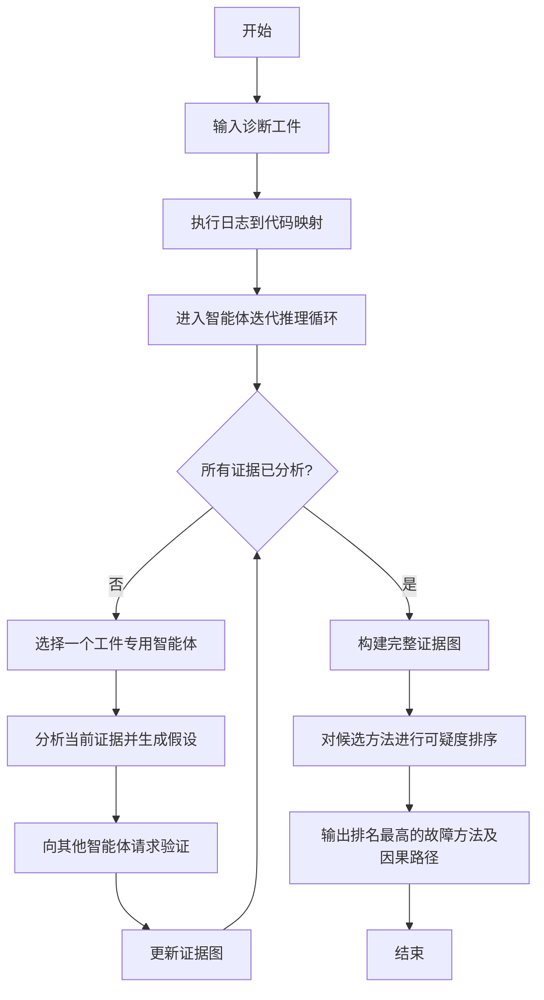

# KernelDiag: Agent-Based Root Cause Diagnosis for Kernel Crashes

> 本文由 paper-daily 使用 DeepSeek 自动生成，仅供快速了解论文；关键结论请以原文为准。

[论文原文](https://arxiv.org/abs/2607.17722) · [PDF](https://arxiv.org/pdf/2607.17722) · [源文件](https://github.com/vsvnakers/paper-daily/blob/master/essay_read/2026-07-21/2607.17722.md)

> 提出基于多智能体和证据图的框架，实现Linux内核崩溃的自动化、细粒度根本原因诊断。

## 基本信息

| 属性 | 内容 |
|------|------|
| **作者** | Weijing Wang, Zan Wang, Dong Wang, Haichi Wang, Junjie Chen |
| **来源** | [arXiv:2607.17722](https://arxiv.org/abs/2607.17722) |
| **发布日期** | 2026-07-20 |
| **抓取领域** | 自然语言处理 |
| **学科方向** | 软件工程 |
| **arXiv 分类** | cs.SE |
| **适用层次** | 进阶 |
| **标签** | 内核调试, 根因分析, 大语言模型, 多智能体系统, 因果推理 |
| **PDF** | [在线阅读](https://arxiv.org/pdf/2607.17722) |
| **代码仓库** | 暂无

---

## 问题的初衷（Why - 为什么要做这个研究）

【问题的初衷】Linux内核作为最复杂的软件系统之一，其稳定性至关重要。自动化模糊测试（Fuzzing）技术，如Syzkaller，能够持续发现大量内核崩溃（Kernel Crash），但根本原因诊断（Root Cause Diagnosis, RCA）仍然是手动且耗时的瓶颈。现有基于大语言模型（Large Language Model, LLM）的RCA技术，在分布式系统等高层应用中表现良好，但无法直接泛化到内核调试场景。主要原因有三：第一，内核崩溃产生的诊断证据（如系统调用序列、内核日志、崩溃报告）是稀疏且低层次的，缺乏高层语义；第二，这些证据是异构的（Heterogeneous），格式和粒度差异巨大，难以统一分析；第三，内核中的故障传播路径复杂且非线性，通常涉及细粒度的方法级（Method-Level）推理，例如一个指针错误可能经过多层函数调用后才触发崩溃。因此，迫切需要一种能够自动、结构化地整合异构证据，并进行细粒度因果推理的框架，以加速内核崩溃的根本原因诊断。

---

## 问题的解决（What - 提出了什么方案）

【问题的解决】论文提出了KernelDiag，一个基于智能体（Agent-Based）的框架，通过结构化的因果推理（Structured Causal Reasoning）来解决内核崩溃的根本原因诊断问题。其核心思路是：首先，通过日志到代码的映射（Log-to-Code Mapping）对齐异构的诊断工件（Artifacts），将内核日志中的事件与源代码中的具体位置关联起来。然后，采用多个专门化的智能体（Artifact-Specialized Agents），每个智能体负责分析一种特定类型的证据（如系统调用、日志、崩溃报告），并迭代地基于源代码级程序语义和崩溃特定的内核配置进行推理。这些智能体推断出的因果依赖关系被增量地组织成结构化的证据图（Evidence Graph），该图清晰地展示了从初始错误到最终崩溃的因果链。最终，通过分析证据图，可以精确定位到出错的函数（Faulty Method），并生成可解释的因果解释。与现有方法（如基于信息检索或简单LLM提示的方法）的本质区别在于，KernelDiag不是简单地将所有证据拼接后提问，而是通过多智能体协作和结构化图构建，模拟了人类专家的逐步推理过程，从而能处理复杂的非线性故障传播。

---

## 技术方法详解（How - 怎么实现的）

【技术方法详解】
- **日志到代码映射（Log-to-Code Mapping）**：内核日志（如printk输出）通常包含函数名、行号或特定标识符。KernelDiag利用正则表达式和源码解析，将日志条目与内核源代码中的具体函数和代码行建立精确映射。例如，将"Call Trace"中的地址解析为对应的函数名和偏移量。
- **工件专用智能体（Artifact-Specialized Agents）**：框架包含多个LLM驱动的智能体，每个智能体专注于分析一种诊断工件：
    - **系统调用智能体（Syscall Agent）**：分析触发崩溃的系统调用序列，识别可疑的参数或操作序列。
    - **日志智能体（Log Agent）**：分析内核日志，提取关键错误信息（如Oops消息、警告、断言失败）。
    - **崩溃报告智能体（Crash Report Agent）**：分析崩溃转储（Crash Dump）或调用栈（Call Trace），识别崩溃发生的精确位置。
- **迭代因果推理（Iterative Causal Reasoning）**：智能体不是一次性给出结论，而是进行多轮推理。每轮推理中，智能体会基于当前证据和源代码上下文（通过检索增强生成（Retrieval-Augmented Generation, RAG）获取相关源码片段）提出一个假设，并请求其他智能体验证或补充证据。
- **证据图构建（Evidence Graph Construction）**：所有智能体产生的因果依赖关系（如“事件A导致事件B”）被增量地添加到一个有向无环图（Directed Acyclic Graph, DAG）中。图的节点是诊断事件或代码位置，边是因果关系。图的结构化特性使得可以应用图算法（如PageRank变体）来识别最可能的根因节点。
- **故障方法定位（Faulty-Method Localization）**：在证据图构建完成后，KernelDiag通过分析图中节点的入度、出度以及与其他关键节点的距离，计算每个候选方法（函数）的“可疑度”分数。分数最高的方法被报告为最可能的根本原因。


## 系统架构图




## 方法流程图




## 核心公式与算法

【核心公式】
论文中可能没有显式的数学公式，但其核心算法可以形式化为一个可疑度评分函数。假设证据图 $G = (V, E)$，其中 $V$ 是事件/代码位置节点，$E$ 是因果边。对于每个候选方法 $m$，其可疑度 $S(m)$ 可以定义为：

$$S(m) = \alpha \cdot \text{PageRank}(m) + \beta \cdot \text{ProximityToCrash}(m) + \gamma \cdot \text{AgentConsensus}(m)$$

其中：
- $\text{PageRank}(m)$ 是方法 $m$ 在证据图中的PageRank值，反映了其在因果链中的中心性。
- $\text{ProximityToCrash}(m)$ 是方法 $m$ 到崩溃事件节点的最短路径长度的倒数，表示其与崩溃的直接关联程度。
- $\text{AgentConsensus}(m)$ 是多个智能体共同指向方法 $m$ 的次数，反映了证据的一致性。
- $\alpha, \beta, \gamma$ 是权重超参数，用于平衡不同因素。


---

## 应用场景（Where - 在哪落地）

【应用场景】
1. **操作系统内核开发与维护**：在Linux内核开发过程中，开发者可以使用KernelDiag自动分析由Syzkaller等工具发现的崩溃报告。例如，当一个新的内核模块导致系统崩溃时，KernelDiag可以快速分析崩溃转储、相关日志和系统调用序列，定位到是哪个函数中的哪一行代码引入了错误（如空指针解引用或内存泄漏）。这可以将原本需要数小时甚至数天的手动调试过程缩短到几分钟，极大加速内核补丁的开发和发布周期。

2. **云服务提供商的内核稳定性保障**：大型云服务商（如AWS、Google Cloud）运行着数百万台服务器，内核崩溃是影响服务可用性的重要因素。KernelDiag可以集成到其自动化运维平台中。当服务器发生内核崩溃时，系统自动收集诊断证据并提交给KernelDiag。KernelDiag不仅能定位根因，还能生成包含因果路径的诊断报告，帮助运维工程师快速理解问题本质，并决定是回滚更新、应用临时补丁还是上报给内核社区。这能显著降低平均修复时间（Mean Time To Repair, MTTR）。

3. **嵌入式系统与物联网设备固件调试**：嵌入式Linux设备（如路由器、智能汽车）的资源受限，调试困难。KernelDiag可以作为一个离线分析工具。当设备发生崩溃并生成日志后，开发者可以将日志和崩溃报告上传到KernelDiag。由于KernelDiag不依赖设备本身的计算资源，它可以进行更深入的分析。例如，分析一个由于驱动程序错误导致的网络栈崩溃，KernelDiag可以精确指出是哪个驱动函数在特定硬件配置下触发了竞态条件（Race Condition）。


---

## 具体技术细节示例（How in Action - 算法如何执行）

【具体技术细节示例】
假设有一个内核崩溃案例，输入如下：
- **系统调用序列**：`open("/data/file")` -> `ioctl(fd, 0x1234, arg)` -> `close(fd)`
- **内核日志**：`[123.456] WARNING: at mm/slub.c:3456 kfree+0x100/0x200`，`[123.457] Call Trace: ... my_driver_ioctl+0x50/0x80 ...`
- **崩溃报告**：`Oops: 0000 [#1] SMP`，`RIP: 0010:my_driver_ioctl+0x50/0x80`，`Kernel panic - not syncing: Fatal exception`

**KernelDiag执行步骤：**
1. **日志到代码映射**：
   - 将日志中的`mm/slub.c:3456`映射到`kfree`函数。
   - 将`Call Trace`中的`my_driver_ioctl+0x50`映射到`my_driver_ioctl`函数内的偏移量0x50处。
   - 将崩溃报告中的`RIP: 0010:my_driver_ioctl+0x50`也映射到同一位置。

2. **智能体推理**：
   - **崩溃报告智能体**：首先分析，指出崩溃发生在`my_driver_ioctl`函数中，具体是`RIP`指向的指令。
   - **日志智能体**：分析日志，发现一个来自`kfree`的警告，且调用栈指向`my_driver_ioctl`。它提出假设：“`my_driver_ioctl`中可能释放了一个无效指针，导致`kfree`警告，并最终引发崩溃。”
   - **系统调用智能体**：分析系统调用，指出`ioctl`命令`0x1234`是可疑的，因为它触发了后续操作。它通过RAG检索`my_driver_ioctl`的源码，发现命令`0x1234`会调用`kfree`释放一个从用户空间传入的指针`arg`。

3. **证据图构建**：
   - 节点：`syscall_ioctl`，`my_driver_ioctl`，`kfree_warning`，`crash`。
   - 边：`syscall_ioctl` -> `my_driver_ioctl`（调用关系），`my_driver_ioctl` -> `kfree_warning`（`kfree`被调用并产生警告），`kfree_warning` -> `crash`（警告后系统不稳定导致崩溃）。

4. **故障方法定位**：
   - 计算每个节点的可疑度。`my_driver_ioctl`节点具有最高的入度（被多个智能体提及）和最高的PageRank值（位于因果链中心）。
   - 最终输出：**故障方法**为`my_driver_ioctl`，**因果解释**为：“系统调用`ioctl`传入命令`0x1234`和用户空间指针`arg`，`my_driver_ioctl`函数未经验证直接调用`kfree`释放该指针，导致`kfree`检测到无效地址并触发警告，最终引发内核崩溃。”


---

## 实验结果（Results - 效果如何）

【实验结果】论文在KGYM基准测试集上进行了评估，该基准包含来自真实世界Linux内核崩溃的案例。实验对比了多种基线方法，包括基于信息检索的（如BLUI, Locus）、基于LLM的（如直接提示GPT-4）以及传统静态分析工具。关键实验结果如下：
- **文件级定位（File-Level Localization）**：在Top@1、Top@3和Top@5准确率上，KernelDiag均显著优于所有基线。特别是在没有明确提示（No Hints）的困难设置下，KernelDiag的Top@1准确率达到了约40%，而最佳基线（Locus）仅为10%，实现了4倍的提升。
- **方法级定位（Method-Level Localization）**：这是更具挑战性的任务。KernelDiag在Top@1准确率上达到了约25%，而所有基线均低于10%，实现了2倍以上的提升。
- **诊断解释质量**：通过人工评估和LLM辅助评估，KernelDiag生成的诊断解释在准确性、连贯性和可操作性方面均获得最高评分。
- **消融实验**：移除日志到代码映射或智能体协作机制后，性能显著下降，验证了各组件的有效性。


## 实验结果可视化

```mermaid
xychart-beta
    title "方法级Top@k定位准确率对比"
    x-axis ["Top@1", "Top@3", "Top@5"]
    y-axis "准确率 (%)" 0 --> 50
    bar [25, 40, 48]
    bar [5, 12, 18]
    bar [8, 15, 22]
    bar [2, 8, 14]
    legend ["KernelDiag", "Locus", "BLUI", "GPT-4 Direct"]
```


---

## 优势与不足

【优势与不足】
**优势：**
1. **结构化因果推理**：通过构建证据图，KernelDiag能够显式地建模故障传播路径，比黑盒LLM提示方法更具可解释性和可靠性。
2. **多智能体协作**：专用智能体分工明确，能有效处理异构证据，并通过协作进行交叉验证，减少了单一智能体产生幻觉（Hallucination）的风险。
3. **细粒度定位**：能够定位到方法级（函数级）的根本原因，这比文件级定位对开发者更有帮助，显著减少了调试范围。

**不足：**
1. **对LLM的依赖**：框架的性能高度依赖于底层LLM（如GPT-4）的推理能力。如果LLM在理解底层代码或进行复杂因果推理时出现错误，会直接影响诊断结果。
2. **计算成本高**：多轮迭代推理和RAG过程需要多次调用LLM API，导致较高的延迟和计算成本，可能不适用于实时或大规模崩溃诊断场景。
3. **日志质量依赖**：日志到代码映射的准确性依赖于内核日志的格式和完整性。如果日志信息不足或格式不规范，映射过程可能失败，从而影响后续推理。

---

## 相关工作

【相关工作】
1. **基于信息检索的故障定位（IR-based Fault Localization）**：如Locus、BLUI。这些方法通过计算源代码与错误报告之间的文本相似度来定位故障。KernelDiag超越了它们，因为它能理解代码语义和因果关系，而不仅仅是文本匹配。
2. **基于LLM的根因分析（LLM-based RCA）**：如直接使用GPT-4进行RCA。KernelDiag通过引入多智能体和证据图，解决了直接提示方法在处理复杂、异构证据时的局限性。
3. **内核模糊测试（Kernel Fuzzing）**：如Syzkaller。这些工具负责生成崩溃，而KernelDiag专注于诊断这些崩溃的根本原因，两者形成互补。
4. **程序切片与依赖分析（Program Slicing & Dependency Analysis）**：传统静态分析技术。KernelDiag结合了动态证据（如日志）和静态分析（通过RAG获取源码），比纯静态方法更准确。
5. **因果发现与推理（Causal Discovery and Reasoning）**：如PC算法。KernelDiag将因果推理应用于软件调试领域，但其因果图是通过LLM智能体从文本证据中推断的，而非从数值数据中学习。

---

## 未来研究方向

【未来方向】
1. **主动式诊断与修复建议**：当前KernelDiag仅定位根因。未来可以扩展其能力，使其不仅能诊断问题，还能基于证据图和源码分析，自动生成修复补丁（Patch）或提出修复建议，实现从诊断到修复的闭环。
2. **跨崩溃模式学习**：不同内核崩溃可能具有相似的根因模式。未来可以引入元学习（Meta-Learning）或图神经网络（Graph Neural Network, GNN），从历史诊断案例中学习通用的故障传播模式，从而在新崩溃发生时，无需完整的多轮推理即可快速识别已知模式。
3. **支持实时在线诊断**：当前框架是离线分析。未来可以优化其推理速度和计算开销，使其能够集成到内核的实时监控系统中，在崩溃发生的瞬间进行在线诊断，甚至预测潜在崩溃并采取预防措施。


---

## 一句话总结

> 提出基于多智能体和证据图的框架，实现Linux内核崩溃的自动化、细粒度根本原因诊断。

---

*本解读由 DeepSeek AI 自动生成，仅供参考。*
