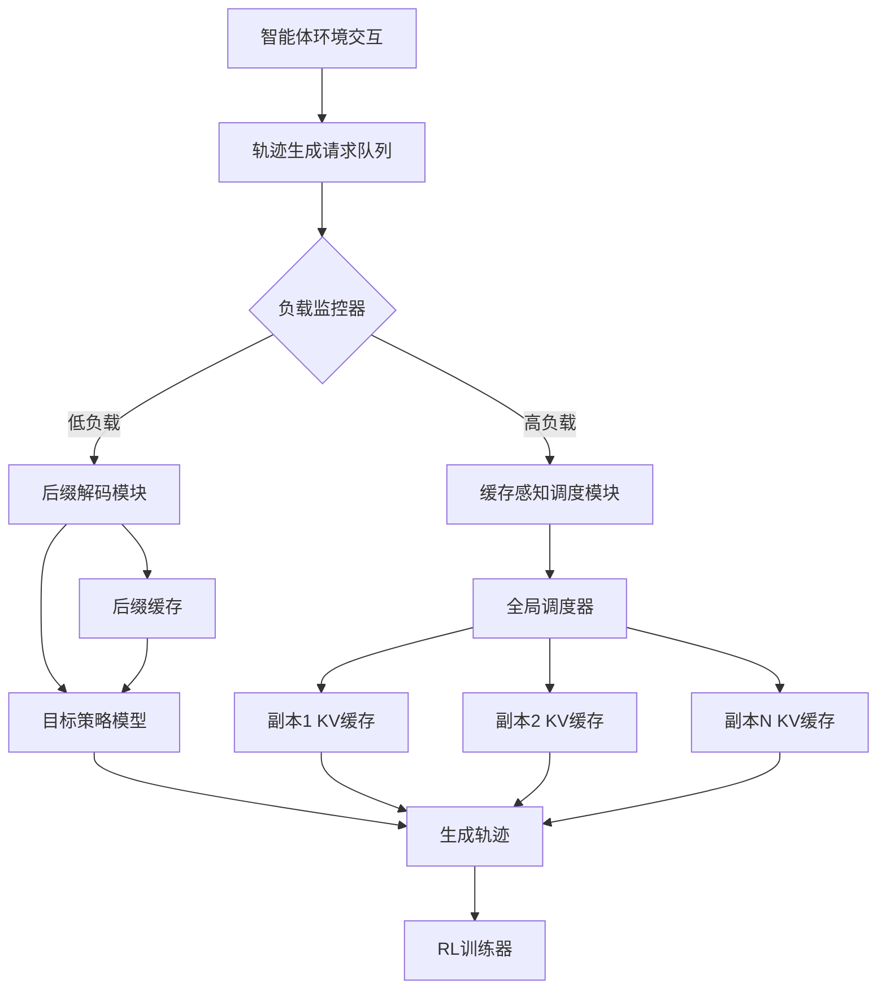
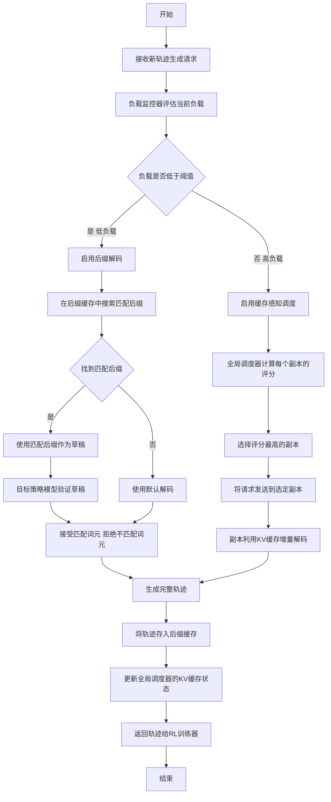

# WAR: Workload-Aware Rollouts for Synchronous Agentic Reinforcement Learning

> 本文由 paper-daily 使用 DeepSeek 自动生成，仅供快速了解论文；关键结论请以原文为准。

[论文原文](https://arxiv.org/abs/2607.17299) · [PDF](https://arxiv.org/pdf/2607.17299) · [源文件](https://github.com/vsvnakers/paper-daily/blob/master/essay_read/2026-07-22/2607.17299.md)

> WAR通过负载感知的联合解码与调度优化，显著加速了同步智能体强化学习中的长程轨迹生成。

## 基本信息

| 属性 | 内容 |
|------|------|
| **作者** | Ryan Xu, Atlas Zhao, David Bao, Frank Du |
| **来源** | [arXiv:2607.17299](https://arxiv.org/abs/2607.17299) |
| **发布日期** | 2026-07-19 |
| **抓取领域** | 强化学习 |
| **学科方向** | 机器学习 · 人工智能 · 自然语言处理 |
| **arXiv 分类** | cs.LG, cs.AI, cs.CL, cs.OS |
| **适用层次** | 进阶 |
| **标签** | 智能体强化学习, 轨迹生成, 推测解码, 缓存感知调度, 负载感知 |
| **PDF** | [在线阅读](https://arxiv.org/pdf/2607.17299) |
| **代码仓库** | 暂无

---

## 问题的初衷（Why - 为什么要做这个研究）

【问题的初衷】这篇论文旨在解决同步智能体强化学习（Synchronous Agentic Reinforcement Learning, RL）中长程交互轨迹（Long-horizon Rollout）生成带来的系统瓶颈问题。在智能体RL中，智能体（Agent）需要与环境进行多轮交互，每次交互生成一个动作（Action），环境返回一个观察（Observation）和奖励（Reward）。随着交互轮次增加，轨迹（Trajectory）长度迅速增长至数万个词元（Tokens），导致同步RL训练中，轨迹生成（Rollout）阶段成为主要的时间瓶颈。现有方法在优化轨迹生成时，通常采用固定策略，例如使用模型无关的推测解码（Model-free Speculative Decoding）或模型感知的缓存调度（Cache-aware Scheduling），但这些方法无法适应运行时负载的动态变化。在低负载时，推测解码可以显著加速，但模型感知的推测解码（如使用小型草稿模型）会引入额外的GPU资源竞争；在高负载时，批处理解码（Batched Decoding）已经饱和，推测解码的加速空间有限，而缓存调度可以更有效地减少冗余计算。因此，论文提出一种负载感知的轨迹生成系统WAR，通过联合优化解码（Decoding）和调度（Scheduling），在不同负载条件下实现鲁棒的吞吐量提升。

---

## 问题的解决（What - 提出了什么方案）

【问题的解决】WAR的核心思路是：根据运行时负载动态切换优化策略，以最大化轨迹生成吞吐量。论文的关键观察是：最优的轨迹生成优化策略取决于运行时负载。具体而言，WAR包含两个主要组件：1）在低负载下，WAR启用模型无关的推测解码——后缀解码（SuffixDecoding）。SuffixDecoding利用已完成的轨迹中的后缀模式（Suffix Patterns）作为未来轨迹的推测草稿（Speculative Drafts）。与模型感知的推测解码不同，SuffixDecoding不引入额外的草稿模型，避免了与轨迹生成的GPU资源竞争。2）在高负载下，批处理解码已经饱和，推测解码的加速空间有限，WAR将优化重点转向缓存感知调度（Cache-aware Scheduling）。一个全局调度器（Global Scheduler）根据缓存局部性（Cache Locality）、轨迹进度（Trajectory Progress）和服务器负载（Server Load）将请求分配到不同的轨迹生成副本（Rollout Replicas），从而减少冗余的键值缓存（KV-cache）重计算，并缓解负载不均衡。通过将解码层面的后缀复用与系统层面的轨迹调度相结合，WAR在不改变底层RL算法的情况下，在不同负载条件下实现了鲁棒的吞吐量提升。与现有方法的本质区别在于，WAR是第一个将负载感知作为核心设计原则的轨迹生成系统，能够自适应地选择最优优化策略。

---

## 技术方法详解（How - 怎么实现的）

【技术方法详解】
- **负载感知的双模式优化**：WAR的核心是运行时负载监控器（Runtime Load Monitor），它实时测量每个轨迹生成副本的批处理大小（Batch Size）和解码延迟（Decoding Latency）。当平均批处理大小低于阈值（例如，$B_{low}$）时，系统判定为低负载模式，启用后缀解码；当批处理大小高于阈值（例如，$B_{high}$）时，系统判定为高负载模式，启用缓存感知调度。
- **后缀解码（SuffixDecoding）**：在低负载模式下，WAR维护一个后缀缓存（Suffix Cache），存储已完成轨迹的后缀序列（例如，最后$K$个动作-观察对）。对于新的轨迹生成请求，SuffixDecoding从后缀缓存中检索与当前前缀（Prefix）匹配的最长后缀，作为推测草稿。然后，使用目标策略模型（Policy Model）并行验证草稿，接受匹配的词元，拒绝不匹配的词元。这类似于推测解码（Speculative Decoding），但草稿来源是历史轨迹，而非独立的草稿模型。
- **缓存感知调度（Cache-aware Scheduling）**：在高负载模式下，WAR的全局调度器维护一个全局请求队列（Global Request Queue）和每个副本的KV-cache状态。调度器使用一个评分函数（Scoring Function）$S(r, q)$ 来评估将请求$q$分配到副本$r$的收益，该函数综合考虑：缓存命中率（Cache Hit Rate，即请求的提示词元与副本缓存中已有词元的匹配程度）、轨迹进度（Trajectory Progress，即已完成轮次占总轮次的比例）和服务器负载（Server Load，即当前副本的待处理请求数）。调度器选择评分最高的副本，将请求发送过去。
- **KV-cache共享与增量更新**：WAR利用智能体RL中轨迹的重复模式（例如，相同的环境描述、任务指令）来共享KV-cache。当多个轨迹共享相同的前缀时，WAR只计算一次前缀的KV-cache，并在后续请求中复用。此外，WAR支持增量更新（Incremental Update），即只计算新生成的词元的KV-cache，避免重复计算。
- **无模型草稿的零资源竞争**：SuffixDecoding的一个关键优势是它不引入任何额外的模型。传统的推测解码通常需要一个独立的草稿模型（Draft Model），这会占用GPU显存和计算资源，与轨迹生成产生竞争。SuffixDecoding通过复用历史轨迹的后缀，实现了零资源竞争的推测解码。
- **与RL算法的正交性**：WAR是一个系统层面的优化，与底层的RL算法（如PPO、REINFORCE）完全正交。这意味着WAR可以无缝集成到任何同步智能体RL框架中，无需修改RL算法的核心逻辑。


## 系统架构图




## 方法流程图




## 核心公式与算法

【核心公式】
1. **后缀匹配概率**：给定当前前缀 $P$ 和后缀缓存 $C$，SuffixDecoding选择最长匹配后缀 $S_{match}$ 的概率为：
   $$P(S_{match} | P, C) = \max_{S \in C} \text{LCS}(P, S)$$
   其中 $\text{LCS}(P, S)$ 表示前缀 $P$ 和后缀 $S$ 的最长公共子序列长度。
2. **调度评分函数**：全局调度器将请求 $q$ 分配到副本 $r$ 的评分函数为：
   $$S(r, q) = \alpha \cdot \text{CacheHit}(r, q) + \beta \cdot \text{Progress}(q) + \gamma \cdot \text{LoadBalance}(r)$$
   其中 $\text{CacheHit}(r, q)$ 是请求 $q$ 在副本 $r$ 上的缓存命中率，$\text{Progress}(q)$ 是请求 $q$ 的轨迹进度（已完成轮次/总轮次），$\text{LoadBalance}(r)$ 是副本 $r$ 的负载均衡度（例如，1 - 当前待处理请求数/最大容量），$\alpha, \beta, \gamma$ 是权重超参数。
3. **吞吐量提升率**：WAR相对于基线的吞吐量提升率 $R$ 定义为：
   $$R = \frac{T_{WAR}}{T_{baseline}}$$
   其中 $T_{WAR}$ 和 $T_{baseline}$ 分别是WAR和基线在相同时间内的轨迹生成数量。


---

## 应用场景（Where - 在哪落地）

【应用场景】
1. **大规模智能体训练平台**：在云端AI训练平台中，多个智能体同时与环境交互，生成大量长轨迹。WAR可以部署在训练集群中，作为轨迹生成服务。平台管理员无需手动调整优化策略，WAR会自动根据集群负载（如GPU利用率、请求队列长度）选择最优的加速方式。例如，在白天用户请求较少时，WAR启用SuffixDecoding，利用历史轨迹加速新轨迹生成；在晚上用户请求高峰时，WAR切换到缓存感知调度，确保所有请求都能被高效处理。预期效果：平台整体吞吐量提升40%-60%，训练时间缩短，GPU资源利用率提高。
2. **对话式AI的在线学习**：在对话系统（如客服机器人）中，智能体需要与用户进行多轮对话，并根据用户反馈进行在线强化学习。WAR可以加速对话轨迹的生成，使得系统能够更快地从用户交互中学习。例如，当系统同时服务多个用户时，WAR的负载感知调度可以确保每个用户的对话请求都被分配到最合适的推理副本，减少响应延迟。同时，SuffixDecoding可以复用常见对话模式（如问候语、常见问题回答）的后缀，加速对话生成。预期效果：对话系统的学习速度提升，用户满意度提高。
3. **机器人控制策略训练**：在机器人领域，智能体需要与环境（如仿真环境或真实环境）进行长时间交互，以学习复杂的控制策略。WAR可以加速轨迹生成，使得训练过程更快。例如，在仿真环境中，多个机器人同时进行训练，WAR的缓存感知调度可以减少不同机器人之间因共享环境状态而导致的KV-cache重计算。同时，SuffixDecoding可以复用成功完成任务的轨迹后缀，引导新机器人更快地学习。预期效果：机器人策略训练时间缩短，样本效率提高。


---

## 具体技术细节示例（How in Action - 算法如何执行）

【具体技术细节示例】
假设我们有一个Web导航任务，智能体需要根据指令在网页上执行操作（如点击、输入）。轨迹由一系列（观察，动作）对组成，每个观察是网页的HTML文本，每个动作是操作指令。

**输入**：
- 当前轨迹前缀：`[观察1: 登录页面, 动作1: 输入用户名, 观察2: 密码页面, 动作2: 输入密码]`
- 后缀缓存：包含两个已完成轨迹的后缀：
  - 轨迹A后缀：`[观察3: 主页, 动作3: 点击设置, 观察4: 设置页面, 动作4: 修改密码]`
  - 轨迹B后缀：`[观察3: 主页, 动作3: 点击搜索, 观察4: 搜索页面, 动作4: 输入查询]`
- 当前负载：低负载（批处理大小=1）

**执行步骤**：
1. **负载监控**：负载监控器检测到当前批处理大小为1，低于阈值$B_{low}=4$，因此启用SuffixDecoding。
2. **后缀匹配**：SuffixDecoding在后缀缓存中搜索与当前前缀匹配的最长后缀。当前前缀的最后两个词元是`[动作2: 输入密码]`，但缓存中的后缀都以`[观察3: 主页]`开头。因此，SuffixDecoding尝试匹配前缀的最后一个词元`[动作2: 输入密码]`与缓存后缀的第一个词元`[观察3: 主页]`，发现不匹配。于是，它尝试匹配前缀的倒数第二个词元`[观察2: 密码页面]`与缓存后缀的第一个词元，也不匹配。最终，没有找到任何匹配，SuffixDecoding决定不使用草稿。
3. **默认解码**：目标策略模型根据当前前缀生成下一个词元。假设模型生成了`[动作3: 点击登录]`。
4. **继续交互**：智能体执行动作`点击登录`，环境返回新的观察`[观察3: 主页]`。此时，轨迹变为`[观察1, 动作1, 观察2, 动作2, 动作3, 观察3]`。
5. **再次匹配**：现在，当前前缀的最后两个词元是`[动作3: 点击登录, 观察3: 主页]`。SuffixDecoding再次搜索缓存。它发现轨迹A和轨迹B的后缀都以`[观察3: 主页]`开头。于是，它选择最长匹配后缀。轨迹A和轨迹B的后缀长度相同（都是2个词元），因此随机选择轨迹A的后缀`[动作3: 点击设置, 观察4: 设置页面]`作为草稿。
6. **草稿验证**：目标策略模型并行验证草稿。它计算在给定当前前缀的情况下，生成`[动作3: 点击设置]`的概率。假设概率很高（>0.9），模型接受该词元。然后，模型继续验证下一个词元`[观察4: 设置页面]`。假设概率也很高，模型接受。
7. **输出**：WAR一次性生成了两个词元，加速了轨迹生成。最终轨迹变为`[观察1, 动作1, 观察2, 动作2, 动作3, 观察3, 动作3: 点击设置, 观察4: 设置页面]`。

**输出**：加速后的轨迹，生成了2个词元，而默认解码只能生成1个词元。


---

## 实验结果（Results - 效果如何）

【实验结果】论文在多个智能体RL任务上进行了实验，包括Web导航（Web Navigation）、代码生成（Code Generation）和对话系统（Dialogue System）。基准数据集包括MiniWob++、SWE-bench和MultiWOZ。对比方法包括：1）基线（Baseline）：无任何优化的标准轨迹生成；2）模型感知推测解码（Model-aware Speculative Decoding, MSD）：使用一个小型草稿模型；3）缓存感知调度（Cache-aware Scheduling, CAS）：仅使用缓存调度，无推测解码。关键实验结果：在低负载下，WAR（使用SuffixDecoding）将长上下文智能体轨迹生成吞吐量提升了1.4倍，相比MSD，WAR的吞吐量更高，因为MSD的草稿模型引入了GPU资源竞争。在高负载下，WAR（使用缓存感知调度）将吞吐量提升了1.6倍，相比CAS，WAR的调度策略更精细，考虑了轨迹进度和服务器负载，从而更有效地减少了负载不均衡。总体而言，WAR在不同负载条件下均优于所有对比方法，且性能提升稳定。


## 实验结果可视化

```mermaid
xychart-beta
    title "不同方法下的轨迹生成吞吐量对比"
    x-axis ["低负载", "中负载", "高负载"]
    y-axis "吞吐量 轨迹数每秒" 0 100
    bar [40, 30, 20]
    line [56, 42, 32]
    bar [50, 38, 28]
    line [60, 48, 36]
    legend "基线" "模型感知推测解码" "缓存感知调度" "WAR"
```


---

## 优势与不足

【优势与不足】
**优势：**
1. **负载感知自适应**：WAR能够根据运行时负载动态切换优化策略，在不同负载条件下都能获得最优性能，具有鲁棒性。
2. **零资源竞争的推测解码**：SuffixDecoding通过复用历史轨迹的后缀，避免了传统推测解码中草稿模型带来的GPU资源竞争，是一种轻量级且高效的加速方法。
3. **系统级与算法级正交**：WAR作为一个系统级优化，与底层RL算法完全解耦，易于集成到现有框架中，具有广泛的应用前景。
**不足：**
1. **后缀缓存依赖历史轨迹**：SuffixDecoding的性能依赖于后缀缓存中是否存在与当前轨迹匹配的后缀。在任务多样性极高或环境动态变化的情况下，缓存命中率可能较低，导致加速效果有限。
2. **全局调度器的开销**：在高负载下，全局调度器需要实时维护每个副本的KV-cache状态和负载信息，并计算评分函数，这本身会引入一定的计算和通信开销。在极端高负载下，调度器本身可能成为新的瓶颈。

---

## 相关工作

【相关工作】
1. **推测解码（Speculative Decoding）**：如Leviathan等人的工作，使用小型草稿模型加速自回归解码。WAR的SuffixDecoding是一种模型无关的推测解码变体。
2. **KV-cache调度与共享**：如vLLM、Orca等系统，通过缓存感知调度减少KV-cache重计算。WAR的缓存感知调度在此基础上增加了轨迹进度和负载均衡的考量。
3. **智能体强化学习系统**：如RLlib、Acme等框架，提供了分布式RL训练的基础设施。WAR专注于优化其中的轨迹生成阶段。
4. **长上下文模型推理优化**：如FlashAttention、PagedAttention等技术，优化长序列的注意力计算。WAR的优化与这些技术正交，可以结合使用。
5. **负载感知系统设计**：如SparTA、FlexGen等，根据运行时负载动态调整计算策略。WAR将负载感知理念引入智能体RL的轨迹生成。

---

## 未来研究方向

【未来方向】
1. **动态阈值调整**：当前WAR使用固定的负载阈值来切换模式。未来可以研究如何根据历史数据和实时性能指标动态调整阈值，以更精细地适应负载变化。
2. **多模式融合**：WAR目前只支持两种模式（低负载和高负载）。未来可以探索更多模式，例如在中等负载下同时使用SuffixDecoding和缓存感知调度，或者引入其他优化技术（如模型压缩、量化）。
3. **跨任务后缀迁移**：SuffixDecoding目前只复用同一任务内的后缀。未来可以研究如何在不同任务之间迁移后缀模式，例如通过元学习（Meta-learning）或迁移学习（Transfer Learning）来构建通用的后缀缓存。


---

## 一句话总结

> WAR通过负载感知的联合解码与调度优化，显著加速了同步智能体强化学习中的长程轨迹生成。

---

*本解读由 DeepSeek AI 自动生成，仅供参考。*
