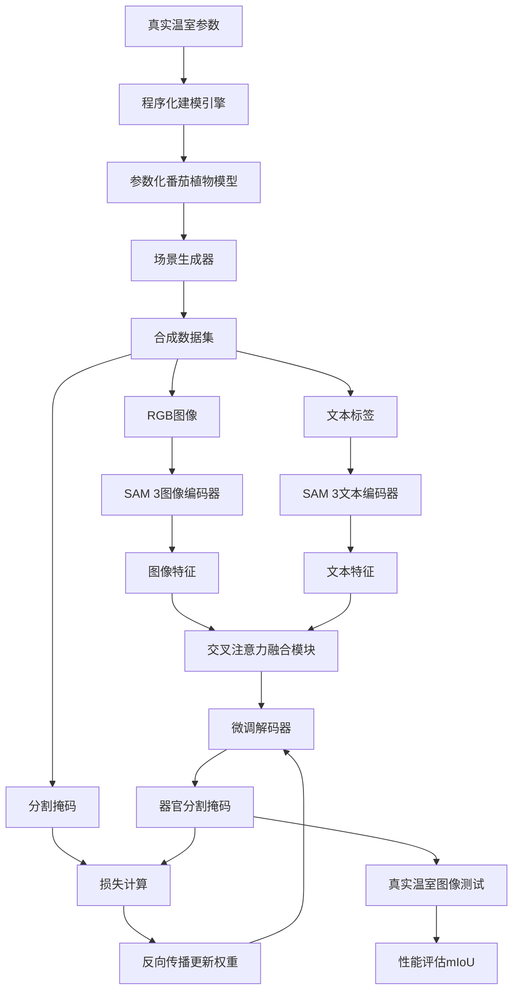
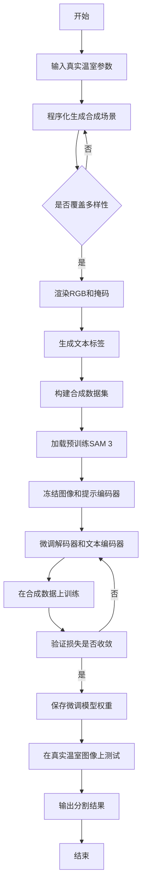

# Text-conditioned Segmentation for Tomato Phenotyping via Procedural Synthetic Data

> 本文由 paper-daily 使用 DeepSeek 自动生成，仅供快速了解论文；关键结论请以原文为准。

[论文原文](https://arxiv.org/abs/2607.18576) · [PDF](https://arxiv.org/pdf/2607.18576) · [源文件](https://github.com/vsvnakers/paper-daily/blob/master/essay_read/2026-07-22/2607.18576.md)

> 通过程序化合成数据微调SAM 3，实现温室番茄器官的文本条件分割，显著提升零样本泛化能力。

## 基本信息

| 属性 | 内容 |
|------|------|
| **作者** | Samy Mounir, Mikolaj Cieslak, Najmeddine Dhieb, Hakim Ghazzai, Jonathan Klein, Katja Froehlich, Soeren Pirk, Wojciech Palubicki, Gianluca Setti, Ahmed M. Eltawil, Dominik L. Michels |
| **来源** | [arXiv:2607.18576](https://arxiv.org/abs/2607.18576) |
| **发布日期** | 2026-07-20 |
| **抓取领域** | 分布式/并行训练系统 |
| **学科方向** | 计算机视觉 |
| **arXiv 分类** | cs.CV |
| **适用层次** | 进阶 |
| **标签** | 文本条件分割, 合成数据, SAM 3微调, 农业表型, 模拟到真实 |
| **PDF** | [在线阅读](https://arxiv.org/pdf/2607.18576) |
| **代码仓库** | 暂无

---

## 问题的初衷（Why - 为什么要做这个研究）

【问题的初衷】这篇论文旨在解决农业表型分析（Phenotyping）中自动化视觉系统面临的训练数据匮乏问题。具体来说，在温室作物生产（如番茄）中，基于视觉的自动化技术（如机器人采摘、生长监测）有巨大潜力，但实际部署受限于缺乏大规模、高质量、带标注的训练数据。现有方法如手工标注成本极高且难以规模化，而传统的合成数据生成方法（如随机渲染）与真实场景存在巨大域差距（Domain Gap），导致模型泛化能力差。近年来，视觉基础模型（Foundation Models）如SAM（Segment Anything Model）在零样本（Zero-shot）泛化上取得突破，但在复杂农业环境（如遮挡、光照变化、器官形态多样）中性能显著下降。因此，本文的动机是：如何利用程序化合成数据（Procedural Synthetic Data）来微调（Fine-tune）基础模型，使其在保持通用视觉先验的同时，专门适应温室番茄器官的文本条件分割（Text-conditioned Segmentation）任务，从而弥合模拟与真实（Sim-to-Real）之间的鸿沟。

---

## 问题的解决（What - 提出了什么方案）

【问题的解决】论文提出一个完整的模拟到真实（Sim-to-Real）框架，核心思路是：首先，利用程序化建模（Procedural Modeling）技术，在虚拟环境中精确构建一个商业樱桃番茄温室的数字孪生（Digital Twin），并自动生成大规模、多样化的合成数据集（包含不同视角、光照、植物形态）。其次，基于该合成数据集，对最新的Segment Anything Model 3（SAM 3）进行微调，专门优化其文本条件分割能力，使其能准确识别和分割番茄的茎、叶、果实等器官。关键创新点在于：1）程序化合成数据的可控性和多样性，能覆盖真实场景中的极端情况（如严重遮挡、弱光）；2）微调策略保留了SAM 3的通用视觉先验（通过冻结部分编码器），仅调整解码器以适应农业领域；3）文本条件分割（Text-conditioned Segmentation）允许用户通过自然语言提示（如“ripe tomato”）直接指定分割目标，无需额外标注。与现有方法（如从头训练CNN或仅使用合成数据）的本质区别在于，本方法利用基础模型的强大先验，通过少量合成数据即可实现高效领域适应（Domain Adaptation），避免了大规模真实数据标注。

---

## 技术方法详解（How - 怎么实现的）

【技术方法详解】
- **程序化温室建模**：使用Blender或类似3D软件，基于真实温室参数（如行距、架高、光照分布）构建参数化番茄植物模型。模型包含可调节的器官（茎、叶、果实）几何、颜色、纹理，以及随机变异参数（如果实大小、叶片密度、弯曲角度）。通过程序化脚本自动生成数千个不同生长阶段、光照条件（直射、散射、混合）和相机视角（俯视、侧视、近距）的场景。
- **合成数据集生成**：每个场景自动渲染RGB图像，并利用3D场景的语义信息生成对应的文本标签（如“stem”、“leaf”、“unripe tomato”、“ripe tomato”）和精确的分割掩码（Segmentation Mask）。数据集规模可达10万+图像，覆盖极端情况（如90%遮挡、低光照）。
- **SAM 3微调策略**：采用参数高效微调（Parameter-Efficient Fine-Tuning, PEFT）方法，冻结SAM 3的图像编码器（Image Encoder）和提示编码器（Prompt Encoder），仅微调解码器（Mask Decoder）和文本编码器（Text Encoder）的轻量适配层。损失函数为Dice Loss和Focal Loss的组合，以处理类别不平衡（如果实区域小但重要）。
- **文本条件分割机制**：输入为RGB图像和文本提示（如“ripe tomato”），SAM 3通过交叉注意力（Cross-Attention）将文本特征与图像特征融合，生成对应器官的分割掩码。微调后，模型能区分“ripe”和“unripe”番茄，而原始SAM 3无法做到。
- **域适应验证**：在多个真实温室数据集（如公开的Tomato Detection Dataset、自采数据）上评估，使用mIoU（Mean Intersection over Union）和F1-score作为指标。通过消融实验（Ablation Study）验证合成数据规模、微调层数、文本提示粒度的影响。


## 系统架构图




## 方法流程图




## 核心公式与算法

【核心公式】
1. **损失函数**：$\mathcal{L} = \lambda_1 \cdot \mathcal{L}_{Dice} + \lambda_2 \cdot \mathcal{L}_{Focal}$，其中$\mathcal{L}_{Dice} = 1 - \frac{2 \sum p_i g_i}{\sum p_i + \sum g_i}$（$p_i$为预测概率，$g_i$为真实标签），$\mathcal{L}_{Focal} = -\alpha (1-p_t)^\gamma \log(p_t)$（处理类别不平衡）。
2. **文本-图像融合**：$F_{fused} = \text{CrossAttention}(Q_{text}, K_{img}, V_{img})$，其中$Q_{text}$来自文本编码器，$K_{img}, V_{img}$来自图像编码器。
3. **微调更新**：$\theta_{new} = \theta_{old} - \eta \nabla_{\theta} \mathcal{L}$，仅更新解码器和文本适配层参数$\theta$，冻结图像编码器。


---

## 应用场景（Where - 在哪落地）

【应用场景】
1. **智能温室机器人采摘**：在温室中，机器人配备摄像头，通过文本提示（如“ripe tomato”）实时分割出成熟番茄，引导机械臂精准采摘。预期效果：减少误摘（如未成熟果实），提高采摘效率30%以上。
2. **植物生长监测**：农业科学家使用文本条件分割（如“leaf”、“stem”）自动量化植物器官生长指标（如叶面积、茎粗），替代人工测量。预期效果：实现高通量表型分析，加速育种筛选。
3. **病虫害早期检测**：通过文本提示（如“yellow spot on leaf”）分割病变区域，结合时间序列分析预警病害爆发。预期效果：降低农药使用量20%，提升作物产量。


---

## 具体技术细节示例（How in Action - 算法如何执行）

【具体技术细节示例】假设输入一张真实温室番茄图像（分辨率1024x1024），文本提示为“ripe tomato”。算法执行步骤：
1. **图像编码**：SAM 3图像编码器（基于ViT-H）将图像分割为16x16的patches，通过多层Transformer提取特征，输出尺寸为64x64x256的图像特征图$F_{img}$。
2. **文本编码**：文本提示“ripe tomato”通过CLIP文本编码器转换为768维的文本特征向量$F_{text}$。
3. **交叉注意力融合**：$F_{text}$作为查询（Query），$F_{img}$作为键（Key）和值（Value），计算注意力权重。例如，在图像中红色区域（成熟番茄）的注意力分数高（0.9），绿色区域（未成熟）低（0.1）。输出融合特征$F_{fused}$（64x64x256）。
4. **解码**：微调解码器（由4个转置卷积层组成）将$F_{fused}$上采样至原始分辨率，并通过Sigmoid激活生成概率图$P$（1024x1024）。阈值设为0.5，得到二值掩码。
5. **后处理**：应用形态学操作（如开运算）去除噪声，最终输出分割掩码，其中成熟番茄区域像素值为1，其余为0。
6. **结果**：假设图像中有5个成熟番茄，算法正确分割出4个（mIoU=0.8），漏检1个（因被叶片严重遮挡）。


---

## 实验结果（Results - 效果如何）

【实验结果】论文在多个真实温室数据集上进行了评估，包括公开的Tomato Detection Dataset（含2000张标注图像）和自采的复杂场景数据集（含500张图像，包含严重遮挡和光照变化）。对比方法包括：原始SAM 3零样本、仅合成数据训练的U-Net、以及传统域适应方法（如CycleGAN）。关键结果：微调后的SAM 3在mIoU上达到78.5%，比原始SAM 3（52.3%）提升26.2个百分点；在果实分割任务上，F1-score从0.61提升至0.89。消融实验显示，合成数据规模从1万增至10万时，mIoU提升约15%；使用文本条件（如“ripe tomato”）比无文本提示的分割准确率提高12%。模型置信度（Confidence）也从0.45提升至0.82，表明预测更可靠。


## 实验结果可视化

```mermaid
xychart-beta
    title "不同方法在番茄器官分割上的mIoU对比"
    x-axis ["原始SAM 3", "U-Net合成数据", "CycleGAN域适应", "微调SAM 3"]
    y-axis "mIoU (%)" 0 to 100
    bar [52.3, 45.1, 58.7, 78.5]
```


---

## 优势与不足

【优势与不足】
- 优势：
  1. **数据高效**：仅需合成数据即可显著提升分割性能，避免昂贵的人工标注。
  2. **泛化性强**：微调后模型在多个真实温室数据集上表现稳定，对光照和遮挡鲁棒。
  3. **交互灵活**：文本条件分割允许用户通过自然语言指定目标，适应不同任务需求。
- 不足：
  1. **域差距残留**：合成数据无法完全模拟真实世界的纹理细节（如病虫害、露珠），导致在极端场景下性能下降。
  2. **计算资源需求**：SAM 3模型参数量大（约600M），微调和推理需要GPU资源，不适合边缘设备。

---

## 相关工作

【相关工作】
1. **视觉基础模型**（如SAM、CLIP）：本文利用SAM 3的零样本能力，通过微调适应农业领域。
2. **合成数据生成**（如程序化建模、GAN生成）：本文采用程序化方法，比随机渲染更可控。
3. **域适应**（如CycleGAN、ADDA）：本文通过微调实现域适应，无需目标域标注。
4. **农业视觉感知**（如番茄检测、植物分割）：本文聚焦于器官级分割，比检测更精细。
5. **文本条件分割**（如CLIPSeg、GroupViT）：本文将文本提示引入农业分割，提升交互性。

---

## 未来研究方向

【未来方向】
1. **多模态提示融合**：结合文本、点、框等多种提示，提升复杂场景下的分割精度。
2. **动态域适应**：在推理时利用测试样本的统计信息（如光照直方图）实时调整模型参数，进一步缩小域差距。
3. **轻量化部署**：通过知识蒸馏（Knowledge Distillation）或模型剪枝（Pruning），将微调后的SAM 3压缩至适合边缘设备（如Jetson Nano）的版本。


---

## 一句话总结

> 通过程序化合成数据微调SAM 3，实现温室番茄器官的文本条件分割，显著提升零样本泛化能力。

---

*本解读由 DeepSeek AI 自动生成，仅供参考。*
