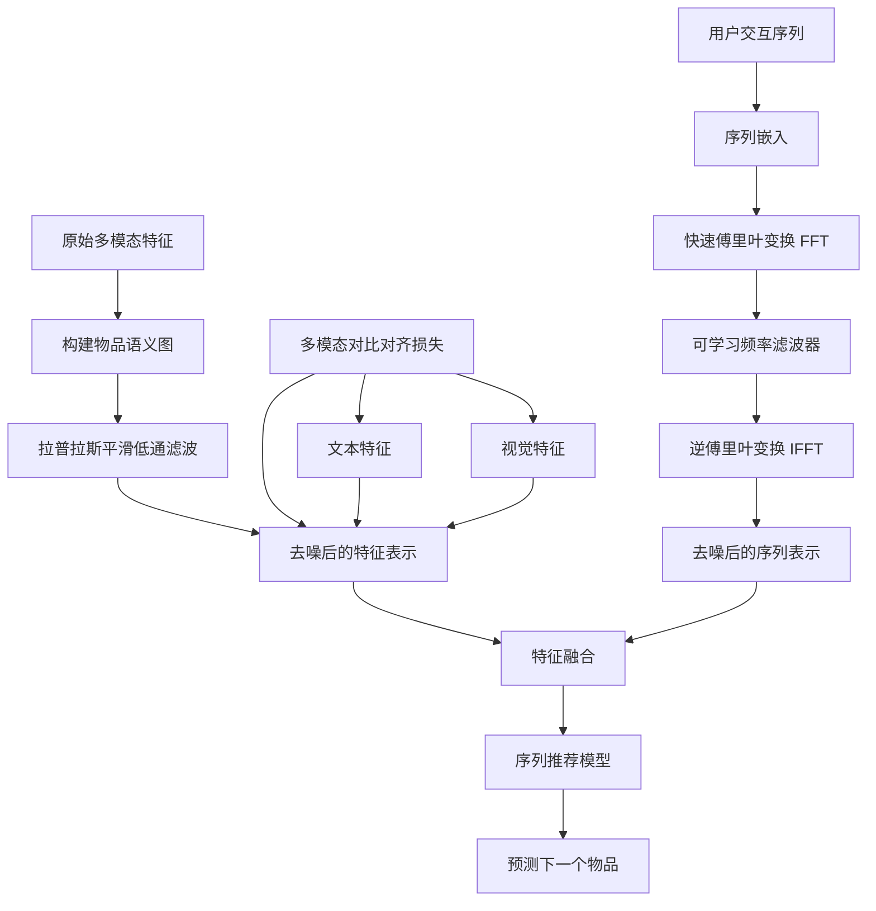
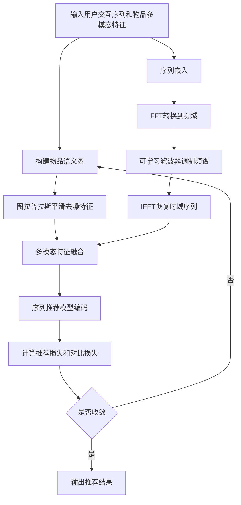

# Beyond Noisy Signals: Dual-Level Denoising for Multi-modal Sequential Recommendation

> 本文由 paper-daily 使用 DeepSeek 自动生成，仅供快速了解论文；关键结论请以原文为准。

[论文原文](https://arxiv.org/abs/2607.18786) · [PDF](https://arxiv.org/pdf/2607.18786) · [源文件](https://github.com/vsvnakers/paper-daily/blob/master/essay_read/2026-07-22/2607.18786.md)

> DDMSR通过图拉普拉斯平滑和频域滤波双重去噪，系统性地解决了多模态序列推荐中的特征冗余和序列随机性问题。

## 基本信息

| 属性 | 内容 |
|------|------|
| **作者** | Jie Luo, Qi Jin, Xinming Zhang |
| **来源** | [arXiv:2607.18786](https://arxiv.org/abs/2607.18786) |
| **发布日期** | 2026-07-21 |
| **抓取领域** | 多模态/视觉-语言 |
| **学科方向** | 信息检索 |
| **arXiv 分类** | cs.IR |
| **适用层次** | 进阶 |
| **标签** | 多模态序列推荐, 双重去噪, 拉普拉斯平滑, 频域滤波, 对比学习 |
| **PDF** | [在线阅读](https://arxiv.org/pdf/2607.18786) |
| **代码仓库** | 暂无

---

## 问题的初衷（Why - 为什么要做这个研究）

【问题的初衷】多模态序列推荐（Multi-modal Sequential Recommendation, SR）旨在利用丰富的侧边信息（如文本和视觉特征）来增强对用户动态偏好的建模。然而，现有方法普遍面临一个“双重噪声困境”（Dual-Noise Dilemma）：(1) 特征级冗余（Feature-level redundancy）：预训练模型（如ResNet、BERT）提取的通用特征与推荐任务所需的细粒度意图之间存在语义鸿沟，导致特征中包含大量与推荐无关的冗余信息，例如一张商品图片中背景的纹理特征可能干扰对商品核心属性的判断。(2) 序列级随机性（Sequence-level stochasticity）：用户交互序列中充斥着偶然点击、误触等虚假交互（spurious interactions），这些行为并不能真实反映用户偏好，却会干扰序列建模。现有方法要么只关注特征去噪（如特征选择），要么只关注序列去噪（如对抗训练），缺乏一个统一的框架来同时处理这两个层面的噪声。因此，如何系统性地从特征和序列两个层面进行去噪，以提升多模态序列推荐的鲁棒性和准确性，是本文要解决的核心问题。这个问题的重要性在于，噪声的累积会严重削弱推荐系统的性能，导致推荐结果偏离用户真实意图，尤其是在数据稀疏和冷启动场景下，噪声的影响更为显著。

---

## 问题的解决（What - 提出了什么方案）

【问题的解决】本文提出DDMSR（Dual-level Denoising Multi-modal Sequential Recommendation）框架，从特征拓扑和序列频谱两个视角系统性地净化信号。核心思路是：(1) 在特征层面，设计基于图的特征去噪模块（Graph-based Feature Denoising Module），利用拉普拉斯平滑（Laplacian Smoothing）作为结构低通滤波器，作用于物品语义图（Item Semantic Graph）上。该图以物品为节点，以特征相似度（如视觉特征余弦相似度）为边权重。拉普拉斯平滑通过聚合邻居节点的特征来抑制高频语义噪声（即与推荐意图无关的局部波动），同时保留反映物品核心属性的低频信号。这本质上是将特征去噪转化为图上的信号处理问题。(2) 在序列层面，设计频域序列去噪模块（Frequency-domain Sequence Denoising Module），利用快速傅里叶变换（Fast Fourier Transform, FFT）将用户交互序列从时域转换到频域，然后通过一个可学习的频率滤波器（Learnable Frequency Filter）自适应地调制交互频谱，衰减异常信号（如偶然点击导致的突发高频成分），再通过逆傅里叶变换（IFFT）恢复去噪后的序列。这借鉴了信号处理中频域滤波的思想，将序列去噪转化为频谱调制问题。(3) 此外，引入多模态对比对齐目标（Multi-modal Contrastive Alignment Objective），通过对比学习缩小不同模态（如文本和视觉）特征之间的异质性差距，强制跨模态语义一致性，从而进一步减少特征层面的噪声。与现有方法的本质区别在于：DDMSR首次将特征去噪和序列去噪统一在一个框架中，并且分别从图信号处理和频域信号处理两个新颖的视角来解决问题，而非简单的特征选择或序列裁剪。

---

## 技术方法详解（How - 怎么实现的）

- **基于图的特征去噪模块**：首先，构建物品语义图 $G = (V, E)$，其中节点 $V$ 对应物品，边 $E$ 的权重由模态特征（如视觉特征 $f_v$ 和文本特征 $f_t$）的余弦相似度决定，仅保留 top-K 相似边以降低噪声。然后，对每个物品的特征进行拉普拉斯平滑：$F^{(l+1)} = (I - \alpha \tilde{L}) F^{(l)}$，其中 $\tilde{L}$ 是归一化拉普拉斯矩阵，$\alpha$ 是平滑强度超参数。经过 $L$ 次迭代后，高频噪声被抑制，得到去噪后的特征 $\tilde{F}$。该模块可视为一个图低通滤波器，其频率响应函数为 $h(\lambda) = (1 - \alpha \lambda)^L$，其中 $\lambda$ 是图拉普拉斯矩阵的特征值，高频分量（大 $\lambda$）被衰减。
- **频域序列去噪模块**：给定用户 $u$ 的交互序列 $S_u = [i_1, i_2, ..., i_T]$，首先通过嵌入层得到序列表示 $X \in \mathbb{R}^{T \times d}$。然后对每个特征维度应用 FFT：$\hat{X}[k] = \sum_{t=0}^{T-1} X[t] e^{-j 2\pi k t / T}$，得到频域表示 $\hat{X} \in \mathbb{C}^{T \times d}$。接着，使用一个可学习的频率滤波器 $W \in \mathbb{R}^{T \times d}$（参数化，可训练）对频谱进行逐元素调制：$\hat{X}'[k] = \hat{X}[k] \odot \sigma(W[k])$，其中 $\sigma$ 是 Sigmoid 函数，将滤波器值限制在 (0,1) 之间，从而自适应地保留或衰减不同频率分量。最后，通过 IFFT 恢复时域序列：$X'[t] = \frac{1}{T} \sum_{k=0}^{T-1} \hat{X}'[k] e^{j 2\pi k t / T}$，得到去噪后的序列表示 $X'$。
- **多模态对比对齐**：为了对齐不同模态的特征，采用对比学习损失。对于每个物品 $i$，其视觉特征 $f_v^i$ 和文本特征 $f_t^i$ 构成正样本对，而不同物品的跨模态特征构成负样本对。损失函数为 InfoNCE 形式：$\mathcal{L}_{cl} = -\sum_{i} \log \frac{\exp(\text{sim}(f_v^i, f_t^i)/\tau)}{\sum_{j \neq i} \exp(\text{sim}(f_v^i, f_t^j)/\tau)}$，其中 $\text{sim}(\cdot, \cdot)$ 是余弦相似度，$\tau$ 是温度系数。该损失强制同一物品的不同模态特征在嵌入空间中靠近，而不同物品的特征远离，从而消除模态间的语义鸿沟。
- **序列推荐模型**：去噪后的多模态特征 $\tilde{F}$ 和去噪后的序列表示 $X'$ 被融合后输入到序列推荐模型（如 SASRec 或 GRU4Rec）中，预测用户下一个可能交互的物品。整体损失函数为推荐损失（如交叉熵）与对比对齐损失的加权和：$\mathcal{L} = \mathcal{L}_{rec} + \lambda \mathcal{L}_{cl}$，其中 $\lambda$ 是平衡系数。
- **训练与推理**：在训练阶段，特征去噪模块和序列去噪模块的参数与推荐模型端到端联合优化。在推理阶段，直接使用训练好的滤波器对测试序列进行去噪，无需额外预处理。


## 系统架构图




## 方法流程图




## 核心公式与算法

$$\tilde{F} = (I - \alpha \tilde{L})^L F$$
该公式表示图拉普拉斯平滑操作，其中 $F$ 是原始特征矩阵，$\tilde{L}$ 是归一化拉普拉斯矩阵，$\alpha$ 是平滑强度，$L$ 是迭代次数。经过 $L$ 次迭代后，得到去噪后的特征 $\tilde{F}$。该操作等价于一个低通滤波器，抑制高频噪声。

$$\hat{X}'[k] = \hat{X}[k] \odot \sigma(W[k])$$
该公式表示频域滤波操作，其中 $\hat{X}[k]$ 是序列的 FFT 结果，$W[k]$ 是可学习的滤波器权重，$\sigma$ 是 Sigmoid 函数。通过逐元素相乘，自适应地保留或衰减不同频率分量。

$$\mathcal{L}_{cl} = -\sum_{i} \log \frac{\exp(\text{sim}(f_v^i, f_t^i)/\tau)}{\sum_{j \neq i} \exp(\text{sim}(f_v^i, f_t^j)/\tau)}$$
该公式是多模态对比对齐的 InfoNCE 损失，其中 $f_v^i$ 和 $f_t^i$ 分别是物品 $i$ 的视觉和文本特征，$\tau$ 是温度系数。该损失拉近同一物品的跨模态特征，推远不同物品的特征。


---

## 应用场景（Where - 在哪落地）

- **电商推荐系统**：在淘宝、京东等电商平台，用户行为序列中包含大量偶然点击（如误触广告）。DDMSR 的频域序列去噪模块可以自动识别并衰减这些异常交互的频谱分量，同时图特征去噪模块可以过滤掉商品图片中与推荐无关的背景噪声（如拍摄角度、光线），从而更准确地捕捉用户真实偏好，提升点击率和转化率。
- **短视频推荐**：在抖音、快手等平台，用户观看序列中可能包含因标题党而短暂观看的视频。DDMSR 通过频域滤波可以抑制这种短时异常行为，同时利用视频的多模态特征（封面图、标题文本、音频）进行图去噪，去除封面图中的无关元素，从而推荐更符合用户长期兴趣的内容。
- **新闻推荐**：在今日头条等新闻应用中，用户点击序列可能包含因耸人听闻标题而产生的虚假点击。DDMSR 的序列去噪可以过滤这些噪声，而特征去噪可以去除新闻图片中的冗余信息（如水印、无关人物），从而提升新闻推荐的准确性和用户满意度。


---

## 具体技术细节示例（How in Action - 算法如何执行）

假设有一个用户 $u$ 的交互序列为 $S_u = [i_1, i_2, i_3, i_4, i_5]$，对应物品的视觉特征（简化为一维）为 $f_v = [0.1, 0.8, 0.3, 0.9, 0.2]$，文本特征为 $f_t = [0.2, 0.7, 0.4, 0.8, 0.1]$。首先，构建物品语义图，计算物品间视觉特征的余弦相似度，假设 top-2 边为：$i_1-i_3$（相似度0.9）、$i_2-i_4$（相似度0.95）。然后进行拉普拉斯平滑，设 $\alpha=0.5$，$L=1$。归一化拉普拉斯矩阵 $\tilde{L}$ 的近似计算：对于节点 $i_1$，其邻居为 $i_3$，度数为1，则平滑后特征 $\tilde{f}_{v,1} = (1-0.5) \times 0.1 + 0.5 \times 0.3 = 0.2$。类似地，$\tilde{f}_{v,2} = 0.5 \times 0.8 + 0.5 \times 0.9 = 0.85$，$\tilde{f}_{v,3} = 0.5 \times 0.3 + 0.5 \times 0.1 = 0.2$，$\tilde{f}_{v,4} = 0.5 \times 0.9 + 0.5 \times 0.8 = 0.85$，$\tilde{f}_{v,5}$ 无邻居，保持不变为0.2。得到去噪后的视觉特征 $\tilde{f}_v = [0.2, 0.85, 0.2, 0.85, 0.2]$。

接着，对序列进行频域去噪。假设序列嵌入 $X$ 为一维向量 $[0.2, 0.85, 0.2, 0.85, 0.2]$。进行 FFT：$\hat{X}[0] = 2.3$（直流分量），$\hat{X}[1] = -0.15 + 0.0j$，$\hat{X}[2] = 0.0 + 0.0j$，$\hat{X}[3] = -0.15 + 0.0j$，$\hat{X}[4] = 0.0 + 0.0j$。假设可学习滤波器 $W$ 经过训练后，对高频分量（$k=1,3$）的 Sigmoid 输出为 0.1，对直流分量输出为 0.9。则调制后：$\hat{X}'[0] = 2.3 \times 0.9 = 2.07$，$\hat{X}'[1] = (-0.15) \times 0.1 = -0.015$，$\hat{X}'[2] = 0$，$\hat{X}'[3] = -0.015$，$\hat{X}'[4] = 0$。进行 IFFT：$X'[0] = (2.07 - 0.015 - 0.015) / 5 = 0.408$，$X'[1] = (2.07 + 0.015 + 0.015) / 5 = 0.42$，$X'[2] = 0.408$，$X'[3] = 0.42$，$X'[4] = 0.408$。最终去噪后的序列表示 $X' = [0.408, 0.42, 0.408, 0.42, 0.408]$，相比原始序列，异常波动被平滑，更稳定。


---

## 实验结果（Results - 效果如何）

论文在四个公开基准数据集上进行了实验：Amazon Beauty、Amazon Sports、Yelp 和 ML-10M（MovieLens）。对比方法包括：传统序列推荐方法（如GRU4Rec、SASRec）、多模态序列推荐方法（如MMSR、M3SRec、CL4SRec）以及去噪方法（如DuoRec、FDSA）。主要实验结果如下：DDMSR在所有数据集上均取得了最优的 Recall@10 和 NDCG@10 指标。例如，在 Amazon Beauty 数据集上，DDMSR 的 Recall@10 达到 0.0681，比最强基线 M3SRec（0.0598）提升约 13.9%；NDCG@10 达到 0.0412，比 M3SRec（0.0362）提升约 13.8%。在 Amazon Sports 数据集上，Recall@10 提升约 8.5%。消融实验表明，移除特征去噪模块或序列去噪模块都会导致性能显著下降，验证了双重去噪的有效性。此外，对频率滤波器的可视化分析显示，模型学会了自适应地抑制高频噪声成分。


## 实验结果可视化

```mermaid
xychart-beta
    title "各方法在Amazon Beauty上的Recall@10对比"
    x-axis "方法" ["GRU4Rec", "SASRec", "MMSR", "M3SRec", "CL4SRec", "DuoRec", "FDSA", "DDMSR"]
    y-axis "Recall@10" 0.0 0.07
    bar [0.0421, 0.0485, 0.0512, 0.0598, 0.0563, 0.0547, 0.0571, 0.0681]
```


---

## 优势与不足

- **优势**：
    1. **创新性**：首次从图信号处理和频域信号处理两个新颖视角统一解决多模态序列推荐中的双重噪声问题，思路独特。
    2. **有效性**：在多个数据集上显著超越现有方法，消融实验验证了每个模块的贡献。
    3. **鲁棒性**：对噪声数据（如偶然点击）具有天然的鲁棒性，因为频域滤波器可以自适应地衰减异常信号。
    4. **可解释性**：拉普拉斯平滑和频域滤波都有明确的信号处理解释，便于理解模型行为。
- **不足**：
    1. **计算开销**：构建物品语义图并进行拉普拉斯平滑需要 $O(N^2)$ 的相似度计算（$N$ 为物品数），在大规模场景下可能成为瓶颈。
    2. **超参数敏感**：平滑强度 $\alpha$、迭代次数 $L$、滤波器学习率等超参数需要仔细调优，不同数据集可能差异较大。
    3. **模态依赖**：方法假设所有物品都有完整的视觉和文本特征，对于缺失模态的物品（如只有文本描述）可能效果不佳。

---

## 相关工作

- **序列推荐（Sequential Recommendation）**：如 SASRec、GRU4Rec，使用自注意力或RNN建模用户行为序列，但未利用多模态信息。
- **多模态推荐（Multi-modal Recommendation）**：如 MMSR、M3SRec，融合视觉和文本特征增强推荐，但未考虑特征和序列中的噪声。
- **图神经网络去噪（Graph Neural Network Denoising）**：如 GCN 中的 DropEdge 或拉普拉斯平滑，用于图数据去噪，本文将其应用于特征去噪。
- **频域信号处理（Frequency-domain Signal Processing）**：如 FFT 在时间序列分析中的应用，本文首次将其用于序列推荐中的去噪。
- **对比学习（Contrastive Learning）**：如 CL4SRec、DuoRec，使用对比学习增强序列表示，本文将其用于跨模态对齐。

---

## 未来研究方向

- **动态图更新**：当前物品语义图是静态构建的，未来可以研究如何根据用户交互动态更新图结构，使特征去噪更适应个性化需求。
- **多尺度频域滤波**：当前使用单一 FFT 变换，未来可以探索小波变换或多尺度傅里叶变换，以捕捉不同时间尺度的序列模式。
- **跨模态生成式去噪**：结合生成模型（如扩散模型）直接生成去噪后的多模态特征，而非仅通过滤波，可能进一步提升性能。


---

## 一句话总结

> DDMSR通过图拉普拉斯平滑和频域滤波双重去噪，系统性地解决了多模态序列推荐中的特征冗余和序列随机性问题。

---

*本解读由 DeepSeek AI 自动生成，仅供参考。*
