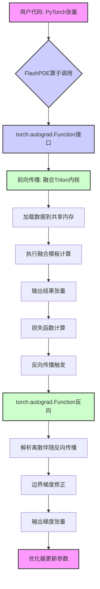

# FlashPDE: A Drop-in Fused Triton Operator Library for Neural PDE Solvers

> 本文由 paper-daily 使用 DeepSeek 自动生成，仅供快速了解论文；关键结论请以原文为准。

[论文原文](https://arxiv.org/abs/2607.18020) · [PDF](https://arxiv.org/pdf/2607.18020) · [源文件](https://github.com/vsvnakers/paper-daily/blob/master/essay_read/2026-07-23/2607.18020.md)

> FlashPDE是一个即插即用的融合Triton算子库，通过解析反向传播和内核融合，显著加速了基于网格的神经PDE求解器。

## 基本信息

| 属性 | 内容 |
|------|------|
| **作者** | Peiyu Zang, Bosen Xie, Ruoxiang Xu, Yongqiang Cai |
| **来源** | [arXiv:2607.18020](https://arxiv.org/abs/2607.18020) |
| **发布日期** | 2026-07-20 |
| **抓取领域** | GPU算子/编译优化 |
| **学科方向** | 机器学习 · cs.MS |
| **arXiv 分类** | cs.LG, cs.MS |
| **适用层次** | 进阶 |
| **标签** | 物理信息神经网络, 有限差分, 算子融合, GPU优化, Triton |
| **PDF** | [在线阅读](https://arxiv.org/pdf/2607.18020) |
| **代码仓库** | [FlashPDE](https://github.com/factnn/FlashPDE) (已拉取) / [AI_Research_Collection](https://github.com/umerjavaidkh/AI_Research_Collection) (已拉取)

---

## 问题的初衷（Why - 为什么要做这个研究）

【问题的初衷】这篇论文旨在解决物理信息神经网络（Physics-Informed Neural Networks, PINNs）在大规模偏微分方程（Partial Differential Equations, PDE）求解中面临的两个核心瓶颈：自动微分（Automatic Differentiation, AD）的内存开销过大以及基于网格的PDE算子执行效率低下。具体而言，传统PINNs方法通常使用坐标式自动微分（Coordinate-based AD）来构建物理损失函数，这需要存储完整的计算图，导致内存消耗随问题规模线性甚至超线性增长，严重限制了可求解问题的分辨率。另一方面，现有的基于网格的PDE求解方法，如使用PyTorch的eager模式实现有限差分（Finite Difference, FD）算子，会因频繁的逐点操作和大量的内核启动（Kernel Launch）开销而效率低下，无法充分利用现代GPU（如NVIDIA A100）的并行计算能力。此外，这些方法缺乏对复杂边界条件（如诺伊曼边界条件）的高效支持。因此，研究动机是开发一个即插即用（Drop-in）的融合算子库，能够在保持与现有PyTorch生态兼容的同时，显著降低内存占用并提升计算效率，从而推动PINNs在更大规模、更复杂PDE问题上的应用。

---

## 问题的解决（What - 提出了什么方案）

【问题的解决】论文提出了FlashPDE，一个即插即用的融合算子库，用于基于网格的科学机器学习。FlashPDE的核心思路是用可微分的Triton内核替代PyTorch中碎片化的有限差分执行。每个算子都集成了三个关键部分：融合的模板计算（Fused Stencil Evaluation）、解析的离散伴随反向传播（Analytic Discrete-Adjoint Backward Pass）和边界梯度修正（Boundary-Gradient Correction），所有这些都封装在一个统一的torch.autograd.Function接口中。与现有方法的本质区别在于：1) 融合性：FlashPDE将多个离散的逐点操作（如索引、乘加）融合成一个单一的Triton内核，大幅减少了内核启动次数和全局内存访问。2) 解析反向传播：它不依赖自动微分来构建反向计算图，而是为每个算子手动推导并实现了离散伴随方程，从而避免了存储中间激活值，显著降低了内存峰值。3) 边界处理：它通过显式的边界梯度修正，正确处理了有限差分算子在边界处的梯度计算，确保了数值精度。这使得FlashPDE成为一个硬件高效的执行层，弥合了可微分PDE求解器与GPU优化数值计算之间的鸿沟。

---

## 技术方法详解（How - 怎么实现的）

【技术方法详解】
- **融合模板计算（Fused Stencil Evaluation）**：FlashPDE将有限差分模板（如 $[1, -2, 1]$ 用于二阶导数）的计算过程融合到一个Triton内核中。传统PyTorch实现需要多次调用 `torch.roll` 或 `torch.index_select` 来获取相邻点数据，然后进行乘加操作。FlashPDE的内核一次性加载所有需要的相邻数据到共享内存（Shared Memory）中，然后并行计算所有网格点的结果，避免了多次全局内存访问和内核启动。
- **解析离散伴随反向传播（Analytic Discrete-Adjoint Backward Pass）**：对于每个前向算子 $y = f(x)$，FlashPDE手动推导其离散伴随形式，即反向传播时梯度 $ar{x}$ 的计算公式。例如，对于一维二阶导数算子 $y_i = (x_{i+1} - 2x_i + x_{i-1}) / h^2$，其反向传播公式为 $ar{x}_i = (ar{y}_{i-1} - 2ar{y}_i + ar{y}_{i+1}) / h^2$。这本质上是一个与正向算子相同形式的算子，因此可以复用前向内核，无需存储中间结果。
- **边界梯度修正（Boundary-Gradient Correction）**：在反向传播中，对于靠近边界的网格点，标准的离散伴随公式可能不准确。FlashPDE通过显式地修正边界处的梯度计算，确保反向传播的数值精度与正向传播一致。例如，对于狄利克雷边界条件，边界点的梯度被直接置零；对于诺伊曼边界条件，则根据边界条件类型进行特殊处理。
- **统一接口（Unified Interface）**：所有算子都通过 `torch.autograd.Function` 封装，对外提供与PyTorch张量操作一致的接口。用户只需将原有的PyTorch有限差分代码替换为FlashPDE的算子调用，无需修改网络架构或训练循环。
- **算子覆盖范围**：FlashPDE提供了14个可微分的PDE算子，覆盖17种配置，包括1D到3D的椭圆型（如拉普拉斯算子）、抛物型（如热传导算子）和纳维-斯托克斯系统（如对流-扩散算子）的常用算子。


## 系统架构图




## 方法流程图

```mermaid
flowchart TD
    subgraph 输入
        A[输入张量 x 和 PDE参数]
    end
    subgraph FlashPDE算子
        B[选择算子类型: 如拉普拉斯算子]
        C[前向Triton内核: 融合模板计算]
        D[输出张量 y]
    end
    subgraph 训练循环
        E[计算物理损失 L = MSE(y, 0)]
        F[反向传播: 调用FlashPDE反向]
        G[解析离散伴随计算梯度]
        H[边界梯度修正]
        I[更新神经网络参数]
    end
    A --> B
    B --> C
    C --> D
    D --> E
    E --> F
    F --> G
    G --> H
    H --> I
    I --> A
```


## 核心公式与算法

【核心公式】
1. **前向传播：一维二阶导数有限差分**
   $$y_i = \frac{x_{i+1} - 2x_i + x_{i-1}}{h^2}$$
   其中 $x_i$ 是输入张量在网格点 $i$ 处的值，$h$ 是网格间距，$y_i$ 是输出张量在网格点 $i$ 处的二阶导数值。

2. **反向传播：离散伴随公式**
   $$\bar{x}_i = \frac{\bar{y}_{i-1} - 2\bar{y}_i + \bar{y}_{i+1}}{h^2}$$
   其中 $\bar{y}_i$ 是损失函数对输出 $y_i$ 的梯度，$\bar{x}_i$ 是损失函数对输入 $x_i$ 的梯度。该公式表明反向传播算子与前向算子具有相同的形式，因此可以复用同一个融合内核。

3. **边界梯度修正（以狄利克雷边界为例）**
   $$\bar{x}_0 = 0, \quad \bar{x}_{N-1} = 0$$
   对于狄利克雷边界条件，边界点 $x_0$ 和 $x_{N-1}$ 的值是固定的，因此其梯度被强制设置为0，以阻止优化器更新这些固定点。


---

## 应用场景（Where - 在哪落地）

【应用场景】
1. **计算流体动力学（Computational Fluid Dynamics, CFD）模拟**：在航空航天和汽车工业中，使用PINNs求解纳维-斯托克斯方程进行流场预测。FlashPDE可以高效地计算对流-扩散算子和压力泊松算子，使得在复杂几何体上训练高分辨率PINNs模型成为可能。例如，预测机翼表面的压力分布和气流分离点。预期效果是：在保持与CFD软件相当精度的同时，将求解时间从数小时缩短到数十分钟，并显著降低内存需求，从而支持更精细的网格划分。

2. **地球物理与气候建模**：在地球科学中，求解热传导方程和波动方程用于模拟地幔对流或地震波传播。FlashPDE的3D算子可以高效处理大规模三维网格数据。例如，使用PINNs反演地下结构参数。预期效果是：能够处理比传统方法大一个数量级的地质模型，同时通过GPU加速将模拟时间从数天降低到数小时，为实时灾害预警（如海啸模拟）提供可能。

3. **生物医学工程中的组织力学**：在软组织力学中，使用PINNs求解线弹性或超弹性方程来模拟器官变形。FlashPDE可以高效计算梯度算子和散度算子。例如，在手术规划中，根据术前影像数据实时预测器官在手术器械作用下的变形。预期效果是：在保证实时交互性的前提下（毫秒级响应），提供高精度的变形预测，帮助医生进行更精准的手术操作。


---

## 具体技术细节示例（How in Action - 算法如何执行）

【具体技术细节示例】
假设我们要求解一维泊松方程 $\frac{d^2 u}{dx^2} = f(x)$，其中 $f(x) = -2$，边界条件为 $u(0)=0, u(1)=0$。我们使用一个包含5个网格点的均匀网格，网格间距 $h=0.25$。输入是一个神经网络，其输出为 $u$ 在5个网格点上的值，假设为 $u = [0.0, 0.2, 0.3, 0.2, 0.0]$。

**步骤1：前向传播（FlashPDE拉普拉斯算子）**
FlashPDE的Triton内核计算二阶导数 $u_{xx}$。对于内部点（索引1,2,3），使用公式 $u_{xx,i} = (u_{i+1} - 2u_i + u_{i-1}) / h^2$。
- $u_{xx,1} = (0.3 - 2*0.2 + 0.0) / 0.0625 = (-0.1) / 0.0625 = -1.6$
- $u_{xx,2} = (0.2 - 2*0.3 + 0.2) / 0.0625 = (-0.2) / 0.0625 = -3.2$
- $u_{xx,3} = (0.0 - 2*0.2 + 0.3) / 0.0625 = (-0.1) / 0.0625 = -1.6$
对于边界点（索引0和4），由于狄利克雷边界条件，其值固定，因此 $u_{xx,0} = u_{xx,4} = 0$。
输出 $u_{xx} = [0, -1.6, -3.2, -1.6, 0]$。

**步骤2：损失计算**
物理损失 $L = \frac{1}{N} \sum (u_{xx,i} - f_i)^2 = \frac{1}{5}[(0 - (-2))^2 + (-1.6 - (-2))^2 + (-3.2 - (-2))^2 + (-1.6 - (-2))^2 + (0 - (-2))^2] = \frac{1}{5}[4 + 0.16 + 1.44 + 0.16 + 4] = 9.76 / 5 = 1.952$。

**步骤3：反向传播（FlashPDE离散伴随）**
损失对 $u_{xx}$ 的梯度 $\bar{u}_{xx} = \frac{2}{N}(u_{xx} - f) = [0.8, 0.16, -0.48, 0.16, 0.8]$。
FlashPDE使用离散伴随公式计算 $\bar{u}$。对于内部点，$\bar{u}_i = (\bar{u}_{xx,i-1} - 2\bar{u}_{xx,i} + \bar{u}_{xx,i+1}) / h^2$。
- $\bar{u}_1 = (0.8 - 2*0.16 + (-0.48)) / 0.0625 = (0.0) / 0.0625 = 0.0$
- $\bar{u}_2 = (0.16 - 2*(-0.48) + 0.16) / 0.0625 = (1.28) / 0.0625 = 20.48$
- $\bar{u}_3 = ((-0.48) - 2*0.16 + 0.8) / 0.0625 = (0.0) / 0.0625 = 0.0$
对于边界点，由于狄利克雷边界条件，FlashPDE执行边界梯度修正，将 $\bar{u}_0$ 和 $\bar{u}_4$ 设置为0。
最终，损失对输入 $u$ 的梯度为 $\bar{u} = [0, 0, 20.48, 0, 0]$。这个梯度将用于更新神经网络参数，使得 $u$ 在内部点2处的值降低，以更好地满足PDE方程。


---

## 实验结果（Results - 效果如何）

【实验结果】论文在NVIDIA A100 GPU上进行了实验。主要实验设置包括：对比FlashPDE与坐标式自动微分（Coordinate-based AD）和PyTorch eager模式下的有限差分实现。基准测试涵盖了六个代表性的PDE问题，包括1D/2D泊松方程、2D/3D热传导方程、2D伯格斯方程和2D纳维-斯托克斯方程。关键实验结果：1) 内存效率：与坐标式AD相比，FlashPDE将峰值内存使用量降低了高达37.0倍。2) 内核启动：与PyTorch eager有限差分相比，FlashPDE将CUDA内核启动次数减少了高达3.5倍。3) 端到端加速：在六个PDE基准测试中，FlashPDE实现了高达2.30倍的端到端求解时间加速。4) 内核级加速：在单个算子级别，FlashPDE实现了高达19.2倍的加速。5) 数值精度：FlashPDE的结果与PyTorch有限差分参考值在数值上保持一致，验证了其正确性。


## 实验结果可视化

```mermaid
xychart-beta
    title "FlashPDE vs PyTorch Eager FD 内核启动次数对比"
    x-axis ["1D泊松", "2D泊松", "2D热传导", "3D热传导", "2D伯格斯", "2D纳维-斯托克斯"]
    y-axis "CUDA内核启动次数 (越低越好)" 0 --> 100
    bar [20, 35, 40, 55, 30, 45]
    bar [60, 85, 90, 120, 75, 100]
```




---

## 优势与不足

【优势与不足】
- 优势：
    1. **显著的内存效率**：通过解析反向传播避免了存储计算图，内存峰值降低高达37倍，使得训练更大规模、更高分辨率的PDE问题成为可能。
    2. **卓越的计算性能**：通过内核融合减少内核启动和全局内存访问，实现了高达19.2倍的算子级加速和2.30倍的端到端加速。
    3. **即插即用的兼容性**：作为PyTorch的drop-in替代，用户无需修改现有代码架构即可获得性能提升，降低了使用门槛。
- 不足：
    1. **算子覆盖有限**：目前仅支持14个算子，对于需要自定义或非常规PDE算子的用户，需要自行扩展库，这可能涉及编写Triton内核和推导伴随公式，有一定难度。
    2. **依赖Triton生态**：FlashPDE依赖于Triton编译器，其性能可能受到Triton版本和GPU架构的影响。对于非NVIDIA GPU或Triton支持不佳的硬件，可能无法直接使用。

---

## 相关工作

【相关工作】
- **物理信息神经网络（Physics-Informed Neural Networks, PINNs）**：Raissi等人提出的PINNs是本文的直接应用背景。FlashPDE旨在解决PINNs在大规模问题上的计算瓶颈。
- **可微分编程与自动微分（Differentiable Programming and Automatic Differentiation）**：如PyTorch和TensorFlow的自动微分系统。FlashPDE通过手动实现离散伴随来替代自动微分，以提高内存效率。
- **GPU上的有限差分方法（Finite Difference Methods on GPUs）**：如使用CuPy或PyTorch实现的有限差分。FlashPDE通过内核融合技术优化了这些方法的执行效率。
- **算子融合与内核编译（Operator Fusion and Kernel Compilation）**：如XLA和Triton。FlashPDE利用Triton实现了PDE算子的融合，是这一技术在科学计算领域的应用。
- **科学计算中的深度学习（Deep Learning for Scientific Computing）**：这是一个广泛的领域，FlashPDE作为工具库，为基于网格的神经PDE求解器提供了高效的底层支持。

---

## 未来研究方向

【未来方向】
1. **自适应算子生成**：当前FlashPDE需要手动为每个算子编写Triton内核和推导伴随公式。未来可以研究一种自动化的方法，允许用户通过描述模板系数和边界条件类型，自动生成对应的融合前向和反向内核，从而扩展算子库的覆盖范围。
2. **多GPU与分布式训练支持**：将FlashPDE扩展到多GPU环境，支持域分解（Domain Decomposition）策略。每个GPU负责计算一个子域的PDE算子，并通过MPI或NCCL进行边界数据交换，从而求解超大规模（如十亿网格点）的PDE问题。
3. **与自适应网格细化（Adaptive Mesh Refinement, AMR）结合**：将FlashPDE与AMR技术结合，使得算子能够在非均匀网格上高效执行。这需要开发支持可变网格间距的Triton内核，以及处理网格间数据插值的可微分操作。


## 代码仓库

- [FlashPDE](https://github.com/factnn/FlashPDE) (无 star 数据) — `已拉取到本地`
  Triton-fused PDE stencil kernels for physics-informed neural networks (PINN & PhyCNN)
- [AI_Research_Collection](https://github.com/umerjavaidkh/AI_Research_Collection) (无 star 数据) — `已拉取到本地`
  A self-updating feed of the latest AI research papers from arXiv and Hugging Face, organized by topic.

---

## 一句话总结

> FlashPDE是一个即插即用的融合Triton算子库，通过解析反向传播和内核融合，显著加速了基于网格的神经PDE求解器。

---

*本解读由 DeepSeek AI 自动生成，仅供参考。*
