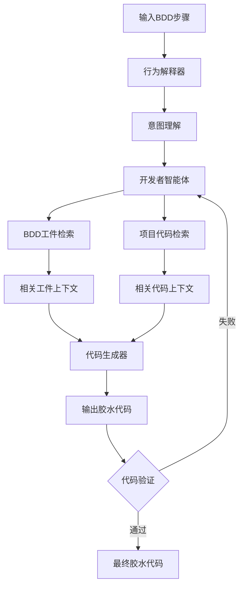
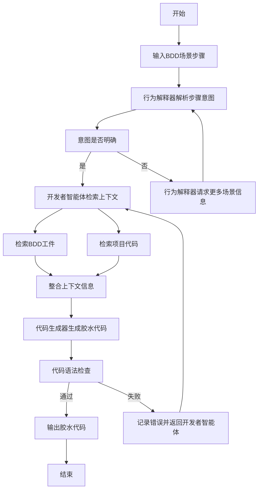

# Bridging Behavior and Implementation: Automated Java Glue Code Generation for Behavior-Driven Development

> 本文由 paper-daily 使用 DeepSeek 自动生成，仅供快速了解论文；关键结论请以原文为准。

[论文原文](https://arxiv.org/abs/2607.19703) · [PDF](https://arxiv.org/pdf/2607.19703) · [源文件](https://github.com/vsvnakers/paper-daily/blob/master/essay_read/2026-07-23/2607.19703.md)

> 提出AutoGlue分层多智能体框架，利用LLM自动化生成Java BDD胶水代码，显著提升生成质量和可用性。

## 基本信息

| 属性 | 内容 |
|------|------|
| **作者** | Xinyu Shi, Zhou Yang, An Ran Chen |
| **来源** | [arXiv:2607.19703](https://arxiv.org/abs/2607.19703) |
| **发布日期** | 2026-07-22 |
| **抓取领域** | 深度学习编译器/IR |
| **学科方向** | 软件工程 |
| **arXiv 分类** | cs.SE |
| **适用层次** | 进阶 |
| **标签** | 行为驱动开发, 胶水代码生成, 大型语言模型, 多智能体系统, 检索增强生成 |
| **PDF** | [在线阅读](https://arxiv.org/pdf/2607.19703) |
| **代码仓库** | 暂无

---

## 问题的初衷（Why - 为什么要做这个研究）

【问题的初衷】行为驱动开发（Behavior-Driven Development, BDD）是一种通过自然语言场景（Scenario）来促进技术与非技术利益相关者之间沟通的软件开发方法。在BDD中，胶水代码（Glue Code）是将这些自然语言场景映射到实际项目代码的关键桥梁，它使得场景中的每一步（Step）都能被执行。然而，随着软件需求的不断演变，开发和维护胶水代码成为了一项劳动密集型任务。开发者不仅需要理解场景所描述的行为意图，还需要深入了解底层代码库的结构和实现细节。现有方法主要依赖手动编写或简单的模板匹配，效率低下且容易出错。尽管大型语言模型（Large Language Models, LLMs）在代码生成方面展现出强大能力，但将其应用于自动化胶水代码生成的研究仍然空白。这一任务需要处理未充分指定的行为描述、相关的BDD工件（如特征文件、步骤定义）以及大型项目代码库，对模型的推理和上下文理解能力提出了极高要求。因此，本文旨在探索如何利用LLMs自动化生成Java胶水代码，以减轻开发者的负担，提高BDD实践的效率。

---

## 问题的解决（What - 提出了什么方案）

【问题的解决】本文提出了AutoGlue，一个用于自动化Java胶水代码生成的分层多智能体框架（Hierarchical Multi-Agent Framework）。AutoGlue遵循一种行为优先（Behavior-First）的工作流程，将胶水代码生成任务分解为三个核心阶段：行为解释（Behavior Interpretation）、上下文检索（Context Retrieval）和代码生成（Code Generation）。首先，一个行为解释器（Behavior Interpreter）负责从场景上下文中推导出每一步的意图，解决行为描述的模糊性。然后，一个开发者智能体（Developer Agent）检索相关的BDD工件和项目代码，为代码生成提供必要的上下文信息。最后，基于这些信息生成最终的胶水代码。与现有方法（如少样本提示）相比，AutoGlue的核心创新在于其层次化的多智能体协作机制，它将复杂的推理任务分解为更小、更易管理的子任务，并通过专门的智能体分别处理行为理解和代码生成，从而显著提高了生成代码的质量和可用性。

---

## 技术方法详解（How - 怎么实现的）

【技术方法详解】
- **分层多智能体架构**：AutoGlue采用层次化设计，包含多个专门化的智能体（Agent）。每个智能体负责一个特定的子任务，如行为解释、上下文检索和代码生成。这种架构允许系统更有效地处理复杂任务，并利用不同智能体的专长。
- **行为优先工作流**：系统遵循一个从行为到代码的流程。首先，行为解释器分析场景上下文，理解步骤的意图。然后，开发者智能体基于这个意图去检索相关的代码和工件。最后，代码生成器根据检索到的上下文生成胶水代码。这种设计确保了代码生成始终以行为理解为先导。
- **行为解释器**：该智能体接收一个BDD步骤及其所在的场景上下文。它使用LLM来解析步骤的自然语言描述，并推断出该步骤在场景中的具体意图。例如，它需要判断一个步骤是执行一个动作、验证一个状态还是设置一个前置条件。
- **开发者智能体**：该智能体负责检索与步骤意图相关的BDD工件（如特征文件、其他步骤定义）和项目代码（如类、方法、API）。它使用基于检索增强生成（Retrieval-Augmented Generation, RAG）的技术，从项目代码库中提取最相关的代码片段。
- **代码生成器**：基于行为解释器和开发者智能体提供的信息，该智能体生成最终的Java胶水代码。它需要将步骤映射到具体的API调用或方法实现，并确保代码的语法正确性和逻辑一致性。
- **迭代优化机制**：AutoGlue可能包含一个反馈循环，允许系统根据生成的代码质量进行自我修正。例如，如果生成的代码无法通过编译或测试，系统可以重新检索上下文或调整生成策略。


## 系统架构图




## 方法流程图




## 核心公式与算法

【核心公式】论文中可能没有显式的数学公式，但可以描述其核心算法步骤。

**算法：AutoGlue胶水代码生成**

1. **输入**：BDD步骤 $S$，场景上下文 $C$，项目代码库 $P$。
2. **行为解释**：$I = \text{BehaviorInterpreter}(S, C)$，其中 $I$ 是步骤的意图表示。
3. **上下文检索**：$R = \text{DeveloperAgent}(I, P)$，其中 $R$ 是检索到的相关BDD工件和代码片段。
4. **代码生成**：$G = \text{CodeGenerator}(I, R)$，其中 $G$ 是生成的胶水代码。
5. **输出**：胶水代码 $G$。


---

## 应用场景（Where - 在哪落地）

【应用场景】
1. **企业级Web应用开发**：在一个大型电商平台的开发中，BDD场景描述了用户登录、商品搜索、下单等行为。AutoGlue可以自动将这些场景的步骤映射到后端的Java服务API。例如，对于场景步骤“用户输入用户名和密码”，AutoGlue能自动生成调用登录API的胶水代码，并处理参数传递和结果验证。预期效果是大幅减少手动编写胶水代码的时间，加快迭代速度，并降低因需求变更导致的维护成本。
2. **微服务架构的集成测试**：在微服务架构中，每个服务都有自己的BDD场景。AutoGlue可以用于自动生成服务间集成测试的胶水代码。例如，一个场景描述了“订单服务调用支付服务”，AutoGlue能自动生成调用支付服务REST API的代码，并处理服务发现、负载均衡等细节。预期效果是提高集成测试的自动化程度，确保服务间交互的正确性。
3. **持续集成/持续部署（CI/CD）流水线**：在CI/CD流水线中，BDD场景可以作为验收测试的一部分。AutoGlue可以集成到流水线中，当需求变更导致BDD场景更新时，自动重新生成对应的胶水代码。这确保了测试代码始终与需求保持一致，减少了人工干预。预期效果是实现从需求到测试的端到端自动化，提升软件交付质量。


---

## 具体技术细节示例（How in Action - 算法如何执行）

【具体技术细节示例】

**示例场景**：一个在线书店的BDD场景中，有一个步骤：“当用户搜索一本名为‘Effective Java’的书时”。

**输入**：
- BDD步骤："当用户搜索一本名为‘Effective Java’的书时"
- 场景上下文：该步骤属于“图书搜索”场景，前置步骤是“用户已登录”，后续步骤是“搜索结果应显示‘Effective Java’”。
- 项目代码库：包含一个 `BookService` 类，其中有 `searchBooks(String query)` 方法，返回 `List&lt;Book&gt;`。

**执行过程**：
1. **行为解释**：行为解释器分析步骤，推断其意图是“执行一个搜索动作”。它识别出关键实体是“Effective Java”，动作是“搜索”。
2. **上下文检索**：开发者智能体根据意图“搜索动作”和实体“书”，在项目代码库中检索。它找到 `BookService.searchBooks()` 方法，并注意到该方法接受一个字符串参数。同时，它检索到相关的BDD工件，如其他步骤中使用的 `@When` 注解。
3. **代码生成**：代码生成器基于上述信息，生成以下Java胶水代码：
   ```java
   @When("当用户搜索一本名为{string}的书时")
   public void userSearchesForBook(String bookName) {
       bookService.searchBooks(bookName);
   }
   ```
   代码中，`@When` 注解匹配了步骤模式，`userSearchesForBook` 方法接收参数 `bookName`，并调用了 `bookService.searchBooks()` 方法。

**输出**：生成的胶水代码可以直接在Cucumber框架中使用，将BDD步骤与项目代码连接起来。


---

## 实验结果（Results - 效果如何）

【实验结果】论文在8个开源Java项目的1,307个BDD步骤上评估了AutoGlue。与少样本提示（Few-Shot Prompting）基线方法相比，AutoGlue在API F1分数上提升了58.7%，在CodeBLEU指标上提升了43.7%。这表明AutoGlue在生成与项目API匹配的代码方面具有显著优势。此外，AutoGlue为46.1%的评估步骤生成了可直接使用的胶水代码，而大部分部分正确的输出也只需要进行少量修改，例如添加缺失的动作或调整参数。消融实验（Ablation Study）结果表明，行为解释和项目感知的上下文检索（Project-Aware Context Retrieval）都对生成质量有重要贡献，验证了AutoGlue各模块的有效性。


## 实验结果可视化

```mermaid
xychart-beta
    title "AutoGlue与基线方法性能对比"
    x-axis ["API F1", "CodeBLEU", "直接可用率"]
    y-axis "百分比 (%)" 0 to 100
    bar [58.7, 43.7, 46.1]
```


---

## 优势与不足

【优势与不足】
**优势：**
1. **显著性能提升**：与少样本提示相比，AutoGlue在API F1和CodeBLEU上分别提升了58.7%和43.7%，证明了其方法的有效性。
2. **分层多智能体设计**：将复杂任务分解为行为解释、上下文检索和代码生成三个子任务，提高了系统的模块化和可解释性。
3. **高可用性**：近一半的生成代码可直接使用，大部分部分正确的代码只需少量修改，大幅降低了开发者的维护成本。

**不足：**
1. **依赖LLM质量**：系统的性能高度依赖于底层LLM的能力，如果LLM在理解复杂场景或代码逻辑上存在局限，可能会影响生成质量。
2. **项目规模限制**：论文仅在8个开源项目上进行了评估，这些项目的规模可能有限。对于超大型企业级项目，上下文检索和代码生成的效率与准确性可能面临挑战。
3. **未考虑动态语言特性**：论文专注于Java语言，对于其他JVM语言（如Kotlin）或动态语言（如Python）的适用性尚未验证。

---

## 相关工作

【相关工作】
1. **行为驱动开发（BDD）工具**：如Cucumber、JBehave等，它们提供了BDD框架，但胶水代码的生成仍需手动完成。
2. **基于LLM的代码生成**：如GitHub Copilot、Codex等，它们能根据自然语言描述生成代码，但未专门针对BDD场景和项目上下文进行优化。
3. **检索增强生成（RAG）**：RAG技术被用于从大型文档或代码库中检索相关信息，AutoGlue的开发者智能体借鉴了类似思路。
4. **多智能体系统（MAS）**：多智能体系统在复杂任务分解和协作方面有广泛应用，AutoGlue的层次化多智能体架构是其核心创新之一。
5. **自动化测试生成**：相关工作如自动生成单元测试或集成测试，与胶水代码生成有相似之处，但BDD场景的语义理解更具挑战性。

---

## 未来研究方向

【未来方向】
1. **多语言支持**：将AutoGlue扩展到支持更多编程语言（如Python、Kotlin、TypeScript），使其能应用于更广泛的BDD实践。
2. **动态上下文更新**：研究如何使AutoGlue能够实时感知项目代码库的变化（如API重构、新增方法），并自动更新已生成的胶水代码，减少维护成本。
3. **错误恢复与自适应**：探索当生成的胶水代码无法通过编译或测试时，AutoGlue如何自动进行错误诊断和修复，例如通过分析编译错误信息来调整代码生成策略。


---

## 一句话总结

> 提出AutoGlue分层多智能体框架，利用LLM自动化生成Java BDD胶水代码，显著提升生成质量和可用性。

---

*本解读由 DeepSeek AI 自动生成，仅供参考。*
