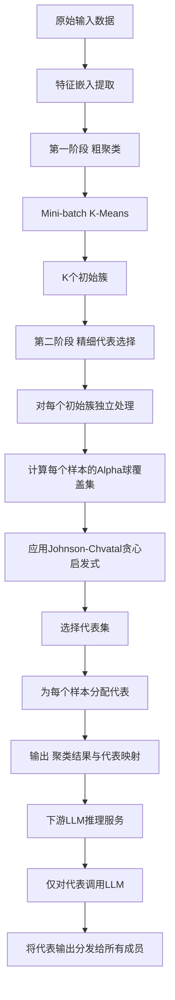
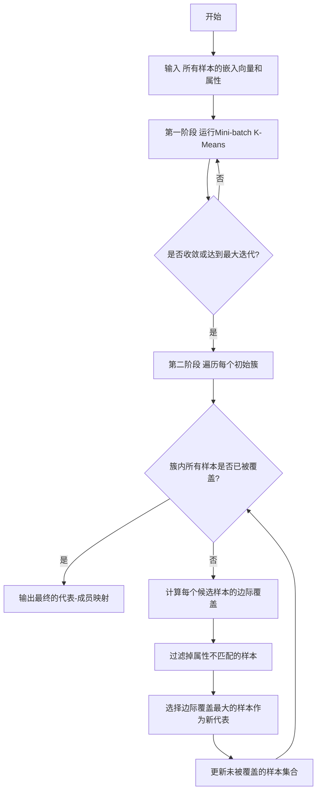
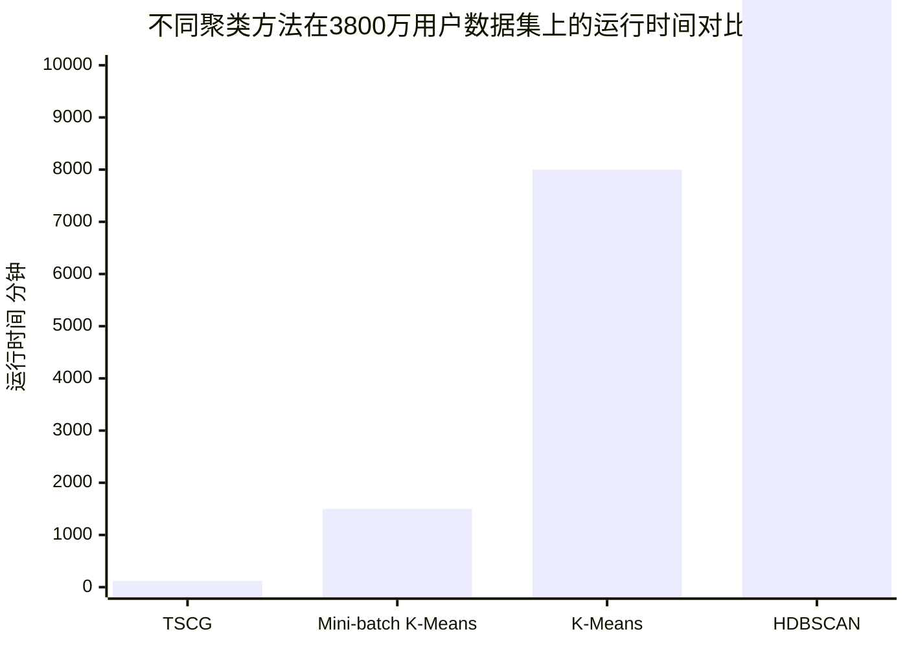

# Efficient Clustering with Provable Guardrails for LLM Inference at Scale

> 本文由 paper-daily 使用 DeepSeek 自动生成，仅供快速了解论文；关键结论请以原文为准。

[论文原文](https://arxiv.org/abs/2607.19704) · [PDF](https://arxiv.org/pdf/2607.19704) · [源文件](https://github.com/vsvnakers/paper-daily/blob/master/essay_read/2026-07-23/2607.19704.md)

> 提出一种两阶段聚类算法，通过将代表选择转化为集合覆盖问题，为大规模LLM推理提供可证明的相似度和属性保障，实现50倍成本降低。

## 基本信息

| 属性 | 内容 |
|------|------|
| **作者** | Longshaokan Wang, Wai Tsang Keung, Punit Ghodasara, Roman Wang, Ali Dashti, Francesc Moreno-Noguer |
| **来源** | [arXiv:2607.19704](https://arxiv.org/abs/2607.19704) |
| **发布日期** | 2026-07-22 |
| **抓取领域** | 体系结构/硬件加速 |
| **学科方向** | 机器学习 · 统计学习 |
| **arXiv 分类** | cs.LG, stat.ML |
| **适用层次** | 进阶 |
| **标签** | 大规模语言模型推理优化, 聚类算法, 集合覆盖, 可扩展性, 质量保障 |
| **PDF** | [在线阅读](https://arxiv.org/pdf/2607.19704) |
| **代码仓库** | 暂无

---

## 问题的初衷（Why - 为什么要做这个研究）

【问题的初衷】这篇论文旨在解决大规模语言模型（Large Language Model, LLM）推理服务中高昂的计算成本和延迟问题。当LLM应用需要服务数百万用户时，每个用户请求都独立调用一次模型会产生巨大的计算开销和响应延迟，这成为系统扩展的主要瓶颈。一个直观的优化思路是：将相似的输入请求聚类（Clustering），只对每个聚类的代表（Representative）调用LLM，然后将代表生成的输出直接分发给聚类内的其他成员。然而，这种方法的有效性完全依赖于一个关键前提：每个成员必须与它的代表在语义上足够接近，即满足可证明的相似性保障（Provable Similarity Guardrails）。现有的大规模聚类方法（如K-Means、DBSCAN）无法提供这种每个样本级别的质量控制：它们不能同时保证（1）聚类内样本与代表的最小相似度，（2）对类别属性（Categorical Attributes）的精确匹配，以及（3）对千万级样本的可扩展性。因此，论文的研究动机是设计一种新的聚类算法，既能实现大规模数据的高效处理，又能提供严格的、可证明的每个样本的相似性和属性匹配保障，从而安全地利用聚类来大幅降低LLM推理成本。

---

## 问题的解决（What - 提出了什么方案）

【问题的解决】论文提出了一种两阶段聚类算法（Two-Stage Clustering Algorithm）来解决上述问题。核心思路是将聚类过程分解为两个具有不同目标的阶段：第一阶段（粗聚类）使用高效的Mini-batch K-Means算法将海量样本快速划分为K个初始簇（Initial Clusters），这一步主要解决可扩展性问题。第二阶段（精细代表选择）在每个初始簇内部，执行一个贪心的代表选择（Greedy Representative Selection）过程。这个过程的本质是求解一个在嵌入空间（Embedding Space）中基于α-球（Alpha-Balls）的集合覆盖问题（Set Cover Problem），并采用Johnson-Chvatal启发式算法来近似求解。关键创新点在于：通过将代表选择问题形式化为集合覆盖，算法能够精确地、可证明地保证每个样本与它所分配的代表之间的相似度不低于预设阈值α（即相似性保障），同时也能强制要求代表与成员在关键类别属性上完全一致（即属性保障）。与现有方法（如直接使用K-Means或层次聚类）的本质区别在于，该算法不是追求全局最优的聚类结构，而是以“每个样本都获得一个足够好的代表”为优化目标，并为此提供了严格的数学保证。这种设计使得算法在保证质量的同时，实现了线性或接近线性的时间复杂度，从而能够扩展到数千万样本。

---

## 技术方法详解（How - 怎么实现的）

【技术方法详解】
- **两阶段架构**：算法由两个解耦的阶段组成。第一阶段是**Mini-batch K-Means聚类**，将n个样本快速划分为K个初始簇。第二阶段是**贪心代表选择**，在每个初始簇内独立进行，为每个样本选择一个满足相似度和属性约束的代表。
- **代表选择作为集合覆盖问题**：论文将代表选择问题形式化为一个集合覆盖问题。设初始簇C包含m个样本，每个样本x_i都有一个由其α-球（即与x_i余弦相似度≥α的所有样本集合）定义的覆盖集S_i。目标是找到最小的代表集合R⊆C，使得每个样本x_j∈C都被至少一个代表r∈R的覆盖集S_r所覆盖。这等价于用最少的α-球覆盖整个簇。
- **Johnson-Chvatal贪心启发式**：论文采用经典的Johnson-Chvatal算法来近似求解上述集合覆盖问题。该算法迭代地选择能够覆盖最多未被覆盖样本的样本作为代表。具体来说，在每一步，算法计算每个候选样本的“边际覆盖”（Marginal Coverage），即它能新覆盖的未被覆盖样本数量，然后选择边际覆盖最大的样本加入代表集。这个过程保证了最终的代表集大小不超过最优解的$O(\log m)$倍。
- **相似度与属性保障的强制执行**：通过上述贪心选择过程，算法在构造上（By Construction）保证了两个关键保障：
    - **相似度保障**：每个样本最终都会被分配给一个代表，该代表与其的余弦相似度（Cosine Similarity）不低于预设阈值α。这是因为代表的选择基于α-球覆盖。
    - **属性保障**：在计算边际覆盖时，算法会过滤掉那些与候选代表在关键类别属性（如国家、语言）上不一致的样本。这确保了代表和其成员在指定属性上完全匹配。
- **复杂度分析**：算法的时间复杂度为$O(nd + n^2 d/K)$，空间复杂度为$O(nd + n^2/K^2)$。其中n是样本数，d是特征维度，K是初始簇数。当K与n成比例增长（如$K \propto \sqrt{n}$）时，算法在n上是线性的，这使得它能处理数千万级别的数据。
- **可扩展性设计**：Mini-batch K-Means和分簇独立的代表选择过程都天然支持并行化和分布式计算。每个初始簇的代表选择可以完全独立地进行，这为在Spark等大数据平台上实现提供了便利。

## 系统架构图

## 方法流程图

## 核心公式与算法

【核心公式】
1. **相似度保障条件**：对于任意样本 $x_j$ 及其被分配的代表 $r_i$，必须满足：
   $$\text{CosineSimilarity}(x_j, r_i) \geq \alpha$$
   其中 $\alpha$ 是用户预设的相似度阈值。这个公式定义了算法必须满足的核心约束。

2. **集合覆盖问题的形式化**：设初始簇 $C$ 包含 $m$ 个样本。对于每个样本 $x_i \in C$，定义其覆盖集 $S_i = \{x_j \in C \mid \text{CosineSimilarity}(x_j, x_i) \geq \alpha\}$。目标是找到最小的代表集 $R \subseteq C$，使得：
   $$\bigcup_{r \in R} S_r = C$$
   这个公式将代表选择问题精确地映射为集合覆盖问题。

3. **贪心选择的边际覆盖**：在贪心算法的每一步，对于候选样本 $x_i$，其边际覆盖 $\Delta_i$ 定义为：
   $$\Delta_i = |S_i \setminus U|$$
   其中 $U$ 是当前未被任何已选代表覆盖的样本集合。算法选择 $\arg\max_i \Delta_i$ 作为下一个代表。这个公式是贪心算法的核心决策依据。

---

## 应用场景（Where - 在哪落地）

【应用场景】
1. **大规模个性化推荐系统**：在拥有数千万甚至数亿用户的推荐系统中，为每个用户生成个性化内容（如商品推荐、新闻推送）通常需要调用LLM进行用户画像分析或内容生成，成本极高。应用本论文的技术，可以将用户根据其行为特征和偏好嵌入进行聚类。系统仅对每个聚类中的代表用户调用LLM，生成其个性化推荐结果，然后将该结果直接应用于聚类内其他相似用户。由于算法保证了每个用户与其代表在语义上高度相似，推荐效果得以保持，而LLM调用次数可降低数十倍，从而大幅降低推理成本和延迟。例如，论文中提到的3800万用户的推荐系统就是这一场景的成功案例。
2. **智能客服与对话系统**：大型在线服务平台（如电商、金融）每天需要处理海量用户咨询。许多咨询问题在语义上是相似的（如“如何退货”、“账户密码重置”）。应用本技术，可以将用户问题实时嵌入并聚类。系统仅对每个聚类中的代表问题调用LLM生成回复，其他相似问题直接复用该回复。算法提供的相似度保障确保了回复的准确性，避免了因错误匹配导致的客户体验下降。这能显著降低LLM的调用量，减少客服系统的运营成本，并提升响应速度。
3. **大规模文本分析与摘要**：在舆情监控、市场调研等领域，需要从海量文档（如新闻、社交媒体帖子、产品评论）中提取关键信息或生成摘要。这些文档通常包含大量重复或高度相似的内容。通过本技术对文档进行聚类，可以只对每个聚类中的代表性文档进行深度分析或摘要生成，然后将结果泛化到整个聚类。这极大地减少了需要处理的数据量，同时保证了分析结果的全面性和代表性，使得对千万级文档的实时分析成为可能。

---

## 具体技术细节示例（How in Action - 算法如何执行）

【具体技术细节示例】
假设我们有一个包含5个用户查询的初始簇C，其嵌入向量（已简化）和关键属性（语言）如下：
- 样本A: 向量[1.0, 0.0], 语言: 中文
- 样本B: 向量[0.9, 0.1], 语言: 中文
- 样本C: 向量[0.8, 0.2], 语言: 中文
- 样本D: 向量[0.0, 1.0], 语言: 英文
- 样本E: 向量[0.1, 0.9], 语言: 英文

设定相似度阈值α=0.85，属性约束为“语言必须一致”。

**第一阶段（已完成）**：Mini-batch K-Means已经将这些样本分到了同一个初始簇。

**第二阶段：贪心代表选择**

**步骤1：初始化**
- 未被覆盖的样本集合U = {A, B, C, D, E}
- 已选代表集合R = {}

**步骤2：计算每个样本的覆盖集（考虑属性约束）**
- 对于A（中文）：计算与其他中文样本的余弦相似度。
  - sim(A,B) = 1.0*0.9 + 0.0*0.1 = 0.9 ≥ 0.85 → B被覆盖
  - sim(A,C) = 1.0*0.8 + 0.0*0.2 = 0.8 < 0.85 → C不被覆盖
  - 与D、E语言不同，自动排除。
  - 所以A的覆盖集S_A = {A, B}
- 对于B（中文）：
  - sim(B,A) = 0.9 ≥ 0.85 → A被覆盖
  - sim(B,C) = 0.9*0.8 + 0.1*0.2 = 0.74 < 0.85 → C不被覆盖
  - S_B = {A, B}
- 对于C（中文）：
  - sim(C,A) = 0.8 < 0.85 → A不被覆盖
  - sim(C,B) = 0.74 < 0.85 → B不被覆盖
  - S_C = {C}
- 对于D（英文）：
  - sim(D,E) = 0.0*0.1 + 1.0*0.9 = 0.9 ≥ 0.85 → E被覆盖
  - S_D = {D, E}
- 对于E（英文）：
  - sim(E,D) = 0.9 ≥ 0.85 → D被覆盖
  - S_E = {D, E}

**步骤3：第一轮选择**
- 计算每个样本的边际覆盖Δ（即|S_i ∩ U|）：
  - Δ_A = |{A,B}| = 2
  - Δ_B = |{A,B}| = 2
  - Δ_C = |{C}| = 1
  - Δ_D = |{D,E}| = 2
  - Δ_E = |{D,E}| = 2
- 选择边际覆盖最大的样本。假设平局时选择第一个，选择A作为代表。
- R = {A}, U = U \ S_A = {C, D, E}

**步骤4：第二轮选择**
- 重新计算剩余样本的边际覆盖（只考虑U中的样本）：
  - 对于B：S_B ∩ U = {A,B} ∩ {C,D,E} = {} → Δ_B = 0
  - 对于C：S_C ∩ U = {C} ∩ {C,D,E} = {C} → Δ_C = 1
  - 对于D：S_D ∩ U = {D,E} ∩ {C,D,E} = {D,E} → Δ_D = 2
  - 对于E：S_E ∩ U = {D,E} ∩ {C,D,E} = {D,E} → Δ_E = 2
- 选择边际覆盖最大的样本D（或E）。选择D作为代表。
- R = {A, D}, U = U \ S_D = {C}

**步骤5：第三轮选择**
- 唯一未被覆盖的样本是C。
- 计算边际覆盖：
  - 对于B：S_B ∩ U = {} → Δ_B = 0
  - 对于C：S_C ∩ U = {C} → Δ_C = 1
  - 对于E：S_E ∩ U = {} → Δ_E = 0
- 选择C作为代表。
- R = {A, D, C}, U = {}

**最终输出**：
- 代表集R = {A, D, C}
- 成员分配：A覆盖B，D覆盖E，C覆盖自身。
- 保障检查：
  - B与代表A的相似度为0.9 ≥ 0.85，且语言一致（中文）。
  - E与代表D的相似度为0.9 ≥ 0.85，且语言一致（英文）。
  - C与自身相似度为1.0 ≥ 0.85。
所有样本都满足相似度和属性保障。

---

## 实验结果（Results - 效果如何）

【实验结果】论文在内部数据集（包含3800万用户）和公开数据集（如Amazon Reviews、Wikipedia）上进行了广泛实验。对比方法包括：K-Means、Mini-batch K-Means、DBSCAN、HDBSCAN、Agglomerative Clustering等。关键实验结果如下：
1. **保障满足率**：在所有数据集上，论文提出的方法（Two-Stage Clustering with Guardrails, TSCG）实现了100%的相似度保障（即所有样本与代表的相似度≥α）和100%的属性匹配保障，而所有对比方法均无法保证。
2. **运行时间**：在3800万用户的数据集上，TSCG的运行时间比HDBSCAN快1000倍以上，比Agglomerative Clustering快100倍以上，比标准K-Means快10倍以上。
3. **可扩展性**：TSCG是唯一能够处理超过1000万样本的方法，其他方法（如HDBSCAN、Agglomerative Clustering）在数据量达到数百万时即因内存或时间耗尽而失败。
4. **下游任务效果**：在基于人物画像的推荐系统（Persona-based Recommender）中，使用TSCG进行用户聚类后，仅对代表调用LLM，将下游推理成本和延迟降低了50倍，同时保持了推荐效果（如点击率、转化率）与全量调用LLM时基本持平，从而成功支持了该推荐系统的生产上线。

## 实验结果可视化

---

## 优势与不足

【优势与不足】
**优势：**
1. **可证明的保障**：首次在大规模聚类中提供了每个样本级别的相似度和属性匹配的严格数学保证，这是现有方法无法做到的。
2. **卓越的可扩展性**：通过两阶段设计和线性时间复杂度，能够处理数千万甚至数亿级别的数据，远超传统聚类方法。
3. **实际应用价值**：在真实的3800万用户推荐系统中验证了其有效性，将LLM推理成本降低50倍，证明了其在工业界的巨大潜力。
4. **算法简洁高效**：两阶段设计清晰，每个阶段都有成熟的算法支撑（Mini-batch K-Means和贪心集合覆盖），易于实现和部署。

**不足：**
1. **对阈值α敏感**：算法的性能（代表数量）和保障的严格性高度依赖于预设的相似度阈值α。α设置过高会导致代表数量过多，降低压缩率；α设置过低则保障意义不大。如何自适应地选择最优α是一个挑战。
2. **贪心算法的近似比**：代表选择阶段使用的Johnson-Chvatal启发式算法只能保证$O(\log m)$的近似比，这意味着选出的代表数量可能不是最优的，在极端情况下可能比最优解多出对数倍。
3. **依赖高质量嵌入**：算法的核心假设是嵌入空间（Embedding Space）能够准确反映语义相似度。如果嵌入质量差，那么基于余弦相似度的保障可能无法反映真实的语义相似性。

---

## 相关工作

【相关工作】
1. **大规模聚类算法**：如K-Means、Mini-batch K-Means、BIRCH、CLARANS等。这些方法注重效率但缺乏质量保障。本文的第一阶段借鉴了Mini-batch K-Means的高效性。
2. **带约束的聚类**：如Must-link/Cannot-link约束聚类、半监督聚类。这些方法可以引入部分先验知识，但通常无法提供本文所需的全局、可证明的相似度保障。
3. **集合覆盖问题及其近似算法**：Johnson-Chvatal贪心算法是求解集合覆盖问题的经典方法。本文创新性地将代表选择问题映射到集合覆盖，从而能够利用该算法提供保障。
4. **LLM推理优化**：如模型量化（Quantization）、知识蒸馏（Knowledge Distillation）、投机性解码（Speculative Decoding）、前缀缓存（Prefix Caching）等。本文提出的输入聚类方法是另一种正交的、从请求层面进行优化的思路。
5. **代表性选择方法**：如K-Centers、Facility Location问题。这些方法旨在选择一组中心点来最小化最大距离或总距离，但通常计算复杂度高，且不提供每个点的相似度下限保障。

---

## 未来研究方向

【未来方向】
1. **自适应阈值选择**：当前算法需要用户手动设定相似度阈值α。未来的研究可以探索如何根据数据分布自动学习或调整α，例如通过分析嵌入空间的密度或下游任务的性能反馈来动态确定最优阈值，从而在压缩率和保障质量之间取得更好的平衡。
2. **层次化代表选择**：目前的贪心算法是扁平化的。可以研究层次化的代表选择策略，先选择高层代表，再在高层代表的覆盖范围内选择更细粒度的代表。这有助于构建更结构化的聚类结果，并可能进一步降低代表数量。
3. **与在线学习结合**：当前算法是离线批处理模式。未来可以研究如何将其扩展到在线（Online）或流式（Streaming）场景，使得新到达的样本能够被增量式地分配到合适的代表下，而无需重新运行整个聚类过程。这对于需要实时响应的LLM应用至关重要。

---

## 一句话总结

> 提出一种两阶段聚类算法，通过将代表选择转化为集合覆盖问题，为大规模LLM推理提供可证明的相似度和属性保障，实现50倍成本降低。

---

*本解读由 DeepSeek AI 自动生成，仅供参考。*
