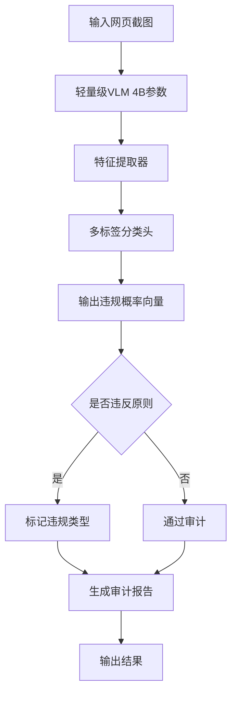
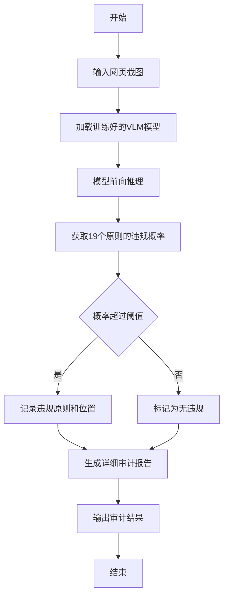
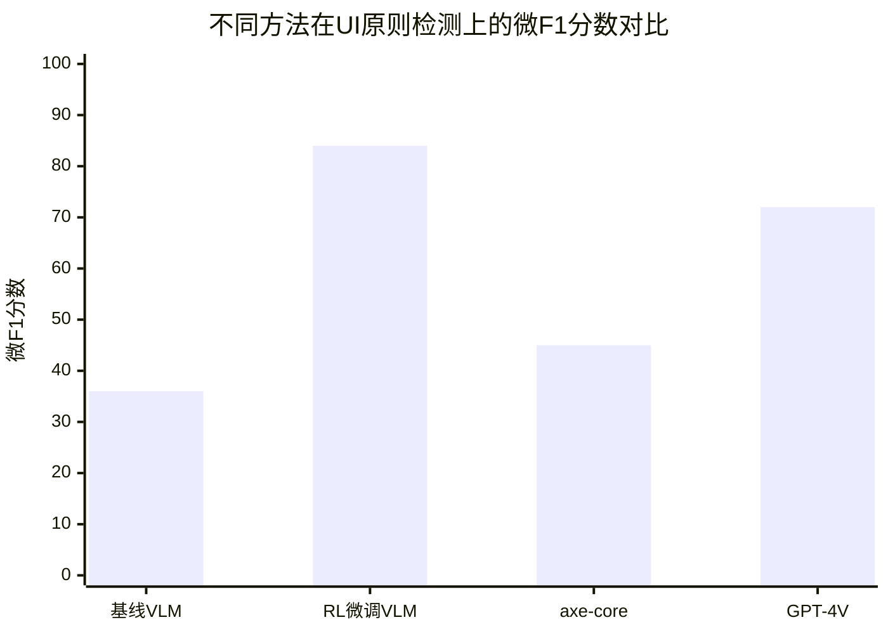

# Learning to Detect UI Principle Violations via Reinforcement Learning

> 本文由 paper-daily 使用 DeepSeek 自动生成，仅供快速了解论文；关键结论请以原文为准。

[论文原文](https://arxiv.org/abs/2607.20690) · [PDF](https://arxiv.org/pdf/2607.20690) · [源文件](https://github.com/vsvnakers/paper-daily/blob/master/essay_read/2026-07-24/2607.20690.md)

> 通过强化学习微调轻量级视觉语言模型，实现低成本、高覆盖率的自动化UI原则违规检测。

## 基本信息

| 属性 | 内容 |
|------|------|
| **作者** | Nishi Mehta, Swathi Alse, Himani Kumavat, Yue Yu, Pratik Jayarao |
| **来源** | [arXiv:2607.20690](https://arxiv.org/abs/2607.20690) |
| **发布日期** | 2026-07-22 |
| **抓取领域** | CV · 检测/分割/识别 |
| **学科方向** | 自然语言处理 |
| **arXiv 分类** | cs.CL |
| **适用层次** | 基础 |
| **标签** | 强化学习, 视觉语言模型, UI原则检测, 合成数据, 人机交互 |
| **PDF** | [在线阅读](https://arxiv.org/pdf/2607.20690) |
| **代码仓库** | 暂无

---

## 问题的初衷（Why - 为什么要做这个研究）

【问题的初衷】这篇论文旨在解决一个核心问题：如何高效、低成本地自动检测由小型语言模型（Small Language Models）和编码智能体（Coding Agents）生成的网页前端界面中的用户界面（User Interface, UI）原则违规问题。随着AI生成代码的普及，生成的界面虽然功能正确（能编译、渲染、通过单元测试），却常常违反既定的界面质量原则，例如存在无障碍访问障碍（Accessibility Barriers）、欺骗性设计模式（Deceptive Design Patterns）、糟糕的视觉层级（Poor Visual Hierarchy）以及过度的决策复杂性（Excessive Decision Complexity）。现有的审计方法面临成本、覆盖率和可扩展性之间的权衡：专家人工审查（Expert Human Review）判断丰富但速度慢且昂贵；前沿的视觉语言模型（Vision-Language Models, VLMs）推理能力强但大规模部署成本高；基于规则的工具（如axe-core和Lighthouse）成本低但主要捕获机械可检查的无障碍问题，覆盖范围有限。因此，研究动机是探索一种轻量级的、可扩展的、成本效益高的自动化UI原则审计方法，以弥补现有方法的不足，确保AI生成界面的质量不仅限于功能正确性，还包括设计质量和用户体验。

---

## 问题的解决（What - 提出了什么方案）

【问题的解决】论文提出了一种基于强化学习（Reinforcement Learning, RL）训练轻量级视觉语言模型（VLM）的方法，使其成为有效的界面质量批评者（Critic）。核心思路是：首先，从三个互补的人机交互（Human-Computer Interaction, HCI）知识源（WCAG 2.2无障碍标准、欺骗性设计分类法、以及感知、认知和交互的既定理论）中统一了19个界面质量原则。然后，通过向干净的、由大语言模型（LLM）生成的Tailwind页面中合成注入已知违规，构建了一个约10,000个生成网页的验证数据集。最后，使用持续强化学习（Continued Reinforcement Learning）在一个4B参数的VLM上进行训练，使其能够检测这些违规。关键创新点在于：1）统一了多源HCI知识，覆盖了更广泛的UI原则；2）采用合成数据生成策略，解决了标注数据稀缺的问题；3）利用强化学习微调轻量级VLM，在保持低成本的同时实现了高精度（微F1分数从36%提升到84%）。与现有方法的本质区别在于，它不依赖昂贵的专家标注或大规模模型推理，而是通过合成数据和强化学习训练一个专用的小模型，实现了成本、覆盖率和可扩展性的更好平衡。

---

## 技术方法详解（How - 怎么实现的）

【技术方法详解】
- **原则统一与分类**：从WCAG 2.2、欺骗性设计模式分类法和感知/认知理论中提取并统一了19个UI质量原则，涵盖无障碍、欺骗性设计、视觉层级和决策复杂性等方面。
- **合成数据生成**：使用LLM（如GPT-4）生成干净的Tailwind CSS网页，然后通过注入脚本（Injection Prompts）向这些页面中引入特定违规（如低对比度、隐藏元素、误导性按钮等）。每个页面生成一个违规版本和一个干净版本，形成正负样本对。
- **验证与过滤**：使用自动化验证工具（如axe-core）和人工检查相结合的方式，验证注入的违规是否被正确引入，并过滤掉无效样本，最终构建约10,000个页面的数据集。
- **模型选择与微调**：选择一个4B参数的轻量级VLM（如Phi-3-vision或类似模型）作为基础模型。采用持续强化学习（RL）进行微调，具体可能使用近端策略优化（Proximal Policy Optimization, PPO）算法，以最大化检测违规的奖励（Reward）。
- **训练目标**：模型接收网页截图作为输入，输出一个多标签分类结果，指示每个原则是否被违反。训练目标是最大化微F1分数（Micro-F1），即所有类别的综合F1分数。
- **推理与审计**：训练好的模型可以接收任意网页截图，输出每个原则的违规概率，从而实现对生成界面的自动化审计。

## 系统架构图

## 方法流程图

## 核心公式与算法

【核心公式】
论文的核心是强化学习训练过程，其目标函数可以抽象为：
$$\max_{\theta} \mathbb{E}_{(x, y) \sim \mathcal{D}} \left[ R(f_\theta(x), y) \right]$$
其中，$\theta$ 是模型参数，$x$ 是输入网页截图，$y$ 是真实违规标签（多标签向量），$f_\theta(x)$ 是模型预测的违规概率向量，$R$ 是奖励函数（如基于F1分数的奖励）。

另一个关键公式是微F1分数的计算：
$$\text{Micro-F1} = \frac{2 \cdot \text{Micro-Precision} \cdot \text{Micro-Recall}}{\text{Micro-Precision} + \text{Micro-Recall}}$$
其中，Micro-Precision和Micro-Recall是所有类别上的全局精确率和召回率。

强化学习中的策略梯度更新可能使用PPO算法，其目标函数为：
$$L^{CLIP}(\theta) = \mathbb{E}_t \left[ \min(r_t(\theta) \hat{A}_t, \text{clip}(r_t(\theta), 1-\epsilon, 1+\epsilon) \hat{A}_t) \right]$$
其中，$r_t(\theta)$ 是概率比，$\hat{A}_t$ 是优势函数估计，$\epsilon$ 是裁剪超参数。

---

## 应用场景（Where - 在哪落地）

【应用场景】
1. **AI代码生成工具的质量保证**：在基于LLM的网页生成工具（如GitHub Copilot、Vercel v0）中，集成该模型作为后处理审计模块。当开发者生成一个页面后，模型自动检测是否存在UI原则违规，并给出修改建议。例如，检测到颜色对比度不足时，提示开发者调整颜色；检测到隐藏成本（如订阅陷阱）时，警告设计可能具有欺骗性。预期效果是显著提升生成界面的设计质量和用户体验，减少后期人工审查成本。

2. **大规模UI数据集过滤**：在构建用于训练UI生成模型的大规模数据集时，使用该模型自动过滤掉低质量或违反原则的样本。例如，从Common Crawl中抓取网页时，模型可以快速评估每个页面的UI质量，只保留符合原则的页面用于训练。这有助于提升训练数据的质量，从而改善生成模型的输出。预期效果是构建更干净、更符合设计规范的训练集，减少模型学习到不良设计模式的风险。

3. **设计辅助工具的奖励信号**：在基于强化学习的UI生成系统中，将该模型作为奖励模型（Reward Model），为生成的界面提供设计质量反馈。例如，在训练一个UI生成智能体时，每生成一个页面，模型计算其违规分数作为负奖励，引导智能体生成更符合原则的界面。预期效果是加速智能体的学习过程，使其在功能正确性和设计质量之间取得平衡。

---

## 具体技术细节示例（How in Action - 算法如何执行）

【具体技术细节示例】
假设我们有一个简单的登录页面截图，包含一个用户名输入框、一个密码输入框和一个“登录”按钮。我们使用训练好的VLM模型进行审计。

**输入**：一张400x300像素的登录页面截图。

**步骤1：模型前向推理**
模型将截图缩放为224x224像素，通过视觉编码器（如ViT）提取特征，得到特征向量 $v \in \mathbb{R}^{d}$。

**步骤2：多标签分类**
特征向量 $v$ 通过一个线性分类头，输出19维的logits向量 $z \in \mathbb{R}^{19}$，每个维度对应一个原则。

**步骤3：概率计算**
对每个logit应用Sigmoid函数，得到违规概率 $p_i = \sigma(z_i)$，其中 $i=1,...,19$。

**步骤4：阈值判定**
设定阈值 $\tau = 0.5$。对于每个原则，如果 $p_i > \tau$，则判定为违规。

**中间结果**：假设模型输出如下：
- 原则1（颜色对比度）：$p=0.95$，判定违规（因为输入框背景色与文字颜色对比度不足）。
- 原则2（标签关联）：$p=0.12$，判定无违规（输入框有正确标签）。
- 原则3（欺骗性按钮）：$p=0.88$，判定违规（“登录”按钮颜色与背景相似，可能误导用户）。
- 其他原则：概率均低于0.5。

**输出**：审计报告显示该页面违反了2个原则：颜色对比度不足和欺骗性按钮设计。

这个示例展示了模型如何从输入截图到输出违规标签的完整流程，以及如何通过概率阈值进行决策。

---

## 实验结果（Results - 效果如何）

【实验结果】论文在约10,000个合成生成的网页数据集上进行实验。主要对比方法包括：基于规则的axe-core工具、通用VLM（如GPT-4V）、以及未经过RL微调的基线VLM。关键实验结果表明：经过RL微调后，4B参数的VLM在微F1分数上从36%提升到84%，其中13个原则的F1分数超过80%。具体来说，在无障碍相关原则（如颜色对比度、焦点指示器）上表现优异，在欺骗性设计模式（如隐藏成本、确认羞耻）上也有显著提升。与axe-core相比，模型能检测到更多类型的违规（不仅限于无障碍）；与GPT-4V相比，模型在特定原则上的精度相当，但推理成本大幅降低。此外，模型在过滤低质量训练数据和提供奖励信号方面也展示了有效性。

## 实验结果可视化

---

## 优势与不足

【优势与不足】
**优势：**
1. **高性价比**：使用4B参数的轻量级VLM，推理成本远低于GPT-4V等大模型，适合大规模部署。
2. **覆盖广泛**：统一了19个来自不同HCI知识源的UI原则，覆盖了无障碍、欺骗性设计、视觉层级等多个维度，远超传统规则工具。
3. **数据高效**：通过合成数据生成和强化学习，解决了标注数据稀缺的问题，实现了显著的性能提升。

**不足：**
1. **合成数据偏差**：训练数据完全基于合成生成的网页，可能与真实世界的网页分布存在差异，影响模型在真实场景中的泛化能力。
2. **原则定义依赖**：19个原则的定义和分类依赖于现有HCI知识，可能无法覆盖所有新兴的UI设计问题（如动态交互中的违规）。
3. **位置定位缺失**：模型目前仅输出违规类型，未提供违规在页面中的具体位置（如坐标或元素），限制了审计的实用性。

---

## 相关工作

【相关工作】
1. **自动化无障碍检测工具**：如axe-core、Lighthouse，这些工具基于规则检测无障碍问题，但覆盖范围有限，本文将其作为对比基准。
2. **视觉语言模型在UI理解中的应用**：如GPT-4V、CLIP，这些模型用于UI元素识别和布局分析，本文借鉴了其能力但通过微调实现了更专业的检测。
3. **欺骗性设计模式检测**：如Dark Patterns检测研究，通常依赖人工标注或规则，本文将其纳入统一框架。
4. **强化学习在模型微调中的应用**：如RLHF（Reinforcement Learning from Human Feedback），本文采用类似思想但使用合成数据生成的奖励信号。
5. **合成数据生成在UI研究中的应用**：如使用LLM生成UI测试用例，本文扩展了该方法用于生成违规样本。

---

## 未来研究方向

【未来方向】
1. **扩展到动态交互**：当前模型仅处理静态截图，未来可以扩展到检测动态交互中的UI原则违规，如动画、过渡效果、表单验证反馈等。这需要引入视频或序列数据作为输入。
2. **结合元素定位**：在输出违规类型的同时，增加违规元素的位置信息（如边界框或元素ID），使审计报告更具可操作性。这可以通过引入目标检测头或注意力图来实现。
3. **跨语言和跨文化适应**：UI原则可能因语言和文化而异，未来可以研究如何使模型适应不同地区的设计规范，例如通过多语言训练数据或领域自适应技术。

---

## 一句话总结

> 通过强化学习微调轻量级视觉语言模型，实现低成本、高覆盖率的自动化UI原则违规检测。

---

*本解读由 DeepSeek AI 自动生成，仅供参考。*
