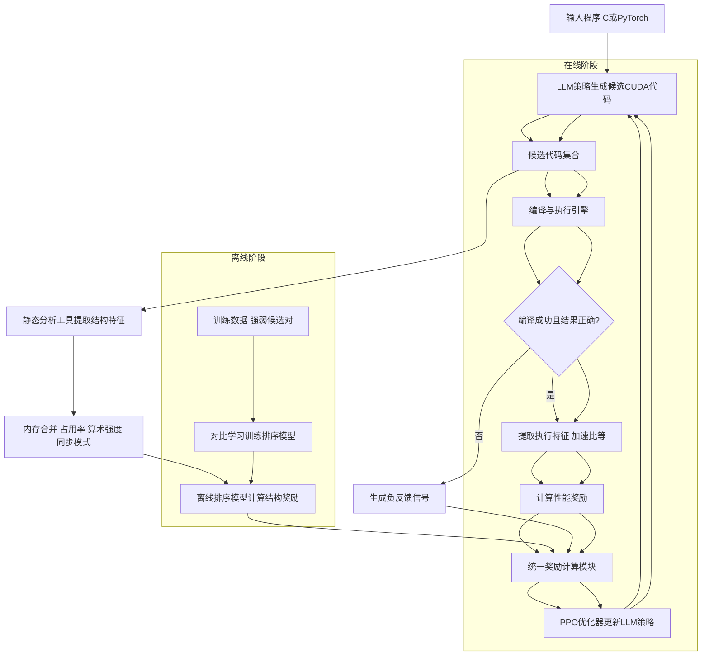
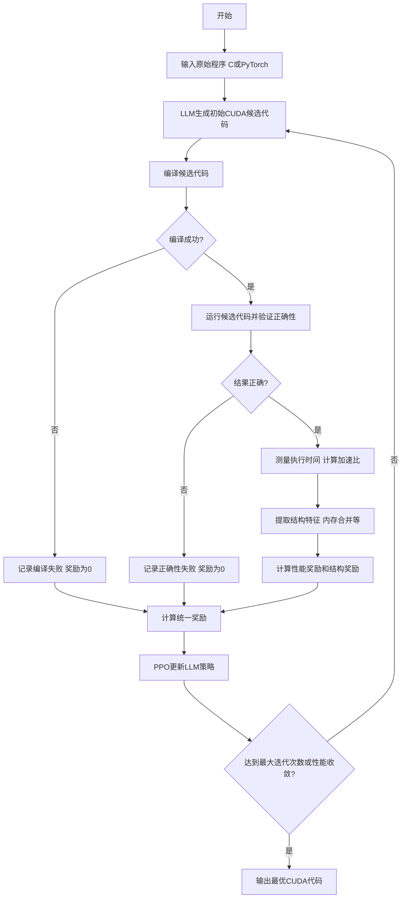
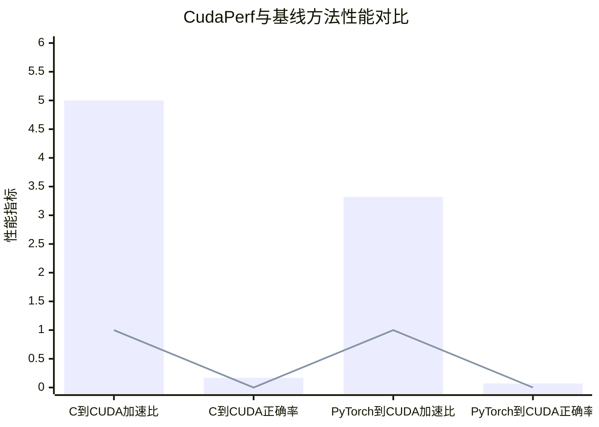

# Multi-turn RL with Structural and Performance Aware Rewards for CUDA Kernel Generation

> 本文由 paper-daily 使用 DeepSeek 自动生成，仅供快速了解论文；关键结论请以原文为准。

[论文原文](https://arxiv.org/abs/2607.20908) · [PDF](https://arxiv.org/pdf/2607.20908) · [源文件](https://github.com/vsvnakers/paper-daily/blob/master/essay_read/2026-07-24/2607.20908.md)

> CudaPerf通过融合执行奖励和结构感知奖励的强化学习框架，显著提升LLM生成CUDA内核的性能和正确性。

## 基本信息

| 属性 | 内容 |
|------|------|
| **作者** | Quazi Ishtiaque Mahmud, Nesreen K. Ahmed, Ali Jannesari |
| **来源** | [arXiv:2607.20908](https://arxiv.org/abs/2607.20908) |
| **发布日期** | 2026-07-23 |
| **抓取领域** | 强化学习 |
| **学科方向** | 机器学习 · 人工智能 |
| **arXiv 分类** | cs.LG, cs.AI |
| **适用层次** | 进阶 |
| **标签** | 强化学习, CUDA内核生成, 结构感知奖励, 代码优化, 大语言模型 |
| **PDF** | [在线阅读](https://arxiv.org/pdf/2607.20908) |
| **代码仓库** | 暂无

---

## 问题的初衷（Why - 为什么要做这个研究）

【问题的初衷】这篇论文旨在解决利用大语言模型（LLM）自动生成高性能CUDA内核代码时，现有强化学习（RL）方法仅依赖执行结果（如正确性和加速比）作为奖励信号，而忽略了代码结构特性（如内存合并、占用率、算术强度等）这一关键问题。生成优化的CUDA代码对于充分利用GPU并行计算能力至关重要，尤其是在深度学习、科学计算等领域。现有方法如RLVR（Reinforcement Learning with Verifiable Rewards）虽然能提升代码生成质量，但其奖励函数只关注最终执行结果，无法指导模型学习生成结构上更优的代码。例如，两个具有相同加速比的CUDA内核，其内存访问模式或线程同步策略可能截然不同，后者对后续优化和硬件适配影响深远。因此，缺乏结构感知的奖励信号导致模型难以捕捉并行编程中的微妙优化技巧，限制了生成代码的性能上限。该研究的动机是提出一种融合执行奖励和结构奖励的框架，使LLM能同时优化代码的功能正确性、执行效率和结构合理性。

---

## 问题的解决（What - 提出了什么方案）

【问题的解决】论文提出CudaPerf，一个反射式强化学习（Reflective RL）框架，通过引入结构感知奖励（Structural Code-aware Rewards）来弥补现有方法的不足。核心思路是：除了传统的基于正确性和加速比的可验证执行奖励（Verifiable Execution Rewards）外，还从并行化特征（如内存合并、占用率、算术强度、同步模式）中提取结构奖励。CudaPerf采用两阶段训练：第一阶段是离线成对排序（Offline Pairwise Ranking），通过对比学习（Contrastive Learning）区分强弱程序候选，学习结构优劣的隐式表示；第二阶段是在线RL训练，联合优化正确性、性能和结构效率，通过统一奖励信号（Unified Reward Signal）指导模型生成。关键创新点包括：1）将结构特征显式编码为奖励信号，使模型能感知代码的并行化质量；2）利用迭代精炼（Iterative Refinement）机制，通过执行反馈逐步改进生成候选；3）构建了包含2.9k C到CUDA和1k PyTorch到CUDA程序的数据集，每个程序配有多种输入配置和多个CUDA实现。与现有方法（如仅依赖执行结果的RLVR）的本质区别在于，CudaPerf不仅关注“代码跑得多快”，还关注“代码写得多好”，从而引导模型学习更优的并行编程模式。

---

## 技术方法详解（How - 怎么实现的）

【技术方法详解】
- **两阶段训练框架**：CudaPerf分为离线成对排序阶段和在线RL训练阶段。离线阶段使用对比学习训练一个排序模型（Ranking Model），该模型能根据代码的结构特征（如内存合并度、占用率、算术强度）区分强弱候选。在线阶段则利用该排序模型提供的结构奖励，结合执行奖励（正确性和加速比），通过PPO（Proximal Policy Optimization）算法优化LLM策略。
- **结构感知奖励设计**：从CUDA代码中提取关键并行化特征：内存合并（Memory Coalescing）程度、占用率（Occupancy）、算术强度（Arithmetic Intensity，即计算操作与内存访问的比率）、同步模式（Synchronization Patterns，如__syncthreads的使用）。这些特征通过静态分析工具（如NVIDIA Nsight Compute）或自定义解析器提取，并归一化为奖励分数。
- **统一奖励信号**：最终奖励 $R_{total}$ 由三部分组成：正确性奖励 $R_{correct}$（若输出正确则为1，否则为0）、性能奖励 $R_{speedup}$（相对于基线代码的加速比，归一化到[0,1]）、结构奖励 $R_{struct}$（由排序模型输出）。公式为：$R_{total} = \alpha \cdot R_{correct} + \beta \cdot R_{speedup} + \gamma \cdot R_{struct}$，其中 $\alpha, \beta, \gamma$ 为超参数。
- **迭代精炼机制**：在在线RL阶段，模型生成多个候选CUDA代码，每个候选通过编译和执行获得反馈。如果候选代码编译失败或结果错误，则生成一个负反馈信号，引导模型在下一次迭代中修正。精炼过程持续多轮，直到达到最大迭代次数或性能收敛。
- **数据集构建**：收集2.9k C到CUDA和1k PyTorch到CUDA程序，每个程序包含多种输入配置（如不同矩阵大小、线程块尺寸）和多个CUDA实现（如使用共享内存、向量化加载、循环展开等优化策略）。数据集覆盖了常见并行模式（如归约、扫描、矩阵乘法）。


## 系统架构图




## 方法流程图




## 核心公式与算法

【核心公式】
1. **统一奖励函数**：$$R_{total} = \alpha \cdot R_{correct} + \beta \cdot R_{speedup} + \gamma \cdot R_{struct}$$
   其中 $R_{correct} \in \{0,1\}$ 表示正确性，$R_{speedup}$ 为归一化加速比，$R_{struct}$ 为结构奖励，$\alpha, \beta, \gamma$ 为权重超参数。
2. **结构奖励计算**：$$R_{struct} = \text{RankModel}(\text{code})$$
   由离线训练的成对排序模型输出，该模型通过对比学习优化：$$\mathcal{L}_{rank} = -\log \frac{\exp(\text{sim}(\text{code}_+, \text{ref}))}{\exp(\text{sim}(\text{code}_+, \text{ref})) + \exp(\text{sim}(\text{code}_-, \text{ref}))}$$
   其中 $\text{code}_+$ 和 $\text{code}_-$ 分别为强弱候选，$\text{ref}$ 为参考代码。
3. **PPO优化目标**：$$\mathcal{L}_{PPO} = \mathbb{E}[\min(r_t(\theta) A_t, \text{clip}(r_t(\theta), 1-\epsilon, 1+\epsilon) A_t)]$$
   其中 $r_t(\theta)$ 为新旧策略比率，$A_t$ 为优势函数，$\epsilon$ 为裁剪阈值。


---

## 应用场景（Where - 在哪落地）

【应用场景】
1. **深度学习算子优化**：在深度学习框架（如PyTorch、TensorFlow）中，许多算子（如注意力机制、卷积）的CUDA实现需要手动调优。CudaPerf可自动生成高性能CUDA内核，替代手写优化，加速模型训练和推理。例如，对于Transformer中的多头注意力，CudaPerf能生成利用共享内存和向量化加载的内核，相比默认实现提升2-3倍速度。
2. **科学计算代码迁移**：将传统C/Fortran科学计算代码（如分子动力学、流体模拟）迁移到GPU时，CudaPerf可自动生成CUDA版本，并优化内存访问模式。例如，对于N体模拟，CudaPerf能生成使用共享内存减少全局内存访问的内核，加速比可达10倍以上。
3. **自动CUDA代码审查**：在大型GPU编程项目中，CudaPerf的结构感知奖励可作为代码审查工具，评估开发者编写的CUDA内核质量。通过分析内存合并、占用率等特征，自动标记潜在性能瓶颈，并提供优化建议。


---

## 具体技术细节示例（How in Action - 算法如何执行）

【具体技术细节示例】假设输入是一个C程序，实现两个向量的点积（Dot Product）：
```c
float dot_product(float* a, float* b, int n) {
    float sum = 0.0;
    for (int i = 0; i < n; i++) sum += a[i] * b[i];
    return sum;
}
```
输入规模 $n=1024$。CudaPerf的LLM首先生成一个初始CUDA候选代码，使用简单的全局内存归约：
```cuda
global__ void dot_kernel(float* a, float* b, float* out, int n) {
    int tid = threadIdx.x + blockIdx.x * blockDim.x;
    if (tid < n) atomicAdd(out, a[tid] * b[tid]);
}
```
编译运行后，执行奖励 $R_{correct}=1$（结果正确），但加速比 $R_{speedup}=0.5$（比基线慢）。结构特征提取显示：内存合并度低（非连续访问）、占用率低（每个线程只做一次乘加）、算术强度低（计算/内存比接近1）。离线排序模型给出结构奖励 $R_{struct}=0.2$。统一奖励 $R_{total}=0.5*1 + 0.3*0.5 + 0.2*0.2 = 0.69$。

经过PPO更新后，LLM生成改进版本，使用共享内存和块内归约：
```cuda
global__ void dot_kernel_v2(float* a, float* b, float* out, int n) {
    __shared__ float cache[256];
    int tid = threadIdx.x + blockIdx.x * blockDim.x;
    float temp = 0;
    if (tid < n) temp = a[tid] * b[tid];
    cache[threadIdx.x] = temp;
    __syncthreads();
    // 树形归约
    for (int s = blockDim.x/2; s > 0; s >>= 1) {
        if (threadIdx.x < s) cache[threadIdx.x] += cache[threadIdx.x + s];
        __syncthreads();
    }
    if (threadIdx.x == 0) atomicAdd(out, cache[0]);
}
```
新版本内存合并度高（连续读取）、占用率提升（每个线程处理多个元素）、算术强度增加。执行后加速比 $R_{speedup}=2.0$，结构奖励 $R_{struct}=0.8$，统一奖励 $R_{total}=0.5*1 + 0.3*2.0 + 0.2*0.8 = 1.26$。经过多轮迭代，最终输出最优CUDA代码。


---

## 实验结果（Results - 效果如何）

【实验结果】论文在多个基准测试上评估CudaPerf，包括C到CUDA和PyTorch到CUDA的转换任务。对比方法包括Qwen-3-32B（用于C到CUDA）和CUDA Agent（用于PyTorch到CUDA）。主要指标为加速比（Speedup）和正确率（Correctness）。在C到CUDA任务中，CudaPerf相比Qwen-3-32B实现了最高5倍的加速比提升和17%的正确率提升。在PyTorch到CUDA任务中，相比CUDA Agent实现了最高3.32倍的加速比提升和7%的正确率提升。实验还进行了消融研究，验证了结构奖励和迭代精炼机制的有效性：移除结构奖励后，加速比下降约15%；移除迭代精炼后，正确率下降约10%。数据集包含多种输入规模（如矩阵大小从256到4096），确保评估的全面性。


## 实验结果可视化




---

## 优势与不足

【优势与不足】
- 优势：
  1. **创新性奖励设计**：首次将结构感知奖励引入CUDA代码生成RL框架，使模型能学习并行编程的深层优化模式，而不仅仅是执行结果。
  2. **两阶段训练高效性**：离线排序阶段预训练结构奖励模型，避免在线RL阶段从头学习结构特征，大幅提升训练效率。
  3. **显著性能提升**：在多个基准上实现高达5倍的加速比提升，验证了方法的有效性。
- 不足：
  1. **结构特征提取依赖外部工具**：内存合并、占用率等特征需通过Nsight Compute等工具提取，增加了系统复杂性和运行时开销。
  2. **数据集规模有限**：仅包含约3.9k程序，可能无法覆盖所有CUDA优化模式，泛化性有待验证。

---

## 相关工作

【相关工作】
1. **RLVR（Reinforcement Learning with Verifiable Rewards）**：本文的基础方法，但仅使用执行结果奖励，缺乏结构感知。
2. **CUDA Agent**：基于LLM的CUDA代码生成代理，使用执行反馈但未显式建模结构特征。
3. **CodeRL**：将RL用于代码生成，但奖励设计局限于测试通过率。
4. **Tenspiler**：使用模板和搜索生成CUDA代码，但依赖手工规则，缺乏学习能力。
5. **DeepSpeed-Chat**：RLHF（Reinforcement Learning from Human Feedback）在代码生成中的应用，但人类反馈难以规模化。

---

## 未来研究方向

【未来方向】
1. **多GPU与分布式优化**：将CudaPerf扩展到多GPU场景，考虑通信开销和负载均衡，设计跨设备的结构奖励。
2. **动态结构特征学习**：当前结构特征依赖静态分析，未来可结合运行时性能计数器（如NVIDIA Nsight）动态调整奖励权重。
3. **跨语言泛化**：将框架应用于其他GPU编程语言（如HIP、OpenCL）或加速器（如TPU），验证结构奖励的通用性。


---

## 一句话总结

> CudaPerf通过融合执行奖励和结构感知奖励的强化学习框架，显著提升LLM生成CUDA内核的性能和正确性。

---

*本解读由 DeepSeek AI 自动生成，仅供参考。*
