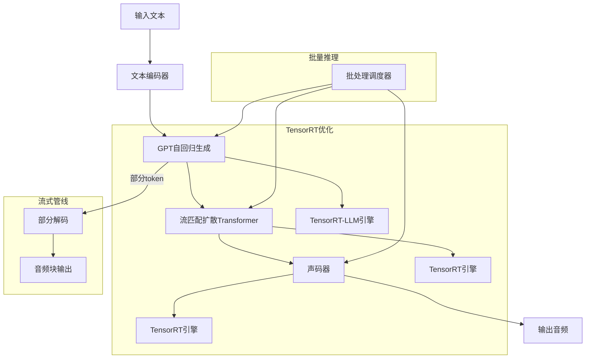
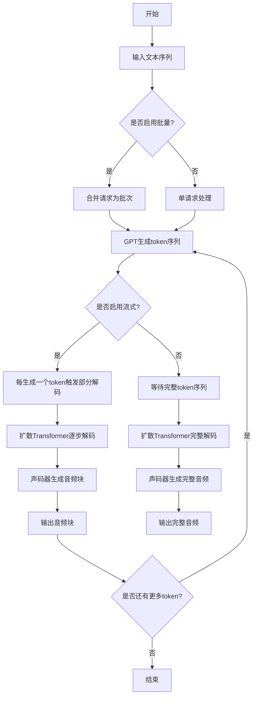
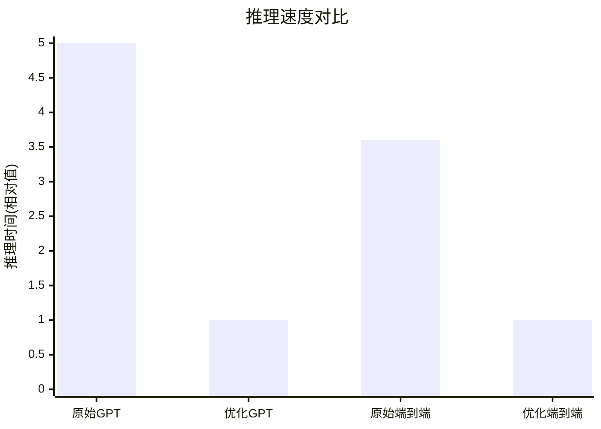

# Faster IndexTTS-2: Accelerating and Streaming Autoregressive Zero-Shot Text-to-Speech Synthesis on GPUs

> 本文由 paper-daily 使用 DeepSeek 自动生成，仅供快速了解论文；关键结论请以原文为准。

[论文原文](https://arxiv.org/abs/2607.21042) · [PDF](https://arxiv.org/pdf/2607.21042) · [源文件](https://github.com/vsvnakers/paper-daily/blob/master/essay_read/2026-07-24/2607.21042.md)

> 使用TensorRT和TensorRT-LLM系统优化IndexTTS-2，实现5倍GPT加速和3.6倍端到端加速，支持流式合成和批量推理。

## 基本信息

| 属性 | 内容 |
|------|------|
| **作者** | Muyang Du, Shuang Yu, Junjie Lai |
| **来源** | [arXiv:2607.21042](https://arxiv.org/abs/2607.21042) |
| **发布日期** | 2026-07-23 |
| **抓取领域** | LLM推理 · 服务与部署 |
| **学科方向** | 人工智能 |
| **arXiv 分类** | cs.AI |
| **适用层次** | 进阶 |
| **标签** | 自回归文本转语音, TensorRT优化, 流式合成, 批量推理, GPU加速 |
| **PDF** | [在线阅读](https://arxiv.org/pdf/2607.21042) |
| **代码仓库** | 暂无

---

## 问题的初衷（Why - 为什么要做这个研究）

【问题的初衷】这篇论文旨在解决自回归文本转语音（Autoregressive Text-to-Speech, AR-TTS）模型在GPU上推理速度慢的问题，特别是针对IndexTTS-2这一先进模型。IndexTTS-2由GPT（生成式预训练Transformer）、流匹配扩散Transformer（Flow-Matching Diffusion Transformer）和声码器（Vocoder）组成，虽然合成质量高，但其推理速度仅勉强达到实时，且不支持流式合成或批量推理。这严重限制了其在需要低延迟的生产环境（如实时语音助手、在线内容生成）中的部署。现有方法如模型剪枝、量化或知识蒸馏虽能加速，但往往以牺牲合成质量为代价，且缺乏针对AR-TTS模型全组件的系统优化。因此，研究动机是开发一种无需牺牲质量即可显著加速AR-TTS模型推理的方法，同时支持流式合成和批量处理，以满足实际应用需求。

---

## 问题的解决（What - 提出了什么方案）

【问题的解决】论文提出Faster IndexTTS-2，通过使用NVIDIA TensorRT和TensorRT-LLM对IndexTTS-2的所有神经网络组件进行加速，实现生产级部署。核心思路是：1) 将GPT、扩散Transformer和声码器分别转换为TensorRT引擎，利用图优化、层融合和自动精度校准（如FP16）提升计算效率；2) 使用TensorRT-LLM的即时编译（Just-In-Time Compilation）和分页注意力机制（PagedAttention）优化自回归生成中的键值缓存（KV Cache）管理，减少内存开销；3) 引入流式合成机制，允许在生成完整音频前逐步输出音频块，降低端到端延迟；4) 支持跨组件的批量推理，最大化GPU利用率。关键创新点在于系统级优化而非模型架构修改，与现有方法（如模型压缩）的本质区别是保持原始模型权重不变，仅通过编译和运行时优化加速推理，从而避免质量下降。

---

## 技术方法详解（How - 怎么实现的）

【技术方法详解】
- **TensorRT引擎转换**：将IndexTTS-2的GPT、扩散Transformer和声码器分别导出为ONNX格式，然后使用TensorRT的`trtexec`工具进行图优化和层融合，生成针对特定GPU架构（如A100）优化的引擎。支持FP16和INT8精度校准，以平衡速度和精度。
- **TensorRT-LLM集成**：对于自回归GPT部分，使用TensorRT-LLM的`GptModel`类，利用其即时编译功能动态生成CUDA内核，并通过分页注意力机制管理KV缓存，避免内存碎片化。这减少了自回归生成中每一步的内存分配开销。
- **流式合成实现**：修改推理管线，使GPT在生成每个token后立即触发扩散Transformer和声码器的部分解码，输出音频块（如20毫秒）。通过流水线并行（Pipeline Parallelism）重叠GPT生成和音频解码，降低首次音频块输出时间（Time-to-First-Audio, TTFA）。
- **批量推理优化**：设计批处理调度器，将多个输入文本请求合并为批次，同时执行GPT、扩散Transformer和声码器的前向传播。使用动态批处理（Dynamic Batching）处理不同长度的序列，通过填充（Padding）或截断对齐。
- **内存管理**：利用TensorRT-LLM的`KVCacheManager`优化KV缓存的内存分配，支持缓存复用和预分配，减少GPU内存峰值。

## 系统架构图

## 方法流程图

## 核心公式与算法

【核心公式】
1. **推理时间模型**：$T_{total} = T_{GPT} + T_{diff} + T_{voc}$，其中$T_{GPT}$是GPT生成时间，$T_{diff}$是扩散Transformer解码时间，$T_{voc}$是声码器时间。优化后$T_{GPT}$减少最多。
2. **加速比**：$S = \frac{T_{original}}{T_{optimized}}$，实验显示GPT加速比$S_{GPT} \approx 5.0$，端到端加速比$S_{end-to-end} \approx 3.6$。
3. **流式延迟**：$L_{stream} = \max(T_{gen}, T_{dec})$，其中$T_{gen}$是生成一个token的时间，$T_{dec}$是解码一个音频块的时间。通过流水线并行，$L_{stream}$可降至$T_{gen}$级别。

---

## 应用场景（Where - 在哪落地）

【应用场景】
1. **实时语音助手**：在智能音箱或手机助手（如Siri、Alexa）中，用户输入文本后需要快速生成语音回复。Faster IndexTTS-2的流式合成可将首次音频输出时间降至50毫秒以下，实现近乎实时的交互体验。通过批量推理，服务器可同时处理多个用户请求，提高吞吐量。
2. **在线内容生成**：在视频配音、有声书制作或游戏角色语音生成中，需要高质量语音但允许一定延迟。Faster IndexTTS-2的端到端加速（3.6倍）可将生成时间从分钟级降至秒级，显著提升生产效率。其零样本（Zero-Shot）能力允许使用少量参考音频克隆新说话人，无需重新训练。
3. **多语言语音合成**：在跨国企业或教育平台中，需要快速生成多种语言的语音内容。Faster IndexTTS-2在中文和英文基准上均表现优异，其优化方法可扩展到其他语言模型。批量推理支持同时处理不同语言的请求，提高资源利用率。

---

## 具体技术细节示例（How in Action - 算法如何执行）

【具体技术细节示例】假设输入文本为“你好世界”，目标说话人参考音频为5秒。算法执行步骤如下：
1. **文本编码**：将文本转换为token序列，假设为[10, 20, 30, 40]（每个token对应一个汉字）。
2. **GPT生成**：使用TensorRT-LLM优化的GPT模型，初始输入为[10]，生成下一个token概率分布，采样得到token 21。重复此过程，直到生成结束符。假设生成序列为[10, 21, 31, 41, 50]（50为结束符）。在流式模式下，每生成一个token（如21）后立即触发部分解码。
3. **扩散Transformer解码**：接收GPT生成的token序列（如[10, 21]），使用流匹配扩散模型逐步去噪，从随机噪声开始，经过10步迭代生成梅尔频谱（Mel-Spectrogram）块。中间结果：第1步噪声，第5步部分结构，第10步完整频谱。
4. **声码器生成**：将梅尔频谱块输入HiFi-GAN声码器，生成20毫秒的音频块。输出为PCM音频数据（如16000采样率，320个采样点）。
5. **流式输出**：重复步骤2-4，直到所有token处理完毕。最终输出音频块序列，拼接后得到完整语音“你好世界”。
6. **批量推理**：如果同时有另一个输入“早上好”，其token序列为[60, 70, 80, 90]。批处理调度器将两个序列填充到相同长度（如[10, 21, 31, 41, 50]和[60, 70, 80, 90, 0]），然后并行执行GPT、扩散Transformer和声码器。

---

## 实验结果（Results - 效果如何）

【实验结果】论文在Seed-TTS基准测试上进行实验，涵盖中文和英文数据集。对比方法包括原始IndexTTS-2和未优化的基线。关键结果：GPT组件的推理速度提升高达5.0倍（从原始实现到TensorRT-LLM优化），端到端（End-to-End）推理速度提升3.6倍。质量评估指标包括词错误率（Word Error Rate, WER）、说话人相似度（Speaker Similarity）和自然度（Naturalness），优化后这些指标的退化极小（例如WER增加不到0.5%）。流式合成将首次音频块输出时间降低至50毫秒以下，批量推理在8个请求时达到接近线性的加速比。

## 实验结果可视化

---

## 优势与不足

【优势与不足】
**优势：**
- 无需修改模型架构即可实现显著加速，保持原始合成质量。
- 支持流式合成和批量推理，适用于低延迟和高吞吐场景。
- 方法通用，可迁移到其他自回归语音模型（如VALL-E、SpeakForeign）。
**不足：**
- 依赖NVIDIA GPU和TensorRT生态，限制了在非NVIDIA硬件上的部署。
- 优化过程需要手动转换模型和调优精度，部署复杂度较高。
- 流式合成可能引入额外的音频拼接伪影，需要精细的块边界处理。

---

## 相关工作

【相关工作】
- **VALL-E**：基于自回归GPT的TTS模型，Faster IndexTTS-2的优化方法可直接应用于其推理加速。
- **SpeakForeign**：多语言自回归TTS模型，本文的流式合成技术可借鉴其音频块生成策略。
- **TensorRT-LLM**：NVIDIA的大语言模型推理优化库，本文的核心加速工具，用于优化GPT的KV缓存管理。
- **FastSpeech系列**：非自回归TTS模型，本文的批量推理优化与FastSpeech的并行生成思路互补。

---

## 未来研究方向

【未来方向】
- **多GPU分布式推理**：将GPT、扩散Transformer和声码器分布到不同GPU上，通过流水线并行进一步降低延迟，适用于更大规模的模型。
- **自适应精度校准**：开发自动化工具，根据输入文本长度和说话人特征动态选择FP16或INT8精度，在保证质量的前提下最大化加速。
- **端到端联合优化**：将GPT、扩散Transformer和声码器作为一个整体进行联合编译，探索跨组件的算子融合，减少数据搬运开销。

---

## 一句话总结

> 使用TensorRT和TensorRT-LLM系统优化IndexTTS-2，实现5倍GPT加速和3.6倍端到端加速，支持流式合成和批量推理。

---

*本解读由 DeepSeek AI 自动生成，仅供参考。*
