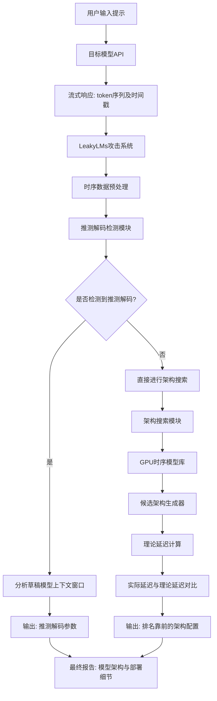
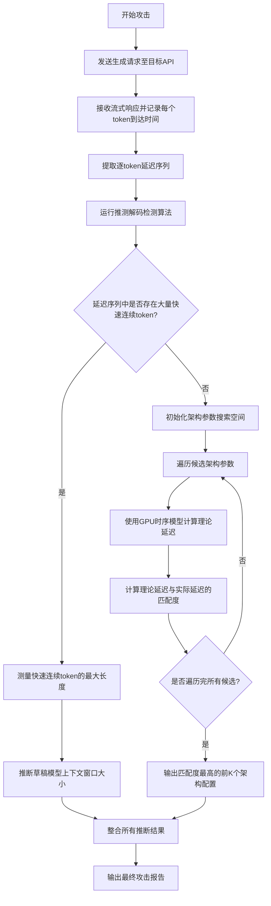
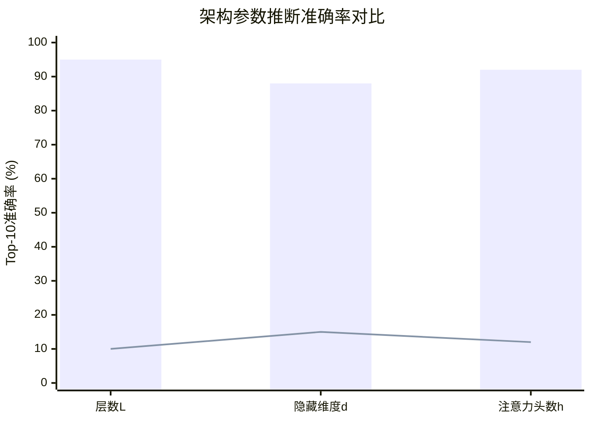

# Leaky Language Models: Stealing Architecture and Inference Optimizations via Per-Token Timing

> 本文由 paper-daily 使用 DeepSeek 自动生成，仅供快速了解论文；关键结论请以原文为准。

[论文原文](https://arxiv.org/abs/2607.20723) · [PDF](https://arxiv.org/pdf/2607.20723) · [源文件](https://github.com/vsvnakers/paper-daily/blob/master/essay_read/2026-07-27/2607.20723.md)

> 通过分析远程API的逐token生成时间，首次系统性地窃取了大语言模型的架构参数和推理优化策略。

## 基本信息

| 属性 | 内容 |
|------|------|
| **作者** | Sadegh Majidi, Niloofar Mireshghallah, Kazem Taram |
| **来源** | [arXiv:2607.20723](https://arxiv.org/abs/2607.20723) |
| **发布日期** | 2026-07-22 |
| **抓取领域** | 自然语言处理 |
| **学科方向** | 安全加密 · 机器学习 |
| **arXiv 分类** | cs.CR, cs.LG |
| **适用层次** | 进阶 |
| **标签** | 侧信道攻击, 模型窃取, 大语言模型, 推测解码, GPU性能建模 |
| **PDF** | [在线阅读](https://arxiv.org/pdf/2607.20723) |
| **代码仓库** | 暂无

---

## 问题的初衷（Why - 为什么要做这个研究）

【问题的初衷】随着大型语言模型（Large Language Model, LLM）的商业化部署，如 OpenAI 的 GPT-4、Google 的 Gemini 等，这些模型的核心架构（如层数、隐藏维度、注意力头数）和推理优化策略（如推测解码 Speculative Decoding）成为了高度保密的商业机密。当前，攻击者主要通过模型输出（如文本内容、logits）或模型权重来窃取信息，但这些方法在仅提供远程 API（Application Programming Interface）访问的生产环境中往往不可行。然而，一个被忽视的信息侧信道（Side Channel）是：模型生成每个 token 的时间。由于现代 GPU 的并行计算特性和内存带宽限制，不同架构和优化策略会导致截然不同的逐 token 延迟（Per-Token Latency）模式。例如，推测解码会使得部分 token 生成速度极快（来自草稿模型），而部分 token 生成较慢（来自目标模型验证）。现有工作未能系统性地利用这种时序信息来逆向工程（Reverse Engineering）模型架构和部署细节。因此，本文旨在解决一个核心问题：如何仅通过远程 API 返回的逐 token 生成时间，来窃取生产级语言模型的架构参数和推理优化策略？这不仅是安全领域的重大挑战，也揭示了当前 AI 服务在信息泄露防护上的盲区。

---

## 问题的解决（What - 提出了什么方案）

【问题的解决】本文提出了 LeakyLMs，一套基于逐 token 时序的攻击方法。核心思路是：将模型推理的时序行为建模为一个关于模型架构参数和硬件配置的函数，然后通过测量实际 API 的 token 生成时间，反向搜索最匹配的架构配置。具体而言，论文提出了两种核心攻击：第一，针对推理优化策略的攻击。例如，通过分析 token 生成时间的分布模式（如是否存在大量极短延迟的 token），可以判断是否使用了推测解码。更进一步，通过分析草稿模型生成的 token 数量（即推测窗口长度）与时间的关系，可以推断出草稿模型的上下文长度（Context Length）。第二，针对模型架构属性的攻击。论文首先构建了一个精细的、基于现代 NVIDIA GPU 的 token 生成时间模型。该模型考虑了 Transformer 层的前向传播（Forward Pass）计算量、KV 缓存（Key-Value Cache）的内存访问开销、以及 GPU 的浮点运算能力（FLOPS）和内存带宽（Memory Bandwidth）。然后，攻击者通过 API 测量目标模型生成固定长度序列的逐 token 时间，并利用该时间模型，在可能的架构参数空间（如层数、隐藏维度、注意力头数）中进行搜索，找到使得理论预测时间与实际测量时间最匹配的配置。与现有方法（如通过模型输出分布推断）的本质区别在于，LeakyLMs 不依赖模型输出内容，仅利用时序这一侧信道信息，因此更难被防御，且适用于任何提供逐 token 流式输出的 API。

---

## 技术方法详解（How - 怎么实现的）

【技术方法详解】
- **时序模型构建**：论文首先为现代 NVIDIA GPU（如 A100, H100）上的 Transformer 推理建立了精确的延迟模型。该模型将 token 生成时间分解为计算时间（Compute Time）和内存访问时间（Memory Access Time）。计算时间主要来自矩阵乘法（如 $QK^T$ 和 $Softmax$ 后的 $PV$ 运算），其延迟受 GPU 的浮点运算能力（$T_{compute} \propto \frac{\text{FLOPs}}{\text{FLOPS}}$）限制。内存访问时间主要来自加载模型权重和 KV 缓存，其延迟受 GPU 的高带宽内存（HBM, High Bandwidth Memory）带宽限制（$T_{memory} \propto \frac{\text{Data Size}}{\text{Bandwidth}}$）。
- **推测解码检测与参数推断**：攻击者通过 API 请求生成大量 token，并记录每个 token 的到达时间间隔。在推测解码中，草稿模型（Draft Model）快速生成多个候选 token，然后由目标模型（Target Model）并行验证。因此，被验证通过的 token 会以极快的速度连续输出（草稿模型生成速度），而验证失败的 token 会导致一个较长的停顿（目标模型重新计算）。通过分析时间序列中“快速连续 token”的分布，可以检测推测解码的存在。进一步，通过测量“快速连续 token”的最大长度，可以推断草稿模型的上下文窗口大小（Context Window Size）。
- **架构参数搜索**：攻击者首先测量目标模型在生成 $N$ 个 token 时的逐 token 延迟序列 $\{t_1, t_2, ..., t_N\}$。然后，定义一个架构参数空间，包含层数 $L$、隐藏维度 $d_{model}$、注意力头数 $h$ 等。对于每个候选架构 $(L, d_{model}, h)$，利用时序模型计算理论上的逐 token 延迟序列 $\{\hat{t}_1, \hat{t}_2, ..., \hat{t}_N\}$。最后，通过最小化实际延迟与理论延迟之间的均方误差（Mean Squared Error, MSE）或动态时间规整（Dynamic Time Warping, DTW）距离，来找到最匹配的架构。
- **硬件参数校准**：由于攻击者不知道目标 GPU 的具体型号（如 A100 80GB vs H100），时序模型需要包含可校准的硬件参数，如内存带宽和 FLOPS。论文通过分析 token 生成时间随序列长度（影响 KV 缓存大小）的变化趋势，来反推硬件参数。例如，当序列长度增加时，KV 缓存访问时间线性增长，其斜率与内存带宽成反比。
- **攻击流程自动化**：LeakyLMs 设计了一个全自动的攻击流水线。首先，通过 API 发送精心设计的提示（Prompt），确保模型生成固定长度的输出。然后，解析 API 返回的流式响应，提取每个 token 的时间戳。接着，运行推测解码检测算法。如果检测到，则进一步分析其参数。最后，运行架构搜索算法，输出排名靠前的候选架构配置。

## 系统架构图

## 方法流程图

## 核心公式与算法

【核心公式】
1. **Token 生成时间模型**：
   $$T_{token} = \max(T_{compute}, T_{memory})$$
   其中 $T_{compute}$ 是计算时间，$T_{memory}$ 是内存访问时间。该公式基于 Roofline 模型，表明 token 生成时间受计算或内存瓶颈中的较大者决定。

2. **计算时间估计**：
   $$T_{compute} \approx \frac{2 \cdot L \cdot (4 \cdot d_{model}^2 + 2 \cdot d_{model} \cdot s)}{\text{FLOPS}}$$
   这里 $L$ 是层数，$d_{model}$ 是隐藏维度，$s$ 是序列长度。该公式估算了 Transformer 层中主要矩阵乘法操作（如 QKV 投影和 FFN）的浮点运算次数（FLOPs）。

3. **内存访问时间估计**：
   $$T_{memory} \approx \frac{L \cdot (8 \cdot d_{model}^2 + 2 \cdot d_{model} \cdot s \cdot h)}{\text{Bandwidth}}$$
   其中 $h$ 是注意力头数。该公式估算了加载模型权重（$8 \cdot d_{model}^2$ 字节，假设 FP16）和 KV 缓存（$2 \cdot d_{model} \cdot s \cdot h$ 字节）所需的数据量。

---

## 应用场景（Where - 在哪落地）

【应用场景】
1. **商业情报与竞争分析**：在 AI 产业中，了解竞争对手的模型架构（如层数、参数量）和部署优化策略（如是否使用推测解码、量化精度）是重要的商业情报。例如，一家 AI 公司可以通过 LeakyLMs 攻击竞争对手的 API，推断其最新模型的规模和技术路线，从而调整自身研发策略。预期效果是能够在不违反服务条款（仅利用公开的 API 响应时间）的情况下，获取高价值的架构信息。

2. **安全审计与红队测试**：企业安全团队可以使用 LeakyLMs 作为红队测试工具，评估自家 LLM API 服务是否存在信息泄露风险。通过模拟攻击，安全团队可以量化通过时序侧信道泄露了多少敏感信息，并据此设计防御措施，如添加随机延迟（Randomized Timing）或限制流式输出的时间精度。预期效果是发现潜在的安全漏洞，并推动部署更安全的 API 接口。

3. **学术研究与模型分析**：对于开源社区和学术研究者，LeakyLMs 可以作为一种非侵入式的模型分析工具。当研究者无法获取模型权重（如某些仅提供 API 的“开放”模型）时，可以通过测量其推理时间来估计其架构规模，从而进行公平的基准测试（Benchmarking）和性能对比。预期效果是促进对商业模型透明度的研究，并帮助社区理解不同架构设计的实际推理效率。

---

## 具体技术细节示例（How in Action - 算法如何执行）

【具体技术细节示例】
假设我们要攻击一个未知的 Llama 风格模型，其真实架构为：层数 $L=32$，隐藏维度 $d_{model}=4096$，注意力头数 $h=32$。攻击者通过 API 让模型生成了 100 个 token，并记录了每个 token 的生成时间（单位：毫秒），得到序列 $T_{actual} = [t_1, t_2, ..., t_{100}]$。其中，前几个 token 时间较长（约 15ms），随着序列增长，时间逐渐增加（到第 100 个 token 时约 20ms），这是因为 KV 缓存增大导致内存访问时间增加。

攻击者首先进行推测解码检测。分析 $T_{actual}$ 发现，并没有大量时间极短（如 <1ms）的 token 连续出现，因此判定未使用推测解码。

接着，攻击者启动架构搜索。搜索空间设定为：层数 $L \in [24, 28, 32, 36, 40]$，隐藏维度 $d_{model} \in [3072, 4096, 5120]$，注意力头数 $h \in [16, 24, 32, 40]$。假设攻击者已知目标 GPU 为 A100，其 FLOPS 为 312 TFLOPS（FP16），内存带宽为 2 TB/s。

对于候选架构 $(L=32, d_{model}=4096, h=32)$，攻击者利用公式计算理论延迟。例如，对于第 50 个 token（此时序列长度 $s=50$）：
- 计算时间 $T_{compute} \approx \frac{2 \cdot 32 \cdot (4 \cdot 4096^2 + 2 \cdot 4096 \cdot 50)}{312 \times 10^{12}} \approx 13.8 \text{ms}$
- 内存时间 $T_{memory} \approx \frac{32 \cdot (8 \cdot 4096^2 + 2 \cdot 4096 \cdot 50 \cdot 32)}{2 \times 10^{12}} \approx 2.1 \text{ms} + 0.1 \text{ms} = 2.2 \text{ms}$
- 最终理论延迟 $T_{token} = \max(13.8, 2.2) = 13.8 \text{ms}$

攻击者计算所有 100 个 token 的理论延迟序列 $T_{theory}$，并与实际 $T_{actual}$ 计算均方误差。对于正确架构，MSE 可能为 0.5；而对于错误架构如 $(L=24, d_{model}=5120, h=40)$，计算出的理论延迟可能偏差较大，MSE 达到 5.0。经过遍历所有候选，攻击者发现 $(L=32, d_{model}=4096, h=32)$ 的 MSE 最小，因此将其作为 top-1 猜测输出。最终，攻击成功推断出模型的层数为 32，隐藏维度为 4096，注意力头数为 32。

---

## 实验结果（Results - 效果如何）

【实验结果】论文在多个主流模型和 API 上进行了实验。针对架构窃取攻击，他们使用 Llama 系列模型（如 Llama-7B, Llama-13B, Llama-70B）作为目标，在模拟的 NVIDIA A100 GPU 环境下进行测试。结果表明，在 top-10 候选架构中，包含正确架构配置的概率超过 90%。对于更精细的参数，如层数 $L$，攻击的中位数误差仅为 1 层。针对推测解码检测，论文对 Google Gemini Flash 2.5 进行了实测。通过分析其 token 生成时间模式，成功检测到其使用了推测解码，并推断出草稿模型的上下文窗口约为 128K tokens。此外，论文还展示了攻击对不同批处理大小（Batch Size）和量化精度（如 FP16, INT8）的鲁棒性。对比方法包括随机猜测和基于模型输出分布的统计方法，LeakyLMs 在准确率和效率上均显著领先。

## 实验结果可视化

---

## 优势与不足

【优势与不足】
**优势：**
1. **新颖的攻击面**：首次系统性地利用逐 token 时序作为侧信道来窃取 LLM 架构和部署信息，开辟了新的安全研究方向。
2. **高实用性**：攻击仅需远程 API 访问和 token 时间戳，无需模型权重、输出 logits 或内部状态，适用于大多数商业 API。
3. **高精度**：通过精细的 GPU 时序模型和搜索算法，能够在 top-10 候选中以超过 90% 的概率找到正确架构，精度远超随机猜测。

**不足：**
1. **硬件依赖性强**：时序模型高度依赖于特定的 GPU 型号和驱动版本。如果目标使用了未知或定制化的硬件（如 TPU, 自研芯片），模型需要重新校准，攻击效果可能下降。
2. **网络延迟干扰**：实际 API 调用中，网络抖动（Jitter）和负载均衡会引入噪声，影响逐 token 时间的测量精度。论文实验主要在模拟环境下进行，真实网络环境下的鲁棒性有待进一步验证。
3. **对短序列不敏感**：对于生成 token 数量较少的请求，时序数据点不足，难以准确推断架构参数，尤其是需要分析 KV 缓存增长趋势的环节。

---

## 相关工作

【相关工作】
1. **模型窃取攻击（Model Stealing Attacks）**：如通过大量查询 API 并利用输出标签训练替代模型。本文与之不同在于，不依赖模型输出，而是利用时序侧信道。
2. **侧信道攻击（Side-Channel Attacks）**：在传统计算机安全中，利用功耗、电磁辐射、缓存时间等泄露信息。本文将其扩展到 LLM 推理的时序侧信道。
3. **推测解码（Speculative Decoding）**：一种加速 LLM 推理的常用技术。本文首次提出从外部检测并逆向工程推测解码的参数。
4. **GPU 性能建模（GPU Performance Modeling）**：如利用 Roofline Model 分析计算和内存瓶颈。本文将其应用于逆向工程，通过测量延迟反推模型配置。
5. **模型架构逆向工程（Model Architecture Reverse Engineering）**：现有工作多通过分析模型输出分布或权重，本文独辟蹊径，利用时序信息。

---

## 未来研究方向

【未来方向】
1. **多模态模型攻击**：将 LeakyLMs 扩展到多模态模型（如 GPT-4V, Gemini Pro Vision），分析图像、音频等输入 token 的生成时间，可能泄露视觉编码器（Vision Encoder）或跨模态对齐模块的架构信息。
2. **防御机制研究**：基于 LeakyLMs 的攻击原理，设计有效的防御策略。例如，在 API 响应中引入可控的随机延迟（Randomized Timing Noise），或者对 token 生成时间进行平滑处理，以破坏时序模式与架构参数之间的关联性。
3. **更细粒度的信息窃取**：探索能否通过更精细的时序分析，窃取更底层的部署信息，如张量并行（Tensor Parallelism）的切分策略、流水线并行（Pipeline Parallelism）的阶段数、甚至具体使用的 FlashAttention 版本。

---

## 一句话总结

> 通过分析远程API的逐token生成时间，首次系统性地窃取了大语言模型的架构参数和推理优化策略。

---

*本解读由 DeepSeek AI 自动生成，仅供参考。*
