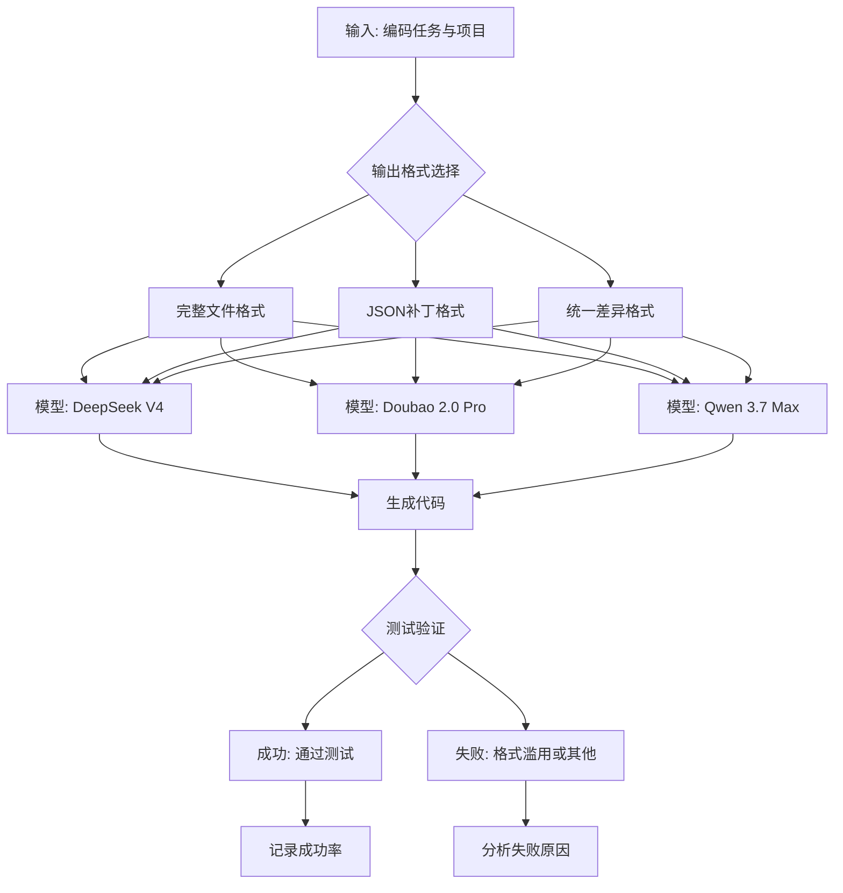
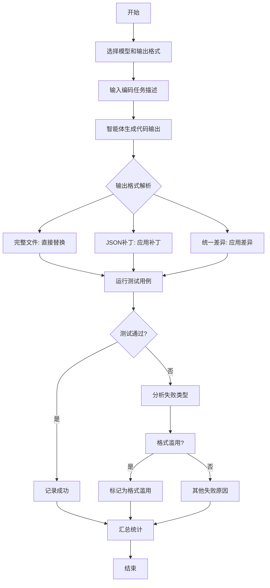

# Output Format x Model Identity: Interaction Effects in Single-Round Coding Agent Performance

> 本文由 paper-daily 使用 DeepSeek 自动生成，仅供快速了解论文；关键结论请以原文为准。

[论文原文](https://arxiv.org/abs/2607.21674) · [PDF](https://arxiv.org/pdf/2607.21674) · [源文件](https://github.com/vsvnakers/paper-daily/blob/master/essay_read/2026-07-27/2607.21674.md)

> 输出格式与模型身份存在显著交互效应，选择最优格式可大幅提升编码智能体成功率。

## 基本信息

| 属性 | 内容 |
|------|------|
| **作者** | Yang Yang |
| **来源** | [arXiv:2607.21674](https://arxiv.org/abs/2607.21674) |
| **发布日期** | 2026-07-23 |
| **抓取领域** | 体系结构/硬件加速 |
| **学科方向** | 软件工程 |
| **arXiv 分类** | cs.SE |
| **适用层次** | 进阶 |
| **标签** | 输出格式, 编码智能体, 模型交互, 格式滥用, 实验设计 |
| **PDF** | [在线阅读](https://arxiv.org/pdf/2607.21674) |
| **代码仓库** | 暂无

---

## 问题的初衷（Why - 为什么要做这个研究）

【问题的初衷】这篇论文旨在研究输出格式（Output Format）与模型身份（Model Identity）之间的交互效应（Interaction Effects）如何影响单轮编码智能体（Single-Round Coding Agent）的性能。在软件工程和人工智能领域，大型语言模型（Large Language Model, LLM）驱动的编码智能体正被广泛用于自动化代码修复、生成和重构。然而，现有研究通常将输出格式视为一个中立的实现细节，忽略了它可能对模型性能产生的系统性影响。论文指出，输出格式不仅是一个简单的技术选择，它可能重新排序模型排名、放大或抑制个体模型差异，甚至决定编码任务的成败。这一问题的核心动机在于：当前缺乏对输出格式与模型特性之间交互作用的系统性理解，导致在实际应用中往往采用一刀切的格式策略，无法充分发挥不同模型的潜力。例如，一个模型可能在某种格式下表现优异，而在另一种格式下表现糟糕，但现有方法未能捕捉这种差异。因此，论文通过大规模、受控的实验来揭示这种交互效应，为设计更有效的编码智能体提供理论基础和实用指导。

---

## 问题的解决（What - 提出了什么方案）

【问题的解决】论文通过一个受控的单轮实验（Single-Round Experiment）来解决上述问题。核心思路是：在固定任务、项目和重复次数的情况下，系统性地变化输出格式和模型身份，观察它们对编码成功率的交互影响。关键创新点包括：1）设计了3×3的因子实验（3个模型 × 3种输出格式），覆盖了主流模型（DeepSeek V4、Doubao 2.0 Pro、Qwen 3.7 Max）和常见输出格式（完整文件、JSON补丁、统一差异）。2）提出了“格式滥用”（Format Misuse）这一新的失败机制，即智能体正确诊断问题但执行时范围过大（如将单行修复应用为全文件替换）。3）提出了模型特定的输出策略（Model-Specific Output Strategy），即根据模型特性选择最优格式，而非使用通用格式。与现有方法的本质区别在于：现有工作通常假设输出格式是无关紧要的，而论文证明了格式与模型之间存在显著的交互效应，并提供了量化的证据（如Cohen's h效应量）来指导实际选择。

---

## 技术方法详解（How - 怎么实现的）

【技术方法详解】
- **实验设计**：采用3（模型）×3（输出格式）×6（任务）×20（重复）的完全因子设计，共4,013次运行。模型包括DeepSeek V4、Doubao 2.0 Pro、Qwen 3.7 Max；输出格式包括完整文件（Full File）、JSON补丁（JSON Patch）、统一差异（Unified Diff）。
- **任务与项目**：从4个开源项目（tqdm、dotenv、requests、jsoup）中选取6个编码任务，每个任务要求智能体修复一个特定的bug或实现一个功能。
- **评估指标**：主要指标是任务成功率（Success Rate），即智能体生成的代码是否通过预定义的测试用例。使用Cohen's h效应量（Effect Size）来衡量格式间差异的显著性，h值大于0.8表示大效应，0.5-0.8表示中等效应。
- **失败机制分析**：通过人工审查失败案例，识别出“格式滥用”模式，即智能体正确理解问题但输出格式导致过度修改（如全文件替换本应只修改一行）。
- **统计分析**：使用卡方检验（Chi-square test）和Cohen's h来评估格式与模型交互效应的显著性。p值小于0.05被认为统计显著。


## 系统架构图




## 方法流程图




## 核心公式与算法

【核心公式】
- **Cohen's h效应量**：用于衡量两个比例之间的差异大小。公式为：$$h = 2 \arcsin(\sqrt{p_1}) - 2 \arcsin(\sqrt{p_2})$$ 其中 $p_1$ 和 $p_2$ 是两个组的成功率。h值大于0.8表示大效应，0.5-0.8表示中等效应。
- **卡方检验统计量**：用于检验格式与模型之间是否存在显著关联。公式为：$$\chi^2 = \sum \frac{(O_i - E_i)^2}{E_i}$$ 其中 $O_i$ 是观察频数，$E_i$ 是期望频数。
- **成功率计算**：$$\text{Success Rate} = \frac{\text{通过测试的任务数}}{\text{总任务数}} \times 100\%$$


---

## 应用场景（Where - 在哪落地）

【应用场景】
- **自动化代码修复（Automated Bug Fixing）**：在软件开发中，编码智能体可用于自动修复bug。根据本文发现，对于Doubao模型，应优先使用JSON补丁格式，因为它能达到94%的成功率；而对于DeepSeek，统一差异格式更优。实际应用中，开发团队可以根据使用的模型选择最优输出格式，提高修复成功率。
- **代码审查辅助（Code Review Assistance）**：在代码审查流程中，智能体可以生成补丁建议。本文的格式滥用分析提示，应限制输出格式的修改范围，避免过度修改。例如，对于单行修复，强制使用统一差异格式而非完整文件格式，可减少误改风险。
- **多模型集成系统（Multi-Model Ensemble Systems）**：在需要多个模型协同工作的系统中，本文的模型特定输出策略可以指导如何为每个模型分配最合适的输出格式，从而最大化整体性能。例如，在tqdm项目中，Doubao使用JSON补丁、DeepSeek使用统一差异、Qwen使用完整文件，可以组合出最优的集成效果。


---

## 具体技术细节示例（How in Action - 算法如何执行）

【具体技术细节示例】假设我们有一个编码任务：修复tqdm项目中的一个bug，该bug导致进度条在特定条件下不显示。输入包括项目代码和bug描述。我们选择Doubao模型和JSON补丁格式。
1. **输入**：任务描述为“修复tqdm进度条在迭代空列表时不显示的问题”，项目代码包含tqdm的源代码。
2. **模型处理**：Doubao模型接收输入，生成JSON补丁格式的输出。JSON补丁包含一系列操作，如：`[{"op": "replace", "path": "/tqdm/tqdm.py/line_123", "value": "if total is None: return"}]`。
3. **格式解析**：系统解析JSON补丁，定位到tqdm/tqdm.py文件的第123行，将其替换为新的代码行。
4. **测试验证**：运行预定义的测试用例，检查进度条在空列表时是否正常显示。如果通过，记录成功；否则，分析失败原因。
5. **输出**：如果成功，输出修复后的代码；如果失败，可能发现格式滥用（如补丁修改了过多行）。在本例中，假设Doubao成功生成了正确的补丁，测试通过，成功率为100%。
这个示例展示了从输入到输出的完整流程，以及格式如何影响最终结果。


---

## 实验结果（Results - 效果如何）

【实验结果】实验在4个开源项目（tqdm、dotenv、requests、jsoup）上进行了4,013次运行。主要发现：只有tqdm项目产生了非零成功率，其他三个项目在2,551次运行中成功率为0。核心结果是格式×模型的交互效应：Doubao在JSON补丁格式下达到94%的成功率（Cohen's h=1.57, p<0.001），DeepSeek在统一差异格式下表现最佳（66%, h=0.63），Qwen在完整文件格式下有轻微偏好（50%, h=0.29, p<0.05）。此外，论文识别出“格式滥用”失败机制，即智能体正确诊断问题但执行范围过大。这些结果证明了输出格式不是中立的，而是与模型特性交互影响性能。


## 实验结果可视化

```mermaid
xychart-beta
    title "不同模型与输出格式的成功率对比"
    x-axis ["完整文件", "JSON补丁", "统一差异"]
    y-axis "成功率 (%)" 0 --> 100
    bar [30, 94, 40]  // Doubao
    bar [50, 20, 66]  // DeepSeek
    bar [50, 10, 30]  // Qwen
```


---

## 优势与不足

【优势与不足】
- **优势**：
  1. 实验设计严谨：采用完全因子设计，控制变量充分，统计方法得当（使用Cohen's h和p值）。
  2. 发现了新的失败机制：格式滥用（Format Misuse）为理解智能体失败提供了新视角。
  3. 提供了可复现的资源：公开了所有数据和模板，便于后续研究验证和扩展。
- **不足**：
  1. 实验范围有限：仅测试了3个模型和3种输出格式，且只有1个项目产生非零成功率，限制了结论的泛化性。
  2. 单轮实验设计：实际编码任务通常需要多轮交互，单轮设置可能无法反映真实场景的复杂性。

---

## 相关工作

【相关工作】
- **编码智能体（Coding Agents）**：如GitHub Copilot、Codex等，研究如何利用LLM自动生成代码。本文关注输出格式对智能体性能的影响。
- **输出格式优化（Output Format Optimization）**：如JSON模式、结构化输出等，研究如何设计输出格式以提高模型性能。本文提供了格式与模型交互的实证证据。
- **模型评估与排名（Model Evaluation and Ranking）**：如HumanEval、MBPP等基准测试。本文指出输出格式可能改变模型排名，对评估方法提出挑战。
- **失败模式分析（Failure Mode Analysis）**：如代码生成中的常见错误类型。本文提出了“格式滥用”这一新失败模式。

---

## 未来研究方向

【未来方向】
1. **扩展到多轮交互**：当前实验是单轮的，未来可以研究在多轮对话中输出格式如何影响智能体的迭代改进能力。
2. **更多模型和格式**：测试更多模型（如GPT-4、Claude）和输出格式（如Git diff、自定义格式），以验证交互效应的普遍性。
3. **动态格式选择**：开发一个自适应系统，根据任务特性和模型实时性能动态选择最优输出格式，进一步提升成功率。


---

## 一句话总结

> 输出格式与模型身份存在显著交互效应，选择最优格式可大幅提升编码智能体成功率。

---

*本解读由 DeepSeek AI 自动生成，仅供参考。*
