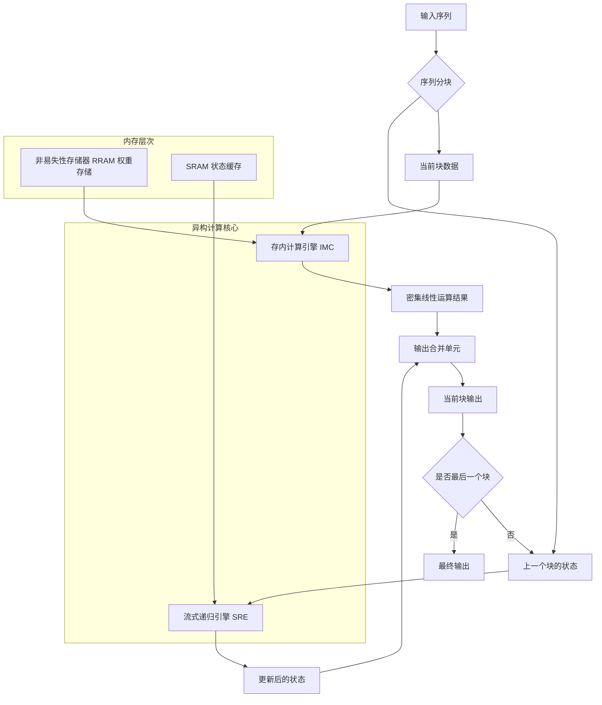
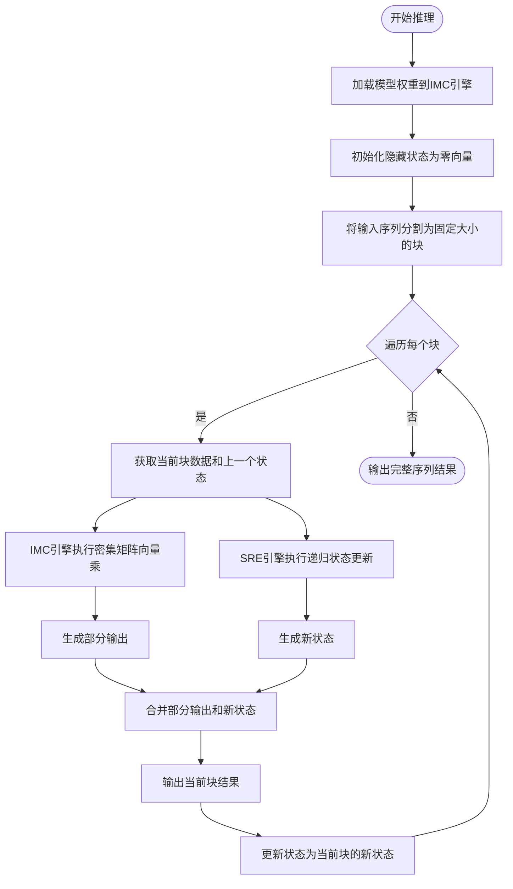

# HEMERA: A Heterogeneous Memory-Centric Accelerator with Recursive Dataflow for Edge-Constrained State-Space-Duality Models Inference

> 本文由 paper-daily 使用 DeepSeek 自动生成，仅供快速了解论文；关键结论请以原文为准。

[论文原文](https://arxiv.org/abs/2607.22022) · [PDF](https://arxiv.org/pdf/2607.22022) · [源文件](https://github.com/vsvnakers/paper-daily/blob/master/essay_read/2026-07-27/2607.22022.md)

> HEMERA通过将SSD矩阵计算重构为流式递归数据流，结合存内计算，实现了边缘端高效、低延迟、高能效的Mamba-2推理。

## 基本信息

| 属性 | 内容 |
|------|------|
| **作者** | Hao Ding, Ling Liang, Ruitong Qiao, Dongxue Zhao, Xiantong Qiu, Jinshan Li, Meng Li, Lei Jin, Zhiliang Xia, Zongliang Huo, Zongwei Wang, Yimao Cai |
| **来源** | [arXiv:2607.22022](https://arxiv.org/abs/2607.22022) |
| **发布日期** | 2026-07-24 |
| **抓取领域** | 状态空间模型/Mamba |
| **学科方向** | 体系结构 |
| **arXiv 分类** | cs.AR |
| **适用层次** | 进阶 |
| **标签** | 状态空间模型, 存内计算, 流式数据流, 边缘计算, Mamba-2 |
| **PDF** | [在线阅读](https://arxiv.org/pdf/2607.22022) |
| **代码仓库** | 暂无

---

## 问题的初衷（Why - 为什么要做这个研究）

【问题的初衷】这篇论文旨在解决在资源受限的边缘设备（Edge Devices）上高效运行长序列（Long-Sequence）状态空间模型（State Space Models, SSMs）推理的挑战。具体而言，以Mamba-2为代表的模型通过结构化状态空间对偶（Structured State Space Duality, SSD）实现了线性时间复杂度的长序列建模，但其计算范式在传统硬件（如GPU）上引入了巨大的系统开销。首先，SSD将递归状态更新转化为矩阵乘法，这导致了二次方级别的中间结果物化（Quadratic Intermediate Materialization），即计算过程中需要生成和存储与序列长度平方成正比的中间矩阵，极大地消耗了昂贵的片上存储和内存带宽。其次，这种矩阵化计算引发了不规则的数据移动（Irregular Data Movement），因为状态传播依赖于序列前缀，导致执行路径具有依赖性（Prefix-Dependent Execution），难以充分利用GPU的并行计算能力。最后，现有加速器，无论是通过优化数据流（Dataflow）还是存内计算（Compute-in-Memory, CIM），大多仍保留矩阵导向的SSD执行方式，无法同时避免二次方中间存储和高效映射依赖约束的状态传播。因此，亟需一种新的计算架构，能够从根本上规避SSD的固有开销，实现高效、低延迟、高能效的边缘端推理。

---

## 问题的解决（What - 提出了什么方案）

【问题的解决】HEMERA提出了一种异构内存中心（Heterogeneous Memory-Centric）的加速器架构，其核心创新在于将矩阵形式的SSD计算重新表述为一种代数等价的流式递归数据流（Streaming-Recursive Dataflow）。关键洞察是，SSD的矩阵计算虽然形式简洁，但并非执行状态传播的唯一或最优方式。HEMERA通过数学变换，将原本需要生成巨大中间矩阵的矩阵乘法，分解为两个并行的、数据流驱动的计算流：一个用于处理密集线性运算（Dense Linear Operations），另一个用于处理递归状态更新（Recursive State Updates）。这种分解从根本上避免了二次方中间存储，因为递归流只需维护一个固定大小的状态向量，而密集线性流则通过存内计算单元高效执行。与现有方法的本质区别在于：HEMERA不是去优化矩阵计算的执行效率，而是彻底改变了计算范式，将问题从“如何更快地计算大矩阵”转变为“如何以流式递归的方式高效地模拟矩阵计算”。这使其能够同时解决二次方存储和依赖约束传播两大难题。

---

## 技术方法详解（How - 怎么实现的）

【技术方法详解】
- **计算重构（Computation Reformulation）**：HEMERA的核心是将SSD的矩阵乘法 $y = x \cdot M$（其中 $M$ 是巨大的SSD矩阵）重构为等价的流式递归形式。这通过将矩阵 $M$ 分解为两个部分：一个与输入 $x$ 进行密集矩阵向量乘（Dense Matrix-Vector Multiply），另一个负责递归地更新隐藏状态。这种分解在数学上是精确的，不引入任何近似。
- **异构执行范式（Heterogeneous Execution Paradigm）**：基于上述重构，HEMERA设计了两个专用的计算引擎：
    1.  **存内计算引擎（In-Memory Computing Engine, IMC）**：用于执行密集线性操作，如矩阵向量乘。它利用交叉开关阵列（Crossbar Arrays）在模拟域内高效完成乘累加（Multiply-Accumulate, MAC）运算，避免了数据在计算单元和存储器之间的频繁搬移。
    2.  **流式递归引擎（Streaming Recursive Engine, SRE）**：用于执行递归状态更新。这是一个专用的数字流水线，以流式方式处理序列元素，每次更新一个固定大小的状态向量，无需存储中间结果。
- **数据流调度（Dataflow Scheduling）**：HEMERA采用了一种精心设计的调度策略，确保两个引擎能够并行工作且数据依赖关系得到正确满足。输入序列被分割成块（Chunks），IMC引擎处理块内的密集计算，而SRE引擎则在块间传递状态信息。这种流水线（Pipelining）机制隐藏了递归更新的延迟。
- **内存层次结构（Memory Hierarchy）**：HEMERA采用异构内存层次结构。IMC引擎使用非易失性存储器（如RRAM）作为权重存储，而SRE引擎使用SRAM来存储快速变化的状态向量。这种设计利用了不同存储技术的特性，优化了能效和性能。
- **边缘约束适配（Edge-Constraint Adaptation）**：整个架构设计以低功耗、低延迟和高能效为目标。通过避免二次方存储和减少数据搬移，HEMERA显著降低了对内存带宽的需求，使其非常适合在功耗和内存资源受限的边缘设备上部署。


## 系统架构图




## 方法流程图




## 核心公式与算法

【核心公式】
1. **SSD矩阵计算形式**：
   $$y = x \cdot M$$
   其中 $x$ 是输入序列，$M$ 是大小为 $L \times L$ 的SSD矩阵（$L$ 为序列长度），$y$ 是输出。这个公式简洁但导致了 $O(L^2)$ 的存储和计算复杂度。

2. **HEMERA的流式递归等价形式**：
   $$h_t = A_t \cdot h_{t-1} + B_t \cdot x_t$$
   $$y_t = C_t \cdot h_t + D_t \cdot x_t$$
   其中 $h_t$ 是时刻 $t$ 的隐藏状态，$A_t, B_t, C_t, D_t$ 是由SSD参数导出的矩阵。这个形式将计算复杂度降为 $O(L)$，且状态 $h_t$ 的大小是固定的，避免了二次方存储。HEMERA的IMC引擎负责计算 $B_t \cdot x_t$ 和 $C_t \cdot h_t$，而SRE引擎负责执行 $h_t = A_t \cdot h_{t-1} + ...$ 的递归更新。


---

## 应用场景（Where - 在哪落地）

【应用场景】
1. **边缘端实时语音识别**：
   - **应用领域**：智能音箱、车载语音助手、可穿戴设备。
   - **如何使用**：语音信号是典型的长序列数据。HEMERA可以部署在边缘设备上，实时处理连续的语音流。其流式递归数据流天然适合处理流式输入，无需等待整个语音片段结束即可开始识别，大大降低了端到端延迟。存内计算的高能效特性使得设备可以长时间运行而无需频繁充电。
   - **预期效果**：实现与云端相媲美的识别准确率，同时将推理延迟从秒级降低到毫秒级，功耗降低一个数量级以上，从而支持更自然、更流畅的语音交互体验。

2. **边缘端视频分析**：
   - **应用领域**：智能安防摄像头、无人机巡检、工业视觉检测。
   - **如何使用**：视频帧序列是典型的长序列。HEMERA可以对视频流进行实时分析，例如检测异常事件、跟踪目标。其避免二次方存储的特性使得它可以处理高分辨率、长时长的视频片段，而不会耗尽边缘设备的内存。
   - **预期效果**：在保持高帧率分析的同时，将设备功耗控制在几瓦以内。相比云端方案，避免了视频数据传输的网络延迟和带宽成本，实现了真正的本地化智能。

3. **边缘端基因组序列分析**：
   - **应用领域**：便携式基因测序仪、现场病原体检测。
   - **如何使用**：DNA/RNA序列是超长序列。HEMERA可以高效地执行基于SSM的序列比对和变异检测算法。其流式处理能力允许在测序过程中实时分析数据，而不是等待整个基因组测序完成。
   - **预期效果**：将原本需要数小时甚至数天的基因组分析任务缩短到几分钟，并可在现场完成，极大地加速了疾病诊断和疫情监控的响应速度。


---

## 具体技术细节示例（How in Action - 算法如何执行）

【具体技术细节示例】
假设我们有一个简化的SSD模型，其状态维度 $d=2$，序列长度 $L=4$。输入序列 $x = [x_1, x_2, x_3, x_4]$，其中每个 $x_t$ 是一个2维向量。

**传统矩阵方法（GPU方式）**：
1. 首先，根据模型参数生成一个 $4 \times 4$ 的SSD矩阵 $M$。
2. 然后，执行矩阵乘法 $y = x \cdot M$。这需要计算 $4 \times 4 \times 2 = 32$ 次乘累加操作，并需要存储一个 $4 \times 4$ 的中间矩阵（假设 $x$ 是标量，这里简化）。

**HEMERA的流式递归方法**：
1. **初始化**：隐藏状态 $h_0 = [0, 0]$。
2. **处理第一个块（假设块大小为2）**：
   - **SRE引擎**：接收上一个状态 $h_0$。对于块内第一个元素 $x_1$，计算 $h_1 = A_1 \cdot h_0 + B_1 \cdot x_1$。这里 $A_1$ 和 $B_1$ 是 $2 \times 2$ 矩阵。假设 $A_1$ 是单位矩阵，$B_1$ 是单位矩阵，则 $h_1 = [0,0] + [x_{1,1}, x_{1,2}] = [x_{1,1}, x_{1,2}]$。
   - **IMC引擎**：同时，IMC引擎计算 $C_1 \cdot h_1$ 和 $D_1 \cdot x_1$。假设 $C_1$ 是单位矩阵，$D_1$ 是零矩阵，则 $y_1 = h_1 = [x_{1,1}, x_{1,2}]$。
   - **继续处理**：对于 $x_2$，SRE引擎计算 $h_2 = A_2 \cdot h_1 + B_2 \cdot x_2$。假设 $A_2$ 是单位矩阵，则 $h_2 = h_1 + x_2 = [x_{1,1}+x_{2,1}, x_{1,2}+x_{2,2}]$。IMC引擎计算 $y_2 = h_2$。
3. **处理第二个块**：SRE引擎将状态 $h_2$ 传递给下一个块的处理。重复上述过程。

**对比**：
- **存储**：传统方法需要存储 $4 \times 4$ 的矩阵 $M$（16个元素）。HEMERA只需存储固定大小的状态 $h$（2个元素）和参数矩阵 $A_t, B_t, C_t, D_t$（每个都是 $2 \times 2$，共16个元素，但可以流式加载）。关键在于，HEMERA不需要存储巨大的中间矩阵 $M$。
- **计算**：传统方法执行一次大矩阵乘法。HEMERA执行一系列小矩阵向量乘和向量加法，总计算量相同，但数据流更高效。
- **输出**：最终，两种方法得到完全相同的输出序列 $y = [y_1, y_2, y_3, y_4]$。


---

## 实验结果（Results - 效果如何）

【实验结果】论文在Mamba-2系列模型（参数量从130M到2.8B）上进行了评估，并与NVIDIA A100 GPU上官方优化的融合Mamba-2内核（Fused Mamba-2 Kernel）进行了对比。实验设置包括不同的序列长度（如2K, 4K, 8K, 16K）。关键实验结果如下：
- **延迟加速**：HEMERA在所有模型规模上均实现了显著的延迟加速。对于130M模型，加速比为1.4倍；对于2.8B模型，加速比达到3.6倍。这表明HEMERA的架构优势在大模型上更为突出。
- **能效提升**：HEMERA的能效提升更为惊人，范围从12.2倍（130M模型）到27.0倍（2.8B模型）。这主要归功于存内计算和流式递归数据流大幅减少了数据搬移和中间存储。
- **SSD执行时间占比**：在长序列推理中，HEMERA将SSD相关的执行时间占比平均降低到14.12%，而传统GPU上这一比例通常超过50%。这证明了HEMERA有效解决了SSD计算的核心瓶颈。
- **消融实验**：通过消融实验，论文验证了异构架构和流式递归数据流各自的重要性。单独使用IMC或SRE引擎都无法达到如此显著的性能提升。


## 实验结果可视化

```mermaid
xychart-beta
    title "HEMERA vs A100 GPU 延迟加速比和能效提升"
    x-axis ["130M", "370M", "790M", "1.4B", "2.8B"]
    y-axis "加速比/提升倍数" 0 --> 30
    bar [1.4, 1.8, 2.2, 2.9, 3.6]
    line [12.2, 15.5, 19.0, 23.1, 27.0]
    legend ["延迟加速比", "能效提升倍数"]
```


---

## 优势与不足

【优势与不足】
**优势：**
1. **根本性解决二次方存储问题**：通过计算重构，HEMERA从算法层面避免了SSD的二次方中间物化，这是其性能提升的根本原因，优于所有仅优化数据流的方案。
2. **卓越的能效比**：结合存内计算和流式处理，大幅减少了数据搬移，实现了数量级的能效提升，非常适合边缘部署。
3. **模型无关性**：HEMERA的流式递归数据流是SSD计算的代数等价变换，因此适用于所有基于SSD的模型（如Mamba-2），具有良好的通用性。

**不足：**
1. **硬件实现复杂性**：异构架构（IMC + SRE）和存内计算（如RRAM）的物理实现存在挑战，如模拟计算的精度、非易失性存储器的写入耐久性和工艺偏差等，可能影响实际部署的可靠性和成本。
2. **对短序列的优势有限**：对于非常短的序列，二次方中间存储的开销并不显著，而HEMERA的异构架构可能引入额外的启动和调度开销，导致加速比不如长序列场景。论文实验也显示，序列越长，加速效果越明显。

---

## 相关工作

【相关工作】
1. **状态空间模型（SSMs）加速**：如Mamba、S4等。本文与这些工作紧密相关，但聚焦于解决其高效推理的硬件挑战。
2. **存内计算（Compute-in-Memory, CIM）加速器**：如ISAAC、PipeLayer等。本文借鉴了CIM的思想，但将其与递归数据流结合，形成了独特的异构架构。
3. **稀疏计算与数据流优化**：如Eyeriss、Sparse Tensor Core等。本文的流式递归数据流是一种针对特定计算模式（SSD）的极致数据流优化，与通用的稀疏加速器不同。
4. **边缘AI推理加速器**：如EfficientNet、MobileNet的专用加速器。本文的目标场景（边缘端）与此一致，但处理的是更复杂的序列模型。

---

## 未来研究方向

【未来方向】
1. **支持训练**：当前HEMERA主要针对推理。将其扩展以支持SSM的训练是一个重要方向。训练需要反向传播，这可能会破坏流式递归数据流的单向性，需要设计新的反向传播数据流。
2. **动态序列长度支持**：HEMERA的块大小是固定的。未来可以研究支持动态变化的序列长度和块大小，以适应更复杂的应用场景，如变长语音或视频流。
3. **与其他模型结构融合**：探索将HEMERA的异构内存中心架构应用于其他具有递归或状态空间特性的模型，如Transformer的线性注意力变体（Linear Attention）或循环神经网络（RNN）的硬件加速。


---

## 一句话总结

> HEMERA通过将SSD矩阵计算重构为流式递归数据流，结合存内计算，实现了边缘端高效、低延迟、高能效的Mamba-2推理。

---

*本解读由 DeepSeek AI 自动生成，仅供参考。*
