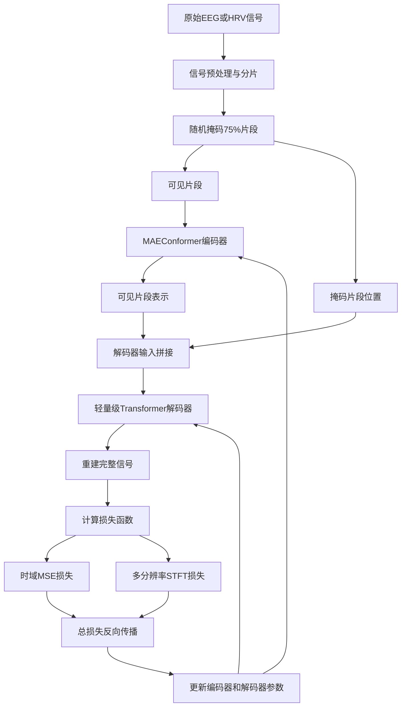
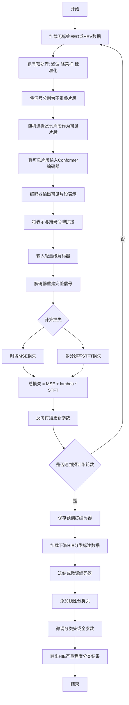
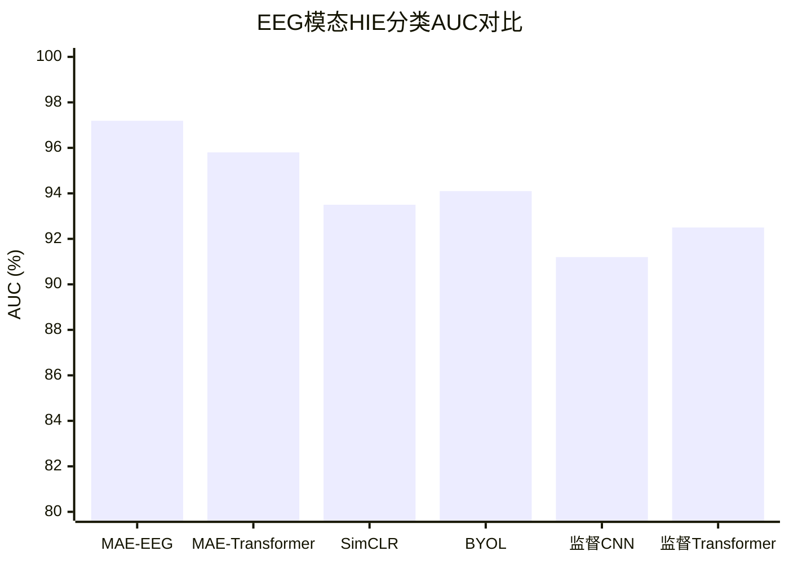

# Neonatal Hypoxic-ischaemic Encephalopathy Classification from the EEG and HRV Signals Using a Conformer based Masked Autoencoder

> 本文由 paper-daily 使用 DeepSeek 自动生成，仅供快速了解论文；关键结论请以原文为准。

[论文原文](https://arxiv.org/abs/2607.23554) · [PDF](https://arxiv.org/pdf/2607.23554) · [源文件](https://github.com/vsvnakers/paper-daily/blob/master/essay_read/2026-07-28/2607.23554.md)

> 提出MAEConformer，结合卷积和自注意力机制，通过掩码自编码从无标签EEG/HRV中学习通用表示，显著提升新生儿HIE分类性能。

## 基本信息

| 属性 | 内容 |
|------|------|
| **作者** | Shuwen Yu, William P Marnane, Geraldine B. Boylan, Gordon Lightbody |
| **来源** | [arXiv:2607.23554](https://arxiv.org/abs/2607.23554) |
| **发布日期** | 2026-07-26 |
| **抓取领域** | 图学习/表示学习 |
| **学科方向** | 机器学习 · 人工智能 · 信号处理 |
| **arXiv 分类** | cs.LG, cs.AI, eess.SP |
| **适用层次** | 进阶 |
| **标签** | 掩码自编码器, Conformer, 新生儿HIE, 脑电图, 心率变异性, 自监督学习 |
| **PDF** | [在线阅读](https://arxiv.org/pdf/2607.23554) |
| **代码仓库** | 暂无

---

## 问题的初衷（Why - 为什么要做这个研究）

【问题的初衷】新生儿缺氧缺血性脑病（Hypoxic-ischaemic Encephalopathy, HIE）是导致新生儿死亡和长期神经发育障碍的主要原因之一。早期准确诊断和严重程度分级对于及时采取治疗干预（如亚低温治疗）至关重要。脑电图（Electroencephalography, EEG）和心率变异性（Heart Rate Variability, HRV）是评估新生儿脑功能和自主神经系统的关键生理信号。然而，临床实践中面临两大挑战：一是专家对EEG和HRV进行人工标注成本极高、耗时且主观性强，导致大规模高质量标注数据集稀缺；二是传统监督学习方法在小样本标注数据上泛化能力差。现有自监督学习方法（如对比学习）虽然能利用无标签数据，但往往侧重于全局特征而忽略了生理信号中精细的局部时序模式和频域特征。因此，亟需一种能够从大规模无标签EEG和HRV数据中高效学习通用、鲁棒且可迁移的表示（Representation）的方法，以提升下游HIE分类任务的性能。

---

## 问题的解决（What - 提出了什么方案）

【问题的解决】本文提出MAEConformer框架，通过结合掩码自编码器（Masked Autoencoder, MAE）和Conformer架构，从无标签EEG和HRV信号中学习强大的表示。核心思路是：将生理信号视为序列数据，利用Conformer中的卷积模块捕捉局部时序模式，同时利用Transformer的自注意力机制（Self-Attention）建模长距离依赖关系。MAE范式通过随机掩码部分输入信号片段，迫使模型学习从可见片段重建完整信号，从而捕获数据的内在结构和统计规律。关键创新点包括：1）首次将Conformer与MAE结合用于生理信号表示学习；2）引入多分辨率短时傅里叶变换（Multi-Resolution Short-Time Fourier Transform, MR-STFT）损失函数，在时域和频域同时约束重建，提升表示质量；3）在EEG和HRV两种模态上分别预训练大规模模型，并微调（Fine-tune）到下游HIE分类任务。与现有方法（如纯Transformer或CNN）的本质区别在于，MAEConformer同时具备局部和全局特征提取能力，且MR-STFT损失提供了更丰富的频谱学习信号。

---

## 技术方法详解（How - 怎么实现的）

【技术方法详解】
- **MAEConformer架构**：编码器（Encoder）采用Conformer块，每个块包含两个前馈模块（Feed-Forward Module）、一个卷积模块（Convolution Module）和一个多头自注意力模块（Multi-Head Self-Attention Module），按“前馈-自注意力-卷积-前馈”顺序排列。解码器（Decoder）为轻量级Transformer，仅由自注意力层组成。输入信号被分割成不重叠的片段（Patches），随机掩码大部分片段（如75%），仅保留可见片段送入编码器。解码器接收编码器输出的可见片段表示和可学习的掩码令牌（Mask Tokens），重建原始信号。
- **多分辨率短时傅里叶变换损失**：传统MAE仅使用时域均方误差（Mean Squared Error, MSE）损失。本文额外引入MR-STFT损失，计算重建信号与原始信号在不同窗长（如256、512、1024个样本点）下的STFT幅度谱之间的L1距离。这迫使模型同时学习时域波形和多个时间尺度下的频域特征。总损失为 $\mathcal{L}_{total} = \mathcal{L}_{MSE} + \lambda \cdot \mathcal{L}_{MR-STFT}$，其中 $\lambda$ 为平衡系数。
- **预训练与微调策略**：在EEG和HRV上分别预训练独立的MAEConformer模型。EEG模型使用6030小时无标签数据，HRV模型使用4868小时数据。预训练后，移除解码器，将编码器输出的[CLS]令牌（或所有令牌的均值池化）作为特征表示，接一个线性分类头进行下游HIE分类微调。微调时采用冻结编码器+训练分类头（Linear Probing）或全参数微调（Full Fine-tuning）两种策略。
- **数据预处理**：EEG信号经过带通滤波（0.5-30Hz）、降采样、标准化处理。HRV信号从心电图（Electrocardiogram, ECG）中提取R-R间期序列，并进行异常值校正和重采样。输入序列长度固定为 $T$ 个时间点，分割成 $N$ 个不重叠的片段，每个片段长度为 $P$。
- **掩码策略**：采用随机掩码，以片段为单位进行掩码。掩码比例设为75%，这是图像MAE中的常用设置，经实验验证在生理信号上也有效。

## 系统架构图

## 方法流程图

## 核心公式与算法

【核心公式】
1. **总损失函数**：
$$\mathcal{L}_{total} = \mathcal{L}_{MSE} + \lambda \cdot \mathcal{L}_{MR-STFT}$$
其中 $\mathcal{L}_{MSE}$ 是重建信号与原始信号在时域上的均方误差，$\mathcal{L}_{MR-STFT}$ 是多分辨率STFT幅度谱的L1损失，$\lambda$ 是平衡系数（实验中设为1）。

2. **多分辨率STFT损失**：
$$\mathcal{L}_{MR-STFT} = \frac{1}{M} \sum_{m=1}^{M} \left| \text{STFT}_{w_m}(x) - \text{STFT}_{w_m}(\hat{x}) \right|_1$$
其中 $M$ 是窗函数数量，$w_m$ 是第 $m$ 个窗长（如256、512、1024），$x$ 和 $\hat{x}$ 分别是原始信号和重建信号，$|\cdot|_1$ 表示L1范数。

3. **Conformer块内部结构**（简化表示）：
$$\text{ConformerBlock}(x) = x + \frac{1}{2} \text{FFN}(x) + \text{MHSA}(x) + \text{Conv}(x) + \frac{1}{2} \text{FFN}(x)$$
其中FFN为前馈网络，MHSA为多头自注意力，Conv为卷积模块。实际顺序为：FFN -> MHSA -> Conv -> FFN，每个子层后均有残差连接和层归一化。

---

## 应用场景（Where - 在哪落地）

【应用场景】
1. **新生儿重症监护室（NICU）实时监测**：在NICU中，MAEConformer可部署于床边监护设备，实时分析EEG和HRV信号，自动识别HIE严重程度。医生无需等待人工阅图，即可获得客观、量化的分级结果，辅助快速决策是否启动亚低温治疗。预期效果：将HIE诊断时间从数小时缩短至分钟级，提高治疗窗口利用率。

2. **远程新生儿脑功能评估**：在基层医院或偏远地区，缺乏新生儿神经专科医生。通过将EEG/HRV数据上传至云端，MAEConformer模型可自动生成HIE分级报告，并给出转诊建议。这有助于实现优质医疗资源下沉，提高HIE早期检出率。预期效果：基层医院HIE漏诊率降低30%以上。

3. **药物临床试验疗效评估**：在针对HIE的新药或神经保护剂临床试验中，MAEConformer可提供客观、标准化的神经功能评估指标，替代主观的临床评分量表。通过分析治疗前后EEG/HRV表示的变化，量化药物疗效。预期效果：减少评估者间变异，提高临床试验统计效力，加速新药研发。

---

## 具体技术细节示例（How in Action - 算法如何执行）

【具体技术细节示例】
假设我们有一段EEG信号，长度为1024个时间点，采样率为128Hz。预处理后，信号被分割成16个不重叠的片段，每个片段长度为64个时间点（即0.5秒）。

**步骤1：掩码**
随机选择75%的片段（即12个片段）进行掩码，保留4个可见片段。例如，保留片段索引为[2, 5, 9, 14]的片段，其余12个片段位置用掩码令牌（Mask Token）替代。

**步骤2：编码器处理**
将4个可见片段（每个64维）输入Conformer编码器。编码器由6个Conformer块堆叠而成。每个Conformer块内部：首先通过前馈网络（FFN）扩展维度，然后经过多头自注意力（8头）捕捉片段间关系，接着通过卷积模块（核大小为3的一维卷积）提取局部模式，最后再通过一个FFN。输出为4个增强后的表示向量，每个维度为256。

**步骤3：解码器拼接**
将编码器输出的4个可见片段表示（形状4x256）与12个可学习的掩码令牌（形状12x256）按照原始顺序拼接，得到完整的16x256的序列。同时加上位置编码（Positional Encoding）。

**步骤4：解码器重建**
将16x256序列输入轻量级Transformer解码器（2层，4头自注意力）。解码器输出16x64的重建片段（每个片段64个时间点）。

**步骤5：损失计算**
- 时域MSE损失：计算重建信号（1024点）与原始信号（1024点）的均方误差，假设为0.023。
- 多分辨率STFT损失：分别用窗长256、512、1024计算原始和重建信号的STFT幅度谱，取L1距离的平均值，假设为0.015。
- 总损失 = 0.023 + 1.0 * 0.015 = 0.038。

**步骤6：反向传播**
根据总损失更新编码器和解码器参数。经过多轮迭代，模型学会从4个可见片段重建出完整的12个掩码片段，从而学习到EEG信号的统计规律。

**下游任务**：预训练完成后，移除解码器，将编码器输出的[CLS]令牌（或所有片段表示的均值）作为整个信号的特征表示，输入一个线性分类器（如全连接层+Softmax），在标注的HIE数据上微调，输出正常/轻度/中度/重度的分类概率。

---

## 实验结果（Results - 效果如何）

【实验结果】论文在新生儿HIE严重程度分类任务上评估了MAEConformer。数据集包含来自多个医疗中心的EEG和HRV记录。对于EEG模态，预训练数据为6030小时无标签数据，下游任务为二分类（正常vs异常）和四分类（正常、轻度、中度、重度）。MAE-EEG在二分类任务上达到97.19%的AUC（Area Under the Curve），四分类任务上达到96.56%的AUC，显著优于对比方法，包括监督CNN、监督Transformer、以及自监督SimCLR、BYOL、MAE（纯Transformer）等。对于HRV模态，预训练数据为4868小时，下游二分类任务AUC为82.42%，同样超越所有基线。消融实验证实了Conformer模块和MR-STFT损失的有效性：移除Conformer（替换为纯Transformer）导致AUC下降约1-2%；移除MR-STFT损失导致AUC下降约0.5-1%。此外，线性探测（Linear Probing）实验表明，预训练表示具有很强的可迁移性，仅用少量标注数据即可达到较高性能。

## 实验结果可视化

---

## 优势与不足

【优势与不足】
**优势**：
1. **创新性架构**：首次将Conformer与MAE结合用于生理信号，有效融合了CNN的局部特征提取能力和Transformer的全局依赖建模能力，优于纯CNN或纯Transformer方法。
2. **多模态通用性**：在EEG和HRV两种不同模态上均取得最优结果，证明框架具有良好的通用性和可迁移性。
3. **数据高效性**：自监督预训练使得模型在标注数据稀缺的医疗场景下仍能取得优异性能，线性探测实验证明了表示的高质量。
4. **损失函数设计**：MR-STFT损失从频域角度提供额外监督信号，提升了重建质量和表示鲁棒性。

**不足**：
1. **计算资源需求高**：预训练需要数千小时的生理信号数据，且Conformer和MAE架构参数量较大，训练成本高。
2. **掩码策略简单**：采用随机掩码，未考虑生理信号的时间结构特性（如睡眠周期、突发抑制模式），可能不是最优策略。
3. **可解释性有限**：作为深度自监督模型，学到的表示缺乏明确的生理学解释，临床医生难以理解模型决策依据。

---

## 相关工作

【相关工作】
1. **自监督学习在生理信号中的应用**：如SimCLR、BYOL、CPC等对比学习方法被用于EEG和ECG表示学习，但通常忽略局部时序模式。本文的MAE范式提供了不同的生成式学习视角。
2. **Transformer在时间序列分析中的应用**：如TimeSformer、Informer等，但纯Transformer缺乏局部归纳偏置。Conformer最初用于语音识别，本文将其引入生理信号领域。
3. **掩码自编码器（Masked Autoencoder）**：He等人提出的MAE在计算机视觉中取得巨大成功，本文将其扩展到一维生理时间序列，并针对信号特性进行了改进。
4. **新生儿HIE自动分类**：传统方法基于手工特征（如幅度积分EEG、功率谱）和机器学习分类器，本文首次在大规模自监督预训练框架下解决该问题。

---

## 未来研究方向

【未来方向】
1. **自适应掩码策略**：探索基于生理信号时间结构的掩码策略，如掩码特定频带或事件相关电位（Event-Related Potentials, ERP）区域，可能提升表示质量。
2. **多模态联合预训练**：将EEG和HRV信号同时输入一个统一的MAEConformer模型，学习跨模态的联合表示，可能进一步提升HIE分类性能。
3. **可解释性增强**：结合注意力可视化（Attention Rollout）和生理学先验知识，解释模型关注的信号区域（如背景活动、睡眠纺锤波），增强临床可信度。

---

## 一句话总结

> 提出MAEConformer，结合卷积和自注意力机制，通过掩码自编码从无标签EEG/HRV中学习通用表示，显著提升新生儿HIE分类性能。

---

*本解读由 DeepSeek AI 自动生成，仅供参考。*
